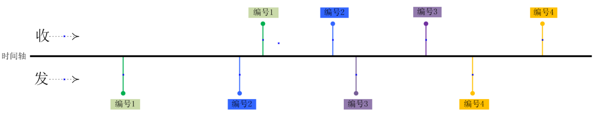
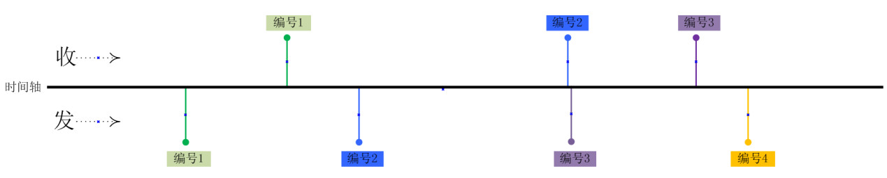

## TarsBenchmark二次开发介绍

tb工具可以直接[下载源码编译](build.md)，默认支持 [TARS协议](tars-guide.md) / [HTTP协议](http-guide.md) 2类service的压测，无需额外编写代码，十分简单方便，也很灵活拓展支持到第三类协议的压测。

### 新协议开发
如果你服务协议非TARS/HTTP，按照如下规范去适配开发新服务协议，也很容易实现目标服务高性能压测和实时反馈。工具通过动态注册机制来发现新协议，开发者通过实现{new}Protocol.h和{new}Protocol.cpp来完成服务的编解码，实现过程中要注意声明如下两个宏定义:DECLARE_DYNCREATE/IMPLEMENT_DYNCREATE(必须在cpp中声明)，三步搞定：

 - 1.参考httpProtocol继承Protocol协议类。
 - 2.实现input/encode/decode三个函数方法。
 - 3.实现初始化函数，截取命令行需要的参数。

```cpp
class httpProtocol : public Protocol
{
    DECLARE_DYNCREATE(httpProtocol)
public:
    httpProtocol() {}
    virtual ~httpProtocol() {}

    /**
     * @brief  初始化函数
     *
     * @param argc 参数个数
     * @param argv 参数内容
     *
     * @return 0成功, 其他失败
     */
    virtual int initialize(int argc, char** argv);

    /**
     * @brief  协议是否支持序号返回
     *
     * @return true: 支持; false: 不支持
     */
    virtual int isSupportSeq() { return false; }

    /**
     * @brief  判断收包是否完整
     *
     * @param buf  数据包指针
     * @param len  网络数据包长度
     *
     * @return int =0报文不完整; >0:实际报文长度; <0:出错，
     */
    virtual int input(const char *buf, size_t len);

    /**
     * @brief  HTTP协议打包
     *
     * @param buf  数据包指针
     * @param len  数据包长度
     * @param uniqId  全局唯一ID
     *
     * @return 0成功, <0: 失败 >0: 需要的buffer长度
     */
    virtual int encode(char *buf, int& len, int& uniqId);

    /**
     * @brief  HTTP协议解包
     *
     * @param buf  数据包指针
     * @param len  数据包长度
     * @param uniqId  全局唯一ID
     *
     * @return 0成功, 其他失败
     */
    virtual int decode(const char *buf, int len, int& uniqId);
};
```


在启动开发工作之前，你需要了解压测的目标服务属于那种模式, 通过实现isSupportSeq方法来指定，默认是无序模式:

**有序模式**
在本模式下压测客户端会按照指定速率匀速向目标服务器发送请求，不依赖服务端的上一次请求返回，在发送请求的时候，客户端会生成**全局唯一id**给服务端，服务端回包的时候会携带这个id给客户端，在接口函数通过uniqId传递，tb工具在encode会传递全局唯一id给新协议模块，decode时候将服务端返回的id通过重写uniqId给服务端。



**无序模式**
在该模式下一般服务端不回序号给客户端，压测客户端会低于指定速率匀速向目标服务器发送请求，强依赖服务端的返回，在发送下一个请求前必须收到上一个请求的响应或超时。以下图为例。

