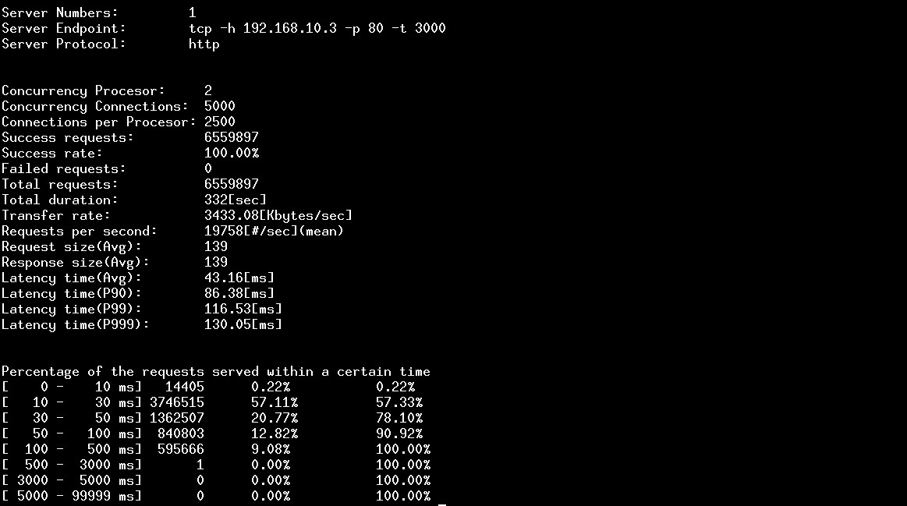

## Http协议用例压测指南

下面通过一个完整的例子介绍如何使用tb工具来实现压测自己的webserver。

以下步骤示例描述了如何tb启动压测，之后客户端持续发送Post请求到http服务器，服务端正确返回结果给tb客户端，压测完成后统计回包情况。

### 1.1. http压测启动例子
```text
./tb -n 2 -c 5000 -s 20000 -D 192.168.10.3 -P 80 -p http -i 10 -u "http://192.168.16.1/cgi-bin/proxy?cmd=test&f=json" -F aa.txt
```

http协议参数说明
```text
  -H(可选)             :设置Header内容，建议用""修饰
  -C(可选)             :设置Cookie内容，建议用""修饰
  -F(可选)             :Post请求内容文件，默认走GET请求
  -u(必填)             :目标URL地址
```

### 1.2. 压测停止
主动停止： ctrl+C or killall tb，等待数秒之后输出最终统计结果。<br/>
被动停止： 压测持续时间默认为1小时，1小时之后停止压测并输出统计结果，可以通过-I参数调节压测时间。


### 1.3. 压测结果显示
