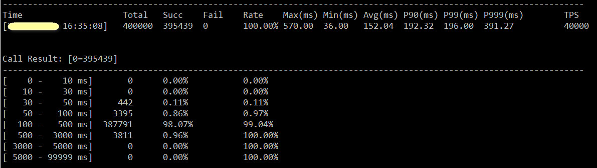

## Tars协议用例压测指南
> * [接口定义实例](#chapter-1)
> * [JSON协议使用](#chapter-2)
> * [自定义协议使用](#chapter-3)
> * [压测停止](#chapter-4)
> * [压测结果](#chapter-5)

tb工具支持两种协议(json协议和自定义协议)方式来压测目标tars service，一般推荐使用json协议。

以下步骤通过2个示例描述了如何使用tb客户端，之后持续发送test接口请求到服务端，服务端正确返回结果给tb客户端，tb周期性统计回包情况。


### 1.1. <span id="chapter-1"></span>接口定义实例

编写tars文件如下，Demo.tars：

```cpp
module tars
{
    struct DemoReq
    {
        0 require  string aa;
        1 optional int    bb;
        2 optional vector<byte>  cc;
    };

    struct DemoRsp
    {
        0 require  DemoReq  rr;
        1 optional bool     ok;
    };

    interface DemoObj
    {
        int test(int a, int b);
        int echo(DemoReq req, out DemoRsp rsp);
    };
};
```
### 1.2. <span id="chapter-2"></span>Json协议使用说明

##### 1.2.1. 用例文件生成

使用tars2case工具自动生成tb工具所需的输入文件，工具根据各interface的rpc函数生成各自的case结尾用例文件和desc结尾的描述文件，其中描述文件内容不许变动。
```text
/usr/local/tars/cpp/tools/tars2case --json Demo.tars --dir=benchmark

cd benchmark && ls
echo.case  echo.desc  test.case  test.desc
```

##### 1.2.2. 用例文件修改

  用例文件根据tars2json规则自动生成之后，用户可以根据场景需要修改用例文件Json内容，其中vector和map结构数据支持向上下增长，对于vector<byte>格式内容支持string和array两种方式输入，采用string需要将原串进行bin2hex转换。 此外，为了规避压测过程中的热key效应，避免后端请求落到同一台单机上，tb对tars结构中Number和string支持生成随机内容，通过如下两种随机方式(Value必须以string)。
 1. <范围随机值>用[1-100]表示，表示在1-100内随机出现, 必须是数字。
 2. <限定随机值>用[369,aaa,bbb]表示，表示在369,aaa,bbb中随机出现。

 **用例内容**: 例如echo接口
```json
{
   "req":"string val",
   "bb": "[100-10000]",
   "cc": "123456A5B6"
}
```

##### 1.2.3. 压测启动
```text
./tb -c 600 -s 6000 -D 192.168.31.1 -P 10505 -p json -S tars.DemoServer.DemoObj -M test -C test
```
tars协议参数说明
```text
  -S                   tars服务servant名称
  -M                   tars服务接口方法
  -C(可选)             用例和描述文件的前缀，默认用函数名
```

### 1.3. <span id="chapter-3"></span>自定义协议使用说明
##### </span>1.3.1. 用例文件生成

使用tars2case工具自动生成tb工具所需的用例，工具根据各interface的rpc函数生成各自的case，用户可以根据业务需要修改参数的值

```text
/usr/local/tars/cpp/tools/tars2case Demo.tars --dir=benchmark

cd benchmark && ls
echo.case  test.case
```

##### </span> 1.3.2. 用例编写说明

文件分为上下部分，用"#"开头行分割，上半部分为RPC参数，下半部分为RPC调用参数的值，跟参数一一对应

- **参数帮助说明**：
 1. 输入参数使用"|"符号进行分割，即tars参数中的","替换为"|"
 2. struct的表示方法是:struct<tag require|optional 字段1,字段2,字段3...>,如果tag从0开始，直接字段1
 3. vector的表示方法是:vector<类型>
 4. map的表示方法:map<key类型,value类型>
 5. 2、3、4可以嵌套使用

- **参值帮助说明**：
 1. <strong>基本类型</strong>的随机值设置：
    <范围随机值>用[1-100]表示，表示在1-100内随机出现, 必须是数字
    <限定随机值>用[1,123,100]表示，表示在1,123,100中随机出现，可以是字符串
 2. 输入参数每个参数一行,也就是tars参数列表中","的地方换成回车
 3. struct的表示方法是:<字段值1,字段值2,字段值3...>
 4. vector的表示方法是:<值1,值2,值3...>
 5. map的表示方法:[key1=val1,key2=val2,key3=val3...]
 6. 3、4、5可以嵌套使用

- **例如**:
```text
vector<string>|struct<string, int>|map<string, string>
#######
<abc, def, tt, fbb>
<abc, 1>
[abc=def, dfd=bbb]
```

##### 1.3.3. 压测启动例子
```text
./tb -c 600 -s 6000 -D 192.168.31.1 -P 10505 -p tars -S tars.DemoServer.DemoObj -M test -C test.txt
```

tars协议参数说明
```text
  -S                   tars服务servant名称
  -M                   tars服务接口方法
  -C                   压测用例文件，详见[用例文件生成]和[用例编写说明]
```

### 1.4. <span id="chapter-4"></span>压测停止
主动停止： ctrl+C or killall tb，等待数秒之后输出最终统计结果。<br/>
被动停止： 压测持续时间默认为1小时，1小时之后停止压测并输出统计结果，可以通过-I参数调节压测时间。


### 1.5. <span id="chapter-5"></span>压测结果显示

