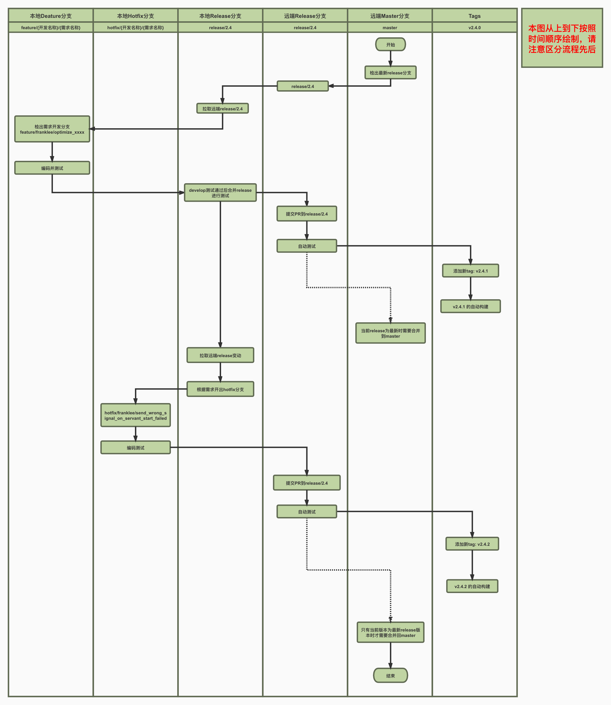

# Tars Framework Git合作规范

## 简介

[TarsFramework](https://github.com/TarsCloud/TarsFramework)项目中的TarsRegistry、TarsNode、TarsProperty...等应用依赖于[TarsCpp](https://github.com/TarsCloud/TarsCpp)项目，TarsCpp项目依赖于[TarsProtocol](https://github.com/TarsCloud/TarsProtocol)，[TarsWeb](https://github.com/TarsCloud/TarsWeb)为TarsFramework的Web管理端，为了更好的提供Tars的多版本支持和迭代，选定v2.4为Tars的第一个LTS版本，并在这第一个LTS版本中将TarsCpp、TarsProtocol、TarsWeb、TarsFramework四个项目的主版本和子版本进行统一。

## 版本规划

版本号定义：v`{主版本}`.`{子版本}`.`{build号}`

- 框架起始主版本为v2，子版本为4，子版本兼容的特性优化或bug修复视为一次build，如在v2.4.0基础上修复某个bug或优化了某个特性，版本号从v2.4.0升级为v2.4.1，用户可自行选择版本进行下载使用
- 根据团队内部规划，后续逐渐开放v2.5、v2.6等框架版本，原则上高版本尽量兼容低版本，不兼容时需要在版本发布时提供用户升级指南

### Git合作规范

首先欢迎各位志同道合的伙伴为社区贡献自己的力量，在源码合作时请遵循以下规范

1. 请先fork对应的GitHub仓库
2. 在开发之前请谨记，release/x.x为对应版本的发布分支，这个分支相当于单版本项目仓库的master分支
3. 务必在动手之前先拉取远端仓库对应release分支的最新变动到本地release分支，避免出现合并冲突
4. 请从本地对应版本的release分支检出一个feature分支进行功能开发，feature分支命名规范为：feature/`{Git用户名}`/`{需求名称}`，如：`feature/franklee/correct_error_message_on_property_table_missing`
5. 若是紧急修复，请检出hotfix分支，命名规范为：hotfix/`{Git用户名}`/`{需求名称}`，如：`hotfix/franklee/fix_wrong_typing_on_servant_status_enum_define`
5. 开发完成后请务必先对对应的feature或hotfix分支进行充分测试
6. 测试完成后，请将当前的feature分支合并到本地的release分支
7. 提交Pull Request到远端仓库release分支，并撰写必要说明

详细工作流见下图：

### 特别注意

1. 远端仓库：TarsCloud/xxx 的官方仓库
2. 远端分支：远端仓库TarsCloud/xxx下的分支
3. 本地仓库：从远端仓库fork出来的仓库
4. 本地分支：从本地仓库检出的分支
5. 为了保证master版本与最新版release分支同步，最新版本框架的release版本在发布完成后需要合并到master
6. 只有新开release版本才需要从master检出
7. 严禁合并除最新版release分支以外的分支到master