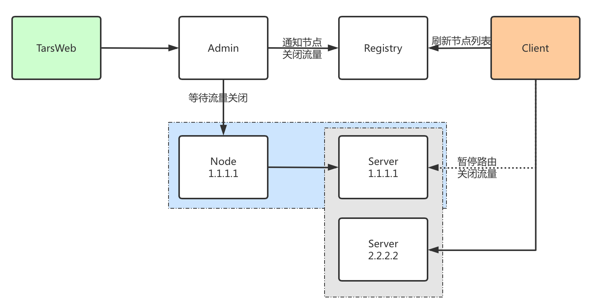
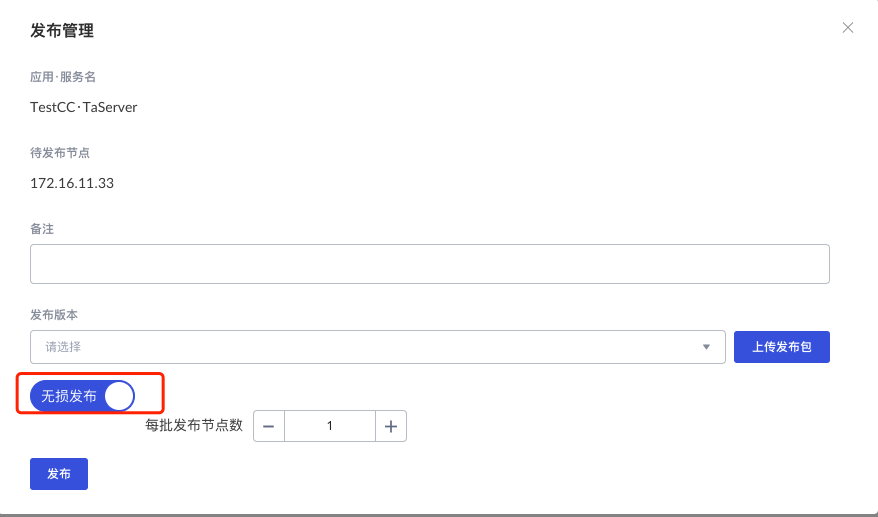
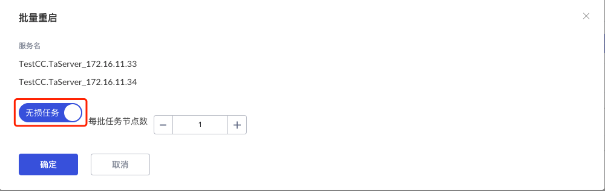
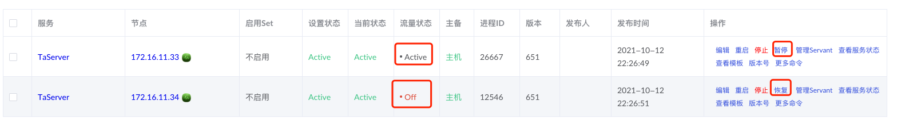

# TARS无损发布
---

## 无损发布介绍
无损发布就是在应用服务进行版本发布升级的时候，不会影响到正在使用该系统的用户。比如用户正在进行下单交易等，如果这个时候进行升级，系统升级往往需要重启，重启会导致正在进行交易下单的用户下单失败。如何做到版本升级不影响用户的使用，就是无损发布需要做的事情，不会因为系统发布重启导致正在使用该系统用户的请求失败或数据丢失。

## TARS无损发布实现
要让发布重启不影响到正在使用的用户，那么就需要再服务重启之前，把将要发布的节点请求流量路由到其他节点，然后对该节点进行发布。流程如下：

* tarsweb发起无损发布请求
* tarsAdmin通知tarsregistry关闭将要发布的业务服务节点流量
* 等待客户端刷新endpoint列表（75s）
* tarsAdmin调用tarsnode进行服务发布重启
* tarsAdmin通知tarsregistry恢复发布的节点

tars无损重启和无损发布原理一样，只是将发布的具体操作换成重启。

## TARS管理平台操作
服务发布时，默认普通发布，可以选择无损发布，无损发布时，可以选择每次批量任务个数， 这里建议每次个数不多于总结点数的1/2。

服务批量重启时，可以选择无损重启。

也可以手动关闭某个服务节点流量，比如需要定位某个节点的服务bug时，但是又不希望该节点进程重启，那么可以选择先手动关闭该节点流量。

