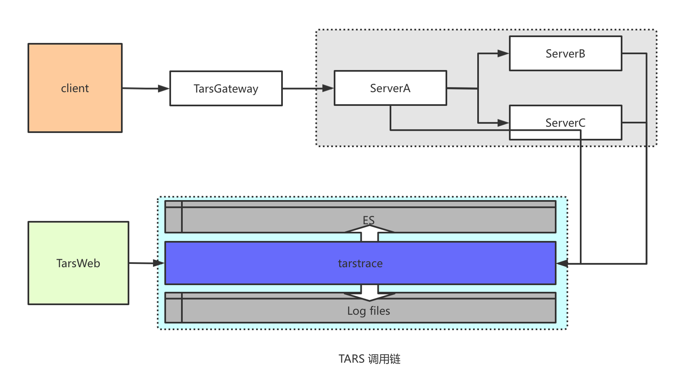
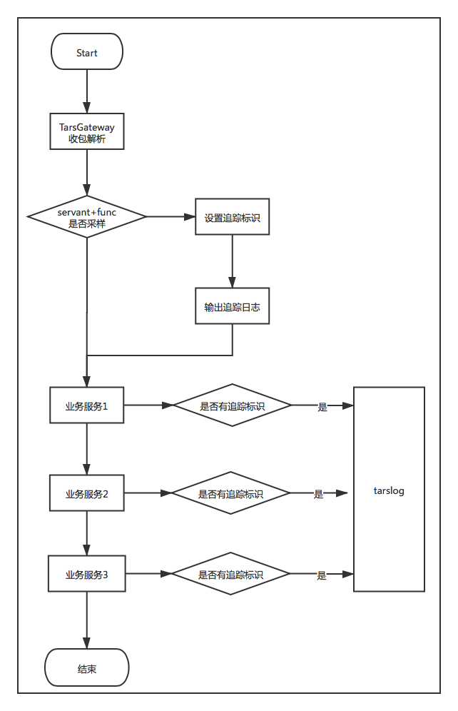
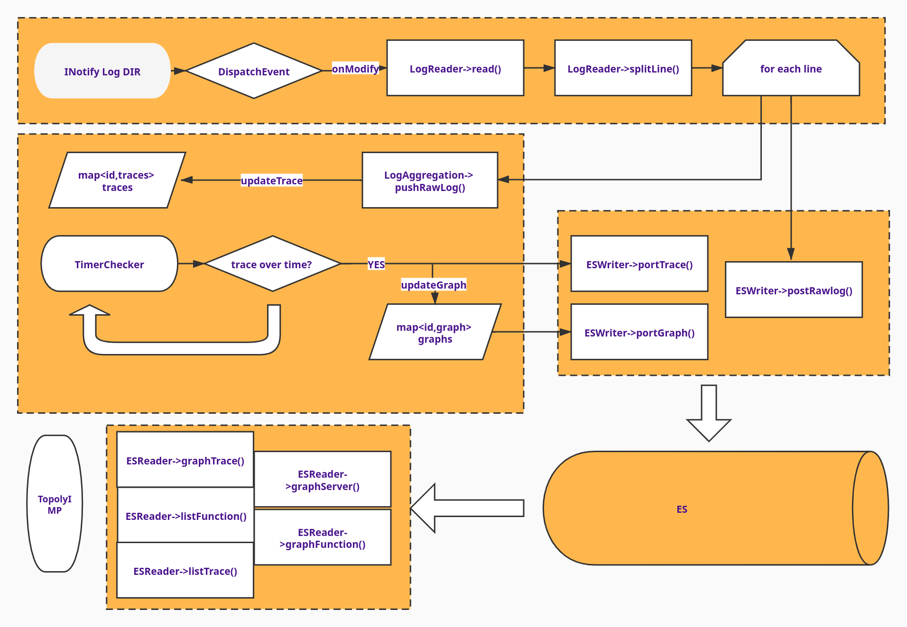
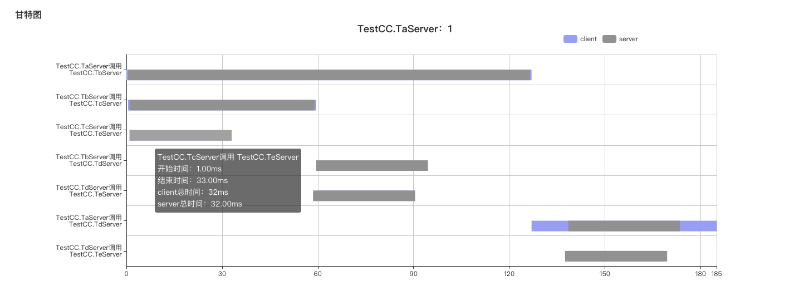
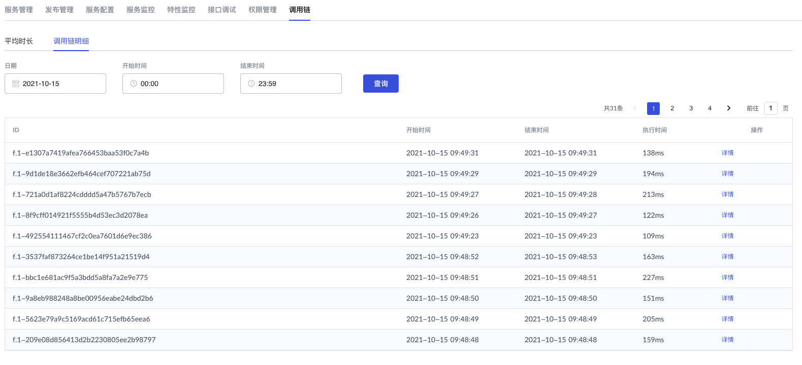
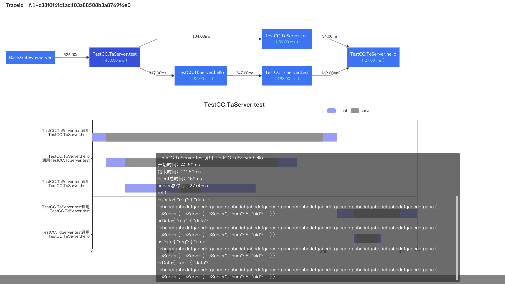

# TARS调用链介绍

## 1. 调用链概念简介
微服务调用链指的是经过一个全局惟一的ID，将分布在各个服务节点上的同一次请求串联起来，从而还原出原有的服务间调用关系，能够追踪系统问题、分析调用数据并统计各类系统指标。通过调用链，可以：	
* 定位系统瓶颈：通过记录分析出每一条链路上的具体每个调用的耗时，能快速定位整个系统的瓶颈点在哪里；
* 优化链路调用：通过调用链追踪能够分析某个业务调用所通过的全部调用路径，从而评估该逻辑是否合理。
* 接口问题排查：通过查看分析具体某个调用，可以看到该业务调用中所有的子接口调用耗时及调用出入参信息。

目前在TarsCpp>=3.0.1, TarsFramework>=3.0.1版本以上支持!

其他语言的支持调用链还在持续研发中, 敬请期待!
## 2. TARS调用链设计
TARS调用链是基于TARS框架，将各个微服务之间调用链路信息进行自动收集并分析，重建出一个业务调用全部子调用及其调用关系，并将结果在tarsweb上面可视化展示（包括各个子调用接口请求和响应参数）。TARS调用链整体架构如下图所示：



调用链追踪开启需要在调用入口开启调用追踪标识，目前TarsGateway >= v1.1.0 版本已经支持自动采样。下面以网关服务入口为例，描述业务服务调用链追踪信息具体收集流程：



信息统一通过tarslog写入特定日志文件，tarstrace监测该日志文件内容变化，准实时加载到内存，并进行链路分析，结果写入ES。tarstrace提供接口，供tarsweb进行可视化展示。
tarstrace服务逻辑如下：



## 3. 调用链实现
### 3.1 名词解释
* trace: 表示一个完整业务调用。它由一组Span组成，这一组Span必须具备相同的TraceID。
* span: 表示一次完整RPC调用，它由一组（4个）Annotation组成。
* annotation: 表示某个时间点发生的Event。有四种类型，分别是CS（Client-Send），SR(Server-Recive)，SS(Server-Send)，CR(Client-Receive).

### 3.2 调用链信息日志格式
调用链信息日志格式如下：
```
traceKey|annotation|主调服务|被调服务|接口名称|当前时间戳（ms）|RPC返回码|接口参数（json）格式|扩展字段

f.1-d7e7e5b1215b2c01905517bb0cc00c7e|030019ac000061406166af9400000006|*|ss||TestCC.TdServer|test|1634119572955|0|eyAicnNwIjogeyAibXNnIjogImFiY2RlZmdhYmNkZWZnYWJjZGVmZ2FiY2RlZmdhYmNkZWZnYWJjZGVmZ2FiY2RlZmdhYmNkZWZnYWJjZGVmZ2FiY2RlZmdhYmNkZWZnYWJjZGVmZ2FiY2RlZmdhYmNkZWZnYWJjZGVmZ2FiYyAoIFRhU2VydmVyICggVGJTZXJ2ZXIgKCBUY1NlcnZlciAoIFRlU2VydmVyIC0+IHJldHVybiBvayAgKSAgLT4gcmV0dXJuIG9rICApICwgICggVGRTZXJ2ZXIgKCBUZVNlcnZlciAtPiByZXR1cm4gb2sgICkgIC0+IHJldHVybiBvayAgKSAiLCAicmV0IjogMCB9LCAiIjogMCB9|
```
* traceKey：由参数输出控制信息、traceID、spanID、paramSpanID组成。 如：f.2-ee824ad0eb4dacf56b29d230a229c584|030019ac000010796162bc5900000021|030019ac000010796162bc5900000021。f.2为参数输出控制信息，包括输出开关及参数大小控制中间以.号分割，输出开关为一个字节，4bit从低位到高位分别控制CS、CR、SR、SS（annotation）参数输出，为1则输出对应参数，为0则不输出，这里f表示全部输出。2为输出参数长度控制，单位为KB，这里2表示参数最大长度为2KB，如果超过该长度，则不输出参数，而是固定输出{"trace_param_over_max_len":true}。traceID为一次业务调用的唯一标识，随机生成，全局唯一。spanID为一次微服务自调用ID，随机生成，全局唯一。paramSpanID为父调用ID，这里可选，可以不填以*代替。
* annotation：CS、CR、SR、SS、TS、TE中的一种，其中TS、TE为CS、CR的特殊种类，为调用链入口的特殊标识。
* 主调服务：本次RPC调用的客户端服务名称（Application.Server）。
* 被调服务：本次RPC调用的服务端服务obj（Application.Server.Obj）。
* 接口名称：本次RPC调用的functionName。
* RPC返回码：RPC调用底层iRet返回值。
* 接口参数（json）格式：根据traceKey中的参数控制信息判断是否输出接口的调用参数，将接口参数拼接成json格式，然后base64。
* 扩展字段：留做扩展。

### 3.3 采样策略
目前TarsGateway网关>v1.1 版本已经改造，实现自动采样，采样以servantName+funcName为单位进行按频率抽样，采样频率可配置。默认100ms采样一次。
如果业务调用不是走TarsGateway，那么业务服务也可以自己设置调用策略，开启调用链。下面是tarscpp调用链开启示例：
```
	// 采样控制判断
	int traceFlag = TraceControl::getInstance()->check(cb->getServantName(), tup.sFuncName);
	if (traceFlag >= 0 && traceFlag <= 15)
	{
		// 生成traceID
		string traceID = genTraceID(cb->getServantName(), tup.sFuncName, ServerConfig::LocalIp, requestId);
		stringstream ss;
		ss << std::hex << traceFlag << "." << TraceControl::getInstance()->getParamMaxLen() << "-" << traceID << "|";
		// 生成spanID
		string spanID = TC_UUIDGenerator::getInstance()->genID();
		string traceKey = ss.str() + spanID + "|" + spanID;
		// 设置trace标志
		SET_MSG_TYPE(tup.iMessageType, tars::TARSMESSAGETYPETRACE);
		// 通过STATUS_TRACE_KEY传递traceKey
		tup.status[ServantProxy::STATUS_TRACE_KEY] = traceKey;
		
		string _trace_param_;
		// 判断是否需要输出参数
		int _trace_param_flag_ = ServantProxyThreadData::needTraceParam(ServantProxyThreadData::TraceContext::EST_TS, traceKey, tup.sBuffer.size());
		if (ServantProxyThreadData::TraceContext::ENP_NORMAL == _trace_param_flag_)
		{
			if (tup.iVersion == tars::JSONVERSION)
			{
				_trace_param_.assign(tup.sBuffer.begin(), tup.sBuffer.end());
			}
			else
			{
				_trace_param_ = "tup-bin";
			}
		}
		else if(ServantProxyThreadData::TraceContext::ENP_OVERMAXLEN == _trace_param_flag_)
		{
			_trace_param_ = "{\"trace_param_over_max_len\":true, \"data_len\":" + TC_Common::tostr(tup.sBuffer.size()) + "}";
		}
		// 输出追踪日志信息
		TARS_TRACE(traceKey, TRACE_ANNOTATION_TS, ServerConfig::Application + "." + ServerConfig::ServerName, tup.sServantName, tup.sFuncName, 0, _trace_param_, "");
		// traceKey 存入回调
		cb->setTraceKey(traceKey); 
	}
```

### 3.4 追踪信息可视化
tarslog收集追踪信息后，对追踪数据准实时加载，并计算分析，还原出每个trace，然后对相同调用链路进行合并归集（server维度和function维度），展示出调用链路图及各个节点间调用的平均耗时，并以调用关系图和甘特图进行可视化展示。









## 4. 系统使用
### 4.1 系统版本要求
要使用tars调用链，框架需要升级，具体要求如下：
TarsFramework: v3.0.1
TarsCpp: v3.0.1
TarsGo: v1.2.0
TarsGateway: v1.1.0
采用以上版本后，系统默认支持了调用链追踪能力，业务服务如果不想要追踪信息，可以再tars2cpp 的选项加上--without-trace. 

### 4.2 框架升级部署
TarsFramework可以整体升级到v3.0.1，也可以手动升级tarslog服务。
tarslog服务部署，需要新增一个obj:`TopologyObj`，协议为`tars协议`，提供接口给tarsweb展示。
tarslog默认不开启调用链分析，如果需要开启，那么需要在tarslog的服务模板中配置es信息，用来存储调用链数据。
服务添加私有模板，内容如下：
```xml
<tars> 
 <elk>
    # 连接es的协议，不配置默认http
    protocol=http
    <nodes>
	   # es node 地址，如果不配置，那么调用链分析功能将不会工作。
       # 172.16.8.137:9200
    </nodes>
    log_dir=/usr/local/app/tars/remote_app_log/_tars_/_trace_
 </elk>
</tars>
```

### 4.3 网关配置
TarsGateway v>=v1.1.0版本开始支持了调用链追踪，可以通过配置参数进行开启，配置如下。
```xml
<main>
 	<trace>
	 # 调用链启用开关，如果为0则不进行调用链追踪
      onoff=1
	  # 采样时间间隔，单位ms，100 表示每个100ms采样一个请求（以服务+接口名为维度）
      default_interval=100
	  # 输出参数控制开关，具体含义建traceKey的说明
      default_trace_type=15
      # 输出参数最大控制长度，单位KB
      param_max_len=2
    </trace>
</main>
```

### 4.4 服务主动启用调用链
#### TarsCpp
服务启用调用链，主要包括以下步骤：

A. 自己组tars协议包的情况:
* 生成traceKey（包括 参数控制信息、traceID、spanID），traceID、spanID 可以采用tc_uuid_genarator生成;
* 设置MessageType：SET_MSG_TYPE(tup.iMessageType, tars::TARSMESSAGETYPETRACE);
* 传递traceKey: tup.status[ServantProxy::STATUS_TRACE_KEY] = traceKey;
* 输出trace日志：TARS_TRACE(...).

B. 主动发起tars接口调用的情况：
* ServantProxy 调用 tars_open_trace(bool traceParam=false) 来设置, traceParam表示是否输出接口调用参数，如果设置为true时 接口调用参数会转为json输出会影响性能。
  
例如：
```
	ParamReq req;
	req.uid = "autouid";
	req.num = num++;
	req.data = "beeno";
	ParamRsp rsp;
	//prx->test(req, rsp);
	prx->tars_open_trace()->test(req, rsp);
```  
#### TarsGo
服务启用调用链，主要包括以下步骤：

A. 自己组tars协议包的情况:
* 生成traceKey（包括 参数控制信息、traceID、spanID），traceID、spanID 可以采用`github.com/google/uuid`生成;
* 设置MessageType：req.IMessageType |= basef.TARSMESSAGETYPETRACE
* 传递traceKey: req.status[current.StatusTraceKey] = traceKey;
* 输出trace日志：tars.Trace(...)

B. 主动发起tars接口调用的情况：
* ctx 调用 current.TarsOpenTrace(ctx context.Context, traceParam bool) 来设置开启, traceParam表示是否输出接口调用参数，如果设置为true时 接口调用参数会转为json输出会影响性能。

例如：
```go
req := &ParamReq{
    Uid: "autouid",
    Num: num + 1,
    Data: "beeno",
}
var rsp ParamRsp
ctx := current.ContextWithTarsCurrent(context.Background())
current.TarsOpenTrace(ctx, true)
prx.TestWithContext(ctx, req, &rsp)
```  

### 4.5 服务配置
默认服务不用进行任何配置，只要上游服务已经启用调用链，那么后续调用将会自动支持（目前只支持同步调用、异步调用）。在接口调用参数输出控制这里，除了可以在入口进行控制，每个服务还可以在自己的服务模板中进行控制。
当这里的配置和入口配置不一致的情况下，按其中更大的取值生效。模板配置如下：
```
<tars>
	<application>
		<client>
			trace_param_max_len=2
		</client>
	</application>
</tars>
```

## 5. 下一步工作
### 5.1 其他语言支持
目前支持了TarsCpp 和 TarsGo，TarsJava和TarsNodejs已经有了实验室版本还需要，进一步完善， TarsPHP暂未支持。
### 5.2 网关完善
网关目前只支持按频率采样，后面会支持指定特定请求进行追踪，比如指定http头有X-GUID，可以指定X-GUID具体用户进行追踪。


