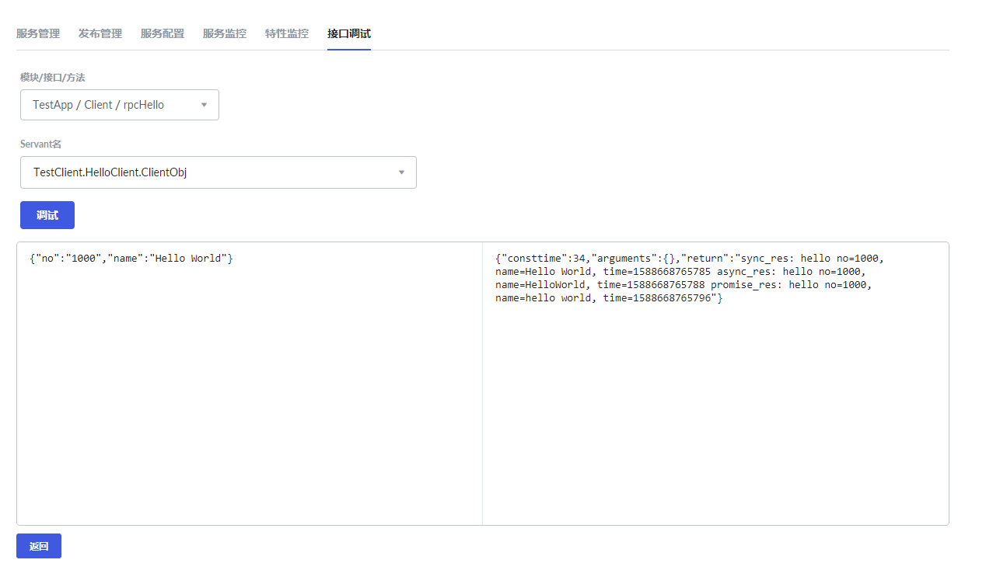

# Tars客户端快速入门


## Docker部署Tars
若尚未部署Tars服务，请参考tars-quick-start-server中的部署流程，[Docker部署Tars](./tars-quick-start-server.md)。


## 客户端开发

### 环境需求

- JDK 1.8或以上版本
- Maven 2.2.1或以上版本
- Spring Boot 2.0或以上版本


### 工程目录

```text
├── pom.xml
└── src
   └── main
       ├── java
       │   └── tars
       │       └── testapp
       │          ├── HelloPrx.java
       │          ├── HelloPrxCallback.java
       │          ├── App.java
       │          └── impl
       │                └── ClientServantImpl.java
       └── resources
           ├── hello.tars
           └── client.tars
       
```


### 依赖配置

在pom.xml文件中需要添加如下配置:

**spring boot及框架依赖**

```xml
    <properties>
        <spring-boot.version>2.0.3.RELEASE</spring-boot.version>
    </properties>

    <dependencyManagement>
        <dependencies>
            <dependency>
                <groupId>org.springframework.boot</groupId>
                <artifactId>spring-boot-dependencies</artifactId>
                <version>${spring-boot.version}</version>
                <type>pom</type>
                <scope>import</scope>
            </dependency>
        </dependencies>
    </dependencyManagement>

    <dependencies>
        <dependency>
            <groupId>com.tencent.tars</groupId>
            <artifactId>tars-spring-boot-starter</artifactId>
            <version>1.7.0</version>
        </dependency>
    </dependencies>
```

**插件依赖**

```xml
<!--tars2java插件-->
<plugin>
	<groupId>com.tencent.tars</groupId>
	<artifactId>tars-maven-plugin</artifactId>
	<version>1.7.0</version>
	<configuration>
		<tars2JavaConfig>
			<!-- tars文件位置 -->
			<tarsFiles>
				<tarsFile>${basedir}/src/main/resources/hello.tars</tarsFile>
			</tarsFiles>
			<!-- 源文件编码 -->
			<tarsFileCharset>UTF-8</tarsFileCharset>
			<!-- 生成服务端代码 -->
			<servant>false</servant>
			<!-- 生成源代码编码 -->
			<charset>UTF-8</charset>
			<!-- 生成的源代码目录 -->
			<srcPath>${basedir}/src/main/java</srcPath>
			<!-- 生成源代码包前缀 -->
			<packagePrefixName>com.tencent.tars.client.</packagePrefixName>
		</tars2JavaConfig>
	</configuration>
</plugin>
<!--打包插件-->
<plugin>
    <groupId>org.apache.maven.plugins</groupId>
    <artifactId>maven-jar-plugin</artifactId>
     <version>2.6</version>
     <configuration>
         <archive>
             <manifestEntries>
                 <Class-Path>conf/</Class-Path>
             </manifestEntries>
          </archive>
     </configuration>
</plugin>
<plugin>
    <groupId>org.springframework.boot</groupId>
    <artifactId>spring-boot-maven-plugin</artifactId>
    <configuration>
        <!--设置打包主类-->
        <mainClass>com.tencent.tars.App</mainClass>
    </configuration>
    <executions>
        <execution>
            <goals>
                <goal>repackage</goal>
             </goals>
     </executions>
</plugin>
```


### 服务开发

#### 使用插件生成服务端服务接口代码

将服务端的hello.tars文件复制到resources目录下，并在工程根目录下，执行mvn tars:tars2java，即可得到HelloPrx.java。此时得到的是服务端服务的代理接口，并且提供了三种调用方式，分别为同步调用、异步调用和promise调用，具体内容如下：

```java
@Servant
public interface HelloPrx {

	 String hello(int no, String name);

	CompletableFuture<String>  promise_hello(int no, String name);

	 String hello(int no, String name, @TarsContext java.util.Map<String, String> ctx);

	 void async_hello(@TarsCallback HelloPrxCallback callback, int no, String name);

	 void async_hello(@TarsCallback HelloPrxCallback callback, int no, String name, @TarsContext java.util.Map<String, String> ctx);
}
```

#### Tars客户端接口文件定义

在resources目录下新建client.tars文件，内容如下：

```text
module TestApp
{
	interface Client
	{
	    string rpcHello(int no, string name);
	};
};
```

#### 使用插件生成服务端服务接口代码

修改pom.xml的tars2java插件依赖为:

```xml
<!--tars2java插件-->
<plugin>
	<groupId>com.tencent.tars</groupId>
	<artifactId>tars-maven-plugin</artifactId>
	<version>1.7.0</version>
	<configuration>
		<tars2JavaConfig>
			<!-- tars文件位置 -->
			<tarsFiles>
				<tarsFile>${basedir}/src/main/resources/client.tars</tarsFile>
			</tarsFiles>
			<!-- 源文件编码 -->
			<tarsFileCharset>UTF-8</tarsFileCharset>
			<!-- 生成服务端代码 -->
			<servant>true</servant>
			<!-- 生成源代码编码 -->
			<charset>UTF-8</charset>
			<!-- 生成的源代码目录 -->
			<srcPath>${basedir}/src/main/java</srcPath>
			<!-- 生成源代码包前缀 -->
			<packagePrefixName>com.tencent.tars.client.</packagePrefixName>
		</tars2JavaConfig>
	</configuration>
</plugin>
```

在工程根目录下，重新执行mvn tars:tars2java，即可得到ClientServant.java，内容如下：

```java
@Servant
public interface ClientServant {
    public String rpcHello(int no, String name);
}
```

#### 实现接口

新建ClientServantImpl.java文件，实现ClientServant.java接口，并通过@TarsServant注解来暴露客户端服务，其中ClientObj为servant名称，与web管理平台中的名称对应。

通过给客户端属性添加@TarsClient注解，可以自动注入对应服务，如果只填写Obj名称则采用默认值注入客户端，此外也可以在注解中自定义客户端配置，例如设置同步调用超时时间等。

```java
@TarsServant("ClientObj")
public class ClientServantImpl implements ClientServant {
    @TarsClient("TestServer.HelloServer.HelloObj")
    HelloPrx helloPrx;

    String res = "";

    @Override
    public String rpcHello(int no, String name) {
        //同步调用
        String syncres = helloPrx.hello(1000, "Hello World");
        res += "sync_res: " + syncres + " ";
        //异步调用
        helloPrx.async_hello(new HelloPrxCallback() {

            @Override
            public void callback_expired() {
            }

            @Override
            public void callback_exception(Throwable ex) {
            }

            @Override
            public void callback_hello(String ret) {
                res += "async_res: " + ret + " ";

            }
        }, 1000, "HelloWorld");
        //promise调用
        helloPrx.promise_hello(1000, "hello world").thenCompose(x -> {
            res += "promise_res: " + x;
            return CompletableFuture.completedFuture(0);
        });
        return res;
    }
}

```

注解提供的配置项：

```java
@Target({ ElementType.FIELD })
@Retention(RetentionPolicy.RUNTIME)
@Documented
public @interface TarsClient {
    @AliasFor("name")
    String value() default "";

    @AliasFor("value")
    String name() default "";

    String setDivision() default "";

    int connections() default Constants.default_connections;

    int connectTimeout() default Constants.default_connect_timeout;

    int syncTimeout() default Constants.default_sync_timeout;

    int asyncTimeout() default Constants.default_async_timeout;

    boolean enableSet() default false;

    boolean tcpNoDelay() default false;

    String charsetName() default "UTF-8";
}
```

#### 开启Tars服务

在Spring Boot启动类App中添加@EnableTarsServer注解来开启Tars服务：

```java
@SpringBootApplication
@EnableTarsServer
public class App {
    public static void main( String[] args ){
        SpringApplication.run(App.class, args);
    }
}
```

#### 服务打包

通过spring-boot-maven-plugin，在根目录下执行mvn package即可打包为jar包。


## 服务发布

### 服务部署


如上图进行配置，一些参数如下：

- 应用名：表示一组服务的集合
- 服务名称：提供服务的进程名称
- OBJ：提供具体服务的接口

系统通过应用名+服务名称+OBJ来定义服务在系统中的路由名称，例如TestClient.HelloClient.ClientObj

- 服务类型：tars_java
- 模板：tars.springboot
- 节点：选择启动的Tars节点IP
- 端口：选择对外开放的端口


### 发布节点

服务部署成功后，刷新主页面可以看到新增的服务：


选择该服务，进入发布管理，选中需要发布的节点，点击发布选中节点：


点击上传发布包，并把jar包上传：


上传完成后，会自动生成一个带有时间戳的版本号，选择该版本，点击发布：


发布成功后，回到服务管理界面可以看到状态为Active，即表示成功：


### 接口调试

进入接口调试界面，点击添加，并上传resources目录下的client.tars文件：


上传完成后，在tars文件列表中会显示新增的服务，点击调试：


选择需要调试的方法，并输入入参，点击调试，即可获得方法出参：



至此客户端部署完毕。