# Tars网关配置使用说明

## Tars-Json && Tars-Tup 协议代理配置

### 【添加配置】
目前该类代理，配置通过网关服务的配置文件进行配置。下面以Tars-Json为例进行介绍(Tars-Json 和 Tars-Tup配置方式一样，只是客户端调用不一样)。

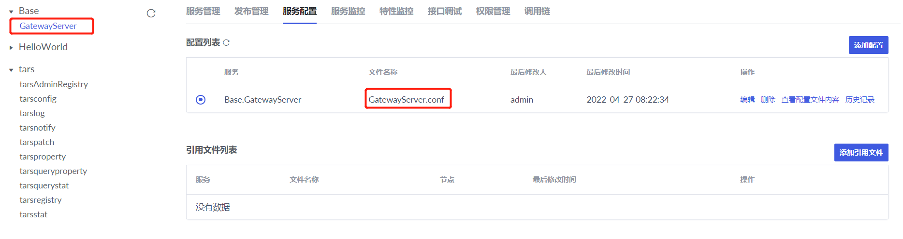

比如需要暴露Test.GetSumServer.GetSumObj给外部系统访问，那么在GatewayServer.conf 中配置如下：

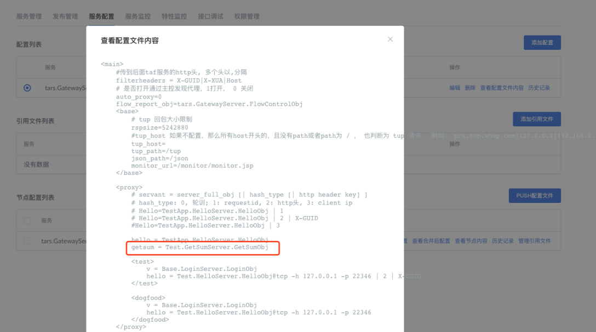

### 【生效配置】
添加完配置后，通过重启服务 或者 执行自定义命令，可以使配置生效，如下图所示：

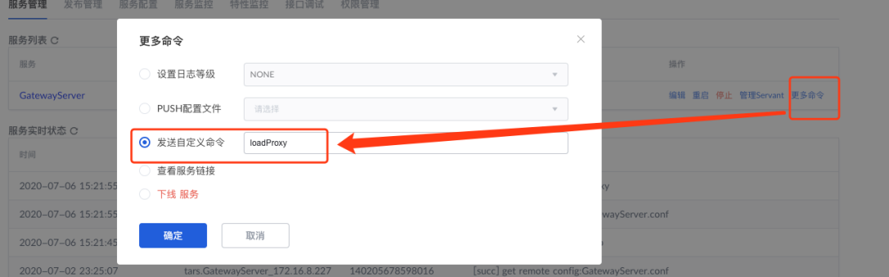

加载成功后如下：

### 【测试接口】
配置生效后，可以进行验证。以下是GetSum.tars 协议内容：
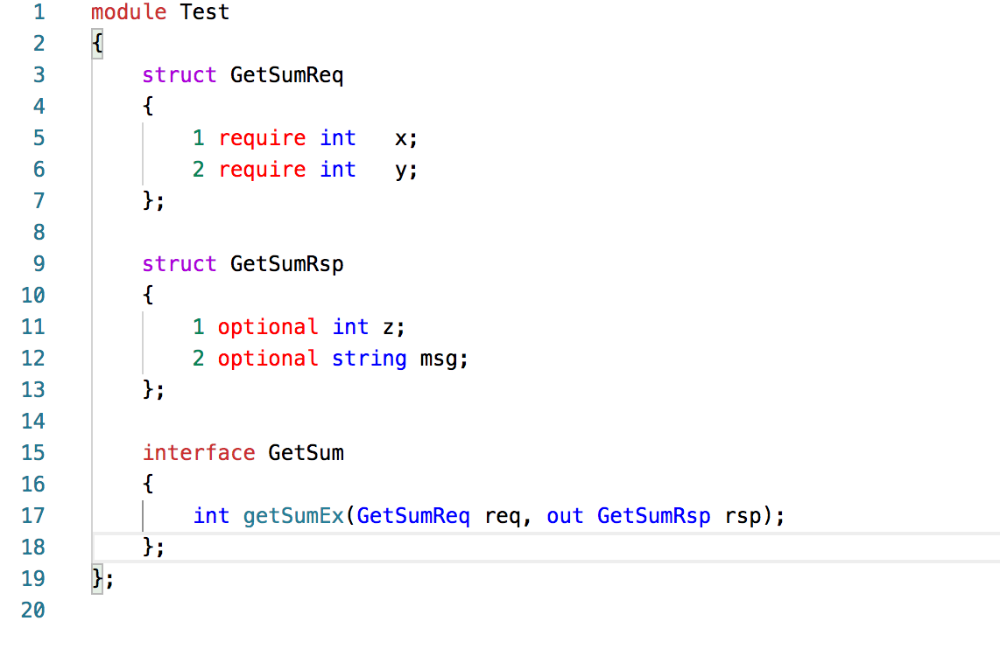
这里GatewayServer部署的ip和端口为 172.16.8.227:8200，那么通过GatewayServer 访问 getSumEx 接口支持两种风格的接口访问，具体查看功能说明，以下以RESTFUL风格为例：
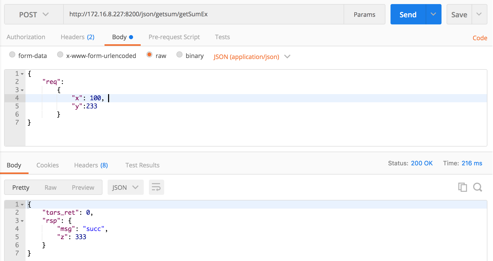
说明：
Url: http://172.16.8.227:8200(网关服务监听地址)/json（表示json协议代理）/getsum（servant别名，如果auto_proxy=1，那么这里也可以直接用服务的真实Obj：Test.GetSumServer.GetSumObj）/getSumEx （tars接口名）
请求参数：
{
	"req": 
		{	
			"x": 100, 
			"y":233
		}
}
其中req对应int getSumEx(GetSumReq req, out GetSumRsp rsp)中的入参参数名。

响应包：
{
    "tars_ret": 0,
    "rsp": {
        "msg": "succ",
        "z": 333
    }
}
其中rsp对应int getSumEx(GetSumReq req, out GetSumRsp rsp)中的出参参数名。如果接口有返回值，那么回包中有对应的tars_ret字段，否则没有。

### 【其他配置】
GatewayServer支持不同的负载均衡策略，也支持换机切换，详细见配置说明。
GatewayServer的tars相关协议代理也支持黑名单，流控策略，其配置在下面的HTTP协议代理配置进行说明。

## HTTP 协议代理配置
HTTP协议转发配置
HTTP协议转发配置流程：新增站点-增加转发路由规则-配置流控策略（可选）- 配置黑白名单（可选）
### 【新增站点】

站点类型：支持http和tars站点（tars站点主要用在tars协议转发时配置黑名单，流控场景，http站点则是），默认选择http站点。
* 站点ID：这里唯一标识一个站点，全局唯一不能重复。
* 站点名：站点中文名，只是增加阅读性方便管理，没有实际用处。
* 监控URL：通过该url可以探测该站点是否存活，可以为空。为空时探测站点的ip和端口是否能连通。

### 【路由配置】
通过以下配置，那么所有host为httpdemo.test.whup.com的请求，都会转发到后端http://172.16.8.123:20100上面。

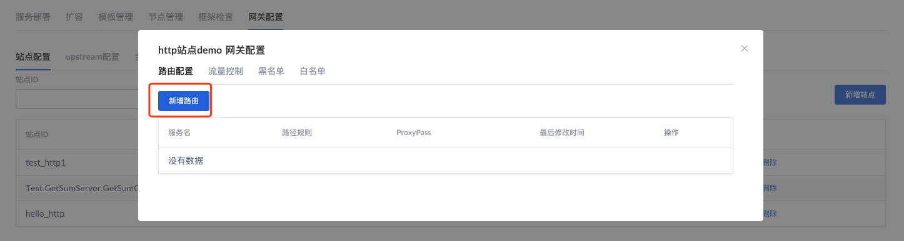
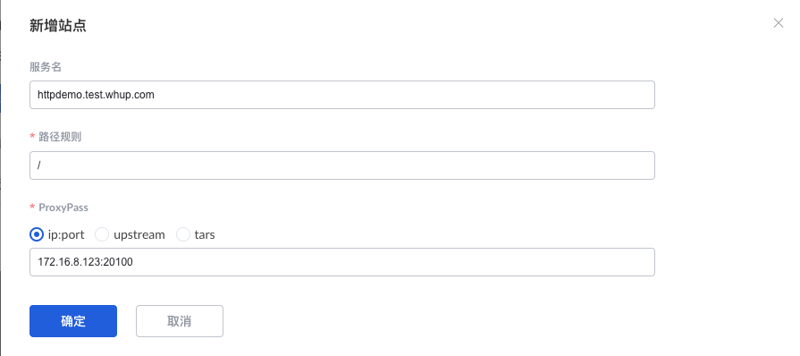
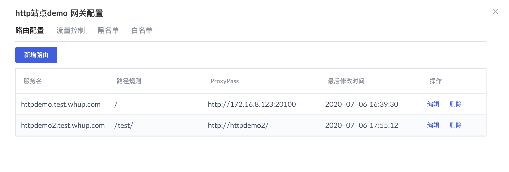

新增站点参数说明：
* 服务名：即http请求的host。
* 路径规则：即请求path匹配规则。
* ProxyPass：即转发后的地址和路径。
各个参数支持的类型详细说明见网关功能说明文档。

新增站点配置，通过执行自定义命令：loadHttp 使配置生效。

## 其他配置
### 【流控配置】
该站点在指定时间窗口内（单位为秒）最多能够访问的请求次数，如果最大流量配置为0表示不限流量。
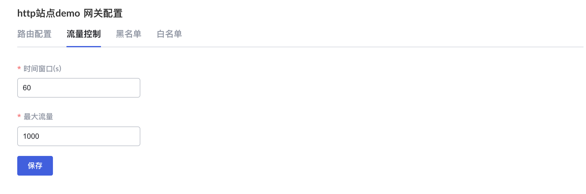

### 【黑名单配置】
如下图所示，可以配置具体的IP，IP也支持通配符。
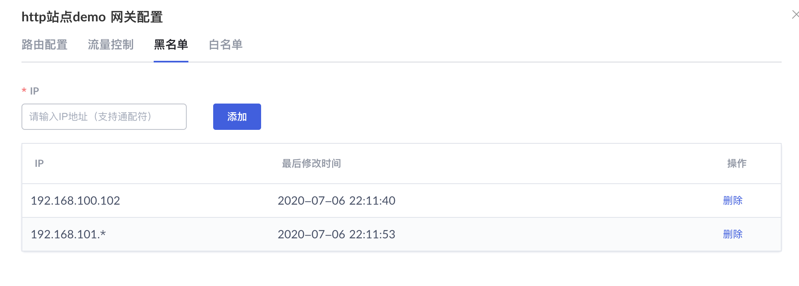

### 【白名单配置】
注意，对某个站点，一旦配置了白名单， 那么该站点就只允许白名单中的IP访问，其他都不允许访问。（主要用在内部管理平台，限制公司内网IP访问的场景）
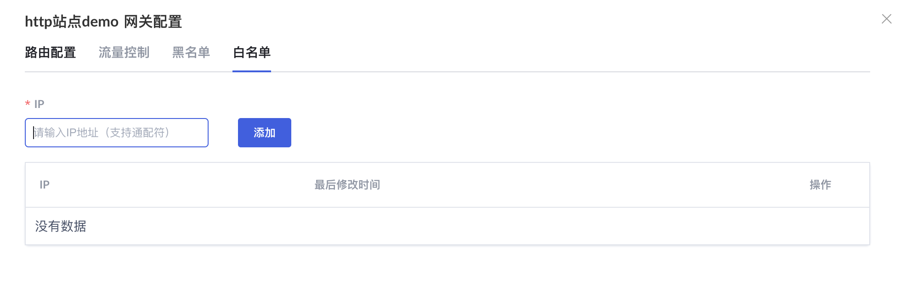

### 【upstream配置】
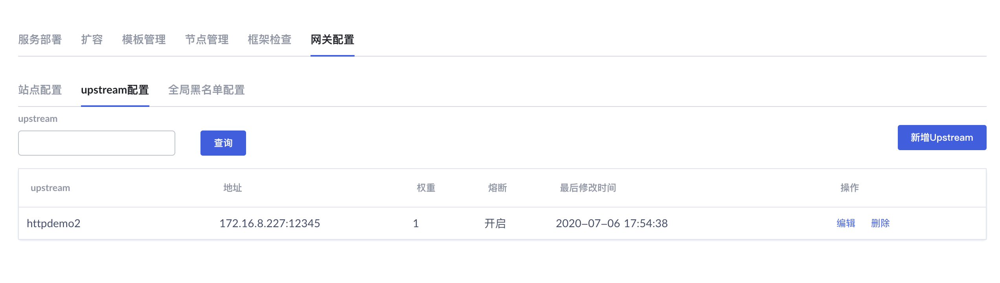
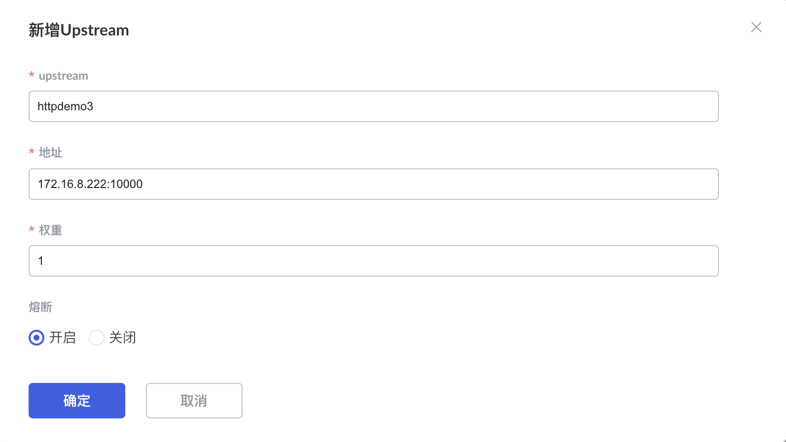
Upstream: 名称，全局唯一。
* 地址：即后端服务IP:Port。
* 权重：负载均衡轮训的权重，默认为1。
* 熔断：表示后端请求连续失败或者超时达到一定比例是否自动熔断。

### 【全局黑名单】
表示所有站点的黑名单，格式和黑名单相同。
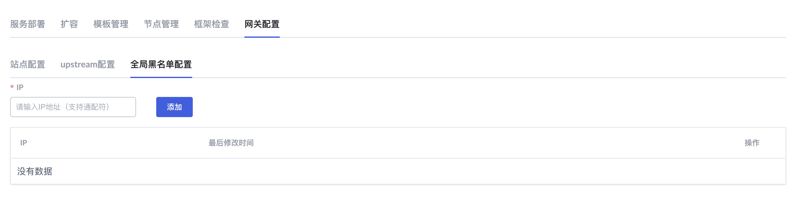

黑白名单配置通过自定义命令loadComm 可以使配置生效。流控配置后会在5分钟内自动生效。