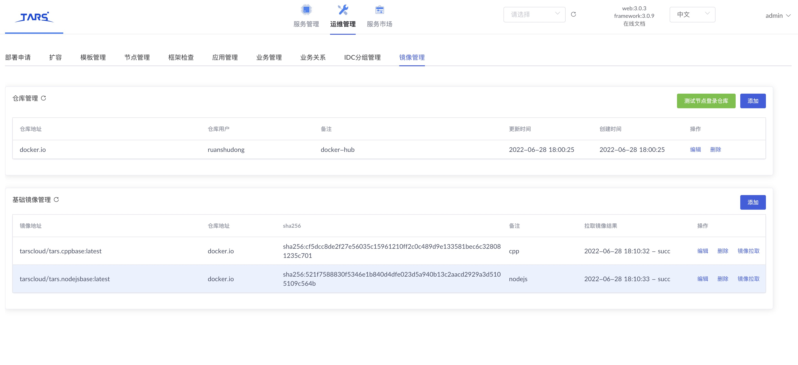
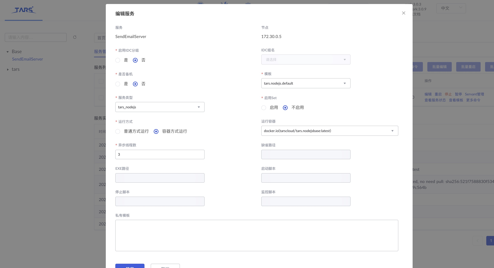

# 目录

> - [介绍](#chapter-1)
> - [前置说明](#chapter-2)
> - [使用说明](#chapter-3)
> - [容器运行机制](#chapter-4)

## 1 <span id="chapter-1"></span>介绍

在[docker 部署 Tars 的文档](./docker.md)中介绍了使用 docker 方式部署和启动框架的方式, 这种方案下, tarscloud/tarsnode 的镜像相当于一套虚拟机, 每个业务服务都是运行在这个镜像内部的.

但是有时候你希望服务隔离, 或者又希望服务环境能独立, 那么将业务服务独立到一个 docker 里面是可能更好的方式.

本文正是介绍如何将业务服务独立运行在 docker 里面.

## 2 <span id="chapter-2"></span>前置说明

无论你是使用源码部署还是 docker 部署, 都能够支持业务服务 docker 化, 当然前置条件如下:

### 版本前置

如果使用源码部署, 则:

- tarsframework>=v3.0.5
- tarsweb>=v2.4.27

如果使用 docker 部署, 则:

- tarscloud/framework>v3.0.6

在看到本文档时, 建议使用镜像版本`>=tarscloud/framework>v3.0.15`的镜像来部署tars框架.

### 服务器

服务器上必须安装 docker, 且 docker 的本地套接字地址最好默认是: `/var/run/docker.sock` (通常安装都在这里, 如果不在这里, 则需要修改 Tars 框架中 tarsnode/tarsregistry 的模板, 指向实际的地址)

如果是 docker 部署方式, 请请映射宿主机的`/var/run/docker.sock`到镜像中`/var/run/docker.sock`, 比如:

```
docker --name=tars-framework \
    --net=tars \
    -e MYSQL_HOST="172.25.0.2" \
    -e MYSQL_ROOT_PASSWORD="123456" \
    -e MYSQL_USER=root \
    -e MYSQL_PORT=3306 \
    -e REBUILD=false \
    -e INET=eth0 \
    -e SLAVE=false \    
    -e TARS_HOSTPATH=/data/framework \
    --ip="172.25.0.3" \
    -v /data/framework:/data/tars \
    -v /etc/localtime:/etc/localtime \
    -v /var/run/docker.sock:/var/run/docker.sock \
    -p 3000:3000 \
    tarscloud/framework:v3.0.15

docker run -d \
    --name=tars-node \
    --net=tars \
    -e INET=eth0 \
    -e WEB_HOST="http://172.25.0.3:3000" \
    --ip="172.25.0.5" \
    -e TARS_HOSTPATH=/data/tars \
    -v /data/tars:/data/tars \
    -v /etc/localtime:/etc/localtime \
    -p 9000-9010:9000-9010 \
    -v /var/run/docker.sock:/var/run/docker.sock \
    tarscloud/tars-node:latest
```

注意: 
- 这里相比普通方式多了一个`TARS_HOSTPATH`的环境变量, 它指向宿主机的映射目录, 即`-v /data/tars:/data/tars`这里宿主机的目录
- 它存在的原因是, 当以容器化方式启动业务服务时, 需要映射宿主机的目录到业务服务的容器中

## 3 <span id="chapter-3"></span>使用说明

## 镜像管理

在使用之前, 需要在 web 平台->运维管理->镜像管理中完成镜像的配置, 这样业务服务可以运行在指定的镜像中, 如图:



## 服务设置

在服务编辑界面, 设置服务以容器方式启动, 并选择合适的容器




主要使用流程如下:

- 镜像在 web 平台->运维管理->镜像管理中配置
- 先关闭服务
- 在服务的部署以及编辑界面, 都可以将服务设置为: 以容器方式启动
- 重启服务
- 此时服务运行在容器中
## 注意事项

- 业务服务以及 tarsregistry 所在的节点必须要能访问到镜像仓库
- 业务服务如果已经以非容器化方式启动, 变更为容器方式启动, 不需要再发布, 只需要重启即可, 反之亦然(注意要先关闭服务, 变更启动模式, 再重启服务)
- 容器的镜像你可以自己制作, 保证你的服务能在容器中运行即可
- 当然你也可以直接用官方的, 如果使用的官方的, 就需要注意你的编译环境是否和官方的匹配, 官方提供的运行镜像对应的编译环境是: tarscloud/base-compiler, 这个和 K8SFramework 版本保持一致.
- 官方几个语言的镜像如下:
  > - tarscloud/tars.cppbase:latest
  > - tarscloud/tars.nodejsbase:latest
  > - tarscloud/tars.javabase:latest
  > - tarscloud/tars.php74base:latest

发布机制:

- 发布模式并未改变, 仍然发布的是上传的 tgz 包, 而不是在发布时候制作好镜像, 再推送镜像到节点服务器
- 各个节点会同步基础镜像(在运维管理->镜像管理中配置)
- 服务启动时, 本质上就是在镜像中启动了服务

**如果服务无法启动, 请查看tarsnode的日志!**
## 4 <span id="chapter-4"></span>容器运行机制

业务服务的容器运行时, 采用以下几个条件启动:

- 使用`--net=host`模式运行, 这样容器网络层和宿主机网络层一样
- 使用`--ipc host`模式运行, 这样 ipc 相关的资源(共享内存等)和宿主机打通
- 目录映射方面, 处理 tars 服务运行需要的目录会自动共享外, 如果您需要映射其他目录, 则可以在模板中配置映射目录, 格式如下:

```xml
<tars>
    <application>
        <container>
            <volumes>
                #宿主机目录 = 容器内目录
                /data/host/path=/data/docker/path
            </volumes>
        </container>
    </application>
</tars>
```

- 端口映射方面, 如果是 linux 会自动和宿主机打通共享(`--net=host`), 如果是 mac, 如果您自己绑定了端口, 则需要单独在模板中配置:

```xml
<tars>
    <application>
        <container>
            <ports>
                #容器端口 = 宿主机host:端口
                80/tcp=192.168.0.1:80
                7778/udp=192.168.0.1:7778
            </ports>
        </container>
    </application>
</tars>
```
