## [编译AdminRegistry为抽象类出错](/TarsCloud/Tars/issues/882)


In file included from /root/code/tars/TarsFramework-v3.0.5/tarscpp/servant/servant/Application.h:30,
from /root/code/tars/TarsFramework-v3.0.5/AdminRegistryServer/AdminRegistryServer.h:17,
from /root/code/tars/TarsFramework-v3.0.5/AdminRegistryServer/AdminRegistryServer.cpp:17:
/root/code/tars/TarsFramework-v3.0.5/tarscpp/servant/servant/ServantHelper.h: In instantiation of ‘tars::ServantPtr tars::ServantCreation::create(cImp; tars::ServantPtr = tars::TC_AutoPtrtars::Servant; std::string = std::__cxx11::basic_string]’:
/root/code/tars/TarsFramework-v3.0.5/tarscpp/servant/servant/ServantHelper.h:49:16:   required from here
/root/code/tars/TarsFramework-v3.0.5/tarscpp/servant/servant/ServantHelper.h:49:49: 错误：invalid new-expression of abstract class type ‘AdminRegistry
49 |     ServantPtr create(const string &s) { T *p = new T; p->setName(s); p->setApplication(_application); return p; }
|                                                 ^~~~~
In file included from /root/code/tars/TarsFramework-v3.0.5/AdminRegistryServer/AdminRegistryServer.cpp:18:
/root/code/tars/TarsFramework-v3.0.5/AdminRegistryServer/AdminRegistryImp.h:47:7: 附注：因为下列虚函数在‘AdminRegistryImp’中为纯虚函数：
47 | class AdminRegistryImp: public AdminReg
|       ^~~~~~~~~~~~~~~~
In file included from /root/code/tars/TarsFramework-v3.0.5/AdminRegistryServer/DbProxy.h:28,
from /root/code/tars/TarsFramework-v3.0.5/AdminRegistryServer/AdminReapThread.h:22,
from /root/code/tars/TarsFramework-v3.0.5/AdminRegistryServer/AdminRegistryServer.h:18,
from /root/code/tars/TarsFramework-v3.0.5/AdminRegistryServer/AdminRegistryServer.cpp:17:
/root/code/tars/TarsFramework-v3.0.5/tarscpp/servant/protocol/framework/AdminReg.h:8295:29: 附注：    ‘virtual tars::Int32 tars::AdminReg::dockerPull(
8295 |         virtual tars::Int32 dockerPull(const std::string & baseImageId,tars::TarsCurrentPtr current) = 0;
|                             ^~~~~~~~~~
make[2]: *** [AdminRegistryServer/CMakeFiles/tarsAdminRegistry.dir/AdminRegistryServer.cpp.o] 错误 1
make[1]: *** [AdminRegistryServer/CMakeFiles/tarsAdminRegistry.dir/all] 错误 2
make: *** [all] 错误 2


代码没匹配,  编译framework, tarscpp以及tarscpp/servant/protocol都要用匹配的git, 你要不都更新到最新吧


代码没匹配， 编译framework， tarscpp以及tarscpp/servant/protocol都要用匹配的git， 你要不都更新到最新吧

好的，最新的代码可以编译过去，多谢了


## [申请TarsGo子项目committer](/TarsCloud/Tars/issues/875)


贡献：

tars2go支持include参数 和 单文件定义多个模块
TarsGo客户端独立运行时支持stat和property自动上报
go 1.16+ 版本 创建项目使用脚手架tarsgo命令
支持ssl


approve


## [./linux-install.sh 报错](/TarsCloud/Tars/issues/856)


在安装./linux-install.sh的时候报错，mysql的用户名密码都是正确的，提示错误如下：
exec mysql parameter: [charset]=[utf8]|[host]=[172.16.0.110]|[pass]=[]|[port]=[]|[sql]=[grant SELECT, INSERT, UPDATE, DELETE, CREATE, DROP, RELOAD, PROCESS, REFERENCES, INDEX, ALTER, CREATE TEMPORARY TABLES, LOCK TABLES, EXECUTE, REPLICATION SLAVE, REPLICAT
ION CLIENT, CREATE VIEW, SHOW VIEW, CREATE USER on . to 'tarsAdmin'@'%' identified by 'Tars@2019' with grant option;]|[user]=[admin]error: [TC_Mysql::execute]: mysql_query: [ grant SELECT, INSERT, UPDATE, DELETE, CREATE, DROP, RELOAD, PROCESS, REFERENCES, INDEX, ALTER, CREATE TEMPORARY TABLES, LOCK TABLES, EXECUTE, REPLICATION SLAVE, REPLICATION CLIENT, CREATE VIEW, SHOW VIEW, CREATE USER on . to
'tarsAdmin'@'%' identified by 'Tars@2019' with grant option; ] :Proxy ERROR:Sanity error: do not support sql relate to privileges,use chitu 2021-07-20 17:57:15 exec_mysql_script grant SELECT, INSERT, UPDATE, DELETE, CREATE, DROP, RELOAD, PROCESS, REFERENCES, INDEX, ALTER, CREATE TEMPORARY TABLES, LOCK TABLES, EXECUTE, REPLICATION SLAVE, REPLICATION CLIENT, CREATE VIEW, SHOW VIEW, CREATE USER on . to 'tar
sAdmin'@'%' identified by 'Tars@2019' with grant option;, ret code: 255  2021-07-20 17:57:15 grant error, exit.


这个是MySQL用户赋权失败的提示，建议单独处理MySQL用户的权限后继续安装。
This is a notice of the failure of MySQL user grant privilege. It is recommended to deal with the permissions of MySQL users before continuing with the installation.


## [tars 文件支持多个 interface 定义么？](/TarsCloud/Tars/issues/848)


开发语言 php
如题，是否可以在同一个 tars 文件中定义多个 interface？
module Test
{
    interface FooA
    {
        string testA();
    };

    interface FooB
    {
        string testB();
    };
};
如果可以，那么 tars.proto.php 中的 objName 应该如何定义呢？
return
[
    'appName'         => 'App',
    'serverName'      => 'Testing',
    'objName'         => '??',
    ...
];


支持, 返回的是数组,两个obj, 可以试一试


@ruanshudong 好的，谢谢。


## [tarsnode 安装报错，缺少依赖的库](/TarsCloud/Tars/issues/847)


/lib64/libm.so.6: version `GLIBC_2.29' not found
/lib64/libstdc++.so.6: version `GLIBCXX_3.4.26' not found
能不能将依赖的库等放到项目里一起发布出来，安装的时候解决起来太麻烦了


呃...有人在么？
现在 tars 都没有维护的么，还是说又变成 KPI 项目了，有知情人么？
我看每个 project 下面都是一堆 2020年的问题都没人回答...


你这明显是编译环境和服务器环境stdc++版本不一致导致, 和tarsnode有啥关系


是的，的确是我环境的问题，已经解决，谢谢。
框架服务是用的官方的docker化部署，业务节点是用的自己的镜像，然后节点注册是参考的 tarsdocker 里的
https://github.com/TarsCloud/TarsDocker/blob/master/tarsnode/php/entrypoint.sh
记得好像就是这个脚本执行节点注册时提示的库依赖问题，记不太清了，好像这个脚本会去框架节点下载一个包，这个包里面的某个地方貌似有依赖到


## [配置方案咨询](/TarsCloud/Tars/issues/845)


您好：
在我的系统中，规划了三种配置，以定义应用程序运行逻辑，分别是程序启动参数，动态参数，实验参数；
我的问题：
1.在Tars中，没有看到可以定义启动参数的地方，唯一的conf模板，框架在应用自动生成并下发的，我可以自定义吗？
2.服务的配置（目前支持了应用配置，set配置、服务配置和节点配置）但是在我的部署中，添加了配置，但服务没有能动态拉取；
可能是什么原因导致的？
3.有一些离线生成的数据文件需要动态加载，这个框架是如何支持它的？在整个系统中，没有看到数据文件的推送。


1 启动参数目前是没有办法控制的
2 拉取配置, 需要在代码中增加addConfig这个调用
3 服务可以监听命令的, 可以通过发送命令给服务来实现文件的动态加载
具体可以参考相关的文档.


多谢支持
不知道添加启动参数这个Feature，是否有计划添加
该Feature在很多服务中，还是很重要的。


启动参数暂时没计划, 你可以直接放在配置文件中, 没啥太本质的区别


我们设计中，引入了插件开发，在刚启动的时候就创建对象了；
而定义的动态参数，是程序运行过程中可以动态更新的，
如果启动参数和动态参数放到一起，每次更新参数都重启的话，代价就要大一些。
这个问题，我已经修改框架，暂时支持了，不过还是希望有官方解决方案。


## [tars文件中map能给默认值吗?](/TarsCloud/Tars/issues/843)


What language are you using?
golang
What operating system (Linux, Ubuntu, …) and version?
Linux
What runtime / compiler are you using (e.g. jdk version or version of gcc)
Make sure you include information that can help us debug (full error message, exception listing, stack trace, logs).


目前应该不支持


## [DCache稳定性](/TarsCloud/Tars/issues/842)


What language are you using?
c++
What operating system (Linux, Ubuntu, …) and version?
Linux
What runtime / compiler are you using (e.g. jdk version or version of gcc)
gcc
Make sure you include information that can help us debug (full error message, exception listing, stack trace, logs).
大佬，请问下DCache现在开源版本稳定吗？可以用于生产环境吗？打算接入生产环境DCache


普通key-value应该是稳定的


那大佬的意思是搬上生产环境还不太成熟吗？求建议


只是使用普通的key-value是没有问题的


## [framework的docker镜像打包后是否包含对应的映射数据?](/TarsCloud/Tars/issues/841)


使用docker搭建框架的时候, 保持数据库不变, 通过官方的faramwork镜像进行提交后,打包后的镜像文件 , 是否能保存用户提交的tars服务包数据.(未使用docker文件映射)
经过尝试之后,我发现基于镜像打包后的framework中丢失了我之前提交的rpc服务包,请问应该通过什么方式避免这个问题?
question
docker container commit -m "create the 159 copy framework image" -a "hk" 44d1e0444be7 framework:v1


为什么不映射目录? 映射就是为了保持文件的


由于dcache建表比较繁琐,想把表结构放到镜像中去,如果把映射文件持久化到打包镜像 部署起来就方便了


没太明白, dcache建表在web管理平台上配置就好了啊?没搞明白你应用场景


## [tars支持自动扩容吗？](/TarsCloud/Tars/issues/840)


What language are you using?
cpp
What operating system (Linux, Ubuntu, …) and version?
Linux
tars可以根据负载自动扩缩容吗？


目前不支持自动扩容，需要手动扩容服务


## [DCache编译不过](/TarsCloud/Tars/issues/839)


What language are you using?
c++
What operating system (Linux, Ubuntu, …) and version?
linux
What runtime / compiler are you using (e.g. jdk version or version of gcc)
[root@localhost build]# gcc --version
gcc (GCC) 4.8.5 20150623 (Red Hat 4.8.5-44)
Make sure you include information that can help us debug (full error message, exception listing, stack trace, logs).
DCache不能编译通过
/usr/local/tars/cpp/thirdparty/lib64/libgtest.a(gtest-all.cc.o)：在函数‘testing::internal::ThreadLocaltesting::TestPartResultReporterInterface*::CreateKey()’中：
gtest-all.cc:(.text._ZN7testing8internal11ThreadLocalIPNS_31TestPartResultReporterInterfaceEE9CreateKeyEv[_ZN7testing8internal11ThreadLocalIPNS_31TestPartResultReporterInterfaceEE9CreateKeyEv]+0x16)：对‘pthread_key_create’未定义的引用
/usr/local/tars/cpp/thirdparty/lib64/libgtest.a(gtest-all.cc.o)：在函数‘testing::internal::ThreadLocal<std::vector<testing::internal::TraceInfo, std::allocatortesting::internal::TraceInfo > >::CreateKey()’中：
gtest-all.cc:(.text._ZN7testing8internal11ThreadLocalISt6vectorINS0_9TraceInfoESaIS3_EEE9CreateKeyEv[_ZN7testing8internal11ThreadLocalISt6vectorINS0_9TraceInfoESaIS3_EEE9CreateKeyEv]+0x16)：对‘pthread_key_create’未定义的引用
/usr/local/tars/cpp/thirdparty/lib64/libgtest.a(gtest-all.cc.o)：在函数‘testing::internal::ThreadLocaltesting::TestPartResultReporterInterface*::GetOrCreateValue() const’中：
gtest-all.cc:(.text._ZNK7testing8internal11ThreadLocalIPNS_31TestPartResultReporterInterfaceEE16GetOrCreateValueEv[_ZNK7testing8internal11ThreadLocalIPNS_31TestPartResultReporterInterfaceEE16GetOrCreateValueEv]+0x16)：对‘pthread_getspecific’未定义的引用
gtest-all.cc:(.text._ZNK7testing8internal11ThreadLocalIPNS_31TestPartResultReporterInterfaceEE16GetOrCreateValueEv[_ZNK7testing8internal11ThreadLocalIPNS_31TestPartResultReporterInterfaceEE16GetOrCreateValueEv]+0x79)：对‘pthread_setspecific’未定义的引用
collect2: 错误：ld 返回 1
make[2]: *** [bin/test-TimerThreadTest] 错误 1
make[1]: *** [test/Proxy/CMakeFiles/test-TimerThreadTest.dir/all] 错误 2
make: *** [all] 错误 2
求大佬指教是为什么？都是拉取的git最新代码


已经解决


## [建议tarsnode安装可以配置安装路径](/TarsCloud/Tars/issues/838)


What language are you using?
线上环境一般没有/usr/local 权限，
建议tarsnode安装可以配置安装路径


加一个目录软连接来解决?
现在其实也可以调整目录, 就是稍微麻烦一点, 安装时脚本里面修改一下目录


## [Tars Gateway使用场景](/TarsCloud/Tars/issues/837)


What language are you using?
php
What operating system (Linux, Ubuntu, …) and version?
Linux centos 7
What runtime / compiler are you using (e.g. jdk version or version of gcc)
Make sure you include information that can help us debug (full error message, exception listing, stack trace, logs).
能否作为外部调用内部http服务网关，使用网关如何实现修改头信息，token验证等。


TarsGateway 可以让外部服务和客户端通过HTTP调用内部使用tars、json、tarsTup和HTTP协议的服务，具体使用方式可以参考 Tars网关文档


## [Golang下Tars协议定义默认值无效](/TarsCloud/Tars/issues/836)


Tars文件中定义如下：
    struct UpdateFieldInfo
    {
        1 require bool replace = true;
        2 require UpdateValue upDateValue;
    };

执行如下代码：
	uv := DCache.UpdateFieldInfo{}
	fmt.Println(uv)

得到结果：
{false {0 }}
在构造UpdateFieldInfo时，replace并没有按照tars协议中定义的默认值进行初始化。


貌似缺省值只有在optional模式下才有效


## [Cpp技术栈的大型、相对完备的框架不多。对MySQL的强依赖能否剥离，或者说里头的公共组件和通信框架方便拆出来使用么？](/TarsCloud/Tars/issues/835)


RT


使用tarscpp不行了么?


## [Tars web管理平台上传jar包提示“发布包与服务名称不匹配“错误](/TarsCloud/Tars/issues/834)


去掉后面那个时间, 这个问题, 后面优化一下


去掉后面那个时间, 这个问题, 后面优化一下

遇到了同样的问题，请问具体是怎么处理呢？


去掉后面那个时间, 这个问题, 后面优化一下

遇到了同样的问题，请问具体是怎么处理呢？

解决了，把包名改成服务名就好了，打扰了


看了你们的评论都描述有点模糊，
把生成出来的压缩包名字src/HelloServer_20220428081241.tar.gz修改为src/HelloServer.tar.gz


## [DCache](/TarsCloud/Tars/issues/833)


What language are you using?
c++
What operating system (Linux, Ubuntu, …) and version?
linux
What runtime / compiler are you using (e.g. jdk version or version of gcc)
gcc
Make sure you include information that can help us debug (full error message, exception listing, stack trace, logs).
求教大佬，DCache还有更详细一点的文档吗？总是安装失败，https://github.com/Tencent/DCache/blob/master/docs/install.md  这里的安装还是太粗略


可以参考文章 DCache 分布式存储系统｜安装部署与应用创建，后续还会有关于 DCache 如何使用的系列文章更新


## [网关配置的使用BUG](/TarsCloud/Tars/issues/832)


What language are you using?
What operating system (Linux, Ubuntu, …) and version?
What runtime / compiler are you using (e.g. jdk version or version of gcc)
Make sure you include information that can help us debug (full error message, exception listing, stack trace, logs).


该路由下的配置填写提示这个，我是在删除了配置之后，重新添加就会提示这个


网关的问题, 最好去网关那个仓库的issue里面问


## [tarsweb 上装了tarsgateway,可是在网关配置那里没有找到站点配置的按钮](/TarsCloud/Tars/issues/831)


What language are you using?
php
What operating system (Linux, Ubuntu, …) and version?
centos
What runtime / compiler are you using (e.g. jdk version or version of gcc)
Make sure you include information that can help us debug (full error message, exception listing, stack trace, logs).


先添加网关控制服务obj


先添加网关控制服务obj


添加不上，提示这个报错


## [STL线程安全](/TarsCloud/Tars/issues/830)


What language are you using?
c++
What operating system (Linux, Ubuntu, …) and version?
Linux
What runtime / compiler are you using (e.g. jdk version or version of gcc)
gcc
Make sure you include information that can help us debug (full error message, exception listing, stack trace, logs).
请教一下大佬，tars有没有提供STL的线程安全方面的参考呢。我在项目中较多使用了map，但是在多线程中容易出现map奔溃，想请问一下tars有没有提供map类似的功能或者有什么可以替代map的已实现线程安全的呢？谢谢！！！


直接加锁封装一下, 应该很容易吧?线程锁都tc库里都有, 自己封装一下难度很小


该issue长期未更新。如果问题依旧没解决，欢迎重新打开issue。TARS社区有您更精彩。
Thanks for your supporting. The issue has not been updated for a long time. If the problem is still not resolved, welcome to reopen the issue.


## [AddServant get an fatal error](/TarsCloud/Tars/issues/829)


What language are you using?
golang
What operating system (Linux, Ubuntu, …) and version?
docker in mac
What runtime / compiler are you using (e.g. jdk version or version of gcc)
when i run as the doc that notice : runtime error: invalid memory address or nil pointer dereference
i saw the code is where AddServant()


please provide more information. some log screenshot will be better.


Thanks for your supporting. The issue has not been updated for a long time. If the problem is still not resolved, welcome to reopen the issue.


## [tars_web 打包发布失败，提示 md5 is not equal](/TarsCloud/Tars/issues/828)


使用是tars_php,
tars_wen版本是 2.4.13
发布管理-上传包-发布 有如下提示，请问是什么问题？
request md5:5ae3d85292034c25e699b32fe5d2c1e2, local file md5:e6c3a3d230af8457ad343316f635b90b, md5 is not equal


是不是硬盘满了之类的问题?


该issue长期未更新。如果问题依旧没解决，欢迎重新打开issue。TARS社区有您更精彩。
Thanks for your supporting. The issue has not been updated for a long time. If the problem is still not resolved, welcome to reopen the issue.


## [web后台服务部署](/TarsCloud/Tars/issues/827)

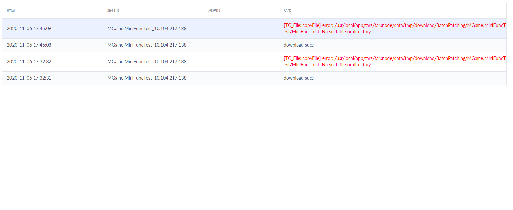
What language are you using?
c++
What operating system (Linux, Ubuntu, …) and version?
linux
What runtime / compiler are you using (e.g. jdk version or version of gcc)
gcc
Make sure you include information that can help us debug (full error message, exception listing, stack trace, logs).
请教一下大佬，我这边可能有十个服务，这十个服务都是同样的功能，只是服务名称不一致，比如说是game1,game2,game3,....game10,执行文件都是同一个，起得是负载的作用，但是在后台的发布部署的时候我看到上传的发布包名称必须和服务名称一样，这样是不是说如果我有十个服务，功能一样，只是服务名不一样，那也必须打包十个不同的对应服务名的发布包呢，再一个一个上传，这样就有点太麻烦了，请教一下有没有什么解决方案呢？如果我十个服务都用同一个发布包进行发布，后台就会报错，


相同服务名  配置不同的set就行


web上创建10个应用


相同服务名 配置不同的set就行

服务名不能相同呢


web上创建10个应用

建10个应用是可以，这样10个应该要更新时得上传10个发布包，这样太麻烦了，不知道有没有什么更方便的方法呢请教一下？


用命令行上传并发布，写个脚本，一次上传10个
https://tarscloud.github.io/TarsDocs/dev/tars-web-api.html#upload-and-publish


用命令行上传并发布，写个脚本，一次上传10个
https://tarscloud.github.io/TarsDocs/dev/tars-web-api.html#upload-and-publish

看到了，谢谢大佬指教！！！万分感激


## [Docker正常部署tarsnode后，tarsnode无法被框架发现。](/TarsCloud/Tars/issues/826)


框架的管理后台是：192.168.163.128:3000
我用另一台虚拟机(ip:192.168.163.129)部署tarsnode，下面是部署命令:
docker run  
--name=tars-node 
--net=host 
-e INET=ens33 
-e WEB_HOST="192.168.163.128:3000" 
-v /root/work/docker/tars/node/data:/data/app 
-v /etc/localtime:/etc/localtime 
tarscloud/tars-node:full
下面是报错：
[root@localhost data]# docker run      --name=tars-node     --net=host     -e INET=ens33     -e WEB_HOST="192.168.163.128:3000"     -v /root/work/docker/tars/node/data:/data/app     -v /etc/localtime:/etc/localtime     tarscloud/tars-node:full
--2020-11-08 00:12:36--  http://192.168.163.128:3000/get_tarsnode?ip=&runuser=root
Connecting to 192.168.163.128:3000... connected.
HTTP request sent, awaiting response... 200 OK
Length: 3503 (3.4K) [text/plain]
Saving to: 'get_tarsnode.sh'
 0K ...                                                   100%  221M=0s

2020-11-08 00:12:36 (221 MB/s) - 'get_tarsnode.sh' saved [3503/3503]
get_tarsnode.sh: --------------------------------------------------------
#!/bin/bash
#/**
* Tencent is pleased to support the open source community by making Tars available.
*
* Copyright (C) 2016THL A29 Limited, a Tencent company. All rights reserved.
*
* Licensed under the BSD 3-Clause License (the "License"); you may not use this file except
* in compliance with the License. You may obtain a copy of the License at
*
* https://opensource.org/licenses/BSD-3-Clause
*
* Unless required by applicable law or agreed to in writing, software distributed
* under the License is distributed on an "AS IS" BASIS, WITHOUT WARRANTIES OR
* CONDITIONS OF ANY KIND, either express or implied. See the License for the
* specific language governing permissions and limitations under the License.
*/
echo "runuser: root, webHost:http://192.168.163.128:3000, machine_ip:192.168.163.129, registryAddress:tcp -h 192.168.163.128 -p 17890"
OSNAME=uname
OS=1
if [[ "$OSNAME" == "Darwin" ]]; then
OS=2
elif [[ "$OSNAME" == "Windows_NT" ]]; then
OS=3
else
OS=1
fi
if [ $OS != 3 ]; then
TARS_PATH=/usr/local/app/tars
else
TARS_PATH=c:/tars-install/tars
fi
if [ $OS != 3 ]; then
if [ ! -d "/usr/local/app" ]; then
echo "create tars base path: "
mkdir -p /data/app
ln -s /data/app /usr/local/app
fi
fi
mkdir -p ${TARS_PATH}
rm -rf tarsnode.tgz
curl -O http://192.168.163.128:3000/files/tarsnode.tgz
#休息1s, 避免下载的文件没有写成功
sleep 1
if [ ! -f "tarsnode.tgz" ]; then
echo "Tars node download error: http://192.168.163.128:3000/files/tarsnode.tgz"
exit
fi
if [ 'tcp -h 192.168.163.128 -p 17890' == '' ]; then
echo "registryAddress is empty."
exit
fi
if [ '192.168.163.129' == '' ]; then
echo "machine_ip is empty."
exit
fi
tar zxf tarsnode.tgz
if [ $OS != 3 ]; then
if [ -f ${TARS_PATH}/tarsnode/util/stop.sh ]; then
${TARS_PATH}/tarsnode/util/stop.sh
fi
else
if [ -f ${TARS_PATH}/tarsnode/util/stop.bat ]; then
${TARS_PATH}/tarsnode/util/stop.bat
fi
fi
cp -rf tarsnode ${TARS_PATH}/
cd ${TARS_PATH}
echo "local machine ip:[192.168.163.129] succ"
echo "tars registry:" tcp -h 192.168.163.128 -p 17890
sed -i "s/localip.tars.com/192.168.163.129/g" ${TARS_PATH}/tarsnode/conf/tars.tarsnode.config.conf
sed -i "s/registryAddress/tcp -h 192.168.163.128 -p 17890/g" ${TARS_PATH}/tarsnode/conf/tars.tarsnode.config.conf
if [ $OS != 3 ]; then
sed -i "s/registryAddress/tcp -h 192.168.163.128 -p 17890/g" ${TARS_PATH}/tarsnode/util/execute.sh
sed -i "s/localip.tars.com/192.168.163.129/g" ${TARS_PATH}/tarsnode/util/execute.sh
else
sed -i "s/registryAddress/tcp -h 192.168.163.128 -p 17890/g" ${TARS_PATH}/tarsnode/util/execute.bat
sed -i "s/localip.tars.com/192.168.163.129/g" ${TARS_PATH}/tarsnode/util/execute.bat
fi
echo "install tarsnode succ, start tarsnode"
if [ $OS != 3 ]; then
id -u root &>/dev/null
if [ $? != 0 ]; then
useradd root
fi
chown -R root:root /usr/local/app/*;
${TARS_PATH}/tarsnode/util/stop.sh

uid=`whoami`
if [ "$uid" != "root" ] && [ "root" != "" ]; then
    echo "su $runuser: now uid:$uid, runuser:$runuser"
    su - $runuser -c "sh ${TARS_PATH}/tarsnode/util/start.sh"
else
    sh ${TARS_PATH}/tarsnode/util/start.sh
fi

else
${TARS_PATH}/tarsnode/util/start.bat
fi
INFO=ps -e | grep tarsnode
if [[ "${INFO}" != "" ]]; then
echo 'Tars node installed success'
else
echo 'Tars node installed failed'
fi
runuser: root, webHost:http://192.168.163.128:3000, machine_ip:192.168.163.129, registryAddress:tcp -h 192.168.163.128 -p 17890
% Total    % Received % Xferd  Average Speed   Time    Time     Time  Current
Dload  Upload   Total   Spent    Left  Speed
100 1201k    0 1201k    0     0  13.3M      0 --:--:-- --:--:-- --:--:-- 13.4M
cp: cannot overwrite non-directory '/usr/local/app/tars/tarsnode/data' with directory 'tarsnode/data'
local machine ip:[192.168.163.129] succ
tars registry: tcp -h 192.168.163.128 -p 17890
install tarsnode succ, start tarsnode
start /usr/local/app/tars/tarsnode/bin/tarsnode --nodeid=192.168.163.129 --config=/usr/local/app/tars/tarsnode/conf/tars.tarsnode.config.conf
Tars node installed success
tarsnode.conf: --------------------------------------------------------


enableset=n
setdivision=NULL

async-invoke-timeout=5000
refresh-endpoint-interval=60000
report-interval=60000
sample-rate=100000
max-sample-count=50
stat=tars.tarsstat.StatObj
property=tars.tarsproperty.PropertyObj
modulename=tars.tarsnode
locator=tars.tarsregistry.QueryObj@tcp -h 192.168.163.128 -p 17890
sync-invoke-timeout=6000
asyncthread=3


logsize=10M
config=tars.tarsconfig.ConfigObj
notify=tars.tarsnotify.NotifyObj
deactivating-timeout=3000
app=tars
server=tarsnode
localip=192.168.163.129
local=tcp -h 127.0.0.1 -p 19385 -t 10000
basepath=/usr/local/app/tars/tarsnode/data
datapath=/usr/local/app/tars/tarsnode/data
logpath=/usr/local/app/tars/app_log
logLevel=DEBUG

endpoint=tcp -h 192.168.163.129 -p 19385 -t 60000
allow
maxconns=1024
threads=5
queuecap=10000
queuetimeout=4000
servant=tars.tarsnode.NodeObj


endpoint=tcp -h 192.168.163.129 -p 19386 -t 60000
allow
maxconns=1024
threads=5
queuecap=10000
queuetimeout=4000
servant=tars.tarsnode.ServerObj


registryObj=tars.tarsregistry.RegistryObj

heartTimeout=45
monitorInterval=3
synStatInterval=60


file=serversCache.dat
minBlock=500
maxBlock=500
factor=1
size=10M


install tarsnode succ, check tarsnode alive
MonitorNode ok, latestKeepAliveTime:1604823159, kaTimeout:300
MonitorNode ok, latestKeepAliveTime:1604823159, kaTimeout:300
MonitorNode ok, latestKeepAliveTime:1604823166, kaTimeout:300
MonitorNode ok, latestKeepAliveTime:1604823166, kaTimeout:300
MonitorNode ok, latestKeepAliveTime:1604823173, kaTimeout:300
MonitorNode ok, latestKeepAliveTime:1604823173, kaTimeout:300
MonitorNode ok, latestKeepAliveTime:1604823173, kaTimeout:300
MonitorNode ok, latestKeepAliveTime:1604823180, kaTimeout:300
MonitorNode ok, latestKeepAliveTime:1604823180, kaTimeout:300
MonitorNode ok, latestKeepAliveTime:1604823187, kaTimeout:300
MonitorNode ok, latestKeepAliveTime:1604823187, kaTimeout:300
请问，这是什么原因？要怎么排查问题？谢谢！


补充：transnode的机器一直打印 MonitorNode ok 。。。的log；但框架后台的 节点管理 中没有显示192.168.163.129的节点信息。


补充：把两台机器的防火墙关了后，在tasweb管理后台就可以看到新增的tarsnode了。。。；请问在多机器的环境中，framework要开放哪些端口才能确保tarsnode能正常接入？


可以看看framework/deploy/Dockfile文件, 里面都有端口说明


该issue长期未更新。如果问题依旧没解决，欢迎重新打开issue。TARS社区有您更精彩。
Thanks for your supporting. The issue has not been updated for a long time. If the problem is still not resolved, welcome to reopen the issue.


## [NotifyServer的bug](/TarsCloud/Tars/issues/825)


NotifyServer中
LoadDbThread::loadData函数
while (iOffset % 1000 == 0 || mysqlData.data().empty()); 这里的判定条件还是有问题吧？如果数据库数据为空，这里还是会死循环，直接改成while (iOffset % 1000 == 0 || mysqlData.data().empty())就好了


好像是, 不过没看懂你这个改的? 好像没改?


该issue长期未更新。如果问题依旧没解决，欢迎重新打开issue。TARS社区有您更精彩。
Thanks for your supporting. The issue has not been updated for a long time. If the problem is still not resolved, welcome to reopen the issue.


## [是否可以使用raspberry pi创建tars服务器](/TarsCloud/Tars/issues/824)


What language are you using?
c++
What operating system (Linux, Ubuntu, …) and version?
Raspberry Pi OS / Linux
What runtime / compiler are you using (e.g. jdk version or version of gcc)
Make sure you include information that can help us debug (full error message, exception listing, stack trace, logs).


没试过呢, 这是啥机器? 啥OS linux的么?


该issue长期未更新。如果问题依旧没解决，欢迎重新打开issue。TARS社区有您更精彩。
Thanks for your supporting. The issue has not been updated for a long time. If the problem is still not resolved, welcome to reopen the issue.


## [加密算法](/TarsCloud/Tars/issues/822)


What language are you using?
c++
What operating system (Linux, Ubuntu, …) and version?
Linux
What runtime / compiler are you using (e.g. jdk version or version of gcc)
gcc
Make sure you include information that can help us debug (full error message, exception listing, stack trace, logs).
大佬，请教一下，tars框架对协议加密，推荐用什么算法啊，客户端是c#，tars框架我看到有提供算法，但是没有对应的c#版本，


cpp里面算法都是标准的, 你找个c#标准的匹配算法, 就可以用啊, des啥的


好的，搞定了，谢谢大佬


## [hostip get error](/TarsCloud/Tars/issues/821)


What language are you using?
cpp
What operating system (Linux, Ubuntu, …) and version?
Linux
What runtime / compiler are you using (e.g. jdk version or version of gcc)
gcc
Make sure you include information that can help us debug (full error message, exception listing, stack trace, logs).
当系统上存在如下两个网口配置时，使用linux-install.sh脚本部署会有问题，获取不到有效IP地址
eth0: flags=4163<UP,BROADCAST,RUNNING,MULTICAST>  mtu 1500
inet 172.17.13.145  netmask 255.255.240.0  broadcast 172.17.15.255
ether 00:16:3e:32:1c:65  txqueuelen 1000  (Ethernet)
RX packets 25385738  bytes 6622473179 (6.1 GiB)
RX errors 0  dropped 0  overruns 0  frame 0
TX packets 18265294  bytes 15805736820 (14.7 GiB)
TX errors 0  dropped 0 overruns 0  carrier 0  collisions 0
veth084aa16: flags=4163<UP,BROADCAST,RUNNING,MULTICAST>  mtu 1500
ether ee:c7:7a:c3:67:bc  txqueuelen 0  (Ethernet)
RX packets 2844063  bytes 255202967 (243.3 MiB)
RX errors 0  dropped 0  overruns 0  frame 0
TX packets 1546386  bytes 432073030 (412.0 MiB)
TX errors 0  dropped 0 overruns 0  carrier 0  collisions 0
linux-install.sh 脚本里面 get_host_ip函数
IP=ifconfig | grep -w $1 -A 1 | tail -1 | awk '{print $2}' | cut -d ':' -f 2 有问题？


原来是IP=ifconfig | grep $1 -A 1 | tail -1 | awk '{print $2}' | cut -d ':' -f 2


拿不到IP么? 我怎么试了一下貌似可以拿到?


## [请问怎样让后台服务读取服务器本地文件？](/TarsCloud/Tars/issues/819)


What language are you using?
cpp
What operating system (Linux, Ubuntu, …) and version?
centos7, docker19.03.13, tarscloud/framework和tarscloud/tars-node的镜像都是latest版本
What runtime / compiler are you using (e.g. jdk version or version of gcc)
g++4.8.5
Make sure you include information that can help us debug (full error message, exception listing, stack trace, logs).
你好！我在搭建一个服务，这个服务监视本地的文件(文件位于docker镜像和宿主机的共享文件夹里面)，客户端则询问服务端关于这些文件的信息，以及传输文件。但是我发现服务端打不开这些文件，服务器程序通过函数opendir连文件夹都打不开。服务端程序通过popen("ls xxxx", "r")读不到很多文件，所以我也不能通过popen把工作交给其他的程序执行。
请问怎样子才能让服务程序读到本地的文件呢？


怎么看起来和tars没关系, 似乎是docker文件共享的问题?


已想到别的办法绕过这个问题，谢谢！


## [客户端链接服务发现registry，偶尔出现链接失败，是什么导致出现这种情况](/TarsCloud/Tars/issues/818)


What language are you using?
php
What operating system (Linux, Ubuntu, …) and version?
linux
What runtime / compiler are you using (e.g. jdk version or version of gcc)
Make sure you include information that can help us debug (full error message, exception listing, stack trace, logs).
Uncaught Exception: socket tcp 连接失败 in /home/web/tars-client/src/vendor/phptars/tars-registry/src/client/CommunicatorRegistry.php:231
访问量高的时候，客户端偶尔会出现上述日志，大概都是什么情况导致的，有点找不到方向


连接主控失败? 是连接被主控关闭了么?


该issue长期未更新。如果问题依旧没解决，欢迎重新打开issue。TARS社区有您更精彩。
Thanks for your supporting. The issue has not been updated for a long time. If the problem is still not resolved, welcome to reopen the issue.


## [springboot 日志 配置问题](/TarsCloud/Tars/issues/817)


1.springboot中如何输出远程日志，
2.本地日志如何切分，滚动   
3.spring中如何使用web管理平台配置的配置文件？
有没有demo或相关的文档说明呢，搞了几天了


https://github.com/TarsCloud/TarsDocs/blob/467a2f3a5dbdcd6bbde9751f1d5871bd9df24cfe/SUMMARY.md
辛苦查看一下以上文档，tarsjava部分有接入spring的内容。看看是否能解决您的问题


https://github.com/TarsCloud/TarsDocs/blob/master/dev/tarsjava/tars-tutorials.md
现在在这个文档中也有链接


## [Where can I edit the title?](/TarsCloud/Tars/issues/815)


Modify in app/web/client/dist/index.html.


在app/web/client/dist/index.html中修改。


## [Can TARS clean up uploaded packages regularly?](/TarsCloud/Tars/issues/814)


No description provided.


This function may have to be handled manually. The build and release records theoretically need to be kept for a long time for future reference. This issue has been considered.


这个功能可能得自己手动处理了，build和发布记录理论上是需要长久保存备查的。这个问题有考虑了。


## [After TARS is compiled, deployed and run on win, what is the general reason for not seeing the service? ](/TarsCloud/Tars/issues/813)


该issue长期未更新。如果问题依旧没解决，欢迎重新打开issue。TARS社区有您更精彩。
Thanks for your supporting. The issue has not been updated for a long time. If the problem is still not resolved, welcome to reopen the issue.


## [A problem about tars failing to shield fault node correctly under low QPS.](/TarsCloud/Tars/issues/812)


What language are you using?
C++
What operating system (Linux, Ubuntu, …) and version?
Linux
What runtime / compiler are you using (e.g. jdk version or version of gcc)
gcc 4.8.5
Make sure you include information that can help us debug (full error message, exception listing, stack trace, logs).

The application has two microservices A and B. A calls B. A has one machine, and B has two machines B1 and B2. If B1 has a network failure, the packet loss rate reaches 60% and QPS reaches 46. A still does not shield B1. If the failure rate is further increased, for example, to 70% and maintain a QPS of 46, B1 will be shielded. When the QPS is reduced to 20, B1 cannot be recognized as a fault and will not be shielded. In an environment with 100 machines, the problem is more serious. According to actual observations, the larger the cluster size, the lower the QPS is allocated and the less sensitive the shielding.


该issue长期未更新。如果问题依旧没解决，欢迎重新打开issue。TARS社区有您更精彩。
Thanks for your supporting. The issue has not been updated for a long time. If the problem is still not resolved, welcome to reopen the issue.


## [web部署的服务名称可以用“-”分隔符吗？](/TarsCloud/Tars/issues/811)


web的服务名称可以用“-”分割符呢，如果使用了分隔符，除了界面上的输入限制，其他的代码处还有没有添加关于分割符的限制呢？


建议还是别用特殊字符


好的，谢谢


## [在Mac中使用docker安装mysql和部署tars framework会提示被拒](/TarsCloud/Tars/issues/810)


What language are you using?
What operating system (Linux, Ubuntu, …) and version?
MacOS Catalina v10.15.6
What runtime / compiler are you using (e.g. jdk version or version of gcc)
Make sure you include information that can help us debug (full error message, exception listing, stack trace, logs).
安装MySQL:
sh-3.2# docker run -d -p 3306:3306 \

--net=tars \
-e MYSQL_ROOT_PASSWORD="123456" \
--ip="172.25.0.2" \
-v /data/framework-mysql:/var/lib/mysql \
-v /etc/localtime:/etc/localtime \
--name=tars-mysql \
mysql:5.6


2f20e28e5b92aa55934a294a9f4282f2396a01d724628214545467b64b20bc77
docker: Error response from daemon: Mounts denied:
The path /data/framework-mysql
is not shared from OS X and is not known to Docker.
You can configure shared paths from Docker -> Preferences... -> File Sharing.
See https://docs.docker.com/docker-for-mac/osxfs/#namespaces for more info.
.
部署tars-framework
sh-3.2# docker run -d \

--name=tars-framework \
--net=tars \
-e MYSQL_HOST="172.25.0.2" \
-e MYSQL_ROOT_PASSWORD="123456" \
-e MYSQL_USER=root \
-e MYSQL_PORT=3306 \
-e REBUILD=false \
-e INET=eth0 \
-e SLAVE=false \
--ip="172.25.0.3" \
-v /data/framework:/data/tars \
-v /etc/localtime:/etc/localtime \
-p 3000:3000 \
-p 3001:3001 \
tarscloud/framework:v2.4.0


e613eddaf5bac143d43b7c700f4f7647e6b0641bacfa9e902cf97b8c97ebbc33
docker: Error response from daemon: Mounts denied:
The path /data/framework
is not shared from OS X and is not known to Docker.
You can configure shared paths from Docker -> Preferences... -> File Sharing.
See https://docs.docker.com/docker-for-mac/osxfs/#namespaces for more info.
.
即使我在preferences里面已经添加了shared paths /data/ 还是同样问题。
但是在docker dashboard 里面已经created了，但无法使用。


docker: Error response from daemon: Mounts denied:
看起来是docker哪权限有问题, 估计得自己查一下


MacOS Catalina 之后是无法在根目录创建文件及目录的，最好把你的文件映射挂载到你的用户目录下，例如：
...
-v /Users/YourUserName/docker/framework-mysql:/var/lib/mysql \
...


## [在框架服务之外的另外一台物理机新增一个Node节点，不能向框架服务注册成功](/TarsCloud/Tars/issues/809)


What language are you using?
c++
What operating system (Linux, Ubuntu, …) and version?
Linux

node节点的app_log日志显示
我的框架服务是docker安装，另外的那台物理机node安装是脚本安装非docker安装
docker run -d 
--name=tars-framework 
--net=tars 
-e MYSQL_HOST="172.25.0.2" 
-e MYSQL_ROOT_PASSWORD="123456" 
-e MYSQL_USER=root 
-e MYSQL_PORT=3306 
-e REBUILD=false 
-e INET=eth0 
-e SLAVE=false 
--ip="172.25.0.3" 
-v /data/framework:/data/tars 
-v /etc/localtime:/etc/localtime 
-p 3000:3000 
-p 3001:3001 
tarscloud/framework:stable
通过这个来启动的容器，是因为没有做registry的端口映射吗请问一下？


使用docker, 你跨机器, 就不能用虚拟网络, 得用--net=host, 要不网络都是不通的


## [tars-php不能和新版本的laravel搭配使用](/TarsCloud/Tars/issues/808)


由于tars-server与laravel-tars依赖laravel5组件，以至于不能与新版本共同使用。希望官方能能够更新


tars-server已经不依赖laravel5组件了


## [  Do I need to write UI display for the data reported by PP monitoring function?](/TarsCloud/Tars/issues/807)


What effect can be achieved by reporting PP?


You can report a value, which will be displayed on the UI. There can be several algorithms such as summation and average. There is a display on the tars native page.


可以上报一个数值, ui上会展示这个数值, 可以有求和, 平均等几种算法。在tars 原生的页面有展示。


Only service monitoring and feature monitoring can be seen on the page. Which page is displayed?


在页面上只看到服务监控和特性监控，是在哪个页面展示呢？


Feature monitoring.


就是特性监控。


## [ Is the interface implementation in imp.go called in the form of a coroutine?](/TarsCloud/Tars/issues/806)


No description provided.


Yes, it is the implementation of the interface in xxx_imp.go generated by tars, which is called in a coroutine way.


是的，就是根据tars生成的xxx_imp.go的里面的接口实现，是以协程方式被调用的。


## [Is the error reported as shown in the figure a configuration problem?](/TarsCloud/Tars/issues/805)


There may be many reasons why active nodes cannot be found based on the error message for the Query node. The information in the figure is not enough to tell. You can look at the relevant logs or try to reinstall the TARS framework.


根据报错信息为query节点无法找到active的节点，可能原因很多，图中的信息不足以判断，可以看看相关日志，或者尝试重新安装TARS框架。


## [What could be the cause of the error as shown in the figure?](/TarsCloud/Tars/issues/804)


Error log:

|ERROR|[TARS][ObjectProxy::doTimeout, objname:tars.tarsstat.StatObj, queue timeout error]
|ERROR|[TARS][ObjectProxy::doTimeout, objname:tars.tarsstat.StatObj, queue timeout error]
|ERROR|[TARS][ObjectProxy::doTimeout, objname:tars.tarsproperty.PropertyObj, queue timeout error]


The request timeout for Stat and Property is shown here, and the restart result is null for the query node. Maybe the Query node is suspended and you can try to restart the TARS framework


这里显示Stat和Property的请求超时，重启结果报错为query节点null，可能是query节点挂了，可以尝试重启TARS框架


## [What might cause this problem as shown in the figure?](/TarsCloud/Tars/issues/803)


This problem is usually caused by maven's inability to download the dependencies normally. The possible reason is that POM configuration is incorrect and the source of corresponding dependencies cannot be accessed, etc. You can try to check the POM configuration and replace the source of dependent packages with domestic mirror source, etc.


这个问题通常是因为maven无法正常下载依赖造成的，可能原因是pom配置不正确，相应依赖的源无法访问等，可以尝试检查pom配置，替换依赖包的源为国内镜像源等进行尝试


## [The swoole extension has been installed, and the PHP execution path in the template has been changed. What is the following prompt?](/TarsCloud/Tars/issues/802)


Check whether there are multiple PHP versions on the server. This is generally the reason.


查看服务器上是否有多个PHP版本，一般都是这个原因。


But the PHP execution path of the template has been modified, why is another one executed?


可是模板的php执行路径已经修改了，为什么执行了另一个？


Check the startup script and the php execution path in the configuration sent to the node node, and the modified template may not be synchronized.


查看启动脚本和发到node节点的配置里的php执行路径，可能改的模板并没有同步过来。


## [In the tars management background to modify the replacement template, is it possible to manually modify the template file for the previously added micro server to take effect?](/TarsCloud/Tars/issues/801)


Try restarting, it should be regenerated after restarting.


尝试重启，重启了就应该重新生成了的。


## [  Why is there no demo in tarsweb? What's going on in the directory?](/TarsCloud/Tars/issues/800)


Tip: 2020-08-05 18:06:22 mysql is alive
cp: Unable to get the file status of "/data/app/tars/cpp/deploy/web/demo/sql/*.sql" (stat): No such file or directory
2020-08-05 18:06:22 mysql version is: 5.7.29-log,


It needs to cooperate with the latest version of the framework. The new version of the demo directory is gone, and the web provides a port and service externally.


需要配合最新版的framework，demo目录新版本没有了, web对外就提供一个端口和服务。


## [ Is a password required for mysql?](/TarsCloud/Tars/issues/799)


chmod a+x linux-install.sh
./linux-install.sh MYSQL_HOST MYSQL_PASSWORD INET REBUILD(false[default]/true) SLAVE(false[default]/true) MYSQL_USER MYSQL_PORT


A password must be set, otherwise the shell will not support it.


必须设置密码, 否则shell不支持。


## [ restart server, stop error: EM_TARS_UNKNOWN_ERR how to troubleshoot this kind of error?](/TarsCloud/Tars/issues/798)


No description provided.


Check the adminregistry log. Generally, the service does not exist or the time between the service and mysql is not consistent.


查看adminregistry的日志，一般是服务不存在或者是服务和mysql的时间不一致所导致的问题。


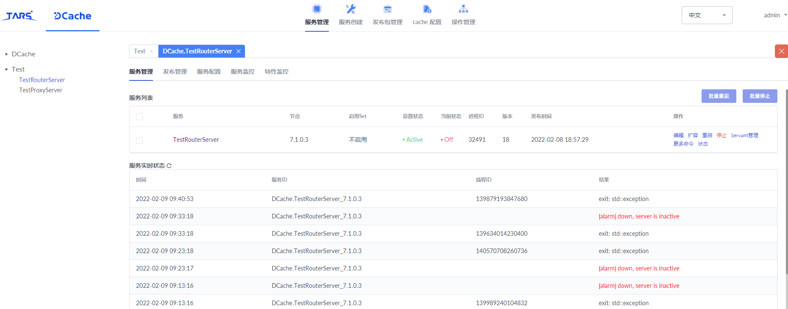
DCache RouterServer 无法启动

RouterServer 日志
[server config]:
  | Application(app) DCache
  | ServerName(server) TestRouterServer
  | BasePath(basepath) /usr/local/app/tars/tarsnode/data/DCache.TestRouterServer/bin/
  | DataPath(datapath) /usr/local/app/tars/tarsnode/data/DCache.TestRouterServer/data/
  | LocalIp(localip) 7.1.0.3
  | Local(local) tcp -h 127.0.0.1 -p 43756 -t 10000
  | LogPath(logpath) /usr/local/app/tars/app_log/
  | LogSize(logsize) 10485760
  | LogNum(lognum) 10
  | LogLevel(loglevel)
  | Log(log) tars.tarslog.LogObj
  | Node(node) tars.tarsnode.ServerObj@tcp -h 7.1.0.3 -p 19386 -t 60000
  | Config(config) tars.tarsconfig.ConfigObj
  | Notify(notify) tars.tarsnotify.NotifyObj
  | OpenCoroutine(opencoroutine) 0
  | CoroutineMemSize(coroutinememsize) 1073741824
  | CoroutineStackSize(coroutinestack) 131072
  | CloseCout(closecout) 1
  | NetThread(netthread) 1
  | ManualListen(manuallisten) 0
  | ReportFlow(reportflow) 1
  | BackPacketLimit(backpacketlimit) 100
  | BackPacketMin(backpacketmin) 1024
  | ----------------------------------------------------------------------------------------------------
  | [set file cache ] OK
  | ----------------------------------------------------------------------------------------------------
  | [set roll logger] OK
  | ----------------------------------------------------------------------------------------------------
  | [set time logger] OK
  | ----------------------------------------------------------------------------------------------------
  | [set remote config] OK
  | ----------------------------------------------------------------------------------------------------
  | [set remote notify] OK
  | ----------------------------------------------------------------------------------------------------
  | [set node proxy] OK
  | ----------------------------------------------------------------------------------------------------
  | [set admin adapter] OK
  | [TC_Socket::bind] bind error :Address already in use, 127.0.0.1:43756
  | bind:tcp -h 127.0.0.1 -p 43756 -t 10000 error:std::exception
  | [Application]:std::exception

tarsAdminRegistry 日志
2022-02-09 09:40:52\|139898073896704\|DEBUG\|ExecuteTask::getTaskRsp, taskNo=e6193914ab904cb388edad3b261e35ef, rsp:{"createTime":"2022-02-09 09:40:52","status":0,"serial":true,"taskNo":"e6193914ab904cb388edad3b261e35ef","userName":"admin","taskItemRsp":[{"percent":0,"executeLog":"","statusInfo":"EM_I_RUNNING","endTime":"","startTime":"2022-02-09 09:40:52","status":1,"req":{"userName":"admin","command":"restart","parameters":{},"setName":"","serverName":"TestRouterServer","nodeName":"7.1.0.3","application":"DCache","itemNo":"6e029e4dbaef475c8332f83c935c564b","taskNo":"e6193914ab904cb388edad3b261e35ef"}}]}
--
  | 2022-02-09 09:40:56\|139898040325888\|DEBUG\|ExecuteTask::getTaskRsp, taskNo=e6193914ab904cb388edad3b261e35ef
  | 2022-02-09 09:40:56\|139898040325888\|DEBUG\|ExecuteTask::getTaskRsp, taskNo=e6193914ab904cb388edad3b261e35ef, rsp:{"createTime":"2022-02-09 09:40:52","status":0,"serial":true,"taskNo":"e6193914ab904cb388edad3b261e35ef","userName":"admin","taskItemRsp":[{"percent":0,"executeLog":"startServer [DCache.TestRouterServer] from 7.1.0.3 :server is activating, please check: ","statusInfo":"EM_I_SUCCESS","endTime":"2022-02-09 09:40:53","startTime":"2022-02-09 09:40:52","status":2,"req":{"userName":"admin","command":"restart","parameters":{},"setName":"","serverName":"TestRouterServer","nodeName":"7.1.0.3","application":"DCache","itemNo":"6e029e4dbaef475c8332f83c935c564b","taskNo":"e6193914ab904cb388edad3b261e35ef"}}]}
  | 2022-02-09 09:40:59\|139898090682112\|DEBUG\|updateRegistryInfo2Db affected:4
  | 2022-02-09 09:40:59\|139898090682112\|DEBUG\|loadIPPhysicalGroupInfo get server group from db, records affected:0
  | 2022-02-09 09:40:59\|139898048718592\|DEBUG\|into getLogData


/usr/local/app/tars/app_log//DCache/TestRouterServer/DCache.TestRouterServer.log

====================================================================================================
[proxy config]:                                   
----------------------------------------------------------------------------------------------------
[load client]:                                    
locator                                           tars.tarsregistry.QueryObj@tcp -h 7.1.0.3 -p 17890:tcp -h 7.1.0.4 -p 17890
sync-invoke-timeout                               3000
async-invoke-timeout                              5000
refresh-endpoint-interval                         60000
stat                                              tars.tarsstat.StatObj
property                                          tars.tarsproperty.PropertyObj
report-interval                                   60000
keep-alive-interval                               
netthread                                         
asyncthread                                       3
modulename                                        DCache.TestRouterServer
enableset                                         n
setdivision                                       NULL
----------------------------------------------------------------------------------------------------
[server config]:                                  
Application(app)                                  DCache
ServerName(server)                                TestRouterServer
BasePath(basepath)                                /usr/local/app/tars/tarsnode/data/DCache.TestRouterServer/bin/
DataPath(datapath)                                /usr/local/app/tars/tarsnode/data/DCache.TestRouterServer/data/
LocalIp(localip)                                  7.1.0.3
Local(local)                                      tcp -h 127.0.0.1 -p 43756 -t 10000
LogPath(logpath)                                  /usr/local/app/tars/app_log/
LogSize(logsize)                                  10485760
LogNum(lognum)                                    10
LogLevel(loglevel)                                
Log(log)                                          tars.tarslog.LogObj
Node(node)                                        tars.tarsnode.ServerObj@tcp -h 7.1.0.3 -p 19386 -t 60000
Config(config)                                    tars.tarsconfig.ConfigObj
Notify(notify)                                    tars.tarsnotify.NotifyObj
OpenCoroutine(opencoroutine)                      0
CoroutineMemSize(coroutinememsize)                1073741824
CoroutineStackSize(coroutinestack)                131072
CloseCout(closecout)                              1
NetThread(netthread)                              1
ManualListen(manuallisten)                        0
ReportFlow(reportflow)                            1
BackPacketLimit(backpacketlimit)                  100
BackPacketMin(backpacketmin)                      1024
----------------------------------------------------------------------------------------------------
[set file cache ]                                 OK
----------------------------------------------------------------------------------------------------
[set roll logger]                                 OK
----------------------------------------------------------------------------------------------------
[set time logger]                                 OK
----------------------------------------------------------------------------------------------------
[set remote config]                               OK
----------------------------------------------------------------------------------------------------
[set remote notify]                               OK
----------------------------------------------------------------------------------------------------
[set node proxy]                                  OK
----------------------------------------------------------------------------------------------------
[set admin adapter]                               OK
[TC_Socket::bind] bind error :Address already in use, 127.0.0.1:43756
bind:tcp -h 127.0.0.1 -p 43756 -t 10000 error:std::exception
[Application]:std::exception
/usr/local/app/tars/tarsnode/data/DCache.TestRouterServer/bin/TestRouterServer redirect stdout and stderr  to /usr/local/app/tars/app_log//DCache/TestRouterServer/DCache.TestRouterServer.log


## [What should I do if the installation and release prompt timed out? ](/TarsCloud/Tars/issues/797)


The docker version is Version: 2.1.0.


The version is too low. Use version 2.4.5. It is recommended to update to tarscloud/framework:v2.4.5.


版本太低了, 用2.4.5版本，建议更新至tarscloud/framework:v2.4.5。


## [web不更新版本（1.4版本），更新framework到最新版本，可行吗？](/TarsCloud/Tars/issues/796)


What language are you using?
What operating system (Linux, Ubuntu, …) and version?
What runtime / compiler are you using (e.g. jdk version or version of gcc)
Make sure you include information that can help us debug (full error message, exception listing, stack trace, logs).


按说问题不大,可以跑


## [TARS_ CLIENT_ Where can logger be configured to turn off?](/TarsCloud/Tars/issues/795)


No description provided.


Define the corresponding path in logback and modify the log level.
Or in the <  logger name = tars_ CLIENT_ LOGGER" level="ERROR" >
< appender-ref ref="client_ logger"/  >
It is also OK after <  / logger  >.
Similar to other Dao layers. If you need mybatis log and other operations. The output can be modified or not according to the package path or loggername.
This log and log4j are basically consistent with other log controllers


The log output level can be customized for a package path


You can customize the log output level for loggername


在logback中定义对应的路径修改日志的等级即可。
或者在    < logger name="TARS_CLIENT_LOGGER" level="ERROR" >
< appender-ref ref="client_logger"/ >
< /logger >后也是可以的。
类似操作其他的dao层一样。若是需要Mybatis的日志等操作。也是按这样的package 路径 或者loggername来修改输出或者不输出。
这个日志和Log4j与其他的日志控制器基本一致的
1、 可以针对某个package路径统一定制日志输出等级
2、 可以针对loggerName来定制日志的输出等级


## [Does this koa need to be downloaded separately? Or where did I put it wrong?](/TarsCloud/Tars/issues/794)


The previous 2.1 web did not have this problem.


It seems that the uploading and publishing interface of tarsweb is not verified, and the service can be successfully published without a token.


TarsWeb的上传发布接口好像没有做验证，没有带token也能成功发布服务。(见备注图)


## [Running Linux_ install.sh Error installing tars framework, log output MySQL access failed? Is it a bug? ](/TarsCloud/Tars/issues/793)


Maria DB 10.4.13 was used.


The installation script will automatically create a TarsAdmin database user for subsequent service use. The installation script executes the corresponding creation commands by detecting the user mysql version, because different versions of mysql are different. But mariaDB is special, so the creation of TarsAdmin user may not be executed successfully.


安装脚本运行过程会自动创建TarsAdmin数据库用户，用于后续服务的使用。安装脚本通过检测用户mysql版本来执行相应的创建命令，因为不同版本mysql有所差别。但是mariaDB较为特殊，因此可能没有成功执行TarsAdmin用户的创建。


## [  Why is there no web and system under PM2 list after restart?](/TarsCloud/Tars/issues/792)


Attachment: CMD log command PM2 list

[PM2][WARN] Current process list running is not in sync with saved list. tars-node-web tars-user-system differs. Type 'pm2 save' to synchronize.


Follow the WARN log output by cmd. The reason is that the currently running process list is not synchronized with the saved list. Just enter pm2 save as prompted in the log.


按照cmd输出的WARN日志，原因是当前运行的进程列表没有和已保存的列表同步，按照日志中的提示输入pm2 save即可


## [ When building tars and setting up the environment for the first time, cmake reports an error.](/TarsCloud/Tars/issues/791)

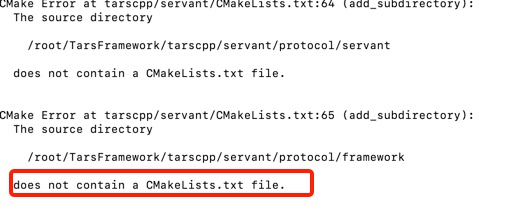


After creating a folder in protocol/servant, cmake again prompts "does not contain a CMakeLists.txt file".


Both commands "git clone https://github.com/TarsCloud/TarsFramework.git --recursive "and "git submodule update --remote --recursive" are executed 100%.


According to the log in the figure, the missing CMakeList files are all in the submodule tarscpp. The reason is that there is no clone. Please check the file status under the tarscpp module.


根据图中日志显示，缺失的CMakeList文件都在子模块tarscpp中，原因大概率是没有clone下来，请检查tarscpp模块下的文件情况


## [How to see the tars Framework version used in the system now?](/TarsCloud/Tars/issues/790)


No description provided.


There is currently no direct way to view it. You can see the version of TarsWeb on the TarsWeb management page. If necessary, you can view the current git commit record through git log, and find the corresponding version on GitHub.


目前没有直接查看的方式，TarsWeb管理页面可以看到TarsWeb的版本。如若需要可以通过git log查看当前的git提交记录，在GitHub上找到对应版本.


## [  Tarsgeway uses installation scripts install.sh The installation process shows success. Why does the final test result fail?](/TarsCloud/Tars/issues/789)


No description provided.


The first parameter of the install.sh installation script is the host address of TarsWeb, which needs to include the port, that is, ip:port, such as 1.2.3.4:3000. Only entering the IP will not call the relevant interface. Shows that the installation is successful is a problem with the current installation script, which will be repaired later.


install.sh安装脚本的第一个参数为TarsWeb的host地址，需要包含端口，即ip:port，例如1.2.3.4:3000，只输入IP会无法调用相关接口。显示安装成功是目前安装脚本存在的问题，后期会进行修复。


## [Tars cpp2. X is on the node side. The script command to manually stop the service is?](/TarsCloud/Tars/issues/788)


Remote login, not convenient to stop with the web.


There is no way to manually kill it as long as the tarsnode node is still there and the node service status is active, the service will continue to be pulled. In the source code implementation, only the stopServer that calls the node node will set the service status to inactive.


没有办法，手动kill掉只要tarsnode节点还在，并且节点服务状态为active，就会一直拉起服务。源码实现中，只有调用node节点的stopServer才会将服务状态设置为inactive。


## [Does tars2php not support enumeration types? How to deal with enumeration types when interacting with CPP?](/TarsCloud/Tars/issues/787)


No description provided.


Use int instead of TarsPhp.


TarsPhp中使用int代替.


## [  How does tarsgo implement HTTPS?](/TarsCloud/Tars/issues/786)


No description provided.


TarsGo implements TarsHttpMux based on http natively encapsulated by Go. It is very simple to use, but it does not provide HTTPS-related analysis. Since HTTP is not a tars protocol and has little to do with the tars framework, you can directly use the http package natively encapsulated by Go to implement https.


TarsGo中基于Go原生封装的http，实现了TarsHttpMux，使用上非常简单，但是没有提供HTTPS相关的解析。由于HTTP不是tars协议，与tars框架关系不大，可以自行直接使用Go原生封装的http包实现https。


## [能否升级tars-php-server的依赖库](/TarsCloud/Tars/issues/785)


What language are you using?
PHP
What operating system (Linux, Ubuntu, …) and version?
Centos
What runtime / compiler are you using (e.g. jdk version or version of gcc)
gcc
能否升级tars-php-server的依赖库，
我尝试安装illuminate/database的时候  也只能安装5.x的因为它依赖tars_server的这两个库  但安装illuminate/database5.x的时候提示有相关的库已经废弃 建议安装高版本的
https://packagist.org/packages/phptars/tars-server


升级下版本


## [What is the reason for this prompt after login? ](/TarsCloud/Tars/issues/784)


The previously deployed business can run up, and today I want to redeploy this problem on another one.


Refreshing or logging out will not work, and it still prompts that you are not logged in.


It may be a bug that the ticket returned in the user module is undefined. The latest version of TarsWeb has fixed this problem. You can try to upgrade TarsWeb to solve this problem.


可能是用户模块中返回的ticket为undefined的bug，最新版的TarsWeb已经修复这个问题，可以尝试升级TarsWeb解决这个问题。


## [How do I see the version of the TARS framework currently used in the system?](/TarsCloud/Tars/issues/783)


No description provided.


There is currently no direct way to view it. You can see the version of TarsWeb on the TarsWeb management page. If necessary, you can view the current git commit record through git log, and find the corresponding version on GitHub


目前没有直接查看的方式，TarsWeb管理页面可以看到TarsWeb的版本。如若需要可以通过git log查看当前的git提交记录，在GitHub上找到对应版本


## [Getting started with HelloGo, the execution file here does not specify the ip and port in the previous code, what is the use?](/TarsCloud/Tars/issues/782)


The make & make tar command in the example executes compilation and packaging, first compiling and then packaging. The executable file is generated during the compilation phase, and the file is added to the release package during the packaging phase. Therefore, the executable file is the file generated during the intermediate phase of the command. It can also be used for debugging. In general, the service code does not specify the IP and port, but is specified when publishing the service through TarsWeb.


示例中的make & make tar命令执行编译和打包，先编译再打包，可执行文件是编译阶段生成的，打包阶段会将文件加入发布包，因此可执行文件是命令中间阶段生成的文件，可以不予理会，也可用于调试。一般情况下服务代码不会指定IP和端口，而是通过TarsWeb发布服务时指定的。


## [How do I set the timeout period of TARS microservice call?](/TarsCloud/Tars/issues/781)


No description provided.


It can be set in the template, or prx in the code can be configured.


模板里面可以设置，或者代码里面prx有函数可以配置。


Is the value on this page shown in the picture?


如图是这个页面的值吗？


No, it is configured in the template.


不是，是在模板里面配置的。


Which field is configured in the figure below?


是在下图哪个字段配置的？


In the client domain.


client域内。


## [What does the load here mean?](/TarsCloud/Tars/issues/780)


Why some display 0, some display 1, did not make relevant choices during installation.


This is the load load of the machine. It is only displayed for the moment, it has no effect


这是机器的负载load，目前只是显示看看, 无作用


## [Tars has been created in k8s. What can I do to let the Internet access the services inside?](/TarsCloud/Tars/issues/779)


No description provided.


This involves the use of k8s. Exposing applications in k8s to the Internet can be achieved by exposing pod or service. You can find related implementation methods by yourself and choose the implementation method that suits you.


这个就涉及到k8s使用的问题了，向外网暴露k8s中的应用，可以通过暴露pod或者是service等实现，可以自行查找相关实现方法，选择适合自己的实现方式


## [When the Internet machine is migrated and the IP and port of the target obj are modified, will tars stringtoproxy get the new address immediately? How is this synchronized?](/TarsCloud/Tars/issues/778)


No description provided.


It needs to be migrated to a machine where tarsnode has been deployed. When the client requests it, it will first request the service address stored in the cache. If it is not available, it will obtain the update service address from the registry and then request the service.


需要迁移到已经部署tarsnode的机器上，客户端请求时会优先请求缓存中保存的服务地址，不可用时从注册中心获取更新服务的地址，再请求服务。


## [Where to read the log of web itself?](/TarsCloud/Tars/issues/777)


The services on my side are all normal. When starting the web, it shows that it is successful, but the process does not exist.


In framewok, PM2 logs


在framewok里看，pm2 logs


## [Can the latest version of the tar framework be installed offline? ](/TarsCloud/Tars/issues/776)


Why do I go down when I compile?


Can I jump over?


It seems that in the Internet environment, compile it and then transfer it to the intranet to recompile.


There is a download directory. Copy is OK in the past.


有一个download目录的，copy过去就行


## [In Application.cpp, why should an AdminObj be set?](/TarsCloud/Tars/issues/775)


This is the management port of the service, used by tarsnode.


这是服务的管理端口, 给tarsnode用的。


## [As shown in the figure, I have configured the tracing configuration in the tars-java template and started a zipkin server, but found that the data is not reported to zipkin. What could be the reason?](/TarsCloud/Tars/issues/774)


After configuration, you can check if there are corresponding zipkin logs when zipkin and local requests are made. If not, it means the configuration was unsuccessful.


可以在配置好后，看一下zipkin和本地的请求的时候 ，有没有对应的zipkin的日志。若是没有的话，就表示配置不成功。


## [As shown in the figure, what is this mechanism?](/TarsCloud/Tars/issues/773)


The self-start detection after down, that is, the frequency protection is pulled up after the program hangs.


down之后的自启检测，也就是程序挂了之后拉起做个频率保护。


## [As shown in the figure, what program is generally used to update the present_state field?](/TarsCloud/Tars/issues/772)


Tarsnode informs tarsregistry.


tarsnode通知tarsregistry。


## [The result of the request on the server is shown in the figure. , May I ask what may cause it?](/TarsCloud/Tars/issues/771)


After installing the framework through docker on the server, port 3001 can be accessed and the password is reset after success. Later, when the gateway is installed to generate the token, it is found that 3001 cannot be accessed. 3000 can be accessed normally.


Just use port 3000. In the new version, the user module and management module ports are combined into one port, and they are all accessed through 3000. TarsGateway's documentation has not been updated, and will be updated later.


使用3000端口就行了，新版本中将用户模块和管理模块端口合并到一个端口了，都是通过3000访问。TarsGateway的文档还没有更新，后续会更新。


## [Which service should GatewayServer use, do I have to configure <proxy> first?](/TarsCloud/Tars/issues/770)


No description provided.


Yes, you need to configure forwarding.


是的，要配置转发吧。


## [As shown in the figure, in the production environment deployment, can the service node and application node be placed on the same server?](/TarsCloud/Tars/issues/769)


No, the production environment usually uses net=host mode.


不能 ，生产环境通常用net=host模式。


## [After I restart, there is no web and system under PM2 list. What is the reason?](/TarsCloud/Tars/issues/768)


Look at the output warm log. If the saved list is not synchronized, enter the command according to the prompt.


看输出的warm日志，没有同步saved list，按照提示输入命令试试。


## [Failed to publish dcacheoptserver.](/TarsCloud/Tars/issues/767)


It's a matter of authority.


权限的问题。


## [在web页面上面试图删除不活跃的节点似乎没有起作用](/TarsCloud/Tars/issues/766)


基本情况
tarsweb的版本的为2.4.4，Tars Framework用的是github上的master分支手动编译安装
问题描述
根据官方文档的指示通过docker的方式自动注册了一个节点，然后可以在web管理平台上面看到新注册的这个节点，我并没有在这个节点容器的部署任何服务的情况下，使用docker stop命令结束了容器，打算删除这个节点，等到web页面显示该节点变成inacitvate的时候，点击删除，页面消息框弹出undifine的错误。试着去使用api的方式去删除这个不活跃的节点，发现返回的json数据状态显示为200状态，但是依旧发现在web端任然该节点还是存在。
所以就有一些好奇，是我这边的删除节点的操作有误还是tarsweb平台的bug，如果是真的想要删除这个节点，那么标准的方式或者是应该要做哪一些操作


tarsweb的bug, 新版本已经解决了


## [TarsGo客户端不会自动上报stat和property](/TarsCloud/Tars/issues/765)


What language are you using?
Java go
What operating system (Linux, Ubuntu, …) and version?
Linux
What runtime / compiler are you using (e.g. jdk version or version of gcc)
jdk8，golang1.14
Make sure you include information that can help us debug (full error message, exception listing, stack trace, logs).
TarsGo客户端，如果不是部署在Tars框架内的话，不会自动上报state和property。而TarsJava即使不部署在Tars框架内，也会正常自动上报，这个特性还是很好用的，用到的场景也比较多，因为很多情况下，服务是不会部署在Tars框架内的。
使用的是当前最新的TarsGo release版本1.1.4，不知道有没有计划解决这一问题。


你得用communicator,设置stat  & property属性, 设置你上报的服务的stat, property的obj吧


你得用communicator,设置stat & property属性, 设置你上报的服务的stat, property的obj吧

设置过了，还是不行，我也在QQ群里问了下，好像这个确实是个问题。下面这这两种方式都尝试了，还是不行。代码如下：
//communicator.Client.Stat = "tars.tarsstat.StatObj"
//communicator.Client.Property = "tars.tarsproperty.PropertyObj"
communicator.SetProperty("property", "tars.tarsproperty.PropertyObj")
communicator.SetProperty("stat", "tars.tarsstat.StatObj")

我现在添加了这段代码，给非tars客户端也添加了tars服务的配置文件，并且启动go tars.Run()，是可以上报了，但是感觉这不是一个很好的方案。代码如下：
tars.ServerConfigPath = "tars配置文件路径...."
go tars.Run()

希望之后版本可以出一个比较优雅的解决方案。


该issue长期未更新。如果问题依旧没解决，欢迎重新打开issue。TARS社区有您更精彩。
Thanks for your supporting. The issue has not been updated for a long time. If the problem is still not resolved, welcome to reopen the issue.


## [  I want to publish a service, a demo Hello world service, and the server is ready to write it in go. But there are three questions I don't understand.](/TarsCloud/Tars/issues/764)


The tars I just used, and Docker. The main control is on 172.25.0.3. 172.25.0.4 is node1 and 172.25.0.5 is node2.
.3 mapped out 3000,3001.
.4 mapped out 9000-9010 to host 9000-9010
.5 maps out 9010-9020 to 9010-9020 of the host.


Q1. Choose tars.default or tars.go.default for the template? The picture in the document is tars.default.


Q2. Can the selected node be .3? Still can only choose .4 or .5?


Q3. The port to which OBJ is bound must be between 9000-9010 or 9010-9020, or can it be random, for example 17874?


A1. Templates are fine, no difference


A2. Go services can be published


A3. If docker is in host mode, the port can be unmapped or random.


A1. 模板都可以，没区别


A2. go的服务都可以发布


A3. docker如果是host模式的,端口可以不用映射，也可以随机。


## [  The relative path used in the code was originally started by its own script, which is a relative path. After taking it, the code in the project can't find the root directory of the service, so an error is reported. What's the matter? (see below for details)](/TarsCloud/Tars/issues/763)


Put the generated tars_ start.sh After the script content is copied, it is OK to start in the foreground, but click start on the page, and a configuration file (not tarsconfig configuration, but local) in the project is not loaded.


See the document for configuration


java -Dconfig=/usr/local/app/tars/tarsnode/data/TestApp.VertxHelloServer/conf/TestApp.VertxHelloServer.config.conf -Dcom.sun.management.jmxremote.ssl=false -Dcom.sun.management.jmxremote.authenticate=false -Xms2000m -Xmx2000m -Xmn1000m -Xss1000k -XX:CMSInitiatingOccupancyFraction=60 -XX:+CMSParallelRemarkEnabled -XX:+CMSScavengeBeforeRemark -verbosegc -XX:+PrintGCDetails -XX:ErrorFile=/usr/local/app/tars/app_log//TestApp/VertxHelloServer/jvm_error.log -Xbootclasspath/a:/usr/local/app/tars/tarsnode/data/TestApp.VertxHelloServer/bin/conf -cp /usr/local/app/tars/tarsnode/data/TestApp.VertxHelloServer/bin//classes:/usr/local/app/tars/tarsnode/data/TestApp.VertxHelloServer/bin//lib/* com.qq.tars.server.startup.Main
-Xbootclasspath/a:/usr/local/app/tars/tarsnode/data/TestApp.VertxHelloServer/bin/conf
直接执行java -Dconfig=/usr/local/app/tars/tarsnode/data/TestApp.VertxHelloServer/conf/TestApp.VertxHelloServer.config.conf -Dcom.sun.management.jmxremote.ssl=false -Dcom.sun.management.jmxremote.authenticate=false -Xms2000m -Xmx2000m -Xmn1000m -Xss1000k -XX:CMSInitiatingOccupancyFraction=60 -XX:+CMSParallelRemarkEnabled -XX:+CMSScavengeBeforeRemark -verbosegc -XX:+PrintGCDetails -XX:ErrorFile=/usr/local/app/tars/app_log//TestApp/VertxHelloServer/jvm_error.log -Xbootclasspath/a:/usr/local/app/tars/tarsnode/data/TestApp.VertxHelloServer/bin/conf -cp /usr/local/app/tars/tarsnode/data/TestApp.VertxHelloServer/bin//classes:/usr/local/app/tars/tarsnode/data/TestApp.VertxHelloServer/bin//lib/* com.qq.tars.server.startup.Main 就可以把程序正常启动起来 在页面上点击就启动不起来 错误日志提示 我的/usr/local/app/tars/tarsnode/data/TestApp.VertxHelloServer/bin/conf中的一个配置文件找不到


Restart the tarsnode. I think it's still necessary to think about the business code.


把tarsnode重启一下，估计还是得业务代码上想想办法。


## [Where is the implementation code of jump_fcontext and make_fcontext? Where are the descriptions of these two interfaces?](/TarsCloud/Tars/issues/762)


No description provided.


Assembly implementation, with the source code in boost.


汇编实现的，用的boost里面的源码。


## [If nodes are distributed on various physical machines, some problems may be encountered during actual use.](/TarsCloud/Tars/issues/761)


For example, if multiple services are deployed on a node, there may be java, php, and go. Once one of the services is abnormal, such as If the CPU is used up, other services will also be affected. Is there any way to avoid this situation?


In theory, as long as multiple services are deployed on the same node, this kind of problem cannot be avoided. It is recommended to improve your monitoring and give early warning in time. Normally, each service is backed up at multiple points. Even if a server is really down, there will be no impact. It can also be solved with docker, k8s and the like, one docker for each service, limit it.


理论上来说，只要是多个服务部署在同一个节点，这种问题就避免不了。建议完善你的监控，及时预警。正常来说每个服务都是多点备份的，就算一台服务器真的宕机了，也不会有什么影响。用docker, k8s之类的也可以解决的, 每个服务一个docker, 限制一下。


## [When deploying a cluster, can I use keepalived + multiple Tars gateway servers?](/TarsCloud/Tars/issues/760)


No description provided.


If it is deployed on Tencent Cloud or the like, just go to the gateway via slb. If you deploy by yourself, the gateway is deployed on the external network and the domain name can be directly resolved.


如果是部署在腾讯云之类的, 通过slb转到网关就可以了。如果是自己部署, 网关部署在外网, 域名直接解析即可。


## [Can the tars call parameter pass the list object?](/TarsCloud/Tars/issues/758)


No description provided.


Yes, there is vector.


可以的，有vector。


## [If I use the HTTP website deployed by tars, how can I configure the domain name pointing? Do I still need nginx to forward it?](/TarsCloud/Tars/issues/757)


Just add nginx in front of the gateway, and nginx is not needed for forwarding. You can use tars that gateway directly.


在网关前加nginx就可以了，不需要nginx进行转发。可以直接用tars那个网关。


## [I don't understand the gateway document. What is the format of the content to be transmitted? Where is the basepacket? ](/TarsCloud/Tars/issues/756)


this means that when you use the tup proxy, when the client requests, you need to sequence the tarsobject into binary and put it in the body for forwarding. General scenarios are not used. The core and practical function is the mode of JSON.


这个意思是说当你使用这个tup proxy的时候，在客户端请求的时候，需要自己把tarsObject序列化成二进制，放到Body中做转发。一般的场景并不会用到。核心且实用的功能，是json的模式。


In what scenarios will tup proxy be used?


tup proxy在什么场景下会用到？


Tup can use this mode when your IOS or Android serialization scenario uses the tar protocol. The benefits and choices depend on your business scenario and the employees' grasp of the overall project. After all, this part requires IOS & Android development engineers to be familiar with this part of the resolution protocol.
The core point is still JSON as the RPC transport protocol, or the tar stream as the RPC transport protocol. Their role in the forwarding service is equivalent, so is the scenario used.
Generally speaking, it is recommended to use JSON for gateway users. In the future, the JSON coming in from the gateway will be dyed directly on the web. You will see the call chain and parameters of the complete gateway. After using JSON, you can configure and dye some.


tup在你的ios OR android的序列化场景使用的是tars协议的时候，可以使用这种模式。收益和选择看你的业务场景和员工对整体工程的把握，毕竟这一部分需要ios&& android的开发的工程师也熟悉这一部分的解析协议。
核心点还是json作为Rpc传输协议，还是tars流作为rpc传输协议，他们的作用在转发服务中是对等的，使用的场景也是如此。
总体而言，建议走网关的用json，后续，会在web上直接对网关进来的json做染色，会看到完整网关进来的调用链和参数，用json后面好配置染色一些。


How do I access the HTTP proxy in the gateway as shown in the figure above? I tried http://127.0.0.1 : gateway port / testhost is 404.


在gateway像上图那样配置http代理， 要怎么访问？我试了下 http://127.0.0.1 :gateway端口/testhost，是404。


## [ I have a question. I called tarsgeway and reported a version error using the JSON protocol. What should I do?](/TarsCloud/Tars/issues/755)


With the latest version, the back-end service still reports an error. The back-end version is 1.7.2.


the generated plug-in needs to process this node. In the example server, change the node to true and regenerate the servant publishing service. If you take the example of Hello, the label is false. (see note figure)


生成的插件里面要处理一下这个节点，example Server里面，要把这个节点改成true，重新生成servsant发布服务即可，你拿的hello的example，这个标签是false。(见图)


It still reported an error. I debugged it. If this line of code is wrong, it will throw an exception if it doesn't go in.


Is there any restriction on the post request parameter?


还是报错了，我debug了，是这行代码出错了，判断没进去，就抛异常，


是不是post请求参数有什么限制？


what is your abnormal information here? If the getname cannot be obtained here, the name is not present when parsing, that is, the tup is not opened.


你这里的异常信息是什么？这里若是获取不到getName的话，就是解析的时候名称不在，就是tup这里没有开。


It still report this mistake.


还是报这个错。


该issue长期未更新。如果问题依旧没解决，欢迎重新打开issue。TARS社区有您更精彩。
Thanks for your supporting. The issue has not been updated for a long time. If the problem is still not resolved, welcome to reopen the issue.


## [Where is the entry point for this property report?](/TarsCloud/Tars/issues/754)


The interface is here to view. (see note figure)
https://tarscloud.github.io/TarsDocs/dev/tarscpp/tars-guide.html
Report can see here 12. Attribute statistics.


界面上是这里可以查看。(见备注图)
https://tarscloud.github.io/TarsDocs/dev/tarscpp/tars-guide.html
上报可以看看这里12.属性统计。


## [Must 3000 and 3001 be specified for this web port?](/TarsCloud/Tars/issues/753)


I can't access the web with my 3008.


3008:3000
3009:3001


In other words, the container port must specify 3000 and 3001, and the external port is optional, right?


也就是说，容器端口必须指定3000  和3001，外部端口随意，是吗？


Yes, unless you change the configuration of tarsweb. However, it is best not to modify the port number. If the login jump address is written dead in the configuration file of the web project and the port number of the login service is changed, the login jump will fail.


对，除非你改tarsweb的配置。不过最好是不要修改端口号，web 项目里配置文件中写死了登录跳转地址，改了登录服务的端口号，登录跳转会失败。


Is the node port limited?


那node节点端口有限制吗？


No.


没有。


## [Can tlog / dlog customize log format?](/TarsCloud/Tars/issues/752)


I want to add information like function name and line number.


C + + can add a layer of macro packaging.


c++可以自己加一层宏包装。


## [As shown in the figure, tarNode has been started when the framework is deployed. Do I need to install tarNode separately in this step of TarNode deployment?](/TarsCloud/Tars/issues/751)


This is for other servers, that is, if the framework is on machine A and the business service is on machine B, you need to install tarNode separately on B. The same node is not needed.


这个是给其他服务器准备的，就是说框架在A机器，业务服务在B机器的话就需要给B上单独安装tarNode，同节点是不需要了。


## [The node starts normally, and it is on the same machine as the docker of the framework, but the newly added node cannot be seen in the background? What could be the reason for this?](/TarsCloud/Tars/issues/750)


No description provided.


No, because the port conflicts. The framework also contains a node, the host mode you use, so the port will conflict.


不行，因为端口冲突了。framework里面也包含了一个node，你都用的host模式，所以端口会冲突。


## [What should I do if I want to perform load balancing to serve two nodes?](/TarsCloud/Tars/issues/749)


No description provided.


Use frame rpc to call, automatically load, the frame does.


用框架rpc调用, 自动负载的, 框架做了。


## [Remote login, it is not convenient to stop using the web. Tars cpp2.x is on the node side, what is the script command to manually stop the service?](/TarsCloud/Tars/issues/748)


No description provided.


There is no way. After manually killing it, as long as the tarsnode node is still there and the node service status is active, the service will continue to be activated. In the source code implementation, only the stopServer that calls the node node will set the service status to inactive.


没有办法，手动kill掉之后，只要tarsnode节点还在，并且节点服务状态为active，就会一直拉起服务。源码实现中，只有调用node节点的stopServer才会将服务状态设置为inactive。


## [Under the same TARS cluster, are TarLog and TasPatch the same as tarsAdminRegisrty, and there can only be one instance?](/TarsCloud/Tars/issues/747)


No description provided.


Yes, tarspatch needs to be with tarsweb. Because of the uploaded release package, tarspatch needs to access it. If you use a shared disk, you can deploy multiple tarspatch. But tarslog is generally one set, you can use multiple sets, use templates to assign different business services, and report logs to different tarslogs. It is equivalent to tarslog is the log server, which receives the logs of each tars service.


是的，tarspatch需要和tarsweb在一起。因为上传的发布包, tarspatch需要访问到。如果使用一个共享盘，就可以部署多台tarspatch了。但tarslog, 一般就一台, 你可以多台, 用模板分配不同的业务服务, 上报日志到不同的tarslog。相当于tarslog是log服务端，接收各tars服务日志的。


## [In the transmitted binary data, are tags strictly ordered?](/TarsCloud/Tars/issues/746)


No description provided.


It is strictly orderly.


是严格有序的。


## [The business service platform cannot be started. I found that the start and stop scripts are not the same. The start php command stop is the execution path. Is there any intention to do this? ](/TarsCloud/Tars/issues/745)


This is uniformly configured in the template, but there are two in the script.


Take a look at the service template. PHP is configured in the template, which should be consistent.


看看服务模板, php这个是模板里面配置的, 按说应该要一致。


## [What happened to this mistake?](/TarsCloud/Tars/issues/744)


The document link on GitHub also failed.


The new version of tarsweb and tarsframwork is still the old version, not docker deployment. After I download the source code, I execute the SQL statement in the SQL folder, then change the configuration in the config, mainly change the database address and registry address, and set all enable to false, and finally execute NPM run PRD.


TarsWeb has a bug that the ticket is undefined. This problem has been fixed in the latest commit version. You can try to download the latest version and reinstall it. At the same time, TarsWeb currently has a bug in authentication, which may not be turned off if it is false in config.


TarsWeb存在ticket为undefined的bug，已经在最新的commit版本中修复了这个问题，可以尝试下载最新的版本重新安装。同时TarsWeb目前鉴权存在bug，在config中为false可能也无法关掉。


## [Start tarsgateway manually and report this error. What's going on?](/TarsCloud/Tars/issues/743)


Your configuration is wrong.


配置错误了。


## [What to do if the token cannot be obtained when installing tarsgeway?](/TarsCloud/Tars/issues/742)


When providing the client with HTTP protocol capability, you can use this gateway. You don't need to start an HTTP service by yourself. It provides HTTP capability for all tar services.


提供给客户端http协议能力的时候，可以使用这个网关，不需要自己启动一个http服务了，统一给所有的tars服务提供了 http的能力。


It's not the latest version. I don't see the user center.


不是最新版本，没看到用户中心。


Change Chrome browser, or clear the browser cache, maybe JS cache, or command + R refresh. If none of these works, upgrade the version.


换Chrome浏览器，或者把浏览器的缓存清了，可能是js缓存了，再或者command+R刷新一下。都不行升级一下版本看看。


## [A question: I have a service A, online environment. I have deployment in multiple regions with different configurations. How can I do this?](/TarsCloud/Tars/issues/741)


For example, Shenzhen and Shanghai have different DB configurations. How can I identify which configuration I use?


In your private template, specify the current - DENV = AreaA and - DENV = areab, which is OK. Because at startup, you can specify the configuration module for the current service.
Our approach is to configure independent configuration information in the private template, so that different configuration files can be loaded. (see note Figure)
CommunicatorFactory.getInstance ().getCommunicator().getCommunicatorConfig().getSetDivision()
If your configuration follows the environment, you can also partition your configuration information during setdivisioin. After obtaining the current setdivisioin, you can read your configuration. Through this API, you can get all the information of the current setdivisioin that has been configured on the platform.


在你的私有模板里面指定当前的-DENV=AREAA  和-DENV=AREAB，这样就可以了。因为在启动的时候，可以针对当前的服务指定配置模块的。
我们的做法是在私有模板这里配置独立的这一些配置的信息，这样加载就可以不同的配置文件了。(见备注图）
CommunicatorFactory.getInstance().getCommunicator().getCommunicatorConfig().getSetDivision()
若是你的配置是跟着环境走，也可以在setDivisoin的时候，划分好你的配置信息，获取到当前的setDivisoin后，再去读取你的配置，这也是可以的。通过这个API就可以获取当前的已经配置在平台上面的setDivisoin的所有的信息了


This is to set the configuration of existing machine nodes in batch, and then when the capacity is expanded, will the configuration of this private template be automatically carried?


这个是要批量设置已有机器节点的配置，然后扩容的时候，自动会把这个私有模板的配置携带上的吗？


When expanding, when the source IP node is specified, then copy is the private template of the IP node. (see note Figure）


扩容的时候，会指定源ip的节点的时候，那么copy的时候，就是这个ip节点的私有模板。(见备注图)


Copy the configuration of the template here to the private template, right? And then change the different places here, OK?


Is it possible to build multiple templates (Shenzhen, Shanghai) without using private templates, and then select different templates for different nodes.


是把这里模板的配置，全量拷贝到私有模板这里是吗？然后再这里修改下不同的地方，这样吗？


是不是也可以不用私有模板，我建多个模板(深圳，上海)，然后不同的节点，选择不同的模板。


Yes, node configuration is also OK (see note Figure). However, we usually use private templates and get setdivisioin to handle it. In this way, we don't need to pay attention to the configuration of this part, and avoid some risks of online when publishing.


是的，节点配置也是可以的(见备注图四)。不过我们这里一般用的是私有模板和获取setDivisoin来处理，这样发布就不用关心这一部分的配置了，在发布的时候，避免一些上线的风险。


## [What is the internal scene of gateway?](/TarsCloud/Tars/issues/740)


No description provided.


When providing the client with HTTP protocol capability, you can use this gateway. You don't need to start an HTTP service by yourself. It provides HTTP capability for all tar services.


提供给客户端http协议能力的时候，可以使用这个网关，不需要自己启动一个http服务了，统一给所有的tars服务提供了 http的能力。


Is it just the HTTP protocol?


只是http协议吗？


There are still current limiting, fusing, JSON, tup.


还有限流，熔断，json，tup。


What's the difference from other HTTP gateways?


那跟其他http网关的区别是什么？


If you import HTTP and export tars, you don't need to transfer agreements.
The service itself is also managed on the tar platform, so the back-end tar service expansion and so on can be completely seamless perception.
At the same time, it also supports the forwarding of ordinary HTTP to replace some functions of nginx. The forwarding configuration of the gateway is managed uniformly on the tars web.


入口http, 出口tars，就不需要转协议什么的。
服务本身管理也在tars平台上，所以后端tars服务扩容之类的，都能完全无缝感知。
同时也支持普通http的转发，取代部分nginx的功能。网关的转发配置在tars-web上统一管理。


Is the server-side protocol to be changed to JSON?


那么服务端的协议是不是要改为json之类的？


No, use the new version of the language lib and recompile it.
The apigateway has protocol transformation. After it is deployed to the platform, the client can request the tar service specified by the backend after installing the URL and JSON format defined by apigateway.


并不用，使用新版本的语言lib, 重新编译即可。
apigateway带了协议转换了，部署到平台后，客户端安apigateway定义好的url和json格式就可以请求到后端制定的tars服务了。


Can the request body be directly JSON when calling HTTP?


http调的时候请求体可以直接json吗？


HTTP request, put JSON in the package, and take a look at the document.


http请求，包体里面放json，看一下文档。


Does the server need to upgrade to 1.7.2?


服务端需要升级到1.7.2吗？


The support of java version is above 1.7.2. If you originally provided HTTP service for the client using springboot, you need to take a look at the usage scenario, switch to the request mode of apigateway, and the business clients such as IOS and Android need to be changed accordingly.


java版本的支持是1.7.2以上，若是原本给客户端使用springboot提供了http的服务的，那么需要看一下使用场景，需要切换成apigateway的请求模式，ios和android等业务掉用端，需要做相应的改变。


After reading the document, it is said that the body of post serializes the contents of the basepacket package tars. I also want to ask: where can I see the basepacket? Is there a document on the tars communication protocol and serialization protocol?


看了一下文档说post的body为BasePacket包tars序列化的内容。还想问下：BasePacket这个包可以在哪里看到？有没有tars通信协议和序列化协议的文档？


The official document of protocol design is available. You can have a look at the document.


协议的设计官方的文档有，可以看一下文档。


## [The framework will have a tars in the client of low version 1.5.0_ client.log Log is the log file must be typed?](/TarsCloud/Tars/issues/739)


It is found that only the client is used, and this log file is not available online. What is the general question?


This is the client log controller added in last year's version. Only the client will automatically output a separate log controller.


这是去年的版本添加的客户端日志控制器，只有客户端会自动输出单独的日志控制器。


## [Why does tarsgeway rely on tarsgateway_ user_ system？](/TarsCloud/Tars/issues/738)


No description provided.


This should not depend on it. Why dependence?


不依赖吧?为什么说依赖?


The token required to install gateway is from user_ System.


安装gateway需要的token是从user_system获取的。


To install the gateway interface, you need to call the web, and the token calling the web is generated by the user system.


安装gateway接口，需要调用web，调用web的token都是用户系统生成的。


源码安装 部署getway ,在本地为DHCP情况, 网关地址可以任意指定可用的ip吗?


## [Does tars keep the connection alive?](/TarsCloud/Tars/issues/737)


I see a tars_ping judgment in the code, but I don't see any code calling tars_ ping.


Now there is no active live operation.


现在没有主动保活操作的。


## [Three questions about tar HTTP server.](/TarsCloud/Tars/issues/736)


@ tarshttpservice ("httpobj") this is to declare an obj and register it with TAF, right?


Is there a monitoring system for tar HTTP?


How can the tar protocol of tar server be quickly converted to the JSON protocol of HTTP?


Tarshttpservice is a functional annotation, which indicates that the application can have the capability of HTTP service, and obtain the port from the configuration of servant to listen to the corresponding port to provide services.
The monitoring request of httpservice is not available. It can report the monitoring information by itself.
You can use the gateway directly. Now it is open. You can have a try.


1、TarsHttpService是一个功能性注解，表示这个应用可以拥有HTTP服务的能力，并从servant的配置中获取端口侦听对应的端口提供服务。
2、httpService的监控请求并没有，可以自己上报监控信息。
3、可以直接用网关，现在已经开放了，可以试一试。


Does this mean tupproxy? Is there a java version gateway?


是指的tupproxy吗，有java版本的网关吗？


https://github.com/TarsCloud/TarsGateway
It can completely replace tupproxy. All gateway forwarding configurations can be configured on the tarsweb platform. Now Java language supports it.


https://github.com/TarsCloud/TarsGateway
可以全面替换tupProxy，所有网关转发配置，tarsweb平台上都可以配置了，现在java语言都是支持的。


## [Tarsjava: > = v1.7.2 gateway requires version 1.7.2? ](/TarsCloud/Tars/issues/735)


Now Maven center still seems to be 1.7.1.


It is 1.7.2, and it has been to the central library. The gateway is supported in all language versions.


有1.7.2了，已经到中央库了，已经全语言版本都支持这个网关了。


## [Tars gray publishing, now support?](/TarsCloud/Tars/issues/734)


No description provided.


Not at the moment.


暂时没有。


## [The virtual machine was powered off. After the machine was restarted, the application services of tar could not be started, running / usr / local / APP / tars/ check.sh , show the content of the picture below. What's the situation?](/TarsCloud/Tars/issues/733)


The normal running virtual machine does not find any application directory under the / tars directory, only the services of stars.


The directory does not exist. Check it. It is estimated that the configuration file of tarsnode is empty. Take a look. This problem is known and has not been modified.By the way, mirror docker libstdc.so Up.


目录不存在，检查一下，估计tarsnode的配置文件为空了，你看一下，这个问题已知了，还没修改。
顺便把docker镜像 libstdc.so 升一下。


## [If the two are all tars protocols, I can call A:: async_ in A. response_ Function, but how to do it in the HTTP protocol?](/TarsCloud/Tars/issues/732)


Asynchronous nested call:
After receiving the HTTP request from the web, a calls B service asynchronously, and wants to return to web asynchronously after B service returns.


Take current and send response directly.


拿着current直接sendResponse。


## [In the spool task process, execute system ("date", $exit) to get the $exit code value of - 1, not 0. There is no problem using PHP to start directly. There is this problem when executing in the tar framework. How to solve this problem?](/TarsCloud/Tars/issues/731)


No description provided.


该issue长期未更新。如果问题依旧没解决，欢迎重新打开issue。TARS社区有您更精彩。
Thanks for your supporting. The issue has not been updated for a long time. If the problem is still not resolved, welcome to reopen the issue.


## [Tar + Yii remote download, if not exit, the following situation will appear. ](/TarsCloud/Tars/issues/730)


What function can be used instead of exit in the download.


You don't have to look at the swote document from the perspective of tars and Yii.


不用从tars和yii角度，看swoole文档。


## [ResponsePacket and RequestPacket both have context and status. What is the difference between these two values?](/TarsCloud/Tars/issues/729)


No description provided.


Context is used between two services, and status is passed from the beginning to the end of the call chain.


context 是两个服务之间用的，status 是从调用链的开始传到结束。


## [Does TarsGateway support HTTPS?](/TarsCloud/Tars/issues/728)


No description provided.


https entry is supported, but you need to compile the configuration yourself, enable https, and make your own certificate. Or you can add a NGINX outside, https forwarding http is enough.


支持https入口，不过需要自己编译配置，开启https，自己制作证书等。或者可以在外面加个NGINX，https转发http就可以了。


## [How does TARS implement https in go language?](/TarsCloud/Tars/issues/727)


No description provided.


Go can use the go package method, https and tars are irrelevant, you need to implement it yourself.


go用go包方式就可以了, https和tars就无关了, 需要自己实现。


How to use crt and key certificate files? Specifically, when deploying on TARS, how to load these certificates?


如何使用crt和key等证书文件？具体到TARS上部署的时候，如何加载这些证书？


It can be made into remote configuration, pulled to the local, and then loaded; or packaged with the bin file for release.


可以做成远程配置, 拉取到本地, 然后加载；或者和bin文件打包到一起发布。


## [Why is the new node not displayed in the node list after I add a new node?](/TarsCloud/Tars/issues/726)


Look at the tarsnode log of the corresponding machine, it may be a port problem. Or try to delete the original record from the mysql table and add it again.


看一下对应机器的tarsnode日志，有可能是端口的问题。或者尝试去mysql的表删除原来的记录，再添加一次。


## [How do I use my own customized configuration file for TARS services?](/TarsCloud/Tars/issues/725)


No description provided.


Add files through the web and pull remote files through addConfig.


通过web添加文件，并通过addConfig拉取远程文件。


## [As shown in the figure, this error is caused. What caused it?](/TarsCloud/Tars/issues/724)


It should be that the interface implementation function signature is incorrect.


应该是接口实现函数签名不对。


## [How does the test environment ensure that the log level is debug level?](/TarsCloud/Tars/issues/723)


No description provided.


Refer to https://doc.tarsyun.com/adminer/start/index.html#/.


参照 https://doc.tarsyun.com/adminer/start/index.html#/ 。


## [What is the problem that ProxyServer cannot be set to default when DCache is configured for web? ](/TarsCloud/Tars/issues/721)


There is no response or error when clicking the default button.


In tars 1.0, if it is the default, there will be an icon in front.


This error is reported when installing and publishing.


该issue长期未更新。如果问题依旧没解决，欢迎重新打开issue。TARS社区有您更精彩。
Thanks for your supporting. The issue has not been updated for a long time. If the problem is still not resolved, welcome to reopen the issue.


## [What's the bug? I can't upload the service package or download the service. ](/TarsCloud/Tars/issues/720)


该issue长期未更新。如果问题依旧没解决，欢迎重新打开issue。TARS社区有您更精彩。
Thanks for your supporting. The issue has not been updated for a long time. If the problem is still not resolved, welcome to reopen the issue.


## [Cdbhandle:: doupdateserverstatebatch, has anyone ever encountered the problem of batch operation MySQL failure? Multiple SQL statements fail all the time, and a single SQL statement is normal. ](/TarsCloud/Tars/issues/719)


2020-05-29 14:51:52|26977|ERROR|CDbHandle::doUpdateServerStateBatch exception: [TC_Mysql::execute]: mysql_query: [ UPDATE t_server_conf SET present_state='Inactive', process_id= 0 WHERE application='DidKeyBuilder' AND server_name='didkeyClient' AND node_name='10.38.166.103';UPDATE t_server_conf SET present_state='Inactive', process_id= 0 WHERE application='didkeyBuilder' AND server_name='didkeyServer' AND node_name='10.38.166.103';UPDATE t_server_conf SET present_state='Inactive', process_id= 0 WHERE application='didkeyClient' AND server_name='didkeyClient' AND node_name='10.38.166.103' ] :You have an error in your SQL syntax; check the manual that corresponds to your MySQL server version for the right syntax to use near 'UPDATE t_server_conf SET present_state='Inactive', process_id= 0 WHERE applicati' at line 1 sql:UPDATE t_server_conf SET present_state='Inactive', process_id= 0 WHERE application='DidKeyBuilder' AND server_name='didkeyClient' AND node_name='10.38.166.103';UPDATE t_server_conf SET present_state='Inactive', process_id= 0 WHERE application='didkeyBuilder' AND server_name='didkeyServer' AND node_name='10.38.166.103';UPDATE t_server_conf SET present_state='Inactive', process_id= 0 WHERE application='didkeyClient' AND server_name='didkeyClient' AND node_name='10.38.166.103'


该issue长期未更新。如果问题依旧没解决，欢迎重新打开issue。TARS社区有您更精彩。
Thanks for your supporting. The issue has not been updated for a long time. If the problem is still not resolved, welcome to reopen the issue.


## [Are these two classes automatically generated? ](/TarsCloud/Tars/issues/718)


What kind of order should be executed? Or where are the documents?


It's auto generated, with an MVN plug-in. Automatically generated plug-ins can run on MAC and Linux. (see https://github.com/TarsCloud/plugins/tree/master/java-protobuf-plugin  and  http://note.youdao.com/noteshare?id=ec37e7283c946dc98b9c03c6d0870a0e  and  https://github.com/TarsCloud/plugins)


是自动生成的，有个mvn插件。自动生成的插件可以在mac和linux运行。(见文档https://github.com/TarsCloud/plugins/tree/master/java-protobuf-plugin 和 http://note.youdao.com/noteshare?id=ec37e7283c946dc98b9c03c6d0870a0e 和 https://github.com/TarsCloud/plugins )


## [How is the directory after - CP added here? How to deal with this part of the address in the program?](/TarsCloud/Tars/issues/717)


This is implemented in the tarsnode part. It will help you to bring the address of this part. CP does not and does not affect; terminal problems may be plug-in problems.


这个是tarsnode部分实现的，会帮你带上这一部分的地址。cp里面没有也不影响；终端的问题 可能是插件的问题。


## [Where can I see the version number of the corresponding tarsframework code for this image? And this stable?](/TarsCloud/Tars/issues/716)


https://hub.docker.com/r/tarscloud/framework


In tags. The latest version is v2.4.0, corresponding from 2.4.0. Stable is also the latest. Stable should not be 2.4.0, but the difference should be small. It hasn't changed much recently. It is recommended to use tag with version number as much as possible to avoid passive upgrade. In the future, it is recommended to use docker with version number.


在Tags中，最新的版本为v2.4.0，从2.4.0开始对应，stable目前也是最新的。stable应该不是2.4.0的, 但是差别应该也不大了, 最近没怎么改了。建议尽量使用带版本号的Tag，可以避免被动升级。以后建议就用带版本号的docker了。


How does this tar node correspond to the tarsframe version? Do you also push the version corresponding to 2.4.0?

https://hub.docker.com/r/tarscloud/tars-node


这个tars-node跟tarsframe版本怎么对应？是否也推送下对应 2.4.0 的版本？

https://hub.docker.com/r/tarscloud/tars-node


This is not necessary. Node is just the runtime environment. The tarsnode application will be installed automatically after the container starts and successfully connects to the framework, so there is no version concept.


这个不用，node只是运行时环境。TarsNode应用会在容器启动并成功连接Framework后自动安装，所以没有版本概念。


## [Is this 3001 of framwork? What is a management port?](/TarsCloud/Tars/issues/715)


Remarks should not be shown in Figure 1, should be the service registration port, rpc port. The management port is a web port.


备注图1所示应该不是，应该是服务注册的端口， rpc的端口。管理端口是web端口。


172.25.13 is the node of framewrok, and 172.25.1.5 is the node of work.


What should be filled in for local?


172.25.1.3是framewrok的节点，172.25.1.5是work的节点

还有这里所示的local应该填什么？


The local is generated by the framework and does not need to be processed by yourself.


local是框架生成的，不需要自己处理。


## [The service monitoring as shown in the picture is not available. The error message is query 602. I have no corresponding localtime file in docker for windows. Is it because there is no time zone imported?](/TarsCloud/Tars/issues/714)


It does not matter, this is because yesterday's watch does not exist.


没关系，这是因为昨天的表不存在。


## [Is there a time type for documents when defining in Java xxx.tars?](/TarsCloud/Tars/issues/713)


No description provided.


No, the specific protocol type can be seen in the introduction of the tar protocol type.


没有，具体的协议类型可以看一下tars协议类型的介绍。


时间类型最好用long替代


## [Is this added to the template configuration file?](/TarsCloud/Tars/issues/712)


Yes, you need to add this node to the private template. When importing a project, you need to check whether the corresponding Zipkin package has been imported. Service a and service B need to have the corresponding Zipkin opened and imported. After reporting, you can see the specific data.
Java = > java can be used. Other mixed language calls are temporarily unknown.


是的，在私有模板里面要加上这个节点，项目引入的时候，要察看是否已经 引入对应的zipkin包，服务A、服务B都要有对应的zipkin的开启和引入，上报后就可以看得到具体的数据了。
java =>java的可以，其他的语言混合调用暂时未知。


## [When calling the service interface, this error occurred.](/TarsCloud/Tars/issues/711)


The client log said that the link was closed, but the server received this request, what is the matter?


Client-to-server messages and server-to-client messages are asynchronous, tcp is full-duplex, and two channels are sent and received.


客户端到服务器的消息和服务器到客户端的消息是异步的，tcp是全双工的，收发走的是两条通道。


## [This is an error calling the times between the two tar services.](/TarsCloud/Tars/issues/710)


As shown in the picture, if @ TCP... Is removed, there will be problems.

This is caused by the error of getting configuration file; without the block in the remarks, you can use getcommunicator directly, and you don't need to develop a config deployment environment in the tars. (see the two documents https://tarscloud.github.io/TarsDocs/dev/tarsjava/tars-quick-start.html  and
https://tarscloud.github.io/TarsDocs/dev/tarsjava/tars-tutorials.html ) these two documents can be developed from the client side and the server side. All the online services are here. You can install the documents step by step.
The example of the official website is a direct new one. It's an old document, which is running locally in a tars environment. The new document has an explanation for this.


如图所示如果把@tcp ... 去掉就会有问题。

这里是由于配置文件获取错误导致的；不需要备注中的块，直接getcommunicator就可以使用，不需要制定config在tars部署环境。(见两个文档  https://tarscloud.github.io/TarsDocs/dev/tarsjava/tars-quick-start.html  和
https://tarscloud.github.io/TarsDocs/dev/tarsjava/tars-tutorials.html )这两个文档可以从客户端·服务端开发，服务上线全部都在这了，安文档的一步一步处理即可。
官网的例子是直接new的一个，那个是老的文档，是脱离tars环境下本地跑的，新的文档上面对这块有说明。


## [Will this take effect immediately after the modification?](/TarsCloud/Tars/issues/709)


Restart takes effect.


重启生效。


## [There is a problem in parsing this file. It is currently pom.xml Is it incomplete?](/TarsCloud/Tars/issues/708)


In addition to the image below, do I need to import other dependencies?


No, it's OK to configure the current remote log address for logback. The remote log can be combined with logback normally. It's included in the documentation. Take a look. So you don't have to deal with it yourself. After adding the adapter of logback, all logs can be customized to remote. The format and log structure are subject to the configuration of logback. (description document is doc.tarsyun.com )


不需要的，logback配置现在的远程日志地址就好了，远程日志可以正常的和Logback结合了，说明文档里面都有。可以看一下。所以不用自己处理了，增加上logback的适配器后，所有的日志都可以自定义到远程，格式和日志的结构以logback的配置为准即可。(说明文档为doc.tarsyun.com)


Which part of the document is the combination of concrete logback.xml and tars?


具体的logback.xml与tars的结合的文档是在哪一部分？


该issue长期未更新。如果问题依旧没解决，欢迎重新打开issue。TARS社区有您更精彩。
Thanks for your supporting. The issue has not been updated for a long time. If the problem is still not resolved, welcome to reopen the issue.


## [A small question about the servant.](/TarsCloud/Tars/issues/707)


During development and testing, the client directly connects to the service on the node node. The client configures the server parameters that need to be requested,


the name in front of @ and the back in @ If the IP port number does not match, it can still be called.


Is it because the service name is not important when directly connected to the node?


Because the tars protocol server will verify this name, the http protocol is not important.


因为tars协议服务端会验证这个名称，所以http协议就不重要了。


## [The time is not accurate, how to synchronize to become the latest time?](/TarsCloud/Tars/issues/706)


Source code compiled, mysql is installed by docker


The reason may be that the virtual machine is used to install centos. When mysql is installed, it is not mapped to the host machine. You can try to correct the time zone of mysql in docker. The time zone needs to be synchronized.


原因可能是使用虚拟机装centos，安装mysql时候没有映射到宿主机，可以尝试将docker里的mysql的时区改正，时区需要同步。


## [I used Tencent cloud with 1 core 2GB and reported an error when compiling the source code of tars. How can I solve this problem?](/TarsCloud/Tars/issues/705)


The machine configuration is too low to compile with multi-threads, and the -j parameter cannot be used for 1 core.


机器配置太低，不能加多线程编译，1核不能用-j参数。


## [It seems that tars is running, but the tar web, which accesses the public network through the browser, cannot be connected. What are the methods of investigation?](/TarsCloud/Tars/issues/703)


Try telnet 3000 port, telnet can directly use the external network ip.


尝试telnet一下3000这个端口，telnet直接用外网ip即可。


## [As shown in the figure, on the platform, service management->service monitoring, some basic services have no data, and all business services have no data. Is this normal?](/TarsCloud/Tars/issues/702)


The docker version is 2.4.0.


Not normal. But it is normal for querystat to have no data. Both queries should have no data or very little data.


不正常。但querystat没数据是正常的，两个query应该都没数据或者很少数据。


接口对比数据列表中，对比日的数据都是0是为啥？


## [What is the reason for the error reported by the client shown in Figure? ](/TarsCloud/Tars/issues/701)


After the xxx.tars file is generated, the file has been modified, the interface is added, and then re-make releaseb, both sides have been modified.
The client


imp.h


the client's Makefile


The gameProxy is written incorrectly, you should use typedef tars::TC_AutoPtr< gameProxy > gamePrx.


gameProxy写错了，应该用typedef tars::TC_AutoPtr< gameProxy > gamePrx。


## [Compiled according to the tutorial, it still prompts that the tarsrpc plugin is unknown, how do I compile this protoc-gen-go plugin?](/TarsCloud/Tars/issues/700)


This plug-in is for the protobuf interface. The tars-node container comes with a compiled plug-in.


这个插件是给protobuf接口用的，tars-node容器中自带有个编译好的插件。


@TARS-Answer 没找到您说的tars-node容器中自带有个编译好的插件插件位置，可以说下具体在哪里吗


@TARS-Answer 同样按着教程，发现报--go_out: protoc-gen-go: unknown plugin "tarsrpc"错误，重试了很多遍都不行


## [What's the problem?](/TarsCloud/Tars/issues/699)


After sending the http protocol to the stat service, check the related code of the call to see if you are actively sending requests to tarsstat.


把http协议发送到stat服务了,把调用的相关代码检查一下 ，查看自己是否主动发请求到tarsstat。


## [When I log in for the first time, it will prompt "system internal error" when changing the password, and check the log that the table is read-only. What is the possible reason?](/TarsCloud/Tars/issues/698)


The user permissions are given to the maximum.


It may be the problem of SLAVE parameters during deployment (see note 1); or this user may not have write permission for this table, and it needs to be set at the database level, try to manually execute sql in the terminal.


可能是部署的时候，SLAVE参数问题（见备注图1）；也可能这个用户对这张表的写权限没有，需要在数据库层面设置，尝试一下终端里手动执行sql。


## [What plug-in version is the error in the diagram related to?](/TarsCloud/Tars/issues/697)


due to the low version of logback


由于logback版本低造成的


## [The label indicates that Windows cannot be mounted because there is no such directory. What is the reason?](/TarsCloud/Tars/issues/696)


This is used to map time, just delete it, docker does not think too much about the windows system.


这个是用来映射时间的，删掉就可以了，docker没有过多考虑windows系统。


## [The main control and the node are currently on the same machine, and the deployed service cannot be started. I looked at the startup script and there is a space in the execution path. What could be the problem?](/TarsCloud/Tars/issues/695)


the framework version is 2.1.0


That version of php has a bug, which was fixed afterwards. Now the more stable version is 2.4, you can upgrade it.


那个版本的php有bug, 之后修复了，现在比较稳定的版本是2.4，可以升级一下。


Docker upgraded from 2.1.0 to 2.4.0 and found that the version number is stored in the data table, is there any effect?


docker从2.1.0 升级2.4.0，发现版本号是存在数据表里的，有影响吗？


This version number can be ignored and is of little use.


这个版本号可以不管，用处不大。


After upgrading from 2.1.0 to 2.4.0, the situation shown in Remark 3 will appear after restarting. But ~ business services can now be executed, what is the reason?


从2.1.0升级到2.4.0，重启以后会有如备注图3所示的情况出现。但~业务服务，现在可以执行，这是什么原因？


These services will not affect the business.


这几个服务挂了也不会影响业务。


In the beginning, these basic services (see the picture above) are all running normally, but business services cannot be started on the platform. What is the reason? The following figure shows the service log.


一开始，这几个基础服务(见上一提问的图)，都运行正常，但业务服务在平台无法启动
这个是什么原因呢？下图是服务日志。


Refresh the status , maybe the status is wrong when the service is started.


刷新一下状态, 可能服务刚起来状态不对。


## [What is the reason to open go mod globally?](/TarsCloud/Tars/issues/694)


Go mod is turned on globally, and the dashed line in Remarks Figure 1 prompts bash: cd: C:\Users\Admin\go/src/github.com/TarsCloud/TarsGo/tars/tools/tars2go: No such file or directory.


Close go mod, it is recommended that go use version 13 or above, and go module use auto.


关闭go mod，建议go用13以上版本，gomodule用auto。


## [php-fpm使用长链接连tarsPHP的tcp服务，什么原因会导致文件句柄太多， Error: Too many open files ？ulimit -n设置多少合适？](/TarsCloud/Tars/issues/693)


What language are you using?
php
What operating system (Linux, Ubuntu, …) and version?
centos
What runtime / compiler are you using (e.g. jdk version or version of gcc)
gcc (GCC) 9.2.0
Make sure you include information that can help us debug (full error message, exception listing, stack trace, logs).
使用php-fpm连tarsphp的tcp服务，当客户端开启了长链接即$client = new \swoole_client(SWOOLE_SOCK_TCP | SWOOLE_KEEP); 服务端过一会儿就会提示swServer_master_onAccept(:115): accept() failed, Error: Too many open files[24]
是什么原因导致文件句柄增多的，ulimit -n 设置的已经够大了，这个值设置多少合适？


客户端php-fpm，使用swoole_client？？？


该issue长期未更新。如果问题依旧没解决，欢迎重新打开issue。TARS社区有您更精彩。
Thanks for your supporting. The issue has not been updated for a long time. If the problem is still not resolved, welcome to reopen the issue.


## [What is the reason for this error as shown in the remarks?](/TarsCloud/Tars/issues/692)


The version is not correct. It is recommended to update it completely.


版本不对，建议完整更新一下。


If the error is reported in the remarks, it is because the static string STATUS_GRID_KEY in the servant; //User ID of grayscale
This paragraph is commented out, saying that the grayscale release is unstable, and then tars deleted this function. I released the note and compiled it. Will there be problems later?


如备注图这个报错是因为servant里面static string STATUS_GRID_KEY;  //需要灰度的用户ID
这段被注释掉了，说是灰度发布不稳定，然后tars删除了这个功能，我把注释放开，编译通过了，后面会出现问题吗？


No problem.


不会有问题。


## [The tarscpp library has been compiled and installed normally, and the tar protocol has been generated, but I did not generate cmakelist.txt after running ](/TarsCloud/Tars/issues/691)


The cmake_tars_server.sh mentioned in the documentation is a tool for automatically generating cmakelists.txt.


It is generated directly, plus the parameters
/usr/local/tars/cpp/script/cmake_tars_server.sh NetCheck NetCheckServer Net just fine


是直接生成的，加上参数
/usr/local/tars/cpp/script/cmake_tars_server.sh NetCheck NetCheckServer Net就好了


## [Which components of tar depend on the database? Does each component have its own independent database table?](/TarsCloud/Tars/issues/690)


Why is the remote log directory gone after a while?


DB is in the template framework dB, which is on the tarslog server.


db都在模板framework-db, 都在这里面，在tarslog的服务器上。


## [Call the service more frequently and the service will restart. What is the solution?](/TarsCloud/Tars/issues/689)


If the A service calls the B service interface too fast, the B service will restart, and there will be no problem calling at a very slow frequency.


There should still be problems with the service itself. For example, there are some thread safety problems in it. If the number of calls is small, it is generally difficult to trigger. If the concurrency is large, it is easy to trigger.


应该还是服务本身有问题，比如里面有些线程安全的问题，调用量小一般难触发，并发量大一些，就容易触发。


The application has not found any problems for the time being.


应用程序暂时没有发现有什么问题。


The application has not found any problems for the time being.


也没core？没道理突然退出，看看是否开启了core。


How to set the core switch?


怎么设置core开关？


Ulimit-c unlimited, first look at ulimit to see if the core is not allowed.


ulimit-c unlimited，先看下ulimit，看是不是不让core


Ulimit - C is 0. Do I need to restart tars after opening it?


ulimit -c是0，打开后要重启Tars吗？


Restart tarsnode, and then restart the service.


重启tarsnode，然后重启服务。


The core file is still not found.


还是没有发现core文件。


Did you exit from your program?


自己程序里exit了吗？


No exit, but a panic.


没有exit，但有Panic。


Panic will quit.


panic就会退出。


## [I find that the service restarts every 10 minutes. What's the reason?](/TarsCloud/Tars/issues/688)


Is disk space nearly full? Is running on a virtual machine.


Maybe.


有可能。


## [The tars app_log directory occupies a large amount of partition space. How can I safely migrate to the /data partition?](/TarsCloud/Tars/issues/687)


No description provided.


Just do a directory soft connection. For services running on the existing network, restart each one after the soft connection.


做目录软连接就行，在现网运行的服务，做软连接后要挨个重启。


## [As shown in the picture, what have I configured to cause errors?](/TarsCloud/Tars/issues/686)


There is no connection library, you need to rely on tarscpp, right-click the project name property link library to add.


没有连接库，需要依赖tarscpp，项目名右键属性链接库添加。


## [How to solve the problem as shown in the picture?](/TarsCloud/Tars/issues/685)


MySQL is reinstalled, and the command line can be connected.


There may be many cases of failure to connect. It may be that during the installation of the Tars framework, the root account password is incorrectly filled in and the tars user cannot be created, or the mysql user may not have the corresponding host permission. You can check whether it is added in the user table in the mysql database. Corresponding permissions.


无法连接的情况可能有很多，可能在Tars框架安装过程中，root账号密码填错导致无法创建tars用户，也可能没有开mysql用户对应host的权限，可以在mysql数据库中的user表查看是否添加了对应权限。


## [Can the C++ background be compiled with vs?](/TarsCloud/Tars/issues/684)


No description provided.


For win7 and above, the compiler has not tried the minimum version, but it can support c++11.


win7以上, 编译器没试过最低版本, 但支持c++11的即可。


## [How do I write a tars UDP service?](/TarsCloud/Tars/issues/683)


No description provided.


As with normal services, the address should start with udp when binding.


和普通服务一样的，绑定的时候地址用udp开头应该就行了。


## [Can only clone tarscpp be compiled on mac?](/TarsCloud/Tars/issues/682)


No description provided.


Yes.


可以。


## [Windows version tarsframe compiles and reports errors. What should I do?](/TarsCloud/Tars/issues/681)


推荐使用linux / docker


## [ Is the trace_html=zipkin_address(include http://) shown in the annotation shown in the template configuration file?](/TarsCloud/Tars/issues/680)


该issue长期未更新。如果问题依旧没解决，欢迎重新打开issue。TARS社区有您更精彩。
Thanks for your supporting. The issue has not been updated for a long time. If the problem is still not resolved, welcome to reopen the issue.


## [How to update the official service update tars framework?](/TarsCloud/Tars/issues/679)


No description provided.


Use docker, update docker directly, just restart, be careful not to rebuild db.


使用docker, 直接更新docker, 重启即可，注意千万不要rebuild db。


## [How to call between various services? What method is used?](/TarsCloud/Tars/issues/678)


No description provided.


As shown in the figure, and refer to the document https://doc.tarsyun.com/adminer/start/index.html#/tarsdoc/hello-world/tarsphp.md.


如图所示，并参照文档https://doc.tarsyun.com/adminer/start/index.html#/tarsdoc/hello-world/tarsphp.md  。


## [When making docker, enter .\ docker.sh v1, what is the reason why common not found?](/TarsCloud/Tars/issues/677)


No description provided.


No docker environment or docker does not start


没有docker环境或者docker没有启动


## [I want to modify the code after packaging and publishing. Do I modify it locally and then compress and upload it?](/TarsCloud/Tars/issues/676)


No description provided.


Of course, you can get local development and debugging during debugging. The normal process is to package and upload the latest code, or you can find the project code directly modified in the tarsnode directory of the service deployment, but the second method also needs to restart the service.


当然, 调试时可以弄到本地开发调试。正常流程是打包上传最新代码，或者可以在服务部署的tarsnode目录下找到项目代码直接修改也行，但第二种方法还要重启服务才行。


## [How to solve the problem when using docker.sh to create an image?](/TarsCloud/Tars/issues/675)


For a centos source, refer to https://github.com/TarsCloud/TarsDocker.


换一个centos源，参照 https://github.com/TarsCloud/TarsDocker 。


## [How to find Mysql IP Address and INET when deploying TARS?](/TarsCloud/Tars/issues/674)


No description provided.


Mysql ip and inet use ifconfig to view.


mysql ip，inet用ifconfig查看。


## [Will scrolling logs be automatically deleted when they exceed the number in the configuration file?](/TarsCloud/Tars/issues/673)


It will be deleted automatically.


会被自动删除掉的。


Modification tars.default It's OK to restart the service after that, right?


修改tars.default后重启服务就可以了是吗？


Yes.


是的。


## [What are the causes of this kind of error?](/TarsCloud/Tars/issues/672)


The obj in the code does not match the management platform.


代码里面obj和管理平台不匹配。


## [What's wrong with creating two communicators in a non tar framework?](/TarsCloud/Tars/issues/671)


Now, according to the business scenario, two sets of tar masters are deployed in two places. Individual services mainly communicate with other services under the two masters at the same time, so we want to create two new communicators.


No problem.


没有问题。


## [Is this code configuration read missing a slash? ](/TarsCloud/Tars/issues/670)


Tarsgateway's FlowControlManager.cpp


It's like / main / < flow_ report_ Obj >?
It doesn't matter. It can be added or not.


是说要类似 /main/<flow_report_obj>  吗？
这个没关系， 加不加都可以的。


## [Service is alive, but the port of obj is not listening. What should I do?](/TarsCloud/Tars/issues/669)


The service has been running for a long time. I found that I couldn't get the data today, so I went to have a look. Found port not listening.


Just restart the service.


重启一下服务，就好了。


## [After installing tars in the external network, we should move to the intranet and change the IP address. What can we do to make tars work?](/TarsCloud/Tars/issues/668)


No description provided.


Change the IP address of database and configuration file, or use docker directly.


改数据库和配置文件的ip，或者直接用docker起来就行。


## [Proto3 protocol, java client calls C server, the result is null, no error is reported. It is suspected that there is a problem in parsing. Is there a switch that can print information when parsing exception?](/TarsCloud/Tars/issues/667)


No description provided.


The Pb of tars does not go directly through the Pb stream, which is suitable for the Pb flow call within the tars service;
If the C-side service directly provides the Pb flow, it will be good to follow the Pb official process request.


tars的pb不是直接走的是pb流，适合tars服务内部的Pb流调用；
若c端的服务直接提供pb的流，走pb官方的流程请求就好了。


This issue is fixed by this pr.


## [How do you think about single connection and multi connection (or connection pool) design in RPC framework?](/TarsCloud/Tars/issues/666)


For example, Baidu's brpc uses a single connection by default, while Google's grpc reuses a connection based on http2?
Do multiple connections or connection pools theoretically have higher concurrent throughput and lower latency?


Packet reuse links can improve throughput and reduce latency. Simply speaking, reducing system calls is the biggest bottleneck.


小包复用链接才能提高吞吐和降低延时，简单说减少系统调用，纯服务，系统调用是最大的瓶颈。


In the case of small packets, it is better to use fewer connections?


就是说小包的情况下，应该用更少的连接更好？


Even in the reuse mode, multiple links are created. Generally, there are four sockets for the target IP node.


即使是复用的模式下，也是新建多个链接的。一般tars针对目标ip节点的socket是4个。


So why does Dubbo use one? What are the reasons for this?


那为什么dubbo这种用的是一个呢？这是出于什么考虑呢？


Not all of them are one. It's just that this configuration is sufficient in most cases, not fixed at 1. Especially when the contract is more than 10MB, connection needs to be added to improve some QPS. In this part, combined with the network infrastructure, an IP initiated port is only 65545 at most. When there are 10000 services in the back-end, the socket is definitely not enough. This part can solve this problem to a great extent. The second is the large-scale cluster environment, the traffic is particularly large, a large number of sockets will bring load to the router. Therefore, as long as the packet is not too large, in fact, a connection can also be used. It is OK to pay attention to the socket starvation effect.
This part needs a lot of theoretical knowledge, which is also the cornerstone of tar design. There will be sufficient theoretical basis for each design.


并不都是一个，只是说这个配置在大多数的情况下够用，不是固定是1，特别是在发包是10mb以上的时候，还是需要增加connection来提升部分qps。这一部分结合网络基础的情况，一个Ip可发起的端口，最大只有65545，当调用后端有1万个服务的时候，这个socket是肯定不够用的。这一部分可以很大程度解决这一个带来的问题。第二个是大规模的集群环境下，流量特别大，大量的socket会给路由器带来负载。所以，只要包不要太大，其实一个连接也可以，关注socket饥饿效应就可以了。
这一部分需要大量的理论知识，这个也是tars设计的基石，肯定会有各方面充足的理论基础给各个设计上面有支撑。


## [After version 1.7, the log is annotated with @ slf4j directly. I can't see the log. Do I need to configure it?](/TarsCloud/Tars/issues/665)


No description provided.


After 1.7, logback is used by default, and the log output of logback can be configured. The logs of the kernel are also unified into one log controller, so there will not be multiple log controllers in the original time. This log output has little to do with @ slf4. You can see the process of log processing at that time, and then locate the log output.


1.7后默认使用logback，配置logback的日志输出即可。内核的日志也统一到了一个日志控制器，不会在原本的时候出现多个日志控制器的情况。这个日志输出和@slf4关系不大，可以看看当时日志处理的时候流程是怎么样的，再定位日志输出的情况。


The log cannot be seen in the management background. What should be configured? Version 1.6 is directly printed to the STD file; version 1.7 does not exist in the background file.


日志在管理后台看不到，是不是要配置什么？1.6版本，直接就打印到std文件里了；1.7版本管理后台的文件里就没有了。


The 1.7 version is also printed to the console by default, or there will be.


1.7版本默认也是打印到控制台的，还是会有的。


System.out.println () information can be displayed in the management background, log.info () will not be displayed.
It seems that the log of version 1.7 can only use logback. You can see that there is a context conversion in the program. After relying on tars, it can't be replaced with other log frameworks. Will you consider optimization in this follow-up?


System.out.println()的信息在管理后台能显示，log.info()的就不会显示。
1.7版本的日志好像只能用logback，看到程序里有context转换，依赖了tars之后就不能替换成其它的日志框架了，这个后续会考虑优化吗？


It has nothing to do with this, log.info Show that the two have nothing to do with each other. To see if the project has other log controller conflicts, you can see the project dependencies.
The MDC of logback can also support context processing without conflict. You can use Maven's dependencies to see if there are multiple log controllers, and you can delete them.


和这个没有关系，log.info展示这两个没有任何的关系。看看项目是不是有其他的日志控制器冲突了，可以看看项目依赖。
context上下文的处理，现在logback的MDC也可以支持，并不冲突。可以用maven的dependencies看看是不是有多个日志控制器的情况，exclude掉即可。


## [求个TARS周边](/TarsCloud/Tars/issues/664)


谢谢TARS小姐姐了


欢迎这位朋友积极参与TARS社区贡献，积极参加活动。TARS周边必到～～


## [An error is reported when calling: required field not exist. What is the reason for this? ](/TarsCloud/Tars/issues/663)


A null value was lost in the Pb object.


丢了个null值到pb对象里。


## [When deploying applications to tars, one click deployment is performed through Jenkins. I think there is an interface for uploading and publishing, but it will not be used.](/TarsCloud/Tars/issues/662)


No description provided.


Compile and package, just push it with curl.


编译打包, 直接用curl推上去就行了。


The error is always reported when pushing: method not allowed.


推的时候总是报错：Method Not Allowed。


It doesn't matter. See if it has been uploaded and released on the platform.


这个提示没关系。平台上看看是否已经上传和发布。


## [Is tarscontext only available in version 1.7.1? 1.6.1 not yet?](/TarsCloud/Tars/issues/661)


No description provided.


Tarscontext is also available in 1.6. No change.


TarsContext 这个1.6也有的。没有变。


## [Does tars have a link tracking log?](/TarsCloud/Tars/issues/660)


No description provided.


Yes, see you https://github.com/TarsCloud/TarsJava/blob/master/docs/tars_tracing.md     ，Now Zipkin is integrated.


有的，见https://github.com/TarsCloud/TarsJava/blob/master/docs/tars_tracing.md ，现在集成的是zipkin。


Does Zipkin not support c + +, and what is the current solution for tar C + + link tracking?


zipkin是不支持C++的吗，目前tars C++的链路追踪的解决方案是什么样子的？


This CPP solution needs the next version.


这个cpp的方案需要下一个版本了。


## [What are the main reasons for ARS to replace fastjson with gson instead of Jackson?](/TarsCloud/Tars/issues/659)


I think Jackson has similar security problems;
So I want to know it. Internal business will replace fastjson.


Google's JSON library is relatively stable, safe and adaptable. This follow-up will be abstracted into customization.
The biggest core point of choosing gson is that gson has no major problems since it came into being. The logic and neatness of the implementation from the code is also suitable. Of course, tarsjava still can't say which serialization tool to use. It should be used by users themselves. Gson is just a recommendation.


google的json库相对稳定安全，适应性广，这个后续会抽象成自定义吧。
选择gson的最大的核心点还是gson从它产生到现在没有重大的问题。在从代码的实现的逻辑和整洁度也适合。当然tarsjava这里还是不能说，规定用哪种序列化的工具。应该是需要使用者自己使用就好。gson也只是一个推荐哈。


## [What's the reason for the prompt "TAS not find adapter"?](/TarsCloud/Tars/issues/658)


The servantObj in your code may be different from the configuration. Check carefully that the characters in the addServant corresponding to your Server.cpp should be consistent with the web platform configuration.


可能你代码中的servantObj与配置的不一样，仔细检查下你Server.cpp对应addServant 中填的字符要跟web平台配置的一致。


## [Push the configuration file to the service node. When parsing, it prompts why the file cannot be found?](/TarsCloud/Tars/issues/657)


I want to know the difference between the following two folder paths?
Both folders are on the node service node
1./usr/local/app/tars/tarsnode/data/Test.test/bin/conf.yaml
2./data/tars/tarsnode-data/Test.test/bin/conf.yaml
After I push the configuration file to the service node. When parsing, it prompts that the file cannot be found.


Normally, push is not required. When the service is up, it will automatically pull the configuration. There are APIs to help you pull the configuration.


正常不需要push, 服务起来的时候自动会去拉取配置, 有api帮你拉取配置的。


How to release multiple Servants on one server? Are App.Server.Servant1 and App.Server.Servant2 published in the same service? For example, under TarsDemo.HelloService, a HelloObj provides RPC service, hello, and an executable program. The other directly provides Web services and is another executable program. In Servants management, I added two.


But when it was released, there was only one.


The service file was successfully deployed and uploaded for the first time. The port was mapped on the host machine and the call was successful. An error was reported when adding one more.


一个 Server 多个 Servant 怎么发布？App.Server.Servant1 和 App.Server.Servant2 要发布在同一个服务里面吗？例如在TarsDemo.HelloService 下，一个 HelloObj 提供 RPC 服务，打招呼，一个可执行程序。 另一个直接提供 Web 服务，是另一个可执行程序。在 Servants  管理里，我加成了两个。


但是在发布的时候，只有一个。


第一次顺利部署并上传了服务文件，端口映射出来在宿主机上并且调用成功了，再加一个的时候报错了。


Check the web log error. In fact, it is enough to deploy a service. In the business code, different servants are treated differently. One of them implements the rpc protocol listening port and the other listens to the web port. Deploying the same app and server on the same node will report duplicate errors.


查看web日志错误是什么。实际上这种部署一个服务就行了，在业务代码里边对不同的servant做不同处理，其中一个实现rpc协议监听端口，另一个监听web端口。 在同一个节点上部署相同的app、server，是会报重复错误的 。


I looked at the log, the only constraint failed, I checked the database, and the last deleted thing was not deleted.


翻看了一下日志，唯一约束失败，查看了数据库，上次删除的东西没删掉。


This is the application name, service name, and node. Repeat, you need to deploy before going offline, tars web v2.4.4+ version makes a more clear error prompt (see Figure).


这个就是应用名、服务名、节点，重复了， 需要把之前的下线之后再部署，tars web v2.4.4+版本做更明确的错误提示（见图）


## [Can I fill in my node address when adding a deployment node? I want to add a server address with public IP address. How to operate?](/TarsCloud/Tars/issues/656)


As shown in the figure below, when adding a deployment node, can I fill in my node address here? The intranet IP here is the intranet IP of tars registry. I want to add a server address with public IP address here. How to do it?


You must install a tarsnode for the node server, and then specify this node when deploying the service, and bind it to the external network.


节点服务器你得安装一个tarsnode, 然后部署服务的时候, 指定这台节点, 绑定到外网。


The structure I want to implement is shown in the figure below,


The Tars environment is deployed on Tencent Cloud Server, and then the business is deployed on other Tencent Cloud Servers. But some of the business is still in the IDC computer room. I plan to deploy the business on a machine with a public IP and register it in the Tars registration center. The problem here is that when I set up the Tars environment, when I run the linux-install.sh script to deploy Tars, the bound network card is the internal network card (mainly the name of the public network card cannot be seen in ifconfig), I am in IDC After installing tarsnode on the machine, can I register in the Tars registration center?


我要实现的结构大概如下图所示，


在腾讯云服务器上部署了Tars环境，然后把业务部署在其他腾讯云服务器上。但是有部分业务还在IDC机房，我打算把业务部署在有公网ip的机器上，注册到Tars注册中心里面。这里的问题是，我在搭建Tars环境时，运行linux-install.sh脚本部署Tars的时候，绑定的网卡是内网网卡(主要是ifconfig里面看不到公网网卡的名称)，我在IDC机器上安装tarsnode之后，能注册到Tars注册中心里面吗？


As long as the network is connected, but your mode is all external IP, which may be insecure.


只要网络都是连通的就可以，但是你这个模式都是外网ip，可能会不安全。


Remove the external network IP of the business server on the cloud, and build an agent on a cloud server with an external network to route to these business servers. In this case, can the IDC server access the business server normally?


把云上的业务服务器外网ip去掉，在一台有外网的云服务器上搭建代理，来路由到这些业务服务器上。这样的话，IDC的服务器能正常访问业务服务器吗？


Yes, just be a general agent.


可以的，做个通用代理就行。


Is Nginx OK? I used to think that this need to be the fourth layer of the network, TCP.


Nginx可以吗？我之前以为这种需要做到网络的第4层，TCP。


No.


不行。


## [The tars environment is deployed on server A. if some services are deployed on server B, do you need to deploy a set of tars environment on server B?](/TarsCloud/Tars/issues/655)


I deployed the Tars environment on the A server. If I deploy some services on the B server and register their IP and port in the Tars registry, do I need to deploy a Tars environment on the B server?


The B server is the node server. The node server only needs to deploy tarsnode.


B 服务器就是节点服务器, 节点服务器只需要部署tarsnode即可。


## [As shown in the figure, why are there so many 127.0.0.1 connections in the same process?](/TarsCloud/Tars/issues/654)


Because the epoll notification is done with a handle.


因为用了句柄做的epoll的通知。


## [As shown in the figure, the configuration file is configured from the web control terminal, how do I get it in the go code](/TarsCloud/Tars/issues/653)


I suggest you use the yaml format directly.


建议你直接用yaml格式。


If it is in yaml format, how to get this service on the server side. I don't seem to provide such a method through tars.xxxx (such as tars.GetServerConfig()). Do you need to parse the file?


如果是yaml格式，在服务端怎么得到这个服务。我通过  tars.xxxx好像没有提供这样的方法（例如tars.GetServerConfig() 这样的方法）。需要解析文件吗？


Pull it down and analyze it yourself. Pull from the remote to the local hard drive, read it from the hard drive yourself, and then parse it into the yaml format.


拉下来自己解析。从远程拉到本地硬盘, 自己从硬盘读取, 然后解析成yaml格式。


## [Alicloud VPS has an intranet IP address. If the node is successfully installed and cannot be found in the node management, what should I do?](/TarsCloud/Tars/issues/650)


AliCloud VPS, with intranet IP, automatic node installation is successful, and node management cannot be found, manual start prompt:
[set admin adapter] OK
[main exception]:[TC_Socket::bind] bind error :Cannot assign requested address


Look at the service configuration file, what is the ip, this is caused by the wrong ip


检查服务配置文件中的ip是多少, 这种问题一般都是ip不对导致的


tars.tarsnode.config.conf
localip=172.17.184.102
endpoint=tcp -h 47.94.149.80 -p 19385 -t 60000
endpoint=tcp -h 47.94.149.80 -p 19386 -t 60000
With intranet and with extranet


tars.tarsnode.config.conf
localip=172.17.184.102
endpoint=tcp -h 47.94.149.80 -p 19385 -t 60000
endpoint=tcp -h 47.94.149.80 -p 19386 -t 60000
有内网的有外网的


It's a bit troublesome. If you don't have a gateway in front and you need to bind a virtual external network IP, you need to:
1 Binding 0.0.0.0
2 Create a private template:
<tars>
<application>
<server>
local = tcp -h 127.0.0.1 -p 9999 -t 3000
</server>
</application>
</tars>

The local port should not conflict with your service IP


有点麻烦, 如果你前面没有网关, 又需要绑定虚拟的外网ip, 就需要:
1  绑定0.0.0.0
2 建立私有模板:
<tars>
<application>
<server>
local = tcp -h 127.0.0.1 -p 9999 -t 3000
</server>
</application>
</tars>

local这个port不要和你服务的ip冲突


## [How to pass parameters to setLocator when calling microservices out of Tars environment?](/TarsCloud/Tars/issues/649)


No description provided.


The client calls, you can specify the master address tars.tarsregistry.QueryObj@tcp -h master IP -t 60000 -p 17890.


客户端调用，可以指定主控地址 tars.tarsregistry.QueryObj@tcp -h 主控IP -t 60000 -p 17890。


Is there a single point of failure? What if this server goes down?


这样是否会存在单点故障？如果这台服务器挂了怎么办？


It is possible to configure multiple IP.


是可以配置多个ip的。


tars.tarsregistry.QueryObj@tcp -h master IP -t 60000 -p 17890, can the master IP be filled in more than one?


tars.tarsregistry.QueryObj@tcp -h 主控IP -t 60000 -p 17890， 主控IP可以填多个吗？


## [Java has been installed and configured, the service prompt starts successfully, but the status is still off, the service port is not occupied, what is it?](/TarsCloud/Tars/issues/648)


Prompt cannot execute java|errno=No such file or directory, manually start the service can be successful, through the tar web platform, restart can not start the service, what is the reason?


tarsnode restarts, otherwise the environment variables will not take effect


tarsnode重启 否则环境变量不会生效


## [ERP system, when deleting the basic department information, check whether it is referenced by other tables. What is the better solution?](/TarsCloud/Tars/issues/647)


In the erp system, there is a basic data for department information. Many other tables refer to this field. When deleting the basic department information, check whether it is referenced by other tables. Is there a better solution?


This entanglement point is mainly in the statistics of the related table data. If the original table is associated, the query complexity will increase. If the data is not related, the deleted data cannot be excluded. Usually, when the amount of data is small, it is directly related, and when the amount of data is large, it is processed through an intermediate table.
Solution:

MySQL foreign key + cascade delete
Soft delete, the DB component is compatible with soft delete logic.
It is generally recommended to soft delete, if necessary, it can be redundant.


这个的纠结点主要还是在对关联表数据统计的时候，如果关联原表会导致查询复杂度升高，不关联又无法排除已删除的数据。通常数据量小的时候直接关联，数据量大的时候通过中间表来处理。
解决方法：

MySQL外键+级联删除
软删除，在DB组件兼容软删除逻辑。
一般建议软删除，必要的情况下，可以冗余。


## [In golang, how do the basic types of tars map to uint64?](/TarsCloud/Tars/issues/646)


Use unsigned long will report an error, unsigned int get uint32.


Unsigned long is not supported because java does not support it.


不支持unsigned long，因为java不支持。


## [How does tars deploy Java, how to specify the memory size?](/TarsCloud/Tars/issues/645)


No description provided.


Enter the operation and maintenance management, and then enter the template management to modify, you can specify the memory size.


进入运维管理，再进入模板管理修改，即可指定内存大小。


## [Is there any missing config file?](/TarsCloud/Tars/issues/644)


The service registered by tarsgo in the master reports an error.


There is no problem with direct addressing.


This error can be ignored, under normal circumstances xxx —config = xxx.conf, this configuration is for the tars framework.


这个错误可以不管, 正常情况下 xxx —config = xxx.conf, 这个配置是给tars框架用的。


## [If you want to deploy to a production environment, what is the recommended way to deploy framework and tars-node?](/TarsCloud/Tars/issues/643)


No description provided.


Framework can be deployed with docker, tarsnode can be deployed with docker or physical machine.


framework可以用docker部署， tarsnode用docker或者物理机部署都可以。


## [make_pair(TC_Mysql::DB_INT, 100); 100 will become d, how to compile this?](/TarsCloud/Tars/issues/642)


No description provided.


The incoming parameters are not of type int, but of type string, DB_STR.


传入的参数不是int类型，是string类型，DB_STR。


## [As shown in the picture, what is the reason why the TarsFramework cannot be compiled under the win7 system?](/TarsCloud/Tars/issues/641)


TarsFramework was downloaded for the first time from github.


Try to update the master, remember to update the submodule.


尝试更新一下master, 记得submodule都要更新。


## [If I want to add a PHP extension and I can't find the PHP source code in the docker of TarsNode, what should I do?](/TarsCloud/Tars/issues/640)


No description provided.


You can compile and upload the image source yourself. Or you can try to print phpinfo, check the location of php.ini, make a replacement, and map the expanded directory to docker.


可以自己编译上传镜像源。或者可以尝试下，打印phpinfo，查看php.ini的位置，做一下替换，同时把拓展的目录映射到docker。


## [github.com/TarsCloud/TarsGo/tars/tools/create_tars_server.sh: line 86: rename: command not found， what effect will it have?](/TarsCloud/Tars/issues/639)


No description provided.


This will not create the service source code, you need to install a rename command.


这样会创建不了服务源码，需要安装一个rename命令。


## [What's the situation? How to solve the limitation state?](/TarsCloud/Tars/issues/638)


ServerObject::isAutoStart tars.auth not allow to restart in limited state


A manual restart will remove it.


手动重启一次就解除了。


## [Can't time-consuming operations be performed in the business initialization interface?](/TarsCloud/Tars/issues/637)


In the initialize() function, the loop sleep test always turns off after a few seconds. Is there any timeout setting for other components? Version 2.4 used.


Initialization cannot take too long, which will be killed by tarsnode.


初始化不能有太耗时的操作，这样会被tarsnode杀掉。


## [Does the C + + version support call chain?](/TarsCloud/Tars/issues/636)


It's said in the document that Java, go version support, and C + + is about to support. Do you know if they already support it?


C + + should be supported, but bugs are not excluded.


C++应该是支持了，但是不排除有bug。


## [How is code management and code compilation used in tars?](/TarsCloud/Tars/issues/635)


There are compiled pages in the web, but they are not opened by default. Java may not work. (Pb here means protobuf)


web里面有带编译页面，不过默认没打开，Java的话可能不行。(这里的PB是protobuf的意思)


## [Where will the cache be updated?](/TarsCloud/Tars/issues/634)


The code below the picture shows that the proxy object will be created when it is controlled in the cache and string2proxy will be used when calling the target service.


图片下面的代码有，代理对象在缓存中控的时候会创建，在调用目标服务的时候，会使用string2proxy。


## [What is the reason why the local development server always reports errors, but the client can call it normally?](/TarsCloud/Tars/issues/633)


Local development, why does the server always report this error: com.qq.tars.rpc.exc.CommunicatorConfigException: |error occurred on create proxy, servant endpoint is empty! But the client can be called normally, what is the reason?


This is caused by a configuration error. If you use it on the platform, you can get the communicator directly.


这个是由于配置错误导致的，在平台上使用，直接获得communicator即可。


## [Are there any conflicts between tarsnode and framework docker installed on one host machine?](/TarsCloud/Tars/issues/632)


I encountered a problem. After restarting the node, the framework can run normally, but the node cannot run. Restart the framework, the node can run normally, but the framework service will hang.


You are all deployed with -net=host. In this case, the ports will conflict, and you need to create a virtual network to solve it.


你都是—net=host部署的吧, 这样做端口会冲突，需要创建虚拟网络解决。


The net changed to a virtual one, or the previous error (see notes 1 and 2), how to solve it? There is no problem with php execution path determination. Manual execution of the script service can be up, and there is no problem with the output of environment variables, but when executed on the platform, it will overwrite the config and script every time. Is there a way not to overwrite the script? Restarting tarsnode will not work. The problem now is that business services cannot be started or restarted on the platform. Manual script execution is fine. If the service is started manually, Active on the platform has been changing.


net换了虚拟的，还是出现和之前的错误（见备注图1和2），怎么解决？php执行路径确定没问题，手动执行脚本服务可以起来，输出环境变量也没问题，但在平台执行，每次都会覆盖config和脚本，有没有办法不覆盖脚本呢？重启tarsnode也不行。现在的问题是业务服务在平台启动不了，也重启不了，手动执行脚本可以。如果是手动启动的服务，平台上的Active一直在变动。


## [Is there a distributed transaction solution for tars?](/TarsCloud/Tars/issues/631)


No description provided.


Currently, there is no need to rely on the establishment of other project. The docker part does not support direct docker publishing at present.


现在暂时没有，需要依赖其他的项目的组建，docker部分现在暂时不支持直接docker发布。


## [  As shown in the figure, to process remote logs, we need to make this jar package and put it in our project, or under Maven dependency?](/TarsCloud/Tars/issues/630)


Just pack it and put it under your project. Subsequent versions will be deployed to the official pom.


需要打包一下放到你的项目下就好。后续的版本会deploy到正式的pom上。


## [Is tars Java in 1.7.1 not supported for coloring logs?](/TarsCloud/Tars/issues/629)


No description provided.


(see https://github.com/TarsCloud/TarsJava/blob/master/docs/tars_java_user_guide.md  and note Figure) after 1.7, the dyeing log and MDC mode of logbook processing will be more flexible than the original, and cover more demand scenarios. You can combine MDC and tars documents to process according to specific scenario requirements.


(见  https://github.com/TarsCloud/TarsJava/blob/master/docs/tars_java_user_guide.md  与 备注图)1.7以后的染色日志和处理走LOGBACK的MDC的模式哈，会比原本的更灵活，且覆盖的需求场景更多一些，可以结合MDC和TARS的文档按具体的场景需求处理即可。


## [The tars framework now accesses http. Can it be changed to https?](/TarsCloud/Tars/issues/628)


Will this be supported in the future?


It can be changed so that the data is encrypted. The tup layer is re encrypted, and the benefit is not high. Some scenarios can be used.


可以改的，这样数据就是加密了。tup层再加密，收益不高，一些场景可以用。


Do you only need to set the encryption mode when communicating between tar services? Is this the picture below? Is java supported now?


那tars服务间通讯时，是否只需要设置下加密方式就可以了？是下面这个图吗？java目前已经支持了吗？


This is tarscelint = > tarsserver uses the encryption mode when setting up scocket. HTTPS means that when your service needs to be used by your business side, you can use HTTPS to provide services, and the communication between tar services is the same.
This version is not supported yet. The Java version of 2.0.0 will be added.


这个是tarscelint => tarsServer在建立scocket的时候使用加密的模式；https是指你的服务要给你业务端使用的时候，可以使用https来提供服务 ，tars服务之间的通信不变。
现在这个版本还不支持。2.0.0的java版本会加上。


No relevant configuration was found in the communicator config, or where did it need to be configured?


在CommunicatorConfig里没有找到相关配置，还是说需要在哪里配置的？


Not all communications are encrypted through SSL channel, so the internal encryption support mentioned above is figure  in the remarks.


不是CommunicaotrConfig把所有的通信都走加密SSL通道，所以上面说的这个内部的加密支持是备注图所示。


Is group1 and group2 cross machine room? How to deal with the security of the communication between two tars background services across the computer room?


请问group1与group2是跨机房吗？跨机房两个tars后台服务之间通讯的安全又该如何处理？


Group1 and group2 do not cross machine rooms. There is a unified agent service across machine rooms.
The above figure refers to the concept of application group set, and the meaning of group1 and group2. Even in multi-site computer rooms, the communication is also connected by VPN, so it is invisible on the tars platform.
From Shanghai computer room a to Nanjing computer room B, there is not a public network, but a special dedicated line or VPN. This part is also encrypted.


group1与group2不跨机房，跨机房有个统一的代理服务。
上面的这个图是指他的应用分组set的概念，group1和group2的意思。即使是多地的机房，通信也是使用的是vpn链接的，所以在tars平台上面，也是一个不可见的。
上海机房a到南京机房B，不是走的公网，是有专门的专线或者vpn相联的，这一部分是也是加密的。


If business service 1 and business service 2 are both hung, will the request be transferred to business service 3 of another computer room?


如果业务服务1与业务服务2都挂了的话，那会把请求转到另一个机房的业务服务3上吗？


If set is not configured, you can read https://doc.tarsyun.com/adminer/start/index.html#/tarsdoc/dev/tars-idc-set.md  carefully.


如果没有配置set，则轮训转发的，可以仔细读一下https://doc.tarsyun.com/adminer/start/index.html#/tarsdoc/dev/tars-idc-set.md
这篇。


## [  Using docker to create a virtual network, tarsframe work uses the host's IP, but an error will be reported when publishing.](/TarsCloud/Tars/issues/627)


In tarsnode, I use docker to create a virtual network. In tarsframe-work, I use the host's ip. When tarsnode runs, I upload the package. When publishing, I get an error ("batchPatch err: NodeImp.cpp: patchPro: 111 | error: ip 172.25 .0.1 is invalid ") Is there a problem with the deployment process?


Yes, such deployment of IP verification cannot pass.


是的，这样部署ip效验不能通过。


Is tarsnode directly bound to the host IP? I want to deploy a tarsnode with java environment on the same host. How should it be reasonable?


tarsnode 直接绑定宿主 ip吗？我想在同一个主机上部署一个有java环境的tarsnode，应该如何部署才合理？


Start another tarsnode docker, and connect to tarframework in the mode of network bridge on the same machine. For example, in the tarsnode template, add: / tars / node <cmd_white_list_ip>, configuration, equal to framework ip, let go of the ip.


再启动一个tarsnode 的docker, 同一台机器上, 用网络桥接的模式和tarframework连接。例如在tarsnode模板里面, 增加: /tars/node<cmd_white_list_ip>, 配置, 等于framework ip，把ip放开一下。


Is it as shown in the figure below?


是否如下图所示？


If the corresponding position of the remark map is changed to cmd_white_list_ip = xx.xx.xx.xx, it needs to be restarted to take effect.


如备注图对应位置改为cmd_white_list_ip=xx.xx.xx.xx，需要重启后生效。


After rebooting, this configuration will disappear, what should I do? The tarsnode node is configured with a whitelist of frameworks and cannot be released. In the tarsnode template, after I have set the ip to framword, the tarsnode still reports an error after restarting batchPatch err: NodeImp.cpp: patchPro: 111 | error: ip 172.25.0.1 is invalid.


重启后这个配置就没了，怎么办？tarsnode 节点配置了framework的白名单还是发布不了。tarsnode模版里面我已经设置了ip为framword 的ip之后，tarsnode 重启后还是发布报错 batchPatch err:NodeImp.cpp:patchPro:111| error:ip 172.25.0.1 is invalid。


The docker restart framework is gone, don't restart. It is recommended to replace the IP bound to the framework with a virtual tar network, so that there is no problem in the unified network disconnection. But if the ip changes, you need to redeploy the microservice.


重启framework的docker是没了，别重启。推荐把 framework 绑定的ip 换成虚拟的tar网络，这样在统一网断里面就没有问题了。但ip变了就需要重新部署微服。


## [ How do I create my own tcp in TarsCPP to connect to an external server (non-TAF)?](/TarsCloud/Tars/issues/626)


No description provided.


Use tcpclient in the tc library or socket_async (refer to https://doc.tarsyun.com/adminer/start/index.html#/tarsdoc/dev/tarscpp/tars-thirdparty-protocol.md)


用tc库里面的tcpclient，或者socket_async（可参考https://doc.tarsyun.com/adminer/start/index.html#/tarsdoc/dev/tarscpp/tars-thirdparty-protocol.md ）


## [在节点管理里删除节点报错](/TarsCloud/Tars/issues/625)


在web管理平台上的运维管理下的节点管理里，对某个节点点击删除，报错：删除节点：undefined
右上角的版本显示是：2..4.4


该issue长期未更新。如果问题依旧没解决，欢迎重新打开issue。TARS社区有您更精彩。
Thanks for your supporting. The issue has not been updated for a long time. If the problem is still not resolved, welcome to reopen the issue.


## [Does the docker image have a java environment? ](/TarsCloud/Tars/issues/624)


Do I need to configure java in docker environment to run java microservice?
docker refers to tarscloud / frameword 2.4.0


You can use the docker of tarsnode, the framework document writes only recommends deploying framework services and not deploying business services.


你可以使用tarsnode的docker，framework文档写了只建议部署框架服务 不要部署业务服务。


If you want to deploy Java microservices, because Java depends on the environment, so this can't run, is there any solution?


如果要部署Java微服，因为Java就依赖环境，所以这个跑不起来，有什么处理办法吗？


The node has docker in java environment, just use that.


节点有java环境的docker，使用那个就可以了。


## [Can I view and retrieve the logs streaming on the web page after typing them into the tarslog?](/TarsCloud/Tars/issues/623)


No description provided.


No, the tarslog service is just a remote log collection. To solve the problem that multiple node services need to find logs by one server, you can look at the access elk if you need web retrieval. This change is also a change in version 1.7. The log controller of 1.6 will continue to use HA in its original mode. In version 1.6, only bugs and problems will be fixed, and no new functions will be added, but this branch will always be.


没有的，tarslog服务仅仅是远程日志收集，解决多个节点服务排查日志需要一台一台服务器找的问题，所以需要web检索的，可以看看接入elk。这个变更也是1.7版本中的变更哈。1.6的日志控制器还是会以原本的模式继续使用哈，1.6版本也是仅bug和问题修复，不会新增加功能，但是这个分支会一直都在。


## [What are the functions of the requests coming from the web directly to the node?](/TarsCloud/Tars/issues/622)


Start, stop, or send custom commands.


启动，停止，或者发送自定义命令等。


## [Why do I use tar, logback.xml Can't get the file?](/TarsCloud/Tars/issues/621)


The file name is passed in the tars. Enter it from the following entry.


This is an error when updating the log level on the page.


This part will still take effect. If the file is not found here, an exception will be output normally. However, the lower level will operate the log level again. Here (picture 3) you need to optimize and modify the output log level later.
This exception should be thrown here (picture 4), which does not affect the level of log processing in the current environment.


这一部分还是会生效的，这里文件没有找到的话，会正常的输出一个异常，不过下层会再次操作一次日志等级的，这里(图片三)后续需要优化一下，修改这个输出的日志等级。
应该是这里(图片四)抛的这个异常，这里并不影响它处理当前环境下的日志等级。


这个问题我想是logback.xml文件的位置, 有的java项目打包并不是把logback.xml与class文件放在一起, 所以logback.xml最好是能可以配置其路径


## [Vertx transformation has been able to run, but why there is a log scrambling?](/TarsCloud/Tars/issues/620)


No description provided.


^M is the line break of windows, which is not supported when running. We need to deal with it here. The command dos2unix can be converted.


^M是WINDOWS的换行符，在跑的时候不支持。这里要处理一下。dos2unix这个命令可以转换。


## [Cannot Deploy the service using Docker](/TarsCloud/Tars/issues/619)


What language are you using?
nodejs
What operating system (Linux, Ubuntu, …) and version?
macOS
What runtime / compiler are you using (e.g. jdk version or version of gcc)
darwin
I follow the instruction on this documentation and build the env using docker.
https://tarscloud.github.io/TarsDocs/installation/docker.html
And I follow the nodejs scaffold documentation to build the application,
https://tarscloud.github.io/TarsDocs_en/dev/tars.js/nodetools-cli.html
but when I want to upload the application, I cannot access to the virtual network I created. I think 172.25.0.3 is not public IP, how can I solve this problem.


You may use a public IP instead.


## [What is client.pom.xml server.pom.xml for?](/TarsCloud/Tars/issues/618)


No description provided.


The dependent files of tar can be published separately when they are published. Tar client and tar server depend on them.


tars的依赖文件，发布的时候单独可以发布，tars-client,tars-server依赖。


## [When I execute helloworld in quickServer in tarsJava, I want to pull the configuration in the configuration center, do I need to configure this?](/TarsCloud/Tars/issues/616)


right.


对。


Is it configured as a port?The tars framework I currently deploy is connected via VPN.


是配置成端口吗？我目前部署的tars框架是通过VPN连接的 。


## [Can a node only publish one service?](/TarsCloud/Tars/issues/615)


My service is tar.gz, where will my installation package be decompressed after publishing with tars?


Only one service can be published on the same node, and multiple different services can be published. tar.gz is the service release package, which is uploaded by calling the patch service through the TarsWeb page. The default path is /usr/local/app/patchs/tars.upload/, which contains all the uploaded release packages in the history. After the service is released, it is managed by the tarsnode node service, and the default decompression path is the node service tarsnode/data/.


相同节点同一服务只能发布一个，可以发布多个不同服务。tar.gz为服务发布包，通过TarsWeb页调用patch服务上传，默认保持路径为/usr/local/app/patchs/tars.upload/下，包含历史所有上传的发布包。服务发布后通过tarsnode节点服务管理，默认解压路径为节点服务tarsnode/data/下。


## [The node is deleted immediately after the offline cleaning service. The prompt prompts to suspend the node before deleting it. After logging in to the server to stop the node, the node still can not be deleted.](/TarsCloud/Tars/issues/614)


After the node deploys the service, you need to delete the node, and you need to clear all the services deployed above.


节点部署服务后，需要删除node, 需要将部署上面的服务都下线清理掉。


## [How to deal with the error during installation?](/TarsCloud/Tars/issues/613)


There is an error in compiling mysqlclient. Go directly to "/root/TarsFramework/build/src/mysql" to compile mysqlclient, and upgrade cmake to the latest version (3.17).


编译mysqlclient出错了, 直接到/root/TarsFramework/build/src/mysql下编译mysqlclient试一试，同时将cmake升级到最新版本(3.17)。


## [What is the problem when the diagram in the notes is installed on windows?](/TarsCloud/Tars/issues/612)


This seems to have no connection to MySQL lib library. Try to upgrade cmake to the latest version (3.17)


这个感觉有可能是没有连接到mysql的lib库，尝试将cmake升级到最新版本(3.17)


## [Run the coroutinedemo use case testcoo under the example provided by tar, and throw such an exception. What's the reason?](/TarsCloud/Tars/issues/611)


callback_findObjectByIdInSameGroup_exception _objName:BServantObj
Deplo  learncpp.BServer.BServantObj ，then run：
./testCoro
usage: ./testCoro CallTimes sObj
use default parameter
num : 1
sObj : BServantObj
Serverb is deployed on the framework, and testcoo runs locally.


callback_findObjectByIdInSameGroup_exception _objName:BServantObj
部署了  learncpp.BServer.BServantObj , 然后跑：
./testCoro
usage: ./testCoro CallTimes sObj
use default parameter
num : 1
sObj : BServantObj
ServerB部署在框架上了，testCoro在本地跑。


Take a look at the basic concepts of the documents(
https://doc.tarsyun.com/adminer/start/index.html#/tarsdoc/base/tars-concept.md) and understand them.
Simply put, after the service is deployed on the platform, it can be called as follows:


Testcoo directly connects to the port of obj object of this service;


Testcoo sets the locator to automatically obtain the port of obj through the master control (only the name of obj is needed at this time).


把文档（
https://doc.tarsyun.com/adminer/start/index.html#/tarsdoc/base/tars-concept.md ），基础概念看一下，理解一下。
简单的说，服务部署在平台上以后,，可以这样调用:
1、testCoro直连这个服务的obj对象的端口；
2、testCoro设置locator, 通过主控自动获取到obj的端口(这个时候只需要obj的名字)。


## [Is the URLDecode here up to the standard? (encode asymmetry)](/TarsCloud/Tars/issues/610)


Encodeurl, converted to %20, this must be right, but if other + comes over, it needs to be converted to space when decode.


encodeURL, 转成了%20, 这个肯定是对的, 但是如果其他+过来, decode的时候按说是需要转成空格。


But + can stay the same. Isn't it wrong to decode? I don't know how to use it here. I used it to decode the value of the query parameter twice, and then something went wrong.


但+可以保持原样，这样decode不是就错了吗？不知道这里怎么用的，用着用着对query参数的value做两次decodeurl，然后就出问题了。


Yes, there is a problem here. It should be the same in the path part and escaped in the query part. But generally no one has a + sign in the path? It is not easy to trigger this bug under normal circumstances. It should not be decoded twice here.


是的，这里是有问题的, 应该是在path部分保持原样, 在query部分转义；不过一般没人在path里面有+号？正常情况下不容易触发这个bug。应该是这里不能做两次decode。


## [See details below.](/TarsCloud/Tars/issues/609)


For example, the port 3000 has been changed to my custom port 8000, but when accessing the web console, the first step in the index.html will automatically jump to: port 3001, where is this port 3001 changed?


Modify it in the DEMO in the same directory.


在同目录的DEMO里面修改。


## [See details below.](/TarsCloud/Tars/issues/608)


The timeout prompt in the background of tars management indicates that there is no operation permission, because the uid value in the cookie has changed. I don't know why it has changed from admin to a long string. After opening the background of management, the uid value changes after hanging there for more than 20 minutes.


This is a bug of the user authentication module. This problem has been fixed in version 2.4.4 (20200612). You can try to update to a version above 2.4.4.


这是用户鉴权模块的Bug，已经在2.4.4（20200612）版本修复了这个问题，可以尝试更新到2.4.4以上的版本。


## [A problem when docker installs the framework.](/TarsCloud/Tars/issues/607)


In /usr/local/app/web/config/webConf.js I modified the web port. Then COMMIT DOCKER later pulls up the new docker image again. Found that the contents of webConf.js are back to the default. Is there a convenient way to replace the web port? Or can you tell me where the webConf.js was generated? I will change the corresponding script.


/ usr / local / tars / cpp / deploy / web can be directly mapped using the host mode. The service will be automatically started when the container is started. This port may not be easy to change. It is recommended to use nginx proxy.


/usr/local/tars/cpp/deploy/web，可以使用host模式直接映射出来，容器启动的时候会自动启动服务，这个端口可能不太好改，建议用nginx代理一下。


## [My services seem to be normal, but an error is reported, what is the reason？](/TarsCloud/Tars/issues/606)


该issue长期未更新。如果问题依旧没解决，欢迎重新打开issue。TARS社区有您更精彩。
Thanks for your supporting. The issue has not been updated for a long time. If the problem is still not resolved, welcome to reopen the issue.


## [A question about the return code.](/TarsCloud/Tars/issues/605)


The two status codes are shown in Remarks 1 and 2. Compared with Remark 3, which status code shall prevail?


该issue长期未更新。如果问题依旧没解决，欢迎重新打开issue。TARS社区有您更精彩。
Thanks for your supporting. The issue has not been updated for a long time. If the problem is still not resolved, welcome to reopen the issue.


## [See details below.](/TarsCloud/Tars/issues/604)


[2020-05-19 00:05:57] tars_logger.INFO: stat / property / keepalive / config / logger service init start ... [] [], tars_logger this logging time is where to follow, why is it Is it 8h less time than the framework and business nodes?


Using docker.


Last log time


system time


Frame time


Host time


The date time in docker is correct, but the program time is not correct.


The configuration of the installed language is not modified, the timezone of the language level is not modified, the UTC should be used, and it cannot be initialized to PRC.（see note Figure）


安装的语言没修改配置，语言级别的timezone没有修改，使用的应该为UTC，不能初始化为PRC。（见备注图）


## [See details below.](/TarsCloud/Tars/issues/603)


After running for a period of time, these two services are automatically turned off (see note 1). The log is shown in note 2 and the socket cannot be connected.
Then an error was reported, prompting "Communicator monitor route failed servantName: tars.tarsproperty.PropertyObj" "Communicator monitor route failed servantName: tars.tarsstat.StatObj"


Maybe that it is related to insufficient memory resources and was killed by the system, it seems that these services are not up.


有可能和内存资源不足有关，被系统杀掉了，看起来就是这些服务都没起来。


## [Why does this log directory generate so many core files?](/TarsCloud/Tars/issues/602)


The service has crashed. You can use the file command to check which service has crashed.Memory is recommended to use 2 core 4G at least.


服务崩溃了，可以使用file命令检查是哪个服务崩溃了。内存建议至少使用2核4G。


## [One framework and one node are installed locally via docker, and now a spring boot project is started through the web console, and it cannot be started smoothly. ](/TarsCloud/Tars/issues/601)


Screenshot of template file


Web console output


Log of Web


The template selected is a custom template. However, after I log in to the container and start this jar, it can work normally. How should I deal with this problem?


Starting the service through the console is not standardized, and there are many possible reasons for failure, such as incorrect input parameters and template file errors. The template file in Figure 1 is wrong. The values of some fields need to be replaced. Publishing through TarsWeb will automatically complete the replacement process. The high probability of error on the left of Figure 2 is because port 3001 is not opened, TarsWeb opens authentication by default, and you need to jump to port 3001. The latest TarsWeb has merged authentication, no more ports are opened, and can be repaired by upgrading TrsWeb.


通过控制台启动服务并不规范，失败可能原因较多，比如传入参数错误，模板文件错误等。图一中的模板文件是错误的，一些字段的值需要替换，通过TarsWeb发布会自动完成替换这个过程。图二左边错误大概率是因为3001端口没开，TarsWeb默认开启鉴权，需要跳转到3001端口。最新的TarsWeb已经将鉴权合并，不再多开端口，可以通过升级TarsWeb进行修复。


## [See below for details.](/TarsCloud/Tars/issues/600)


The firewall is turned off and the configuration file is also configured. How to solve the problem shown in Remarks Figure 1? CPU usage is shown in Remarks Figure 2.


TarsWeb enables authentication by default, and port 3001 needs to be opened. The RetHat7 system has the problem of only opening port 22 even if the firewall is turned off. You need to use the firewall command firewall-cmd to open the corresponding port access. TarsWeb can also be updated to the latest version, the latest version has merged the authentication module, no need to open more ports.


TarsWeb默认开启鉴权，需要开启3001端口。RetHat7的系统存在即便关闭防火墙也只开放22端口的问题，需要使用防火墙命令firewall-cmd开启相应端口的访问权限。也可将TarsWeb更新到最新的一个版本，最新版本已经将鉴权模块合并，无需多开端口。


## [The web management background will fail after a period of time. You must log in again to publish the microservice. Is this a management background problem? ](/TarsCloud/Tars/issues/599)


## [ I encountered a problem during deployment using tars.](/TarsCloud/Tars/issues/596)


When tars are deployed with k8s, each pod has a tarsnode and service. When the service needs to be replaced, use k8s to republish. k8s will pull up a pod again, and the original pod will be deleted. There will be tarsnode information remaining in the main control, and the endpoint information is not deleted for the deleted node, resulting in the inaccessibility of the newly released service. It will not be accessible until the full load time reaches 1 hour later. Is there any way to circumvent this problem?


You can use statefullset, refer to the document https://doc.tarsyun.com/adminer/start/index.html#/tarsdoc/installation/k8s-docker-1.md , but the biggest problem with this deployment method is data Sharing needs to be solved by yourself. The performance of nfs is too slow. If it is deployed on the cloud, you may need to write the CSI plug-in yourself, and then hang the cloud disk in the container.


可以用statefullset，参照文档https://doc.tarsyun.com/adminer/start/index.html#/tarsdoc/installation/k8s-docker-1.md   ， 但这种部署方式最大的问题就是, 数据共享需要自己解决, 用nfs性能太慢, 如果部署在云上, 可能需要自己写CSI插件, 然后把云盘挂在到容器里面。


## [Does remote log support distributed printing to multiple remote services?](/TarsCloud/Tars/issues/595)


It refers to multiple server addresses, and then the logs are distributed to different servers according to a certain rule.


You can configure more than one here. At present, it is loop (rotation training). The server address is configured as xxxobj@tcp -H XXX - P 333: TCP - H XXX - P 222, so the remote log server can be configured for high availability.


这里配置多个就可以了，目前就是loop(轮训)了，服务器地址配置为xxxobj@tcp -h xxx -p 333:tcp -h xxx -p 222，这样配置远程日志服务器可以实现高可用。


## [What are the hardware requirements for each component when the tars framework is deployed?](/TarsCloud/Tars/issues/594)


No description provided.


tarslog requires a large hard disk, it is best to deploy independently; tarsstat&tarsproperty, at least 2G memory is recommended; other components do not have too many requirements.


tarslog需要大硬盘, 最好独立部署；tarsstat&tarsproperty, 建议至少2G内存；其他组件没有太大要求。


## [Does the latest version of server support asynchronous processing of requests? Note the code in the figure. The writeresult method here does not trigger the call.](/TarsCloud/Tars/issues/593)


Note the code in the figure. The writeresult method here does not trigger the call.


This is triggered by its own business, just like the 3.1 asynccontext of servlet, which is called after the end of its async business.


这个是自己业务触发的，和servlet的3.1的asynccontext一样，在自己的业务async事件结束后调用就好。


In the internal implementation, the type of completefuture is returned. It is triggered in the framework layer. Is the implementation of spring MVC the same?


在内部实现的时候，是返回了CompleteFuture的类型，在框架层去触发的，spring mvc的实现也是这样的吗？


Yes, that's spring encapsulation, but that's for HTTP, and the tars protocol now uses this API temporarily.


对，那个就是spring封装掉了，不过那个是针对http的，tars的协议现在暂时使用的是这个api。


Does this feature use demo in some examples?


这块的特性在example中有一些使用demo吗？


See the figure and link （https://github.com/TarsCloud/TarsJava/blob/master/docs/tars_java_user_guide.md）


见图并参考链接（https://github.com/TarsCloud/TarsJava/blob/master/docs/tars_java_user_guide.md）。


## [Why are there a lot of assert in tars production code?](/TarsCloud/Tars/issues/592)


This will be disabled when compiling,


right? Will the online ones be banned?


Which compilation option is prohibited?


It is used for debugging. It should not be encountered normally. If it is encountered, it means there is a bug. If the online version is released, assert will not take effect.
Under Linux, the default is release, which is automatically disabled. Don't forbid it in general. If the program is interrupted during running, it means there is a fatal bug.


调试用的，正常不应该碰到，碰到就说明有bug。线上的如果用release版本，assert就不会生效。
linux下默认就是release，release就自动禁止了。一般不要禁止，在跑程序时如果中断了，就说明有致命bug。


Can I crash it online?


那可以线上直接让它crash掉吗？


Assert usually doesn't crash and doesn't work normally. It should be tested and found that it shouldn't exist online. If it does exist online, it can only crash, otherwise the program can't work. If release is used, online assert will not be triggered. However, in this case, the program may be in an unknown state.
For serious internal logic errors, this general debugging stage should be triggered. The reason why assert is convenient for debugging is that you can probably know what the problem is by looking at assert.


assert一般都是不crash也不能正常工作的，这种都应该测试就发现了，线上不应该有，如果线上真的有，就只能crash，不然程序都没法工作了。如果用的是release，线上assert不会触发的，不过真的有碰到这种情况，程序可能就处于未知状态了。
而严重的内部逻辑错误，这种一般debug阶段就应该触发了，之所以有assert，是调试方便，一看assert大概就知道是什么问题了。


## [If the microservices are directly shut down and started via the Linux console, will the control of the web management background in the framework become invalid?](/TarsCloud/Tars/issues/591)


After manually starting and stopping the service, upload the publishing service again, why can't the service start? Operation process: stop is to kill the process directly in the linux console, start is to use the corresponding executable program of the microservice + corresponding configuration to start, that is, directly enter the executable program execution under the node, prompting that the exception is a port conflict.


Generally, it is not recommended to start and stop the service directly by logging in to the server. There are certain security issues. Start or stop the service directly. If the command parameters are correct, there is usually no problem. The Tars Node startup service also starts the service by creating a shell execution file tars_start.sh, and saves the startup script in the bin directory of the corresponding service. Start the service manually. An exception occurs after manually starting and stopping the service. It may be because there is a problem with the parameter configuration when starting the service. You can refer to the startup script in the service bin directory. The difference between manually starting and stopping through the TarsFramework management is the service log. Each time the service is started and stopped through the Tars framework, the service information and status are updated in the database.


一般来说不建议通过登录服务器直接进行服务启动与停止，存在一定的安全问题。直接启动或停止服务，命令参数正确的话，通常不会存在问题，Tars Node启动服务也是通过创建shell执行文件tars_start.sh来启动服务的，并且会将启动脚本保存在对应服务的bin目录下，供手动启动服务。手动启停服务后出现异常，可能是因为启动服务时的参数配置存在问题，可以参考服务bin目录下的启动脚本。手动启停于通过TarsFramework管理的区别在于服务日志，每次通过Tars框架启动与停止服务都会在数据库中更新服务的信息与状态。


## [Does MDC support cross service link tracking?](/TarsCloud/Tars/issues/590)


No description provided.


Cross service link tracking is a simple point, which can be transferred by setting its own value in context; for mature points, opentracing can be introduced. MDC is just a storage tool in a process or thread. It is convenient to pass some variables. Now it supports Zipkin. You can have a look at the document.


跨服务链路追踪，简单点，可以通过context自己赋值传递；成熟点，可以引入opentracing。mdc只是一个进程或者线程内的存储工具，方便传递一些变量，现在支持zipkin，可以看一下文档。


## [The tars development environment is deployed locally. The local IP comes from DHCP and will change frequently. Where can I change this?](/TarsCloud/Tars/issues/589)


No description provided.


When writing a script to start, set a domain name corresponding to your current ip, to your /etc/hosts, and then set the environment variable: export DOMAIN = this domain name, and then use docker to start the framework, this should avoid this problem .


写脚本启动时, 设置一个域名名称对应你当前的ip, 到你的/etc/hosts，然后设置环境变量: export DOMAIN = 这个域名名称，再用docker方式启动framework，这样应该可以规避这个问题。


## [What should I do if I forget the tars-framework password?](/TarsCloud/Tars/issues/588)


If the password of admin is forgotten, currently only the fields of related tables in the database can be reset to solve:

Log in to mysql
View db: db_user_system
Modify the table: t_user_info
Reset admin user record, reset password to empty
When logging in to the web, you will be prompted to set the admin password.

(Please refer to https://tarscloud.github.io/TarsDocs/installation/web.html#chapter-7 for password forgetting related content.)


如果admin的密码遗忘, 目前只能重置数据库中相关表的字段来解决:

登录mysql
查看db: db_user_system
修改表: t_user_info
重置admin用户记录, 将password重置为空
登录web时, 将会提示设置admin密码.

（可参照 https://tarscloud.github.io/TarsDocs/installation/web.html#chapter-7 中的密码遗忘处理相关内容。）


## [Test tars to support load balancing. ](/TarsCloud/Tars/issues/587)


Try to run two applications, and observe whether there is an error when calling the two services through the registration center. Below is the test method.


This test method always needs to restart the master node of docker, otherwise an error will be reported. When one service is stopped, another service will not be used.


Reason: It is possible that the time of the database and the registry is not synchronized, resulting in that the newly added service does not load the endpoint information into memory. In theory, if you stop a service, the registry will not delete the information of the stopped servant endpoint. Unless the one-hour full load time expires, the client call will still return two endpoints, but the client will do a connectivity test and select the one with a smooth connection.
Solution: You can change the main frame time of tars to the time zone you want, such as +8 time zone, and then mysql modify the configuration file to +8 time zone. In addition, if the two applications are located on different physical machines, you need to make them between Keep time synchronized. You need to ensure that the time of the tars main control service is the same as the time of the virtual machine, otherwise the endpoint information cannot be loaded into memory.


原因：有可能数据库与registry的时间没有同步，导致新增加的服务没有将endpoint信息加载到内存中，理论上你停掉一个服务，registry是不会把停掉的servant的endpoint的信息删除的，除非等到一个小时的全量加载时间到了之后才会，客户端调用仍会返回两个endpoint，但客户端会做一个连接性测试，选出连接通畅的一个出来。
解决方法：你可以将tars的主框架时间改为你想要的时区，比如+8时区，然后mysql修改配置文件为+8时区，另外如果这两应用位于不同的物理机上，需要使他们之间保持时间同步。需要保证tars 主控服务的时间与虚拟机的时间是一样，否则endpoint信息没法加载到内存。


## [See details below.](/TarsCloud/Tars/issues/586)


Refer to the example in the document （https://tarscloud.gitbook.io/tarsdocs/rumen/hello-world/tarsphp#chapter-4). In an existing http service, I copied the tars file and made a client requesting other tcp services. When I made the client according to the document, an error occurred after the request The error log appears to be pulled back after the service hung up(Remarks Figure  is the abnormality of app_log). What is the reason?


The last line of the log can be ignored. After the general service is hung, all workers are not alive any more will continue to appear. A check will be performed every ten seconds. The log will be printed after the inspection. Not completely successful, so the test failed.


最后那行日志可以忽略，一般服务挂了之后会持续出现all workers are not alive any more，每十秒会进行一次检查，检查完就会打印日志，你的错误原因是因为10秒内服务没有完全启动成功，所以检测没有通过。


The current situation is that the request for http service is normal.


But the request for another tars service through http fails, and the TARS service is debugged correctly. As long as I request other tcp service through http cross service, an exception occurs.


目前情况是请求http服务正常。


但通过http请求另外的tars服务失败，TARS服务调试正确，只要我通过http跨服务请求其他tcp服务，就出现异常。


There should be a problem with the tars client code.


应该是tars client这部分的代码有问题。


Should the PHPTars in the red box in the sample code be changed to PHTHttp.


Otherwise the client structure generated with tars2php.php, there is only one PHPHttp without PHPTars, and an error of not finding this class will be reported


范例代码中红色框中的PHPTars是否要改成PHTHttp


否则用tars2php.php生成的客户端结构，没有PHPTars只有一个PHPHttp，会报找不到这个类的错误?


No, using PHPTars, there is a problem with tarsclient.proto.php in the document (https://doc.tarsyun.com/adminer/start/index.html#/tarsdoc/hello-world/tarsphp.md), please change the serverName to PHPTars. The servant directory structure generated by the client should be the same as the server, and appName, serverName, objName should point to the service being called.


否，使用PHPTars，文档（https://doc.tarsyun.com/adminer/start/index.html#/tarsdoc/hello-world/tarsphp.md ）中的tarsclient.proto.php有问题，将它的serverName改成PHPTars。客户端生成的servant目录结构，应该和服务端是一样的，appName，serverName，objName应该指向的是被调用的服务。


## [Which system time is used for the timestamp of node management (see Note Figure 1)? ](/TarsCloud/Tars/issues/585)


The time of the tars framework is normal, and the time of service management is also correct.


This is the time of the tarsframework container.


This is the time that has been adjusted to Asia / Shanghai. Based on this adjustment, the time of other functions in TarsWeb is correct. Today, looking at the final heartbeat of the node, time is normal (See the blue box), but the timestamp when the framework was deployed yesterday was wrong (see the red box). I first deployed the framework, the time was May 16th, but the record was 17th. 172.25.0.11 This is a node node, which is deployed after the framework.


Maybe the time zone of the time in docker is not correct.


也许是docker内时间的时区不正确，一样节点的docker里的


## [Monitor initializes with SHM. What is the reason for calculating queuesize? Is the feeling (ishmsize-3 * sizeof (uint32? T)) / sizeof (intfstat)? According to the principle, this shared memory should be cleaned up every time and then created, but this logic is a little strange.](/TarsCloud/Tars/issues/584)


In fact, the length of a lockless circular queue is made here.


这里其实是做了一个无锁环形队列长度。


## [This place is set to false. Why still visit 3001?](/TarsCloud/Tars/issues/583)


There is a bug. It usually has permissions.


有bug，一般都带了权限。


## [What is the aggregation idea of P90, p99 and p999? According to the algorithm, it should be assumed that cost is consistent with the uniform distribution, but in fact, cost is consistent with the long tail distribution. This data can't be calculated simply with the statistical value of two sets. How to deal with this?](/TarsCloud/Tars/issues/582)


Now P90 statistics is approximately average, which may not be strictly P90 data, because strictly P90 is to count the time-consuming of all requests, which will generate a lot of calculations. The current method is to calculate the P90 time-consuming of the request in the single pressure measurement process, and then weight the evaluation in the total process, which is approximate to the P90 data.            In addition, we need to consider the data escape in the data use case. When analyzing the use case, if there are commas in the actual data, there will be some problems in the separation. The earlier platform of TAF didn't solve this problem, so it's better to make JSON.            One solution is to modify these three keyword characters with , convert them before cutting processing logic, and replace them when filling, and fix them here in the next version. Or use the parser combiner, boost:: Spirit x 3.


现在P90的统计是做了近似平均，可能不是严格意义的p90数据，因为严格意义的p90是要统计所有请求的耗时，这样会产生大量的计算。现在的做法是单压测进程计算周期内请求的P90耗时，然后在总进程里面加权评估，是近似P90数据。
除此之外，还需要考虑数据用例里的数据转义，解析用例的时候，万一实际数据也有逗号啥的，分隔会有点问题，之前这个taf早期那个平台也没有解决这个，还是得搞成json的最好。
一种解决方案是后面遇到这3个关键字符用\修饰一下，切割处理逻辑前转换一下，填充的时候再换回来，下个版本修复一下这里。或者用parser combinator，boost::spiritx3。


## [As shown in the figure, the virtual machine docker is installed with 4G memory allocated. What is the reason for the error?](/TarsCloud/Tars/issues/581)


The allocated virtual memory is not large enough.


分配的虚拟内存不够大。


## [The database problem shown in the figure, why there is no data?](/TarsCloud/Tars/issues/580)


There is no data for the day, and the data will be displayed the next day.


当天没有数据，第二天就会有数据显示。


## [Why can't it run after packaging as shown in the picture?](/TarsCloud/Tars/issues/579)


There may be problems with the business code, configuration errors in the service deployment process, etc. There are many possible reasons, and you need to check the error log for troubleshooting


可能是业务代码存在问题、服务部署过程配置错误等，可能的原因很多，需要查阅错误日志进行排查


## [Based on the docker production environment example provided on the official website, can you successfully access port 3000 after deployment using the host network?](/TarsCloud/Tars/issues/578)


If you have any questions, please refer to the relevant documents in the documentation, check the issues in the web section.


有问题可以参考说明文档里，关于web的部分中检查问题的相关内容。


## [When packaging and releasing, the first two or three times are often red "failure" buttons, no other prompts, the request return code is 200 (see note 1), after a period of time on the same machine with the same The package is released successfully (see note 2), is it normal?What does the status code change from 3 to 2 mean（see notes 3 and 4）?](/TarsCloud/Tars/issues/577)


该issue长期未更新。如果问题依旧没解决，欢迎重新打开issue。TARS社区有您更精彩。
Thanks for your supporting. The issue has not been updated for a long time. If the problem is still not resolved, welcome to reopen the issue.


## [Is the tc_mysql library thread-safe?](/TarsCloud/Tars/issues/575)


No description provided.


E：It's not thread-safe.
C：线程不安全。


If using the tc_mysql library, does each servant need to instantiate an object?


如果使用tc_mysql的库，每个servant都需要实例化一个对象吗？


yes


是的


Generally mysql has limited links, multiple server deployment, each server has N servants, there will be many links, is it easy to exceed the number of links?


一般mysql有限定链接，多server部署，每个server有N个servant，便会有很多链接，链接数容易超限吗？


Not all services need to connect to the datebase, or you can have one mysql per partition. If it is a global service, you can have a proxy service to specifically communicate with mysql, so that the number of links will not exceed the limit


不是所有的服务都要连接datebase，或者可以每个分区一个mysql。如果是全局服务，可以做个代理服务专门去和mysql通讯，这样链接数就不会超限了


## [After I went online and packaged and uploaded the package, I was prompted with an error. The log indicated that the port was occupied, and I changed a lot of free ports. This error is still displayed. Why?](/TarsCloud/Tars/issues/574)


Below is a list of service status and feedback information.


E：It is very likely that your application will try to listen to this port twice before and after. For example, tarsphp will listen to 10002 when it is started, and it will also try to listen to this port when hyperf is initialized.
C：很有可能你的应用前后两次尝试监听这个端口，比如tarsphp启动的时候监听了10002，hyperf初始化的时候也在尝试监听这个端口。


How can I check which ports are monitored by tarsphp?


如何查看tarsphp监听了哪些端口？


tarsphp only monitore the application port you configure.


tarsphp只监听你配置的应用端口。


After replacing the port, it is found that the current status is off when it is just started. After two minutes, I refresh the page and the service status becomes active. Does this phenomenon indicate that the service is normal? When you click Restart or Stop, the error is reported again, and it still prompts that the port is occupied. why?


更换了端口后，发现刚刚启动的时候，当前状态显示off。两分钟后，我刷新页面，服务状态变成active，这个现象说明服务正常了吗？当点击重启或者停止，再次报错，日志中依然提示端口被占用。这是什么原因？


Observe how long it took to start the service and fail to start it. It may have been started for a long time, and the heartbeat report was reported normally. For example, tarsphp starts the relevant registration first, and then starts the first detection and reporting of the heartbeat ten seconds later. In these 10 seconds, the hyperf is still initializing, and the hyperf hangs after the heartbeat is triggered. It is recommended to track the startup process code.


看刚启动服务到启动失败全程经历了多久，有可能中间启动了很久，心跳上报正常上报了。比如tarsphp先启动执行相关注册，然后十秒以后开始第一次检测和上报心跳，在这10秒里hyperf还在初始化中，心跳触发之后hyperf才挂掉，建议跟踪一下启动过程的代码。


## [After the computer is turned off, an error occurs after turning on,but it will be fine after restarting it twice. what is the reason?](/TarsCloud/Tars/issues/573)


`


E：The reason for the error is that it hasn’t gotten up yet.
C：报错的原因是服务还没起来。


## [The two states shown in the figure are inconsistent, is it a success or failure?](/TarsCloud/Tars/issues/572)


E：This means that the release was successful, and it does not mean that the service started successfully. You can check the service log for detailed reasons (see note Figure)
C：这表示发布成功, 不代表服务启动成功。可以查看服务日志查看详细原因（见备注图）


## [What is the reason for this error when uploading the package to the service as shown in the figure?](/TarsCloud/Tars/issues/571)


E：The node is not up.You can add a monitor script to monitor it, there is written in the document.
C：节点没有起来。可以加一个monitor脚本, 监控一下, 文档里面有写。


## [What's wrong with the picture?](/TarsCloud/Tars/issues/570)


E： Check whether the tarsAdminRegistry is started. If it is started, there is a framework check function on the web platform to check if there is a service configuration error.
C：检查tarsAdminRegistry是否启动，如果启动了，在web平台上有一个框架检查功能, 检查一下，是否存在服务配置的错误。


## [Is the logic here normal? I feel that _interval cannot take effect, and the log does not see the logic in loadData () is executed regularly.](/TarsCloud/Tars/issues/569)


E：Not normal, this is actually useless. This piece of logic seems to be useless in the current version. Before the internal version, it was loaded into memory for easy viewing. The current version can be checked directly on the web.
C：不正常，这个其实没用。 这个段逻辑在目前版本好像是没用的, 内部版本之前是加载内存里面, 方便查看, 现在的版本可以直接用web查db了。


## [Is the timeout period of tars2.3 service startup dead two seconds? After switching to the new framework and compiling, the services in the k8s container cannot be available. Directly start manually with the tars_start.sh script, it can be normal. I observed that timeout is written in two seconds.](/TarsCloud/Tars/issues/568)

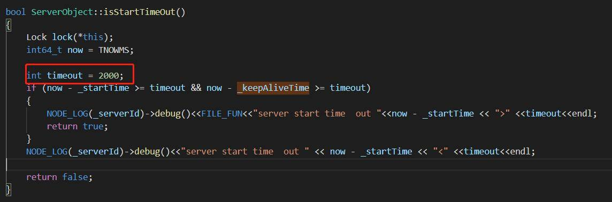


E：This time can be configured in the template.
C：在模板里可以配置这个时间。


## [When version = 2 or version = 3, is it also reported by the server? (the client will also report twice)](/TarsCloud/Tars/issues/567)


E：Yes. If the client has done the same, there will be two.
C：答:是的。若客户端也做了的话。就会有两次。


## [Stringtoproxy in Java will trigger the dead loop bug of concurringhashmap computeifabsent. (JDK version is 1.8)](/TarsCloud/Tars/issues/566)


During system initialization, stringtoproxy notifyhelper's proxy, computeifabsent will lock.
Next, when initializing any proxy for the first time, updateservantendpoints will find available nodes,
At this time, stringtoproxy queryhelper's proxy will be added internally
The same communicator, the same concurringhashmap, the same cache, and the same computeifabsent are in infinite CAS loop.


When different objs happen to bump into a hashcode, and they are all in computeifabsent, there is a dead cycle.


What is the small version?


小版本是多少？


https://stackoverflow.com/questions/43861945/deadlock-in-concurrenthashmap
This should be OK. It seems that in jdk8, this is the problem. As long as we avoid the use of computeifasent, we can avoid the nesting of computeifasent in computeifasent for the same map. If we simply change it, we don't need computeifasent. Once we have a solid container, null will be put into the new one, which should be no problem. Anyway, a reentrant lock is added before computeifabsent in getservantfactory.


https://stackoverflow.com/questions/43861945/deadlock-in-concurrenthashmap
这个应该还好。好像jdk8里，这个是问题。只要避免computeIfAbsent这个用法就好，同一个map，避免computeIfAbsent里嵌套computeIfAbsent，简单改的话，不用computeIfAbsent，老老实实contains一把，null就new一个put进去，应该就没问题。反正getServantFactory里computeIfAbsent前是加了一把可重入锁的。


This part has been modified in 1.7, but it will not have this problem in 1.6. After the problem is confirmed, it will be changed back.
https://bugs.openjdk.java.net/browse/JDK-8161372
Oracle's official fix is up to 1.9. The old version still needs to use the old one. Do you want to avoid this problem with the mode provided here, or go back to the old operation mode.


这一部分1.7有修改，1.6不会有这个问题，后面问题确认后，就改回去。
https://bugs.openjdk.java.net/browse/JDK-8161372
oracle的官方的fix的时间是到了1.9的版本。老的版本还是要用老的，你这里提供的这个模式规避这个问题，还是要回退到老的操作模式。


What is the version of JDK used for reading? Haven't you met this problem?


阅文用的jdk版本是啥，没遇到这个问题么？


1.7 is a new one now, using version 1.8. This bug only exists when the reservationnode is expanded and operated by other threads. When spring operation is used, because tarsclient was initialized before. proxy.get When it is running, it must be. It will not be created when it is running.
When this part of API is in 1.7, it's true that some of the code uses the new API. When this part is updated later, we need to look at the overall processing mode of JDK to have a controllable risk.


一部分是1.6的版本， 所以不产生这个问题
1.7的是现在新上的一部，使用的是1.8的版本。这个bug也就是在ReservationNode 在扩且被其他的线程操作的时候 才会有，使用的是spring操作的时候 ，因为tarsclient是在之前初始化掉了。proxy.get的时候，必然是有的，不会在运行的时候会有创建这种操作了。
这一部分api 在1.7的时候 ，确实一部分代码使用了新的api了，这一部后面在更新的时候，也要再看一下jdk的整体的一个处理的模式才可以有个可控的风险。


## [I want to use single call to improve efficiency, TCP or UDP?](/TarsCloud/Tars/issues/565)


No description provided.


E：Generally, TCP is used, and UDP is basically not used in the intranet to ensure that the data will not be lost like UDP.
C：一般都用tcp，内网基本不用udp了，保证数据不会像udp可能有丢失。


## [Many functions of cstring null terminator are used in http parsing. Do you need to add '\ 0' to the buffer after parsing? ](/TarsCloud/Tars/issues/564)


E：It is better to use strnstr.
C：使用strnstr更好。


## [What causes the problem as shown in the picture?Tarsadminregistry has started.](/TarsCloud/Tars/issues/563)


E：There is a framework check on the web platform. Check it and try.
C：web平台上有一个框架检查，检查一下试试。


## [If I changed the IP address and port number to my own address and port number, can I directly compile and run this code?](/TarsCloud/Tars/issues/562)


E：Yes.
C：可以。


Are the ip address and port number the ip address and port number in the config.conf of the service?


E： Fill in the content as shown in Figure  of the remarks. The node's address is the address of tarsnode, which is used for service and tarsnode interaction.
C：填写内容如备注图所示，node的地址是tarsnode的地址, 用于服务和tarsnode交互。


## [As shown in the figure, I execute “make release” in the HelloServer / bin directory, and finally I only see hello.h in the / home / tarsproto / TestApp / HelloServer directory, without tars and mk files?](/TarsCloud/Tars/issues/561)


E：The new version only has .h file, so you only need to include this directory.
C：新版本只有.h, 所以只需要include这个目录就可以了


## [How to solve AdminF.tars: 17: error: identifier can't start with 'tars'?](/TarsCloud/Tars/issues/560)


No description provided.


E：tars is used as a keyword, business is not allowed, you can use “tars2cpp —with-tars xxx.tars”.
C：tars作为关键字, 不允许业务使用的, 如果非要使用 tars2cpp —with-tars xxx.tars。


## [As shown in the figure,main.cpp is the client code, which refers to the header file "servant / Communicator.h", and "Communicator.h" refers to the header file "util / tc_ex.h", so each time you compile, do I need to copy the servant directory and util directory to the project Under the catalog?](/TarsCloud/Tars/issues/559)


E：Answer one ：No, just include applaction.h directly.
Answer two：No,directly include: / usr / local / tars / cpp / include
C：回答1：不需要，直接include applaction.h即可。
回答2：不需要，直接include: /usr/local/tars/cpp/include


## [As shown in the remarks, according to the documentation, write HelloServer, but this configuration file is not found. Is the configuration file for this service generated manually or automatically generated by a tool?](/TarsCloud/Tars/issues/558)


E：Automatically generated, use the ps and grep instructions to find and display this process path. There is a conf directory under the corresponding directory, which contains this configuration file.
C：自动生成，使用ps和grep指令查找显示这个进程路径。对应目录下有个conf目录，里面含有这种配置文件。


## [How to solve the following configuration problems?](/TarsCloud/Tars/issues/557)


The following figure shows the startup log of tarsnode.


E：Check whether the node configuration file exists (see note Figure ).
C：检查节点配置文件是否存在（见备注图）。


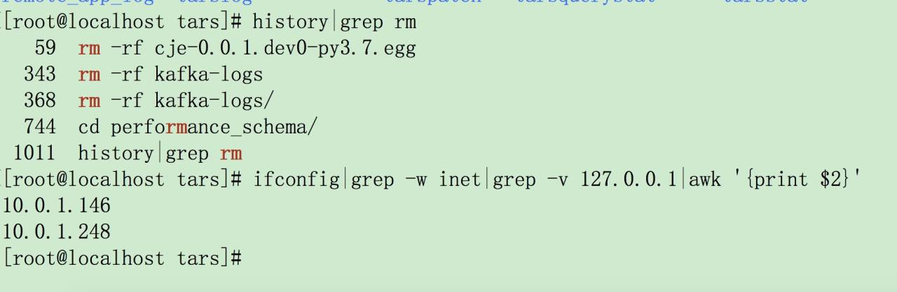
Here is RM's history. Under what circumstances will the contents of “ /usr/local/app/tars/tarsnode/conf/tars.tarsnode.config.conf ” be cleared?


E：tarsnode will update this file regularly,When the update happens, the file will be cleared when the power is cut off.
C：tarsnode会定时更新这个文件，当更新的时候正好断电这个文件内容会被清掉。


Copy this configuration file from another node, can I continue to use this node?


E：Yes, just replace the ip inside.
C：可以，注意替换里面的ip即可。


## [After the master branch of Tarsramework is compiled, if I need to upgrade the tarsnode, will I just replace the tarsnode execution file or allthe tarsnodes be replaced?](/TarsCloud/Tars/issues/556)


No description provided.


E：The result of tarsnode compilation is a binary file, just replace the tarsnode executable file.
C：tarsnode编译的结果就是一个bin，只替换这个tarsnode的执行文件即可。


After restarting the service, tarsnode restarted.

But the management page shows off, and there is no log.


E：Check the operation and maintenance management, node management, and check whether the node is normal. If inactive is displayed（see note Figure）, the node is not connected to the frame.
C：查看运维管理，节点管理，检查节点是否正常。如果显示inactive（见备注图），说明节点没有连接到框架。


## [As shown in the remark drawing, using the code on the master, the system is centos7.6, why can't the compiled tarsnode run?](/TarsCloud/Tars/issues/555)


该issue长期未更新。如果问题依旧没解决，欢迎重新打开issue。TARS社区有您更精彩。
Thanks for your supporting. The issue has not been updated for a long time. If the problem is still not resolved, welcome to reopen the issue.


## [Will the two locks be locked as shown in the remark drawing?](/TarsCloud/Tars/issues/554)


No, the two places marked in the figure generally do not need to be locked. The mark at the end of Recv MessageQ is the request distribution of the message queue, and the untimed requests are distributed to the handle threads. The second place is marked as Send MessageQ to return the request via network IO. Where there is a lock, it is usually the handle threads that put the returned result into the Send MessageQ process, and multiple processing threads safely send the operation to the queue.


不会，图中标注的两处地方一般情况下不需要锁，Recv MessageQ末端的标记处为消息队列的请求分发，将未超时的请求分发到handle threads中。第二处标记为Send MessageQ通过网络IO返回请求。有锁的地方一般为handle threads将返回结果放入Send MessageQ的过程中，多个处理线程线程安全地将操作发送队列


## [Does this tar reset every day?](/TarsCloud/Tars/issues/553)


E：Yes.If it is not moved, it will be closed by the server.
C：是的，放着不动, 就会被服务端关闭。


## [Hellogo is written according to the document. It can't run after publishing. What's the reason? What's the place that didn't do well? ](/TarsCloud/Tars/issues/552)

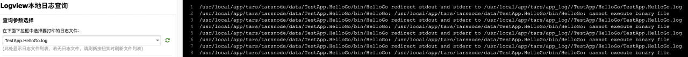


E：Unpack the uploaded package to see if hellogo is right or Linux program.
C：将上传的压缩包解开看看HelloGo是否是对的, 是否是linux的程序。


I forget that I use MacOS, and go is easy to make this kind of error. In windows, I build in go and then manually package and publish. This kind of error is also common. This kind of error is easy to occur when the production package is not released in a period of time. It is easy to ignore the Linux problem when debugging locally.


## [Why do scripts executed under win fail to produce the directory C: \ tars \ cpp?](/TarsCloud/Tars/issues/551)


No description provided.


E：C: \ tars \ cpp, this is the framework compiled and installed.cmake —build . —config Release —target install.You will go to C: \ tar \ cpp, and then go to this directory to execute the installation script.
C：C:\tars\cpp , 这个是框架编译完, install出来的。cmake —build . —config Release —target install
就会到C:\tars\cpp, 然后就到这个目录下, 执行安装脚本。


It still can't, I tried several times according to the instructions, and then compiled all the exes, which means target install didn't execute.


E：It may be a Windows permission problem. Use the administrator user to open CMD. Otherwise, Disk C will not write.
C：可能是windows权限问题，用管理员用户打开cmd，否则C盘不让写。


Still not. A directory of Disk C has not been generated.

There is a compilation error of demouitl, and other running scripts have not reported an error.


E：That's what caused it. Mask this, do not compile demoutil, and remove "add" subdirectory (utildemo).
C：就是这个引起的。把这个屏蔽掉，不编译demoutil，把"add_subdirectory(UtilDemo)"去掉。


## [In case of this error, which library is missing?](/TarsCloud/Tars/issues/550)


yum install -y flex


## [According to the installation instructions, the MAC automatic deployment can download node NPM automatically, but it seems that it cannot be installed automatically in the actual installation process.](/TarsCloud/Tars/issues/549)


E：It shouldn't be, MAC and Linux are the same.
C：不应该, mac和linux是一样的。


Open install.sh and there is no place to download and install node.


E：Download the node installed by NVM with NVM.
C：下载nvm，用nvm安装的node。


## [The CentOS of VMware, the host of docker container, can connect mysql of windows, but it can not connect mysql when it is started in the container. How to solve this problem?](/TarsCloud/Tars/issues/548)


CentOS can connect to MySQL service under win with MySQL command, and run VMware under win. CentOS is installed in VMware, and mysql-h 192.168.8.109-uroot-p under CentOS can be connected.


E：This mode doesn't work, "docker network create - D bridge -- subnet = 192.168.8.0/16 -- gateway = 192.168.8.1 tars". This is just that IP looks like a subnet, and communication can't be done.
C：这种模式行不通，"docker network create -d bridge --subnet=192.168.8.0/16 --gateway=192.168.8.1 tars"，这个ip看起来是一个子网的，通信做不到。


What is this docker0?


E：The gateway address of the container bridge.
C：容器网桥的网关地址。


Is there any problem with this docker 0 172?


E：No problem. Go to the container, or check the container. Maybe the network is not matched.
C：没问题，进容器看看，或者inspect下容器，可能是网没配对。


#548.txt
Who can help to read this document?


E：Gateway ip172.17.0.1/8 and container IP 192.168.8.109 may have problems.
C：网关IP172.17.0.1/8，容器IP 192.168.8.109，可能会有问题。


Do you mean doker0?


E：The gateway is 172.17.0.1/16, but the same is not true. You can understand it by entering the container ifconfig.
C：网关是172.17.0.1/16，不过一样不通，进容器ifconfig就懂了。


After the docker is started, it exits. Can it enter the container?


E：Remove the - d parameter at startup to see the running log, and you will know why you quit.
C：启动的时候去掉-d参数可以看到运行日志，就知道为什么会退出了。


The above MySQL failure is the logs of docker, which is the connect failure.


E：IP is not matched. It is recommended to follow the tutorial.
C：ip没配对，建议跟着教程做。


The tutorial begins with 172. Do you want to keep it the same? It can be changed to 192.168.


E：If you do not have the ability to distribute network, try to modify only the last segment of IP, and the IP network segment should be the same. There is also a bridge network in the tutorial. Don't leave it behind. (see remark Figure)
C：如果没有配网能力的话，尽量只修改IP的最后一段，IP的网段要一样。教程里还有个创建桥接网络的，别落下了。(见备注图)


MySQL in the container can't be connected. Another MySQL service, does the container exit?


E：When starting the container, there will be an automatic framework installation process. If you fail to connect mysql during installation, you will automatically exit.
C：启动容器的时候会有个框架自动安装过程，如果安装的时候连接MySQL失败会自动退出。


Is the IP of the container the same as that of the host when it is started? The container cannot connect to the MySQL of the host, so the container exits. How to locate it?


E：This is the problem of the network. It is recommended to follow the document completely first, and observe it after success. If you need to change Mysql to the host mysql, you don't need to change anything except the environment variables related to MySQL.
C：这个是网络的问题，建议先完全按照文档进行一遍，成功之后观察一下。如果需要更换MySQL为宿主机MySQL的话，除了MySQL 相关的环境变量需要更改，别的都不用动。


## [What is the unit in the box in the picture?](/TarsCloud/Tars/issues/547)


E：Physical MEM size in the file "/proc/" + spid + "/statm"  Unit: K (to be examined)
C："/proc/" + spid + "/statm"这个文件里面的, physical mem size，单位为K（待考证）


## [Which shell script will be called to execute by clicking the restart button indicated by the red arrow in the figure?](/TarsCloud/Tars/issues/546)


E：Restart will call the service interface, each tars has an admin management port for tarsnode.
C：重启调用服务的接口，每个tars有一个admin的管理端口给tarsnode调用。


## [Is the replacement in tars-install the replacement function in the script or the mysql-tool replacement text?](/TarsCloud/Tars/issues/545)


No description provided.


E：You need to look at the content of the specific replacement, some are replaced by the replacement script, and some are replaced by mysql-tool replacement text.
C：需要看具体替换的内容，有的是replace脚本替换的，有的是mysql-tool替换文本替换的。


## [If there are two network cards on the server, can I change the service IP to a different IP from tarsnode? ](/TarsCloud/Tars/issues/544)


No description provided.


E：Yes. When writing the service address on the web platform,you fill in the ip you need.
C：可以。在web平台上写服务地址的时候，填入你需要的ip。


## [Why add a servant to the tars registry, which can find data in the database, but the registry does not?](/TarsCloud/Tars/issues/543)


No description provided.


E：Because the time of the tars registry is inconsistent with that of the database, the cache is always read and will not be updated. Kill the process of the registry, and the registry will restart.
C：因为Tars注册中心的时间和数据库的时间不一致，导致一直读的是缓存，不会更新。把注册中心的进程kill掉，注册中心重启后就有了。


## [Can I deploy objects with different ports on a server?](/TarsCloud/Tars/issues/542)


No description provided.


E：An obj name corresponds to a port. For details, see < XXX. XXX. Obyadapter > in server.conf, where service, endpoint and protocol are one-to-one correspondence.
There won't be much benefit from deploying multiple instances on one server, because when the same service is deployed on one server, there will be no usability consideration. When one server hangs up, it will no longer provide available services.
C：一个obj name对应一个端口。具体可以看一下server.conf里的<xxx.xxx.objAdapter>，里面servant，endpoint和protocol是一一对应的；
一台服务器上面部署多个实例并不会有太多的收益 ，因为相同的服务部署在一台服务器上面 ，就没有可用性方面的考量了，当一台服务器挂掉的时候 ，就不再提供可用的服务了。


## [Why is it wrong to use MySQL Cluster?](/TarsCloud/Tars/issues/541)


_


E：The cluster version of percona xtradb cluster aims to solve a large number of transactions and calculations. Percona xtradb cluster prohibits DML and other operations on a table. If you want to use this version of the storage engine, you need to manually handle some of the table types.
C：Percona-XtraDB-Cluster的集群版本的目标是解决大量事务和计算使用的。Percona-XtraDB-Cluster禁止在一张表上有DML等操作。若是要使用这个版本的存储引擎的时候 ，需要手工处理一部分表的类型。


## [为什么使用集群MySQL会报错？](/TarsCloud/Tars/issues/540)


2020-05-05 19:50:05|139781505799936|ERROR[StatDbManager::updateEcsStatus exception:
[TC_ Mysl::execute]: mysql query:
update 't ecstatus' set lasttime' = '20200505 1950' where appname='tars_ stat_ 172.16.68.159' and action=0 ] :
Percona-XtraDB- Cluster prohibits use of DML command on a table (tars_ _stat.t ecstatus) that resides in
non-transactional storage engine with pxc_ strict_ mode = ENFORCING or MASTER
2020-05-05 19:50:05|139781505799936|DEBUG|IsdbTableExistishow tables like '%t ecstatus%|affected:1
2020-05-05 19:50:05|139781505799936|ERRORITARS NOTIFY ERROR ERROR:172.16.68.159lupdateEcsStatus ip:47.99.135.112|por:3306:
统计入库失败，请及时处理!


```
sqlStatus = "CREATE TABLE ‘t ecstatus' ("
"  'id' int(11) NOT NULL auto_ increment, "
"  'appname' varchar(64) NOT NULL default ' ', "
"  'action' tinyint(4) NOT NULL default '0', "
"  'checkint' smallint(6) NOT NULL default '10', "
"  'lasttime' varchar(16) NOT NULL default ' ', "
"   PRIMARY KEY ( 、appname , action ), "
"   UNIQUE KEY 'id' ('id') "
")  ENGINE=HEAP DEFAULT CHARSET=utf8";

> 


A:The cluster version of percona xtradb cluster aims to solve a large number of transactions and calculations. Percona xtradb cluster prohibits DML and other operations on a table. If you want to use this version of the storage engine, you need to manually handle some of the table types.


## [[proposal] TARS+K8S方案](/TarsCloud/Tars/issues/539)


问题与思考
目前TARS服务部署到k8s暂时还没稳定可靠的方案，主要问题是TARS框架的部分模块偶合度较高，且TARS的部分能力与k8s重合，不利于整合，以下列出了重合的功能：

名字服务：相比于k8s的service/ingress方式，TARS在客户端容灾/SET模型功能上有更强的能力，考虑TARS的能力更强，而使用k8s的名字服务会给TARS带来一定的改造成本，建议保留TARS的名字服务能力。
服务上线与注册：k8s使用yaml文件来描述服务，k8s需要在TARS-web平台上操作，k8s的方式更方便与第三方平台对接。
节点管理：TARS目前使用人工管理方式，比较落后，应尽量用于k8s的自动扩缩容能力。
版本发布与管理：TARS使用发布包方式，k8s使用docker镜像方式，前者依赖TARSnode，k8s依赖kubelet和docker仓库。如果在k8s+TARS方方案中还使用发布包方式，需要在容器里安装TARSnode，还要同时使用2套版本管理系统，所以最好是将TARS程序打包到镜像中，使用镜像发布TARS服务。
服务重启。k8s使用重建容器方式来重启服务，TARS使用重启进程方式，k8s的方式会导致容器内新增或变更文件丢失，但是也提倡了无状态容器的理念，所以2种方式各有优缺点。
关流量。k8s不支持关流量但是不停止服务，TARS的这个能力应该保留，方便快速屏蔽问题节点再排查问题的场景。

提议方案
方案目标

保持TARS原生的开发框架能力
保留TARS的名字服务能力
尽量使用原生k8s/docker的能力
支持TARS的名字服务自动注册和配置删除
支持原有TARS服务平滑迁移到k8s等容器平台
无侵入性设计，与运行环境无偶合关系

实现方案

在TARSregistry增加了3个接口，用于TARS名字的自动注册/心跳上报和节点下线。对于长期未上报心跳的节点自动删除。
提供一个TARScli命令行工具，用于支持TARS服务的自动化部署，工具具备以下能力：

生成服务启动配置：可指定配置模板文件，并将配置合并到服务的启动配置文件中，配置模板可通过k8s的configmap来管理和发布到容器中。这个命令可以在服务启动前运行。
监控服务状态和上报心跳：第一次检测成功会自动注册服务（registry新接口），可以通过端口监控或TARS_ping方式检查服务状态，然后上报服务的状态（registry新接口）。这个命令可以在k8s的readinessProbe中指定。
服务退出命令：删除�在registry对应的配置（registry新接口）。可指定删除服务后的等待时间，实现无损变更。这个命令可以在k8s的prestop脚本中运行，实现节点的自动下线。
执行notify命令，结合k8s的exec命令可远程执行自定义命令等。


TarsWeb
需要新开发一个版本，在原有基础上，去掉服务重启/下线等功能，仅保留关流量/配置管理和监控等功能。
与Service Mesh/Istio
因为TARS已具备service mesh的很多能力，将原有TARS服务改成mesh方式意义不大。Istio中的可以基于指定规则来灰度新版本是不错的功能，TARS后续的版本可以考虑支持这样的能力。


我们有一个内部的方案,和你这个proposal基本一致,  等这阶段网关等搞完, 我拉个群, 可以一起讨论一下, 把这个方案贡献出来


这个方案是不是就将tarsnode给干掉了？
没有tarsnode好像就没法通过管理平台给AdminServant发自定义命令，设置日志级别这些功能了吧？
是不是可以把tarsnode作为sidecar和业务进程一起部署，这样tarsRegister也不需要修改了。


这个方案是不是就将tarsnode给干掉了？
没有tarsnode好像就没法通过管理平台给AdminServant发自定义命令，设置日志级别这些功能了吧？
是不是可以把tarsnode作为sidecar和业务进程一起部署，这样tarsRegister也不需要修改了。

目前的方案 是 对 tarsnode 做了轻量化改造(还不够轻), 与业务进程放在一个 镜像里面作为守护进程，以及自定义命令传输通道


已开源：https://github.com/TarsCloud/K8STARS


## [一键部署节点的问题](/TarsCloud/Tars/issues/538)


What language are you using?
php
What operating system (Linux, Ubuntu, …) and version?
Linux centos 8
What runtime / compiler are you using (e.g. jdk version or version of gcc)
none
Make sure you include information that can help us debug (full error message, exception listing, stack trace, logs).
大佬们，一键部署的时候节点ip是直接从INET网卡上获取的。但是现在很多云服务器都是弹性ip是不可见的，能不能在这儿让大家输入ip地址而不是网卡名称呢？
chmod a+x linux-install.sh
./linux-install.sh MYSQL_HOST MYSQL_PASSWORD INET REBUILD(false[default]/true) SLAVE(false[default]/true) �MYSQL_USER MYSQL_PORT


你需要绑定外网么?内网都是有名称的啊?


该issue长期未更新。如果问题依旧没解决，欢迎重新打开issue。TARS社区有您更精彩。
Thanks for your supporting. The issue has not been updated for a long time. If the problem is still not resolved, welcome to reopen the issue.


## [tars-java中上报property信息时req.queue.waitingtime这个属性默认是-2147483648](/TarsCloud/Tars/issues/537)


tars-java中上报property信息时req.queue.waitingtime这个属性默认是-2147483648，这样的话在tars-web中访问特性监控时就会显示失真，永远都看不到数据


这一部分是求最大值时，默认的一个最小值 。可以把数据单独按策略查看即可（max,min），后续java的property上报若是没有符值的情况下。不会再上报这个值


## [Memory Leak on windows](/TarsCloud/Tars/issues/536)


Q
I found a serious memory leak problem on Windows platform! The memory skyrocketed during the stress test, and disconnecting does not release the memory.
I can't solve it, please help me with it.
visual studio 2019 says the Leaked code location is:
TarsCpp/util/src/epoll_windows/src/epoll.cpp
int epoll_sock_data_t::submit()
epoll_op_t* op = new epoll_op_t(this, afd_events);

A
Collected


## ["C:\tars\cpp" won't generate (Windows)](/TarsCloud/Tars/issues/535)


Q
Why won't the execution script under win produce C:\tars\cpp
A
C:\tars\cpp, this is the framework compiled and installed.
use
cmake —build. —config Release —target install

Will go to C:\tars\cpp, and then you execute the installation script in this directory.
Q
This directory does not generate,
I tried several times according to the document, and  all the exes compiled, which means that the target install was not executed
A
Have a look at the permissions of windows?
Open the cmd with the administrator, if not using administrator,  C:/  may not allow writing.
Q
Tried it, still not right.
cd TarsFramework
git submodule update --remote --recursive
cd build
cmake ..
cmake --build. --config RelWithDebInfo
cmake --build. --config RelWithDebInfo --target install

The directory is still not generated
A
cmake —build. —config RelWithDebInfo —target install


What is the output?
Q
The running script did not report an error, and the exe was generated
Just a demoutil compilation error, is that okay?

A
Oh, it might be caused by this,
try not to compile demoutil
Q
add_subdirectory (UtilDemo)

Just removed this
Success, thanks
A
Well, I am going to have look at this problem. I do n’t know why that when it depends on gtest, just cannot compile it.
Windows compilation is really inconvenient, debug / release must be connected separately, but also depends on the multi-thread configuration, there are various problems when using windows.


## [Do I need to bind a listener in my java code when I use the remote configuration of tars?](/TarsCloud/Tars/issues/534)


Here's today's Q&A
Q:

I made a soft link here.

This file was moved to bin.tmp from basepath after a while.
Do I need to bind a listener in my java code when I use the remote configuration of tars to trigger config listener when the file is updated or created?
A:
Please upgrade the version.
This problem has just been fixed over the weekend. Java has a backup logic. The template is configured with the default conf directory, which will issue a backup.


## [Why can't I find the configuration which was pushed on the machine](/TarsCloud/Tars/issues/533)


Here's today's Q&A
Q:
Why can't I find the configuration which was pushed on this machine at 10.0.1.111?


A:
The configure files are under /usr/local/app/tars/tarsnode/data/{your_service_name}/conf  .
There was a bug that would cause configure files remvoed by service release. It was properly taken care of in the last version.


## [dcache must have Installed tars on the host first?](/TarsCloud/Tars/issues/532)


Q
This command requires the following files


Using dcache must have Installed tars on the host first?
A
Yes , see this document.
Q
I installed it according to this document, but I installed tars into docker,
If you continue to install dcache in docker, will it not work?
A
The compilation of dcache is only used for tarscpp
Q

Is this file?
A
This directory is the source code of tarscpp,
tars c ++ library
Q
Can I compile and install dcache in the tars-framework of this docker?

This script... Will go to this path to find makefile.tars
 /usr/local/tars/cpp/makefile/makefile.tars: No such file or directory
Please briefly... How to deploy and use dcache?
I am confused now.
A

Deploy tars first
Compile tarscpp (if the source code compiles tars, this step will automatically do it)
Download the dcache source code and compile it (depending on tarscpp compilation)
Publish on the tars platform


## [关于installation/docker.md的一个小问题 A little problem about installation/docker.md](/TarsCloud/Tars/issues/531)


在2.3 使用 tarscloud/framework 部署框架中


启动框架从节点

如果希望多节点部署, 则在不同机器上执行 docker run ...即可, 注意参数设置!
最新版本:
docker run -d \
    --name=tars-framework-slave \
    --net=tars \
    -e MYSQL_HOST="172.25.0.2" \
    -e MYSQL_ROOT_PASSWORD="123456" \
    -e MYSQL_USER=root \
    -e MYSQL_PORT=3306 \
    -e REBUILD=false \
    -e INET=eth0 \
    -e SLAVE=true \
    --ip="172.25.0.4" \
    -v /data/framework-slave:/data/tars \
    -v /etc/localtime:/etc/localtime \
    docker.tarsyun.com/tarscloud/framework:latest
稳定版本:
docker run -d \
    --name=tars-framework-slave \
    --net=tars \
    -e MYSQL_HOST="172.25.0.2" \
    -e MYSQL_ROOT_PASSWORD="123456" \
    -e MYSQL_USER=root \
    -e MYSQL_PORT=3306 \
    -e REBUILD=false \
    -e INET=eth0 \
    -e SLAVE=true \
    --ip="172.25.0.4" \
    -v /data/framework-slave:/data/tars \
    -v /etc/localtime:/etc/localtime \
    docker.tarsyun.com/tarscloud/framework:stable

其中

docker.tarsyun.com/tarscloud/framework:latest
docker.tarsyun.com/tarscloud/framework:stable

这两行镜像地址应该有误，直接运行是不能跑的，会显示错误为：

Unable to find image 'docker.tarsyun.com/tarscloud/framework:stable' locally
docker: Error response from daemon: Get https://docker.tarsyun.com/v2/: x509: certificate signed by unknown authority.

我在浏览器中输入地址，也是404。
应该就简单的改成
tarscloud/framework:stable和tarscloud/framework:latest吧？
虽然不是大问题，可能就是一个笔误，但也是抱着尽善尽美的态度提出来啦。


报这个错误的原因可能是我没有执行后面的镜像加速。

curl -sSL https://doc.tarsdoc.com/docker_set_mirror.sh | sh -s https://w1mnep2c.mirror.aliyuncs.com
systemctl restart docker


是的, 需要导入签名才行


阅读docs文档的过程中，发现了几个小 typing error，也提出来记录一下啦。
installation/web.md中

1 介绍
tars web主要用户管理Tars整体平台, 主要功能如下:

服务的部署, 发布, 扩容和配置
服务的监控, 统计信息查看
节点在线扩容
服务日志查看(点击服务名称)
权限管理


tars web主要 *用户 *管理Tars整体平台
“用户” 应该是 “用于” 吧？改成
tars web主要是用于开发或运维人员管理Tars整体平台。
base/tars-concept.md中

5.  Tars文件目录规范
Tars文件是TARS服务的协议通信接口，尤其某Tars Server的客户端调用Server时都需要依赖该Server的tars protocol文件, 因此非常重要，在管理上我们推荐按照如下方式管理(当然你可以不采取改模式, 构建你自己合适的开放方式):

(当然你可以不采取 改 模式, 构建你自己合适的 开放 方式)

“改” 应该是 “该”
“开放”方式 还是 “开发”方式？


你好~这两天在继续学习文档，没有及时回复。
我在docs仓库提了一个pr，还改了一些其他错误。链接如下：
TarsCloud/TarsDocs#23


好滴~^_^


@ruanshudong 大佬您好！
我在阅读源码的过程中，有点地方不太理解，想请教一下，望解惑！
我在阅读最简单的HelloServer的main.cpp中的 comm.stringToProxy 方法，中间有一步调用到了 ServantProxyFactory 类，在其头文件中，有一句注释是 创建ServantProxy对象，每个object在进程空间只有一个ServantProxy实例，我继续阅读了后续的代码，知道他实际是在 ObjectProxyFactory 类中用工厂模式和单例模式实现了 “在进程空间只有一个实例”。
这里有点不太明白，为什么在 ServantProxyFactory.cpp 中需要用一个数组为每个线程构造一个指向同一个 Proxy的指针？我觉得这里应该 只需把一个指针保存下来，每个线程都调用该指针 就可以了吧？是还有一些额外的操作吗？
我还写了一篇文档对该过程做了简单分析，其中第4章是对 stringToProxy 内部流程的简单梳理，如果您有空的话能否简单阅读一下，指点一二，看看我理解的该流程是否正确？
https://zhuanlan.zhihu.com/p/136932717


谢谢~


1 CommunicatorEpoll, 对应的网路线程对象, 就是说每个网络线程对应一个CommunicatorEpoll对象
2 网络的收发在CommunicatorEpoll中完成, 因此不加锁
3 网络收发具体都是调用ObjectProxy, 所以说ObjectProxy在每个网络线程都有一个具体对象
4 ServantProxy对每个obj只有一个对象(http短连接除外), 使用者其实是和ServantProxy交互, ServantProxy通过epoll事件, 将请求转给CommunicatorEpoll处理, CommunicatorEpoll通过ObjectProxy来完成收发
5 ObjectProxy背后对应了多个AdapterProxy, AdapterProxy其实对应的就是一个具体远程服务, AdapterProxy里面有一个Transceiver, 对应具体的连接
先把上面这几句理解, 再来看代码就简单了!
另外这个模型下个大版本可能还会变化


感谢解答~~我再领会一下~~~


@ruanshudong 大佬您好~
我在继续看异步、Push、协程的调用方法。异步和Push都没有大问题，值都可以正常返回。
但跑协程的例子时，遇到了图上的错误，说的是 协程模式调用 未开启。我看了下文档，好像是用config文件调的。我还没有看config具体是怎么用的，所以想请问一下：
有没有更快的办法（比如用命令的参数、加几行代码）能配置协程模式开启？
谢谢~~~


开启OpenCorotinue即可, 有一个对应的配置, 可以看看Application.cpp的代码
之所以文档没写, 是因为协程这里还在改造, 后面可能会改掉


@zestloveheart 感谢您热心的提问与PR，这个issue由于长期未更新，我们会将其关闭。后续若有其他问题，欢迎新开issue进行交流沟通。TARS社区有你更精彩！


## [How to deploy multiple RegistryServer services? ](/TarsCloud/Tars/issues/530)


Q
How to deploy multiple RegistryServer services?
Is it through keepAlive?
A
Two sets of the framework can be deployed, deploy a SLAVE
Q
The client locator, the installation script will permanently configure the master and slave 2 IP addresses?
Or do I have to configure the slave address myself?
A
It will be updated automatically, no need for manual operation
When you add a slave, he will automatically update
Q
  thank you very much


## [No matter what port I change, it will prompt that the port is occupied](/TarsCloud/Tars/issues/529)


Q

A
This annotation will read the servant comments on the platform and start listening. Port conflicts can be resolved by modifying the corresponding HTTP servant on the platform
Q
I changed the port, it still conflicts, because Tomcat always starts before the servant monitoring, and then it will conflict
A


See if your protocol is no_tars


The name of the annotation must be the same as the name of the platform


see if there are other webs in your pom package that can be easily introduced


Q
The annotation name is consistent because if it is inconsistent, the ServletContainerCustomizer class will report a null pointer

I found that it is possible to deploy to the platform, and copying the configuration file of the platform is not feasible.
[TARS] http server start at 8080
2020-04-21 22:42:36.971  INFO 13400 --- [           main] o.s.b.w.embedded.tomcat.TomcatWebServer  : Tomcat initialized with port(s): 8080 (http)
2020-04-21 22:42:36.991  INFO 13400 --- [           main] o.apache.catalina.core.StandardService   : Starting service [Tomcat]
2020-04-21 22:42:36.991  INFO 13400 --- [           main] org.apache.catalina.core.StandardEngine  : Starting Servlet engine: [Apache Tomcat/9.0.33]
2020-04-21 22:42:37.060  INFO 13400 --- [           main] o.a.c.c.C.[Tomcat].[localhost].[/]       : Initializing Spring embedded WebApplicationContext
2020-04-21 22:42:37.060  INFO 13400 --- [           main] o.s.web.context.ContextLoader            : Root WebApplicationContext: initialization completed in 987 ms
[GC (Allocation Failure) [PSYoungGen: 202185K->9852K(229376K)] 202203K->9886K(229888K), 0.0145178 secs] [Times: user=0.02 sys=0.00, real=0.01 secs] 
2020-04-21 22:42:37.280  INFO 13400 --- [           main] o.s.s.concurrent.ThreadPoolTaskExecutor  : Initializing ExecutorService 'applicationTaskExecutor'
[SERVER] server starting at tcp -h 192.168.56.2 -p 11026 -t 60000...
[SERVER] server started at tcp -h 192.168.56.2 -p 11026 -t 60000...
[SERVER] server starting at tcp -h 192.168.56.2 -p 11027 -t 60000...
[SERVER] server started at tcp -h 192.168.56.2 -p 11027 -t 60000...
[SERVER] server starting at tcp -h 127.0.0.1 -p 11026 -t 3000...
[SERVER] server started at tcp -h 127.0.0.1 -p 11026 -t 3000...
[SERVER] The application started successfully.
MaxConnCount=500000
[SERVER] server is ready...
The session manager service started...
2020-04-21 22:42:37.487  INFO 13400 --- [           main] o.s.b.w.embedded.tomcat.TomcatWebServer  : Tomcat started on port(s): 8080 (http) with context path ''
2020-04-21 22:42:37.490  INFO 13400 --- [           main] com.example.taf1.Taf1Application         : Started Taf1Application in 2.355 seconds (JVM running for 2.913)

Very sorry, I found the reason, it is my own problem
Anyway, what can be done with this annotation
A
 @TarsHttpService ("HttpObkj")

 In this note. The name of httpObj. It is to open the HTTP function. At startup. Read the configuration of HttpObj on the platform and start the corresponding port
Q
But, I don't add this annotation, my HTTP can be started normally
A
Is it because port 8080 on your platform is not occupied?
In this case, what you listen here is only port 8080 on your platform. You can see if the port on your target service server is occupied
This is the built-in container started
[TARS] http server start at 8080
2020-04-21 22:42:36.971  INFO 13400 — [           main] o.s.b.w.embedded.tomcat.TomcatWebServer  : Tomcat initialized with port(s): 8080 (http)
2020-04-21 22:42:36.991  INFO 13400 — [           main] o.apache.catalina.core.StandardService   : Starting service [Tomcat]
2020-04-21 22:42:36.991  INFO 13400 — [           main] org.apache.catalina.core.StandardEngine  : Starting Servlet engine: [Apache Tomcat/9.0.33]
2020-04-21 22:42:37.060  INFO 13400 — [           main] o.a.c.c.C.[Tomcat].[localhost].[/]       : Initializing Spring embedded WebApplicationContext
2020-04-21 22:42:37.060  INFO 13400 — [           main] o.s.web.context.ContextLoader            : Root WebApplicationContext: initialization completed in 987 ms
[GC (Allocation Failure) [PSYoungGen: 202185K->9852K(229376K)] 202203K->9886K(229888K), 0.0145178 secs] [Times: user=0.02 sys=0.00, real=0.01 secs] 
2020-04-21 22:42:37.280  INFO 13400 — [           main] o.s.s.concurrent.ThreadPoolTaskExecutor  : Initializing ExecutorService 'applicationTaskExecutor'
[SERVER] server starting at tcp -h 192.168.56.2 -p 11026 -t 60000…
[SERVER] server started at tcp -h 192.168.56.2 -p 11026 -t 60000…
[SERVER] server starting at tcp -h 192.168.56.2 -p 11027 -t 60000…
[SERVER] server started at tcp -h 192.168.56.2 -p 11027 -t 60000…
[SERVER] server starting at tcp -h 127.0.0.1 -p 11026 -t 3000…
[SERVER] server started at tcp -h 127.0.0.1 -p 11026 -t 3000…
[SERVER] The application started successfully.
MaxConnCount=500000
[SERVER] server is ready…
The session manager service started…
2020-04-21 22:42:37.487  INFO 13400 — [           main] o.s.b.w.embedded.tomcat.TomcatWebServer  : Tomcat started on port(s): 8080 (http) with context path ''
2020-04-21 22:42:37.490  INFO 13400 — [           main] com.example.taf1.Taf1Application         : Started Taf1Application in 2.355 seconds (JVM running for 2.913)

This annotation can make spring boot's HTTP container have the ability to be deployed on the tars platform, and when multiple HTTP nodes are scaled, they can have addressing capabilities. So this note will be added here
When the servant name HttpObj is used to address the tars master. You can also find the corresponding IP: port
Q
How do I use it?
CommunicatorFactory.getInstance (). GetCommunicator (config) .stringToProxy ()
This should be the tars protocol , isn't it?
A
 This processing mode is the tars protocol.
Communicator.getEndpoint4AllThis interface can get http protocol nodes.
The nodes of the HTTP protocol are generally not for internal use. It is provided for use by external networks.
For example, the original eap system you have to provide should provide an HTTP interface. Then the above HTTP function is more practical. No need to deploy the platform and tomcat yourself...
Q
I can understand the meaning of this annotation. The meaning of this annotation is that when I have a system that already provides an HTTP interface
then I have to go to the tars platform and I don’t want to provide an interface for the tars protocol This time you can use this annotation
A
After using tars. You won't need use HTTP on the intranet. Because the tars protocol is more efficient than the HTTP protocol, all calls between internal business services can be done through the tars protocol.
Q
So in this sense, a system only needs to add a non-tars protocol servant.
And the code act like this.
A
Not really... The service can also open multiple HTTP instances.
For example, I want to start three HTTP instances of listening service a, service b, and service c. To provide services. Then there are three such annotations in your project. You can start three different HTTP instances
Q
Yes, although it is rarely used in this way, it still handles various situations as a framework development.


## [tars install.sh error](/TarsCloud/Tars/issues/528)


tars install.sh error
Q

docker deployment
My system is centos-8
Compiled by myself
The downloaded source code has its own docker.sh
A
You compiled on centos8, but the centos of dockefile 7 is not the correct version of GCC
You should either use centos7 or modify the docker file, use the os image of centos8
Q
ok, let me try, thanks
Or directly pull the remote
` docker pull tarscloud / framework: latest `
I am just building a simple test environment
Source code installation for the production environment
A
In fact, it is better to use docker in the future, the upgrade is more convenient


## [Clicking on the service monitor will report this error](/TarsCloud/Tars/issues/527)


Q
Clicking on the service monitor will report this error. Do I need to manually build the table?

A
Because your frame is newly installed, yesterday's table has not been created yet.
Q
I expanded the new service to a new node, but the status is Off

A
You have to publish it first.
This error message is indeed a problem ,we will fix it later when available


## [  Error in Pb generation, indicating that pb2tarscpp does not exist](/TarsCloud/Tars/issues/526)


(Here's today's Q&A)
Q:
There's an error in pb generation, indicating that " pb2tarscpp does not found or is not executable".

A:
You need to turn the switch on.


## [The master-slave configuration of TARS DATABASE](/TarsCloud/Tars/issues/525)


(Here's today's Q&A)
Q:
Does the master-slave tars database need to be configured separately?
A:
Yes. You should do this yourself.
Q:
Does tars also need special configuration?
A:
All databases can be configured in the framework-db template and can be modified by yourself if necessary.


## [Does DCache support transactions?](/TarsCloud/Tars/issues/524)


(Here's today's Q&A)
Q:
Does DCache support transactions?
A:
Not for the time being. If you need to use key value to read and write transactions, you can controll it  by version number.


## [Does tars have an API package for coroutines?](/TarsCloud/Tars/issues/523)


Q:
Does tars have an API package for coroutines?
A:
RPC at the bottom of the framework directly supports the coroutines. If you need to use the API for coroutines, you need to wait for the new version. This feature is developing.


## [Tars-web@2.0.0 prd ([pm2][ERROR])](/TarsCloud/Tars/issues/522)


Q:
There’s soming wrong when I pulling web up.


A:
try
cd /usr/local/app/web/demo; 
npm run prd;
cd /usr/local/app/web; 
npm run prd;

Q:

It didn’t start even if I restored it by /linux-install.sh .

A:
I find that there may be something wrong with npm.
Q:
The machine disk was full for a while. Does it have anything to do with this?
A:
Maybe. You can unload and reinstall the npm.
Q:
It still doesn’t work.
A:
Try npm run start 
Q；

A:
Start the demo first.
Q:
npm run start It works. Now I can access web.
A:
prd can’t?
Perhaps there’s a certain bug in pm2. You can restore pm2.
Q:
It doesn’t work.
A:
Try npm run start append with “&” to pull web up.
Ah…It seems that pm2 has a lot of bugs.
Neither you can reboot with that tars-start, can you?
Q:
I don’t use tars-start. It’s wrong with linux -install.
A:
Try tars-start
The new version of this script will delete the PM2 record and rebuild it.
It’s a problem
Q:
tars-start.sh reports error

A：
pm2 delete tars-node-web; 
cd /usr/local/app/web/; 
npm run prd;
pm2 delete tars-user-system; 
cd /usr/local/appweb/demo; 
npm run prd;

Have a try，please.
Q：
I tried this.
pm2 -s stop tars-node-web ;  pm2 -s delete tars-node-web;  npm run prd;
Now the problem is solved.


## [类库以及相关函数的说明书有么](/TarsCloud/Tars/issues/521)


What language are you using?
C++
What operating system (Linux, Ubuntu, …) and version?
linux
What runtime / compiler are you using (e.g. jdk version or version of gcc)
gcc 4.8
Make sure you include information that can help us debug (full error message, exception listing, stack trace, logs).
没有错误，只是没有找到c++中关于tars类库以及相关函数的说明书，用起来还不是很方便。


一直没有时间写,  基础类都在util目录下,  rpc相关的都在servant下


好的


## [Neither framework nor tarscpp v2.2.0 over can compile DCache](/TarsCloud/Tars/issues/520)


Q:
Neither framework nor tarscpp v2.2.0 above can compile DCache
A:
The latest version can be compiled.
Q:
When I tried v2.2, several static variables were annotated in the servantproxy header file which are used by DCache. They are not annotated in the following version of V2.1.2.

This is it. DCache uses this.
A:
 https://github.com/TarsCloud/DCache
Try this one. This has been improved.


## [GRANT ERROR,RET CODE:255 /   Installing errors on the slave](/TarsCloud/Tars/issues/519)


Q:
I found that installing on the slave does report grant error, RET Code: 255
A:
The slave should not need to be authorized again.
Q:
I also find it strange that these permissions have been granted by the master.
Do I need the start tarsconfi, tarsnode, and tarsnotify nodes after I install them in the slave? Or do I still need to configure one more node on the web?
A:
You don't need to configure it on the web.
Q:
I need to start on the slave as well, right?
A:
Sure. In fact, you can start tarsnode and others will be pulled by tarsnode.
You can compile and deploy with the source code on the master branch.
Q:
I want to know the reason why this error is always reported when I start the slave node.
Then it will hang up the tarsstat and tarsproperty on the master.

A：
Do the errors occur on the same machine?
Q:
No, I just start the slave node. Tarsstat reports this error, and then the tarspropery and tarsstat on the master will be hung up but the tarspropery on the slave won’t. The tarsstat on the master and slave can't be started.
Is this error means that there are some problems when connecting to the master?(my version 2.1.2 / Source compiled)
A:
There should be a bug somewhere during shared memory initialization.
Q:
Is it on the slave? Which version is better to me?
A:
Docker with stable tag may be better.
Q:
Does tarscpp use master?
A:
Yes. Master is stable.


## [Problems of log coloring in VERSION TARS 1.7.1X](/TarsCloud/Tars/issues/518)


(Here's yesterday's Q&A)
Q:
How to use tars-plugins in tarsjava? There’re log-related codes in it while the codes weren’t introduced in the final packaging. The coloring function in tarsjava has not been debugged as well.(USE VERSION tars 1.7.1x )
A:
The log control of the new version is on logback. You can query “how to use logback to do  log coloring” to know the methods. When you need tracking data, use MDC.put ("guid", 123123) to control your logs.
This is the new experimental function of in this version，and it will be officially launched in version 1.8.
In the current version, you can compile and process it yourself. If there’s no problem in feedback, this function will be published with release of v1.8.
Q:
I think that the combination of MDC and Filter can simplify the implementation of log coloring and make the code clearer and easier to control.
So when will v1.8 be released?
A:
At present, a small version will be released every quarter, and v1.7 is just released.
Now we are short of test cases. I hope you can provide more test cases.


## [The port conflicts when the docker of TARSNODE and FRAMEWORK started on the same machine.](/TarsCloud/Tars/issues/517)


(Here's today's Q&A)
Q:
Excuse me, is it normal to be jammed when copy web? The version of tars-framework container I use is v2.2.

A:
Ordinarily, it shouldn't be like this. It only does copy files and may just take a long time. When this step  is done, you can open the web.
Q:

Why tars-node v2.0 container  always shows the error:install tarsnode failed,retry 3 seconds later…
A:
Is the docker of tarsnode and framework started on the same machine and all in -net = host mode?
Q:
Sure.
A:
There's also tarsnode process in the framework. The port conflicts.


## [How to bind domain name to TARS](/TarsCloud/Tars/issues/516)


Q
I want to bind the domain name to tarsregistry , but the heartbeat shows the IP address. Is there any method to make the heartbeat report using the domain name too?

A
You should bind  tarsregistry also using the domain name, do not bind to IP.
Q
Ok, now I have successfully bound the domain name to tars service.
But does tarsnode support domain names?
The configuration file I started is bound to the domain name, and tarsnode automatically updates it to IP


One kind
Use the parameter --nodeid=<domainname> when starting tarsnode
some old version doesn't support --nodeid=<domainname> , you should use the latest version.


## [配置编辑框可否调大点？](/TarsCloud/Tars/issues/515)


服务配置-编辑时，编辑框太小，不方便录入，可否调大点？


got


let-ui文本域不支持大小调整，正在切换UI框架，切换完就支持了


## [接口测试报错](/TarsCloud/Tars/issues/514)


struct TA
{
    0   optional    string      extra = "{}";                       // 附加参数
    1   optional    string      create_at = "1001-01-01 00:00:00";  // 订阅时间
};

接口测试上传tars文件时，如果字段设置了默认值，会报错，去掉默认值就ok了，麻烦看下~


协议解析代码问题，已修复


## [Ali Cloud Show databases command cannot be used with TARS installed by docker ](/TarsCloud/Tars/issues/513)


Q
When using the Ali Cloud database, there will be an unauthorized problem, especially the command show Databases
leads to docker's startup failure
In  High permission list, there is no show Databases permission

I built it directly using docker.


Here's the subsequence
Q:
When I creating the Cloud core and running it ,it report errors.

This problem occurs when assigning permissions to tarsAdmin.
A:
You can delete this permission in the tars-install script and try again.In practice, it seems that show databases has not been used.
Q:
Where’s tars-install? I haven't even started docker. It reported errors when I was starting to build it.

There’s no data in these files.
A:
Try this: tarscloud/framework:dev
As I don't have Ali Cloud.,please tell me the result. If it runs well, I'll merge it into stable later.
Q:

It still errors.
A:
Please try to use this sql to delete permissions step by step and find out which one can pass.
Q:
CREATE TABLESPACE This one can’t be passed.
A：
Okay. Now you can update docker if you are free because I‘ve changed the SQL permissions.
The newly release is in the dev branch(from the same url). And then pull .


## [ Is there any cloud integration on Tencen Cloud for tars?](/TarsCloud/Tars/issues/512)


Q
Is there any cloud integration on Tencent Cloud for tars? So we could easily set up our tars framework and servants on the Tencent cloud server.

A
Not yet. We're heading on that. We highly suggest you use docker installation instead.
docker

Q
thx


## [reinstalled system, and something went wrong ...](/TarsCloud/Tars/issues/511)

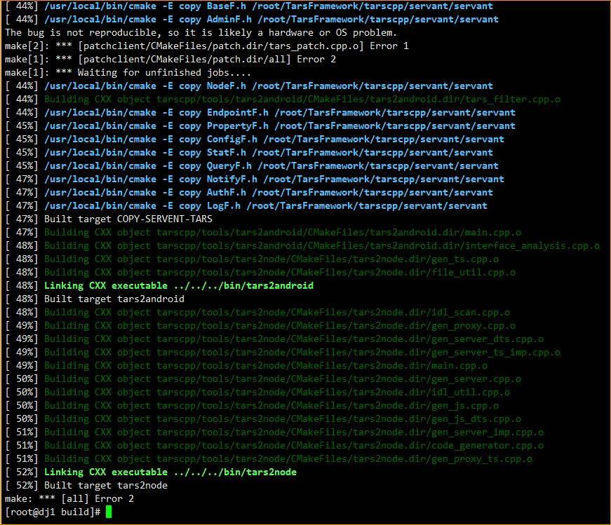
reinstalled system, and something went wrong ...
Q


This command is which I executed
make -j4

A
The code is not complete
The submodule is not downloaded
Try install again

Q
Japan server,  download is quite fast


A

Is there something wrong with your machine(server)?
/root/TarsFramework/tarscpp/servant/protoco1/servant/Property.tars

do you have this file?

Q
Alibaba console, reinstalled CentOS 7.7

Which file you're saying?

A
show me your Machine setup


1 core & 2G RAM

A
It feels like a CPU is too weak, 1 core 2G, it may not able to compile the files, I remember someone tried before, and finally the compiler crashed


## [Question: ServantProxy::invoke timeout:3000,servant:tars.tarspatch.PatchObj](/TarsCloud/Tars/issues/510)


每次部署等待3秒就会报错, 但是只找到页面上的报错信息, 在 tars.tarspatch.log 没有看到报错
还请看一下, 如果报错信息不足还请指导下该到哪里获取, 目前对 tars 了解比较有限
What language are you using?
Nodejs
What operating system (Linux, Ubuntu, …) and version?
MacOS 10.15.3 
Docker Desktop 2.2.0.3
Docker Engine 19.03.5

tars
- tarscloud/framework:stable
- tarscloud/tars-node:stable 
What runtime / compiler are you using (e.g. jdk version or version of gcc)
node -v
v10.15.3
npm -v
6.4.1
Make sure you include information that can help us debug (full error message, exception listing, stack trace, logs).


子任务ID
应用
服务
节点
命令
开始时间
结束时间
状态
执行信息


70429a44b12246a6a68b037b355e7b82
JV
ICAdmin
172.25.0.5
patch_tars
2020-04-06 16:58:34
2020-04-06 16:58:37
EM_I_FAILED
[ServantProxy::invoke timeout:3000,servant:tars.tarspatch.PatchObj,func:preparePatchFile,adapter:tcp -h 172.25.0.3 -p 18793 -t 60000,reqid:16]


可以在运维管理, 框架检查里面检查一下,看看框架服务状态是否都正常


## [Script compatibility issues](/TarsCloud/Tars/issues/509)

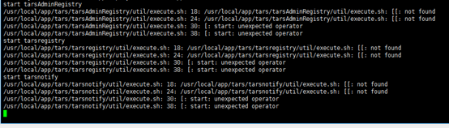
(Here's today's Q&A)
Q：
When running tars on Ubuntu 16.04.I wanna know why the internal error of the tarslog package system exists.


A:
Operation and maintenance management, which has a framework check, click to see.
Q:

A:
The frame didn't start.Is the corresponding process of tar up under ps grep?
Q:
There's something wrong with the script.


I also useed bash to execute the startup script.It resulted the same.


A:
Try centos7,please.It runs more stable. There are still problems with script compatibility.


We will fix the problem in the install shell while running on ubuntu.


## [ 3001 port problem](/TarsCloud/Tars/issues/508)


(Here's today's Q&A)
Q:
I installed the framework according to the documentation.


But there is something wrong with http://172.31.154.218:3000/ . This is the Ali's intranet IP address which can't be accessed directly through Internet IP.
A:
You can use Nginx as a proxy web to bind all IP, the Internet can be turned around. Are you sure that there's port 3001 for Internet access?
Q:
Oh,port 3000 is opened while port 3001 isn’t opened. It works!!!thx!


Note: Tars web is already bound to 0.0.0.0. Nginx proxy is not necessary.


## [Yesterday's table doesn’t exist because of the NEWLY installed frame.](/TarsCloud/Tars/issues/507)


(Here's today's Q&A)
Q:
I meet such problem.

Mysql is well running. Why does the error message show that ‘Table tars_stat.tars_stat_2020033100 does not exist’?The following shows the newly deployed environment of today.

When I CLICK the red rectangle 👆 it do shows error msg like this 👇.

Even I restarted tarsstat it still didn’t work.
Here are tables of DB  👇

The time of the management platform is like this 👇.

Why is it related to this table tars_stat_2020033100?
This is the new environment I just built today.

Finally I found that I should just display today's data here.😂😂😂

A:
This corresponds to tarsstats, which will automatically create a table to write data by day. Because of the new installation today, there is no yesterday's data, and yesterday's table does not exist.


## [how to changed the template size](/TarsCloud/Tars/issues/506)


I changed the template size of tarsstat to 256M & cleaned up the shared memory & restarted the service, but the shared memory , which is still 8m, did not change to 256.

In addition, does tarsstat support capacity expansion? (Multi node deployment)


## [The shared memory always is 8M, did not change to 256M.](/TarsCloud/Tars/issues/505)


I changed the template size of tarsstat to 256M & cleaned up the shared memory & restarted the service, but the shared memory , which is still 8M, did not change to 256M.
In addition, does tarsstat support capacity expansion? Multi node deployment
The way I cleaned up shared memory👇
ipcrm -M 0xffffffff
ipcs -m | awk &apos;$2 ~ /[0-9]+/ {print $2}&apos; | while read s; do sudo ipcrm -m $s; done 

I've tried both.Both worked.After starting tarsstat, it's only 8M.
Here’s the Template configuration & ipcs


Answer:
Of course tarsstat support capacity expansion .
Clean these two(One is for tarsstat and the other is for tarsproperty) .

Then change the size of tarsproperty. Your key is not “ffffff”.That fffff is a bug. Your tarsproperty is seemed to use MMAP, so you can clean up these two and restart tarstat.


The template of tarsproperty IS 10m, and I’ve checked that the processes are all tarsstat’s through ipcs-p


Answer:
Clean this up, restart it. In fact, another way is to increase the quantity directly. Adding a hashmapnum = 10 here to become multiple hashmaps. They are double buffered.
It’s BETTER to clean them up.


I've even tried to stop the service, clear the shared memory, and then restart it.It still create only 8m of shared memory.
I set hashmapnum = 10 in the test environment. Now it likes the following.👇


Answer:
:It’s OK. It’s an extension. Of course, it's better to set the buffer larger. The bottom two are tarsstat's.


Our development found that although the template configuration changes are effective, hashmap00.txt (under /data/tarsnode/data/tars.tarsstat/data) will not create the memory size configured in the template without deleting it.


Answer:
Well, that's a problem.The developers will improve it in the next version.


## [接口测试报错](/TarsCloud/Tars/issues/504)


接口测试报错，提示 Cannot read property 'response' of undefined
接口响应结构体为：
struct TBAcctAssetProofGetListRsp
{
0 require string offset;
1 require vector acct_asset_proof_list;
};
struct TAcctAssetProofItem
{
0 require int proof_id;
1 require double valid_amount;
2 require string check_time;
3 require string valid_date_end;
4 require string valid_date_begin;
5 require string file_url;
6 require string reason_desc;
8 require EAcctAssetProofState state;
};
web日志：
InfTestController.js:43|[interfaceDebug]: TypeError: Cannot read property 'response' of undefined\n    at Object.InfTestService.debug (/usr/local/app/web/app/service/infTest/InfTestService.js:43:13)\n    at runMicrotasks ()\n    at processTicksAndRejections (internal/process/task_queues.js:93:5)\n    at async Object.InfTestController.interfaceDebug (/usr/local/app/web/app/controller/infTest/InfTestController.js:32:14)\n    at async /usr/local/app/web/app/router/index.js:36:4\n    at async module.exports (/usr/local/app/web/app/midware/noCacheMidware.js:24:2)\n    at async /usr/local/app/web/app/midware/paramsMidware.js:86:4\n    at async /usr/local/app/web/app/midware/paramsMidware.js:45:3\n    at async /usr/local/app/web/app/midware/apiMidware.js:26:4\n    at async /usr/local/app/web/app.js:115:3\n    at async static (/usr/local/app/web/node_modules/koa-static-router/index.js:70:13)\n    at async pathname (/usr/local/app/web/node_modules/yami-sso-client/lib/koa.js:52:13)\n    at async /usr/local/app/web/app.js💯2\n    at async module.exports (/usr/local/app/web/app/midware/localeMidware.js:49:2)  ","timestamp":"2020-03-22 13:46:00.195"}


@zouchengzhuo check this bug


问题的原因是接口测试调用失败， 返回错误提示时失败，已在tars-web 最新master分支中修复。


## [docker 虚拟网络问题](/TarsCloud/Tars/issues/503)


https://tarscloud.gitbook.io/tarsdocs/rumen/installation/docker
这里使用虚拟网络启动docker的方式，是不是不能支持多个物理机node的场景，因为其它物理机无法联通此虚拟网络
文档中可以增加通过host方式启动docke的操作说明


可以docker使用--net=host启动, 物理机使用tarsnode的模式, 这样方便框架升级


## [mysql 权限问题 -- 需增加grant权限](/TarsCloud/Tars/issues/502)


https://tarscloud.gitbook.io/tarsdocs/rumen/installation/source#3-5-mysql-quan-xian-wen-ti
这里不光是需要有文档中列出的权限，还需要有grant权限，既带上 with grant option， 因为脚本中会给tars用户执行grant


文档增加了grant权限说明, thx!


## [./linux-install.sh  可否支持腾讯云开发机的（tlinux OS）](/TarsCloud/Tars/issues/501)


./linux-install.sh 不支持腾讯云开发机的（tlinux OS），提示 "OS not support:"；修改脚本，认为和centos等同，可以成功安装


How to judge tlinux OS?


## [tarsstat service crashes](/TarsCloud/Tars/issues/500)


What language are you using?
C++
What operating system (Linux, Ubuntu, …) and version?
CentOS Linux release 7.4.1708 (Core)
What runtime / compiler are you using (e.g. jdk version or version of gcc)
gcc version 4.8.5 20160623 (Red Hat 4.8.5-16)
Make sure you include information that can help us debug (full error message, exception listing, stack trace, logs).
coredump info:
[Thread debugging using libthread_db enabled]
Using host libthread_db library "/lib64/libthread_db.so.1".
Core was generated by `/usr/local/app/tars/tarsstat/bin/tarsstat --config=/usr/local/app/tars/tarsnode'.
Program terminated with signal 6, Aborted.
#0  0x00007f4dd69e51f7 in raise () from /lib64/libc.so.6
Missing separate debuginfos, use: debuginfo-install glibc-2.17-196.el7.x86_64 libgcc-4.8.5-16.el7.x86_64 libstdc++-4.8.5-16.el7.x86_64
(gdb) bt
#0  0x00007f4dd69e51f7 in raise () from /lib64/libc.so.6
#1  0x00007f4dd69e68e8 in abort () from /lib64/libc.so.6
#2  0x00007f4dd69de266 in __assert_fail_base () from /lib64/libc.so.6
#3  0x00007f4dd69de312 in __assert_fail () from /lib64/libc.so.6
#4  0x0000000000574ca1 in tars::TC_HashMap::Block::refreshSetList() ()
#5  0x0000000000578a46 in tars::TC_HashMap::set(std::string const&, std::string const&, bool, std::vector<tars::TC_HashMap::BlockData, std::allocatortars::TC_HashMap::BlockData >&) ()
#6  0x00000000004b5eae in StatHashMap::add(tars::StatMicMsgHead const&, tars::StatMicMsgBody const&) ()
#7  0x00000000004abd7e in StatImp::addHashMap(tars::StatMicMsgHead const&, tars::StatMicMsgBody const&) ()
#8  0x00000000004ac506 in StatImp::reportMicMsg(std::map<tars::StatMicMsgHead, tars::StatMicMsgBody, std::lesstars::StatMicMsgHead, std::allocator<std::pair<tars::StatMicMsgHead const, tars::StatMicMsgBody> > > const&, bool, tars::TC_AutoPtrtars::TarsCurrent) ()
#9  0x00000000004b4bc2 in tars::StatF::onDispatch(tars::TC_AutoPtrtars::TarsCurrent, std::vector<char, std::allocator >&) ()
#10 0x00000000004ef4bc in tars::Servant::dispatch(tars::TC_AutoPtrtars::TarsCurrent, std::vector<char, std::allocator >&) ()
#11 0x00000000004f5ec9 in tars::ServantHandle::handleTarsProtocol(tars::TC_AutoPtrtars::TarsCurrent const&) ()
#12 0x00000000004f6855 in tars::ServantHandle::handle(std::shared_ptrtars::TC_EpollServer::RecvContext const&) ()
#13 0x000000000056b07b in tars::TC_EpollServer::Handle::handleImp() ()
#14 0x00000000004f1c8b in tars::ServantHandle::run() ()
#15 0x00000000005a6a4a in tars::TC_Thread::threadEntry(tars::TC_Thread*) ()
#16 0x00007f4dd73402b0 in ?? () from /lib64/libstdc++.so.6
#17 0x00007f4dd779ee25 in start_thread () from /lib64/libpthread.so.0
#18 0x00007f4dd6aa834d in clone () from /lib64/libc.so.6
(gdb)
ipcs info:
[tars@localhost tarsstat]$ ipcs
------ Message Queues --------
key        msqid      owner      perms      used-bytes   messages
------ Shared Memory Segments --------
key        shmid      owner      perms      bytes      nattch     status
0x61005e3e 0          root       666        8388608    0
0x62005e74 32769      root       666        8388608    0
0x610048e3 65538      root       666        8388608    0
0x620048e5 98307      root       666        8388608    0
0xffffffff 131076     root       666        8388608    0
------ Semaphore Arrays --------
key        semid      owner      perms      nsems
tarsstat.log:
[ModifyIndex      = 1]
[OnlyKeyCount     = 0]
[MaxHash          = 2]
[OnlyKeyCount     = 0]
[MaxHash          = 2]
[MinHash          = 0]
[AvgHash          = 1.00568]

[DiffBlockCount   = 2]
[BlockSize        = 203][BlockCount       = 15362][BlockAvailable   = 15330]
[BlockSize        = 331][BlockCount       = 15362][BlockAvailable   = 15207]
2020-03-20 09:40:48|140707099219840|DEBUG|initDataBlockSize size: 128, 256, 2
2020-03-20 09:40:48|140707099219840|INFO|init hash mem，shm key: 0xffffffff
2020-03-20 09:40:48|140707099219840|INFO|
[Version          = 0.3]
[ReadOnly         = 0]
[AutoErase        = 0]
[MemSize          = 8388608]
[Capacity         = 8203308]
[SingleBlockCount = 15362 ]
[AllBlockChunk    = 30724]
[UsedChunk        = 187]
[FreeChunk        = 30537]
[MinDataSize      = 128]
[MaxDataSize      = 256]
[HashCount        = 15373]
[HashRadio        = 2]
[ElementCount     = 177]
[SetHead          = 3317897]
[SetTail          = 3318228]
[GetHead          = 3318228]
[GetTail          = 3317566]
[DirtyTail        = 3318228]
[SyncTail         = 0]
[SyncTime         = 600]
[BackupTail       = 0]
[DirtyCount       = 177]
[GetCount         = 95341]
[HitCount         = 95164]
[ModifyStatus     = 1]
[ModifyIndex      = 1]
[OnlyKeyCount     = 0]
[MaxHash          = 2]
[MinHash          = 0]
[AvgHash          = 1.00568]

[DiffBlockCount   = 2]
[BlockSize        = 203][BlockCount       = 15362][BlockAvailable   = 15330]
[BlockSize        = 331][BlockCount       = 15362][BlockAvailable   = 15207]
2020-03-20 09:40:48|140707099219840|INFO|StatServer::initHashMap init multi hashmap end...
2020-03-20 09:40:48|140707099219840|INFO|StatServer::initialize iSelectBuffer:0
problem  temporary Solution：
ipcrm -M 0xffffffff


shared memory is broken, delete ipc shm, and restart


该issue长期未更新。如果问题依旧没解决，欢迎重新打开issue。TARS社区有您更精彩。
Thanks for your supporting. The issue has not been updated for a long time. If the problem is still not resolved, welcome to reopen the issue.


## [Installation docs links broken](/TarsCloud/Tars/issues/499)


The 3 links under the installation section here lead to 404s. Please update them.


sorry, bug has fixed


## [zombie process,no keep alive msg for 60 seconds](/TarsCloud/Tars/issues/498)


What language are you using?
Java
What operating system (Linux, Ubuntu, …) and version?
1.0.1
What runtime / compiler are you using (e.g. jdk version or version of gcc)
1.8.0_65
Make sure you include information that can help us debug (full error message, exception listing, stack trace, logs).
Every once in a while, the tars console will report an error and restart my project. The error message is as follows:
[alarm] zombie process,no keep alive msg for 60 seconds


this message means:
All servant threads in your server have been block(you should check what happened?), they can't report heartbeat to tarsnode , so after 60 seconds, tarsnode kill the server.


## [tarsproperty, tarsstat  upload data Missing](/TarsCloud/Tars/issues/497)


As shown in the figure, although the default 5 minute reporting interval is set, there is no reporting between 2:10 and 2:35 in the database, and there is no reporting at 2:55


What other factors determine the reporting time besides the insertinterval set in the configuration?


该issue长期未更新。如果问题依旧没解决，欢迎重新打开issue。TARS社区有您更精彩。
Thanks for your supporting. The issue has not been updated for a long time. If the problem is still not resolved, welcome to reopen the issue.


## [Tar publishing service stuck and internal system error displayed](/TarsCloud/Tars/issues/496)


No description provided.


QQ group can be added:579079160 for More information


该issue长期未更新。如果问题依旧没解决，欢迎重新打开issue。TARS社区有您更精彩。
Thanks for your supporting. The issue has not been updated for a long time. If the problem is still not resolved, welcome to reopen the issue.


## [docker部署之后没有基础服务](/TarsCloud/Tars/issues/494)


你好，我按照这个文档https://github.com/TarsCloud/TarsDocs/blob/master/rumen/an-zhuang/docker.md部署，之后部署成功，没有那些基础服务，发布不了应用和服务。


docker已经更新.


## [mysql5.7安装遇到问题](/TarsCloud/Tars/issues/493)


用的是腾讯云的mysql5.7,安装框架的时候执行到/usr/local/tars/cpp/deploy/tars-install.sh 这个脚本的时候就出错了，
下面如果是mysql5.7版本，但是不执行创建用户，再执行授权会出错啊；
exec_mysql_script "grant all on . to 'tars'@'%' identified by 'tars2015' with grant option;"
mysql version is: 5.7.18-txsql-log
2020-01-10 18:24:13 5.7版本224行
2020-01-10 18:24:13 5.+版本228行
mysql: [Warning] Using a password on the command line interface can be insecure.
ERROR 1045 (28000) at line 1: Access denied for user 'root'@'%' (using password: YES)
2020-01-10 18:24:13 exec_mysql_script grant all on db_cache_web.sql db_tars.sql db_tars_web.sql db_user_system.sql tars_node_init.sql tars_servers_master.sql tars_servers.sql upgrade2IPv6.sh to 'tars'@'%' identified by 'tars2015' with grant option;, ret: 1
2020-01-10 18:24:13 grant error, exit.
===========================
echo "mysql version is: $MYSQL_VER"
if [ echo $MYSQL_VER|grep ^8. ]; then
exec_mysql_script "CREATE USER 'tars'@'%' IDENTIFIED WITH mysql_native_password BY 'tars2015';"
exec_mysql_script "GRANT ALL ON . TO 'tars'@'%' WITH GRANT OPTION;"
exec_mysql_script "CREATE USER 'tars'@'localhost' IDENTIFIED WITH mysql_native_password BY 'tars2015';"
exec_mysql_script "GRANT ALL ON . TO 'tars'@'localhost' WITH GRANT OPTION;"
exec_mysql_script "CREATE USER 'tars'@'${HOSTIP}' IDENTIFIED WITH mysql_native_password BY 'tars2015';"
exec_mysql_script "GRANT ALL ON . TO 'tars'@'${HOSTIP}' WITH GRANT OPTION;"
fi
if [ echo $MYSQL_VER|grep ^5.7 ]; then
#exec_mysql_script "set global validate_password_policy=LOW;"
LOG_INFO "5.7版本224行"
fi
if [ echo $MYSQL_VER|grep ^5. ]; then
LOG_INFO "5.+版本228行"
exec_mysql_script "grant all on . to 'tars'@'%' identified by 'tars2015' with grant option;"
if [ $? != 0 ]; then
LOG_DEBUG "grant error, exit."
exit 1
fi
exec_mysql_script "grant all on *.* to 'tars'@'localhost' identified by 'tars2015' with grant option;"
exec_mysql_script "grant all on *.* to 'tars'@'$HOSTIP' identified by 'tars2015' with grant option;"
exec_mysql_script "flush privileges;"

fi


我回头买个cdb试一试


已经改了, 支持腾讯云cdb了


## [docker部署tarsweb失败，镜像源有问题](/TarsCloud/Tars/issues/492)


已经更新, 请再试一试, 可以参考文档
https://github.com/TarsCloud/TarsDocs/blob/master/rumen/an-zhuang/docker.md


已经更新, 请再试一试, 可以参考文档
https://github.com/TarsCloud/TarsDocs/blob/master/rumen/an-zhuang/docker.md

感谢，但我按照这个文档部署之后，没有基础服务，发布不了服务。#494


## [新版(V1.4.2)Web管理界面不显示发布历史记录](/TarsCloud/Tars/issues/491)


已经获取到数据，但是没有显示出来。


新版已修复。


## [the structure of tars2cpp is serialized, the tool does not pack when the field is the default value, but the default value of bool type in C + + and Java is not consistent](/TarsCloud/Tars/issues/490)


What language are you using?
c++ and java
What operating system (Linux, Ubuntu, …) and version?
centos
When unpacking the tars structure definition, the default value of bool type in C + + and Java is true, but false in the latter,
the default value field of C + + is not packaged during serialization, which leads to the wrong value of bool type field unpacked in Java. This is a hidden danger, and it is recommended subsequent versions be unified.


C + + if the field is the default value, it is packed and transferred through transmission


该issue长期未更新。如果问题依旧没解决，欢迎重新打开issue。TARS社区有您更精彩。
Thanks for your supporting. The issue has not been updated for a long time. If the problem is still not resolved, welcome to reopen the issue.


## [当spring 容器启动出错时，需要jvm退出](/TarsCloud/Tars/issues/489)


JAVA
LINUX
jdk1.8
在spring boot启动中增加SpringApplicationRunListener，代码片段如下：
   public void failed(ConfigurableApplicationContext context, Throwable exception) {
           //todo xxxx   
           System.exit(-1);
   }

增加META-INF/spring.factories 文件
内容如下：
org.springframework.boot.SpringApplicationRunListener=com.tars.spring.xxx.SpringApplicationRunListener


是需要修改代码?可以直接发一个pull request?


tarsJava1.7的版本已经合并这个提升了


## [[main exception]:[TC_Socket::parseAddr] gethostbyname_r error! :Unknown host](/TarsCloud/Tars/issues/488)


What language are you using?
PHP

What operating system (Linux, Ubuntu, …) and version?
centos7.4

What runtime / compiler are you using (e.g. jdk version or version of gcc)
gcc version 4.8.5 20150623 (Red Hat 4.8.5-39) (GCC)
java version "1.8.0_171"

Make sure you include information that can help us debug (full error message, exception listing, stack trace, logs).
input:
    ./check.sh master

out:
==================================================
[proxy config]:
locator                      tars.tarsregistry.QueryObj@tcp -h xxx.xxx.xxx.xxx -p 17890
sync-invoke-timeout          10000
async-invoke-timeout         60000
refresh-endpoint-interval    60000
stat                         tars.tarsstat.StatObj
property                     tars.tarsproperty.PropertyObj
report-interval              60000
sample-rate
max-sample-count
netthread
recvthread
asyncthread                  3
modulename                   tars.tarsregistry
enableset                    n
setdivision                  NULL
--------------------------------------------------
[server config]:
Application                  tars
ServerName                   tarsregistry
BasePath                     /usr/local/app/tars/tarsregistry/data/
DataPath                     /usr/local/app/tars/tarsregistry/data/
LocalIp                      localip.tars.com
Local
LogPath                      /usr/local/app/tars/app_log/
LogSize                      52428800
LogNum                       10
Log
Node
Config
Notify                       tars.tarsnotify.NotifyObj
OpenCoroutine                0
CoroutineMemSize             1073741824
CoroutineStackSize           131072
CloseCout                    1
netthread                    2
BackPacketBuffLimit          0
logLevel                     DEBUG
ReportFlow                   1
--------------------------------------------------
[set file cache ]            OK
--------------------------------------------------
[set roll logger]            OK
--------------------------------------------------
[set time logger]            OK
--------------------------------------------------
[set remote config]          OK
--------------------------------------------------
[set remote notify]          OK
--------------------------------------------------
[set node proxy]             OK
--------------------------------------------------
[set admin adapter]          OK
[main exception]:[TC_Socket::parseAddr] gethostbyname_r error! :Unknown host

thx


## [Percona mysql编译不通过](/TarsCloud/Tars/issues/483)


我在Centos7通过yum安装了percona mysql，在进行第二步Tars C++开发环境(源码安装框架必备)编译到Linking CXX executable ../servers/tarsconfig/bin/tarsconfig时，会出现与libmysqlclient.a相关的许多错误，例如undefined reference to `SSL_get_current_cipher'，安装oracle mysql-community的就没有问题。


文档提供了一个mysql的安装例子, 如果不想自己编译的话。不知道是否对您有帮助
wget -i -c http://dev.mysql.com/get/mysql57-community-release-el7-10.noarch.rpm \
  && yum -y install mysql57-community-release-el7-10.noarch.rpm \
  && yum -y install  mysql-devel mysql-community-client

mkdir /usr/local/mysql && ln -sf /lib64/mysql /usr/local/mysql/lib && ln -sf /usr/include/mysql  /usr/local/mysql/include


按照文档我把CMakeLists在${source_folder}/TarsFramework/和${source_folder}/TarsFramework/tarscpp/ 目录下同名文件修改文件中上述路径为本机mysql开发库的路径，也没有用。Percona mysql不可以，删除后重装的oracle mysql57-community就可以。


因为Percona mysql中对应的库改名了，为libperconaserverclient.so，可以创建一个软链接来修复


yum install -y Percona-Server-server-57 Percona-Server-client-57 Percona-Server-devel-57
find / -name libperconaserverclient.so没找到
libmysqlclient.a在/usr/lib64/mysql/里
还是安装mysql57-community好了。
谢谢各位。


## [[share] one click construction of tar framework container](/TarsCloud/Tars/issues/482)

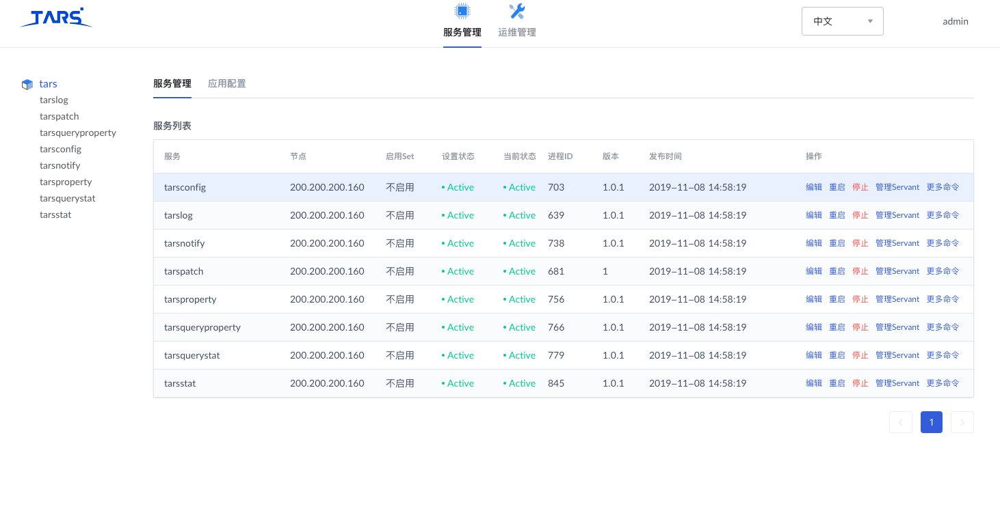
#One click execution
curl -s https://raw.githubusercontent.com/Jamlee/download/master/tars-build.sh | sudo sh
###1. Content overview
Install GCC and other construction tools in docker, and package the docker deployment files of tar in the way of docker in docker. The features are as follows:


Using MySQL installed from Yum for compilation can save a little time without compiling mysql. MySQL is installed as a container.


One click fool operation, * * you can quickly experience tar without climbing the document * *.


Script is a document. View the script to understand the whole compilation process


###2. System preparation
Operating system: Ubuntu 1604 / 1804, CentOS 7 (CentOS not tested yet)
Docker: 18 or 19
###3. One key operation
Store the following script as build.sh and execute
1.20191109 second
# modify docker CONF
sudo cp /lib/systemd/system/docker.service /etc/systemd/system  \
  && sudo sed -i 's/\ -H\ fd:\/\// -H\ unix:\/\/\/var\/run\/docker.sock -H tcp:\/\/0.0.0.0\ /g' /etc/systemd/system/docker.service \
  && sudo systemctl daemon-reload && sudo service docker restart

# write dockerfile
cat <<EOF >Dockerfile
FROM centos:7.5.1804 as builder

ENV DOCKER_HOST="tcp://0.0.0.0:2375"
RUN curl -s -o /etc/yum.repos.d/CentOS-Base.repo http://mirrors.cloud.tencent.com/repo/centos7_base.repo
RUN sed  -i 's/enabled\=1/enabled\=0/g' /etc/yum/pluginconf.d/fastestmirror.conf \
  && sed  -i 's/enabled\=1/enabled\=0/g' /etc/yum/pluginconf.d/ovl.conf \
  && yum makecache
RUN yum -y install git
RUN mkdir -p /usr/local/tars/cpp/deploy && git clone https://github.com/TarsCloud/TarsWeb.git  /usr/local/tars/cpp/deploy/web
RUN mkdir -p /app && git clone https://github.com/TarsCloud/TarsFramework.git --recursive /app/Tars

RUN rpm --rebuilddb && yum -y install wget make gcc gcc-c++ cmake yasm glibc-devel flex bison ncurses-devel zlib-devel autoconf net-tools
RUN wget -i -c http://dev.mysql.com/get/mysql57-community-release-el7-10.noarch.rpm \
  && yum -y install mysql57-community-release-el7-10.noarch.rpm \
  && yum -y install  mysql-devel mysql-community-client
RUN yum-config-manager --add-repo https://download.docker.com/linux/centos/docker-ce.repo
RUN yum install docker-ce-cli  -y
RUN mkdir /usr/local/mysql && ln -sf /lib64/mysql /usr/local/mysql/lib && ln -sf /usr/include/mysql  /usr/local/mysql/include

# compile tars
RUN cd /app/Tars/build && ./build.sh prepare && ./build.sh all && ./build.sh install
RUN cd /usr/local/tars/cpp/deploy \
 && echo 'RUN cd \${TARS_INSTALL}/web && . /root/.bashrc && npm --registry https://registry.npm.taobao.org install --quiet' >> Dockerfile \
 && sh docker.sh v1
EOF

# Start building
docker build --network host -t tar:build .

Screenshot of final result

Recently updated compilation script is very convenient! Awesome tar team
Start the compiled image:
# Time zone needs to be configured correctly
docker run -d -p3306:3306 -e MYSQL_ROOT_PASSWORD=456677 -v /etc/localtime:/etc/localtime:ro mysql:5.6

# Make sure your network card is eth0. For example, en3s0 needs to be changed to - einet = en3s0
docker run -d --net=host -e MYSQL_HOST=192.168.33.10 -e MYSQL_ROOT_PASSWORD=456677  -v /etc/localtime:/etc/localtime:ro -eREBUILD=false -eINET=eth0 -eSLAVE=false -v/data/log/app_log:/usr/local/app/tars/app_log  -v/data/log/web_log:/usr/local/app/web/log  -v/data/patchs:/usr/local/app/patchs  tars-docker:v1 /root/tars-install/docker-init.sh


I'm ready to build a successful image（20191109）
docker run -d -p3306:3306 -e MYSQL_ROOT_PASSWORD=456677 -v /etc/localtime:/etc/localtime:ro mysql:5.6
#Replace - einet = eth0 - e MySQL? Host = 192.168.33.10 with your own
docker run -d --net=host -e MYSQL_HOST=192.168.33.10 -e MYSQL_ROOT_PASSWORD=456677  -v /etc/localtime:/etc/localtime:ro -eREBUILD=false -eINET=eth0 -eSLAVE=false -v/data/log/app_log:/usr/local/app/tars/app_log  -v/data/log/web_log:/usr/local/app/web/log  -v/data/patchs:/usr/local/app/patchs  registry.cn-shanghai.aliyuncs.com/jamlee/share:tar20191109 /root/tars-install/docker-init.sh


How to change the docker mode to docker compose mode?


该issue长期未更新。如果问题依旧没解决，欢迎重新打开issue。TARS社区有您更精彩。
Thanks for your supporting. The issue has not been updated for a long time. If the problem is still not resolved, welcome to reopen the issue.


## [Tars和k8s结合的问题](/TarsCloud/Tars/issues/481)


想请问下，Tars的容器在k8s中发布，因为Tars不支持域名发布，如果想要扩容，有何方便的办法？


啥叫不支持域名发布?


啥叫不支持域名发布?

在tars的发布页面上，只能填写ip地址啊，填写其他字符串就报非法。


是nodejs的版本web管理平台吧?


是nodejs的版本web管理平台吧?
是的，有什么好办法吗？之前好像是说tars会向k8s做适配，不知道下个版本能不能见到？


你们现在是怎么使用的,能大概描述一下么, 才知道怎么修改更合适


如果只是说这里改成域名, 其实很容易修改, 试着改了一下, 貌似跑起来没啥问题了, 如果能满足的需求, 可以先push一个版本你用着


新版本web已经支持域名了, 有需要可以试一试.


## [tar 上次的发布版本还是去年发布的，我应该用哪一个tar版本部署呢？](/TarsCloud/Tars/issues/478)


tar 上次的发布版本还是去年发布的，我应该用哪一个tar版本部署呢？去年发布的v1.6.0. 想把 tar 用于生产，如何进行tar发行版本选择呀？


https://github.com/TarsCloud/TarsDocker/blob/master/README.zh.md


可以直接用docker部署, 以后框架升级简单一些


## [发布失败无日志](/TarsCloud/Tars/issues/476)


正常添加应用，发布报错
失败
taskid ：xxxxxxxxxx
没有看到日志目录，也不清楚错误原因


tarsAdminRegistry & tarspatch两个服务的日志


## [tc_timeout_queue_new.h中的class类没有继承taf::TC_ThreadMutex等锁类。编译不过。](/TarsCloud/Tars/issues/475)


What language are you using?
cpp
What operating system (Linux, Ubuntu, …) and version?
linux
What runtime / compiler are you using (e.g. jdk version or version of gcc)
Make sure you include information that can help us debug (full error message, exception listing, stack trace, logs).
tc_timeout_queue_new.h中的class类没有继承taf::TC_ThreadMutex等锁类。但用到了TC_LockT<TC_ThreadMutex> lock(*this);。编译不过。


这个类故意是无锁的, 为了提高效率, 你可以用tc_timeout_queue代替, 这个带锁


这个类故意是无锁的, 为了提高效率, 你可以用tc_timeout_queue代替, 这个带锁

东爷好。我想用一个tc_timeout_queue没有的功能，又用了generateId。模板就编不过啦。我后来自己改了改。


## [安装文档缺少导入web表db_tars_web.sql的步骤](/TarsCloud/Tars/issues/474)


What language are you using?
C++
What operating system (Linux, Ubuntu, …) and version?
centos7
What runtime / compiler are you using (e.g. jdk version or version of gcc)
gcc version 4.8.5
Make sure you include information that can help us debug (full error message, exception listing, stack trace, logs).
Install.zh.md 安装web管理系统 部分，缺少了导入web的表db_tars_web.sql


需要使用的模型都在TarsCloud/TarsWeb/app/dao/db下的db_tars_models和db_tars_web_models中定义了，在TarsCloud/TarsWeb/app/dao/db/index.js中使用了sequelize模块，通过调用sequelize.sync()，如下，将模型同步到数据库，会自动建立对应的表，无需在安装时导入
TarsWeb/app/dao/db/index.js
77 let tableObj = {}; 
78 let dbModelsPath = __dirname + '/' + database + '_models'; 
79 let dbModels = fs.readdirSync(dbModelsPath); 
80 dbModels.forEach(function (dbModel) { 
81 	let tableName = dbModel.replace(/\.js$/g, ''); 
82 	tableObj[_.camelCase(tableName)] = sequelize.import(dbModelsPath + '/' + tableName); 
83 	// tableObj[_.camelCase(tableName)].sync({ alter: true }); 
84 	tableObj[_.camelCase(tableName)].sync(); 
85 }); 


## [In the MySQL source code installation mode, there are also unsafe statements such as RM - RF / usr / local / MySQL / data to delete database data, which need to be modified](/TarsCloud/Tars/issues/473)


In the installation document, in the MySQL source code installation mode, there are also unsafe statements such as RM - RF / usr / local / MySQL / data to delete database data, which need to be modified
yum install perl
cd /usr/local/mysql
useradd mysql
rm -rf /usr/local/mysql/data
mkdir -p /data/mysql-data
ln -s /data/mysql-data /usr/local/mysql/data
chown -R mysql:mysql /data/mysql-data /usr/local/mysql/data
cp support-files/mysql.server /etc/init.d/mysql
If my.cnf exists in / etc / directory, you need to delete this configuration
rm -rf /etc/my.cnf
yum install -y perl-Module-Install.noarch
perl scripts/mysql_install_db --user=mysql
vim /usr/local/mysql/my.cnf


made a warning sign in document


## [mysql 5.6安装时，在cmake前应该增加一句进入解压目录](/TarsCloud/Tars/issues/472)


tar -zxvf mysql-5.6.26.tar.gz
cmake . -DCMAKE_INSTALL_PREFIX=/usr/local/mysql-5.6.26 -DWITH_INNOBASE_STORAGE_ENGINE=1 -DMYSQL_USER=mysql -DDEFAULT_CHARSET=utf8 -DDEFAULT_COLLATION=utf8_general_ci
make
tar之后，少了cd mysql-5.6.26


已经修改


## [建议提示语改一下位置](/TarsCloud/Tars/issues/471)


web管理平台的提示语放的位置实在是太碍事了

像一贴膏药一样贴在了上方，且覆盖了“服务管理”、“运维管理”两个功能，建议在底端或者右侧专门放一个区域，显示操作提示


感谢 hypeaches 的提问。该问题为非功能性需求，已转达给相关研发团队决策，请持续关注后续版本更新。
同时，我们非常欢迎您提交PR贡献代码，一起构建更好的 TarsCloud 社区。


## [配置中心推送的配置文件换行符错乱](/TarsCloud/Tars/issues/470)


在服务配置页面增加一个新的配置文件，如下图

然后编辑配置项

将配置文件推送到服务，然而配置文件内容如下

请注意第二行注释末尾的^M，以及第二行注释与配置项k1之间的^M
已经试过注释全英文，不加注释，仍然是这样。如下图

配置文件创建时加了前两条配置，推送到服务。然后修改配置，增加了后两条配置，推送到服务。结果就成了图中的样子。
看了换行符格式，为unix换行符

文件编码格式为utf-8


没懂你啥意思 ^M就是换行符啊??


## [ How to view user-defined submission information](/TarsCloud/Tars/issues/469)


User defined escalation information has been written to MySQL Library

But how to view the reported information on the management platform?
My services, such as echoserver (reported service), tarsproperty and tarsstat, cannot be seen. How can I filter out these customized reported information?


Take a look at the feature monitoring page under the echoserver service. Is there any result you want


The feature filter "test1" has data, but my test1 reports six data, but the filtered test1 in the feature monitoring has only the total flow, and nothing else. And the total traffic should be the traffic of the whole server, that is, there is no traffic in the service, but the total traffic will also increase.
And what is the meaning of characteristic value in characteristic monitoring? What is the "policy" in the filter field corresponding to the submitted data?


The policy corresponds to the policy in your report, that is, AVG, count and distr. The value of count in the table above is also very large. You can confirm whether the data reported by this policy is correct.
The total traffic is not the total traffic of the server, which can not be obtained directly by the tar service. The total traffic is the above characteristic values.


The reason why count is very large is that it is a simple echo service, in which six supported statistics are reported, so it is very large. The code is like this
`
int EchoImp::testHello(const std::string & sReq,std::string &sRsp,tars::TarsCurrentPtr current)
{
TLOGDEBUG("EchoImp::testHello:"<<sReq<<endl);
sRsp = "hello: " + sReq;
PropertyReporter::instance()->report(1);
TARS_NOTIFY_NORMAL("testHello-test1 info");
TARS_NOTIFY_WARN("testHello-test1 warning");
TARS_NOTIFY_ERROR("testHello-test1 error");
return 0;

}
PropertyReporter code
PropertyReporter* PropertyReporter::instance() {
static PropertyReporter reporter;
return &reporter;
}
void PropertyReporter::init() {
std::vector v;
v.push_back(10);
v.push_back(30);
v.push_back(50);
v.push_back(80);
v.push_back(100);
reporter_ptr_ = Application::getCommunicator()->getStatReport()->createPropertyReport("test1",
PropertyReport::sum(),
PropertyReport::avg(),
PropertyReport::count(),
PropertyReport::max(),
PropertyReport::min(),
PropertyReport::distr(v));
}
void PropertyReporter::report(int val) {
reporter_ptr_->report(val);
}
`
According to my understanding, the meanings of six statistics are
Average all data reported by avg()
Min () minimum of all data reported
Max() maximum of all data reported
Distr() reports all data, and makes distribution statistics according to v
Sum () all data reported
Total number of times count() reported
Is my understanding right? Also, if you want to know the QPS of an interface, what's your opinion on monitoring? The six statistics supported do not seem to support QPS monitoring


On the feature monitoring page, click the feature to see the reported data and curve


## [求服务端自定义上报demo](/TarsCloud/Tars/issues/468)


What language are you using?
C++
What operating system (Linux, Ubuntu, …) and version?
centos7
What runtime / compiler are you using (e.g. jdk version or version of gcc)
默认的服务监控只有总流量和平均耗时、超时率、异常率等信息，但是还想看到每个接口的qps、异常信息等，这些需要自定义上报吧。
如何在服务中上报信息，求详细一点的demo及说明文档，比如，示例程序
https://github.com/TarsCloud/TarsCpp/blob/13c01023ae8df34159549ce88546bbd84159855b/examples/QuickStartDemo/HelloServer/HelloImp.cpp
int HelloImp::testHello(const std::string &sReq, std::string &sRsp, tars::TarsCurrentPtr current)
{
TLOGDEBUG("HelloImp::testHellosReq:"<<sReq<<endl);
sRsp = sReq;
return 0;
}
在testHello接口中，该如何上报自定义数据？


你好请问是否这个问题已经解决，是的话您可以分享一下您的经验，然后关闭这个issue，方便其他人更容易解决这个问题。十分感谢~


https://tarscloud.github.io/TarsDocs/an-li/tarscpp/tars_cpp_user_guide.html
请参考这个文档中的统计上报这部分.


## [安装mysql-devel时出现错误](/TarsCloud/Tars/issues/467)


Linux version:
CentOS Linux release 7.6.1810 (Core)
Mysql version:
mysql 5.7
按照官方教程使用yum安装mysql-devel时出现错误
# yum -y install  mysql-devel
Loaded plugins: fastestmirror
Repository base is listed more than once in the configuration
Repository updates is listed more than once in the configuration
Repository extras is listed more than once in the configuration
Repository centosplus is listed more than once in the configuration
Repository epel is listed more than once in the configuration
Repository epel-debuginfo is listed more than once in the configuration
Repository epel-source is listed more than once in the configuration
Loading mirror speeds from cached hostfile
 * base: mirrors.163.com
 * extras: mirrors.163.com
 * updates: mirrors.cn99.com
Resolving Dependencies
--> Running transaction check
---> Package mariadb101u-devel.x86_64 1:10.1.41-1.el7.ius will be installed
--> Processing Dependency: mariadb101u-libs(x86-64) = 1:10.1.41-1.el7.ius for package: 1:mariadb101u-devel-10.1.41-1.el7.ius.x86_64
--> Running transaction check
---> Package mariadb101u-libs.x86_64 1:10.1.41-1.el7.ius will be installed
--> Processing Dependency: mariadb101u-common(x86-64) = 1:10.1.41-1.el7.ius for package: 1:mariadb101u-libs-10.1.41-1.el7.ius.x86_64
--> Running transaction check
---> Package mariadb101u-common.x86_64 1:10.1.41-1.el7.ius will be installed
--> Processing Dependency: mariadb101u-config(x86-64) = 1:10.1.41-1.el7.ius for package: 1:mariadb101u-common-10.1.41-1.el7.ius.x86_64
--> Running transaction check
---> Package mariadb101u-config.x86_64 1:10.1.41-1.el7.ius will be installed
--> Processing Conflict: 1:mariadb101u-config-10.1.41-1.el7.ius.x86_64 conflicts mysql-community-server
--> Processing Conflict: 1:mariadb101u-common-10.1.41-1.el7.ius.x86_64 conflicts mysql-community-common
--> Processing Conflict: 1:mariadb101u-libs-10.1.41-1.el7.ius.x86_64 conflicts mysql-community-libs-compat
--> Processing Conflict: 1:mariadb101u-libs-10.1.41-1.el7.ius.x86_64 conflicts mysql-community-libs
--> Finished Dependency Resolution
Error: mariadb101u-common conflicts with mysql-community-common-5.7.27-1.el7.x86_64
Error: mariadb101u-libs conflicts with mysql-community-libs-compat-5.7.27-1.el7.x86_64
Error: mariadb101u-config conflicts with mysql-community-server-5.7.27-1.el7.x86_64
Error: mariadb101u-libs conflicts with mysql-community-libs-5.7.27-1.el7.x86_64
 You could try using --skip-broken to work around the problem
 You could try running: rpm -Va --nofiles --nodigest

尝试了这个方法，问题依旧重现。
any help or suggestion?


你的系统中安装了mariadb？  mariadb和MySQL冲突。卸载mariadb再试试


如果是学习或者验证环境，建议格式化系统。
然后通过如下几行命令，就可以成功安装MySQL
install mysql 5.7
wget https://repo.mysql.com//mysql80-community-release-el7-3.noarch.rpm
rpm -ivh mysql80-community-release-el7-3.noarch.rpm
yum-config-manager --disable mysql80-community
yum-config-manager --enable mysql57-community
yum install -y mysql-community-server
yum install -y mysql-devel


https://github.com/qiuxin/Tars/tree/master/shellDeploy 这个文件夹中有一键安装部署的脚本，供你参考, 详见其中的introduction.md文件。


如果是学习或者验证环境，建议格式化系统。
然后通过如下几行命令，就可以成功安装MySQL
install mysql 5.7
wget https://repo.mysql.com//mysql80-community-release-el7-3.noarch.rpm
rpm -ivh mysql80-community-release-el7-3.noarch.rpm
yum-config-manager --disable mysql80-community
yum-config-manager --enable mysql57-community
yum install -y mysql-community-server
yum install -y mysql-devel

mariadb没有安装过哈 这个方法试过了也不行


我在CentOS上刚实验过，安装成功， 没有任何问题


你把你的操作日志，提供一下?


如果是学习或者验证环境，建议格式化系统。
然后通过如下几行命令，就可以成功安装MySQL
install mysql 5.7
wget https://repo.mysql.com//mysql80-community-release-el7-3.noarch.rpm
rpm -ivh mysql80-community-release-el7-3.noarch.rpm
yum-config-manager --disable mysql80-community
yum-config-manager --enable mysql57-community
yum install -y mysql-community-server
yum install -y mysql-devel

mariadb没有安装过哈 这个方法试过了也不行

你需要重装系统，选择一个干净的环境重试。 另外，看你的使用的系统是否默认安装了mariadb


@qiuxin
从源码安装MySQL就避开了这个问题。
Anyway, thanks.


## [HelloPrx是怎么生成的？](/TarsCloud/Tars/issues/464)


What language are you using?
c++
What operating system (Linux, Ubuntu, …) and version?
centos7
What runtime / compiler are you using (e.g. jdk version or version of gcc)
请问HelloPrx是怎么产生的？
我使用/usr/local/tars/cpp/script/create_tars_server.sh app EchoServer Echo
创建了一个测试程序，但是写客户端的时候，没有EchoPrx，请文怎么产生这个类？


创建的服务的prx类都在tars文件生成的头文件中定义，需要使用对应的脚本进行转换
/usr/local/tars/cpp/tools/tars2cpp Echo.tars
会在当前目录下生成Echo.h，EchoPrx定义在里面


然而并没有啊

参考demo代码，路径：
https://github.com/TarsCloud/TarsCpp/blob/d687aae51a016c313812c973ec75ab4cad7fbcaa/examples/QuickStartDemo/HelloServer/Client/main.cpp


你发的截图中有定义了
Echo.h: 509:        typedef tars::TC_AutoPtr<EchoProxy> EchoPrx;
EchoPrx是EchoProxy的智能指针类型


## [No link to Chinese version of introduction](/TarsCloud/Tars/issues/462)


When the link redirect to the introduction, we can see the English one but without a link to the Chinese one.


## [After each service restart, the log will be printed:All workers are not alive any more. ](/TarsCloud/Tars/issues/461)


What language are you using?
php
What operating system (Linux, Ubuntu, …) and version?
linux
Make sure you include information that can help us debug (full error message, exception listing, stack trace, logs).
After restarting the service for a while, check the log and print:
tars_logger.ERROR: Tars\core{closure} All workers are not alive any more. [] []
But the service is normal and can be accessed. Why do you still prompt this


At present, the confirmation is caused by timer executing exec for the first time in the task and there is no return. The specific reason is not determined temporarily and normal business will not be affected. Please ignore it first.


Do you resolve the question？


该issue长期未更新。如果问题依旧没解决，欢迎重新打开issue。TARS社区有您更精彩。
Thanks for your supporting. The issue has not been updated for a long time. If the problem is still not resolved, welcome to reopen the issue.


## [One click deployment script installation, tarsstat service error: Statistics warehousing failure, please handle in time!](/TarsCloud/Tars/issues/459)


What language are you using?
CPP
What operating system (Linux, Ubuntu, …) and version?
CentOS 7
What runtime / compiler are you using (e.g. jdk version or version of gcc)
gcc Red Hat 4.8.5-36
Make sure you include information that can help us debug (full error message, exception listing, stack trace, logs).

Relevant issues
After one click deployment of Python script to install the deployment project, the stat node reports an error every 5 minutes: Statistics warehousing failure, please handle in time!
Through the query log, it is found that there is an error in the table building process of the stat service. The field in the primary key uses default null, but the primary key cannot be null. Therefore, the table building process is not successful. The statistics receipt failure is that there is no corresponding table and the data cannot be inserted. Therefore, report to the notify node: the error of the failure of the statistics receipt.
At the same time, in the process of trying to reproduce the problem, restart the service and find that everything is normal, no error is reported, the table in the database has been built, view the properties of the table, and find that the original default null field in the SQL statement is not null, so it can be determined that the built statement used after restarting the service is different.
Through the source code of stat service, it is found that the SQL statement for table building is obtained from the conf file. Combined with the difference between the one key deployment script and the ordinary installation, the one key deployment script is not published through the web management platform, and the local conf file will be used by default; the configuration file will be pulled from the remote end first when publishing and restarting the service through the web platform. Therefore, it can be determined that the local conf file is different from the conf file distributed by remote.
By comparing the template files (tars / framework / SQL / db_tar. SQL: Line 333) and local conf files (tars / framework / conf / tar. Tars STAT) of tar.stat on the management platform, the primary key field parts are indeed different, and default not null is used in the templates


## [Tars部署成功后，点击“服务监控”和“特性监控”界面，长时间无返回，超时后弹出bad gateway](/TarsCloud/Tars/issues/458)


/usr/local/app/tars/app_log/tars/tarsqueryproperty下的tars.tarsqueryproperty.log显示：
2019-09-03 15:25:08|2609|DEBUG|[TARS]accept [10.211.55.24:51526] [20] incomming
2019-09-03 15:25:08|2603|ERROR|[TARS]ServantHandle::handle request protocol decode error:require field not exist, tag: 1, headTag: 0
2019-09-03 15:25:30|2609|DEBUG|[TARS]accept [10.211.55.24:51576] [20] incomming
2019-09-03 15:25:30|2603|ERROR|[TARS]ServantHandle::handle request protocol decode error:require field not exist, tag: 1, headTag: 0


问题根因在于： 是tarspropertystat和tarsqueryproperty两个查询服务，需要走非tars协议。
在如下配置中修改，问题解决。


## [Tars刷新新logo](/TarsCloud/Tars/issues/457)


老版本Tars Logo需要更换，应该刷新新的logo


已更新


## [TarsWeb在点击不同服务时，弹出“系统内部调用错误”对话框](/TarsCloud/Tars/issues/456)


使用pm2 log 0查看， 提示Table 'db_tars.t_server_notifys' doesn't exist
详见如下：
0|tars-node-web  | error: 150.109.122.89||NotifyController.js:47|[getServerNotifyList] SequelizeDatabaseError: Table 'db_tars.t_server_notifys' doesn't exist


错误的原因是：tarsnotify 服务没有被拉起。  当部署和发布了tarsnotify之后，会生成db_tars.t_server_notifys表项，该现象会消失。


## [执行npm i -g pm2会报错](/TarsCloud/Tars/issues/455)


执行npm i -g pm2会报错：
[root@VM_0_13_centos web]# npm i -g pm2
-bash: npm: command not found
[root@VM_0_13_centos web]# which npm
/usr/bin/which: no npm in (/usr/local/sbin:/usr/local/bin:/usr/sbin:/usr/bin:/root/bin)


解决办法：
需要提前运行：
[root@VM_0_13_centos web]# yum install -y npm
[root@VM_0_13_centos web]# npm i -g pm2


如下在如下链接中，增加如上安装语句：
https://github.com/TarsCloud/Tars/blob/master/Install.md
https://github.com/TarsCloud/Tars/blob/master/Install.zh.md


已经在如上中英文链接中，增加yum install -y npm 以及npm i -g pm2


## [读取db配置](/TarsCloud/Tars/issues/454)


What language are you using?
在配置文件中配置了db的配置,大致看了下tars读取配置的部分,好像没有读取db配置
What operating system (Linux, Ubuntu, …) and version?
Linux
What runtime / compiler are you using (e.g. jdk version or version of gcc)
golang
Make sure you include information that can help us debug (full error message, exception listing, stack trace, logs).
也许是我没找对地方,如果有读取这部分内容麻烦说下在哪里读取的.


读取配置部分分为两种

一种是拉取服务基本配置，在文件TarsGo/tars/config.go中定义，你看的应该是这部分
另一种是拉取自定义配置，可以拉取指定的自己上传到web管理平台上的配置，在文件TarsGo/tars/util/conf/conf.go中定义，具体用法可以参考同目录下的conf_test.go文件，服务中使用只要引入包 "github.com/TarsCloud/TarsGo/tars/util/conf" 即可使用；


## [404 Not Found - Introduction in English](/TarsCloud/Tars/issues/452)


In the Chinese version of Introduction, the first line says "Click me switch to English version".
After redirection, the page shows 404 Not Found.


## [编译安装TARS报错](/TarsCloud/Tars/issues/451)


执行./build.sh all 命令的时候报以下错误：
请问怎么解决
[ 32%] Built target tars2oc
[ 33%] Built target tars2php
[ 34%] Built target tars2android
Linking CXX executable tars2node
../../util/lib/libtarsutil.a(tc_encoder.cpp.o): In function tars::TC_Encoder::gbk2utf8(char*, int&, char const*, int)': /usr/local/TarsFramework/tarscpp/util/src/tc_encoder.cpp:39: undefined reference to libiconv_open'
/usr/local/TarsFramework/tarscpp/util/src/tc_encoder.cpp:75: undefined reference to libiconv_close' /usr/local/TarsFramework/tarscpp/util/src/tc_encoder.cpp:66: undefined reference to libiconv'
../../util/lib/libtarsutil.a(tc_encoder.cpp.o): In function tars::TC_Encoder::gbk2utf8(std::string const&)': /usr/local/TarsFramework/tarscpp/util/src/tc_encoder.cpp:84: undefined reference to libiconv_open'
/usr/local/TarsFramework/tarscpp/util/src/tc_encoder.cpp:118: undefined reference to libiconv' /usr/local/TarsFramework/tarscpp/util/src/tc_encoder.cpp:134: undefined reference to libiconv_close'
../../util/lib/libtarsutil.a(tc_encoder.cpp.o): In function tars::TC_Encoder::utf82gbk(char*, int&, char const*, int)': /usr/local/TarsFramework/tarscpp/util/src/tc_encoder.cpp:203: undefined reference to libiconv_open'
/usr/local/TarsFramework/tarscpp/util/src/tc_encoder.cpp:214: undefined reference to libiconv' /usr/local/TarsFramework/tarscpp/util/src/tc_encoder.cpp:223: undefined reference to libiconv_close'
/usr/local/TarsFramework/tarscpp/util/src/tc_encoder.cpp:218: undefined reference to libiconv_close' ../../util/lib/libtarsutil.a(tc_encoder.cpp.o): In function tars::TC_Encoder::gbk2utf8(std::string const&, std::vector<std::string, std::allocatorstd::string >&)':
/usr/local/TarsFramework/tarscpp/util/src/tc_encoder.cpp:142: undefined reference to libiconv_open' /usr/local/TarsFramework/tarscpp/util/src/tc_encoder.cpp:178: undefined reference to libiconv'
/usr/local/TarsFramework/tarscpp/util/src/tc_encoder.cpp:196: undefined reference to `libiconv_close'
collect2: error: ld returned 1 exit status
make[2]: *** [tarscpp/tools/tars2node/tars2node] Error 1
make[1]: *** [tarscpp/tools/tars2node/CMakeFiles/tars2node.dir/all] Error 2
make: *** [all] Error 2


你是在哪个路径下下载的代码？代码是否是否下载全了？编译需要使用的相关软件，是否都装了？


git clone https://github.com/TarsCloud/TarsFramework.git
直接克隆仓库的


按照这个教程来的，不过mysql是自己安装的，mysql的有设置好
https://tarsphp.gitbook.io/doc/huan-jing-da-jian/platform


git clone https://github.com/TarsCloud/TarsFramework.git  之后，进入TarsFramework目录，然后执行git submodule update --init --recursive 命令，确保代码都下载。再编译看看？


另外在确保mysql安装好的前提下，确保如下两个文件被正确修改:
/usr/local/TarsFramework/tarscpp下的CMakeLists.txt
/usr/local/TarsFramework 的CMakeLists.txt
中的：
set(MYSQL_DIR_INC "/usr/local/mysql/include")
set(MYSQL_DIR_LIB "/usr/local/mysql/lib")
修改成为：
set(MYSQL_DIR_INC "/usr/include/mysql")
set(MYSQL_DIR_LIB "/usr/lib64/mysql")


同时查看mysql版本，目前仅仅支持mysql 5.6，5.7。 不支持mysql 8.0


无其它问题关闭。


## [冒昧问一句,这里还有人维护吗?](/TarsCloud/Tars/issues/450)


What language are you using?
golang
What operating system (Linux, Ubuntu, …) and version?
centos
What runtime / compiler are you using (e.g. jdk version or version of gcc)
Make sure you include information that can help us debug (full error message, exception listing, stack trace, logs).


## [上传发布包，提示not found](/TarsCloud/Tars/issues/449)


问题1：
第一次在无外网的机器上部署单机tars，部署看起来成功，发布tarsnotify包时候，上传包提示not found，是什么原因呢
问题2：
为什么每次刚部署完tars，每个服务里的服务监控和特性监控tab按钮，都会提示：cannot
read propertyly keys of undefined 和 adminservice.getEndpoints 错误呢
麻烦指导怎么查看问题，谢谢！


问题1： 在Tars/framework/build目录下，make tarsproperty-tar生成tarsnotify.tgz，然后copy到web所在机器，选择tarsnotify.tgz所在路径上传和发布即可。我这边操作实际操作一切正常。 我们环境如果存在差异，我们再评估环境差异对功能的影响。


问题2： 确保所有的tars框架服务（tarsstat-tar，tarsnotify-tar，tarsproperty-tar，tarslog-tar，tarsquerystat-tar，tarsqueryproperty-tar）都有部署成功，点击服务监控和特性监控按钮，需要调用对应服务。


问题2： 日志的查看，见/usr/local/app/tars/app_log/tars/目录下


第2个问题根因： 当刚部署好的Tars环境，点击“服务监控”和“特性监控”的时候， 就会返回缓慢，web超时后弹出“Bad Gateway”菜单。  实际上，这个问题的原因应该是： “服务监控”和“特性监控”需要对比前一天的数据，而新安装的环境根本找不到前一天的数据，所以会提示出错。


## [安装平台环境出现错误](/TarsCloud/Tars/issues/448)

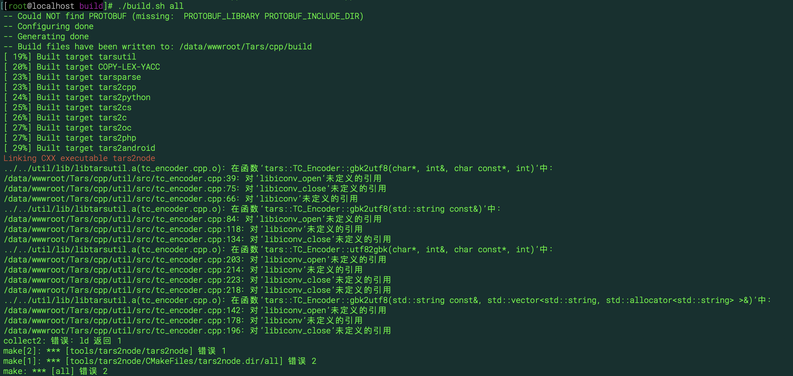

请问这种错误怎么修改


## [tars  怎么在windows下安装部署 ](/TarsCloud/Tars/issues/447)


What language are you using?
What operating system (Linux, Ubuntu, …) and version?
What runtime / compiler are you using (e.g. jdk version or version of gcc)
Make sure you include information that can help us debug (full error message, exception listing, stack trace, logs).


主要用在linux


## [开源是好事，但不要使用这种危险的命令](/TarsCloud/Tars/issues/446)


build/install.sh的第53行，rm -rf /usr/local/mysql/data，这么危险的命令也提交？既然开源，就负责一点好不好，我本机的数据库全部被删除了


已修改，采用备份的方式。


## [Hope  Tars can support C#](/TarsCloud/Tars/issues/445)


Dotnetcore is now mature and stable. It is currently version 2.2 and will be version 3.0 soon. Now many companies have been using dotnetcore in production environment.


thanks  for support


when will it support .net core?


## [Install.zh.md 说明文件需要修正](/TarsCloud/Tars/issues/444)


2.2. c++ 开发环境安装
这里面
“
然后进入build源码目录
cd ${source_folder}/build
chmod u+x build.sh
./build.sh prepare
./build.sh all
”
需要修正为
“
然后进入build源码目录
cd ${source_folder}/TarsFramework/build
chmod u+x build.sh
./build.sh prepare
./build.sh all
“


done


谢谢


## [docker怎么集群部署，找不到这方面的文档](/TarsCloud/Tars/issues/443)


No description provided.


## [tars基础服务启动不起来, 每次都要重新执行tars_install.sh脚本解决](/TarsCloud/Tars/issues/442)


What language are you using?
PHP
What operating system (Linux, Ubuntu, …) and version?
CentOS7.6
What runtime / compiler are you using (e.g. jdk version or version of gcc)
gcc 4.8.5, mysql5.7.27 php7.1.31 vagrant2.2.5
Make sure you include information that can help us debug (full error message, exception listing, stack trace, logs).
事情是这样的,  我在vagrant中装了一个虚拟机, 按照TarsPHP官方文档中搭建了一套环境, 但我第二天重启的时候发现很多系统服务挂掉了, 设置状态是Active, 当前状态是Off, 我就一点点排查, 后来看到有一个issue中提到重新执行一下/usr/local/app/tars/tars_install.sh脚本试试看, 我试了一下果然好使了.
但是, 当我再次重启虚拟机之后又会发生同样的情况, 难道每次都需要执行一下这个安装脚本么?
另: 在web系统中使用pm2 logs tars-node-web查看, 发现有下图这么一段报错出现, 不知道是不是这里的缘故?

再另: 不知道tars系统和web管理系统有没有启动的先后顺序, 是不是跟我先启动web管理系统而没有先启动tars系统有关系?
谢谢解答.


检查  /usr/local/app/tars/app_log/tars 这个下面对应每个服务的日志
是否是 虚拟机重启以后 导致ip 变化，导致实际ip 和 之前等级的绑定ip 不一致，导致无法启动。


你好, 我详细看了所有的服务, 今天重启的时候所有服务都启动了, 日志中并没有启动的纪录, 虚拟机的ip我设定死了, 就是192.168.2.2, 不会每次启动都变化. 但还是在点击重启或者停止按钮时会发生系统内部错误的报错, 日志中没有记载, 给我感觉好像就是web服务启动了, tars服务没有启动一样, 日志居然也没有纪录, 有点奇怪. 我把我的虚拟机打包传到了下方链接处, 如果特别不忙, 请麻烦您看一下, 如果忙就算了, 我可以把tars_install.sh设置为开机启动就行了, 感谢.
https://app.vagrantup.com/muyev/boxes/tarsphp_service


tarsregistry是tars的主控服务，与tarsWeb是独立的，如果要正常使用必须要都启动起来才可以。
把tars_install.sh设置为开机启动是一个解决办法。
希望能帮到你。


请使用最新的部署脚本一键安装 , 可以参考
https://tarscloud.github.io/TarsDocs/SUMMARY.html
部署相关的文档


## [Configuration file Chinese scrambling](/TarsCloud/Tars/issues/441)


What language are you using?
What operating system (Linux, Ubuntu, …) and version?
What runtime / compiler are you using (e.g. jdk version or version of gcc)
Make sure you include information that can help us debug (full error message, exception listing, stack trace, logs).


It refers to the problem of the configuration file. Please take a look at the screenshot


You can consider using GBK code to open the configuration file in your own service code, and then using Unicode encoded string instead of the original Chinese string.


https://github.com/TarsCloud/Tars/blob/master/Install_faq.zh.md Item 15 for your reference


该issue长期未更新。如果问题依旧没解决，欢迎重新打开issue。TARS社区有您更精彩。
Thanks for your supporting. The issue has not been updated for a long time. If the problem is still not resolved, welcome to reopen the issue.


## [web必须和framework中的patchServer部署在一台机器吗](/TarsCloud/Tars/issues/440)


No description provided.


是的


## [docker版本,Java启动脚本模板有错误](/TarsCloud/Tars/issues/439)


Java
linux docker版本
Jdk10
tars docker容器内使用的Jdk版本是1.10，启动脚本模板有
-XX:+PrintGCApplicationStoppedTime这个参数，导致启动失败。


赞一个


use db_tars;
update t_profile_template set profile='以下模板' where template_name='tars.tarsjava.default';
--------模板------------


enableset=${enableset}
setdivision=${setdivision}

locator=${locator}
sync-invoke-timeout=20000
async-invoke-timeout=20000
refresh-endpoint-interval=60000
stat=tars.tarsstat.StatObj
property=tars.tarsproperty.PropertyObj
report-interval=60000
modulename=${modulename}
sample-rate=100000
max-sample-count=50


app=${app}
server=${server}
localip=${localip}
local=${local}
basepath=${basepath}
datapath=${datapath}
logpath=${logpath}
loglevel=DEBUG
logsize=15M
log=tars.tarslog.LogObj
config=tars.tarsconfig.ConfigObj
notify=tars.tarsnotify.NotifyObj
mainclass=com.qq.tars.server.startup.Main
classpath=${basepath}/conf:${basepath}/WEB-INF/classes:${basepath}/WEB-INF/lib
jvmparams=-Dcom.sun.management.jmxremote.ssl=false -Dcom.sun.management.jmxremote.authenticate=false -Xms2000m -Xmx2000m -Xmn1000m -Xss1000k -XX:PermSize=128M -XX:+UseConcMarkSweepGC -XX:CMSInitiatingOccupancyFraction=60 -XX:+CMSParallelRemarkEnabled -XX:+CMSScavengeBeforeRemark  -verbosegc -XX:+PrintGCDetails -XX:ErrorFile=${logpath}/${app}/${server}/jvm_error.log
sessiontimeout=120000
sessioncheckinterval=60000
tcpnodelay=true
udpbuffersize=8192
charsetname=UTF-8
backupfiles=conf


ps：这个项目坑太多了，且行且珍惜。


## [客户主机和服务器主机在不同时区，出现web界面下服务无法加载](/TarsCloud/Tars/issues/438)


【故障】客户主机在国内，云服务器在美国硅谷，方式出现web界面下服务无法加载。
pm2 logs 0显示：
“SequelizeConnectionError: Unknown or incorrect time zone: '+-7:00' ”
[故障解决办法]
办法1： 在本机上将云主机时区强制修成本地访问机器时区
执行 ： TZ='Asia/Shanghai'; export TZ
办法2： 修改代码 TarsWeb\app\dao\db\index.js  62 行
timezone: (() => {
//let timezone = String(0 - new Date().getTimezoneOffset() / 60);
//return '+' + (timezone.length < 2 ? ('0' + timezone) : timezone) + ':00';
let timezone = String(0 - new Date().getTimezoneOffset() / 60);
let prefix = ((-1 == timezone.indexOf("+")) && (-1 == timezone.indexOf("-"))) ? '+' : '';
return prefix + (timezone.length < 2 ? ('0' + timezone) : timezone) + ':00';
})()  //获取当前时区并做转换


## [yum安装mysql建议增加修改安装版本内容](/TarsCloud/Tars/issues/437)


wget下来的yum repo, 一般情况是最新的版本，例如目前的mysql8.0 。 为了更好的兼容Tars现有安装和配置，建议安装mysql 5.6或者5.7.   但是直接 yum install mysql-community-server下载的却是最新的mysql 8.0.  这时需要进行如下操作，才可以正确安装mysql 5.6或者5.7.
wget https://repo.mysql.com//mysql80-community-release-el7-3.noarch.rpm
rpm -ivh mysql80-community-release-el7-3.noarch.rpm
安装完成之后，会在 /etc/yum.repos.d/ 目录下新增 mysql-community.repo 、mysql-community-source.repo 两个 yum 源文件。
[root@VM_0_13_centos ~]# cd /etc/yum.repos.d/
[root@VM_0_13_centos yum.repos.d]# ls
CentOS-Base.repo  CentOS-Epel.repo  mysql-community.repo  mysql-community-source.repo
执行如上命令安装完成之后，就可以使用 yum repolist all | grep mysql 查询到新的yum安装包，各种版本的都在其中。
[root@VM_0_13_centos ~]# yum repolist all | grep mysql
mysql-cluster-7.5-community/x86_64 MySQL Cluster 7.5 Community   disabled
mysql-cluster-7.5-community-source MySQL Cluster 7.5 Community - disabled
mysql-cluster-7.6-community/x86_64 MySQL Cluster 7.6 Community   disabled
mysql-cluster-7.6-community-source MySQL Cluster 7.6 Community - disabled
mysql-cluster-8.0-community/x86_64 MySQL Cluster 8.0 Community   disabled
mysql-cluster-8.0-community-source MySQL Cluster 8.0 Community - disabled
mysql-connectors-community/x86_64  MySQL Connectors Community    enabled:    108
mysql-connectors-community-source  MySQL Connectors Community -  disabled
mysql-tools-community/x86_64       MySQL Tools Community         enabled:     90
mysql-tools-community-source       MySQL Tools Community - Sourc disabled
mysql-tools-preview/x86_64         MySQL Tools Preview           disabled
mysql-tools-preview-source         MySQL Tools Preview - Source  disabled
mysql55-community/x86_64           MySQL 5.5 Community Server    disabled
mysql55-community-source           MySQL 5.5 Community Server -  disabled
mysql56-community/x86_64           MySQL 5.6 Community Server    disabled
mysql56-community-source           MySQL 5.6 Community Server -  disabled
mysql57-community/x86_64           MySQL 5.7 Community Server    disabled
mysql57-community-source           MySQL 5.7 Community Server -  disabled
mysql80-community/x86_64           MySQL 8.0 Community Server    enabled:    113
mysql80-community-source           MySQL 8.0 Community Server -  disabled
修改默认安装yum源
如上可以看出来，默认的安装源为mysql80-community版本，我现在希望安装的版本是mysql57-community。 使用yum-config-manager --disable mysql80-community来取消mysql80-community的默认安装，然后使用yum-config-manager --enable mysql57-community来使能mysql57-community成为yum默认安装版本。
之后使用yum repolist all | grep mysql来查看：
[root@VM_0_13_centos ~]# yum repolist all | grep mysql
mysql-cluster-7.5-community/x86_64 MySQL Cluster 7.5 Community   disabled
mysql-cluster-7.5-community-source MySQL Cluster 7.5 Community - disabled
mysql-cluster-7.6-community/x86_64 MySQL Cluster 7.6 Community   disabled
mysql-cluster-7.6-community-source MySQL Cluster 7.6 Community - disabled
mysql-cluster-8.0-community/x86_64 MySQL Cluster 8.0 Community   disabled
mysql-cluster-8.0-community-source MySQL Cluster 8.0 Community - disabled
mysql-connectors-community/x86_64  MySQL Connectors Community    enabled:    108
mysql-connectors-community-source  MySQL Connectors Community -  disabled
mysql-tools-community/x86_64       MySQL Tools Community         enabled:     90
mysql-tools-community-source       MySQL Tools Community - Sourc disabled
mysql-tools-preview/x86_64         MySQL Tools Preview           disabled
mysql-tools-preview-source         MySQL Tools Preview - Source  disabled
mysql55-community/x86_64           MySQL 5.5 Community Server    disabled
mysql55-community-source           MySQL 5.5 Community Server -  disabled
mysql56-community/x86_64           MySQL 5.6 Community Server    disabled
mysql56-community-source           MySQL 5.6 Community Server -  disabled
mysql57-community/x86_64           MySQL 5.7 Community Server    enabled:    347
mysql57-community-source           MySQL 5.7 Community Server -  disabled
mysql80-community/x86_64           MySQL 8.0 Community Server    disabled
mysql80-community-source           MySQL 8.0 Community Server -  disabled
执行安装命令
[root@VM_0_13_centos ~]# yum install mysql-community-server
[root@VM_0_13_centos tarscpp]# yum -y install  mysql-devel
如上命令完成安装。


## [关闭mysql密码要求的命令不兼容mysql 8.0](/TarsCloud/Tars/issues/436)


[root@VM_0_13_centos ~]# mysql --version
mysql  Ver 8.0.16 for Linux on x86_64 (MySQL Community Server - GPL)
在mysql 8.0执行如下语句会报错：
mysql> set global validate_password_policy=0;
ERROR 1193 (HY000): Unknown system variable 'validate_password_policy'
mysql> set global validate_password_length=1;
ERROR 1193 (HY000): Unknown system variable 'validate_password_length'
解决方法：
mysql> set global validate_password.policy=0;
Query OK, 0 rows affected (0.00 sec)
mysql> set global validate_password.length=1;
Query OK, 0 rows affected (0.00 sec)
建议在文档中明确不同版本的操作


目前版本不支持mysql8.0,已经明确在安装文档中，请大家暂时不要使用mysql8.0


## [文档中mysql的密码tars2015已经无法在新版本的mysql上使用](/TarsCloud/Tars/issues/435)


新版本的mysql要求用户的密码强度， tars2015这个密码已经无法使用。
[root@VM_0_13_centos ~]# mysql --version
mysql  Ver 8.0.16 for Linux on x86_64 (MySQL Community Server - GPL)
mysql> create user 'tars'@'%' identified by 'tars1025';
ERROR 1819 (HY000): Your password does not satisfy the current policy requirements
解决办法：
需要修改文档中tars2015密码，并同步修改其它和数据库访问的脚本


可以将密码配置成Tars@2019， 确保符合mysql的规则。
mysql> create user 'tars'@'%' identified by 'Tars@2019';
Query OK, 0 rows affected (0.02 sec)
然后对代码中的脚本进行替换，在FrameWork目录下执行：
[root@VM_0_13_centos TarsFramework]# sed -i "s/tars2015/Tars@2019/g" grep tars2015 -rl ./


## [mysql数据库创建和授权语句无法在新版本mysql上运行](/TarsCloud/Tars/issues/434)


如下数据库创建和授权语句，无法在新版mysql上运行：
grant all on . to 'tars'@'%' identified by 'tars2015' with grant option;
grant all on . to 'tars'@'localhost' identified by 'tars2015' with grant option;
grant all on . to 'tars'@'${主机名}' identified by 'tars2015' with grant option;
flush privileges;
新版本的mysql：
[root@VM_0_13_centos ~]# mysql --version
mysql  Ver 8.0.16 for Linux on x86_64 (MySQL Community Server - GPL)
故障原因:
因为新版的的mysql版本已经将创建账户和赋予权限的方式分开了，执行如上的语句会提示：
mysql> grant all on . to 'tars'@'%' identified by 'tars2015' with grant option;
ERROR 1064 (42000): You have an error in your SQL syntax; check the manual that corresponds to your MySQL server version for the right syntax to use near 'identified by 'tars2015' with grant option' at line 1
解决办法:
创建账户:create user '用户名'@'访问主机' identified by '密码';
赋予权限:grant 权限列表 on 数据库 to '用户名'@'访问主机' ;(修改权限时在后面加with grant option)
具体使用：
mysql> create user 'tars'@'%' identified by '***********';
Query OK, 0 rows affected (0.01 sec)
mysql> grant all on . to 'tars'@'%' with grant option;
Query OK, 0 rows affected (0.00 sec)


## [发布成功后，刚开始tarsquerystat、tarsqueryproperty的当前状态为active，但一段时间后会变成inactive](/TarsCloud/Tars/issues/432)


What language are you using?
C++
What operating system (Linux, Ubuntu, …) and version?
CentOS 7.6
What runtime / compiler are you using (e.g. jdk version or version of gcc)
GCC 4.8.5
Make sure you include information that can help us debug (full error message, exception listing, stack trace, logs).
“发布成功后，刚开始tarsquerystat、tarsqueryproperty的当前状态为active，但一段时间后会变成inactive
原因：一个WEB管理平台的模板配置文件有问题，另一个这两个服务的obj名字没有和系统对应上
解决办法：修改WEB平台模板配置文件中，关于数据库配置，改成你自己设置的。修改两个服务的objname为固定的NoTarsObj”
我遇到一样的问题，搜索发现这个问题两年半前就存在了，请你们有时间修复一下，避免后面的人再次遇到这种问题


还有，我知道文档已经这样写了，但是这始终是一个让人摸不着头脑的地方，如果确实是没有办法修改，那我们也应该是Install.md里面特意去强调这个地方。或者，我们改不了这个NoTarsObj的写法，那我们就在Web管理页面那里写死或者提示安装的人。


新框架安装的时候, 这些服务都自动安装了, 应该没有这个问题了, 可以参考文档再试一试.


## [一键部署出现错误：IOError: [Errno 2] No such file or directory: '/data/Tars/framework/build/deploy/tarsnotify/tarsnotify'](/TarsCloud/Tars/issues/422)


使用一键部署出现错误：IOError: [Errno 2] No such file or directory: '/data/Tars/framework/build/deploy/tarsnotify/tarsnotify'
我看了一下，这个文件（文件夹）的确不存在，而且感觉这个目录是否有问题？这是一键部署的bug么？？


一键部署的python脚本是真的有问题呀：出错代码为这一行：
shutil.copy(srcDir+"/"+server,dstBinDir+"/"+server)
此时的server=tarsnotify , srcDir=/data/Tars/framework/build/deploy/tarsnotify ,这个目录根本就不存在。
大哥你们这开源的东西 文档太随便写了


你好，应该不止这个报错的，可以看一下编译部分是否有问题，文件不存在应该是没有编译成功，可能的原因是机器或服务器或虚拟机的内存不足。经测试1G内存都会出现上述问题，可以使用虚拟内存将内存增加到2G，实测CentOS7可以通过编译。


一键部署的python脚本是真的有问题呀：出错代码为这一行：
shutil.copy(srcDir+"/"+server,dstBinDir+"/"+server)
此时的server=tarsnotify , srcDir=/data/Tars/framework/build/deploy/tarsnotify ,这个目录根本就不存在。
大哥你们这开源的东西 文档太随便写了

淡定。。。开源的东西需要大家一起完善，用开源东西不是付费买东西，没有谁服务谁的道理，只有围绕“大家一起把开源越做越好”


吐槽之后的几天 官方把部署文档更新了一版，这一版相对于之前的介绍 很多坑已经说出来了


吐槽之后的几天 官方把部署文档更新了一版，这一版相对于之前的介绍 很多坑已经说出来了


你好，应该不止这个报错的，可以看一下编译部分是否有问题，文件不存在应该是没有编译成功，可能的原因是机器或服务器或虚拟机的内存不足。经测试1G内存都会出现上述问题，可以使用虚拟内存将内存增加到2G，实测CentOS7可以通过编译。

感谢githubchenglin的提问，及ETZhangSX的回答，相关信息已更新至安装文档。


## [The Tars service cannot be published or stopped](/TarsCloud/Tars/issues/421)


What language are you using?
Java
What operating system (Linux, Ubuntu, …) and version?
Centos 7
What runtime / compiler are you using (e.g. jdk version or version of gcc)
jdk 1.8
Make sure you include information that can help us debug (full error message, exception listing, stack trace, logs).
Unable to publish and stop service in Web Management Interface
An error occurred when viewing the log log: error: call remote server timeout (no adapter selected) \ n


How to install the tars framework? It's recommended to install it with a new version. It's not a problem


该issue长期未更新。如果问题依旧没解决，欢迎重新打开issue。TARS社区有您更精彩。
Thanks for your supporting. The issue has not been updated for a long time. If the problem is still not resolved, welcome to reopen the issue.


## [If the auth.html provided by the official can be configured, only the admin can log in, and other users have no permission](/TarsCloud/Tars/issues/420)


I use the tarsweb / demo application for login permission. I have configured the permission related configuration, mainly modified several interfaces, which have been tested successfully, but auth.html currently has no permission control. It can be accessed as long as you enter http://ip:3001/auth.html. Authconf.js didn't modify the default configuration. I thought it was OK to modify demo / config / loginconf.js to start and log in, but after setting, the web page can't be opened, so how to make admin operate the auth.html page? Finally, the following detailed configuration steps can be provided.
Then there is a question. Is there any writing function in the current version of tar s that hasn't been added? For example, tar snode tar sregistry doesn't have operational visualization in page OSS, nor does it have visualization of business flow monitoring of request calls?


Tar web permission management has been updated. Please refer to the installation documentation


该issue长期未更新。如果问题依旧没解决，欢迎重新打开issue。TARS社区有您更精彩。
Thanks for your supporting. The issue has not been updated for a long time. If the problem is still not resolved, welcome to reopen the issue.


## [关于tars-node-web的疑问](/TarsCloud/Tars/issues/418)


What language are you using?
c++
What operating system (Linux, Ubuntu, …) and version?
centos 7
What runtime / compiler are you using (e.g. jdk version or version of gcc)
jdk 1.8
Make sure you include information that can help us debug (full error message, exception listing, stack trace, logs).
1、在网页（ tars-node-web）中，配置自己的服务时，线程数有什么作用？


你好，设置线程数之后框架就会给servant启动相应的线程数，用来处理业务。可以看下TarsCpp/docs/tars_cpp_server_thread.md里对框架服务线程的说明。


## [发布 tarsstat 失败](/TarsCloud/Tars/issues/417)


请问日志是否能够再详细一些，比如提供一下AdminRegistry中有关batchPatch接口的日志


本地配置出错了，现在已经改好了


## [How to realize lossless release of tar C + + version](/TarsCloud/Tars/issues/416)


What language are you using?
C++
What operating system (Linux, Ubuntu, …) and version?
linux
In the aspect of C + + version lossless publishing, what settings should be made on the client and server to realize lossless publishing of long connection


该issue长期未更新。如果问题依旧没解决，欢迎重新打开issue。TARS社区有您更精彩。
Thanks for your supporting. The issue has not been updated for a long time. If the problem is still not resolved, welcome to reopen the issue.


## [recipe for target 'all' failed](/TarsCloud/Tars/issues/415)


No description provided.


在Ubuntu执行 build.sh all 的时候报错
/home/liudb/github.com/TarCloud/TarsFramework/tarscpp/servant/tup/tup.h:384:20: warning: dereferencing type-punned pointer will break strict-aliasing rules [-Wstrict-aliasing]
respPacket.iRequestId   = iRequestId;
^~~~~~~~~~
make[2]: *** 没有规则可制作目标“/usr/local/mysql/lib/libmysqlclient.a”，由“deploy/tarsconfig/bin/tarsconfig” 需求。 停止。
CMakeFiles/Makefile2:1373: recipe for target 'ConfigServer/CMakeFiles/tarsconfig.dir/all' failed
make[1]: *** [ConfigServer/CMakeFiles/tarsconfig.dir/all] Error 2
Makefile:129: recipe for target 'all' failed
make: *** [all] Error 2


libmysqlclient.a  的连接被阻断了   重新连接一下就可以了


## [recipe for target ](/TarsCloud/Tars/issues/414)


What language are you using?
What operating system (Linux, Ubuntu, …) and version?
What runtime / compiler are you using (e.g. jdk version or version of gcc)
Make sure you include information that can help us debug (full error message, exception listing, stack trace, logs).


该issue长期未更新。如果问题依旧没解决，欢迎重新打开issue。TARS社区有您更精彩。
Thanks for your supporting. The issue has not been updated for a long time. If the problem is still not resolved, welcome to reopen the issue.


## [pb2tarscpp在生成tars.h文件时，方法名没有排序，导致rpc调用时，找不到对应方法](/TarsCloud/Tars/issues/413)


What language are you using?
C++
What operating system (Linux, Ubuntu, …) and version?
centos74
pb2tarscpp在生成tars.h文件时，方法名没有排序，导致rpc调用时，找不到对应方法


master已经fixed


## [Application exit calls propertyserver:: destroyapp will cause coredump](/TarsCloud/Tars/issues/412)


What language are you using?
C++
What operating system (Linux, Ubuntu, …) and version?
CentOS Linux release 7.4.1708 (Core)
What runtime / compiler are you using (e.g. jdk version or version of gcc)
gcc version 4.8.5
Make sure you include information that can help us debug (full error message, exception listing, stack trace, logs).
(gdb) bt
#0  0x00000000004a3595 in PropertyServer::destroyApp (this=0xbd1280 <g_app>) at /root/tars/tarsserver/tarsproperty/src/PropertyServer.cpp:277
#1  0x00000000004e7d16 in tars::Application::waitForShutdown() ()
#2  0x0000000000481a6d in main (argc=2, argv=0x7ffe66378128) at /root/tars/tarsserver/tarsproperty/src/main.cpp:39
(gdb)
Problem code:
void PropertyServer::destroyApp()
{
if(_reapThread)
{
delete _reapThread;
_reapThread = NULL;
}
for(int i = 0; i < 2; ++i)
{
    if(_hashmap[i])
    {
        delete [] _hashmap[i];
    }
}

if(_hashmap)
{
    delete [] _hashmap;
}

TLOGDEBUG("PropertyServer::destroyApp ok" << endl);

}
After modification, no problem code:
void PropertyServer::destroyApp()
{
if(_reapThread)
{
delete _reapThread;
_reapThread = NULL;
}
if (_hashmap)
{
    for(int i = 0; i < 2; ++i)
    {
        if(_hashmap[i])
        {
            delete [] _hashmap[i];
            _hashmap[i] = NULL;
        }
    }

    delete [] _hashmap;
    _hashmap = NULL;
}

TLOGDEBUG("PropertyServer::destroyApp ok" << endl);

}
Statserver:: destroyapp is similar to freeing the memory of "HashMap" and coredump


该issue长期未更新。如果问题依旧没解决，欢迎重新打开issue。TARS社区有您更精彩。
Thanks for your supporting. The issue has not been updated for a long time. If the problem is still not resolved, welcome to reopen the issue.


## [When there are more than 19 nodes in the service management and publishing management of tarsweb, only 19 nodes can be displayed, others cannot be displayed](/TarsCloud/Tars/issues/411)


What language are you using?
tarsweb
What operating system (Linux, Ubuntu, …) and version?
linux
What runtime / compiler are you using (e.g. jdk version or version of gcc)
jdk1.8.0_181
Make sure you include information that can help us debug (full error message, exception listing, stack trace, logs).
In the service management page of tarsweb, when there are more than 19 service nodes, only 19 can be displayed, others cannot. From the perspective of chrome debugging, the number and information of service nodes returned from the background are correct, but there is a problem with the web page display.
When there are more than 20 service nodes in the publishing management page of tarsweb, they will be displayed in pages. However, each page will show one node less. From the perspective of chrome debugging, the number and information of service nodes returned from the background are correct, but there is a problem with the web page display.


是nodejs的版本还是java版本的管理平台?


该issue长期未更新。如果问题依旧没解决，欢迎重新打开issue。TARS社区有您更精彩。
Thanks for your supporting. The issue has not been updated for a long time. If the problem is still not resolved, welcome to reopen the issue.


## [CPP中TC_Common::tostr对double的特化写法存在BUG](/TarsCloud/Tars/issues/410)


问题源代码片段：
template <>
string TC_Common::tostr<double>(const double &t)
{
    char buf[32];  
    snprintf(buf, 32, "%.5f", t); //导致类似1.2345e+33这样的double数转成string后被截断
    string s(buf);

tostr(float)也存在类似的问题


该bug在tarscpp v1.3.0 已经修改, 有需要可以更新到这个版本试用.


## [Failed to publish node service and start](/TarsCloud/Tars/issues/409)


What language are you using?
For the published nodejs service, we use script startup

scripts:
#!/bin/sh
export LD_LIBRARY_PATH=$LD_LIBRARY_PATH:/usr/local/app/tars/tarsnode/data/tars.dataStore/bin/:/usr/local/app/tars/tarsnode/data/lib/:/opt/boost/lib:/usr/local/app/tars/tarsnode/data/tars.dataStore/bin/src/cpp_modules
/usr/local/app/tars/tarsnode/data/tars.dataStore/bin/tars_nodejs/node  /usr/local/app/tars/tarsnode/data/tars.dataStore/bin/tars_nodejs/node-agent/bin/node-agent /usr/local/app/tars/tarsnode/data/tars.dataStore/bin//src/app.js env=production id=dataStore-server-1 host=0.0.0.0 port=4010 serverType=dataStore -c /usr/local/app/tars/tarsnode/data/tars.dataStore/conf/tars.dataStore.config.conf &
What operating system (Linux, Ubuntu, …) and version?
centos 7.4
What runtime / compiler are you using (e.g. jdk version or version of gcc)
gcc (GCC) 4.8.5
Make sure you include information that can help us debug (full error message, exception listing, stack trace, logs).
2019-06-10 14:18:12|6388|ERROR|CommandStart.h:execute:348|tars.dataStore start  failed :, use:4545 ms
2019-06-10 14:18:12|6388|DEBUG|ServerObject.cpp:setPid:456|tars.dataStore pid changed! old pid:14225 new pid:0
2019-06-10 14:18:12|6388|DEBUG|NodeImp.cpp:startServer:394|startServer [tars.dataStore] from 192.168.19.228 error:
2019-06-10 14:18:12|6361|DEBUG|CommandStart.h:canExecute:69|tars.dataStore beging activate------|byRegistry|0
2019-06-10 14:18:14|6361|DEBUG|CommandStart.h:startByScript:191|tars.dataStore activating usleep 3
2019-06-10 14:18:14|6361|DEBUG|CommandStart.h:startByScript:191|tars.dataStore activating usleep 3
2019-06-10 14:18:14|6361|DEBUG|CommandStart.h:startByScript:191|tars.dataStore activating usleep 3
2019-06-10 14:18:14|6361|DEBUG|CommandStart.h:startByScript:191|tars.dataStore activating usleep 3
2019-06-10 14:18:14|6361|DEBUG|CommandStart.h:startByScript:191|tars.dataStore activating usleep 3
2019-06-10 14:18:14|6361|DEBUG|CommandStart.h:startByScript:191|tars.dataStore activating usleep 3
2019-06-10 14:18:15|6361|DEBUG|CommandStart.h:startByScript:191|tars.dataStore activating usleep 3
2019-06-10 14:18:15|6361|DEBUG|CommandStart.h:startByScript:191|tars.dataStore activating usleep 3
2019-06-10 14:18:15|6361|DEBUG|CommandStart.h:startByScript:191|tars.dataStore activating usleep 3
2019-06-10 14:18:15|6361|DEBUG|CommandStart.h:startByScript:191|tars.dataStore activating usleep 3
2019-06-10 14:18:15|6361|DEBUG|CommandStart.h:startByScript:191|tars.dataStore activating usleep 3
2019-06-10 14:18:15|6361|DEBUG|CommandStart.h:startByScript:191|tars.dataStore activating usleep 3
2019-06-10 14:18:15|6361|DEBUG|CommandStart.h:startByScript:191|tars.dataStore activating usleep 3
2019-06-10 14:18:15|6361|DEBUG|CommandStart.h:startByScript:191|tars.dataStore activating usleep 3
2019-06-10 14:18:15|6361|DEBUG|CommandStart.h:startByScript:191|tars.dataStore activating usleep 3
2019-06-10 14:18:15|6361|DEBUG|CommandStart.h:startByScript:191|tars.dataStore activating usleep 3
2019-06-10 14:18:15|6361|DEBUG|CommandStart.h:startByScript:191|tars.dataStore activating usleep 3
2019-06-10 14:18:15|6361|DEBUG|CommandStart.h:startByScript:191|tars.dataStore activating usleep 3
2019-06-10 14:18:15|6361|DEBUG|CommandStart.h:startByScript:191|tars.dataStore activating usleep 3
2019-06-10 14:18:15|6361|DEBUG|CommandStart.h:startByScript:191|tars.dataStore activating usleep 3
2019-06-10 14:18:16|6361|DEBUG|CommandStart.h:startByScript:191|tars.dataStore activating usleep 3
2019-06-10 14:18:16|6361|DEBUG|CommandStart.h:startByScript:191|tars.dataStore activating usleep 3
2019-06-10 14:18:16|6361|DEBUG|CommandStart.h:startByScript:191|tars.dataStore activating usleep 3
2019-06-10 14:18:16|6361|DEBUG|CommandStart.h:startByScript:191|tars.dataStore activating usleep 3
2019-06-10 14:18:16|6361|DEBUG|CommandStart.h:startByScript:191|tars.dataStore activating usleep 3
2019-06-10 14:18:16|6361|DEBUG|CommandStart.h:startByScript:191|tars.dataStore activating usleep 3
2019-06-10 14:18:16|6361|DEBUG|CommandStart.h:startByScript:191|tars.dataStore activating usleep 3
2019-06-10 14:18:17|6361|ERROR|CommandStart.h:startByScript:198|events.js:160
throw er; // Unhandled 'error' event
^
Error: listen EADDRINUSE 127.0.0.1:8180
at Object.exports._errnoException (util.js:1020:11)
at exports._exceptionWithHostPort (util.js:1043:20)
at Server._listen2 (net.js:1262:14)
at listen (net.js:1298:10)
at net.js:1408:9
at _combinedTickCallback (internal/process/next_tick.js:83:11)
at process._tickCallback (internal/process/next_tick.js:104:9)
|get pid for server[tars.dataStore],pid is not digit
2019-06-10 14:18:17|6361|ERROR|CommandStart.h:execute:348|tars.dataStore start  failed :events.js:160
throw er; // Unhandled 'error' event
^
Error: listen EADDRINUSE 127.0.0.1:8180
at Object.exports._errnoException (util.js:1020:11)
at exports._exceptionWithHostPort (util.js:1043:20)
at Server._listen2 (net.js:1262:14)
at listen (net.js:1298:10)
at net.js:1408:9
at _combinedTickCallback (internal/process/next_tick.js:83:11)
at process._tickCallback (internal/process/next_tick.js:104:9)
|get pid for server[tars.dataStore],pid is not digit, use:4247 ms
2019-06-10 14:18:18|6361|DEBUG|CommandStart.h:canExecute:69|tars.dataStore beging activate------|byRegistry|0
2019-06-10 14:18:19|6392|DEBUG|ServerObject.cpp:setPid:456|tars.dataStore pid changed! old pid:0 new pid:14225
2019-06-10 14:18:20|6361|DEBUG|CommandStart.h:startByScript:191|tars.dataStore activating usleep 3
2019-06-10 14:18:20|6361|DEBUG|CommandStart.h:startByScript:191|tars.dataStore activating usleep 3
2019-06-10 14:18:20|6361|DEBUG|CommandStart.h:startByScript:191|tars.dataStore activating usleep 3
2019-06-10 14:18:20|6361|DEBUG|CommandStart.h:startByScript:191|tars.dataStore activating usleep 3
2019-06-10 14:18:20|6361|DEBUG|CommandStart.h:startByScript:191|tars.dataStore activating usleep 3


In this way, the program will be started after several attempts, but the service cannot be accessed by normal RPC after startup. I see that the port is monitored, and this prompt message will appear for the web page

When we meet, we can discuss the problem together, and share the experience.
My current solution is to shut down and restart until it can be started successfully once, and then it can be used normally


If you still have problem, you can add QQ group: 579079160, please take a look


该issue长期未更新。如果问题依旧没解决，欢迎重新打开issue。TARS社区有您更精彩。
Thanks for your supporting. The issue has not been updated for a long time. If the problem is still not resolved, welcome to reopen the issue.


## [tars是否有结合k8s支持服务打成镜像部署的方案](/TarsCloud/Tars/issues/407)


What language are you using?
PHP&GO
What operating system (Linux, Ubuntu, …) and version?
linux
What runtime / compiler are you using (e.g. jdk version or version of gcc)
Make sure you include information that can help us debug (full error message, exception listing, stack trace, logs).


https://tarscloud.github.io/TarsDocs/rumen/an-zhuang/k8s-docker-1.html


## [建议规范下文档的中英文版本文件命名和链接](/TarsCloud/Tars/issues/406)


目前文档存在下面两个问题：

链接错误。比如英文README.md链接了中文Introduction.md
文件命名不规范。部分英文版以.md为后缀，中文版以zh.md为后缀；部分恰好相反。

建议统一英文文档以md为后缀，中文文档以zh.md为后缀。docs目录名照此修改。
我原想改过来，提交个pull request。怕不合作者的意思。


已修改


## [自己写的Tars-cpp的源码分析文档能提交到项目中么?](/TarsCloud/Tars/issues/405)


当前文档放到了腾讯云社区：https://cloud.tencent.com/developer/article/1381515?from=10680


http://www.troob.cn:/project/tarscpp/tarscpp/servant/libservant/ServantProxy.cpp#L271,1581


待审核后，进行补充


## [Status Monitor and Property Monitor accor System error](/TarsCloud/Tars/issues/404)


What language are you using?
C+
What operating system (Linux, Ubuntu, …) and version?
ubuntu 18
What runtime / compiler are you using (e.g. jdk version or version of gcc)
gcc 4.8
Make sure you include information that can help us debug (full error message, exception listing, stack trace, logs).
When click the 【Status Monitor】and 【 Property Monitor】，under error occur：
use the master code of Tars
error: MonitorPropertyService.js:67|[AdminService.getEndpoints]: tars.tarsqueryproperty.NoTarsObj not found error: MonitorPropertyService.js:67|[AdminService.getEndpoints]: tars.tarsqueryproperty.NoTarsObj not found error: 192.168.4.203|admin|MonitorController.js:58|TypeError: Cannot read property 'keys' of undefined at mergeKey (***/Tars/web/app/service/monitor/MonitorPropertyService.js:129:28) at merge (***/Tars/web/app/service/monitor/MonitorPropertyService.js:77:15) at Object.MonitorPropertyService.getTARSPropertyMonitorData (**/Tars/web/app/service/monitor/MonitorPropertyService.js:27:12) at <anonymous> error: MonitorStatService.js:72|[AdminService.getEndpoints]: tars.tarsquerystat.NoTarsObj not found error: MonitorStatService.js:72|[AdminService.getEndpoints]: tars.tarsquerystat.NoTarsObj not found error: 192.168.4.203|admin|MonitorController.js:47|TypeError: Cannot read property 'keys' of undefined at mergeKey (**/Tars/web/app/service/monitor/MonitorStatService.js:162:28) at merge (**/Tars/web/app/service/monitor/MonitorStatService.js:82:15) at Object.MonitorStatService.getTARSStatMonitorData (**/Tars/web/app/service/monitor/MonitorStatService.js:27:12) at <anonymous>


Above errors are duing to that I have't deploy tarsquerystat and tarspropertystat. But when I deployed, an another error occurs:
Table 'tars_stat.tars_stat_2019052100' doesn't exist
Maybe there is a bug：
if the compare_date is early（20190521），but tody is 20190522，it will occur a system error alert.


There are some Error in tarsstat.log also in tarsquerystat.log
2019-05-22 15:47:46|24844|ERROR|[TARS] write to remote log server error:server unknown exception: ret:-7 msg:[ServantProxy::invoke errno:-7,info:,servant:tars.tarslog.LogObj,func:loggerbyInfo,reqid:0]: buffer size:1 2019-05-22 15:47:47|24841|ERROR|[TARS][QueryEpBase::doEndpoints, callback activeEps is empty,objname:tars.tarslog.LogObj] 2019-05-22 15:47:49|24841|ERROR|[TARS][ObjectProxy::doTimeout, objname:tars.tarslog.LogObj, queue timeout error] 2019-05-22 15:47:49|24844|ERROR|[TARS] write to remote log server error:server unknown exception: ret:-7 msg:[ServantProxy::invoke errno:-7,info:,servant:tars.tarslog.LogObj,func:loggerbyInfo,reqid:0]: buffer size:1 2019-05-22 15:47:52|24841|ERROR|[TARS][ObjectProxy::doTimeout, objname:tars.tarslog.LogObj, queue timeout error] 2019-05-22 15:47:52|24844|ERROR|[TARS] write to remote log server error:server unknown exception: ret:-7 msg:[ServantProxy::invoke errno:-7,info:,servant:tars.tarslog.LogObj,func:loggerbyInfo,reqid:0]: buffer size:1


重新配置 web/config/tars.conf 的client 节点下locator  ，地址不能为 127.0.0.1


## [tars的服务下线有问题。web平台下线服务，服务没停止也可以发起下线，但下线后可以看到服务还在跑。导致服务器内存、线程资源耗尽](/TarsCloud/Tars/issues/403)


What language are you using?
What operating system (Linux, Ubuntu, …) and version?
What runtime / compiler are you using (e.g. jdk version or version of gcc)
Make sure you include information that can help us debug (full error message, exception listing, stack trace, logs).


Tars cpp，linux


web已经修改 下线前必须先停止服务


## [Java client calls CPP tars service RPC network layer takes an unusual time, which is high](/TarsCloud/Tars/issues/402)


What language are you using?
java , cpp
What operating system (Linux, Ubuntu, …) and version?
centos7.3
What runtime / compiler are you using (e.g. jdk version or version of gcc)
gcc 6.3, jdk 1.8
Make sure you include information that can help us debug (full error message, exception listing, stack trace, logs).
Some requests from the client to the server take a long time


Is the timeout setting not effective?
TarsCloud/TarsJava#19
You can see if this issue, tar java version has fix, and has not been fully tested


## [Whether the operation release and restart on the tars platform are lossless](/TarsCloud/Tars/issues/401)


When publishing and restarting, the traffic of this node will be removed first


该issue长期未更新。如果问题依旧没解决，欢迎重新打开issue。TARS社区有您更精彩。
Thanks for your supporting. The issue has not been updated for a long time. If the problem is still not resolved, welcome to reopen the issue.


## [C++中存在套接字泄露的问题](/TarsCloud/Tars/issues/400)


What language are you using?
C++
What operating system (Linux, Ubuntu, …) and version?
Linux
What runtime / compiler are you using (e.g. jdk version or version of gcc)
gcc 6.3
Make sure you include information that can help us debug (full error message, exception listing, stack trace, logs).

这种写法会造成当fin包和数据包间隔时间很短的情况下少处理一个fin事件


你指的具体场景是什么，长链接还是短连接？这与套接字泄露有什么关系？不太理解你的意思，你详细的阐述一下。


感谢这位朋友的提问以及guzitajiu的跟进。
由于无法联系到提问者、无法定位到问题细节情况，该问题先行关闭。后面若是还有其他问题，请开启新的Issue提问。


## [Tarsclient annotation, Maven package access out of bounds](/TarsCloud/Tars/issues/399)


What language are you using?
java11
What operating system (Linux, Ubuntu, …) and version?
centos 7
What runtime / compiler are you using (e.g. jdk version or version of gcc)
jdk
Make sure you include information that can help us debug (full error message, exception listing, stack trace, logs).
spring boot： 2.1.4.RELEASE


该issue长期未更新。如果问题依旧没解决，欢迎重新打开issue。TARS社区有您更精彩。
Thanks for your supporting. The issue has not been updated for a long time. If the problem is still not resolved, welcome to reopen the issue.


## [flag.Parse() must not be called during init. Instead, register flags during init, and call flag.Parse() in main().](/TarsCloud/Tars/issues/398)


What language are you using?
Go
What operating system (Linux, Ubuntu, …) and version?
Linux
What runtime / compiler are you using (e.g. jdk version or version of gcc)
gcc version 4.4.6 20110731 (Red Hat 4.4.6-4) (GCC)
Make sure you include information that can help us debug (full error message, exception listing, stack trace, logs).
flag.Parse() must not be called during init. Instead, register flags during init, and call flag.Parse() in main().
Otherwise, if your own program or a 3rd-party lib(say, glog) you use  register flags during init and expect flags to be parsed during execution, you program will panic with "flag provided but not defined".
https://github.com/TarsCloud/TarsGo/blob/846b1633be3722273867068f4f3862d7a2bd3c8c/tars/application.go#L54


Moved the Issue to repository /TarsCloud/TarsGo


## [Can IDL generation tools consider supporting right value constructors?](/TarsCloud/Tars/issues/397)


For example. Some structures in the business code need to be copied as a whole. If the right value constructor is provided, the mobile semantics can be used to further improve the performance


该issue长期未更新。如果问题依旧没解决，欢迎重新打开issue。TARS社区有您更精彩。
Thanks for your supporting. The issue has not been updated for a long time. If the problem is still not resolved, welcome to reopen the issue.


## [目前使用c++语言在tars框架下能不能实现tars调用链功能？](/TarsCloud/Tars/issues/396)


What language are you using?
C++
What operating system (Linux, Ubuntu, …) and version?
redhat
What runtime / compiler are you using (e.g. jdk version or version of gcc)
g++
Make sure you include information that can help us debug (full error message, exception listing, stack trace, logs).


    对于tars调用链有一些疑惑，打开_USE_OPENTRACKING开关之后，我对tarsframework进行重新编译，会出现错误。

    错误提示是在/servant/文件下找不到text_map_carrier.h文件，因此，我到servant/查看，确实是没有text_map_carrier.h文件，因此，我认为tarscpp中关于“调用链功能”代码并不完善。

    具体过程请参考以下链接：

    https://blog.csdn.net/weixin_43507027/article/details/89315964

    希望各位指点~


The missing file(text_map_carrier.h) had been commit, see commit 831b21


@chhy2009 感谢您提交了缺失的text_map_carrier.h文件，但是我在对tarsframework进行重新编译时，仍然会出现其他错误。
错误详细信息：https://blog.csdn.net/shuishishuideyingzi/article/details/90035196
1.环境
1.1 C++11
1.2 cmake-3.1.2
1.3 curl-7.29.0
1.4 opentracing-cpp ,version : 1.5.x
1.5 zipkin-cpp-opentracing  ,version : master
错误1:
初始化动态数组错误。
错误2:
tarscpp/servant/protocol/framework/NodeDescriptor.tars [ 66%] Built target FRAMEWORK-PROTOCOL Scanning dependencies of target tarsconfig [ 66%] Building CXX object ConfigServer/CMakeFiles/tarsconfig.dir/ConfigImp.cpp.o [ 67%] Building CXX object ConfigServer/CMakeFiles/tarsconfig.dir/main.cpp.o [ 67%] Building CXX object ConfigServer/CMakeFiles/tarsconfig.dir/ConfigServer.cpp.o Linking CXX executable ../deploy/tarsconfig/bin/tarsconfig ../tarscpp/servant/lib/libtarsservant.a(TarsCurrent.cpp.o)：在函数‘_GLOBAL__sub_I__ZN4tars11TarsCurrentC2EPNS_13ServantHandleE’中： /usr/local/include/opentracing/propagation.h:72：对‘opentracing::v2::propagation_error_category()’未定义的引用 /usr/local/include/opentracing/propagation.h:76：对‘opentracing::v2::propagation_error_category()’未定义的引用 /usr/local/include/opentracing/propagation.h:81：对‘opentracing::v2::propagation_error_category()’未定义的引用 /usr/local/include/opentracing/propagation.h:85：对‘opentracing::v2::propagation_error_category()’未定义的引用 /usr/local/include/opentracing/propagation.h:90：对‘opentracing::v2::propagation_error_category()’未定义的引用 ../tarscpp/servant/lib/libtarsservant.a(Servant.cpp.o):/usr/local/include/opentracing/propagation.h:72: more undefined references toopentracing::v2::propagation_error_category()' follow
../tarscpp/servant/lib/libtarsservant.a(Communicator.cpp.o)：在函数‘tars::Communicator::initClientConfig()’中：
/home/TarsFramework/tarscpp/servant/libservant/Communicator.cpp:153：对‘zipkin::IpAddress::IpAddress(zipkin::IpVersion, std::string const&)’未定义的引用
../tarscpp/servant/lib/libtarsservant.a(Communicator.cpp.o)：在函数‘tars::Communicator::initClientConfig()’中：
/home/maocc/tars-pjt/tars-install-pkgs/unVM-pkgs/TarsFramework/tarscpp/servant/servant/Communicator.h:318：对‘zipkin::makeZipkinOtTracer(zipkin::ZipkinOtTracerOptions const&)’未定义的引用
../tarscpp/servant/lib/libtarsservant.a(Communicator.cpp.o)：在函数‘_GLOBAL__sub_I__ZN4tars12ClientConfig7LocalIpE’中：
/usr/local/include/opentracing/propagation.h:72：对‘opentracing::v2::propagation_error_category()’未定义的引用
/usr/local/include/opentracing/propagation.h:76：对‘opentracing::v2::propagation_error_category()’未定义的引用
/usr/local/include/opentracing/propagation.h:81：对‘opentracing::v2::propagation_error_category()’未定义的引用
/usr/local/include/opentracing/propagation.h:85：对‘opentracing::v2::propagation_error_category()’未定义的引用
/usr/local/include/opentracing/propagation.h:90：对‘opentracing::v2::propagation_error_category()’未定义的引用
../tarscpp/servant/lib/libtarsservant.a(AppCache.cpp.o):/usr/local/include/opentracing/propagation.h:72: more undefined references to opentracing::v2::propagation_error_category()' follow collect2: 错误：ld 返回 1 make[2]: *** [deploy/tarsconfig/bin/tarsconfig] 错误 1 make[1]: *** [ConfigServer/CMakeFiles/tarsconfig.dir/all] 错误 2 make: *** [all] 错误  


错误1:
初始化动态数组错误。


错误1:
初始化动态数组错误。
This problem is fixed in commit 715419.
错误2:
It doesn't happened in my side. Maybe there are something wrong when you install opentracing.


[ 64%] Linking CXX executable ../deploy/tarsconfig/bin/tarsconfig
../tarscpp/servant/lib/libtarsservant.a(Application.cpp.o): In function __static_initialization_and_destruction_0': /usr/local/include/opentracing/propagation.h:72: undefined reference to opentracing::v3_unstable::propagation_error_category()'
/usr/local/include/opentracing/propagation.h:76: undefined reference to opentracing::v3_unstable::propagation_error_category()' /usr/local/include/opentracing/propagation.h:81: undefined reference to opentracing::v3_unstable::propagation_error_category()'
/usr/local/include/opentracing/propagation.h:85: undefined reference to opentracing::v3_unstable::propagation_error_category()' /usr/local/include/opentracing/propagation.h:90: undefined reference to opentracing::v3_unstable::propagation_error_category()'
../tarscpp/servant/lib/libtarsservant.a(CommunicatorEpoll.cpp.o):/usr/local/include/opentracing/propagation.h:72: more undefined references to opentracing::v3_unstable::propagation_error_category()' follow ../tarscpp/servant/lib/libtarsservant.a(Communicator.cpp.o): In function tars::Communicator::initClientConfig()':
/home/jcy/work/Tars/framework/tarscpp/servant/libservant/Communicator.cpp:156: undefined reference to zipkin::IpAddress::IpAddress(zipkin::IpVersion, std::string const&)' ../tarscpp/servant/lib/libtarsservant.a(Communicator.cpp.o): In function TraceManager':


@dujue @jcy1001 :
Maybe you miss some details, please see:
https://github.com/TarsCloud/TarsCpp/blob/master/docs-en/tars_cpp_user_guide.md#13-tars-call-chain
Compile and install
The feature of tars call chain is controlled by the compile option _USE_OPENTRACKING, which is off by default.
Open mode: Execute export _USE_OPENTRACKING=1 in the shell before compile tars. ** After the framework is compiled, modify the 'servant/makefile/makefile.tars' file and add a line to the front before install tars:
_USE_OPENTRACKING=1
to indicates that the framework has opened the call chain switch**. In addition, opentraking, curl, zipkin_opentracing install path need to be manually modified to the correct path (The default path is /usr/local/lib).


暂时应该还不能用，后期会补全这方面的功能；开发团队正在开发


## [tars鉴权功能是否支持？鉴权的使用是否成熟？](/TarsCloud/Tars/issues/395)


What language are you using?
c++
What operating system (Linux, Ubuntu, …) and version?
Linux
What runtime / compiler are you using (e.g. jdk version or version of gcc)
gcc
Make sure you include information that can help us debug (full error message, exception listing, stack trace, logs).


到目前为止（2019年4月），tars的鉴权功能是否支持？鉴权的使用是否成熟？


cpp版本鉴权master分支上已经合入, 可以试用了.


## [tarsnode不能部署在外网节点吗？只能部署在同一局域网才行？](/TarsCloud/Tars/issues/392)


tars没法部署外网节点吗？我用外网ip来部署节点tarsnode就会报主控机器内网ip无法访问，然后我用外网ip去部署主控就没法启动成功，是不是tars的节点没法部署在外网ip上只能在内网上部署？


@loveyacper @LawlietLi @meijing0114 @medns


外网和内网的端口需要（TCP）可以连上才可以


## [数据库配置不生效](/TarsCloud/Tars/issues/391)


Tars/deploy/comm/tarsDeploy.py


         Line 106
      in
      d8974e6


 doCmd("mysql -uroot -p{}  -e \"grant all on *.* to 'tars'@'%' identified by 'tars2015' with grant option;flush privileges;\"".format(mysqlRootPassWord)) 


这里没有指定配置中的host


## [TC_File::load2str bug update](/TarsCloud/Tars/issues/390)


What language are you using?
cpp
What operating system (Linux, Ubuntu, …) and version?
linux
What runtime / compiler are you using (e.g. jdk version or version of gcc)
Make sure you include information that can help us debug (full error message, exception listing, stack trace, logs).
TC_File::load2str Source fragment：
do {
char buf[1024] = {'\0'};
nread = read(fd, buf, sizeof(buf));
if (nread > 0)
s += buf;
} while (nread > 0);
Here s + = buf. If buf has' \ 0 'in the middle or nread = 1024, and the end is not' \ 0 '. S is not equal to the original file, error will occur. The results were random.
It is recommended to replace ifstream.


I remember the problem has been solved


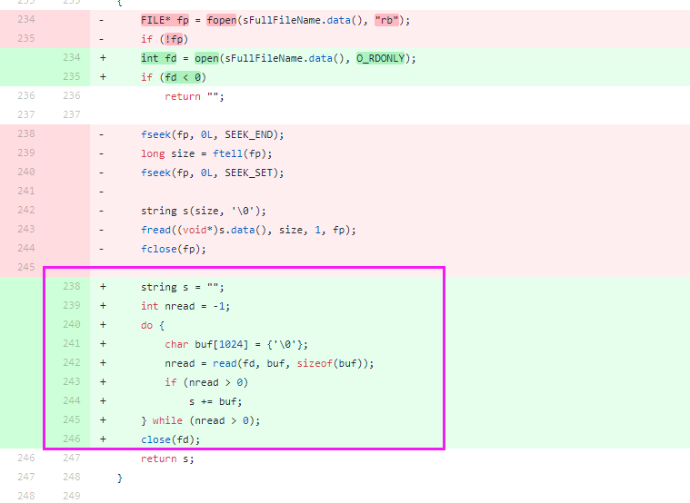
Just check below  update

TarsCloud/TarsCpp@0ba2cec


该issue长期未更新。如果问题依旧没解决，欢迎重新打开issue。TARS社区有您更精彩。
Thanks for your supporting. The issue has not been updated for a long time. If the problem is still not resolved, welcome to reopen the issue.


## [TARS Performance testing](/TarsCloud/Tars/issues/389)


What language are you using?
c++
What operating system (Linux, Ubuntu, …) and version?
Linux
What runtime / compiler are you using (e.g. jdk version or version of gcc)
gcc
Make sure you include information that can help us debug (full error message, exception listing, stack trace, logs).


Excuse me, when using the stress test program provided by tars to test tars performance, TPS formula = transaction volume / time (seconds),

Client execution:. / tarsstressclient 1 10000 test.tarsstressserver.stressobj 1024
Results: Times: 10000
pthread id :139845161875200 | 3301
Succ 10000
Calculation: (10000x2) / 3301x0.1
(10000x2) 10000 times, 20000 times in total
3301 is the time we tested 3301 milliseconds
0.1 is our unit conversion, converting TPS unit from "times / MS" to "10000 / s".
My question is
(1) The transaction volume here refers to the transaction volume that the client transfers to the server once or the client waits for the server to the client twice. Do we need x2 for the calculation of '10000x2'?
(2) Another question is to use the client program of stress test to send a request to the server, and finally get a time (MS). This time refers to only the time that the client sends to the server or the time that the client returns to the server?


该issue长期未更新。如果问题依旧没解决，欢迎重新打开issue。TARS社区有您更精彩。
Thanks for your supporting. The issue has not been updated for a long time. If the problem is still not resolved, welcome to reopen the issue.


## [项目介绍英文描述不一致，语法错误？](/TarsCloud/Tars/issues/388)


What language are you using?
English
在项目介绍的标题是
Tars is a highly performance rpc framework based on naming service using tars protocol and provides a semi-automatic operation platform.
下面的描述是
Tars is a high-performance RPC framework based on name service and Tars protocol, also integrated administration platform, and implemented hosting-service via flexible schedule.
标题是不是有语法错误，highly performance rpc ?  是不是应该改成和下面的描述一致 Tars is a high-performance RPC framework


已修复


## [tars admin后台tarsstat报错：ERROR:192.168.0.114|insert2Db_ip:db.mysql.com|port:3306:统计入库失败，请及时处理!](/TarsCloud/Tars/issues/387)


What language are you using?
java
What operating system (Linux, Ubuntu, …) and version?
centos 7.4
What runtime / compiler are you using (e.g. jdk version or version of gcc)
jdk 1.8.0_65 X64
Make sure you include information that can help us debug (full error message, exception listing, stack trace, logs).
tarsstat日志如下：
ERROR:192.168.0.114|insert2Db_ip:db.mysql.com|port:3306:统计入库失败，请及时处理!
tarsproperty日志如下：
ERROR:192.168.0.114_stat ip:192.168.0.114 ReapSSDProcThread::run write db:ip:db.mysql.com|port:3306|timeout 3 Minute.


把db改成你自己的就行了


感谢ouYoung3的提问以及kevenfeng的跟进。
由于无法联系到提问者，Issue开启时间超过半年，该问题先行关闭。后面若是还有其他问题，请开启新的Issue提问。


## [atrs](/TarsCloud/Tars/issues/386)


What language are you using?
What operating system (Linux, Ubuntu, …) and version?
What runtime / compiler are you using (e.g. jdk version or version of gcc)
Make sure you include information that can help us debug (full error message, exception listing, stack trace, logs).


## [tarsnode 上报：ERROR|ServerObject.cpp:reportMemProperty:706|stream is empty:](/TarsCloud/Tars/issues/385)


What language are you using?
PHP
What operating system (Linux, Ubuntu, …) and version?
Linux
What runtime / compiler are you using (e.g. jdk version or version of gcc)
gcc 版本 4.8.5 20150623 (Red Hat 4.8.5-36) (GCC)
Make sure you include information that can help us debug (full error message, exception listing, stack trace, logs).
产生非常多的：ERROR|ServerObject.cpp:reportMemProperty:706|stream is empty:
log文件：tarsnode/tars.tarsnode_ReportMemThread4.log
错误信息：2019-03-01 06:10:31|4381|ERROR|ServerObject.cpp:reportMemProperty:706|stream is empty:


能查出是哪个服务上报的么


请问问题是否解决了呢

What language are you using?
PHP
What operating system (Linux, Ubuntu, …) and version?
Linux
What runtime / compiler are you using (e.g. jdk version or version of gcc)
gcc 版本 4.8.5 20150623 (Red Hat 4.8.5-36) (GCC)
Make sure you include information that can help us debug (full error message, exception listing, stack trace, logs).
产生非常多的：ERROR|ServerObject.cpp:reportMemProperty:706|stream is empty:
log文件：tarsnode/tars.tarsnode_ReportMemThread4.log
错误信息：2019-03-01 06:10:31|4381|ERROR|ServerObject.cpp:reportMemProperty:706|stream is empty:


请问问题是否有解决呢


感谢jackylee92的提问以及dpp2009, change93的跟进。
由于无法联系到提问者、无法定位到问题细节情况，该问题先行关闭。后面若是还有其他问题，请开启新的Issue提问。


## [Tars patch deploys the new version code. The version code of the deleted file is deleted after the new deployment and still exists on tarsnode](/TarsCloud/Tars/issues/384)


What language are you using?
php
What operating system (Linux, Ubuntu, …) and version?
linux
What runtime / compiler are you using (e.g. jdk version or version of gcc)
Make sure you include information that can help us debug (full error message, exception listing, stack trace, logs).
Tarspatch deploys the new version of the code, which still exists on tarsnode after the deleted file is deployed
Version 001 code contains test.php
ls
component  composer.json  composer.lock  conf  controller  index.php  servant  services.php  test.php  vendor

Remove test.php from version 002 code and deploy the code through tarspath
ll -sh
Total consumption 36K
   0 drwxr-xr-x 2 root root   27 2月  26 10:47 component
4.0K -rw-rw-rw- 1 root root  481 2月  26 10:47 composer.json
 20K -rw-rw-rw- 1 root root  18K 2月  26 10:47 composer.lock
   0 drwxr-xr-x 2 root root   24 2月  26 10:47 conf
   0 drwxr-xr-x 2 root root   32 2月  26 10:47 controller
4.0K -rw-rw-rw- 1 root root  398 2月  26 10:47 index.php
   0 drwxr-xr-x 3 root root   20 2月  21 16:27 servant
4.0K -rw-rw-rw- 1 root root  907 2月  26 10:47 services.php
4.0K -rw-rw-rw- 1 root root 1.3K 2月  21 18:24 test.php
   0 drwxr-xr-x 6 root root   78 2月  26 10:47 vendor


该issue长期未更新。如果问题依旧没解决，欢迎重新打开issue。TARS社区有您更精彩。
Thanks for your supporting. The issue has not been updated for a long time. If the problem is still not resolved, welcome to reopen the issue.


## [tars2node和nodejs版本源码对应不上](/TarsCloud/Tars/issues/383)


What language are you using?
nodejs
What operating system (Linux, Ubuntu, …) and version?
linux
What runtime / compiler are you using (e.g. jdk version or version of gcc)
nodejs v8.10.0
Make sure you include information that can help us debug (full error message, exception listing, stack trace, logs).
发现TarsNode的源码应该不是最新的，和Tars/cpp/tools/tars2node里的版本也对应不上
Tars/cpp/tools/tars2node生成的tars协议序列化对象为TarsInputStream、TarsOutputStream
Tars/nodejs/stream定义的序列化对象为InputStream、OutputStream


您可使用此项目 https://github.com/tars-node/tars2node
配合这个 Group 下的其他模块，以及 NPM 的包


## [v1.6.0使用build/install.sh安装完成，tarsnotify.tgz发布失败，pm2 log 显示doEndpoints, exception ,return: -13001](/TarsCloud/Tars/issues/382)


0|tars-node-web  | [TARS][EndpointManager doEndpoints, exception ,return: -13001 ,objname: tars.tarsAdminRegistry.AdminRegObj  ,setname:
0|tars-node-web  | [AdminService.addTask]: Error: call remote server timeout(no adapter selected)
0|tars-node-web  |     at tars.AdminRegProxy.RPCClientPrx.rpcClient.(anonymous function) [as addTaskReq] (/root/Tars/web/app/service/util/rpcClient/index.js:48:35)
0|tars-node-web  |     at 
0|tars-node-web  | [TARS][EndpointManager doEndpoints, exception ,return: -13001 ,objname: tars.tarsAdminRegistry.AdminRegObj  ,setname:
0|tars-node-web  | error: TaskService.js:31|[adminService.getTaskRsp]: Error: call remote server timeout(no adapter selected)
0|tars-node-web  |     at tars.AdminRegProxy.RPCClientPrx.rpcClient.(anonymous function) [as getTaskRsp] (/root/Tars/web/app/service/util/rpcClient/index.js:48:35)
0|tars-node-web  |     at 


is this issue solved?


问题的原因应该是 “步骤4.3. 安装web管理系统” 中，修改web下的配置文件不成功，导致tars_web无法访问tarsadminregistry，从而包上述的错误


这个问题怎么解决的，我重启服务的时候也报了类似的错误；
[TARS][EndpointManager doEndpoints, exception ,return: -13001  ,objname: tars.tarsAdminRegistry.AdminRegObj  ,setname:    TarsWeb\app\controller\task\TaskController.js:167|[TaskController.addTask]: Error: call remote server timeout(no adapter selected)
at tars.AdminRegProxy.addTaskReq (F:\tars1.42\TarsWeb\app\service\util\rpcClient\index.js:58:39)


## [Tars服务启动tarsproperty服务异常并产生很多core文件](/TarsCloud/Tars/issues/381)


What language are you using?
php
What operating system (Linux, Ubuntu, …) and version?
linux
What runtime / compiler are you using (e.g. jdk version or version of gcc)
gcc 版本 4.8.5 20150623 (Red Hat 4.8.5-36) (GCC)
Make sure you include information that can help us debug (full error message, exception listing, stack trace, logs).
tars所有服务正常启动后，两三分钟后tarsproperty 结果变为 [alarm] down,pid not exist 并且进程ID改变，服务器 /data/tars/app_log/中产生一些 core 文件


出现同样问题


[root@localhost app_log]# gdb /usr/local/app/tars/tarsnode/data/tars.tarsproperty/bin/tarsproperty core.32
core.32180  core.32452  core.32555  core.32582  
[root@localhost app_log]# gdb /usr/local/app/tars/tarsnode/data/tars.tarsproperty/bin/tarsproperty core.32
core.32180  core.32452  core.32555  core.32582  
[root@localhost app_log]# gdb /usr/local/app/tars/tarsnode/data/tars.tarsproperty/bin/tarsproperty core.32582 
GNU gdb (GDB) Red Hat Enterprise Linux 7.6.1-114.el7
Copyright (C) 2013 Free Software Foundation, Inc.
License GPLv3+: GNU GPL version 3 or later <http://gnu.org/licenses/gpl.html>
This is free software: you are free to change and redistribute it.
There is NO WARRANTY, to the extent permitted by law.  Type "show copying"
and "show warranty" for details.
This GDB was configured as "x86_64-redhat-linux-gnu".
For bug reporting instructions, please see:
<http://www.gnu.org/software/gdb/bugs/>...
Reading symbols from /usr/local/app/tars/tarsnode/data/tars.tarsproperty/bin/tarsproperty...done.
[New LWP 32595]
[New LWP 32592]
[New LWP 32587]
[New LWP 32582]
[New LWP 32585]
[New LWP 32586]
[New LWP 32600]
[New LWP 32599]
[New LWP 32589]
[New LWP 32601]
[New LWP 32593]
[New LWP 32594]
[New LWP 32591]
[New LWP 32584]
[New LWP 32598]
[New LWP 32597]
[New LWP 32583]
[New LWP 32590]
[New LWP 32596]
[New LWP 32588]
[Thread debugging using libthread_db enabled]
Using host libthread_db library "/lib64/libthread_db.so.1".
Core was generated by `/usr/local/app/tars/tarsnode/data/tars.tarsproperty/bin/tarsproperty --config=/'.
Program terminated with signal 11, Segmentation fault.
#0  tars::TC_MemChunk::allocate (this=0x1fd51a0) at /usr/local/Tars-1.6.0/framework/TarsFramework/tarscpp/util/src/tc_mem_chunk.cpp:88
88          _pHead->_firstAvailableBlock = *((size_t *)result);
Missing separate debuginfos, use: debuginfo-install glibc-2.17-260.el7_6.3.x86_64 libgcc-4.8.5-36.el7.x86_64 libstdc++-4.8.5-36.el7.x86_64 zlib-1.2.7-18.el7.x86_64
(gdb) bt
#0  tars::TC_MemChunk::allocate (this=0x1fd51a0) at /usr/local/Tars-1.6.0/framework/TarsFramework/tarscpp/util/src/tc_mem_chunk.cpp:88
#1  0x00000000005338e1 in allocate2 (iIndex=<synthetic pointer>, this=<optimized out>) at /usr/local/Tars-1.6.0/framework/TarsFramework/tarscpp/util/src/tc_mem_chunk.cpp:99
#2  allocate2 (iIndex=<synthetic pointer>, this=<optimized out>) at /usr/local/Tars-1.6.0/framework/TarsFramework/tarscpp/util/src/tc_mem_chunk.cpp:246
#3  tars::TC_MemMultiChunkAllocator::allocate2 (this=0x1fd43f0, iNeedSize=162, iAllocSize=@0x7fb2c4ff7418: 162, iIndex=@0x7fb2c4ff7388: 0)
    at /usr/local/Tars-1.6.0/framework/TarsFramework/tarscpp/util/src/tc_mem_chunk.cpp:554
#4  0x000000000053397e in tars::TC_MemMultiChunkAllocator::allocate (this=<optimized out>, iNeedSize=<optimized out>, iAllocSize=@0x7fb2c4ff7418: 162)
    at /usr/local/Tars-1.6.0/framework/TarsFramework/tarscpp/util/src/tc_mem_chunk.cpp:540
#5  0x000000000052a6c2 in tars::TC_HashMap::BlockAllocator::allocateMemBlock (this=0x1fd43d0, index=index@entry=324881, iAllocSize=@0x7fb2c4ff7418: 162, 
    vtData=std::vector of length 0, capacity 0) at /usr/local/Tars-1.6.0/framework/TarsFramework/tarscpp/util/src/tc_hashmap.cpp:857
#6  0x000000000052b2b3 in tars::TC_HashMap::set (this=this@entry=0x1fd4a70, k="\006\022tars.tarsquerystat\026\f192.168.8.21&/tars.tarsquerystat.NoTarsObjAdapter.connectRate", 
    v="\t\f", bDirty=bDirty@entry=true, vtData=std::vector of length 0, capacity 0) at /usr/local/Tars-1.6.0/framework/TarsFramework/tarscpp/util/src/tc_hashmap.cpp:1885
#7  0x0000000000484161 in PropertyHashMap::add (this=this@entry=0x1fd4a18, head=..., body=...)
    at /usr/local/Tars-1.6.0/framework/TarsFramework/PropertyServer/PropertyHashMap.h:63
Python Exception <type 'exceptions.ValueError'> Cannot find type const std::map<tars::StatPropMsgHead, tars::StatPropMsgBody, std::less<tars::StatPropMsgHead>, std::allocator<std::pair<tars::StatPropMsgHead const, tars::StatPropMsgBody> > >::_Rep_type: 
#8  0x000000000047a5a7 in PropertyImp::handlePropMsg (this=this@entry=0x7fb2440008c0, propMsg=std::map with 5 elements, current=...)
    at /usr/local/Tars-1.6.0/framework/TarsFramework/PropertyServer/PropertyImp.cpp:147
Python Exception <type 'exceptions.ValueError'> Cannot find type const std::map<tars::StatPropMsgHead, tars::StatPropMsgBody, std::less<tars::StatPropMsgHead>, std::allocator<std::pair<tars::StatPropMsgHead const, tars::StatPropMsgBody> > >::_Rep_type: 
#9  0x000000000047aa10 in PropertyImp::reportPropMsg (this=0x7fb2440008c0, propMsg=std::map with 5 elements, current=...)
    at /usr/local/Tars-1.6.0/framework/TarsFramework/PropertyServer/PropertyImp.cpp:82
#10 0x0000000000482be0 in tars::PropertyF::onDispatch (this=0x7fb2440008c0, _current=..., _sResponseBuffer=std::vector of length 0, capacity 0)
    at /usr/local/Tars-1.6.0/framework/TarsFramework/tarscpp/servant/servant/PropertyF.h:620
#11 0x00000000004b6d56 in tars::Servant::dispatch (this=0x7fb2440008c0, current=..., buffer=std::vector of length 0, capacity 0)
    at /usr/local/Tars-1.6.0/framework/TarsFramework/tarscpp/servant/libservant/Servant.cpp:79
#12 0x00000000004bc905 in tars::ServantHandle::handleTarsProtocol (this=0x1fd5cd0, current=...)
    at /usr/local/Tars-1.6.0/framework/TarsFramework/tarscpp/servant/libservant/ServantHandle.cpp:834
#13 0x00000000004bd575 in tars::ServantHandle::handle (this=0x1fd5cd0, stRecvData=...)
    at /usr/local/Tars-1.6.0/framework/TarsFramework/tarscpp/servant/libservant/ServantHandle.cpp:610
#14 0x000000000051ce23 in tars::TC_EpollServer::Handle::handleImp (this=0x1fd5cd0) at /usr/local/Tars-1.6.0/framework/TarsFramework/tarscpp/util/src/tc_epoll_server.cpp:216
#15 0x00000000004b7e49 in tars::ServantHandle::run (this=0x1fd5cd0) at /usr/local/Tars-1.6.0/framework/TarsFramework/tarscpp/servant/libservant/ServantHandle.cpp:71
#16 0x000000000053f70a in tars::TC_Thread::threadEntry (pThread=0x1fd5cd0) at /usr/local/Tars-1.6.0/framework/TarsFramework/tarscpp/util/src/tc_thread.cpp:93
#17 0x00007fb2d03d5dd5 in start_thread () from /lib64/libpthread.so.0
#18 0x00007fb2cf2bdead in clone () from /lib64/libc.so.6
(gdb) 
#0  tars::TC_MemChunk::allocate (this=0x1fd51a0) at /usr/local/Tars-1.6.0/framework/TarsFramework/tarscpp/util/src/tc_mem_chunk.cpp:88
#1  0x00000000005338e1 in allocate2 (iIndex=<synthetic pointer>, this=<optimized out>) at /usr/local/Tars-1.6.0/framework/TarsFramework/tarscpp/util/src/tc_mem_chunk.cpp:99
#2  allocate2 (iIndex=<synthetic pointer>, this=<optimized out>) at /usr/local/Tars-1.6.0/framework/TarsFramework/tarscpp/util/src/tc_mem_chunk.cpp:246
#3  tars::TC_MemMultiChunkAllocator::allocate2 (this=0x1fd43f0, iNeedSize=162, iAllocSize=@0x7fb2c4ff7418: 162, iIndex=@0x7fb2c4ff7388: 0)
    at /usr/local/Tars-1.6.0/framework/TarsFramework/tarscpp/util/src/tc_mem_chunk.cpp:554
#4  0x000000000053397e in tars::TC_MemMultiChunkAllocator::allocate (this=<optimized out>, iNeedSize=<optimized out>, iAllocSize=@0x7fb2c4ff7418: 162)
    at /usr/local/Tars-1.6.0/framework/TarsFramework/tarscpp/util/src/tc_mem_chunk.cpp:540
#5  0x000000000052a6c2 in tars::TC_HashMap::BlockAllocator::allocateMemBlock (this=0x1fd43d0, index=index@entry=324881, iAllocSize=@0x7fb2c4ff7418: 162, 
    vtData=std::vector of length 0, capacity 0) at /usr/local/Tars-1.6.0/framework/TarsFramework/tarscpp/util/src/tc_hashmap.cpp:857
#6  0x000000000052b2b3 in tars::TC_HashMap::set (this=this@entry=0x1fd4a70, k="\006\022tars.tarsquerystat\026\f192.168.8.21&/tars.tarsquerystat.NoTarsObjAdapter.connectRate", 
    v="\t\f", bDirty=bDirty@entry=true, vtData=std::vector of length 0, capacity 0) at /usr/local/Tars-1.6.0/framework/TarsFramework/tarscpp/util/src/tc_hashmap.cpp:1885
#7  0x0000000000484161 in PropertyHashMap::add (this=this@entry=0x1fd4a18, head=..., body=...)
    at /usr/local/Tars-1.6.0/framework/TarsFramework/PropertyServer/PropertyHashMap.h:63
Python Exception <type 'exceptions.ValueError'> Cannot find type const std::map<tars::StatPropMsgHead, tars::StatPropMsgBody, std::less<tars::StatPropMsgHead>, std::allocator<std::pair<tars::StatPropMsgHead const, tars::StatPropMsgBody> > >::_Rep_type: 
#8  0x000000000047a5a7 in PropertyImp::handlePropMsg (this=this@entry=0x7fb2440008c0, propMsg=std::map with 5 elements, current=...)
    at /usr/local/Tars-1.6.0/framework/TarsFramework/PropertyServer/PropertyImp.cpp:147
Python Exception <type 'exceptions.ValueError'> Cannot find type const std::map<tars::StatPropMsgHead, tars::StatPropMsgBody, std::less<tars::StatPropMsgHead>, std::allocator<std::pair<tars::StatPropMsgHead const, tars::StatPropMsgBody> > >::_Rep_type: 
#9  0x000000000047aa10 in PropertyImp::reportPropMsg (this=0x7fb2440008c0, propMsg=std::map with 5 elements, current=...)
    at /usr/local/Tars-1.6.0/framework/TarsFramework/PropertyServer/PropertyImp.cpp:82
#10 0x0000000000482be0 in tars::PropertyF::onDispatch (this=0x7fb2440008c0, _current=..., _sResponseBuffer=std::vector of length 0, capacity 0)
    at /usr/local/Tars-1.6.0/framework/TarsFramework/tarscpp/servant/servant/PropertyF.h:620
#11 0x00000000004b6d56 in tars::Servant::dispatch (this=0x7fb2440008c0, current=..., buffer=std::vector of length 0, capacity 0)
    at /usr/local/Tars-1.6.0/framework/TarsFramework/tarscpp/servant/libservant/Servant.cpp:79
#12 0x00000000004bc905 in tars::ServantHandle::handleTarsProtocol (this=0x1fd5cd0, current=...)
    at /usr/local/Tars-1.6.0/framework/TarsFramework/tarscpp/servant/libservant/ServantHandle.cpp:834
#13 0x00000000004bd575 in tars::ServantHandle::handle (this=0x1fd5cd0, stRecvData=...)
    at /usr/local/Tars-1.6.0/framework/TarsFramework/tarscpp/servant/libservant/ServantHandle.cpp:610
#14 0x000000000051ce23 in tars::TC_EpollServer::Handle::handleImp (this=0x1fd5cd0) at /usr/local/Tars-1.6.0/framework/TarsFramework/tarscpp/util/src/tc_epoll_server.cpp:216
#15 0x00000000004b7e49 in tars::ServantHandle::run (this=0x1fd5cd0) at /usr/local/Tars-1.6.0/framework/TarsFramework/tarscpp/servant/libservant/ServantHandle.cpp:71
#16 0x000000000053f70a in tars::TC_Thread::threadEntry (pThread=0x1fd5cd0) at /usr/local/Tars-1.6.0/framework/TarsFramework/tarscpp/util/src/tc_thread.cpp:93
#17 0x00007fb2d03d5dd5 in start_thread () from /lib64/libpthread.so.0
#18 0x00007fb2cf2bdead in clone () from /lib64/libc.so.6
(gdb) f 0
#0  tars::TC_MemChunk::allocate (this=0x1fd51a0) at /usr/local/Tars-1.6.0/framework/TarsFramework/tarscpp/util/src/tc_mem_chunk.cpp:88
88          _pHead->_firstAvailableBlock = *((size_t *)result);
(gdb) f 1
#1  0x00000000005338e1 in allocate2 (iIndex=<synthetic pointer>, this=<optimized out>) at /usr/local/Tars-1.6.0/framework/TarsFramework/tarscpp/util/src/tc_mem_chunk.cpp:99
99          void *pAddr = allocate();
(gdb) 


What language are you using?
php
What operating system (Linux, Ubuntu, …) and version?
linux
What runtime / compiler are you using (e.g. jdk version or version of gcc)
gcc 版本 4.8.5 20150623 (Red Hat 4.8.5-36) (GCC)
Make sure you include information that can help us debug (full error message, exception listing, stack trace, logs).
tars所有服务正常启动后，两三分钟后tarsproperty 结果变为 [alarm] down,pid not exist 并且进程ID改变，服务器 /data/tars/app_log/中产生一些 core 文件


出现同样问题


同样问题，求解答


@jackylee92 你的php版本是多少？


@lvxiaoqi 7.2.8


麻烦将 tars-server composer包升级至v0.2.5 试试


@copyrenzhe 我已经升级了！我这边观察下，有线索我再同步给您，谢谢帮助！


## [服务器产生许多core文件 ，占用磁盘很多空间](/TarsCloud/Tars/issues/379)


麻烦帮助查看 谢谢！


## [请问如何测试TARS的性能，具体的过程是什么？？](/TarsCloud/Tars/issues/378)


What language are you using?
C++
What operating system (Linux, Ubuntu, …) and version?
Linux
What runtime / compiler are you using (e.g. jdk version or version of gcc)
gcc
Make sure you include information that can help us debug (full error message, exception listing, stack trace, logs).


https://github.com/TarsCloud/TarsGo/blob/master/docs/tars_go_performance.md


谢谢，我看TARS官网里面大概和你描述的差不多。现在有一个问题就是，我们需要知道下面链接里的这些TARS性能数据是怎么测试出来的，用了哪些测试工具，我们能不能自己也把这些数据测试出来，所以特别想请教大神帮帮忙，不胜感激~
https://github.com/TarsCloud/Tars/blob/master/docs/tars_performce.md
@gzg1984


服务端是基于tars写的echo回消息的简单服务，客户端是调用这个tars -echo 服务的简单客户端。这两个程序可以自己写的。


可以参考这个测试用例https://github.com/TarsCloud/TarsCpp/tree/master/examples/StressDemo


## [执行npm run prd后，3000端口启动不起来](/TarsCloud/Tars/issues/377)


What language are you using?
Chinese
What operating system (Linux, Ubuntu, …) and version?
Linux version 3.10.0-229.el7.x86_64
What runtime / compiler are you using (e.g. jdk version or version of gcc)
gcc 版本 4.8.2 (GCC)
Make sure you include information that can help us debug (full error message, exception listing, stack trace, logs).
所有的都安装完成后，执行npm run prd命令，3000端口不能启动，访问不到web管理平台，以tarsregistry日志为例（|ERROR|[TARS][CommunicatorEpoll::handleInputImp] connect error tcp -h 192.168.3.27 -p 19386,tars.tarsnode.ServerObj,_connExcCnt=1,Connection refused），谢谢解答
本人邮箱m18059234007@163.com


可能端口被占用，换个端口试下。
也可能是没有安装好，到web根目录下执行npm install试下


可能端口被占用，换个端口试下。
也可能是没有安装好，到web根目录下执行npm install试下

谢谢，已解决


## [How to understand the expansion of tarsnode](/TarsCloud/Tars/issues/376)


If the service needs to be expanded, does the precondition for each machine to be expanded include that the basic and core services (including the web management system) of the tars and the tarsnode must be expanded first?


Is there any concept of master node and child node in this tar? According to https://github.com/tarscloud/tars/blob/master/install.zh.md, how can the master node identify this expansion node when modifying the IP address of the expansion machine on the machine to be expanded?


https://github.com/TarsCloud/Tars/blob/master/Install.zh.md，It is just to modify a capacity expansion node. If I have a lot of 1000 machines, how to expand them


Operation and maintenance has the tools of mass deployment, just like mass installation of other software


There is only one set of framework and web. Considering the single point of risk, it is enough to deploy to two sets at most. Capacity expansion is a business service for capacity expansion. You only need to install tarsnode. Framework and web will communicate with tarsnode on each business server to report status, publish, restart and so on.


"There is only one set of framework and web. Considering the single point of risk, it's enough to deploy to two sets at most" - how to deploy to two sets? In the installation process, you need to specify the master address, but if there are two, there must be two master addresses. How to configure this?


According to the architecture communication diagram, the expansion is mainly aimed at application nodes. It contains a node and multiple server services. Is that so?
I want to ask how to install the tarsnode node separately? Can you provide the next tutorial? And tarsnode configuration to connect to the registry service.


The tutorial of installing the tarsnode node separately for capacity expansion is already in [install. MD × 4.2.2]
(https://github.com/TarsCloud/Tars/blob/master/Install.zh.md#422-%E6%9C%8D%E5%8A%A1%E6%89%A9%E5%AE%B9%E5%89%8D%E5%AE%89%E8%A3%85tarsnode)


## [现在想改造成微服务，选型了Tars，想问问 Tars在 服务和服务之间的 API调用鉴权 是什么样子的，还有 在服务网关这块 是什么样子的，有什么最近实践 ？](/TarsCloud/Tars/issues/375)


What language are you using?
What operating system (Linux, Ubuntu, …) and version?
What runtime / compiler are you using (e.g. jdk version or version of gcc)
Make sure you include information that can help us debug (full error message, exception listing, stack trace, logs).


api鉴权方面现在还在完善中，后续会更新，暂时还不能用；网关这块还没有；


## [如何把DPDK集成到TARS??](/TarsCloud/Tars/issues/374)


What language are you using?
C++
What operating system (Linux, Ubuntu, …) and version?
Linux
What runtime / compiler are you using (e.g. jdk version or version of gcc)
GCC
Make sure you include information that can help us debug (full error message, exception listing, stack trace, logs).


dpdk+tars有两个解决方案思路：
1：用现成的协议栈，比如mtcp，利用mtcp里的mtcp_epoll的函数替换tars中的epoll函数，让dpdk+mtcp跑在tars下层。 这个做法对tars框架改动不大，但是也用不上dpdk的很多高级功能。
2：将tars底层的netthread体系换成dpdk的rx_burst体系，直接轮询收包，run-to-complete处理。这种方案对tars框架改动比较大，但是理论上可以最大化地降低响应延迟。
以上就是把DPDK集成到tars里的方法了，如果有其他问题，欢迎回复在下面，谢谢！


dpdk+tars有两个解决方案思路：
1：用现成的协议栈，比如mtcp，利用mtcp里的mtcp_epoll的函数替换tars中的epoll函数，让dpdk+mtcp跑在tars下层。 这个做法对tars框架改动不大，但是也用不上dpdk的很多高级功能。
2：将tars底层的netthread体系换成dpdk的rx_burst体系，直接轮询收包，run-to-complete处理。这种方案对tars框架改动比较大，但是理论上可以最大化地降低响应延迟。
以上就是把DPDK集成到tars里的方法了，如果有其他问题，欢迎回复在下面，谢谢！

好的 非常感谢~


@gzg1984
大神，请问你们有没有做过dpdk+tars的项目，如果有的话是基于什么需求的？谢谢~


@gzg1984
我们的需求是要用dpdk在tars前面做过滤分流分发，有没有必要深入改造协议栈呢？


@gzg1984
大神，请问你们有没有做过dpdk+tars的项目，如果有的话是基于什么需求的？谢谢~

有做过dpdk+tars降低响应延迟的研发。

@gzg1984
我们的需求是要用dpdk在tars前面做过滤分流分发，有没有必要深入改造协议栈呢？

在不清楚你的具体应用场景和开发目标的时候，只能笼统地说“改造和不改造协议栈都有可以达到过滤分流的目的，一般而言改造协议栈进行分流的响应延迟和处理时间会大大降低。”


## [Have you seen pb2tarscpp or pb2tarshp? Do you have a PHP version](/TarsCloud/Tars/issues/373)


Have you seen pb2tarscpp or pb2tarshp? Do you have a PHP version


This one doesn't seem to be supported


Is there any plan to support


该issue长期未更新。如果问题依旧没解决，欢迎重新打开issue。TARS社区有您更精彩。
Thanks for your supporting. The issue has not been updated for a long time. If the problem is still not resolved, welcome to reopen the issue.


## [tars support for arm platform? ](/TarsCloud/Tars/issues/372)


What language are you using?
c++
What operating system (Linux, Ubuntu, …) and version?
linux os on aarch64 cpu
What runtime / compiler are you using (e.g. jdk version or version of gcc)
gcc version 4.8.5 20150623 (Red Hat 4.8.5-16)
Make sure you include information that can help us debug (full error message, exception listing, stack trace, logs).
Problem description
We can't compile success in arm arch linux system as following steps:
cd tars/cpp/build & sh build.sh all
we got the errors :

-- The C compiler identification is GNU 4.8.5
-- The CXX compiler identification is GNU 4.8.5
-- Check for working C compiler: /usr/bin/cc
-- Check for working C compiler: /usr/bin/cc -- works
-- Detecting C compiler ABI info
-- Detecting C compiler ABI info - done
-- Check for working CXX compiler: /usr/bin/c++
-- Check for working CXX compiler: /usr/bin/c++ -- works
-- Detecting CXX compiler ABI info
-- Detecting CXX compiler ABI info - done
-- The ASM compiler identification is GNU
-- Found assembler: /usr/bin/cc
-- Configuring done
-- Generating done
-- Build files have been written to: /data1/bauerzhou/tars/cpp/build
Scanning dependencies of target tarsutil
[  1%] Building CXX object util/src/CMakeFiles/tarsutil.dir/tc_gzip.cpp.o
[  1%] Building CXX object util/src/CMakeFiles/tarsutil.dir/tc_openssl.cpp.o
[  2%] Building CXX object util/src/CMakeFiles/tarsutil.dir/tc_buffer.cpp.o
[  2%] Building CXX object util/src/CMakeFiles/tarsutil.dir/tc_timeprovider.cpp.o
In file included from /data1/bauerzhou/tars/cpp/util/include/util/tc_autoptr.h:20:0,
from /data1/bauerzhou/tars/cpp/util/include/util/tc_timeprovider.h:24,
from /data1/bauerzhou/tars/cpp/util/src/tc_timeprovider.cpp:17:
/data1/bauerzhou/tars/cpp/util/include/util/tc_atomic.h: In destructor ‘tars::TC_AutoPtr::~TC_AutoPtr() [with T = tars::TC_TimeProvider]’:
/data1/bauerzhou/tars/cpp/util/include/util/tc_atomic.h:158:46: error: impossible constraint in ‘asm’
:"m" (_value.counter) : "memory");

And we found the architecture related code for asm include:

/tars/cpp/util/src/tc_jump_x86_64_sysv_elf_gas.s
/tars/cpp/util/src/tc_make_x86_64_sysv_elf_gas.s
/tars/cpp/util/include/util/tc_fcontext.h

but not arm asm codes
**Does tars will support for arm arch platform ? **


Not yet, but will be available soon.


It is available!


## [tarsregistry等框架服务coredump求助?](/TarsCloud/Tars/issues/371)


可能是什么原因？如何在编译框架服务时打开debug信息？


我自己的问题。sed时弄坏了bin文件。


## [当accept 返回-1 时，且errno != EAGAIN 的时候 死循环调用accept](/TarsCloud/Tars/issues/370)


What language are you using?
c++
What operating system (Linux, Ubuntu, …) and version?
centos
What runtime / compiler are you using (e.g. jdk version or version of gcc)
gcc
Make sure you include information that can help us debug (full error message, exception listing, stack trace, logs).

当进程可打开的文件句柄达到限制之后，此时如果再再有请求连接服务端口，服务将会一直死循环调用accept接口

  // tc_epoll_server.cpp:
void TC_EpollServer::NetThread::run()
{
....
     do
     {
                                    ret = accept(ev.data.u32, it->second->_ep.isIPv6() ? AF_INET6 : AF_INET);
     }while(ret);
 .....
}
int C_EpollServer::NetThread::accept(int fd, int domain){
....
         //直到发生EAGAIN才不继续accept
        if(errno == EAGAIN)
        {
            return false;
        }
....
}


是的，按照这种分析是有这个问题。accept返回-1，错误码非EAGAIN的有很多情况，例如已经close的fd，accept返回EBADF，参数错误返回EINVAL，文件描述符超过设置最大值返回ENFILE，内存不足返回ENOMEM，内核态到用户态拷贝失败返回EFAULT等等，其中前2个框架做了保障，后面的不做处理，另外被信号打断返回EINTR会再次进入accept
你是遇着errno是什么呢？可以提出来分析一下吗


这个错误码，EMFILE，too many open file


这个设计逻辑的前提是：你其他打开的文件句柄都会在近期关闭，所以我只要多试几次就应该能遇到有空闲句柄的情况。
处理方法之一： 看看为什么其他的文件句柄都没有关闭
处理方法之二：看看自己的ulimit，然后尝试改大一点
ulimit -a|grep open
open files                      (-n) 2000000


## [请问什么出完整python客户端版本？](/TarsCloud/Tars/issues/368)


请问什么出完整python客户端版本？
团队有不少python工程师，不然很难在公司中推广。


暂时还没有排期，等后期安排


## [接口调试报内部系统错误](/TarsCloud/Tars/issues/367)


pm2的错误日志
[root@bogon HelloServer]# pm2 logs --err
0|tars-nod | error: 192.168.33.1||InfTestController.js:36|[interfaceDebug]: TypeError: Cannot read property 'hasOwnProperty' of undefined
0|tars-nod |     at ObjectProxy.initialize (/root/Tars/web/node_modules/@tars/rpc/core/client/ObjectProxy.js:56:16)
0|tars-nod |     at Communicator._createObjectProxy (/root/Tars/web/node_modules/@tars/rpc/core/client/Communicator.js:143:12)
0|tars-nod |     at new TarsClient (/root/Tars/web/app/service/infTest/TarsClient.js:33:25)
0|tars-nod |     at Object.InfTestService.debug (/root/Tars/web/app/service/infTest/InfTestService.js:29:18)
0|tars-nod |     at 
tars文件内容
[root@bogon HelloServer]# cat HelloServant.tars
module TEST
{
struct SayHelloReq
{
0 require string sMsg;
};
struct SayHelloRsp
{
0 require string sRes;
};
interface HelloServant
{
int test();
int sayHello(SayHelloReq tReq, out SayHelloRsp tRsp);
};
};


是不是你的sayHello方法没有返回任何东西，或者你的服务没有跑起来


不会，用自己写的客户端访问是没问题的
[root@bogon Client]# ./HelloClient world
2018-12-26 15:17:04|CommunicatorEpoll::run id:8898
iRet: 0
Rsp: Hello, world


打开F12查看一下接口返回了什么


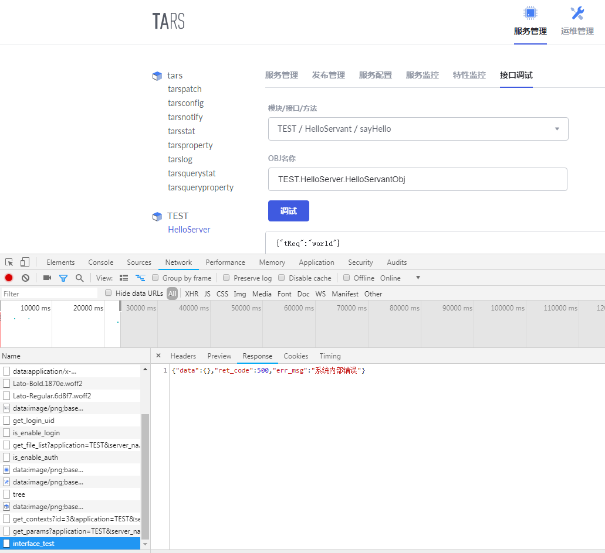

这个吗？


相同的问题 现在还是没修好


在app/service/infTest/TarsClient.js中加一个空对象可以跳过这个：
this._worker = Tars._createObjectProxy(objName, setName ? setName : '',{});


解决办法
1、修改ObjectProxy.js文件，
我的机器上该文件路径为：/usr/local/src/TarsWeb/node_modules/@tars/rpc/core/client/ObjectProxy.js
找到第55行代码：ObjectProxy.prototype.initialize = function ($ObjName, $SetName, options) {
在下面添加一句：options = options || {};
保存退出
2、确认你的".tars"文件里面的“}”后面添加了分号“;”
3、重启tars-node-web：pm2 restart tars-node-web
仍然不行的使用：pm2 logs --err 查看你的错误原因吧，这种情况我没碰过


## [请问框架代码更新升级需要做哪些操作？](/TarsCloud/Tars/issues/366)


What language are you using?
C++、GO
What operating system (Linux, Ubuntu, …) and version?
Linux
What runtime / compiler are you using (e.g. jdk version or version of gcc)
gcc 7.3
如果要更新使用最新的框架代码，是否要把安装过程重新走一遍？有没有其他简单操作办法？


你想要更新框架哪些部分呢？如果是新增服务想用最新框架的特性，更新编译环境就可以了，基础服务目前没有更改，所以环境不需要重新搭建的


如果基础服务有更新，是不是需要重新编译源码，并重新部署基础服务的tgz包就可以了？


是的


## [tars-spring-cloud-client 启动报错](/TarsCloud/Tars/issues/365)


application.yml配置：
eureka:
client:
serviceUrl:
defaultZone: http://localhost:8761/eureka/
register-with-eureka: false
tars:
client:
async-invoke-timeout: 10000
locator: http://localhost:8761/eureka/
报错：
Description:
Field clientProperties in com.qq.tars.register.eureka.EurekaRegisterHandler required a bean of type 'com.qq.tars.spring.config.TarsClientProperties' that could not be found.
Action:
Consider defining a bean of type 'com.qq.tars.spring.config.TarsClientProperties' in your configuration.


同遇到这个问题.
根据#313 中的回答,自定义一个排除了@TarsStartLifecycle的接口@EnableTarsClientConfiguration,这样启动才不会报错,你可以试试


解决了吗？我也遇到这个问题


## [鉴权功能无效。](/TarsCloud/Tars/issues/364)


鉴权功能无效问题。
问题描述：用c++写的tars服务，配置了鉴权。服务重启后，自己写的客户端测试程序在没有配置用户名和密码的情况下仍然可以调用tars服务的接口。


鉴权功能目前还没有完善！！


嗯，看了源码，authServer服务部署上去了，也自己配了tarsauth模板，可是其他服务启动的时候似乎并没有解析endpoint的-e选项判断是否调用authServer的applyToken接口，而communicator连接器也没有涉及到调用authProcess接口的代码。所以我怀疑鉴权接口有名无实。


## [ 错误: ids不能为空](/TarsCloud/Tars/issues/362)


What language are you using?
What operating system (Linux, Ubuntu, …) and version?
What runtime / compiler are you using (e.g. jdk version or version of gcc)
Make sure you include information that can help us debug (full error message, exception listing, stack trace, logs).


## [TarsJava tars-spring-cloud-client startup error ](/TarsCloud/Tars/issues/361)


Application.yml is configured as follows:
Eureka:
Client:
ServiceUrl:
#Address of service registry
defaultZone: http://localhost:8761/eureka/
#Clients do not need to register with the spring cloud master
register-with-eureka: false
Report errors:
Description:
Disconnected from the target VM, address: '127.0.0.1:56002', transport: 'socket'
Field clientProperties in com.qq.tars.register.eureka.EurekaRegisterHandler required a bean of type 'com.qq.tars.spring.config.TarsClientProperties' that could not be found.
Action:
Consider defining a bean of type 'com.qq.tars.spring.config.TarsClientProperties' in your configuration.


该issue长期未更新。如果问题依旧没解决，欢迎重新打开issue。TARS社区有您更精彩。
Thanks for your supporting. The issue has not been updated for a long time. If the problem is still not resolved, welcome to reopen the issue.


## [日志级别](/TarsCloud/Tars/issues/360)


生产上debug级别日志也在打印
在服务管理table-更多命令-修改日志级别为info,不管用


检查下前台发出的OSS请求参数是否是：command: tars.setloglevel INFO？


检查下前台发出的OSS请求参数是否是：command: tars.setloglevel INFO？

有的！但是没有起作用


tars日志等级是INFO日志是最低级别的，所以开了INFO，那还是会打印DEBUG日志的


tars日志等级是INFO日志是最低级别的，所以开了INFO，那还是会打印DEBUG日志的

我已经在项目里面做了日志级别


## [新版管理台push配置报错：ids不能为空](/TarsCloud/Tars/issues/358)


What language are you using?
c++
What operating system (Linux, Ubuntu, …) and version?
centos
问题描述：
服务配置-push配置文件提示：{"data":{},"ret_code":500,"err_msg":"ids不能为空"}
调试抓取发现请求的链接为：http://127.0.0.1:3000/pages/server/api/push_config_file?config_ids=4&ids=4，确实缺少ids参数


请下载最新的tarsWeb代码，重新安装


## [rsync 在tars中的作用是什么](/TarsCloud/Tars/issues/357)


What language are you using?
c++
What operating system (Linux, Ubuntu, …) and version?
centos
What runtime / compiler are you using (e.g. jdk version or version of gcc)
gcc
Make sure you include information that can help us debug (full error message, exception listing, stack trace, logs).
问题（功能能咨询）：
tars 中发布版本时下载的包是tarsnode通过tarspatch下载，为什么需要启动rsync 服务？
什么场景下需要使用rsync？


多节点部署tarspatch时会用到


部署2个节点tarspatch，web和其中一个tarspatch相同机器，发布时，其中一个tarspatch可以拉取发布包，另外一个没有部署web的拉取不到发布包(因为发布包没有上传到这台机器上)，这个时候就需要用到rsync同步了。当然建议多节点部署tarspatch时，上传发布包路径使用网络文件系统，例如ceph、nfs等


@yuansx 建议将这些加到readme中


了解了


## [安装文档好复杂啊 有没有一键部署方案啊](/TarsCloud/Tars/issues/356)


No description provided.


Tars/build/install.sh 基本上就可以满足，根据自己的环境稍微调整下


https://github.com/TarsCloud/Tars/blob/master/Install.zh.md
可以参考安装文档最后一部分的一键化安装说明


## [Typo in introduction should be fixed](/TarsCloud/Tars/issues/353)


What language are you using?
markdown
What operating system (Linux, Ubuntu, …) and version?
macOS
What runtime / compiler are you using (e.g. jdk version or version of gcc)
None.
Make sure you include information that can help us debug (full error message, exception listing, stack trace, logs).
The servant is wrongly typed as "servent". A pull request is proposed.
"维度" instead of "纬度".


## [接口调试: 上传tars文件 显示 " 错误: 系统内部错误 "](/TarsCloud/Tars/issues/352)


接口调试: 上传tars文件 显示 " 错误: 系统内部错误 " #
pm2 logs --err日志:
0|tars-node-web  | error: 192.168.195.1||InfTestController.js:69|[uploadTarsFile]: Error: Cannot find type["String"] 0|tars-node-web  |     at TarsParser.getType (/home/py/tarspackage/Tars/web/app/service/infTest/TarsParser/TarsParser.js:345:27) 0|tars-node-web  |     at TarsParser.parseFun (/home/py/tarspackage/Tars/web/app/service/infTest/TarsParser/TarsParser.js:226:34) 0|tars-node-web  |     at TarsParser.parseInterface (/home/py/tarspackage/Tars/web/app/service/infTest/TarsParser/TarsParser.js:109:18) 0|tars-node-web  |     at TarsParser.parseModule (/home/py/tarspackage/Tars/web/app/service/infTest/TarsParser/TarsParser.js:60:26) 0|tars-node-web  |     at TarsParser.parseFile (/home/py/tarspackage/Tars/web/app/service/infTest/TarsParser/TarsParser.js:30:22) 0|tars-node-web  |     at getContext (/home/py/tarspackage/Tars/web/app/service/infTest/InfTestService.js:53:12) 0|tars-node-web  |     at <anonymous>   
报错截图:


1 : .tars 文件, 里面的数据类型要严格区分大小写, 要符合Tars的数据类型的结构, 不然就报上面的错.
2 : 接口调试无发返回调试数据, web 的 TarsClient.js 代码存在bug, 进入 git 下来的Tars目录下执行下列命令, sed -i "s/setName ? setName : '')/setName ? setName : '', {})/g" web/app/service/infTest/TarsClient.js
3 : 如果执行无效, 手动 vim /home/py/tarspackage/Tars/web/app/service/infTest/TarsClient.js
(注 : 具体目录请根据个人安装路径 )


感谢，

这里是会在上传后进行tars文件语法检查。检查不通过就会报错
应该不算bug吧，options可以不传的


## [Tars 热更新是否支持](/TarsCloud/Tars/issues/351)


What language are you using?
What operating system (Linux, Ubuntu, …) and version?
What runtime / compiler are you using (e.g. jdk version or version of gcc)
Make sure you include information that can help us debug (full error message, exception listing, stack trace, logs).


或者是灰度 发布 这种功能是否支持？


内部做了无损发布的逻辑，发布更新过程，通过屏蔽更新节点流量，做到业务流量不中断无感知，暂时还没开源出去。
灰度发布，你可以参考使用设置set功能来做到


## [Feature request: Tars 更换后端数据库为postgresql或者postgres-xl集群](/TarsCloud/Tars/issues/350)


如题，我会先尝试一下，后续有问题持续反馈。


## [TarsCpp目录下jmem中的rbtree hasmap的应用场景是什么？](/TarsCloud/Tars/issues/349)


搜了很久没有找到对这些代码的引用，请问这些内存容易的使用场景是什么？


这只是个基础库，目前tars框架内部没有使用，具体使用场景百度一下就知道了


## [求tars网络协议文档](/TarsCloud/Tars/issues/348)


tars抓包怎么看？协议文档有吗


默认编解码是二进制的，抓包不好看，你可以自定义编解码为json或者xml等格式，抓包就容易看了


## [请问tars公有云为什么用不了?](/TarsCloud/Tars/issues/347)


请问tars公有云为什么用不了? 想用公有云方便先测试


可以使用的，https://tars.tencent.com登录后查看帮助文档


注册完成后系统提示维护升级中...


目前越来越多的用户使用公有云进行测试了，所以需要重整一下，以便更好的对外提供服务。具体恢复时间请添加TARS01微信号咨询


## [接口调试 提示内部系统错误](/TarsCloud/Tars/issues/346)


部署应用之后接口调试提示错误
使用的应用框架为go
示例的HelloGo


请描述具体报错


进入接口调试 点击调试提示内部系统错误


其他语言是否有相同问题？


其他语言目前没有试过，主要是其他语言也不熟悉⁄(⁄ ⁄ ⁄ω⁄ ⁄ ⁄)⁄，请查看下。


先上机器查看一下具体报错信息。pm2 logs --err
一般来讲，最可能出现的错误是远程调用失败。请确认你的服务是不是能正确返回


## [与非Tars框架之间的RPC通信？](/TarsCloud/Tars/issues/345)


我们主要使用C++，Java。问一下，Tars框架与其他非Tars框架之间如果要建立RPC通信，有什么好办法？比如，对于已有程序，不太想做大的改动，想要与新开发的Tars框架进行数据通信。


比如与thrift之间的通信


使用tup协议


使用tup协议

什么是tup，百度不到实质的东西


使用tup协议

什么是tup，百度不到实质的东西

TCP吧


我理解了，tup是tars带的。
里面有源码， [https://github.com/TarsCloud/TarsTup/tree/831fa0ec71c60eb55f3f452544faaaaae39c6c9d]


是的


## [TC_File::load2str core dumped](/TarsCloud/Tars/issues/344)


What language are you using?
C++
What operating system (Linux, Ubuntu, …) and version?
Linux
What runtime / compiler are you using (e.g. jdk version or version of gcc)
gcc
Make sure you include information that can help us debug (full error message, exception listing, stack trace, logs).
Using host libthread_db library "/lib64/libthread_db.so.1".
Core was generated by `/usr/local/app/tars/tarsnode/bin/tarsnode --locator=tars.tarsregistry.QueryObj@'.
Program terminated with signal 11, Segmentation fault.
#0  0x00007fcfaaf8294c in std::locale::operator=(std::locale const&) () from /lib64/libstdc++.so.6
Missing separate debuginfos, use: debuginfo-install glibc-2.17-222.el7.x86_64 libgcc-4.8.5-28.el7_5.1.x86_64 libstdc++-4.8.5-28.el7_5.1.x86_64 zlib-1.2.7-17.el7.x86_64
(gdb) bt
#0  0x00007fcfaaf8294c in std::locale::operator=(std::locale const&) () from /lib64/libstdc++.so.6
#1  0x00007fcfaaf81cf7 in std::ios_base::_M_init() () from /lib64/libstdc++.so.6
#2  0x00007fcfaaf90111 in std::basic_ios<char, std::char_traits >::init(std::basic_streambuf<char, std::char_traits >*) () from /lib64/libstdc++.so.6
#3  0x000000000057ef35 in basic_ifstream (__mode=std::_S_bin, __s=0x7fcf48001468 "/proc/31162/statm", this=0x7fcfa0df8af0, __in_chrg=, __vtt_parm=)
at /usr/include/c++/4.8.2/fstream:470
#4  tars::TC_File::load2str (sFullFileName="/proc/31162/statm") at /opt/install/tars-1.5.0/cpp/util/src/tc_file.cpp:234
#5  0x00000000004e745e in ServerObject::reportMemProperty (this=this@entry=0x7fcf8c0200f0) at /opt/install/tars-1.5.0/cpp/framework/NodeServer/ServerObject.cpp:678
#6  0x00000000004c738f in ReportMemThread::report (this=this@entry=0x215e970) at /opt/install/tars-1.5.0/cpp/framework/NodeServer/ReportMemThread.cpp:99
#7  0x00000000004c7aa8 in ReportMemThread::run (this=0x215e970) at /opt/install/tars-1.5.0/cpp/framework/NodeServer/ReportMemThread.cpp:65
#8  0x00000000005927ba in tars::TC_Thread::threadEntry (pThread=0x215e970) at /opt/install/tars-1.5.0/cpp/util/src/tc_thread.cpp:93
#9  0x00007fcfab843e25 in start_thread () from /lib64/libpthread.so.0
#10 0x00007fcfaa72cbad in clone () from /lib64/libc.so.6


你使用的是哪个版本的tars，新版本已经改了


你更新一下tc_file.cpp这个文件吧


## [我用的是java语言，tars服务是正常的，但是在调用的时候，经常报com.qq.tars.rpc.exc.ClientException: NetSign.SignServer.SignServerObj|server error code -1|  或者com.qq.tars.rpc.exc.ClientException: NetSign.SignServer.SignServerObj|server error code -99|，请问有类似的error code 说明文档可以查吗？](/TarsCloud/Tars/issues/343)


What language are you using?
What operating system (Linux, Ubuntu, …) and version?
What runtime / compiler are you using (e.g. jdk version or version of gcc)
Make sure you include information that can help us debug (full error message, exception listing, stack trace, logs).


好的，我们会补上


## [发布notify出错](/TarsCloud/Tars/issues/342)


上传完发布包，点发布；过一会儿，节点状态为"失败"
What language are you using?
php、java
What operating system (Linux, Ubuntu, …) and version?
linux
What runtime / compiler are you using (e.g. jdk version or version of gcc)
gcc (Ubuntu 5.4.0-6ubuntu1~16.04.10) 5.4.0 20160609
java version "1.8.0_181"
Make sure you include information that can help us debug (full error message, exception listing, stack trace, logs).
tars.tarsAdminRegistry.log
2018-11-07 15:38:35|35060|DEBUG|AdminRegistryImp::addTaskReq taskNo:9384a35f693e448d861457d19c61200f
2018-11-07 15:38:35|35060|DEBUG|ExecuteTask::addTaskReq, taskNo=9384a35f693e448d861457d19c61200f, size=1, serial=1, userName=
2018-11-07 15:38:35|35060|DEBUG|TaskListSerial::execute
2018-11-07 15:38:35|35065|DEBUG|[TARS]accept [192.168.204.128:37066] [19] incomming
2018-11-07 15:38:35|35780|DEBUG|TaskList::executeSingleTask: taskNo=9384a35f693e448d861457d19c61200f,application=tars,serverName=tarsnotify,nodeName=192.168.204.128,setName=,command=patch_tars
2018-11-07 15:38:35|35780|DEBUG|TaskList::patch:[bak_flag]=[0]|[patch_id]=[53]|[update_text]=[]
2018-11-07 15:38:35|35064|DEBUG|AdminRegistryImp::batchPatch tars.tarsnotify_192.168.204.128||53|||tars.tarspatch.PatchObj||
2018-11-07 15:38:35|35057|ERROR|[TARS][QueryEpBase::doEndpoints, callback activeEps is empty,objname:tars.tarspatch.PatchObj]
2018-11-07 15:38:35|35063|DEBUG|ExecuteTask::getTaskRsp, taskNo=9384a35f693e448d861457d19c61200f
2018-11-07 15:38:38|35063|DEBUG|ExecuteTask::getTaskRsp, taskNo=9384a35f693e448d861457d19c61200f
2018-11-07 15:38:38|35057|ERROR|[TARS][ObjectProxy::doTimeout, objname:tars.tarspatch.PatchObj, queue timeout error]
2018-11-07 15:38:38|35780|ERROR|TaskList::patch batchPatch error:[ServantProxy::invoke timeout:3000,servant:tars.tarsAdminRegistry.AdminRegObj,func:batchPatch,adaptertcp -h 192.168.204.128 -p 12000,reqid:26]
2018-11-07 15:38:38|35064|ERROR|[TARS]ServantHandle::handleTarsProtocol server unknown exception: ret:-7 msg:[ServantProxy::invoke errno:-7,info:,servant:tars.tarspatch.PatchObj,func:preparePatchFile,reqid:0]
2018-11-07 15:38:38|35057|ERROR|[TARS][AdapterProxy::finishInvoke(ResponsePacket) objname:tars.tarsAdminRegistry.AdminRegObj,get req-ptr NULL,may be timeout,id:26,desc:tcp -h 192.168.204.128 -p 12000
2018-11-07 15:38:41|35063|DEBUG|ExecuteTask::getTaskRsp, taskNo=9384a35f693e448d861457d19c61200f
2018-11-07 15:38:44|35059|DEBUG|updateRegistryInfo2Db affected:2
2018-11-07 15:38:44|35059|DEBUG|loadIPPhysicalGroupInfo get server group from db, records affected:0
2018-11-07 15:38:44|35059|DEBUG|checkRegistryTimeout (150s) affected:0
web部署平台 log：
{"level":"info","message":"TaskService.js:32|getTaskRsp: {"taskItemRsp":[{"req":{"taskNo":"93d129e52bb1403bba8575452f2da36c","itemNo":"6cbbbc7e7c9949d593f99327ff005110","application":"tars","serverName":"tarsnotify","nodeName":"192.168.204.128","setName":"","command":"patch_tars","userName":"","parameters":{"bak_flag":"0","patch_id":"53","update_text":""}},"startTime":"2018-11-07 15:47:47","endTime":"","status":1,"statusInfo":"EM_I_RUNNING","executeLog":""}],"taskNo":"93d129e52bb1403bba8575452f2da36c","serial":true,"userName":"","status":1} ","timestamp":"2018-11-07 15:47:50.868"}
{"level":"info","message":"TaskService.js:32|getTaskRsp: {"taskItemRsp":[{"req":{"taskNo":"93d129e52bb1403bba8575452f2da36c","itemNo":"6cbbbc7e7c9949d593f99327ff005110","application":"tars","serverName":"tarsnotify","nodeName":"192.168.204.128","setName":"","command":"patch_tars","userName":"","parameters":{"bak_flag":"0","patch_id":"53","update_text":""}},"startTime":"2018-11-07 15:47:47","endTime":"2018-11-07 15:47:50","status":3,"statusInfo":"EM_I_FAILED","executeLog":"[ServantProxy::invoke timeout:3000,servant:tars.tarsAdminRegistry.AdminRegObj,func:batchPatch,adaptertcp -h 192.168.204.128 -p 12000,reqid:30]"}],"taskNo":"93d129e52bb1403bba8575452f2da36c","serial":true,"userName":"","status":3} ","timestamp":"2018-11-07 15:47:53.890"}


检查下 tarsAdmin有没有部署，是不是活的，看错误是 tarsAdmin 连不上
[ServantProxy::invoke timeout:3000,servant:tars.tarsAdminRegistry.AdminRegObj,func:batchPatch,adaptertcp -h 192.168.204.128 -p 12000,reqid:30]"}]


我这边也遇到了类似问题，具体情况如下：
1、执行重启操作，代码里面第一时间会发送keepalive，通过下面接口查询状态，发现状态正常，proces_id也正确，present_state: active
/pages/server/api/server_list?tree_node_id=xx
2、再过3秒查询上面的接口，发现present_state: inactive
检查任务状态( /pages/server/api/task?task_no=xx )，提示：
[ServantProxy::invoke timeout:3000,servant:tars.tarsAdminRegistry.AdminRegObj,func:batchPatch,adaptertcp -h xxxx -p 12000,reqid:30]"}]
3、等第二个keepalive再次上报，就恢复正常了
server node的状态是否正常，是通过接收keepalive来判断的吗？
第一个keepalive之后，不知道发生了什么情况，server node的状态从正常被改为inactive。而且第一个keepalive和第二个keepalive之间，间隔在30秒以内
环境信息：
php 7.1.23
swoole
swoole support => enabled
Version => 4.2.10
Author => Swoole Group[email: team@swoole.com]
coroutine => enabled
epoll => enabled
eventfd => enabled
signalfd => enabled
cpu_affinity => enabled
spinlock => enabled
rwlock => enabled
sockets => enabled
openssl => OpenSSL 1.0.2k-fips  26 Jan 2017
pcre => enabled
zlib => enabled
mutex_timedlock => enabled
pthread_barrier => enabled
futex => enabled
mysqlnd => enabled
async_redis => enabled
Directive => Local Value => Master Value
swoole.enable_coroutine => On => On
swoole.aio_thread_num => 2 => 2
swoole.display_errors => On => On
swoole.use_shortname => On => On
swoole.fast_serialize => Off => Off
swoole.unixsock_buffer_size => 8388608 => 8388608
用的是基于swoft改造的tars server


问题已经解决，之前出错的原因是：setProcessTitle与tars server的名字不同，导致tars node里面判断pid的时候失败(link)


@cnxzcxy 我也出现demo服务只存活10s的情况，10秒以后服务就会stop，并且只能手动启动，php7.0.2，我检查了服务名没有出错，keepalive里面没有看到关闭服务的操作，可能是什么原因呢？


## [请问Tars的jce文件有Intellij IDEA的语法高亮插件么](/TarsCloud/Tars/issues/340)


What language are you using?
go
What operating system (Linux, Ubuntu, …) and version?
linux
What runtime / compiler are you using (e.g. jdk version or version of gcc)
whatever
Make sure you include information that can help us debug (full error message, exception listing, stack trace, logs).
请问Tars的jce文件有Intellij IDEA的语法高亮插件么


你好，我们建议使用vscode，vscode有tars文件或者jce文件的插件，可以高亮


## [ubunt 16.04 启动web管理界面失败，[PM2][ERROR] Interpreter node does not seem to be available](/TarsCloud/Tars/issues/339)


What language are you using?
C++
What operating system (Linux, Ubuntu, …) and version?
ubuntu
What runtime / compiler are you using (e.g. jdk version or version of gcc)
Make sure you include information that can help us debug (full error message, exception listing, stack trace, logs).


问题描述请再详细一点


## [上传发布包失败Error: call remote server timeout(no adapter selected)](/TarsCloud/Tars/issues/338)


上传发布包失败，web日志如下
{"level":"error","message":"TaskService.js:31|[adminService.getTaskRsp]: Error: call remote server timeout(no adapter selected)\n    at tars.AdminRegProxy.RPCClientPrx.rpcClient.(anonymous function) [as getTaskRsp] (/home/mapan/tars/web/app/service/util/rpcClient/index.js:48:35)\n    at  ","timestamp":"2018-10-30 19:13:35.601"}
{"level":"error","message":"192.168.170.1||TaskController.js:89|[TaskController.getTask]: TypeError: Cannot read property 'taskNo' of undefined\n    at Object.TaskService.getTaskRsp (/home/mapan/tars/web/app/service/task/TaskService.js:34:23)\n    at   ","timestamp":"2018-10-30 19:13:35.601"}
patch log:
2018-10-30 20:08:11.826|2300|ERROR|[TARS][ObjectProxy::invoke, objname:tars.tarsstat.StatObj, selectAdapterProxy is null]
2018-10-30 20:34:14|2873|ERROR|[TARS][CommunicatorEpoll::handleInputImp] connect error tcp -h 10.120.129.226 -p 10002,tars.tarsnotify.NotifyObj,_connExcCnt=1,Connection refused
2018-10-30 20:35:14|2873|ERROR|[TARS][CommunicatorEpoll::handleInputImp] connect error tcp -h 10.120.129.226 -p 10005,tars.tarsproperty.PropertyObj,_connExcCnt=1,Connection refused
2018-10-30 20:35:14|2873|ERROR|[TARS][CommunicatorEpoll::handleInputImp] connect error tcp -h 10.120.129.226 -p 10004,tars.tarsstat.StatObj,_connExcCnt=1,Connection refused


应该是主控没配置好。


执行一下 /usr/local/app/tars/tars_install.sh， 看看是否都ok？


## [Tar error: internal system error](/TarsCloud/Tars/issues/337)


Problems:
When I switch to service monitoring and feature monitoring, I report internal system error.
Log alarm condition:
{"level":"error","message":"192.168.226.1||MonitorController.js:47|line #1, Ret= -1  ","timestamp":"2018-10-26 18:17:18.242"}
pm2:
0|tars-nod | error: 192.168.226.1||MonitorController.js:47|line #1, Ret= -1
0|tars-nod | error: 192.168.226.1||MonitorController.js:47|line #1, Ret= -1
0|tars-nod | error: 192.168.226.1||MonitorController.js:47|line #1, Ret= -1
0|tars-nod | error: 192.168.226.1||MonitorController.js:47|line #1, Ret= -1
0|tars-nod | error: 192.168.226.1||MonitorController.js:58|line #1, Ret= -1
0|tars-nod | error: 192.168.226.1||MonitorController.js:47|line #1, Ret= -1
0|tars-nod | error: 192.168.226.1||MonitorController.js:47|line #1, Ret= -1
0|tars-nod | error: 192.168.226.1||MonitorController.js:47|line #1, Ret= -1


Do you have any data now? At the time of initial installation, there is no data, which may occur.


After installing what, you can solve this problem?


tars-notify


I also have this problem. Tar notify is starting normally
Where are the data sources of these two monitoring displays? I see that the database t [server] notifications will have insert2db: Statistics warehousing failure, please handle it in time!


It seems that in mysql5.7, "/ usr / local / APP / tar / tarsstat / conf / tar. Tarsstat. Config. Conf" creates a table, and the SQL will report all parts of a primary key must be not null; if you need null in a key, use unique instead
Failed to create the table.


I have the same situation, have you solved it?


Either change 5.6 (they are only compatible with 5.6), or modify the SQL that reports errors in / usr / local / APP / tars / tarsstat / conf / tars. Tarsstat. Config. Conf '
Report internal system error when switching to service monitoring and feature monitoring
Because they correspond to the database, tar property and tar stat respectively. The two databases generate one day's statistics table at zero every day. If you don't keep running every day, they don't generate the corresponding table, and they will also report an error


5.6 the same is true for tarsstat service. Port 10004 is reported to be occupied


The issue of statistical warehousing failure has been fixed in 460. Please refer to issue 459 for details


该issue长期未更新。如果问题依旧没解决，欢迎重新打开issue。TARS社区有您更精彩。
Thanks for your supporting. The issue has not been updated for a long time. If the problem is still not resolved, welcome to reopen the issue.


## [Python 作为客户端销毁通信器的时候报错，如下图](/TarsCloud/Tars/issues/336)


No description provided.


目前tup下面的tars python这块，建议先只使用协议这块，客户端和服务端通信这块还不够成熟，不建议继续使用，预计明天上半年我们会开源新的python语言的tars 开发框架，欢迎到时使用。


## [tarsphp服务监控没有数据？没有正确上报？](/TarsCloud/Tars/issues/334)


tars基础服务调用正常，服务监控有图表数据。
tarsphp服务监控没有数据？没有正确上报，求大神解决


麻烦确认一下，db服务的系统时间与主调上报服务的系统时间一致，且主调服务名与被调服务名需要精确到objName，如：QD.UserService.UserObj


## [tars 怎么和云的 docker 管理统一，服务发现上和 k8s 是否功能重叠](/TarsCloud/Tars/issues/333)


tars 怎么和云的 docker 管理统一，服务发现上和 k8s 是否功能重叠
有什么云上的使用建议么 ？


确实是有重叠的部分，因为k8s开源出来前，tars已经开发了，不过我们内部已经在做k8s方面的支持了，敬请期待哦！！


## [安装开发环境过程中，缺少db_tars_web.t_tars_files数据表](/TarsCloud/Tars/issues/332)


安装完Tars的组件，发现日志里面一直提示‘db_tars_web.t_tars_files’ doesn't exist.


https://github.com/TarsCloud/TarsWeb/blob/master/sql/db_tars_web.sql
请确认是否已经导入这个文件


https://github.com/TarsCloud/TarsWeb/blob/master/sql/db_tars_web.sql
请确认是否已经导入这个文件

请问你说的 “导入” 是什么意思？在代码中 include？


https://github.com/TarsCloud/TarsWeb/blob/master/sql/db_tars_web.sql
请确认是否已经导入这个文件

请问你说的 “导入” 是什么意思？在代码中 include？

数据库执行这个文件，source 一下


## [安装开发环境的时候会报缺少数据库表](/TarsCloud/Tars/issues/331)


跟着安装文档安装一个开发环境，用CentOS的操作系统，执行完exec-sql.sh后，系统会报错：
‘db_tars.t_server_notifys’ doesn't exist.进入数据库里面看db_tars数据库，确实没有这个表。


发布一下tarsnotify这个服务就可以了，或者自己创建这个表，可参考这个issues
#117


CREATE TABLE t_server_notifys (
id int(11) NOT NULL AUTO_INCREMENT,
application varchar(128) DEFAULT '',
server_name varchar(128) DEFAULT NULL,
container_name varchar(128) DEFAULT '',
node_name varchar(128) NOT NULL DEFAULT '',
set_name varchar(16) DEFAULT NULL,
set_area varchar(16) DEFAULT NULL,
set_group varchar(16) DEFAULT NULL,
server_id varchar(100) DEFAULT NULL,
thread_id varchar(20) DEFAULT NULL,
command varchar(50) DEFAULT NULL,
result text,
notifytime datetime DEFAULT NULL,
PRIMARY KEY (id),
KEY index_name (server_name),
KEY servernoticetime_i_1 (notifytime),
KEY indx_1_server_id (server_id),
KEY query_index (application,server_name,node_name,set_name,set_area,set_group)
) ENGINE=InnoDB AUTO_INCREMENT=192 DEFAULT CHARSET=utf8;

作者：youz1976
来源：CSDN
原文：https://blog.csdn.net/u014520797/article/details/83021083
版权声明：本文为博主原创文章，转载请附上博文链接！


谢谢贴出来，表的创建你可以从代码中找到的


## [目前感觉在docker集群部署，扩容方面还不太方便](/TarsCloud/Tars/issues/325)


希望在docker集群部署中，节点容器可以根据环境变量中的服务名，自动发现，自动部署


是啊，节点可以自动进行注册发现会方便很多


目前正在做k8s方面的支持


目前单个集群能支持的最大节点数是多少啊，容器化以后，节点数量会急剧上升


节点数没有限制，机器性能撑得起就行了。我们内部很多服务节点也是好几十个的


## [Tars Web平台的登录验证怎么开启 ？ 就是启用账号登录和账号注册 。](/TarsCloud/Tars/issues/323)


No description provided.


你看下说明文档，可以接入SSO，还有自己的实现，不过我也没用起来


SSO 是什么东西呢？  在哪里可以看到呢？


https://www.cas.edu/


## [tc_file.cpp:26: undefined reference to `std::istream::seekg(long long, std::_Ios_Seekdir)'](/TarsCloud/Tars/issues/322)


cpp/build
build.sh all fail
CentOS Linux release 7.5.1804 (Core)
Linux test.100 3.10.0-693.21.1.el7.x86_64 #1 SMP Wed Mar 7 19:03:37 UTC 2018 x86_64 x86_64 x86_64 GNU/Linux
cmake version 2.8.12.2
g++ (GCC) 4.8.5 20150623 (Red Hat 4.8.5-28)
Copyright (C) 2015 Free Software Foundation, Inc.
This is free software; see the source for copying conditions.  There is NO
warranty; not even for MERCHANTABILITY or FITNESS FOR A PARTICULAR PUR

../../util/lib/libtarsutil.a(tc_file.cpp.o): In function `tars::TC_File::getFileSize(std::string const&)':
/root/work/tars/data/Tars/cpp/util/src/tc_file.cpp:26: undefined reference to `std::istream::seekg(long long, std::_Ios_Seekdir)'
collect2: error: ld returned 1 exit status
make[2]: *** [tools/tars2cpp/tars2cpp] Error 1
make[1]: *** [tools/tars2cpp/CMakeFiles/tars2cpp.dir/all] Error 2


Do you use a version of libstdc++-devel that does not correspond? such as your computer is x64, but using libstdc++-devel.i686


## [tarslog发布的时候，截图里面选择模板请换成tarslog](/TarsCloud/Tars/issues/321)


截图是tars.default，应该是错的。


+1


这个问题已经在Pull Request #423  中修复了


## [Tars什么时候可以支持.net core? ](/TarsCloud/Tars/issues/320)


Tars什么时候可以支持C#，越来越多人在转.net core


我们正在开发.netcore支持，大家可以关注https://github.com/tarsnet


## [spelling error](/TarsCloud/Tars/issues/318)


In https://github.com/TarsCloud/Tars/blob/master/build/install.sh file line 150：
sed -i "s/registry.tars.com/${MachineIp}/g" grep registry1.tars.com -rl ./config/*
it should be：
sed -i "s/registry.tars.com/${MachineIp}/g" grep registry.tars.com -rl ./config/*


It has been fixed, thanks


## [Tars 是否有计划支持 Rust](/TarsCloud/Tars/issues/316)


已为 Tars 编写 Rust 版本二进制协议(tup/tars)解析模块，tars-stream，官方是否有计划对 Rust 进行整体支持?


目前不支持，需要看市场对这个的需求情况考虑是否纳入计划当中，感谢你的支持


## [哪里有按照set调用的api文档呢 c++](/TarsCloud/Tars/issues/315)


No description provided.


没有特别的API，设置了set，框架会按照set进行调用的，set的相关说明看下Tars/docs/tars_idc_set.md这个文档


## [web管理平台 报系统内部错误。系统内部错误  common.reTry](/TarsCloud/Tars/issues/314)


系统内部错误
common.reTry


pm2 logs tars-node-web --lines 1000
可以看下 web 平台的日志，是不是数据库没连上或者少了哪个表


好的。谢谢，  怎么确定少哪个表了呢？  总共有多少个表 我还不清楚，没有配置成功过。


@iicircle 具体看日志吧，最近装的时候会提示少 db_tars.t_server_notifys ，issue 里有解决的 SQL 语句
#117


0|tars-nod | Wed, 26 Sep 2018 09:58:21 GMT sequelize deprecated String based operators are now deprecated. Please use Symbol based operators for better security, read more at http://docs.sequelizejs.com/manual/tutorial/querying.html#operators at node_modules/sequelize/lib/sequelize.js:242:13
0|tars-nod | Wed, 26 Sep 2018 09:58:24 GMT koa deprecated Support for generators will be removed in v3. See the documentation for examples of how to convert old middleware https://github.com/koajs/koa/blob/master/docs/migration.md at app.js:45:5
0|tars-nod | Mysql connection err { SequelizeConnectionRefusedError: connect ECONNREFUSED 192.168.23.142:3306
0|tars-nod |     at Utils.Promise.tap.then.catch.err (/root/tars/web/node_modules/sequelize/lib/dialects/mysql/connection-manager.js:139:19)
0|tars-nod |     at tryCatcher (/root/tars/web/node_modules/bluebird/js/release/util.js:16:23)
0|tars-nod |     at Promise._settlePromiseFromHandler (/root/tars/web/node_modules/bluebird/js/release/promise.js:512:31)
0|tars-nod |     at Promise._settlePromise (/root/tars/web/node_modules/bluebird/js/release/promise.js:569:18)
0|tars-nod |     at Promise._settlePromise0 (/root/tars/web/node_modules/bluebird/js/release/promise.js:614:10)
0|tars-nod |     at Promise._settlePromises (/root/tars/web/node_modules/bluebird/js/release/promise.js:690:18)
0|tars-nod |     at _drainQueueStep (/root/tars/web/node_modules/bluebird/js/release/async.js:138:12)
0|tars-nod |     at _drainQueue (/root/tars/web/node_modules/bluebird/js/release/async.js:131:9)
0|tars-nod |     at Async._drainQueues (/root/tars/web/node_modules/bluebird/js/release/async.js:147:5)
0|tars-nod |     at Immediate.Async.drainQueues (/root/tars/web/node_modules/bluebird/js/release/async.js:17:14)
0|tars-nod |     at Immediate.args.(anonymous function) (/root/.nvm/versions/node/v8.11.3/lib/node_modules/pm2/node_modules/event-loop-inspector/index.js:138:29)
0|tars-nod |     at runCallback (timers.js:810:20)
0|tars-nod |     at tryOnImmediate (timers.js:768:5)
0|tars-nod |     at processImmediate [as _immediateCallback] (timers.js:745:5)
0|tars-nod |   name: 'SequelizeConnectionRefusedError',
0|tars-nod |   parent:
0|tars-nod |    { Error: connect ECONNREFUSED 192.168.23.142:3306
0|tars-nod |     at Object._errnoException (util.js:992:11)
0|tars-nod |     at _exceptionWithHostPort (util.js:1014:20)
0|tars-nod |     at TCPConnectWrap.afterConnect [as oncomplete] (net.js:1186:14)
0|tars-nod |      code: 'ECONNREFUSED',
0|tars-nod |      errno: 'ECONNREFUSED',
0|tars-nod |      syscall: 'connect',
0|tars-nod |      address: '192.168.23.142',
0|tars-nod |      port: 3306,
0|tars-nod |      fatal: true },
0|tars-nod |   original:
0|tars-nod |    { Error: connect ECONNREFUSED 192.168.23.142:3306
0|tars-nod |     at Object._errnoException (util.js:992:11)
0|tars-nod |     at _exceptionWithHostPort (util.js:1014:20)
0|tars-nod |     at TCPConnectWrap.afterConnect [as oncomplete] (net.js:1186:14)
0|tars-nod |      code: 'ECONNREFUSED',
0|tars-nod |      errno: 'ECONNREFUSED',
0|tars-nod |      syscall: 'connect',
0|tars-nod |      address: '192.168.23.142',
0|tars-nod |      port: 3306,
0|tars-nod |      fatal: true } }
0|tars-nod | Mysql connection err { SequelizeConnectionRefusedError: connect ECONNREFUSED 192.168.23.142:3306
0|tars-nod |     at Utils.Promise.tap.then.catch.err (/root/tars/web/node_modules/sequelize/lib/dialects/mysql/connection-manager.js:139:19)
0|tars-nod |     at tryCatcher (/root/tars/web/node_modules/bluebird/js/release/util.js:16:23)
0|tars-nod |     at Promise._settlePromiseFromHandler (/root/tars/web/node_modules/bluebird/js/release/promise.js:512:31)
0|tars-nod |     at Promise._settlePromise (/root/tars/web/node_modules/bluebird/js/release/promise.js:569:18)
0|tars-nod |     at Promise._settlePromise0 (/root/tars/web/node_modules/bluebird/js/release/promise.js:614:10)
0|tars-nod |     at Promise._settlePromises (/root/tars/web/node_modules/bluebird/js/release/promise.js:690:18)
0|tars-nod |     at _drainQueueStep (/root/tars/web/node_modules/bluebird/js/release/async.js:138:12)
0|tars-nod |     at _drainQueue (/root/tars/web/node_modules/bluebird/js/release/async.js:131:9)
0|tars-nod |     at Async._drainQueues (/root/tars/web/node_modules/bluebird/js/release/async.js:147:5)
0|tars-nod |     at Immediate.Async.drainQueues (/root/tars/web/node_modules/bluebird/js/release/async.js:17:14)
0|tars-nod |     at Immediate.args.(anonymous function) (/root/.nvm/versions/node/v8.11.3/lib/node_modules/pm2/node_modules/event-loop-inspector/index.js:138:29)
0|tars-nod |     at runCallback (timers.js:810:20)
0|tars-nod |     at tryOnImmediate (timers.js:768:5)
0|tars-nod |     at processImmediate [as _immediateCallback] (timers.js:745:5)
0|tars-nod |   name: 'SequelizeConnectionRefusedError',
0|tars-nod |   parent:
0|tars-nod |    { Error: connect ECONNREFUSED 192.168.23.142:3306
0|tars-nod |     at Object._errnoException (util.js:992:11)
0|tars-nod |     at _exceptionWithHostPort (util.js:1014:20)
0|tars-nod |     at TCPConnectWrap.afterConnect [as oncomplete] (net.js:1186:14)
0|tars-nod |      code: 'ECONNREFUSED',
0|tars-nod |      errno: 'ECONNREFUSED',
0|tars-nod |      syscall: 'connect',
0|tars-nod |      address: '192.168.23.142',
0|tars-nod |      port: 3306,
0|tars-nod |      fatal: true },
0|tars-nod |   original:
0|tars-nod |    { Error: connect ECONNREFUSED 192.168.23.142:3306
0|tars-nod |     at Object._errnoException (util.js:992:11)
0|tars-nod |     at _exceptionWithHostPort (util.js:1014:20)
0|tars-nod |     at TCPConnectWrap.afterConnect [as oncomplete] (net.js:1186:14)
0|tars-nod |      code: 'ECONNREFUSED',
0|tars-nod |      errno: 'ECONNREFUSED',
0|tars-nod |      syscall: 'connect',
0|tars-nod |      address: '192.168.23.142',
0|tars-nod |      port: 3306,
0|tars-nod |      fatal: true } }
0|tars-nod | error: 192.168.23.1||TreeController.js:30|[listTree] SequelizeConnectionRefusedError: connect ECONNREFUSED 192.168.23.142:3306
0|tars-nod |     at Utils.Promise.tap.then.catch.err (/root/tars/web/node_modules/sequelize/lib/dialects/mysql/connection-manager.js:139:19)
0|tars-nod |     at tryCatcher (/root/tars/web/node_modules/bluebird/js/release/util.js:16:23)
0|tars-nod |     at Promise._settlePromiseFromHandler (/root/tars/web/node_modules/bluebird/js/release/promise.js:512:31)
0|tars-nod |     at Promise._settlePromise (/root/tars/web/node_modules/bluebird/js/release/promise.js:569:18)
0|tars-nod |     at Promise._settlePromise0 (/root/tars/web/node_modules/bluebird/js/release/promise.js:614:10)
0|tars-nod |     at Promise._settlePromises (/root/tars/web/node_modules/bluebird/js/release/promise.js:690:18)
0|tars-nod |     at _drainQueueStep (/root/tars/web/node_modules/bluebird/js/release/async.js:138:12)
0|tars-nod |     at _drainQueue (/root/tars/web/node_modules/bluebird/js/release/async.js:131:9)
0|tars-nod |     at Async._drainQueues (/root/tars/web/node_modules/bluebird/js/release/async.js:147:5)
0|tars-nod |     at Immediate.Async.drainQueues (/root/tars/web/node_modules/bluebird/js/release/async.js:17:14)
0|tars-nod |     at Immediate.args.(anonymous function) (/root/.nvm/versions/node/v8.11.3/lib/node_modules/pm2/node_modules/event-loop-inspector/index.js:138:29)
0|tars-nod |     at runCallback (timers.js:810:20)
0|tars-nod |     at tryOnImmediate (timers.js:768:5)
0|tars-nod |     at processImmediate [as _immediateCallback] (timers.js:745:5)
0|tars-nod | error: 192.168.23.1||TreeController.js:30|[listTree] SequelizeConnectionError: Unknown or incorrect time zone: '+-4:00'
0|tars-nod |     at Utils.Promise.tap.then.catch.err (/root/tars/web/node_modules/sequelize/lib/dialects/mysql/connection-manager.js:149:19)
0|tars-nod |     at tryCatcher (/root/tars/web/node_modules/bluebird/js/release/util.js:16:23)
0|tars-nod |     at Promise._settlePromiseFromHandler (/root/tars/web/node_modules/bluebird/js/release/promise.js:512:31)
0|tars-nod |     at Promise._settlePromise (/root/tars/web/node_modules/bluebird/js/release/promise.js:569:18)
0|tars-nod |     at Promise._settlePromise0 (/root/tars/web/node_modules/bluebird/js/release/promise.js:614:10)
0|tars-nod |     at Promise._settlePromises (/root/tars/web/node_modules/bluebird/js/release/promise.js:690:18)
0|tars-nod |     at _drainQueueStep (/root/tars/web/node_modules/bluebird/js/release/async.js:138:12)
0|tars-nod |     at _drainQueue (/root/tars/web/node_modules/bluebird/js/release/async.js:131:9)
0|tars-nod |     at Async._drainQueues (/root/tars/web/node_modules/bluebird/js/release/async.js:147:5)
0|tars-nod |     at Immediate.Async.drainQueues (/root/tars/web/node_modules/bluebird/js/release/async.js:17:14)
0|tars-nod |     at Immediate.args.(anonymous function) (/root/.nvm/versions/node/v8.11.3/lib/node_modules/pm2/node_modules/event-loop-inspector/index.js:138:29)
0|tars-nod |     at runCallback (timers.js:810:20)
0|tars-nod |     at tryOnImmediate (timers.js:768:5)
0|tars-nod |     at processImmediate [as _immediateCallback] (timers.js:745:5)
0|tars-nod | error: 192.168.23.1||TreeController.js:30|[listTree] SequelizeConnectionError: Unknown or incorrect time zone: '+-4:00'
0|tars-nod |     at Utils.Promise.tap.then.catch.err (/root/tars/web/node_modules/sequelize/lib/dialects/mysql/connection-manager.js:149:19)
0|tars-nod |     at tryCatcher (/root/tars/web/node_modules/bluebird/js/release/util.js:16:23)
0|tars-nod |     at Promise._settlePromiseFromHandler (/root/tars/web/node_modules/bluebird/js/release/promise.js:512:31)
0|tars-nod |     at Promise._settlePromise (/root/tars/web/node_modules/bluebird/js/release/promise.js:569:18)
0|tars-nod |     at Promise._settlePromise0 (/root/tars/web/node_modules/bluebird/js/release/promise.js:614:10)
0|tars-nod |     at Promise._settlePromises (/root/tars/web/node_modules/bluebird/js/release/promise.js:690:18)
0|tars-nod |     at _drainQueueStep (/root/tars/web/node_modules/bluebird/js/release/async.js:138:12)
0|tars-nod |     at _drainQueue (/root/tars/web/node_modules/bluebird/js/release/async.js:131:9)
0|tars-nod |     at Async._drainQueues (/root/tars/web/node_modules/bluebird/js/release/async.js:147:5)
0|tars-nod |     at Immediate.Async.drainQueues (/root/tars/web/node_modules/bluebird/js/release/async.js:17:14)
0|tars-nod |     at Immediate.args.(anonymous function) (/root/.nvm/versions/node/v8.11.3/lib/node_modules/pm2/node_modules/event-loop-inspector/index.js:138:29)
0|tars-nod |     at runCallback (timers.js:810:20)
0|tars-nod |     at tryOnImmediate (timers.js:768:5)
0|tars-nod |     at processImmediate [as _immediateCallback] (timers.js:745:5)
0|tars-nod | error: 192.168.23.1||TreeController.js:30|[listTree] SequelizeConnectionError: Unknown or incorrect time zone: '+-4:00'
0|tars-nod |     at Utils.Promise.tap.then.catch.err (/root/tars/web/node_modules/sequelize/lib/dialects/mysql/connection-manager.js:149:19)
0|tars-nod |     at tryCatcher (/root/tars/web/node_modules/bluebird/js/release/util.js:16:23)
0|tars-nod |     at Promise._settlePromiseFromHandler (/root/tars/web/node_modules/bluebird/js/release/promise.js:512:31)
0|tars-nod |     at Promise._settlePromise (/root/tars/web/node_modules/bluebird/js/release/promise.js:569:18)
0|tars-nod |     at Promise._settlePromise0 (/root/tars/web/node_modules/bluebird/js/release/promise.js:614:10)
0|tars-nod |     at Promise._settlePromises (/root/tars/web/node_modules/bluebird/js/release/promise.js:690:18)
0|tars-nod |     at _drainQueueStep (/root/tars/web/node_modules/bluebird/js/release/async.js:138:12)
0|tars-nod |     at _drainQueue (/root/tars/web/node_modules/bluebird/js/release/async.js:131:9)
0|tars-nod |     at Async._drainQueues (/root/tars/web/node_modules/bluebird/js/release/async.js:147:5)
0|tars-nod |     at Immediate.Async.drainQueues (/root/tars/web/node_modules/bluebird/js/release/async.js:17:14)
0|tars-nod |     at Immediate.args.(anonymous function) (/root/.nvm/versions/node/v8.11.3/lib/node_modules/pm2/node_modules/event-loop-inspector/index.js:138:29)
0|tars-nod |     at runCallback (timers.js:810:20)
0|tars-nod |     at tryOnImmediate (timers.js:768:5)
0|tars-nod |     at processImmediate [as _immediateCallback] (timers.js:745:5)
0|tars-nod | error: 192.168.23.1||TreeController.js:30|[listTree] SequelizeConnectionError: Unknown or incorrect time zone: '+-4:00'
0|tars-nod |     at Utils.Promise.tap.then.catch.err (/root/tars/web/node_modules/sequelize/lib/dialects/mysql/connection-manager.js:149:19)
0|tars-nod |     at tryCatcher (/root/tars/web/node_modules/bluebird/js/release/util.js:16:23)
0|tars-nod |     at Promise._settlePromiseFromHandler (/root/tars/web/node_modules/bluebird/js/release/promise.js:512:31)
0|tars-nod |     at Promise._settlePromise (/root/tars/web/node_modules/bluebird/js/release/promise.js:569:18)
0|tars-nod |     at Promise._settlePromise0 (/root/tars/web/node_modules/bluebird/js/release/promise.js:614:10)
0|tars-nod |     at Promise._settlePromises (/root/tars/web/node_modules/bluebird/js/release/promise.js:690:18)
0|tars-nod |     at _drainQueueStep (/root/tars/web/node_modules/bluebird/js/release/async.js:138:12)
0|tars-nod |     at _drainQueue (/root/tars/web/node_modules/bluebird/js/release/async.js:131:9)
0|tars-nod |     at Async._drainQueues (/root/tars/web/node_modules/bluebird/js/release/async.js:147:5)
0|tars-nod |     at Immediate.Async.drainQueues (/root/tars/web/node_modules/bluebird/js/release/async.js:17:14)
0|tars-nod |     at Immediate.args.(anonymous function) (/root/.nvm/versions/node/v8.11.3/lib/node_modules/pm2/node_modules/event-loop-inspector/index.js:138:29)
0|tars-nod |     at runCallback (timers.js:810:20)
0|tars-nod |     at tryOnImmediate (timers.js:768:5)
0|tars-nod |     at processImmediate [as _immediateCallback] (timers.js:745:5)


[root@localhost web]# pm2 logs tars-node-web
[TAILING] Tailing last 15 lines for [tars-node-web] process (change the value with --lines option)
/root/.pm2/logs/tars-node-web-out.log last 15 lines:
0|tars-nod | info: www:34|Server has been started successfully
/root/.pm2/logs/tars-node-web-error.log last 15 lines:
0|tars-nod | error: 192.168.23.1||TreeController.js:30|[listTree] SequelizeConnectionError: Unknown or incorrect time zone: '+-4:00'
0|tars-nod |     at Utils.Promise.tap.then.catch.err (/root/tars/web/node_modules/sequelize/lib/dialects/mysql/connection-manager.js:149:19)
0|tars-nod |     at tryCatcher (/root/tars/web/node_modules/bluebird/js/release/util.js:16:23)
0|tars-nod |     at Promise._settlePromiseFromHandler (/root/tars/web/node_modules/bluebird/js/release/promise.js:512:31)
0|tars-nod |     at Promise._settlePromise (/root/tars/web/node_modules/bluebird/js/release/promise.js:569:18)
0|tars-nod |     at Promise._settlePromise0 (/root/tars/web/node_modules/bluebird/js/release/promise.js:614:10)
0|tars-nod |     at Promise._settlePromises (/root/tars/web/node_modules/bluebird/js/release/promise.js:690:18)
0|tars-nod |     at _drainQueueStep (/root/tars/web/node_modules/bluebird/js/release/async.js:138:12)
0|tars-nod |     at _drainQueue (/root/tars/web/node_modules/bluebird/js/release/async.js:131:9)
0|tars-nod |     at Async._drainQueues (/root/tars/web/node_modules/bluebird/js/release/async.js:147:5)
0|tars-nod |     at Immediate.Async.drainQueues (/root/tars/web/node_modules/bluebird/js/release/async.js:17:14)
0|tars-nod |     at Immediate.args.(anonymous function) (/root/.nvm/versions/node/v8.11.3/lib/node_modules/pm2/node_modules/event-loop-inspector/index.js:138:29)
0|tars-nod |     at runCallback (timers.js:810:20)
0|tars-nod |     at tryOnImmediate (timers.js:768:5)
0|tars-nod |     at processImmediate [as _immediateCallback] (timers.js:745:5)


Hi,
I got the same errors. tars db account access denied. May I know where to fix while I followed the procedures provides, unable to locate where to set.

Many thanks,
Paco
0|tars-nod |   original:
0|tars-nod |    { Error: Access denied for user 'tars'@'web-tars-2-113' (using password: YES)
0|tars-nod |     at Packet.asError (/root/TarsWeb/node_modules/mysql2/lib/packets/packet.js:714:13)
0|tars-nod |     at ClientHandshake.Command.execute (/root/TarsWeb/node_modules/mysql2/lib/commands/command.js:28:22)
0|tars-nod |     at Connection.handlePacket (/root/TarsWeb/node_modules/mysql2/lib/connection.js:513:28)
0|tars-nod |     at PacketParser.onPacket (/root/TarsWeb/node_modules/mysql2/lib/connection.js:81:16)
0|tars-nod |     at PacketParser.executeStart (/root/TarsWeb/node_modules/mysql2/lib/packet_parser.js:76:14)
0|tars-nod |     at Socket. (/root/TarsWeb/node_modules/mysql2/lib/connection.js:89:29)
0|tars-nod |     at emitOne (events.js:116:13)
0|tars-nod |     at Socket.emit (events.js:211:7)
0|tars-nod |     at addChunk (_stream_readable.js:263:12)
0|tars-nod |     at readableAddChunk (_stream_readable.js:250:11)
0|tars-nod |     at Socket.Readable.push (_stream_readable.js:208:10)
0|tars-nod |     at TCP.onread (net.js:597:20)
0|tars-nod |      code: 'ER_ACCESS_DENIED_ERROR',
0|tars-nod |      errno: 1045,
0|tars-nod |      sqlState: '28000',


I hava the same errors ···  I haven't solved it yet. If you know how to solve it, tell me about it.


I have fixed the issue by modifying the webConf.js password, as the guideline just replace the hostname and ip, not mentioned the password inside the configuration file.


/**

Tencent is pleased to support the open source community by making Tars available.

Copyright (C) 2016THL A29 Limited, a Tencent company. All rights reserved.

Licensed under the BSD 3-Clause License (the "License"); you may not use this file except
in compliance with the License. You may obtain a copy of the License at

https://opensource.org/licenses/BSD-3-Clause

Unless required by applicable law or agreed to in writing, software distributed
under the License is distributed on an "AS IS" BASIS, WITHOUT WARRANTIES OR
CONDITIONS OF ANY KIND, either express or implied. See the License for the
specific language governing permissions and limitations under the License.
*/
var path = require('path');

module.exports = {
dbConf: {
host: '192.168.23.142',       // 数据库地址
port: '3306',            // 数据库端口
user: 'tars',            // 用户名
password: 'tars2015',       // 密码
charset: 'utf8_bin',     // 数据库编码
pool: {
max: 10,             // 连接池中最大连接数量
min: 0,              // 连接池中最小连接数量
idle: 10000          // 如果一个线程 10 秒钟内没有被使用过的话，那么就释放线程
}
},
webConf: {
port: 3000,              //服务启动端口
loggerPath: path.join(__dirname, '../log'),    //本地日志的目录
logFileKeepDays: '1',         //日志保留时间
defaultLanguage: 'cn',    //cn 或 en ，用户默认的语言环境
},
kafkaConf : {
enable : false,
kafkaHost : 'localhost:9092',
zkHost : 'localhost:2181',
topic : 'tarsTask',
maxCount : 100              // 后台并行处理的最大任务数
},
pkgUploadPath : {
path : '/usr/local/app/patchs/tars.upload'
},
//防洪水攻击配置
limitConf: {
enableLimit: true,            //是否启用此配置
limit: 5000,                  //限制访问的次数
interval: 1000 * 60 * 10,     //限制的时间间隔，单位为ms，如：1小时内限制访问5000次
whilteList: [],               //白名单IP
blackList: []                 //黑名单IP
}
};


Is that so? Thank you


## [tars-spring-cloud-starter 在client端使用注解@EnableTarsConfiguration引起冲突](/TarsCloud/Tars/issues/313)

## [执行tars_install.sh报错](/TarsCloud/Tars/issues/312)


ERROR|[TARS][CommunicatorEpoll::handleInputImp] connect error tcp -h 10.xxx.xxx.xxx -p 19386,tars.tarsnode.ServerObj,_connExcCnt=1,Connection refused
我IP都填写了，不知配置文件哪里出错（见附件）
tars-conf.zip


意思是绑定ip 10.xxx.xxx.xxx 端口19386错了，你看下机器的ip是不是这个，另外netstat -tpln | grep 19386看下是不是其他进程占用了这个端口


检查下mysql中的配置：db_tars.t_server_conf db_tars.t_adapter_conf 这两个表的中的node_name 是否是你本机的ip，如果不是，直接update以下就可以了（更新完之后，可能需要执行下/usr/local/app/tars/tars_install.sh)


## [tup组包协议有支持Dart语言的计划吗？](/TarsCloud/Tars/issues/311)


服务端使用tas，手机端使用tup-oc和tup-java解包数据。
最近在研究flutter，准备引入flutter到项目中。
难在了tup组包这块。自己实现了一部分，但是越写发现坑越大。


暂时没有这个计划哦


请问将来会有这个计划吗？因为flutter好像用得越来越多了。


## [安装完成服务监控和特性监控报错，原因是没有上一天的数据，数据库的表不存在](/TarsCloud/Tars/issues/310)


2018-09-19 17:33:25|1257|ERROR|query sUid:31|query:ret:-1|iDb:0|exception:[TC_Mysql::execute]: mysql_query: [ select  sum(succ_count),  sum(timeout_count),  sum(exce_count),  sum(total_time),f_tflag from tars_stat_2018091800  where slave_name like 'tars.tarsstat' and f_date='20180918' and f_tflag>='0000' and f_tflag<='2360' and slave_name like 'tars.tarsstat' group by f_tflag order by null; ] :Table 'tars_stat.tars_stat_2018091800' doesn't exist
2018-09-19 17:33:25|1257|DEBUG|query sUid:31|exit query iDb:0|timecost(ms):1|res:ret:-1|iDb:0|exception:[TC_Mysql::execute]: mysql_query: [ select  sum(succ_count),  sum(timeout_count),  sum(exce_count),  sum(total_time),f_tflag from tars_stat_2018091800  where slave_name like 'tars.tarsstat' and f_date='20180918' and f_tflag>='0000' and f_tflag<='2360' and slave_name like 'tars.tarsstat' group by f_tflag order by null; ] :Table 'tars_stat.tars_stat_2018091800' doesn't exist


WTF，我昨天搞了一天，今天起床发现正常了，果然是表的问题。


## [服务发布失败:tars.tarsregistry.QueryObj|no such active connection invoker](/TarsCloud/Tars/issues/309)


What language are you using?
cpp
What operating system (Linux, Ubuntu, …) and version?
centos in docker
What runtime / compiler are you using (e.g. jdk version or version of gcc)
Make sure you include information that can help us debug (full error message, exception listing, stack trace, logs).
上传tarsstat.tgz 成功，点击发布之后提示 服务发布失败:tars.tarsregistry.QueryObj|no such active connection invoker
[root@3881d3f3baa1 workerspace]# netstat -anp|grep tars
tcp        0      0 172.17.0.2:19385        0.0.0.0:*               LISTEN      8274/tarsnode
tcp        0      0 127.0.0.1:19385         0.0.0.0:*               LISTEN      8274/tarsnode
tcp        0      0 172.17.0.2:19386        0.0.0.0:*               LISTEN      8274/tarsnode
tcp        0      0 172.17.0.2:12000        0.0.0.0:*               LISTEN      8241/tarsAdminRegis
tcp        0      0 172.17.0.2:17890        0.0.0.0:*               LISTEN      8232/tarsregistry
tcp        0      0 172.17.0.2:17891        0.0.0.0:*               LISTEN      8232/tarsregistry
tcp        0      0 172.17.0.2:10000        0.0.0.0:*               LISTEN      8282/tarspatch
tcp        0      0 127.0.0.1:10000         0.0.0.0:*               LISTEN      8282/tarspatch
tcp        0      0 172.17.0.2:10001        0.0.0.0:*               LISTEN      8261/tarsconfig
tcp        0      0 127.0.0.1:10001         0.0.0.0:*               LISTEN      8261/tarsconfig
tcp        0      0 172.17.0.2:46862        172.17.0.2:3306         ESTABLISHED 8232/tarsregistry
tcp        0      0 172.17.0.2:47116        172.17.0.2:3306         ESTABLISHED 8232/tarsregistry
tcp        0      0 172.17.0.2:40588        172.17.0.2:19386        ESTABLISHED 8261/tarsconfig
tcp        0      0 172.17.0.2:47088        172.17.0.2:3306         ESTABLISHED 8232/tarsregistry
tcp        0      0 172.17.0.2:47130        172.17.0.2:3306         ESTABLISHED 8232/tarsregistry
tcp        0      0 172.17.0.2:46850        172.17.0.2:3306         ESTABLISHED 8232/tarsregistry
tcp        0      0 172.17.0.2:46822        172.17.0.2:3306         ESTABLISHED 8232/tarsregistry
tcp        0      0 172.17.0.2:47102        172.17.0.2:3306         ESTABLISHED 8232/tarsregistry
tcp        0      0 172.17.0.2:46810        172.17.0.2:3306         ESTABLISHED 8232/tarsregistry
tcp        0      0 172.17.0.2:47146        172.17.0.2:3306         ESTABLISHED 8232/tarsregistry
tcp        0      0 172.17.0.2:46834        172.17.0.2:3306         ESTABLISHED 8232/tarsregistry
tcp        0      0 172.17.0.2:19386        172.17.0.2:40590        ESTABLISHED 8274/tarsnode
tcp        0      0 172.17.0.2:19386        172.17.0.2:40588        ESTABLISHED 8274/tarsnode
tcp        0      0 172.17.0.2:40590        172.17.0.2:19386        ESTABLISHED 8282/tarspatch
tcp        0      0 172.17.0.2:46848        172.17.0.2:3306         ESTABLISHED 8232/tarsregistry
tcp        0      0 172.17.0.2:46824        172.17.0.2:3306         ESTABLISHED 8232/tarsregistry
tcp        0      0 172.17.0.2:46864        172.17.0.2:3306         ESTABLISHED 8232/tarsregistry
tcp        0      0 172.17.0.2:46806        172.17.0.2:3306         ESTABLISHED 8241/tarsAdminRegis
tcp        0      0 172.17.0.2:46846        172.17.0.2:3306         ESTABLISHED 8232/tarsregistry
对应的tars进程：
root      8232     1  0 10:41 pts/0    00:00:06 /usr/local/app/tars/tarsregistry/bin/tarsregistry --config=/usr/local/app/tars/tarsregistry/conf/tarsregistry.conf
root      8241     1  0 10:41 pts/0    00:00:02 /usr/local/app/tars/tarsAdminRegistry/bin/tarsAdminRegistry --config=/usr/local/app/tars/tarsAdminRegistry/conf/adminregistry.conf
root      8261     1  0 10:41 pts/0    00:00:02 /usr/local/app/tars/tarsconfig/bin/tarsconfig --config=/usr/local/app/tars/tarsconfig/conf/tarsconfig.conf
root      8274     1  0 10:41 ?        00:00:03 /usr/local/app/tars/tarsnode/bin/tarsnode --locator=tars.tarsregistry.QueryObj@tcp -h 172.17.0.2 -p 17890 --config=/usr/local/app/tars/tarsnode/conf/tarsnode.conf
root      8282     1  0 10:41 pts/0    00:00:02 /usr/local/app/tars/tarspatch/bin/tarspatch --config=/usr/local/app/tars/tarspatch/conf/tarspatch.conf
root      8373     1  0 10:41 ?        00:00:00 rsync --address=172.17.0.2 --daemon --config=/usr/local/app/tars/tarspatch/conf/rsync.conf
resin 日志：
018-09-11 10:42:29.729|INFO|ConfigService.java|190|deleteUnusedNodeConfigFiles|delete 0 unused node config file(s)
2018-09-11 10:42:29.730|INFO|ScheduleService.java|35|checkUnusedConfigFiles|delete 0 unused node config file(s)
2018-09-11 10:42:30.323|INFO|VariablesInterceptor.java|43|preHandle|  traceUrl is
2018-09-11 10:42:30.410|INFO|ConfigService.java|190|deleteUnusedNodeConfigFiles|delete 0 unused node config file(s)
2018-09-11 10:42:30.411|INFO|ScheduleService.java|35|checkUnusedConfigFiles|delete 0 unused node config file(s)
2018-09-11 10:42:32.199|INFO|VariablesInterceptor.java|43|preHandle|  traceUrl is
2018-09-11 10:42:32.346|INFO|AdminService.java|144|lambda$addTask$1|item=8aedfefc549a43d0bd5527054ed13a43, applicaiton=tars, server_name=tarsstat, node_name=172.17.0.2, command=patch_tars, parameters={patch_id=52, bak_flag=0, update_text=}
2018-09-11 10:42:32.491|INFO|WrappedController.java|83|handleException|exception intercepted, uri=/pages/server/api/add_task, isajax=true
com.qq.tars.rpc.exc.NoConnectionException: tars.tarsregistry.QueryObj|no such active connection invoker
        at com.qq.tars.client.ObjectProxy.invoke(ObjectProxy.java:101)
        at com.sun.proxy.$Proxy108.findObjectByIdInSameGroup(Unknown Source)
        at com.qq.tars.support.query.QueryHelper.getServerNodes(QueryHelper.java:57)
        at com.qq.tars.client.ObjectProxyFactory.updateServantEndpoints(ObjectProxyFactory.java:123)
        at com.qq.tars.client.ObjectProxyFactory.getObjectProxy(ObjectProxyFactory.java:53)
        at com.qq.tars.client.ServantProxyFactory.getServantProxy(ServantProxyFactory.java:46)
        at com.qq.tars.client.Communicator.stringToProxy(Communicator.java:73)
        at com.qq.tars.client.Communicator.stringToProxy(Communicator.java:56)
        at com.qq.tars.service.admin.AdminService.getAdminRegPrx(AdminService.java:70)
        at com.qq.tars.service.admin.AdminService.addTask(AdminService.java:150)
        at com.qq.tars.service.task.TaskService.addTask(TaskService.java:76)
        at com.qq.tars.web.controller.TaskController.addTask(TaskController.java:50)
        at sun.reflect.NativeMethodAccessorImpl.invoke0(Native Method)
        at sun.reflect.NativeMethodAccessorImpl.invoke(NativeMethodAccessorImpl.java:62)
        at sun.reflect.DelegatingMethodAccessorImpl.invoke(DelegatingMethodAccessorImpl.java:43)
        at java.lang.reflect.Method.invoke(Method.java:498)
        at org.springframework.web.method.support.InvocableHandlerMethod.doInvoke(InvocableHandlerMethod.java:221)
        at org.springframework.web.method.support.InvocableHandlerMethod.invokeForRequest(InvocableHandlerMethod.java:137)
        at org.springframework.web.servlet.mvc.method.annotation.ServletInvocableHandlerMethod.invokeAndHandle(ServletInvocableHandlerMethod.java:110)
        at org.springframework.web.servlet.mvc.method.annotation.RequestMappingHandlerAdapter.invokeHandleMethod(RequestMappingHandlerAdapter.java:777)
        at org.springframework.web.servlet.mvc.method.annotation.RequestMappingHandlerAdapter.handleInternal(RequestMappingHandlerAdapter.java:706)
        at org.springframework.web.servlet.mvc.method.AbstractHandlerMethodAdapter.handle(AbstractHandlerMethodAdapter.java:85)
        at org.springframework.web.servlet.DispatcherServlet.doDispatch(DispatcherServlet.java:943)
        at org.springframework.web.servlet.DispatcherServlet.doService(DispatcherServlet.java:877)
        at org.springframework.web.servlet.FrameworkServlet.processRequest(FrameworkServlet.java:966)
        at org.springframework.web.servlet.FrameworkServlet.doPost(FrameworkServlet.java:868)
        at javax.servlet.http.HttpServlet.service(HttpServlet.java:159)
        at org.springframework.web.servlet.FrameworkServlet.service(FrameworkServlet.java:842)
        at javax.servlet.http.HttpServlet.service(HttpServlet.java:97)
        at com.caucho.server.dispatch.ServletFilterChain.doFilter(ServletFilterChain.java:109)
        at org.springframework.web.filter.RequestContextFilter.doFilterInternal(RequestContextFilte


哪位帮忙看看


tarsnode  tarsregistry  应该只有一个实例


对啊，我把tarsnode tarsregistry 部署在一个实例里面，这样不行吗？ @dpp2009


搞定了是web/tars.conf 配置-h 与后面的ip没有空格导致的


## [java tars 服务状态异常](/TarsCloud/Tars/issues/308)


java tars 服务发布到管理平台后，点击服务名，不能查看服务状态，前端返回 1002（如图），C++服务是正常的！


  这种情况一般是node挂了，检查下node状态 。 

   //请求的node节点没有注册或者节点心跳超时
    EM_TARS_NODE_NOT_REGISTRY_ERR = 1001,
    //主控请求node节点超时
    EM_TARS_CALL_NODE_TIMEOUT_ERR = 1002,
    //从主控数据库获取服务的描述信息错误
    EM_TARS_LOAD_SERVICE_DESC_ERR = 1003,
    //服务可能处在停止或者发布过程中
    EM_TARS_SERVICE_STATE_ERR = 1004,
    //同样的请求已经在处理了
    EM_TARS_REQ_ALREADY_ERR = 1005,
    //请求来自非法的ip地址,如并非合法的主控地址
    EM_TARS_INVALID_IP_ERR = 1006,
    //参数错误
    EM_TARS_PARAMETER_ERR = 1007,
    //非tars方面的问题，用于node判断业务机器问题等
    EM_TARS_OTHER_ERR = 1008,
    //获取patch file异常
    EM_TARS_GET_PATCH_FILE_ERR = 1009,
    //调用patch server准备发布包失败
    EM_TARS_PREPARE_ERR = 1010,
    //未知错误
    EM_TARS_UNKNOWN_ERR = -1,
    //成功
    EM_TARS_SUCCESS = 0


## [java 采用TUP2时不会生效](/TarsCloud/Tars/issues/307)


What language are you using?
java
What operating system (Linux, Ubuntu, …) and version?
What runtime / compiler are you using (e.g. jdk version or version of gcc)
Make sure you include information that can help us debug (full error message, exception listing, stack trace, logs).
不需要useVersion3 _newData不会为null 所以一直会采用version3
protected HashMap<String, byte[]> _newData = new HashMap<String, byte[]>();
public void useVersion3() {
_newData = new HashMap<String, byte[]>();
}
public  void put(String name, T t) {
if (null != _newData) {
if (name == null) {
throw new IllegalArgumentException("put key can not is null");
}
if (t == null) {
throw new IllegalArgumentException("put value can not is null");
}
if (t instanceof Set) {
throw new IllegalArgumentException("can not support Set");
}
TarsOutputStream _out = new TarsOutputStream();
_out.setServerEncoding(encodeName);
_out.write(t, 0);
//tup2  parName value-byte[]
byte[] _sBuffer = TarsUtil.getBufArray(_out.getByteBuffer());
_newData.put(name, _sBuffer);
} else {
super.put(name, t);
}
}


使用tup前，需要在生成服务端代码的插件配置中添加true配置，生成支持tup的服务端接口代码


## [本地开发 java  quickstart-server 的web工程起来，但 quickstart-client 调用失败](/TarsCloud/Tars/issues/305)


本地开发 java  quickstart-server 的web工程起来，但 quickstart-client 调用失败


请提供更多的调用失败信息


## [TARS 是否有服务降级功能？或者如果发生了服务熔断，如何接受到通知？](/TarsCloud/Tars/issues/304)


No description provided.


TARS暂时不支持降级功能，如果发生服务熔断，目前只能查看日志


## [为什么我的server一重启就停止了，突然出现的情况，错误日志也没有](/TarsCloud/Tars/issues/303)


2340 2018-09-05 15:48:08|9408|DEBUG|CommandStop.h:canExecute:61|Pifuyi.WrinkleDrawServer beging deactivate------|byRegistry|1
2341 2018-09-05 15:48:08|9408|DEBUG|CommandStop.h:canExecute:74|server state is Inactive.
2342 2018-09-05 15:48:08|9408|DEBUG|NodeImp.cpp:stopServer:445|stopServer [Pifuyi.WrinkleDrawServer] from 101.236.57.221 succ:server state      is Inactive.
2343 2018-09-05 15:48:09|9385|DEBUG|CommandStop.h:canExecute:61|Pifuyi.WrinkleDrawServer beging deactivate------|byRegistry|0
2344 2018-09-05 15:48:09|9385|DEBUG|CommandStop.h:execute:117|pid:46489
2345 2018-09-05 15:48:09|9385|DEBUG|CommandStop.h:execute:121|print the server status :/proc/46489/status|
是server没注册吗，可视我在页面上注册了啊


这个日志是停止的，没有启动的日志吗？


我也遇到了同样的情况，你的是怎么解决的？


## [访问 http://192.168.23.134:8080/ 报错。](/TarsCloud/Tars/issues/302)


错误码:500
子错误码：
错误信息：Could not open JDBC Connection for transaction; nested exception is org.apache.commons.dbcp.SQLNestedException: Cannot create PoolableConnectionFactory (Communications link failure The last packet sent successfully to the server was 0 milliseconds ago. The driver has not received any packets from the server.)
URI:/
URL:http://192.168.23.134:8080/
Method:GET
Referer:


这个是数据库权限配置不对，Install.md的数据库配置部分重新配置一下权限试试


## [java调php的tars服务时，当返回参数结构体字段为require时，报空指针错误](/TarsCloud/Tars/issues/301)


java调php的tars服务时，当返回参数结构体字段为require时，报空指针错误；
php版本7.2.6
swoole版本2.0.0以及4.0.0
当把结构体字段改为optional时，可成功调用！


报空指针错误 是java报的吧   用java作为client？


此问题主要原因还是PHP client与java client对tars文件中 struct结构的tag数据处理方式不同导致的，将tag从小到大编排，可以解决这个问题。长期来看会保持打包方式的统一。


## [web后台点击服务监控室core掉](/TarsCloud/Tars/issues/299)


core栈如下
(gdb) bt
#0  0x00007fe51c373277 in __GI_raise (sig=sig@entry=6) at ../nptl/sysdeps/unix/sysv/linux/raise.c:56
#1  0x00007fe51c374968 in __GI_abort () at abort.c:90
#2  0x00007fe51c36c096 in __assert_fail_base (fmt=0x7fe51c4c7580 "%s%s%s:%u: %s%sAssertion `%s' failed.\n%n", assertion=assertion@entry=0x5ee341 "0",
file=file@entry=0x5e82d0 "/home/smile/Tars/cpp/framework/RegistryServer/DbHandle.cpp", line=line@entry=961,
function=function@entry=0x5e8fe0 CDbHandle::loadIPPhysicalGroupInfo(bool)::__PRETTY_FUNCTION__ "int CDbHandle::loadIPPhysicalGroupInfo(bool)") at assert.c:92
#3  0x00007fe51c36c142 in __GI___assert_fail (assertion=0x5ee341 "0", file=0x5e82d0 "/home/smile/Tars/cpp/framework/RegistryServer/DbHandle.cpp", line=961,
function=0x5e8fe0 CDbHandle::loadIPPhysicalGroupInfo(bool)::__PRETTY_FUNCTION__ "int CDbHandle::loadIPPhysicalGroupInfo(bool)") at assert.c:101
#4  0x00000000004839f7 in CDbHandle::loadIPPhysicalGroupInfo (this=this@entry=0xb34bd8 <g_app+376>, fromInit=fromInit@entry=true) at /home/smile/Tars/cpp/framework/RegistryServer/DbHandle.cpp:961
#5  0x0000000000484dec in CDbHandle::loadObjectIdCache (this=this@entry=0xb34bd8 <g_app+376>, bRecoverProtect=bRecoverProtect@entry=false, iRecoverProtectRate=30, iLoadTimeInterval=iLoadTimeInterval@entry=0,
bLoadAll=bLoadAll@entry=true, fromInit=fromInit@entry=true) at /home/smile/Tars/cpp/framework/RegistryServer/DbHandle.cpp:1116
#6  0x000000000049fd04 in ReapThread::init (this=this@entry=0xb34ad8 <g_app+120>) at /home/smile/Tars/cpp/framework/RegistryServer/ReapThread.cpp:80
#7  0x00000000004aaff0 in RegistryServer::initialize (this=0xb34a60 <g_app>) at /home/smile/Tars/cpp/framework/RegistryServer/RegistryServer.cpp:35
#8  0x000000000046847a in tars::Application::main (this=this@entry=0xb34a60 <g_app>, argc=argc@entry=2, argv=argv@entry=0x7ffcc9904738) at /home/smile/Tars/cpp/servant/libservant/Application.cpp:608
#9  0x0000000000467b66 in main (argc=2, argv=0x7ffcc9904738) at /home/smile/Tars/cpp/framework/RegistryServer/main.cpp:30


这个一般是访问mysql没有权限导致的，应该是忘记了grant语句。


## [tars的web控制台访问登录](/TarsCloud/Tars/issues/298)


tars的web控制台，需要一个简单的用户名和密码的验证登录，避免裸露到公网上。


嗯 嗯 很有这个需求


#196


有个设想，能不能借着tars引入用户系统，直接支持了多租户？

支持创建多个用户，每个用户可以创建私有的key
每个用户用自己私有key配置到tarsnode，tarsnode使用该key做计算节点的接入认证
每个用户登录后，只看到自己的计算节点IP，和自己的应用


请问安装步骤是啥？？？请问下tars-web的代码中有提供db_user_system的相关用户表吗？为什么找不到？


已经在排期优化中，请关注版本的更新情况


tarsweb代码已更新


## [tarsnode访问公共框架的验证和加密](/TarsCloud/Tars/issues/297)


在多数据中心之间，tarsnode需要通过互联网访问公共框架，需要有：

连接建立时需要验证tarsnode是我自己的，而不是别人的节点
通讯需要加密，并不一定需要非常高强度的加密


目前tars cpp自带简单的账号密码验证，不知能否符合你的需求。
或者使用tars ssl连接来验证身份?


目前的tars node节点，连接框架时，有密码验证？是在模版里配置吗？


https://github.com/TarsCloud/Tars/blob/master/docs/tars_auth.md


https://github.com/TarsCloud/Tars/blob/master/docs/tars_auth.md
按照这个链接做好了配置，客户端仍然可以不用用户名和密码调用服务接口


tars鉴权问题，现在暂时还不能用，我们正在加紧测试；


## [monitorStat failed](/TarsCloud/Tars/issues/296)


What language are you using?
php
What operating system (Linux, Ubuntu, …) and version?
centos7
What runtime / compiler are you using (e.g. jdk version or version of gcc)
按照官方要求的版本
Make sure you include information that can help us debug (full error message, exception listing, stack trace, logs).
[root@tars-test client]# php index.php
PHP Notice:  Undefined offset: -1 in /root/test/client/vendor/phptars/tars-monitor/src/client/CommunicatorMonitor.php on line 54
PHP Notice:  Undefined offset: -1 in /root/test/client/vendor/phptars/tars-monitor/src/client/CommunicatorMonitor.php on line 55
PHP Warning:  socket_connect(): Host lookup failed [-10003]: Unknown server error in /root/test/client/vendor/phptars/tars-monitor/src/client/CommunicatorMonitor.php on line 90
monitorStat failed
PHP Notice:  Undefined offset: -1 in /root/test/client/vendor/phptars/tars-monitor/src/client/CommunicatorMonitor.php on line 54
PHP Notice:  Undefined offset: -1 in /root/test/client/vendor/phptars/tars-monitor/src/client/CommunicatorMonitor.php on line 55
PHP Warning:  socket_connect(): Host lookup failed [-10003]: Unknown server error in /root/test/client/vendor/phptars/tars-monitor/src/client/CommunicatorMonitor.php on line 90
monitorStat failed
PHP Fatal error:  Uncaught Exception in /root/test/client/vendor/phptars/tars-monitor/src/client/CommunicatorMonitor.php:92
Stack trace:
#0 /root/test/client/vendor/phptars/tars-monitor/src/client/CommunicatorMonitor.php(61): Tars\monitor\client\CommunicatorMonitor->socketTcp(NULL, NULL, '\x00\x00\x00\xCD\x10\x03,<@\x01V\x15tar...', 2)
#1 /root/test/client/vendor/phptars/tars-monitor/src/StatFServant.php(49): Tars\monitor\client\CommunicatorMonitor->invoke(Object(Tars\monitor\client\RequestPacketMonitor), 2)
#2 /root/test/client/vendor/phptars/tars-monitor/src/StatFWrapper.php(231): Tars\monitor\StatFServant->reportMicMsg(Array, true)
#3 /root/test/client/vendor/phptars/tars-monitor/src/StatFWrapper.php(175): Tars\monitor\StatFWrapper->reportMicMsg(Array, true)
#4 /root/test/client/vendor/phptars/tars-client/src/Communicator.php(149): Tars\monitor\StatFWrapper->monitorStat('PHPTest.PHPServ...', 'sayHelloWorld', '172.16.100.108', 10005, 5, 0, 0)
#5 /root/test/client/PHPTest/PHPServer/obj/TestTafServiceServant.php(84): Tars\clie in /root/test/client/vendor/phptars/tars-monitor/src/client/CommunicatorMonitor.php on line 92


tars.tarsstat.StatObj 此基础服务是否已经存在？


## [tars在序列化这块可以用protobuf代替不？](/TarsCloud/Tars/issues/295)


请问tars在序列化这块可以用protobuf代替不？
如果不行的话，有没有较好的方式解决不同协议，相同场景结构的差异化问题？结构转换得头晕。。。


另外tars下的这个pb2tarscpp是什么？有人知道不？


可以直接使用proto文件，不使用tars文件。 pb2tarscpp是protobuf的插件，protoc调用该插件，生成tars所需的rpc调用代码，但是序列化仍然使用的是protobuf。


@loveyacper 尝试了这种方式，需要通过pb写rpc接口，比较麻烦吧 ，因为我已经写了很多tars的结构文件了


对，这种方式是抛弃.tars文件，只使用proto文件。支持的pb的缘由如下，你应该看一下文档先：
“当你第一次接触tars的时候，你已经有不少业务采用了protobuf协议；如果想要把这些业务迁移到tars，你还需要手动把proto文件翻译成tars文件,非常麻烦而且容易出错。 现在tars使用protoc的插件机制，提供了对proto文件的直接支持，能够生成tars rpc相关代码，使得迁移平滑省心”


相关的文档基本都看了一下，相关资料不太多，我用到的工具是pb2tarscpp，但是没有顺利解决。请问哪里还有相关介绍？


@cnjeffliu @loveyacper 您好，打扰一下。请问 pb2tarscpp 这一个 protoc plugin，是在哪里下载的呢？
我网上搜了一下没有找到。。。。
感谢


@loveyacper 很抱歉，我真的看了 https://github.com/TarsCloud/Tars 下并没有 tool 相关的目录？？？
能麻烦告诉我具体在哪里吗？


@loveyacper 很抱歉，我真的看了 https://github.com/TarsCloud/Tars 下并没有 tool 相关的目录？？？
能麻烦告诉我具体在哪里吗？

https://github.com/TarsCloud/TarsCpp/tree/717971e1cb77de16c06d01c824efd3a2d3c855db/tools/pb2tarscpp


@loveyacper 看到了，感谢。是我没找对具体语言的目录 😅


没看到pb2tarsphp，有php的版本吗


## [Service log fail to export to log file](/TarsCloud/Tars/issues/294)


What language are you using?
Java
What operating system (Linux, Ubuntu, …) and version?
Linux
What runtime / compiler are you using (e.g. jdk version or version of gcc)
jdk 1.8
Make sure you include information that can help us debug (full error message, exception listing, stack trace, logs).
In order to check service log, login tarsnode server, and check the log file in below path: /usr/local/app/tars/app_log/XXXApp/XXXService
However, in the log file, it indicate below err:
java redirect stdout and stderr  to /usr/local/app/tars/app_log//XXXApp/XXXService/XXXApp.XXXService.log
cannot execute java|errno=No such file or directory
Please notice, in above err msg, there are double slash in the path "/usr/local/app/tars/app_log//XXXApp/XXXService/XXXApp.XXXService.log". Not sure whether this is the cause. If so, how to config the log path?


Double slash is same as one slash. Tarsnode will create this directory.


restart tarsnode


## [Can tarsnode heartbeat be configured in the management background](/TarsCloud/Tars/issues/293)


Can tarsnode heartbeat be configured in the management background


PHP language
It will take about 4 minutes from the unexpected stop of the service to the display of inactive in the management interface to see if it can be adjusted.


该issue长期未更新。如果问题依旧没解决，欢迎重新打开issue。TARS社区有您更精彩。
Thanks for your supporting. The issue has not been updated for a long time. If the problem is still not resolved, welcome to reopen the issue.


## [tars-php tcp server  client 访问报错(主控模式调用)](/TarsCloud/Tars/issues/292)


What language are you using?
PHP
What operating system (Linux, Ubuntu, …) and version?
Distributor ID: Ubuntu
Description:    Ubuntu 16.04.5 LTS
Release:        16.04
What runtime / compiler are you using (e.g. jdk version or version of gcc)
java version "1.8.0_181"
Java(TM) SE Runtime Environment (build 1.8.0_181-b13)
Java HotSpot(TM) 64-Bit Server VM (build 25.181-b13, mixed mode)
Linux version 4.15.0-32-generic (buildd@lgw01-amd64-038) (gcc version 5.4.0 20160609 (Ubuntu 5.4.0-6ubuntu116.04.10)) #3516.04.1-Ubuntu SMP Fri Aug 10 21:54:34 UTC 2018
Make sure you include information that can help us debug (full error message, exception listing, stack trace, logs).
/usr/local/app/tars/app_log/PHPTest/PHPServer/PHPTest.PHPServer.log
ERROR   zm_deactivate_swoole (ERROR 503): Fatal error: Call to undefined function \TUPAPI::getString() in /usr/local/app/tars/tarsnode/data/PHPTest.PHPServer/bin/src/vendor/phptars/tars-server/src/protocol/TARSProtocol.php on line 319.
[2018-08-17 20:30:17 $22065.0]  WARNING swManager_check_exit_status: worker#0 abnormal exit, status=255, signal=0
php-error.log
[17-Aug-2018 20:47:36 PRC] PHP Notice:  Undefined index: iRequestId in /usr/local/app/tars/tarsnode/data/PHPTest.PHPServer/bin/src/vendor/phptars/tars-server/src/protocol/TARSProtocol.php on line 104
[17-Aug-2018 20:47:36 PRC] PHP Notice:  Undefined index: iRequestId in /usr/local/app/tars/tarsnode/data/PHPTest.PHPServer/bin/src/vendor/phptars/tars-server/src/protocol/TARSProtocol.php on line 104
[17-Aug-2018 20:47:36 PRC] PHP Fatal error:  Uncaught exception 'Exception' with message 'Rout fail' in /usr/local/nginx/htdocs/tars-client/tests/vendor/phptars/tars-client/src/Communicator.php:81
Stack trace:
#0 /usr/local/nginx/htdocs/tars-client/tests/PHPTest/PHPServer/obj/TestTafServiceServant.php(86): Tars\client\Communicator->invoke(Object(Tars\client\RequestPacket), 3000)
#1 /usr/local/nginx/htdocs/tars-client/tests/testServant.php(19): PHPTest\PHPServer\obj\TestTafServiceServant->sayHelloWorld('ted', NULL)
#2 {main}
thrown in /usr/local/nginx/htdocs/tars-client/tests/vendor/phptars/tars-client/src/Communicator.php on line 81


I think you forget install php extension.
Src file is here: https://github.com/Tencent/Tars/tree/master/php/tars-extension


## [TarsInputStreamExt.read has Problem in method implementation](/TarsCloud/Tars/issues/291)


BeanAccessor.setBeanValue(result, propertyInfo.getName(), jis.read(propertyInfo.getStamp(), propertyInfo.getOrder(), propertyInfo.isRequire()));
The above method sets the value of the object through the propertyinfo. Getstamp() method. Why not implement it through propertyinfo. Getdefaultvalue?


Please mark the language type and the code location


TarsJava
Then I feel that this problem is a little related to another issue I raised. It's all about the default value? #268


该issue长期未更新。如果问题依旧没解决，欢迎重新打开issue。TARS社区有您更精彩。
Thanks for your supporting. The issue has not been updated for a long time. If the problem is still not resolved, welcome to reopen the issue.


## [这个_statPropMsg可不可以换成unordered_map](/TarsCloud/Tars/issues/290)


https://github.com/Tencent/Tars/blob/fd96902da54970364e24609b1e4f601d3204394b/cpp/servant/servant/StatReport.h#L202
因为项目里面实际的上报，往往是封装成了宏比如
#define REPORT_PROPERTY(property) { \
  StatReport *p = Application::getCommunicator()->getStatReport(); \
  PropertyReportPtr proRepo = p->createPropertyReport(property, PropertyReport::count()); \
  proRepo->report(1); \
}
REPORT_PROPERTY("prop1")，这里面每次都会调用createPropertyReport来生成一个上报对象，然后就发现这里的map.find就成了个小的代码热点……
之所以之前的开发封装这个宏，主要是为了应对REPORT_PROPERTY("prefix"+var)这种上报吧，事先创建好上报对象然后复用对象太麻烦


或者有什么好的调用方法可以分享下？


意思是使用unordermap代替map以提高查找效率么？


@loveyacper 这个不赖tars，但是tars提供的上报接口忒麻烦了，实际项目里面都是像我上面贴的代码那样封装的。但是一旦进程里面要上报的key比较多，每次加全局锁查找map就比较慢。
换成unordered_map只能说缓解一下，但是还是比较希望tars能给个更好点的接口。


## [[Improve] Reactor Pattern  is not normalized](/TarsCloud/Tars/issues/289)


hi,
I find something is not right in tars.In reactor pattern,we use one reactor to accept SelectionKey.OP_ACCEPT,and some reactors to accept SelectionKey.OP_READ.
In tars,SelectorManager  contains  array of reactor,use  array[0] to accept SelectionKey.OP_ACCEPT.
selectorManager.getReactor(0).registerChannel(serverChannel, SelectionKey.OP_ACCEPT);
And others to accept SelectionKey.OP_READ.
selectorManager.nextReactor().registerChannel(channel, SelectionKey.OP_READ, session);
But not exluced array[0],so the array[0]  accept both SelectionKey.OP_ACCEPT and SelectionKey.OP_READ.
I think the nextReactor()  excluded  array[0]  is better.


Thanks
on long connections,array[0] is long time idle, so make full use of all network threads


## [[Imrpovement] Replace StringBuffer with Stringbuilder, it does not need to be synchronized](/TarsCloud/Tars/issues/287)


What language are you using?
JAVA
What operating system (Linux, Ubuntu, …) and version?
LINUX
What runtime / compiler are you using (e.g. jdk version or version of gcc)
JDK1.8
Make sure you include information that can help us debug (full error message, exception listing, stack trace, logs).
Stringbuffer needs to be used when thread synchronization, there will be synchronization consumption, StringBuilder will be more efficient than StirngBuffer


already merged


## [加快推出.net core版本。](/TarsCloud/Tars/issues/286)


需要需要！


请问作者什么时间能推出这个版本。


希望作者能早日加入dotnet core版本，期待期待！


rpc最核心的就是跨平台，连跨平台都做不好。让人怎么用？thrift,grpc哪个netcore用不了？鹅厂最后一点.net都没了么。怪不得整个windows应用商店就没几个鹅厂的应用。


.NET 在开源行业属于最末等公民，不受重视是合情合理的，你自己选错了平台，怪自己眼瞎，不要责怪别人不支持。


@nxtreaming 呵呵。我没啥意见啊，你开心就好了。反正跨语言跨平台的多了去了。Spring.Cloud都能接入Netcore了、Rabbbit.RPC也能凑活用。心态轻松点。没人砸你饭碗。


@Shinetaku 砸饭碗之说从何而来？
大公司也要考虑成本，如果.net用的人多，自然会考虑出.net的版本，不要瞎举例子，在开源行业最基本的礼仪是不要强迫别人实现你的需求，更不要因为别人没有实现你的需求你就去说人家风凉话。


@nxtreaming 这项目不是商用？那为什么配置页面只接受腾讯云主机？阿里的Dubbo也没要求必须阿里云吧。
没人逼你必须实现需求，我们有.net core的开发，也有java的开发，各做各的微服务，用spring.cloud统一入口，内部rpc通讯下，有何问题？非要用一种语言统一，我们把.netcore开发都辞退就ok？
上面一堆人在要求支持netcore，视而不见，非要拿语言、开源这些东西扣帽子。
微软怎么了，微软还是GitHub最大的开源贡献者。net core也是开源的。.net再渣，开发者人数也不会出前5。受不受欢迎，好不好用自然有人去评价。
问题页好几页的问题不去close，在这扯语言问题。
呵呵，你开心就好。顺便说下，听说你们鹅厂.net core大拿老张都被逼无奈辞职了。真是大厂作风啊。


#121 在做了


.netcore的支持已经在做了，9.8 活动我介绍总体情况，欢迎大家参加https://www.bagevent.com/event/1721232 。
@Shinetaku 不要在这里造谣，我辞职创业绝对不是无奈辞职，我和腾讯合作非常好，我们正在合作开发.netcore支持，大家可以关注https://github.com/tarsnet


@geffzhang 我道歉，确实是我不太了解情况，从朋友那里听说你离职了。就有些武断了。
@nxtreaming 有没人教过你开源行业的礼仪里包含尊重别人的选择这一条？无论选.net的是眼瞎，选错平台也好，还是别的原因也好，请尊重下。大家的反馈你可以忽视，但请勿人身攻击。
语言本身没有高低之分，无论是高级语言还是低级语言都有其存在的价值，做java的鄙视做.net的。这本身就是一件可笑的事。开源并不是把代码公开出来就叫开源，而是一种精神一种态度，开放包容共享。


看到脑残在这里黑Tars,黑.net core，黑张队长，莫名其妙。傻逼到处都惹人厌。


.NET 在开源行业属于最末等公民，不受重视是合情合理的，你自己选错了平台，怪自己眼瞎，不要责怪别人不支持。

这脸丢到全世界去了


.NET 在开源行业属于最末等公民，不受重视是合情合理的，你自己选错了平台，怪自己眼瞎，不要责怪别人不支持。
egg 疼，我选择unsubscribe


## [Tup结构能否添加一个转换成Json的函数](/TarsCloud/Tars/issues/285)


Tup结构能否添加一个转换成Json的函数？我看到tars2Android中实现了，但是又注释掉了。


好的，之后可以考虑添加，如果你有时间实现也欢迎提PR


## [PHP event worker process重启后\Swoole\Coroutine::gethostbyname()就会出现卡死问题](/TarsCloud/Tars/issues/283)


language:  PHP 7.2.5 (cli)
operating system： centos7
compiler：gcc (GCC) 4.8.5 20150623 (Red Hat 4.8.5-28)
使用PHP HTTP SERVER
启动的进程如下：
HttpServer: master process
HttpServer: manager process
HttpServer: task worker process
HttpServer: event worker process
在HTTP 服务方法中使用
\Swoole\Coroutine::gethostbyname("domain”);//127.0.0.1
一切正常，然后执行kill -9 “event worker process”进程且被自动拉起后再次请求，语句会在\Swoole\Coroutine::gethostbyname时卡死，此问题必现


请提供swoole的版本


swoole的版本是：v4.0.3
https://github.com/swoole/swoole-src/releases/tag/v4.0.3


请更新到最新稳定版本的swoole，未重现此问题。


## [createPropertyReport 时的右值引用会导致非法内存引用](/TarsCloud/Tars/issues/282)


在StatReport.h 198行
template<typename... Args>
    PropertyReportPtr createPropertyReport(const string& strProperty, Args&&... args)
    {
        Lock lock(*this);

        if(_statPropMsg.find(strProperty) != _statPropMsg.end())
        {
            return _statPropMsg[strProperty];
        }

         PropertyReportPtr srPtr = new PropertyReportImp<decltype(std::forward<Args>(args))...>(std::forward<Args>(args)...);

         _statPropMsg[strProperty] = srPtr;

         return srPtr;
    }

举个例子
在Args模版参数被实例化成PropertyReport::avg时
decltype(std::forward(args))  的类型会变成 PropertyReport::avg&&
进而导致PropertyReportImp中的_propertyReportData成员变量会变成std::tuplePropertyReport::avg&& 类型，这时new出来的PropertyReportImp对象中的成员变量的一部分内存会指向栈顶内存，如果这时调用report接口会以外修改栈上的内存，会使栈损坏
应改为如下代码
template<typename... Args>
    PropertyReportPtr createPropertyReport(const string& strProperty, Args... args)
    {
        Lock lock(*this);

        if(_statPropMsg.find(strProperty) != _statPropMsg.end())
        {
            return _statPropMsg[strProperty];
        }

         PropertyReportPtr srPtr = new PropertyReportImp<decltype(args)...>(std::forward<Args>(args)...);

         _statPropMsg[strProperty] = srPtr;

         return srPtr;
    }


多谢反馈，我先测试看看；如果你已经修改测试过，麻烦推个PR


我已经pr了，麻烦看一下


我30分钟前已经测试后修改了，就不合你的PR了，感谢反馈；


好的


## [Log printing error：ServerObject.cpp:reportMemProperty:706|stream is empty](/TarsCloud/Tars/issues/279)


What language are you using?
tars-php
What operating system (Linux, Ubuntu, …) and version?
docker IN macOS
What's the reason for such errors as log printing? I don't have a C + + service.
./tars/app_log/tars/tarsnode/tars.tarsnode_ReportMemThread.log
2018-07-26 10:40:39|381|ERROR|ServerObject.cpp:reportMemProperty:706|stream is empty:


Does any service hang up when this problem occurs


I have also encountered this problem. I have been printing this error without limit, and no service has been suspended


该issue长期未更新。如果问题依旧没解决，欢迎重新打开issue。TARS社区有您更精彩。
Thanks for your supporting. The issue has not been updated for a long time. If the problem is still not resolved, welcome to reopen the issue.


## [QUIC](/TarsCloud/Tars/issues/278)


Tars有打算支持QUIC协议吗？


目前支持了HTTP2，暂时还没有支持QUIC的计划。


## [TARS-php 中 ENVConf.php 文件中什么作用？](/TarsCloud/Tars/issues/277)


What language are you using?
php
src/conf/ENVConf.php
这个文件是干嘛用的，里面的为什么还需要定义 public static $locator = 'tars.tarsregistry.QueryObj@tcp -h 172.17.0.2 -p 17890';
搜索所有源代码，没有找到引用的地方。


这个是主控的地址，客户端代理在调用tars服务端的时候会通过这个配置寻找相应的服务。——调用的地方参考样本中的如下代码段：
$config = new CommunicatorConfig();
$config->setLocator(ENVConf::$locator);


## [spring cloud 集成tars启动报错](/TarsCloud/Tars/issues/276)


What language are you using?
java
What operating system (Linux, Ubuntu, …) and version?
win10
What runtime / compiler are you using (e.g. jdk version or version of gcc)
jdk8
Make sure you include information that can help us debug (full error message, exception listing, stack trace, logs).
按照tars_java_spring_cloud.md中的步骤，集成tars 到springcloud。server能启动，并能在eureka发现服务。client启动报错，报错如图


求大神指导


你好，能贴出一下你的使用代码和配置文件吗


## [@tars/config bug](/TarsCloud/Tars/issues/275)


移步
tars-node/config#2


将会在新版本中修复


LGTM
landed in @tars/config@2.0.0


## [代码变量初始化问题](/TarsCloud/Tars/issues/271)


Application::main()调用
Application::initializeClient()调用
_communicator = CommunicatorFactory::getInstance()->getCommunicator(_conf)调用
CommunicatorPtr getCommunicator(TC_Config& conf, const string& name = "default")调用
int Communicator::reloadProperty(string & sResult)
最后一个函数中，
for(size_t i = 0; i < _clientThreadNum; ++i)
{
_communicatorEpoll[i]->getObjectProxyFactory()->loadObjectLocator();
}
_clientThreadNum是在开头哪里初始化的


Communicator::initialize()初始化了_clientThreadNum


@loveyacper 但是在开始的时候并没有调用initialize啊
reloadProperty之前调用的只有构造函数  setProperty, setProperty只调用了initClientConfig
并没有调用Communicator::initialize()
辛苦看下 谢谢


首先new Communicator时，在构造函数里面初始化为1
其次，创建完Communicator后，后面initializeServer接口里面用到到_communicator接口的地方很多都会调用到Communicator::initialize()，举个例子：
TarsTimeLogger::getInstance()->setLogInfo(_communicator, ...);
这里会调用_comm->stringToProxy(obj)，在这个stringToProxy里面就会调用initialize了
同理，你可以查看Communicator的其他接口


构造函数有多个 调用的那个构造函数并没有初始化为1啊


@yuansx 构造函数有多个 调用的那个构造函数并没有初始化为1啊


@WarmDay 没有参数的构造函数不是初始化为1了吗？
Communicator::Communicator()
: _initialized(false)
, _terminating(false)
, _clientThreadNum(1)
, _statReport(NULL)
, _timeoutLogFlag(true)
, _minTimeout(100)
{
memset(_communicatorEpoll,0,sizeof(_communicatorEpoll));
}
主要的初始化在initialize()里面


## [TarsInputStream.read(T o, int tag, boolean isRequire) Method ignores the case of value o ](/TarsCloud/Tars/issues/268)


TarsInputStream.read(T o, int tag, boolean isRequired)Method ignores the parameter o passed in during processing, so that the value of O itself will be overwritten by the default value. For example, when o is true by default and set to optional, and skiptotag (tag) returns false, the returned value is false instead of O passed in by default


we will check


该issue长期未更新。如果问题依旧没解决，欢迎重新打开issue。TARS社区有您更精彩。
Thanks for your supporting. The issue has not been updated for a long time. If the problem is still not resolved, welcome to reopen the issue.


## [请问tars 在有没有针对服务的实时健康检查机制？](/TarsCloud/Tars/issues/267)


No description provided.


tarsnode会主动上报服务的心跳。


## [Util库里面为何没有提供JSON序列化和反序列化](/TarsCloud/Tars/issues/266)


No description provided.


没用到就不添加了


## [Android端tars-client 1.0.3解析服务器数据出现StackOverflowError](/TarsCloud/Tars/issues/263)


07-11 08:34:21.767 14471-15313/com.abc.efg W/System.err: java.lang.reflect.InvocationTargetException
at java.lang.reflect.Method.invoke(Native Method)
07-11 08:34:21.768 14471-15313/com.abc.efg W/System.err:     at com.abc.def.login.net.utils.TarsUtils.getBodyRsp(TarsUtils.java:25)
07-11 08:34:21.769 14471-15313/com.abc.efg W/System.err:     at com.abc.def.login.net.request.business.TarsRequest$1.apply(TarsRequest.java:37)
07-11 08:34:21.770 14471-15313/com.abc.efg W/System.err:     at com.abc.def.login.net.request.business.TarsRequest$1.apply(TarsRequest.java:34)
07-11 08:34:21.772 14471-15313/com.abc.efg W/System.err:     at io.reactivex.internal.operators.maybe.MaybeMap$MapMaybeObserver.onSuccess(MaybeMap.java:82)
at io.reactivex.internal.operators.maybe.MaybePeek$MaybePeekObserver.onSuccess(MaybePeek.java:122)
07-11 08:34:21.773 14471-15313/com.abc.efg W/System.err:     at io.reactivex.internal.operators.maybe.MaybeFlatten$FlatMapMaybeObserver$InnerObserver.onSuccess(MaybeFlatten.java:120)
07-11 08:34:21.774 14471-15313/com.abc.efg W/System.err:     at io.reactivex.internal.operators.maybe.MaybeJust.subscribeActual(MaybeJust.java:36)
at io.reactivex.Maybe.subscribe(Maybe.java:4073)
07-11 08:34:21.775 14471-15313/com.abc.efg W/System.err:     at io.reactivex.internal.operators.maybe.MaybeFlatten$FlatMapMaybeObserver.onSuccess(MaybeFlatten.java:97)
07-11 08:34:21.776 14471-15313/com.abc.efg W/System.err:     at io.reactivex.internal.operators.maybe.MaybeSubscribeOn$SubscribeOnMaybeObserver.onSuccess(MaybeSubscribeOn.java:91)
at io.reactivex.internal.operators.observable.ObservableSingleMaybe$SingleElementObserver.onComplete(ObservableSingleMaybe.java:101)
07-11 08:34:21.777 14471-15313/com.abc.efg W/System.err:     at retrofit2.adapter.rxjava2.BodyObservable$BodyObserver.onComplete(BodyObservable.java:66)
07-11 08:34:21.778 14471-15313/com.abc.efg W/System.err:     at retrofit2.adapter.rxjava2.CallExecuteObservable.subscribeActual(CallExecuteObservable.java:48)
at io.reactivex.Observable.subscribe(Observable.java:12051)
07-11 08:34:21.779 14471-15313/com.abc.efg W/System.err:     at retrofit2.adapter.rxjava2.BodyObservable.subscribeActual(BodyObservable.java:34)
07-11 08:34:21.780 14471-15313/com.abc.efg W/System.err:     at io.reactivex.Observable.subscribe(Observable.java:12051)
at io.reactivex.internal.operators.observable.ObservableSingleMaybe.subscribeActual(ObservableSingleMaybe.java:30)
07-11 08:34:21.781 14471-15313/com.abc.efg W/System.err:     at io.reactivex.Maybe.subscribe(Maybe.java:4073)
07-11 08:34:21.782 14471-15313/com.abc.efg W/System.err:     at io.reactivex.internal.operators.maybe.MaybeSubscribeOn$SubscribeTask.run(MaybeSubscribeOn.java:54)
07-11 08:34:21.783 14471-15313/com.abc.efg W/System.err:     at io.reactivex.Scheduler$DisposeTask.run(Scheduler.java:579)
at io.reactivex.internal.schedulers.ScheduledRunnable.run(ScheduledRunnable.java:66)
07-11 08:34:21.784 14471-15313/com.abc.efg W/System.err:     at io.reactivex.internal.schedulers.ScheduledRunnable.call(ScheduledRunnable.java:57)
at java.util.concurrent.FutureTask.run(FutureTask.java:266)
07-11 08:34:21.785 14471-15313/com.abc.efg W/System.err:     at java.util.concurrent.ScheduledThreadPoolExecutor$ScheduledFutureTask.run(ScheduledThreadPoolExecutor.java:301)
at java.util.concurrent.ThreadPoolExecutor.runWorker(ThreadPoolExecutor.java:1167)
07-11 08:34:21.786 14471-15313/com.abc.efg W/System.err:     at java.util.concurrent.ThreadPoolExecutor$Worker.run(ThreadPoolExecutor.java:641)
at java.lang.Thread.run(Thread.java:764)
07-11 08:34:21.798 14471-15313/com.abc.efg W/System.err: Caused by: java.lang.StackOverflowError: stack size 1042KB
07-11 08:34:21.799 14471-15313/com.abc.efg W/System.err:     at java.lang.ref.WeakReference.(WeakReference.java:69)
at java.lang.reflect.WeakCache$CacheKey.(WeakCache.java:344)
07-11 08:34:21.801 14471-15313/com.abc.efg W/System.err:     at java.lang.reflect.WeakCache$CacheKey.valueOf(WeakCache.java:338)
at java.lang.reflect.WeakCache.get(WeakCache.java:105)
07-11 08:34:21.802 14471-15313/com.abc.efg W/System.err:     at java.lang.reflect.Proxy.getProxyClass0(Proxy.java:438)
at java.lang.reflect.Proxy.newProxyInstance(Proxy.java:873)
07-11 08:34:21.803 14471-15313/com.abc.efg W/System.err:     at libcore.reflect.AnnotationFactory.createAnnotation(AnnotationFactory.java:95)
07-11 08:34:21.804 14471-15313/com.abc.efg W/System.err:     at java.lang.reflect.Field.getAnnotationNative(Native Method)
at java.lang.reflect.Field.getAnnotation(Field.java:893)
07-11 08:34:21.805 14471-15313/com.abc.efg W/System.err:     at com.qq.tars.protocol.util.TarsHelper$1.compare(TarsHelper.java:127)
at com.qq.tars.protocol.util.TarsHelper$1.compare(TarsHelper.java:123)
07-11 08:34:21.806 14471-15313/com.abc.efg W/System.err:     at java.util.TimSort.countRunAndMakeAscending(TimSort.java:355)
07-11 08:34:21.807 14471-15313/com.abc.efg W/System.err:     at java.util.TimSort.sort(TimSort.java:220)
at java.util.Arrays.sort(Arrays.java:1498)
07-11 08:34:21.808 14471-15313/com.abc.efg W/System.err:     at java.util.ArrayList.sort(ArrayList.java:1470)
at java.util.Collections.sort(Collections.java:201)
07-11 08:34:21.809 14471-15313/com.abc.efg W/System.err:     at com.qq.tars.protocol.util.TarsHelper.getStructInfo(TarsHelper.java:273)
at com.qq.tars.protocol.util.TarsHelper.isStruct(TarsHelper.java:454)
07-11 08:34:21.810 14471-15313/com.abc.efg W/System.err:     at com.qq.tars.protocol.util.TarsHelper.getParameterStamp(TarsHelper.java:200)
07-11 08:34:21.811 14471-15313/com.abc.efg W/System.err:     at com.qq.tars.protocol.util.TarsHelper.getParameterStamp(TarsHelper.java:223)
07-11 08:34:21.812 14471-15313/com.abc.efg W/System.err:     at com.qq.tars.protocol.util.TarsHelper.getStructInfo(TarsHelper.java:286)
07-11 08:34:21.813 14471-15313/com.abc.efg W/System.err:     at com.qq.tars.protocol.util.TarsHelper.isStruct(TarsHelper.java:454)
at com.qq.tars.protocol.util.TarsHelper.getParameterStamp(TarsHelper.java:200)
07-11 08:34:21.814 14471-15313/com.abc.efg W/System.err:     at com.qq.tars.protocol.util.TarsHelper.getParameterStamp(TarsHelper.java:223)
07-11 08:34:21.815 14471-15313/com.abc.efg W/System.err:     at com.qq.tars.protocol.util.TarsHelper.getStructInfo(TarsHelper.java:286)
at com.qq.tars.protocol.util.TarsHelper.isStruct(TarsHelper.java:454)
07-11 08:34:21.816 14471-15313/com.abc.efg W/System.err:     at com.qq.tars.protocol.util.TarsHelper.getParameterStamp(TarsHelper.java:200)
at com.qq.tars.protocol.util.TarsHelper.getParameterStamp(TarsHelper.java:223)
07-11 08:34:21.817 14471-15313/com.abc.efg W/System.err:     at com.qq.tars.protocol.util.TarsHelper.getStructInfo(TarsHelper.java:286)
at com.qq.tars.protocol.util.TarsHelper.isStruct(TarsHelper.java:454)
07-11 08:34:21.818 14471-15313/com.abc.efg W/System.err:     at com.qq.tars.protocol.util.TarsHelper.getParameterStamp(TarsHelper.java:200)
07-11 08:34:21.819 14471-15313/com.abc.efg W/System.err:     at com.qq.tars.protocol.util.TarsHelper.getParameterStamp(TarsHelper.java:223)
at com.qq.tars.protocol.util.TarsHelper.getStructInfo(TarsHelper.java:286)
07-11 08:34:21.820 14471-15313/com.abc.efg W/System.err:     at com.qq.tars.protocol.util.TarsHelper.isStruct(TarsHelper.java:454)
07-11 08:34:21.821 14471-15313/com.abc.efg W/System.err:     at com.qq.tars.protocol.util.TarsHelper.getParameterStamp(TarsHelper.java:200)
at com.qq.tars.protocol.util.TarsHelper.getParameterStamp(TarsHelper.java:223)
07-11 08:34:21.822 14471-15313/com.abc.efg W/System.err:     at com.qq.tars.protocol.util.TarsHelper.getStructInfo(TarsHelper.java:286)
at com.qq.tars.protocol.util.TarsHelper.isStruct(TarsHelper.java:454)
07-11 08:34:21.823 14471-15313/com.abc.efg W/System.err:     at com.qq.tars.protocol.util.TarsHelper.getParameterStamp(TarsHelper.java:200)
at com.qq.tars.protocol.util.TarsHelper.getParameterStamp(TarsHelper.java:223)
07-11 08:34:21.824 14471-15313/com.abc.efg W/System.err:     at com.qq.tars.protocol.util.TarsHelper.getStructInfo(TarsHelper.java:286)
07-11 08:34:21.825 14471-15313/com.abc.efg W/System.err:     at com.qq.tars.protocol.util.TarsHelper.isStruct(TarsHelper.java:454)
07-11 08:34:21.826 14471-15313/com.abc.efg W/System.err:     at com.qq.tars.protocol.util.TarsHelper.getParameterStamp(TarsHelper.java:200)
07-11 08:34:21.827 14471-15313/com.abc.efg W/System.err:     at com.qq.tars.protocol.util.TarsHelper.getParameterStamp(TarsHelper.java:223)
at com.qq.tars.protocol.util.TarsHelper.getStructInfo(TarsHelper.java:286)
07-11 08:34:21.829 14471-15313/com.abc.efg W/System.err:     at com.qq.tars.protocol.util.TarsHelper.isStruct(TarsHelper.java:454)
at com.qq.tars.protocol.util.TarsHelper.getParameterStamp(TarsHelper.java:200)
07-11 08:34:21.830 14471-15313/com.abc.efg W/System.err:     at com.qq.tars.protocol.util.TarsHelper.getParameterStamp(TarsHelper.java:223)
at com.qq.tars.protocol.util.TarsHelper.getStructInfo(TarsHelper.java:286)
07-11 08:34:21.831 14471-15313/com.abc.efg W/System.err:     at com.qq.tars.protocol.util.TarsHelper.isStruct(TarsHelper.java:454)
07-11 08:34:21.832 14471-15313/com.abc.efg W/System.err:     at com.qq.tars.protocol.util.TarsHelper.getParameterStamp(TarsHelper.java:200)
07-11 08:34:21.833 14471-15313/com.abc.efg W/System.err:     at com.qq.tars.protocol.util.TarsHelper.getParameterStamp(TarsHelper.java:223)
at com.qq.tars.protocol.util.TarsHelper.getStructInfo(TarsHelper.java:286)
07-11 08:34:21.834 14471-15313/com.abc.efg W/System.err:     at com.qq.tars.protocol.util.TarsHelper.isStruct(TarsHelper.java:454)
at com.qq.tars.protocol.util.TarsHelper.getParameterStamp(TarsHelper.java:200)
07-11 08:34:21.835 14471-15313/com.abc.efg W/System.err:     at com.qq.tars.protocol.util.TarsHelper.getParameterStamp(TarsHelper.java:223)
07-11 08:34:21.836 14471-15313/com.abc.efg W/System.err:     at com.qq.tars.protocol.util.TarsHelper.getStructInfo(TarsHelper.java:286)
at com.qq.tars.protocol.util.TarsHelper.isStruct(TarsHelper.java:454)
07-11 08:34:21.837 14471-15313/com.abc.efg W/System.err:     at com.qq.tars.protocol.util.TarsHelper.getParameterStamp(TarsHelper.java:200)
07-11 08:34:21.838 14471-15313/com.abc.efg W/System.err:     at com.qq.tars.protocol.util.TarsHelper.getParameterStamp(TarsHelper.java:223)
at com.qq.tars.protocol.util.TarsHelper.getStructInfo(TarsHelper.java:286)
07-11 08:34:21.839 14471-15313/com.abc.efg W/System.err:     at com.qq.tars.protocol.util.TarsHelper.isStruct(TarsHelper.java:454)
at com.qq.tars.protocol.util.TarsHelper.getParameterStamp(TarsHelper.java:200)
07-11 08:34:21.840 14471-15313/com.abc.efg W/System.err:     at com.qq.tars.protocol.util.TarsHelper.getParameterStamp(TarsHelper.java:223)
at com.qq.tars.protocol.util.TarsHelper.getStructInfo(TarsHelper.java:286)
07-11 08:34:21.841 14471-15313/com.abc.efg W/System.err:     at com.qq.tars.protocol.util.TarsHelper.isStruct(TarsHelper.java:454)
at com.qq.tars.protocol.util.TarsHelper.getParameterStamp(TarsHelper.java:200)
07-11 08:34:21.842 14471-15313/com.abc.efg W/System.err:     at com.qq.tars.protocol.util.TarsHelper.getParameterStamp(TarsHelper.java:223)
07-11 08:34:21.843 14471-15313/com.abc.efg W/System.err:     at com.qq.tars.protocol.util.TarsHelper.getStructInfo(TarsHelper.java:286)
at com.qq.tars.protocol.util.TarsHelper.isStruct(TarsHelper.java:454)
07-11 08:34:21.844 14471-15313/com.abc.efg W/System.err:     at com.qq.tars.protocol.util.TarsHelper.getParameterStamp(TarsHelper.java:200)
at com.qq.tars.protocol.util.TarsHelper.getParameterStamp(TarsHelper.java:223)
07-11 08:34:21.845 14471-15313/com.abc.efg W/System.err:     at com.qq.tars.protocol.util.TarsHelper.getStructInfo(TarsHelper.java:286)
07-11 08:34:21.846 14471-15313/com.abc.efg W/System.err:     at com.qq.tars.protocol.util.TarsHelper.isStruct(TarsHelper.java:454)
at com.qq.tars.protocol.util.TarsHelper.getParameterStamp(TarsHelper.java:200)
07-11 08:34:21.847 14471-15313/com.abc.efg W/System.err:     at com.qq.tars.protocol.util.TarsHelper.getParameterStamp(TarsHelper.java:223)
07-11 08:34:21.848 14471-15313/com.abc.efg W/System.err:     at com.qq.tars.protocol.util.TarsHelper.getStructInfo(TarsHelper.java:286)
07-11 08:34:21.849 14471-15313/com.abc.efg W/System.err:     at com.qq.tars.protocol.util.TarsHelper.isStruct(TarsHelper.java:454)
07-11 08:34:21.850 14471-15313/com.abc.efg W/System.err:     at com.qq.tars.protocol.util.TarsHelper.getParameterStamp(TarsHelper.java:200)
at com.qq.tars.protocol.util.TarsHelper.getParameterStamp(TarsHelper.java:223)
07-11 08:34:21.851 14471-15313/com.abc.efg W/System.err:     at com.qq.tars.protocol.util.TarsHelper.getStructInfo(TarsHelper.java:286)
at com.qq.tars.protocol.util.TarsHelper.isStruct(TarsHelper.java:454)
07-11 08:34:21.852 14471-15313/com.abc.efg W/System.err:     at com.qq.tars.protocol.util.TarsHelper.getParameterStamp(TarsHelper.java:200)
at com.qq.tars.protocol.util.TarsHelper.getParameterStamp(TarsHelper.java:223)
07-11 08:34:21.853 14471-15313/com.abc.efg W/System.err:     at com.qq.tars.protocol.util.TarsHelper.getStructInfo(TarsHelper.java:286)
07-11 08:34:21.854 14471-15313/com.abc.efg W/System.err:     at com.qq.tars.protocol.util.TarsHelper.isStruct(TarsHelper.java:454)
at com.qq.tars.protocol.util.TarsHelper.getParameterStamp(TarsHelper.java:200)
07-11 08:34:21.855 14471-15313/com.abc.efg W/System.err:     at com.qq.tars.protocol.util.TarsHelper.getParameterStamp(TarsHelper.java:223)
at com.qq.tars.protocol.util.TarsHelper.getStructInfo(TarsHelper.java:286)
07-11 08:34:21.856 14471-15313/com.abc.efg W/System.err:     at com.qq.tars.protocol.util.TarsHelper.isStruct(TarsHelper.java:454)
at com.qq.tars.protocol.util.TarsHelper.getParameterStamp(TarsHelper.java:200)
07-11 08:34:21.857 14471-15313/com.abc.efg W/System.err:     at com.qq.tars.protocol.util.TarsHelper.getParameterStamp(TarsHelper.java:223)
at com.qq.tars.protocol.util.TarsHelper.getStructInfo(TarsHelper.java:286)
07-11 08:34:21.858 14471-15313/com.abc.efg W/System.err:     at com.qq.tars.protocol.util.TarsHelper.isStruct(TarsHelper.java:454)
07-11 08:34:21.859 14471-15313/com.abc.efg W/System.err:     at com.qq.tars.protocol.util.TarsHelper.getParameterStamp(TarsHelper.java:200)
07-11 08:34:21.860 14471-15313/com.abc.efg W/System.err:     at com.qq.tars.protocol.util.TarsHelper.getParameterStamp(TarsHelper.java:223)
at com.qq.tars.protocol.util.TarsHelper.getStructInfo(TarsHelper.java:286)
07-11 08:34:21.861 14471-15313/com.abc.efg W/System.err:     at com.qq.tars.protocol.util.TarsHelper.isStruct(TarsHelper.java:454)
07-11 08:34:21.862 14471-15313/com.abc.efg W/System.err:     at com.qq.tars.protocol.util.TarsHelper.getParameterStamp(TarsHelper.java:200)
07-11 08:34:21.863 14471-15313/com.abc.efg W/System.err:     at com.qq.tars.protocol.util.TarsHelper.getParameterStamp(TarsHelper.java:223)
at com.qq.tars.protocol.util.TarsHelper.getStructInfo(TarsHelper.java:286)
07-11 08:34:21.864 14471-15313/com.abc.efg W/System.err:     at com.qq.tars.protocol.util.TarsHelper.isStruct(TarsHelper.java:454)
at com.qq.tars.protocol.util.TarsHelper.getParameterStamp(TarsHelper.java:200)
07-11 08:34:21.865 14471-15313/com.abc.efg W/System.err:     at com.qq.tars.protocol.util.TarsHelper.getParameterStamp(TarsHelper.java:223)
at com.qq.tars.protocol.util.TarsHelper.getStructInfo(TarsHelper.java:286)
07-11 08:34:21.866 14471-15313/com.abc.efg W/System.err:     at com.qq.tars.protocol.util.TarsHelper.isStruct(TarsHelper.java:454)
at com.qq.tars.protocol.util.TarsHelper.getParameterStamp(TarsHelper.java:200)
07-11 08:34:21.867 14471-15313/com.abc.efg W/System.err:     at com.qq.tars.protocol.util.TarsHelper.getParameterStamp(TarsHelper.java:223)
at com.qq.tars.protocol.util.TarsHelper.getStructInfo(TarsHelper.java:286)
07-11 08:34:21.868 14471-15313/com.abc.efg W/System.err:     at com.qq.tars.protocol.util.TarsHelper.isStruct(TarsHelper.java:454)
07-11 08:34:21.869 14471-15313/com.abc.efg W/System.err:     at com.qq.tars.protocol.util.TarsHelper.getParameterStamp(TarsHelper.java:200)
at com.qq.tars.protocol.util.TarsHelper.getParameterStamp(TarsHelper.java:223)
07-11 08:34:21.870 14471-15313/com.abc.efg W/System.err:     at com.qq.tars.protocol.util.TarsHelper.getStructInfo(TarsHelper.java:286)
at com.qq.tars.protocol.util.TarsHelper.isStruct(TarsHelper.java:454)
07-11 08:34:21.871 14471-15313/com.abc.efg W/System.err:     at com.qq.tars.protocol.util.TarsHelper.getParameterStamp(TarsHelper.java:200)
at com.qq.tars.protocol.util.TarsHelper.getParameterStamp(TarsHelper.java:223)
07-11 08:34:21.872 14471-15313/com.abc.efg W/System.err:     at com.qq.tars.protocol.util.TarsHelper.getStructInfo(TarsHelper.java:286)
at com.qq.tars.protocol.util.TarsHelper.isStruct(TarsHelper.java:454)
07-11 08:34:21.873 14471-15313/com.abc.efg W/System.err:     at com.qq.tars.protocol.util.TarsHelper.getParameterStamp(TarsHelper.java:200)
at com.qq.tars.protocol.util.TarsHelper.getParameterStamp(TarsHelper.java:223)
07-11 08:34:21.874 14471-15313/com.abc.efg W/System.err:     at com.qq.tars.protocol.util.TarsHelper.getStructInfo(TarsHelper.java:286)
at com.qq.tars.protocol.util.TarsHelper.isStruct(TarsHelper.java:454)
07-11 08:34:21.875 14471-15313/com.abc.efg W/System.err:     at com.qq.tars.protocol.util.TarsHelper.getParameterStamp(TarsHelper.java:200)
07-11 08:34:21.876 14471-15313/com.abc.efg W/System.err:     at com.qq.tars.protocol.util.TarsHelper.getParameterStamp(TarsHelper.java:223)
at com.qq.tars.protocol.util.TarsHelper.getStructInfo(TarsHelper.java:286)
at com.qq.tars.protocol.util.TarsHelper.isStruct(TarsHelper.java:454)
07-11 08:34:21.877 14471-15313/com.abc.efg W/System.err:     at com.qq.tars.protocol.util.TarsHelper.getParameterStamp(TarsHelper.java:200)
07-11 08:34:21.878 14471-15313/com.abc.efg W/System.err:     at com.qq.tars.protocol.util.TarsHelper.getParameterStamp(TarsHelper.java:223)
at com.qq.tars.protocol.util.TarsHelper.getStructInfo(TarsHelper.java:286)
07-11 08:34:21.879 14471-15313/com.abc.efg W/System.err:     at com.qq.tars.protocol.util.TarsHelper.isStruct(TarsHelper.java:454)
07-11 08:34:21.880 14471-15313/com.abc.efg W/System.err:     at com.qq.tars.protocol.util.TarsHelper.getParameterStamp(TarsHelper.java:200)
at com.qq.tars.protocol.util.TarsHelper.getParameterStamp(TarsHelper.java:223)
07-11 08:34:21.881 14471-15313/com.abc.efg W/System.err:     at com.qq.tars.protocol.util.TarsHelper.getStructInfo(TarsHelper.java:286)
07-11 08:34:21.882 14471-15313/com.abc.efg W/System.err:     at com.qq.tars.protocol.util.TarsHelper.isStruct(TarsHelper.java:454)
at com.qq.tars.protocol.util.TarsHelper.getParameterStamp(TarsHelper.java:200)
at com.qq.tars.protocol.util.TarsHelper.getParameterStamp(TarsHelper.java:223)
07-11 08:34:21.883 14471-15313/com.abc.efg W/System.err:     at com.qq.tars.protocol.util.TarsHelper.getStructInfo(TarsHelper.java:286)
at com.qq.tars.protocol.util.TarsHelper.isStruct(TarsHelper.java:454)
07-11 08:34:21.884 14471-15313/com.abc.efg W/System.err:     at com.qq.tars.protocol.util.TarsHelper.getParameterStamp(TarsHelper.java:200)
at com.qq.tars.protocol.util.TarsHelper.getParameterStamp(TarsHelper.java:223)
07-11 08:34:21.885 14471-15313/com.abc.efg W/System.err:     at com.qq.tars.protocol.util.TarsHelper.getStructInfo(TarsHelper.java:286)
at com.qq.tars.protocol.util.TarsHelper.isStruct(TarsHelper.java:454)
07-11 08:34:21.886 14471-15313/com.abc.efg W/System.err:     at com.qq.tars.protocol.util.TarsHelper.getParameterStamp(TarsHelper.java:200)
07-11 08:34:21.887 14471-15313/com.abc.efg W/System.err:     at com.qq.tars.protocol.util.TarsHelper.getParameterStamp(TarsHelper.java:223)
at com.qq.tars.protocol.util.TarsHelper.getStructInfo(TarsHelper.java:286)
07-11 08:34:21.888 14471-15313/com.abc.efg W/System.err:     at com.qq.tars.protocol.util.TarsHelper.isStruct(TarsHelper.java:454)
at com.qq.tars.protocol.util.TarsHelper.getParameterStamp(TarsHelper.java:200)
07-11 08:34:21.889 14471-15313/com.abc.efg W/System.err:     at com.qq.tars.protocol.util.TarsHelper.getParameterStamp(TarsHelper.java:223)
at com.qq.tars.protocol.util.TarsHelper.getStructInfo(TarsHelper.java:286)
07-11 08:34:21.890 14471-15313/com.abc.efg W/System.err:     at com.qq.tars.protocol.util.TarsHelper.isStruct(TarsHelper.java:454)
at com.qq.tars.protocol.util.TarsHelper.getParameterStamp(TarsHelper.java:200)
07-11 08:34:21.891 14471-15313/com.abc.efg W/System.err:     at com.qq.tars.protocol.util.TarsHelper.getParameterStamp(TarsHelper.java:223)
07-11 08:34:21.892 14471-15313/com.abc.efg W/System.err:     at com.qq.tars.protocol.util.TarsHelper.getStructInfo(TarsHelper.java:286)
at com.qq.tars.protocol.util.TarsHelper.isStruct(TarsHelper.java:454)
07-11 08:34:21.893 14471-15313/com.abc.efg W/System.err:     at com.qq.tars.protocol.util.TarsHelper.getParameterStamp(TarsHelper.java:200)
at com.qq.tars.protocol.util.TarsHelper.getParameterStamp(TarsHelper.java:223)
07-11 08:34:21.894 14471-15313/com.abc.efg W/System.err:     at com.qq.tars.protocol.util.TarsHelper.getStructInfo(TarsHelper.java:286)
at com.qq.tars.protocol.util.TarsHelper.isStruct(TarsHelper.java:454)
07-11 08:34:21.895 14471-15313/com.abc.efg W/System.err:     at com.qq.tars.protocol.util.TarsHelper.getParameterStamp(TarsHelper.java:200)
07-11 08:34:21.896 14471-15313/com.abc.efg W/System.err:     at com.qq.tars.protocol.util.TarsHelper.getParameterStamp(TarsHelper.java:223)
at com.qq.tars.protocol.util.TarsHelper.getStructInfo(TarsHelper.java:286)
07-11 08:34:21.897 14471-15313/com.abc.efg W/System.err:     at com.qq.tars.protocol.util.TarsHelper.isStruct(TarsHelper.java:454)
07-11 08:34:21.898 14471-15313/com.abc.efg W/System.err:     at com.qq.tars.protocol.util.TarsHelper.getParameterStamp(TarsHelper.java:200)
at com.qq.tars.protocol.util.TarsHelper.getParameterStamp(TarsHelper.java:223)
07-11 08:34:21.899 14471-15313/com.abc.efg W/System.err:     at com.qq.tars.protocol.util.TarsHelper.getStructInfo(TarsHelper.java:286)
at com.qq.tars.protocol.util.TarsHelper.isStruct(TarsHelper.java:454)
07-11 08:34:21.900 14471-15313/com.abc.efg W/System.err:     at com.qq.tars.protocol.util.TarsHelper.getParameterStamp(TarsHelper.java:200)
at com.qq.tars.protocol.util.TarsHelper.getParameterStamp(TarsHelper.java:223)
07-11 08:34:21.901 14471-15313/com.abc.efg W/System.err:     at com.qq.tars.protocol.util.TarsHelper.getStructInfo(TarsHelper.java:286)
at com.qq.tars.protocol.util.TarsHelper.isStruct(TarsHelper.java:454)
07-11 08:34:21.902 14471-15313/com.abc.efg W/System.err:     at com.qq.tars.protocol.util.TarsHelper.getParameterStamp(TarsHelper.java:200)
07-11 08:34:21.903 14471-15313/com.abc.efg W/System.err:     at com.qq.tars.protocol.util.TarsHelper.getParameterStamp(TarsHelper.java:223)
at com.qq.tars.protocol.util.TarsHelper.getStructInfo(TarsHelper.java:286)
07-11 08:34:21.904 14471-15313/com.abc.efg W/System.err:     at com.qq.tars.protocol.util.TarsHelper.isStruct(TarsHelper.java:454)
at com.qq.tars.protocol.util.TarsHelper.getParameterStamp(TarsHelper.java:200)
at com.qq.tars.protocol.util.TarsHelper.getParameterStamp(TarsHelper.java:223)
07-11 08:34:21.905 14471-15313/com.abc.efg W/System.err:     at com.qq.tars.protocol.util.TarsHelper.getStructInfo(TarsHelper.java:286)
07-11 08:34:21.906 14471-15313/com.abc.efg W/System.err:     at com.qq.tars.protocol.util.TarsHelper.isStruct(TarsHelper.java:454)
at com.qq.tars.protocol.util.TarsHelper.getParameterStamp(TarsHelper.java:200)
07-11 08:34:21.907 14471-15313/com.abc.efg W/System.err:     at com.qq.tars.protocol.util.TarsHelper.getParameterStamp(TarsHelper.java:223)
at com.qq.tars.protocol.util.TarsHelper.getStructInfo(TarsHelper.java:286)
07-11 08:34:21.908 14471-15313/com.abc.efg W/System.err:     at com.qq.tars.protocol.util.TarsHelper.isStruct(TarsHelper.java:454)
at com.qq.tars.protocol.util.TarsHelper.getParameterStamp(TarsHelper.java:200)
07-11 08:34:21.909 14471-15313/com.abc.efg W/System.err:     at com.qq.tars.protocol.util.TarsHelper.getParameterStamp(TarsHelper.java:223)
at com.qq.tars.protocol.util.TarsHelper.getStructInfo(TarsHelper.java:286)
07-11 08:34:21.910 14471-15313/com.abc.efg W/System.err:     at com.qq.tars.protocol.util.TarsHelper.isStruct(TarsHelper.java:454)
at com.qq.tars.protocol.util.TarsHelper.getParameterStamp(TarsHelper.java:200)
07-11 08:34:21.911 14471-15313/com.abc.efg W/System.err:     at com.qq.tars.protocol.util.TarsHelper.getParameterStamp(TarsHelper.java:223)
07-11 08:34:21.912 14471-15313/com.abc.efg W/System.err:     at com.qq.tars.protocol.util.TarsHelper.getStructInfo(TarsHelper.java:286)
at com.qq.tars.protocol.util.TarsHelper.isStruct(TarsHelper.java:454)
07-11 08:34:21.913 14471-15313/com.abc.efg W/System.err:     at com.qq.tars.protocol.util.TarsHelper.getParameterStamp(TarsHelper.java:200)
07-11 08:34:21.914 14471-15313/com.abc.efg W/System.err:     at com.qq.tars.protocol.util.TarsHelper.getParameterStamp(TarsHelper.java:223)
07-11 08:34:21.915 14471-15313/com.abc.efg W/System.err:     at com.qq.tars.protocol.util.TarsHelper.getStructInfo(TarsHelper.java:286)
at com.qq.tars.protocol.util.TarsHelper.isStruct(TarsHelper.java:454)
07-11 08:34:21.916 14471-15313/com.abc.efg W/System.err:     at com.qq.tars.protocol.util.TarsHelper.getParameterStamp(TarsHelper.java:200)
at com.qq.tars.protocol.util.TarsHelper.getParameterStamp(TarsHelper.java:223)
07-11 08:34:21.917 14471-15313/com.abc.efg W/System.err:     at com.qq.tars.protocol.util.TarsHelper.getStructInfo(TarsHelper.java:286)
at com.qq.tars.protocol.util.TarsHelper.isStruct(TarsHelper.java:454)
at com.qq.tars.protocol.util.TarsHelper.getParameterStamp(TarsHelper.java:200)
07-11 08:34:21.918 14471-15313/com.abc.efg W/System.err:     at com.qq.tars.protocol.util.TarsHelper.getParameterStamp(TarsHelper.java:223)
at com.qq.tars.protocol.util.TarsHelper.getStructInfo(TarsHelper.java:286)
07-11 08:34:21.919 14471-15313/com.abc.efg W/System.err:     at com.qq.tars.protocol.util.TarsHelper.isStruct(TarsHelper.java:454)
at com.qq.tars.protocol.util.TarsHelper.getParameterStamp(TarsHelper.java:200)
07-11 08:34:21.920 14471-15313/com.abc.efg W/System.err:     at com.qq.tars.protocol.util.TarsHelper.getParameterStamp(TarsHelper.java:223)
07-11 08:34:21.921 14471-15313/com.abc.efg W/System.err:     at com.qq.tars.protocol.util.TarsHelper.getStructInfo(TarsHelper.java:286)
at com.qq.tars.protocol.util.TarsHelper.isStruct(TarsHelper.java:454)
07-11 08:34:21.922 14471-15313/com.abc.efg W/System.err:     at com.qq.tars.protocol.util.TarsHelper.getParameterStamp(TarsHelper.java:200)
at com.qq.tars.protocol.util.TarsHelper.getParameterStamp(TarsHelper.java:223)
07-11 08:34:21.923 14471-15313/com.abc.efg W/System.err:     at com.qq.tars.protocol.util.TarsHelper.getStructInfo(TarsHelper.java:286)
at com.qq.tars.protocol.util.TarsHelper.isStruct(TarsHelper.java:454)
07-11 08:34:21.924 14471-15313/com.abc.efg W/System.err:     at com.qq.tars.protocol.util.TarsHelper.getParameterStamp(TarsHelper.java:200)
at com.qq.tars.protocol.util.TarsHelper.getParameterStamp(TarsHelper.java:223)
07-11 08:34:21.925 14471-15313/com.abc.efg W/System.err:     at com.qq.tars.protocol.util.TarsHelper.getStructInfo(TarsHelper.java:286)
at com.qq.tars.protocol.util.TarsHelper.isStruct(TarsHelper.java:454)
07-11 08:34:21.926 14471-15313/com.abc.efg W/System.err:     at com.qq.tars.protocol.util.TarsHelper.getParameterStamp(TarsHelper.java:200)
at com.qq.tars.protocol.util.TarsHelper.getParameterStamp(TarsHelper.java:223)
07-11 08:34:21.927 14471-15313/com.abc.efg W/System.err:     at com.qq.tars.protocol.util.TarsHelper.getStructInfo(TarsHelper.java:286)
at com.qq.tars.protocol.util.TarsHelper.isStruct(TarsHelper.java:454)
07-11 08:34:21.928 14471-15313/com.abc.efg W/System.err:     at com.qq.tars.protocol.util.TarsHelper.getParameterStamp(TarsHelper.java:200)
at com.qq.tars.protocol.util.TarsHelper.getParameterStamp(TarsHelper.java:223)
07-11 08:34:21.929 14471-15313/com.abc.efg W/System.err:     at com.qq.tars.protocol.util.TarsHelper.getStructInfo(TarsHelper.java:286)
at com.qq.tars.protocol.util.TarsHelper.isStruct(TarsHelper.java:454)
07-11 08:34:21.930 14471-15313/com.abc.efg W/System.err:     at com.qq.tars.protocol.util.TarsHelper.getParameterStamp(TarsHelper.java:200)
at com.qq.tars.protocol.util.TarsHelper.getParameterStamp(TarsHelper.java:223)
07-11 08:34:21.931 14471-15313/com.abc.efg W/System.err:     at com.qq.tars.protocol.util.TarsHelper.getStructInfo(TarsHelper.java:286)
at com.qq.tars.protocol.util.TarsHelper.isStruct(TarsHelper.java:454)
07-11 08:34:21.932 14471-15313/com.abc.efg W/System.err:     at com.qq.tars.protocol.util.TarsHelper.getParameterStamp(TarsHelper.java:200)
07-11 08:34:21.933 14471-15313/com.abc.efg W/System.err:     at com.qq.tars.protocol.util.TarsHelper.getParameterStamp(TarsHelper.java:223)
07-11 08:34:21.934 14471-15313/com.abc.efg W/System.err:     at com.qq.tars.protocol.util.TarsHelper.getStructInfo(TarsHelper.java:286)
at com.qq.tars.protocol.util.TarsHelper.isStruct(TarsHelper.java:454)
07-11 08:34:21.935 14471-15313/com.abc.efg W/System.err:     at com.qq.tars.protocol.util.TarsHelper.getParameterStamp(TarsHelper.java:200)
07-11 08:34:21.936 14471-15313/com.abc.efg W/System.err:     at com.qq.tars.protocol.util.TarsHelper.getParameterStamp(TarsHelper.java:223)
at com.qq.tars.protocol.util.TarsHelper.getStructInfo(TarsHelper.java:286)
07-11 08:34:21.937 14471-15313/com.abc.efg W/System.err:     at com.qq.tars.protocol.util.TarsHelper.isStruct(TarsHelper.java:454)
07-11 08:34:21.938 14471-15313/com.abc.efg W/System.err:     at com.qq.tars.protocol.util.TarsHelper.getParameterStamp(TarsHelper.java:200)
at com.qq.tars.protocol.util.TarsHelper.getParameterStamp(TarsHelper.java:223)
07-11 08:34:21.939 14471-15313/com.abc.efg W/System.err:     at com.qq.tars.protocol.util.TarsHelper.getStructInfo(TarsHelper.java:286)
at com.qq.tars.protocol.util.TarsHelper.isStruct(TarsHelper.java:454)
07-11 08:34:21.940 14471-15313/com.abc.efg W/System.err:     at com.qq.tars.protocol.util.TarsHelper.getParameterStamp(TarsHelper.java:200)
at com.qq.tars.protocol.util.TarsHelper.getParameterStamp(TarsHelper.java:223)
at com.qq.tars.protocol.util.TarsHelper.getStructInfo(TarsHelper.java:286)
07-11 08:34:21.941 14471-15313/com.abc.efg W/System.err:     at com.qq.tars.protocol.util.TarsHelper.isStruct(TarsHelper.java:454)
07-11 08:34:21.942 14471-15313/com.abc.efg W/System.err:     at com.qq.tars.protocol.util.TarsHelper.getParameterStamp(TarsHelper.java:200)
at com.qq.tars.protocol.util.TarsHelper.getParameterStamp(TarsHelper.java:223)
07-11 08:34:21.943 14471-15313/com.abc.efg W/System.err:     at com.qq.tars.protocol.util.TarsHelper.getStructInfo(TarsHelper.java:286)
at com.qq.tars.protocol.util.TarsHelper.isStruct(TarsHelper.java:454)
at com.qq.tars.protocol.util.TarsHelper.getParameterStamp(TarsHelper.java:200)
07-11 08:34:21.944 14471-15313/com.abc.efg W/System.err:     at com.qq.tars.protocol.util.TarsHelper.getParameterStamp(TarsHelper.java:223)
at com.qq.tars.protocol.util.TarsHelper.getStructInfo(TarsHelper.java:286)
07-11 08:34:21.945 14471-15313/com.abc.efg W/System.err:     at com.qq.tars.protocol.util.TarsHelper.isStruct(TarsHelper.java:454)
07-11 08:34:21.946 14471-15313/com.abc.efg W/System.err:     at com.qq.tars.protocol.util.TarsHelper.getParameterStamp(TarsHelper.java:200)
at com.qq.tars.protocol.util.TarsHelper.getParameterStamp(TarsHelper.java:223)
at com.qq.tars.protocol.util.TarsHelper.getStructInfo(TarsHelper.java:286)
07-11 08:34:21.947 14471-15313/com.abc.efg W/System.err:     at com.qq.tars.protocol.util.TarsHelper.isStruct(TarsHelper.java:454)
07-11 08:34:21.948 14471-15313/com.abc.efg W/System.err:     at com.qq.tars.protocol.util.TarsHelper.getParameterStamp(TarsHelper.java:200)
at com.qq.tars.protocol.util.TarsHelper.getParameterStamp(TarsHelper.java:223)
07-11 08:34:21.949 14471-15313/com.abc.efg W/System.err:     at com.qq.tars.protocol.util.TarsHelper.getStructInfo(TarsHelper.java:286)
at com.qq.tars.protocol.util.TarsHelper.isStruct(TarsHelper.java:454)
07-11 08:34:21.950 14471-15313/com.abc.efg W/System.err:     at com.qq.tars.protocol.util.TarsHelper.getParameterStamp(TarsHelper.java:200)
07-11 08:34:21.951 14471-15313/com.abc.efg W/System.err:     at com.qq.tars.protocol.util.TarsHelper.getParameterStamp(TarsHelper.java:223)
at com.qq.tars.protocol.util.TarsHelper.getStructInfo(TarsHelper.java:286)
07-11 08:34:21.952 14471-15313/com.abc.efg W/System.err:     at com.qq.tars.protocol.util.TarsHelper.isStruct(TarsHelper.java:454)
at com.qq.tars.protocol.util.TarsHelper.getParameterStamp(TarsHelper.java:200)
07-11 08:34:21.953 14471-15313/com.abc.efg W/System.err:     at com.qq.tars.protocol.util.TarsHelper.getParameterStamp(TarsHelper.java:223)
07-11 08:34:21.954 14471-15313/com.abc.efg W/System.err:     at com.qq.tars.protocol.util.TarsHelper.getStructInfo(TarsHelper.java:286)
07-11 08:34:21.955 14471-15313/com.abc.efg W/System.err:     at com.qq.tars.protocol.util.TarsHelper.isStruct(TarsHelper.java:454)
at com.qq.tars.protocol.util.TarsHelper.getParameterStamp(TarsHelper.java:200)
07-11 08:34:21.956 14471-15313/com.abc.efg W/System.err:     at com.qq.tars.protocol.util.TarsHelper.getParameterStamp(TarsHelper.java:223)
07-11 08:34:21.957 14471-15313/com.abc.efg W/System.err:     at com.qq.tars.protocol.util.TarsHelper.getStructInfo(TarsHelper.java:286)
at com.qq.tars.protocol.util.TarsHelper.isStruct(TarsHelper.java:454)
07-11 08:34:21.958 14471-15313/com.abc.efg W/System.err:     at com.qq.tars.protocol.util.TarsHelper.getParameterStamp(TarsHelper.java:200)
at com.qq.tars.protocol.util.TarsHelper.getParameterStamp(TarsHelper.java:223)
07-11 08:34:21.959 14471-15313/com.abc.efg W/System.err:     at com.qq.tars.protocol.util.TarsHelper.getStructInfo(TarsHelper.java:286)
at com.qq.tars.protocol.util.TarsHelper.isStruct(TarsHelper.java:454)
07-11 08:34:21.960 14471-15313/com.abc.efg W/System.err:     at com.qq.tars.protocol.util.TarsHelper.getParameterStamp(TarsHelper.java:200)
07-11 08:34:21.961 14471-15313/com.abc.efg W/System.err:     at com.qq.tars.protocol.util.TarsHelper.getParameterStamp(TarsHelper.java:223)
at com.qq.tars.protocol.util.TarsHelper.getStructInfo(TarsHelper.java:286)
07-11 08:34:21.962 14471-15313/com.abc.efg W/System.err:     at com.qq.tars.protocol.util.TarsHelper.isStruct(TarsHelper.java:454)
at com.qq.tars.protocol.util.TarsHelper.getParameterStamp(TarsHelper.java:200)
07-11 08:34:21.963 14471-15313/com.abc.efg W/System.err:     at com.qq.tars.protocol.util.TarsHelper.getParameterStamp(TarsHelper.java:223)
at com.qq.tars.protocol.util.TarsHelper.getStructInfo(TarsHelper.java:286)
at com.qq.tars.protocol.util.TarsHelper.isStruct(TarsHelper.java:454)
07-11 08:34:21.964 14471-15313/com.abc.efg W/System.err:     at com.qq.tars.protocol.util.TarsHelper.getParameterStamp(TarsHelper.java:200)
07-11 08:34:21.965 14471-15313/com.abc.efg W/System.err:     at com.qq.tars.protocol.util.TarsHelper.getParameterStamp(TarsHelper.java:223)
at com.qq.tars.protocol.util.TarsHelper.getStructInfo(TarsHelper.java:286)
07-11 08:34:21.966 14471-15313/com.abc.efg W/System.err:     at com.qq.tars.protocol.util.TarsHelper.isStruct(TarsHelper.java:454)
07-11 08:34:21.967 14471-15313/com.abc.efg W/System.err:     at com.qq.tars.protocol.util.TarsHelper.getParameterStamp(TarsHelper.java:200)
at com.qq.tars.protocol.util.TarsHelper.getParameterStamp(TarsHelper.java:223)
07-11 08:34:21.968 14471-15313/com.abc.efg W/System.err:     at com.qq.tars.protocol.util.TarsHelper.getStructInfo(TarsHelper.java:286)
07-11 08:34:21.969 14471-15313/com.abc.efg W/System.err:     at com.qq.tars.protocol.util.TarsHelper.isStruct(TarsHelper.java:454)
at com.qq.tars.protocol.util.TarsHelper.getParameterStamp(TarsHelper.java:200)
07-11 08:34:21.970 14471-15313/com.abc.efg W/System.err:     at com.qq.tars.protocol.util.TarsHelper.getParameterStamp(TarsHelper.java:223)
at com.qq.tars.protocol.util.TarsHelper.getStructInfo(TarsHelper.java:286)
at com.qq.tars.protocol.util.TarsHelper.isStruct(TarsHelper.java:454)
07-11 08:34:21.971 14471-15313/com.abc.efg W/System.err:     at com.qq.tars.protocol.util.TarsHelper.getParameterStamp(TarsHelper.java:200)
07-11 08:34:21.972 14471-15313/com.abc.efg W/System.err:     at com.qq.tars.protocol.util.TarsHelper.getParameterStamp(TarsHelper.java:223)
at com.qq.tars.protocol.util.TarsHelper.getStructInfo(TarsHelper.java:286)
07-11 08:34:21.973 14471-15313/com.abc.efg W/System.err:     at com.qq.tars.protocol.util.TarsHelper.isStruct(TarsHelper.java:454)
at com.qq.tars.protocol.util.TarsHelper.getParameterStamp(TarsHelper.java:200)
07-11 08:34:21.974 14471-15313/com.abc.efg W/System.err:     at com.qq.tars.protocol.util.TarsHelper.getParameterStamp(TarsHelper.java:223)
at com.qq.tars.protocol.util.TarsHelper.getStructInfo(TarsHelper.java:286)
07-11 08:34:21.975 14471-15313/com.abc.efg W/System.err:     at com.qq.tars.protocol.util.TarsHelper.isStruct(TarsHelper.java:454)
at com.qq.tars.protocol.util.TarsHelper.getParameterStamp(TarsHelper.java:200)
07-11 08:34:21.976 14471-15313/com.abc.efg W/System.err:     at com.qq.tars.protocol.util.TarsHelper.getParameterStamp(TarsHelper.java:223)
at com.qq.tars.protocol.util.TarsHelper.getStructInfo(TarsHelper.java:286)
07-11 08:34:21.978 14471-15313/com.abc.efg W/System.err:     at com.qq.tars.protocol.util.TarsHelper.isStruct(TarsHelper.java:454)
07-11 08:34:21.979 14471-15313/com.abc.efg W/System.err:     at com.qq.tars.protocol.util.TarsHelper.getParameterStamp(TarsHelper.java:200)
at com.qq.tars.protocol.util.TarsHelper.getParameterStamp(TarsHelper.java:223)
07-11 08:34:21.980 14471-15313/com.abc.efg W/System.err:     at com.qq.tars.protocol.util.TarsHelper.getStructInfo(TarsHelper.java:286)
07-11 08:34:21.981 14471-15313/com.abc.efg W/System.err:     at com.qq.tars.protocol.util.TarsHelper.isStruct(TarsHelper.java:454)
07-11 08:34:21.982 14471-15313/com.abc.efg W/System.err:     at com.qq.tars.protocol.util.TarsHelper.getParameterStamp(TarsHelper.java:200)
at com.qq.tars.protocol.util.TarsHelper.getParameterStamp(TarsHelper.java:223)
07-11 08:34:21.983 14471-15313/com.abc.efg W/System.err:     at com.qq.tars.protocol.util.TarsHelper.getStructInfo(TarsHelper.java:286)
at com.qq.tars.protocol.util.TarsHelper.isStruct(TarsHelper.java:454)
07-11 08:34:21.984 14471-15313/com.abc.efg W/System.err:     at com.qq.tars.protocol.util.TarsHelper.getParameterStamp(TarsHelper.java:200)
at com.qq.tars.protocol.util.TarsHelper.getParameterStamp(TarsHelper.java:223)
07-11 08:34:21.985 14471-15313/com.abc.efg W/System.err:     at com.qq.tars.protocol.util.TarsHelper.getStructInfo(TarsHelper.java:286)
at com.qq.tars.protocol.util.TarsHelper.isStruct(TarsHelper.java:454)
07-11 08:34:21.987 14471-15313/com.abc.efg W/System.err:     at com.qq.tars.protocol.util.TarsHelper.getParameterStamp(TarsHelper.java:200)
at com.qq.tars.protocol.util.TarsHelper.getParameterStamp(TarsHelper.java:223)
07-11 08:34:21.988 14471-15313/com.abc.efg W/System.err:     at com.qq.tars.protocol.util.TarsHelper.getStructInfo(TarsHelper.java:286)
at com.qq.tars.protocol.util.TarsHelper.isStruct(TarsHelper.java:454)
07-11 08:34:21.989 14471-15313/com.abc.efg W/System.err:     at com.qq.tars.protocol.util.TarsHelper.getParameterStamp(TarsHelper.java:200)
at com.qq.tars.protocol.util.TarsHelper.getParameterStamp(TarsHelper.java:223)
07-11 08:34:21.990 14471-15313/com.abc.efg W/System.err:     at com.qq.tars.protocol.util.TarsHelper.getStructInfo(TarsHelper.java:286)
07-11 08:34:21.991 14471-15313/com.abc.efg W/System.err:     at com.qq.tars.protocol.util.TarsHelper.isStruct(TarsHelper.java:454)
at com.qq.tars.protocol.util.TarsHelper.getParameterStamp(TarsHelper.java:200)
07-11 08:34:21.992 14471-15313/com.abc.efg W/System.err:     at com.qq.tars.protocol.util.TarsHelper.getParameterStamp(TarsHelper.java:223)
07-11 08:34:21.993 14471-15313/com.abc.efg W/System.err:     at com.qq.tars.protocol.util.TarsHelper.getStructInfo(TarsHelper.java:286)
07-11 08:34:21.994 14471-15313/com.abc.efg W/System.err:     at com.qq.tars.protocol.util.TarsHelper.isStruct(TarsHelper.java:454)
at com.qq.tars.protocol.util.TarsHelper.getParameterStamp(TarsHelper.java:200)
07-11 08:34:21.995 14471-15313/com.abc.efg W/System.err:     at com.qq.tars.protocol.util.TarsHelper.getParameterStamp(TarsHelper.java:223)
at com.qq.tars.protocol.util.TarsHelper.getStructInfo(TarsHelper.java:286)
07-11 08:34:21.996 14471-15313/com.abc.efg W/System.err:     at com.qq.tars.protocol.util.TarsHelper.isStruct(TarsHelper.java:454)
07-11 08:34:21.997 14471-15313/com.abc.efg W/System.err:     at com.qq.tars.protocol.util.TarsHelper.getParameterStamp(TarsHelper.java:200)
07-11 08:34:21.998 14471-15313/com.abc.efg W/System.err:     at com.qq.tars.protocol.util.TarsHelper.getParameterStamp(TarsHelper.java:223)
at com.qq.tars.protocol.util.TarsHelper.getStructInfo(TarsHelper.java:286)
07-11 08:34:21.999 14471-15313/com.abc.efg W/System.err:     at com.qq.tars.protocol.util.TarsHelper.isStruct(TarsHelper.java:454)
07-11 08:34:22.000 14471-15313/com.abc.efg W/System.err:     at com.qq.tars.protocol.util.TarsHelper.getParameterStamp(TarsHelper.java:200)
at com.qq.tars.protocol.util.TarsHelper.getParameterStamp(TarsHelper.java:223)
07-11 08:34:22.001 14471-15313/com.abc.efg W/System.err:     at com.qq.tars.protocol.util.TarsHelper.getStructInfo(TarsHelper.java:286)
at com.qq.tars.protocol.util.TarsHelper.isStruct(TarsHelper.java:454)
07-11 08:34:22.002 14471-15313/com.abc.efg W/System.err:     at com.qq.tars.protocol.util.TarsHelper.getParameterStamp(TarsHelper.java:200)
at com.qq.tars.protocol.util.TarsHelper.getParameterStamp(TarsHelper.java:223)
07-11 08:34:22.003 14471-15313/com.abc.efg W/System.err:     at com.qq.tars.protocol.util.TarsHelper.getStructInfo(TarsHelper.java:286)
at com.qq.tars.protocol.util.TarsHelper.isStruct(TarsHelper.java:454)
07-11 08:34:22.004 14471-15313/com.abc.efg W/System.err:     at com.qq.tars.protocol.util.TarsHelper.getParameterStamp(TarsHelper.java:200)
07-11 08:34:22.005 14471-15313/com.abc.efg W/System.err:     at com.qq.tars.protocol.util.TarsHelper.getParameterStamp(TarsHelper.java:223)
at com.qq.tars.protocol.util.TarsHelper.getStructInfo(TarsHelper.java:286)
07-11 08:34:22.006 14471-15313/com.abc.efg W/System.err:     at com.qq.tars.protocol.util.TarsHelper.isStruct(TarsHelper.java:454)
at com.qq.tars.protocol.util.TarsHelper.getParameterStamp(TarsHelper.java:200)
07-11 08:34:22.007 14471-15313/com.abc.efg W/System.err:     at com.qq.tars.protocol.util.TarsHelper.getParameterStamp(TarsHelper.java:223)
07-11 08:34:22.008 14471-15313/com.abc.efg W/System.err:     at com.qq.tars.protocol.util.TarsHelper.getStructInfo(TarsHelper.java:286)
07-11 08:34:22.009 14471-15313/com.abc.efg W/System.err:     at com.qq.tars.protocol.util.TarsHelper.isStruct(TarsHelper.java:454)
at com.qq.tars.protocol.util.TarsHelper.getParameterStamp(TarsHelper.java:200)
07-11 08:34:22.010 14471-15313/com.abc.efg W/System.err:     at com.qq.tars.protocol.util.TarsHelper.getParameterStamp(TarsHelper.java:223)
07-11 08:34:22.011 14471-15313/com.abc.efg W/System.err:     at com.qq.tars.protocol.util.TarsHelper.getStructInfo(TarsHelper.java:286)
07-11 08:34:22.012 14471-15313/com.abc.efg W/System.err:     at com.qq.tars.protocol.util.TarsHelper.isStruct(TarsHelper.java:454)
at com.qq.tars.protocol.util.TarsHelper.getParameterStamp(TarsHelper.java:200)
at com.qq.tars.protocol.util.TarsHelper.getParameterStamp(TarsHelper.java:223)
07-11 08:34:22.013 14471-15313/com.abc.efg W/System.err:     at com.qq.tars.protocol.util.TarsHelper.getStructInfo(TarsHelper.java:286)
at com.qq.tars.protocol.util.TarsHelper.isStruct(TarsHelper.java:454)
at com.qq.tars.protocol.util.TarsHelper.getParameterStamp(TarsHelper.java:200)
07-11 08:34:22.014 14471-15313/com.abc.efg W/System.err:     at com.qq.tars.protocol.util.TarsHelper.getParameterStamp(TarsHelper.java:223)
at com.qq.tars.protocol.util.TarsHelper.getStructInfo(TarsHelper.java:286)
07-11 08:34:22.015 14471-15313/com.abc.efg W/System.err:     at com.qq.tars.protocol.util.TarsHelper.isStruct(TarsHelper.java:454)
07-11 08:34:22.016 14471-15313/com.abc.efg W/System.err:     at com.qq.tars.protocol.util.TarsHelper.getParameterStamp(TarsHelper.java:200)
at com.qq.tars.protocol.util.TarsHelper.getParameterStamp(TarsHelper.java:223)
07-11 08:34:22.017 14471-15313/com.abc.efg W/System.err:     at com.qq.tars.protocol.util.TarsHelper.getStructInfo(TarsHelper.java:286)
at com.qq.tars.protocol.util.TarsHelper.isStruct(TarsHelper.java:454)
07-11 08:34:22.018 14471-15313/com.abc.efg W/System.err:     at com.qq.tars.protocol.util.TarsHelper.getParameterStamp(TarsHelper.java:200)
07-11 08:34:22.019 14471-15313/com.abc.efg W/System.err:     at com.qq.tars.protocol.util.TarsHelper.getParameterStamp(TarsHelper.java:223)
at com.qq.tars.protocol.util.TarsHelper.getStructInfo(TarsHelper.java:286)
07-11 08:34:22.020 14471-15313/com.abc.efg W/System.err:     at com.qq.tars.protocol.util.TarsHelper.isStruct(TarsHelper.java:454)
07-11 08:34:22.021 14471-15313/com.abc.efg W/System.err:     at com.qq.tars.protocol.util.TarsHelper.getParameterStamp(TarsHelper.java:200)
at com.qq.tars.protocol.util.TarsHelper.getParameterStamp(TarsHelper.java:223)
07-11 08:34:22.022 14471-15313/com.abc.efg W/System.err:     at com.qq.tars.protocol.util.TarsHelper.getStructInfo(TarsHelper.java:286)
07-11 08:34:22.023 14471-15313/com.abc.efg W/System.err:     at com.qq.tars.protocol.util.TarsHelper.isStruct(TarsHelper.java:454)
at com.qq.tars.protocol.util.TarsHelper.getParameterStamp(TarsHelper.java:200)
07-11 08:34:22.024 14471-15313/com.abc.efg W/System.err:     at com.qq.tars.protocol.util.TarsHelper.getParameterStamp(TarsHelper.java:223)
at com.qq.tars.protocol.util.TarsHelper.getStructInfo(TarsHelper.java:286)
07-11 08:34:22.025 14471-15313/com.abc.efg W/System.err:     at com.qq.tars.protocol.util.TarsHelper.isStruct(TarsHelper.java:454)
at com.qq.tars.protocol.util.TarsHelper.getParameterStamp(TarsHelper.java:200)
07-11 08:34:22.026 14471-15313/com.abc.efg W/System.err:     at com.qq.tars.protocol.util.TarsHelper.getParameterStamp(TarsHelper.java:223)
at com.qq.tars.protocol.util.TarsHelper.getStructInfo(TarsHelper.java:286)
07-11 08:34:22.027 14471-15313/com.abc.efg W/System.err:     at com.qq.tars.protocol.util.TarsHelper.isStruct(TarsHelper.java:454)
07-11 08:34:22.028 14471-15313/com.abc.efg W/System.err:     at com.qq.tars.protocol.util.TarsHelper.getParameterStamp(TarsHelper.java:200)
at com.qq.tars.protocol.util.TarsHelper.getParameterStamp(TarsHelper.java:223)
07-11 08:34:22.029 14471-15313/com.abc.efg W/System.err:     at com.qq.tars.protocol.util.TarsHelper.getStructInfo(TarsHelper.java:286)
at com.qq.tars.protocol.util.TarsHelper.isStruct(TarsHelper.java:454)
07-11 08:34:22.030 14471-15313/com.abc.efg W/System.err:     at com.qq.tars.protocol.util.TarsHelper.getParameterStamp(TarsHelper.java:200)
at com.qq.tars.protocol.util.TarsHelper.getParameterStamp(TarsHelper.java:223)
07-11 08:34:22.031 14471-15313/com.abc.efg W/System.err:     at com.qq.tars.protocol.util.TarsHelper.getStructInfo(TarsHelper.java:286)
at com.qq.tars.protocol.util.TarsHelper.isStruct(TarsHelper.java:454)
at com.qq.tars.protocol.util.TarsHelper.getParameterStamp(TarsHelper.java:200)
07-11 08:34:22.032 14471-15313/com.abc.efg W/System.err:     at com.qq.tars.protocol.util.TarsHelper.getParameterStamp(TarsHelper.java:223)
07-11 08:34:22.033 14471-15313/com.abc.efg W/System.err:     at com.qq.tars.protocol.util.TarsHelper.getStructInfo(TarsHelper.java:286)
at com.qq.tars.protocol.util.TarsHelper.isStruct(TarsHelper.java:454)
at com.qq.tars.protocol.util.TarsHelper.getParameterStamp(TarsHelper.java:200)
07-11 08:34:22.034 14471-15313/com.abc.efg W/System.err:     at com.qq.tars.protocol.util.TarsHelper.getParameterStamp(TarsHelper.java:223)
at com.qq.tars.protocol.util.TarsHelper.getStructInfo(TarsHelper.java:286)
07-11 08:34:22.035 14471-15313/com.abc.efg W/System.err:     at com.qq.tars.protocol.util.TarsHelper.isStruct(TarsHelper.java:454)
07-11 08:34:22.036 14471-15313/com.abc.efg W/System.err:     at com.qq.tars.protocol.util.TarsHelper.getParameterStamp(TarsHelper.java:200)
at com.qq.tars.protocol.util.TarsHelper.getParameterStamp(TarsHelper.java:223)
at com.qq.tars.protocol.util.TarsHelper.getStructInfo(TarsHelper.java:286)
07-11 08:34:22.037 14471-15313/com.abc.efg W/System.err:     at com.qq.tars.protocol.util.TarsHelper.isStruct(TarsHelper.java:454)
at com.qq.tars.protocol.util.TarsHelper.getParameterStamp(TarsHelper.java:200)
07-11 08:34:22.038 14471-15313/com.abc.efg W/System.err:     at com.qq.tars.protocol.util.TarsHelper.getParameterStamp(TarsHelper.java:223)
07-11 08:34:22.039 14471-15313/com.abc.efg W/System.err:     at com.qq.tars.protocol.util.TarsHelper.getStructInfo(TarsHelper.java:286)
at com.qq.tars.protocol.util.TarsHelper.isStruct(TarsHelper.java:454)
at com.qq.tars.protocol.util.TarsHelper.getParameterStamp(TarsHelper.java:200)
07-11 08:34:22.040 14471-15313/com.abc.efg W/System.err:     at com.qq.tars.protocol.util.TarsHelper.getParameterStamp(TarsHelper.java:223)
at com.qq.tars.protocol.util.TarsHelper.getStructInfo(TarsHelper.java:286)
07-11 08:34:22.041 14471-15313/com.abc.efg W/System.err:     at com.qq.tars.protocol.util.TarsHelper.isStruct(TarsHelper.java:454)
07-11 08:34:22.043 14471-15313/com.abc.efg W/System.err:     at com.qq.tars.protocol.util.TarsHelper.getParameterStamp(TarsHelper.java:200)
07-11 08:34:22.044 14471-15313/com.abc.efg W/System.err:     at com.qq.tars.protocol.util.TarsHelper.getParameterStamp(TarsHelper.java:223)
07-11 08:34:22.045 14471-15313/com.abc.efg W/System.err:     at com.qq.tars.protocol.util.TarsHelper.getStructInfo(TarsHelper.java:286)
at com.qq.tars.protocol.util.TarsHelper.isStruct(TarsHelper.java:454)
07-11 08:34:22.046 14471-15313/com.abc.efg W/System.err:     at com.qq.tars.protocol.util.TarsHelper.getParameterStamp(TarsHelper.java:200)
at com.qq.tars.protocol.util.TarsHelper.getParameterStamp(TarsHelper.java:223)
07-11 08:34:22.047 14471-15313/com.abc.efg W/System.err:     at com.qq.tars.protocol.util.TarsHelper.getStructInfo(TarsHelper.java:286)
at com.qq.tars.protocol.util.TarsHelper.isStruct(TarsHelper.java:454)
07-11 08:34:22.048 14471-15313/com.abc.efg W/System.err:     at com.qq.tars.protocol.util.TarsHelper.getParameterStamp(TarsHelper.java:200)
at com.qq.tars.protocol.util.TarsHelper.getParameterStamp(TarsHelper.java:223)
07-11 08:34:22.049 14471-15313/com.abc.efg W/System.err:     at com.qq.tars.protocol.util.TarsHelper.getStructInfo(TarsHelper.java:286)
at com.qq.tars.protocol.util.TarsHelper.isStruct(TarsHelper.java:454)
07-11 08:34:22.050 14471-15313/com.abc.efg W/System.err:     at com.qq.tars.protocol.util.TarsHelper.getParameterStamp(TarsHelper.java:200)
07-11 08:34:22.051 14471-15313/com.abc.efg W/System.err:     at com.qq.tars.protocol.util.TarsHelper.getParameterStamp(TarsHelper.java:223)
at com.qq.tars.protocol.util.TarsHelper.getStructInfo(TarsHelper.java:286)
07-11 08:34:22.052 14471-15313/com.abc.efg W/System.err:     at com.qq.tars.protocol.util.TarsHelper.isStruct(TarsHelper.java:454)
at com.qq.tars.protocol.util.TarsHelper.getParameterStamp(TarsHelper.java:200)
07-11 08:34:22.053 14471-15313/com.abc.efg W/System.err:     at com.qq.tars.protocol.util.TarsHelper.getParameterStamp(TarsHelper.java:223)
at com.qq.tars.protocol.util.TarsHelper.getStructInfo(TarsHelper.java:286)
at com.qq.tars.protocol.util.TarsHelper.isStruct(TarsHelper.java:454)
07-11 08:34:22.054 14471-15313/com.abc.efg W/System.err:     at com.qq.tars.protocol.util.TarsHelper.getParameterStamp(TarsHelper.java:200)
07-11 08:34:22.055 14471-15313/com.abc.efg W/System.err:     at com.qq.tars.protocol.util.TarsHelper.getParameterStamp(TarsHelper.java:223)
at com.qq.tars.protocol.util.TarsHelper.getStructInfo(TarsHelper.java:286)
07-11 08:34:22.056 14471-15313/com.abc.efg W/System.err:     at com.qq.tars.protocol.util.TarsHelper.isStruct(TarsHelper.java:454)
at com.qq.tars.protocol.util.TarsHelper.getParameterStamp(TarsHelper.java:200)
07-11 08:34:22.057 14471-15313/com.abc.efg W/System.err:     at com.qq.tars.protocol.util.TarsHelper.getParameterStamp(TarsHelper.java:223)
at com.qq.tars.protocol.util.TarsHelper.getStructInfo(TarsHelper.java:286)
07-11 08:34:22.058 14471-15313/com.abc.efg W/System.err:     at com.qq.tars.protocol.util.TarsHelper.isStruct(TarsHelper.java:454)
at com.qq.tars.protocol.util.TarsHelper.getParameterStamp(TarsHelper.java:200)
07-11 08:34:22.059 14471-15313/com.abc.efg W/System.err:     at com.qq.tars.protocol.util.TarsHelper.getParameterStamp(TarsHelper.java:223)
at com.qq.tars.protocol.util.TarsHelper.getStructInfo(TarsHelper.java:286)
07-11 08:34:22.060 14471-15313/com.abc.efg W/System.err:     at com.qq.tars.protocol.util.TarsHelper.isStruct(TarsHelper.java:454)
at com.qq.tars.protocol.util.TarsHelper.getParameterStamp(TarsHelper.java:200)
07-11 08:34:22.061 14471-15313/com.abc.efg W/System.err:     at com.qq.tars.protocol.util.TarsHelper.getParameterStamp(TarsHelper.java:223)
at com.qq.tars.protocol.util.TarsHelper.getStructInfo(TarsHelper.java:286)
07-11 08:34:22.062 14471-15313/com.abc.efg W/System.err:     at com.qq.tars.protocol.util.TarsHelper.isStruct(TarsHelper.java:454)
at com.qq.tars.protocol.util.TarsHelper.getParameterStamp(TarsHelper.java:200)
at com.qq.tars.protocol.util.TarsHelper.getParameterStamp(TarsHelper.java:223)
07-11 08:34:22.063 14471-15313/com.abc.efg W/System.err:     at com.qq.tars.protocol.util.TarsHelper.getStructInfo(TarsHelper.java:286)
07-11 08:34:22.064 14471-15313/com.abc.efg W/System.err:     at com.qq.tars.protocol.util.TarsHelper.isStruct(TarsHelper.java:454)
07-11 08:34:22.065 14471-15313/com.abc.efg W/System.err:     at com.qq.tars.protocol.util.TarsHelper.getParameterStamp(TarsHelper.java:200)
07-11 08:34:22.066 14471-15313/com.abc.efg W/System.err:     at com.qq.tars.protocol.util.TarsHelper.getParameterStamp(TarsHelper.java:223)
07-11 08:34:22.067 14471-15313/com.abc.efg W/System.err:     at com.qq.tars.protocol.util.TarsHelper.getStructInfo(TarsHelper.java:286)
at com.qq.tars.protocol.util.TarsHelper.isStruct(TarsHelper.java:454)
at com.qq.tars.protocol.util.TarsHelper.getParameterStamp(TarsHelper.java:200)
07-11 08:34:22.068 14471-15313/com.abc.efg W/System.err:     at com.qq.tars.protocol.util.TarsHelper.getParameterStamp(TarsHelper.java:223)
07-11 08:34:22.069 14471-15313/com.abc.efg W/System.err:     at com.qq.tars.protocol.util.TarsHelper.getStructInfo(TarsHelper.java:286)
at com.qq.tars.protocol.util.TarsHelper.isStruct(TarsHelper.java:454)
07-11 08:34:22.070 14471-15313/com.abc.efg W/System.err:     at com.qq.tars.protocol.util.TarsHelper.getParameterStamp(TarsHelper.java:200)
07-11 08:34:22.071 14471-15313/com.abc.efg W/System.err:     at com.qq.tars.protocol.util.TarsHelper.getParameterStamp(TarsHelper.java:223)
07-11 08:34:22.072 14471-15313/com.abc.efg W/System.err:     at com.qq.tars.protocol.util.TarsHelper.getStructInfo(TarsHelper.java:286)
at com.qq.tars.protocol.util.TarsHelper.isStruct(TarsHelper.java:454)
07-11 08:34:22.073 14471-15313/com.abc.efg W/System.err:     at com.qq.tars.protocol.util.TarsHelper.getParameterStamp(TarsHelper.java:200)
at com.qq.tars.protocol.util.TarsHelper.getParameterStamp(TarsHelper.java:223)
07-11 08:34:22.074 14471-15313/com.abc.efg W/System.err:     at com.qq.tars.protocol.util.TarsHelper.getStructInfo(TarsHelper.java:286)
07-11 08:34:22.075 14471-15313/com.abc.efg W/System.err:     at com.qq.tars.protocol.util.TarsHelper.isStruct(TarsHelper.java:454)
at com.qq.tars.protocol.util.TarsHelper.getParameterStamp(TarsHelper.java:200)
at com.qq.tars.protocol.util.TarsHelper.getParameterStamp(TarsHelper.java:223)
07-11 08:34:22.076 14471-15313/com.abc.efg W/System.err:     at com.qq.tars.protocol.util.TarsHelper.getStructInfo(TarsHelper.java:286)
at com.qq.tars.protocol.util.TarsHelper.isStruct(TarsHelper.java:454)
07-11 08:34:22.077 14471-15313/com.abc.efg W/System.err:     at com.qq.tars.protocol.util.TarsHelper.getParameterStamp(TarsHelper.java:200)
at com.qq.tars.protocol.util.TarsHelper.getParameterStamp(TarsHelper.java:223)
07-11 08:34:22.078 14471-15313/com.abc.efg W/System.err:     at com.qq.tars.protocol.util.TarsHelper.getStructInfo(TarsHelper.java:286)
at com.qq.tars.protocol.util.TarsHelper.isStruct(TarsHelper.java:454)
07-11 08:34:22.079 14471-15313/com.abc.efg W/System.err:     at com.qq.tars.protocol.util.TarsHelper.getParameterStamp(TarsHelper.java:200)
at com.qq.tars.protocol.util.TarsHelper.getParameterStamp(TarsHelper.java:223)
07-11 08:34:22.080 14471-15313/com.abc.efg W/System.err:     at com.qq.tars.protocol.util.TarsHelper.getStructInfo(TarsHelper.java:286)
at com.qq.tars.protocol.util.TarsHelper.isStruct(TarsHelper.java:454)
07-11 08:34:22.081 14471-15313/com.abc.efg W/System.err:     at com.qq.tars.protocol.util.TarsHelper.getParameterStamp(TarsHelper.java:200)
07-11 08:34:22.082 14471-15313/com.abc.efg W/System.err:     at com.qq.tars.protocol.util.TarsHelper.getParameterStamp(TarsHelper.java:223)
at com.qq.tars.protocol.util.TarsHelper.getStructInfo(TarsHelper.java:286)
07-11 08:34:22.083 14471-15313/com.abc.efg W/System.err:     at com.qq.tars.protocol.util.TarsHelper.isStruct(TarsHelper.java:454)
at com.qq.tars.protocol.util.TarsHelper.getParameterStamp(TarsHelper.java:200)
07-11 08:34:22.084 14471-15313/com.abc.efg W/System.err:     at com.qq.tars.protocol.util.TarsHelper.getParameterStamp(TarsHelper.java:223)
at com.qq.tars.protocol.util.TarsHelper.getStructInfo(TarsHelper.java:286)
07-11 08:34:22.086 14471-15313/com.abc.efg W/System.err:     at com.qq.tars.protocol.util.TarsHelper.isStruct(TarsHelper.java:454)
at com.qq.tars.protocol.util.TarsHelper.getParameterStamp(TarsHelper.java:200)
07-11 08:34:22.087 14471-15313/com.abc.efg W/System.err:     at com.qq.tars.protocol.util.TarsHelper.getParameterStamp(TarsHelper.java:223)
at com.qq.tars.protocol.util.TarsHelper.getStructInfo(TarsHelper.java:286)
07-11 08:34:22.088 14471-15313/com.abc.efg W/System.err:     at com.qq.tars.protocol.util.TarsHelper.isStruct(TarsHelper.java:454)
at com.qq.tars.protocol.util.TarsHelper.getParameterStamp(TarsHelper.java:200)
07-11 08:34:22.089 14471-15313/com.abc.efg W/System.err:     at com.qq.tars.protocol.util.TarsHelper.getParameterStamp(TarsHelper.java:223)
07-11 08:34:22.090 14471-15313/com.abc.efg W/System.err:     at com.qq.tars.protocol.util.TarsHelper.getStructInfo(TarsHelper.java:286)
at com.qq.tars.protocol.util.TarsHelper.isStruct(TarsHelper.java:454)
07-11 08:34:22.091 14471-15313/com.abc.efg W/System.err:     at com.qq.tars.protocol.util.TarsHelper.getParameterStamp(TarsHelper.java:200)
07-11 08:34:22.092 14471-15313/com.abc.efg W/System.err:     at com.qq.tars.protocol.util.TarsHelper.getParameterStamp(TarsHelper.java:223)
at com.qq.tars.protocol.util.TarsHelper.getStructInfo(TarsHelper.java:286)
07-11 08:34:22.094 14471-15313/com.abc.efg W/System.err:     at com.qq.tars.protocol.util.TarsHelper.isStruct(TarsHelper.java:454)
at com.qq.tars.protocol.util.TarsHelper.getParameterStamp(TarsHelper.java:200)
07-11 08:34:22.095 14471-15313/com.abc.efg W/System.err:     at com.qq.tars.protocol.util.TarsHelper.getParameterStamp(TarsHelper.java:223)
at com.qq.tars.protocol.util.TarsHelper.getStructInfo(TarsHelper.java:286)
07-11 08:34:22.096 14471-15313/com.abc.efg W/System.err:     at com.qq.tars.protocol.util.TarsHelper.isStruct(TarsHelper.java:454)
07-11 08:34:22.097 14471-15313/com.abc.efg W/System.err:     at com.qq.tars.protocol.util.TarsHelper.getParameterStamp(TarsHelper.java:200)
at com.qq.tars.protocol.util.TarsHelper.getParameterStamp(TarsHelper.java:223)
07-11 08:34:22.098 14471-15313/com.abc.efg W/System.err:     at com.qq.tars.protocol.util.TarsHelper.getStructInfo(TarsHelper.java:286)
07-11 08:34:22.099 14471-15313/com.abc.efg W/System.err:     at com.qq.tars.protocol.util.TarsHelper.isStruct(TarsHelper.java:454)
at com.qq.tars.protocol.util.TarsHelper.getParameterStamp(TarsHelper.java:200)
07-11 08:34:22.100 14471-15313/com.abc.efg W/System.err:     at com.qq.tars.protocol.util.TarsHelper.getParameterStamp(TarsHelper.java:223)
07-11 08:34:22.101 14471-15313/com.abc.efg W/System.err:     at com.qq.tars.protocol.util.TarsHelper.getStructInfo(TarsHelper.java:286)
at com.qq.tars.protocol.util.TarsHelper.isStruct(TarsHelper.java:454)
07-11 08:34:22.102 14471-15313/com.abc.efg W/System.err:     at com.qq.tars.protocol.util.TarsHelper.getParameterStamp(TarsHelper.java:200)
at com.qq.tars.protocol.util.TarsHelper.getParameterStamp(TarsHelper.java:223)
07-11 08:34:22.103 14471-15313/com.abc.efg W/System.err:     at com.qq.tars.protocol.util.TarsHelper.getStructInfo(TarsHelper.java:286)
07-11 08:34:22.104 14471-15313/com.abc.efg W/System.err:     at com.qq.tars.protocol.util.TarsHelper.isStruct(TarsHelper.java:454)
at com.qq.tars.protocol.util.TarsHelper.getParameterStamp(TarsHelper.java:200)
07-11 08:34:22.105 14471-15313/com.abc.efg W/System.err:     at com.qq.tars.protocol.util.TarsHelper.getParameterStamp(TarsHelper.java:223)
at com.qq.tars.protocol.util.TarsHelper.getStructInfo(TarsHelper.java:286)
07-11 08:34:22.106 14471-15313/com.abc.efg W/System.err:     at com.qq.tars.protocol.util.TarsHelper.isStruct(TarsHelper.java:454)
07-11 08:34:22.107 14471-15313/com.abc.efg W/System.err:     at com.qq.tars.protocol.util.TarsHelper.getParameterStamp(TarsHelper.java:200)
at com.qq.tars.protocol.util.TarsHelper.getParameterStamp(TarsHelper.java:223)
07-11 08:34:22.108 14471-15313/com.abc.efg W/System.err:     at com.qq.tars.protocol.util.TarsHelper.getStructInfo(TarsHelper.java:286)
07-11 08:34:22.109 14471-15313/com.abc.efg W/System.err:     at com.qq.tars.protocol.util.TarsHelper.isStruct(TarsHelper.java:454)
07-11 08:34:22.110 14471-15313/com.abc.efg W/System.err:     at com.qq.tars.protocol.util.TarsHelper.getParameterStamp(TarsHelper.java:200)
at com.qq.tars.protocol.util.TarsHelper.getParameterStamp(TarsHelper.java:223)
07-11 08:34:22.111 14471-15313/com.abc.efg W/System.err:     at com.qq.tars.protocol.util.TarsHelper.getStructInfo(TarsHelper.java:286)
07-11 08:34:22.112 14471-15313/com.abc.efg W/System.err:     at com.qq.tars.protocol.util.TarsHelper.isStruct(TarsHelper.java:454)
07-11 08:34:22.113 14471-15313/com.abc.efg W/System.err:     at com.qq.tars.protocol.util.TarsHelper.getParameterStamp(TarsHelper.java:200)
at com.qq.tars.protocol.util.TarsHelper.getParameterStamp(TarsHelper.java:223)
07-11 08:34:22.114 14471-15313/com.abc.efg W/System.err:     at com.qq.tars.protocol.util.TarsHelper.getStructInfo(TarsHelper.java:286)
07-11 08:34:22.115 14471-15313/com.abc.efg W/System.err:     at com.qq.tars.protocol.util.TarsHelper.isStruct(TarsHelper.java:454)
at com.qq.tars.protocol.util.TarsHelper.getParameterStamp(TarsHelper.java:200)
07-11 08:34:22.116 14471-15313/com.abc.efg W/System.err:     at com.qq.tars.protocol.util.TarsHelper.getParameterStamp(TarsHelper.java:223)
07-11 08:34:22.117 14471-15313/com.abc.efg W/System.err:     at com.qq.tars.protocol.util.TarsHelper.getStructInfo(TarsHelper.java:286)
at com.qq.tars.protocol.util.TarsHelper.isStruct(TarsHelper.java:454)
at com.qq.tars.protocol.util.TarsHelper.getParameterStamp(TarsHelper.java:200)
07-11 08:34:22.118 14471-15313/com.abc.efg W/System.err:     at com.qq.tars.protocol.util.TarsHelper.getParameterStamp(TarsHelper.java:223)
07-11 08:34:22.119 14471-15313/com.abc.efg W/System.err:     at com.qq.tars.protocol.util.TarsHelper.getStructInfo(TarsHelper.java:286)
at com.qq.tars.protocol.util.TarsHelper.isStruct(TarsHelper.java:454)
07-11 08:34:22.120 14471-15313/com.abc.efg W/System.err:     at com.qq.tars.protocol.util.TarsHelper.getParameterStamp(TarsHelper.java:200)
at com.qq.tars.protocol.util.TarsHelper.getParameterStamp(TarsHelper.java:223)
07-11 08:34:22.122 14471-15313/com.abc.efg W/System.err:     at com.qq.tars.protocol.util.TarsHelper.getStructInfo(TarsHelper.java:286)
at com.qq.tars.protocol.util.TarsHelper.isStruct(TarsHelper.java:454)
07-11 08:34:22.123 14471-15313/com.abc.efg W/System.err:     at com.qq.tars.protocol.util.TarsHelper.getParameterStamp(TarsHelper.java:200)
at com.qq.tars.protocol.util.TarsHelper.getParameterStamp(TarsHelper.java:223)
07-11 08:34:22.124 14471-15313/com.abc.efg W/System.err:     at com.qq.tars.protocol.util.TarsHelper.getStructInfo(TarsHelper.java:286)
at com.qq.tars.protocol.util.TarsHelper.isStruct(TarsHelper.java:454)
07-11 08:34:22.126 14471-15313/com.abc.efg W/System.err:     at com.qq.tars.protocol.util.TarsHelper.getParameterStamp(TarsHelper.java:200)
at com.qq.tars.protocol.util.TarsHelper.getParameterStamp(TarsHelper.java:223)
07-11 08:34:22.127 14471-15313/com.abc.efg W/System.err:     at com.qq.tars.protocol.util.TarsHelper.getStructInfo(TarsHelper.java:286)
at com.qq.tars.protocol.util.TarsHelper.isStruct(TarsHelper.java:454)
07-11 08:34:22.128 14471-15313/com.abc.efg W/System.err:     at com.qq.tars.protocol.util.TarsHelper.getParameterStamp(TarsHelper.java:200)
at com.qq.tars.protocol.util.TarsHelper.getParameterStamp(TarsHelper.java:223)
07-11 08:34:22.129 14471-15313/com.abc.efg W/System.err:     at com.qq.tars.protocol.util.TarsHelper.getStructInfo(TarsHelper.java:286)
07-11 08:34:22.130 14471-15313/com.abc.efg W/System.err:     at com.qq.tars.protocol.util.TarsHelper.isStruct(TarsHelper.java:454)
07-11 08:34:22.131 14471-15313/com.abc.efg W/System.err:     at com.qq.tars.protocol.util.TarsHelper.getParameterStamp(TarsHelper.java:200)
07-11 08:34:22.132 14471-15313/com.abc.efg W/System.err:     at com.qq.tars.protocol.util.TarsHelper.getParameterStamp(TarsHelper.java:223)
at com.qq.tars.protocol.util.TarsHelper.getStructInfo(TarsHelper.java:286)
07-11 08:34:22.133 14471-15313/com.abc.efg W/System.err:     at com.qq.tars.protocol.util.TarsHelper.isStruct(TarsHelper.java:454)
at com.qq.tars.protocol.util.TarsHelper.getParameterStamp(TarsHelper.java:200)
07-11 08:34:22.134 14471-15313/com.abc.efg W/System.err:     at com.qq.tars.protocol.util.TarsHelper.getParameterStamp(TarsHelper.java:223)
at com.qq.tars.protocol.util.TarsHelper.getStructInfo(TarsHelper.java:286)
07-11 08:34:22.135 14471-15313/com.abc.efg W/System.err:     at com.qq.tars.protocol.util.TarsHelper.isStruct(TarsHelper.java:454)
at com.qq.tars.protocol.util.TarsHelper.getParameterStamp(TarsHelper.java:200)
07-11 08:34:22.136 14471-15313/com.abc.efg W/System.err:     at com.qq.tars.protocol.util.TarsHelper.getParameterStamp(TarsHelper.java:223)
at com.qq.tars.protocol.util.TarsHelper.getStructInfo(TarsHelper.java:286)
07-11 08:34:22.137 14471-15313/com.abc.efg W/System.err:     at com.qq.tars.protocol.util.TarsHelper.isStruct(TarsHelper.java:454)
07-11 08:34:22.138 14471-15313/com.abc.efg W/System.err:     at com.qq.tars.protocol.util.TarsHelper.getParameterStamp(TarsHelper.java:200)
at com.qq.tars.protocol.util.TarsHelper.getParameterStamp(TarsHelper.java:223)
at com.qq.tars.protocol.util.TarsHelper.getStructInfo(TarsHelper.java:286)
07-11 08:34:22.139 14471-15313/com.abc.efg W/System.err:     at com.qq.tars.protocol.util.TarsHelper.isStruct(TarsHelper.java:454)
07-11 08:34:22.140 14471-15313/com.abc.efg W/System.err:     at com.qq.tars.protocol.util.TarsHelper.getParameterStamp(TarsHelper.java:200)
07-11 08:34:22.141 14471-15313/com.abc.efg W/System.err:     at com.qq.tars.protocol.util.TarsHelper.getParameterStamp(TarsHelper.java:223)
07-11 08:34:22.142 14471-15313/com.abc.efg W/System.err:     at com.qq.tars.protocol.util.TarsHelper.getStructInfo(TarsHelper.java:286)
07-11 08:34:22.143 14471-15313/com.abc.efg W/System.err:     at com.qq.tars.protocol.util.TarsHelper.isStruct(TarsHelper.java:454)
at com.qq.tars.protocol.util.TarsHelper.getParameterStamp(TarsHelper.java:200)
07-11 08:34:22.144 14471-15313/com.abc.efg W/System.err:     at com.qq.tars.protocol.util.TarsHelper.getParameterStamp(TarsHelper.java:223)
at com.qq.tars.protocol.util.TarsHelper.getStructInfo(TarsHelper.java:286)
07-11 08:34:22.145 14471-15313/com.abc.efg W/System.err:     at com.qq.tars.protocol.util.TarsHelper.isStruct(TarsHelper.java:454)
07-11 08:34:22.146 14471-15313/com.abc.efg W/System.err:     at com.qq.tars.protocol.util.TarsHelper.getParameterStamp(TarsHelper.java:200)
at com.qq.tars.protocol.util.TarsHelper.getParameterStamp(TarsHelper.java:223)
07-11 08:34:22.147 14471-15313/com.abc.efg W/System.err:     at com.qq.tars.protocol.util.TarsHelper.getStructInfo(TarsHelper.java:286)
07-11 08:34:22.148 14471-15313/com.abc.efg W/System.err:     at com.qq.tars.protocol.util.TarsHelper.isStruct(TarsHelper.java:454)
at com.qq.tars.protocol.util.TarsHelper.getParameterStamp(TarsHelper.java:200)
07-11 08:34:22.149 14471-15313/com.abc.efg W/System.err:     at com.qq.tars.protocol.util.TarsHelper.getParameterStamp(TarsHelper.java:223)
07-11 08:34:22.150 14471-15313/com.abc.efg W/System.err:     at com.qq.tars.protocol.util.TarsHelper.getStructInfo(TarsHelper.java:286)
at com.qq.tars.protocol.util.TarsHelper.isStruct(TarsHelper.java:454)
07-11 08:34:22.151 14471-15313/com.abc.efg W/System.err:     at com.qq.tars.protocol.util.TarsHelper.getParameterStamp(TarsHelper.java:200)
at com.qq.tars.protocol.util.TarsHelper.getParameterStamp(TarsHelper.java:223)
07-11 08:34:22.152 14471-15313/com.abc.efg W/System.err:     at com.qq.tars.protocol.util.TarsHelper.getStructInfo(TarsHelper.java:286)
07-11 08:34:22.153 14471-15313/com.abc.efg W/System.err:     at com.qq.tars.protocol.util.TarsHelper.isStruct(TarsHelper.java:454)
at com.qq.tars.protocol.util.TarsHelper.getParameterStamp(TarsHelper.java:200)
07-11 08:34:22.154 14471-15313/com.abc.efg W/System.err:     at com.qq.tars.protocol.util.TarsHelper.getParameterStamp(TarsHelper.java:223)
at com.qq.tars.protocol.util.TarsHelper.getStructInfo(TarsHelper.java:286)
at com.qq.tars.protocol.util.TarsHelper.isStruct(TarsHelper.java:454)
07-11 08:34:22.155 14471-15313/com.abc.efg W/System.err:     at com.qq.tars.protocol.util.TarsHelper.getParameterStamp(TarsHelper.java:200)
at com.qq.tars.protocol.util.TarsHelper.getParameterStamp(TarsHelper.java:223)
07-11 08:34:22.156 14471-15313/com.abc.efg W/System.err:     at com.qq.tars.protocol.util.TarsHelper.getStructInfo(TarsHelper.java:286)
at com.qq.tars.protocol.util.TarsHelper.isStruct(TarsHelper.java:454)
07-11 08:34:22.157 14471-15313/com.abc.efg W/System.err:     at com.qq.tars.protocol.util.TarsHelper.getParameterStamp(TarsHelper.java:200)
at com.qq.tars.protocol.util.TarsHelper.getParameterStamp(TarsHelper.java:223)
07-11 08:34:22.158 14471-15313/com.abc.efg W/System.err:     at com.qq.tars.protocol.util.TarsHelper.getStructInfo(TarsHelper.java:286)
at com.qq.tars.protocol.util.TarsHelper.isStruct(TarsHelper.java:454)
07-11 08:34:22.159 14471-15313/com.abc.efg W/System.err:     at com.qq.tars.protocol.util.TarsHelper.getParameterStamp(TarsHelper.java:200)
at com.qq.tars.protocol.util.TarsHelper.getParameterStamp(TarsHelper.java:223)
at com.qq.tars.protocol.util.TarsHelper.getStructInfo(TarsHelper.java:286)
07-11 08:34:22.160 14471-15313/com.abc.efg W/System.err:     at com.qq.tars.protocol.util.TarsHelper.isStruct(TarsHelper.java:454)
07-11 08:34:22.161 14471-15313/com.abc.efg W/System.err:     at com.qq.tars.protocol.util.TarsHelper.getParameterStamp(TarsHelper.java:200)
07-11 08:34:22.162 14471-15313/com.abc.efg W/System.err:     at com.qq.tars.protocol.util.TarsHelper.getParameterStamp(TarsHelper.java:223)
at com.qq.tars.protocol.util.TarsHelper.getStructInfo(TarsHelper.java:286)
07-11 08:34:22.163 14471-15313/com.abc.efg W/System.err:     at com.qq.tars.protocol.util.TarsHelper.isStruct(TarsHelper.java:454)
at com.qq.tars.protocol.util.TarsHelper.getParameterStamp(TarsHelper.java:200)
07-11 08:34:22.164 14471-15313/com.abc.efg W/System.err:     at com.qq.tars.protocol.util.TarsHelper.getParameterStamp(TarsHelper.java:223)
07-11 08:34:22.165 14471-15313/com.abc.efg W/System.err:     at com.qq.tars.protocol.util.TarsHelper.getStructInfo(TarsHelper.java:286)
at com.qq.tars.protocol.util.TarsHelper.isStruct(TarsHelper.java:454)
07-11 08:34:22.166 14471-15313/com.abc.efg W/System.err:     at com.qq.tars.protocol.util.TarsHelper.getParameterStamp(TarsHelper.java:200)
at com.qq.tars.protocol.util.TarsHelper.getParameterStamp(TarsHelper.java:223)
07-11 08:34:22.167 14471-15313/com.abc.efg W/System.err:     at com.qq.tars.protocol.util.TarsHelper.getStructInfo(TarsHelper.java:286)
at com.qq.tars.protocol.util.TarsHelper.isStruct(TarsHelper.java:454)
07-11 08:34:22.168 14471-15313/com.abc.efg W/System.err:     at com.qq.tars.protocol.util.TarsHelper.getParameterStamp(TarsHelper.java:200)
07-11 08:34:22.169 14471-15313/com.abc.efg W/System.err:     at com.qq.tars.protocol.util.TarsHelper.getParameterStamp(TarsHelper.java:223)
at com.qq.tars.protocol.util.TarsHelper.getStructInfo(TarsHelper.java:286)
at com.qq.tars.protocol.util.TarsHelper.isStruct(TarsHelper.java:454)
07-11 08:34:22.170 14471-15313/com.abc.efg W/System.err:     at com.qq.tars.protocol.util.TarsHelper.getParameterStamp(TarsHelper.java:200)
07-11 08:34:22.171 14471-15313/com.abc.efg W/System.err:     at com.qq.tars.protocol.util.TarsHelper.getParameterStamp(TarsHelper.java:223)
at com.qq.tars.protocol.util.TarsHelper.getStructInfo(TarsHelper.java:286)
07-11 08:34:22.172 14471-15313/com.abc.efg W/System.err:     at com.qq.tars.protocol.util.TarsHelper.isStruct(TarsHelper.java:454)
07-11 08:34:22.173 14471-15313/com.abc.efg W/System.err:     at com.qq.tars.protocol.util.TarsHelper.getParameterStamp(TarsHelper.java:200)
at com.qq.tars.protocol.util.TarsHelper.getParameterStamp(TarsHelper.java:223)
07-11 08:34:22.174 14471-15313/com.abc.efg W/System.err:     at com.qq.tars.protocol.util.TarsHelper.getStructInfo(TarsHelper.java:286)
07-11 08:34:22.175 14471-15313/com.abc.efg W/System.err:     at com.qq.tars.protocol.util.TarsHelper.isStruct(TarsHelper.java:454)
07-11 08:34:22.176 14471-15313/com.abc.efg W/System.err:     at com.qq.tars.protocol.util.TarsHelper.getParameterStamp(TarsHelper.java:200)
at com.qq.tars.protocol.util.TarsHelper.getParameterStamp(TarsHelper.java:223)
07-11 08:34:22.177 14471-15313/com.abc.efg W/System.err:     at com.qq.tars.protocol.util.TarsHelper.getStructInfo(TarsHelper.java:286)
at com.qq.tars.protocol.util.TarsHelper.isStruct(TarsHelper.java:454)
07-11 08:34:22.178 14471-15313/com.abc.efg W/System.err:     at com.qq.tars.protocol.util.TarsHelper.getParameterStamp(TarsHelper.java:200)
at com.qq.tars.protocol.util.TarsHelper.getParameterStamp(TarsHelper.java:223)
07-11 08:34:22.179 14471-15313/com.abc.efg W/System.err:     at com.qq.tars.protocol.util.TarsHelper.getStructInfo(TarsHelper.java:286)
07-11 08:34:22.180 14471-15313/com.abc.efg W/System.err:     at com.qq.tars.protocol.util.TarsHelper.isStruct(TarsHelper.java:454)
07-11 08:34:22.181 14471-15313/com.abc.efg W/System.err:     at com.qq.tars.protocol.util.TarsHelper.getParameterStamp(TarsHelper.java:200)
07-11 08:34:22.182 14471-15313/com.abc.efg W/System.err:     at com.qq.tars.protocol.util.TarsHelper.getParameterStamp(TarsHelper.java:223)
at com.qq.tars.protocol.util.TarsHelper.getStructInfo(TarsHelper.java:286)
07-11 08:34:22.183 14471-15313/com.abc.efg W/System.err:     at com.qq.tars.protocol.util.TarsHelper.isStruct(TarsHelper.java:454)
07-11 08:34:22.184 14471-15313/com.abc.efg W/System.err:     at com.qq.tars.protocol.util.TarsHelper.getParameterStamp(TarsHelper.java:200)
at com.qq.tars.protocol.util.TarsHelper.getParameterStamp(TarsHelper.java:223)
07-11 08:34:22.185 14471-15313/com.abc.efg W/System.err:     at com.qq.tars.protocol.util.TarsHelper.getStructInfo(TarsHelper.java:286)
at com.qq.tars.protocol.util.TarsHelper.isStruct(TarsHelper.java:454)
07-11 08:34:22.186 14471-15313/com.abc.efg W/System.err:     at com.qq.tars.protocol.util.TarsHelper.getParameterStamp(TarsHelper.java:200)
at com.qq.tars.protocol.util.TarsHelper.getParameterStamp(TarsHelper.java:223)
07-11 08:34:22.187 14471-15313/com.abc.efg W/System.err:     at com.qq.tars.protocol.util.TarsHelper.getStructInfo(TarsHelper.java:286)
07-11 08:34:22.188 14471-15313/com.abc.efg W/System.err:     at com.qq.tars.protocol.util.TarsHelper.isStruct(TarsHelper.java:454)
at com.qq.tars.protocol.util.TarsHelper.getParameterStamp(TarsHelper.java:200)
07-11 08:34:22.189 14471-15313/com.abc.efg W/System.err:     at com.qq.tars.protocol.util.TarsHelper.getParameterStamp(TarsHelper.java:223)
at com.qq.tars.protocol.util.TarsHelper.getStructInfo(TarsHelper.java:286)
07-11 08:34:22.190 14471-15313/com.abc.efg W/System.err:     at com.qq.tars.protocol.util.TarsHelper.isStruct(TarsHelper.java:454)
at com.qq.tars.protocol.util.TarsHelper.getParameterStamp(TarsHelper.java:200)
07-11 08:34:22.191 14471-15313/com.abc.efg W/System.err:     at com.qq.tars.protocol.util.TarsHelper.getParameterStamp(TarsHelper.java:223)
at com.qq.tars.protocol.util.TarsHelper.getStructInfo(TarsHelper.java:286)
07-11 08:34:22.192 14471-15313/com.abc.efg W/System.err:     at com.qq.tars.protocol.util.TarsHelper.isStruct(TarsHelper.java:454)
at com.qq.tars.protocol.util.TarsHelper.getParameterStamp(TarsHelper.java:200)
07-11 08:34:22.193 14471-15313/com.abc.efg W/System.err:     at com.qq.tars.protocol.util.TarsHelper.getParameterStamp(TarsHelper.java:223)
07-11 08:34:22.194 14471-15313/com.abc.efg W/System.err:     at com.qq.tars.protocol.util.TarsHelper.getStructInfo(TarsHelper.java:286)
07-11 08:34:22.195 14471-15313/com.abc.efg W/System.err:     at com.qq.tars.protocol.util.TarsHelper.isStruct(TarsHelper.java:454)
07-11 08:34:22.196 14471-15313/com.abc.efg W/System.err:     at com.qq.tars.protocol.util.TarsHelper.getParameterStamp(TarsHelper.java:200)
at com.qq.tars.protocol.util.TarsHelper.getParameterStamp(TarsHelper.java:223)
07-11 08:34:22.197 14471-15313/com.abc.efg W/System.err:     at com.qq.tars.protocol.util.TarsHelper.getStructInfo(TarsHelper.java:286)
at com.qq.tars.protocol.util.TarsHelper.isStruct(TarsHelper.java:454)
07-11 08:34:22.198 14471-15313/com.abc.efg W/System.err:     at com.qq.tars.protocol.util.TarsHelper.getParameterStamp(TarsHelper.java:200)
at com.qq.tars.protocol.util.TarsHelper.getParameterStamp(TarsHelper.java:223)
07-11 08:34:22.199 14471-15313/com.abc.efg W/System.err:     at com.qq.tars.protocol.util.TarsHelper.getStructInfo(TarsHelper.java:286)
07-11 08:34:22.200 14471-15313/com.abc.efg W/System.err:     at com.qq.tars.protocol.util.TarsHelper.isStruct(TarsHelper.java:454)
at com.qq.tars.protocol.util.TarsHelper.getParameterStamp(TarsHelper.java:200)
07-11 08:34:22.201 14471-15313/com.abc.efg W/System.err:     at com.qq.tars.protocol.util.TarsHelper.getParameterStamp(TarsHelper.java:223)
07-11 08:34:22.202 14471-15313/com.abc.efg W/System.err:     at com.qq.tars.protocol.util.TarsHelper.getStructInfo(TarsHelper.java:286)
07-11 08:34:22.203 14471-15313/com.abc.efg W/System.err:     at com.qq.tars.protocol.util.TarsHelper.isStruct(TarsHelper.java:454)
at com.qq.tars.protocol.util.TarsHelper.getParameterStamp(TarsHelper.java:200)
07-11 08:34:22.204 14471-15313/com.abc.efg W/System.err:     at com.qq.tars.protocol.util.TarsHelper.getParameterStamp(TarsHelper.java:223)
at com.qq.tars.protocol.util.TarsHelper.getStructInfo(TarsHelper.java:286)
07-11 08:34:22.205 14471-15313/com.abc.efg W/System.err:     at com.qq.tars.protocol.util.TarsHelper.isStruct(TarsHelper.java:454)
07-11 08:34:22.206 14471-15313/com.abc.efg W/System.err:     at com.qq.tars.protocol.util.TarsHelper.getParameterStamp(TarsHelper.java:200)
at com.qq.tars.protocol.util.TarsHelper.getParameterStamp(TarsHelper.java:223)
07-11 08:34:22.207 14471-15313/com.abc.efg W/System.err:     at com.qq.tars.protocol.util.TarsHelper.getStructInfo(TarsHelper.java:286)
at com.qq.tars.protocol.util.TarsHelper.isStruct(TarsHelper.java:454)
at com.qq.tars.protocol.util.TarsHelper.getParameterStamp(TarsHelper.java:200)
07-11 08:34:22.208 14471-15313/com.abc.efg W/System.err:     at com.qq.tars.protocol.util.TarsHelper.getParameterStamp(TarsHelper.java:223)
07-11 08:34:22.209 14471-15313/com.abc.efg W/System.err:     at com.qq.tars.protocol.util.TarsHelper.getStructInfo(TarsHelper.java:286)
07-11 08:34:22.210 14471-15313/com.abc.efg W/System.err:     at com.qq.tars.protocol.util.TarsHelper.isStruct(TarsHelper.java:454)
07-11 08:34:22.211 14471-15313/com.abc.efg W/System.err:     at com.qq.tars.protocol.util.TarsHelper.getParameterStamp(TarsHelper.java:200)
07-11 08:34:22.212 14471-15313/com.abc.efg W/System.err:     at com.qq.tars.protocol.util.TarsHelper.getParameterStamp(TarsHelper.java:223)
at com.qq.tars.protocol.util.TarsHelper.getStructInfo(TarsHelper.java:286)
07-11 08:34:22.213 14471-15313/com.abc.efg W/System.err:     at com.qq.tars.protocol.util.TarsHelper.isStruct(TarsHelper.java:454)
at com.qq.tars.protocol.util.TarsHelper.getParameterStamp(TarsHelper.java:200)
07-11 08:34:22.214 14471-15313/com.abc.efg W/System.err:     at com.qq.tars.protocol.util.TarsHelper.getParameterStamp(TarsHelper.java:223)
07-11 08:34:22.215 14471-15313/com.abc.efg W/System.err:     at com.qq.tars.protocol.util.TarsHelper.getStructInfo(TarsHelper.java:286)
07-11 08:34:22.216 14471-15313/com.abc.efg W/System.err:     at com.qq.tars.protocol.util.TarsHelper.isStruct(TarsHelper.java:454)
at com.qq.tars.protocol.util.TarsHelper.getParameterStamp(TarsHelper.java:200)
07-11 08:34:22.218 14471-15313/com.abc.efg W/System.err:     at com.qq.tars.protocol.util.TarsHelper.getParameterStamp(TarsHelper.java:223)
07-11 08:34:22.219 14471-15313/com.abc.efg W/System.err:     at com.qq.tars.protocol.util.TarsHelper.getStructInfo(TarsHelper.java:286)
07-11 08:34:22.220 14471-15313/com.abc.efg W/System.err:     at com.qq.tars.protocol.util.TarsHelper.isStruct(TarsHelper.java:454)
at com.qq.tars.protocol.util.TarsHelper.getParameterStamp(TarsHelper.java:200)
07-11 08:34:22.221 14471-15313/com.abc.efg W/System.err:     at com.qq.tars.protocol.util.TarsHelper.getParameterStamp(TarsHelper.java:223)
07-11 08:34:22.222 14471-15313/com.abc.efg W/System.err:     at com.qq.tars.protocol.util.TarsHelper.getStructInfo(TarsHelper.java:286)
07-11 08:34:22.223 14471-15313/com.abc.efg W/System.err:     at com.qq.tars.protocol.util.TarsHelper.isStruct(TarsHelper.java:454)
at com.qq.tars.protocol.util.TarsHelper.getParameterStamp(TarsHelper.java:200)
07-11 08:34:22.224 14471-15313/com.abc.efg W/System.err:     at com.qq.tars.protocol.util.TarsHelper.getParameterStamp(TarsHelper.java:223)
at com.qq.tars.protocol.util.TarsHelper.getStructInfo(TarsHelper.java:286)
07-11 08:34:22.225 14471-15313/com.abc.efg W/System.err:     at com.qq.tars.protocol.util.TarsHelper.isStruct(TarsHelper.java:454)
at com.qq.tars.protocol.util.TarsHelper.getParameterStamp(TarsHelper.java:200)
07-11 08:34:22.226 14471-15313/com.abc.efg W/System.err:     at com.qq.tars.protocol.util.TarsHelper.getParameterStamp(TarsHelper.java:223)
at com.qq.tars.protocol.util.TarsHelper.getStructInfo(TarsHelper.java:286)
07-11 08:34:22.227 14471-15313/com.abc.efg W/System.err:     at com.qq.tars.protocol.util.TarsHelper.isStruct(TarsHelper.java:454)
07-11 08:34:22.228 14471-15313/com.abc.efg W/System.err:     at com.qq.tars.protocol.util.TarsHelper.getParameterStamp(TarsHelper.java:200)
at com.qq.tars.protocol.util.TarsHelper.getParameterStamp(TarsHelper.java:223)
at com.qq.tars.protocol.util.TarsHelper.getStructInfo(TarsHelper.java:286)
07-11 08:34:22.229 14471-15313/com.abc.efg W/System.err:     at com.qq.tars.protocol.util.TarsHelper.isStruct(TarsHelper.java:454)
07-11 08:34:22.230 14471-15313/com.abc.efg W/System.err:     at com.qq.tars.protocol.util.TarsHelper.getParameterStamp(TarsHelper.java:200)
07-11 08:34:22.231 14471-15313/com.abc.efg W/System.err:     at com.qq.tars.protocol.util.TarsHelper.getParameterStamp(TarsHelper.java:223)
at com.qq.tars.protocol.util.TarsHelper.getStructInfo(TarsHelper.java:286)
07-11 08:34:22.232 14471-15313/com.abc.efg W/System.err:     at com.qq.tars.protocol.util.TarsHelper.isStruct(TarsHelper.java:454)
at com.qq.tars.protocol.util.TarsHelper.getParameterStamp(TarsHelper.java:200)
07-11 08:34:22.233 14471-15313/com.abc.efg W/System.err:     at com.qq.tars.protocol.util.TarsHelper.getParameterStamp(TarsHelper.java:223)
at com.qq.tars.protocol.util.TarsHelper.getStructInfo(TarsHelper.java:286)
07-11 08:34:22.234 14471-15313/com.abc.efg W/System.err:     at com.qq.tars.protocol.util.TarsHelper.isStruct(TarsHelper.java:454)
07-11 08:34:22.235 14471-15313/com.abc.efg W/System.err:     at com.qq.tars.protocol.util.TarsHelper.getParameterStamp(TarsHelper.java:200)
07-11 08:34:22.236 14471-15313/com.abc.efg W/System.err:     at com.qq.tars.protocol.util.TarsHelper.getParameterStamp(TarsHelper.java:223)
at com.qq.tars.protocol.util.TarsHelper.getStructInfo(TarsHelper.java:286)
07-11 08:34:22.237 14471-15313/com.abc.efg W/System.err:     at com.qq.tars.protocol.util.TarsHelper.isStruct(TarsHelper.java:454)
07-11 08:34:22.238 14471-15313/com.abc.efg W/System.err:     at com.qq.tars.protocol.util.TarsHelper.getParameterStamp(TarsHelper.java:200)
at com.qq.tars.protocol.util.TarsHelper.getParameterStamp(TarsHelper.java:223)
07-11 08:34:22.239 14471-15313/com.abc.efg W/System.err:     at com.qq.tars.protocol.util.TarsHelper.getStructInfo(TarsHelper.java:286)
07-11 08:34:22.240 14471-15313/com.abc.efg W/System.err:     at com.qq.tars.protocol.util.TarsHelper.isStruct(TarsHelper.java:454)
at com.qq.tars.protocol.util.TarsHelper.getParameterStamp(TarsHelper.java:200)
07-11 08:34:22.241 14471-15313/com.abc.efg W/System.err:     at com.qq.tars.protocol.util.TarsHelper.getParameterStamp(TarsHelper.java:223)
at com.qq.tars.protocol.util.TarsHelper.getStructInfo(TarsHelper.java:286)
07-11 08:34:22.242 14471-15313/com.abc.efg W/System.err:     at com.qq.tars.protocol.util.TarsHelper.isStruct(TarsHelper.java:454)
07-11 08:34:22.243 14471-15313/com.abc.efg W/System.err:     at com.qq.tars.protocol.util.TarsHelper.getParameterStamp(TarsHelper.java:200)
at com.qq.tars.protocol.util.TarsHelper.getParameterStamp(TarsHelper.java:223)
at com.qq.tars.protocol.util.TarsHelper.getStructInfo(TarsHelper.java:286)
07-11 08:34:22.244 14471-15313/com.abc.efg W/System.err:     at com.qq.tars.protocol.util.TarsHelper.isStruct(TarsHelper.java:454)
at com.qq.tars.protocol.util.TarsHelper.getParameterStamp(TarsHelper.java:200)
07-11 08:34:22.245 14471-15313/com.abc.efg W/System.err:     at com.qq.tars.protocol.util.TarsHelper.getParameterStamp(TarsHelper.java:223)
at com.qq.tars.protocol.util.TarsHelper.getStructInfo(TarsHelper.java:286)
07-11 08:34:22.246 14471-15313/com.abc.efg W/System.err:     at com.qq.tars.protocol.util.TarsHelper.isStruct(TarsHelper.java:454)
at com.qq.tars.protocol.util.TarsHelper.getParameterStamp(TarsHelper.java:200)
07-11 08:34:22.247 14471-15313/com.abc.efg W/System.err:     at com.qq.tars.protocol.util.TarsHelper.getParameterStamp(TarsHelper.java:223)
07-11 08:34:22.248 14471-15313/com.abc.efg W/System.err:     at com.qq.tars.protocol.util.TarsHelper.getStructInfo(TarsHelper.java:286)
at com.qq.tars.protocol.util.TarsHelper.isStruct(TarsHelper.java:454)
07-11 08:34:22.249 14471-15313/com.abc.efg W/System.err:     at com.qq.tars.protocol.util.TarsHelper.getParameterStamp(TarsHelper.java:200)
at com.qq.tars.protocol.util.TarsHelper.getParameterStamp(TarsHelper.java:223)
at com.qq.tars.protocol.util.TarsHelper.getStructInfo(TarsHelper.java:286)
07-11 08:34:22.250 14471-15313/com.abc.efg W/System.err:     at com.qq.tars.protocol.util.TarsHelper.isStruct(TarsHelper.java:454)
07-11 08:34:22.251 14471-15313/com.abc.efg W/System.err:     at com.qq.tars.protocol.util.TarsHelper.getParameterStamp(TarsHelper.java:200)
07-11 08:34:22.252 14471-15313/com.abc.efg W/System.err:     at com.qq.tars.protocol.util.TarsHelper.getParameterStamp(TarsHelper.java:223)
at com.qq.tars.protocol.util.TarsHelper.getStructInfo(TarsHelper.java:286)
at com.qq.tars.protocol.util.TarsHelper.isStruct(TarsHelper.java:454)
07-11 08:34:22.253 14471-15313/com.abc.efg W/System.err:     at com.qq.tars.protocol.util.TarsHelper.getParameterStamp(TarsHelper.java:200)
at com.qq.tars.protocol.util.TarsHelper.getParameterStamp(TarsHelper.java:223)
at com.qq.tars.protocol.util.TarsHelper.getStructInfo(TarsHelper.java:286)
07-11 08:34:22.254 14471-15313/com.abc.efg W/System.err:     at com.qq.tars.protocol.util.TarsHelper.isStruct(TarsHelper.java:454)
at com.qq.tars.protocol.util.TarsHelper.getParameterStamp(TarsHelper.java:200)
07-11 08:34:22.255 14471-15313/com.abc.efg W/System.err:     at com.qq.tars.protocol.util.TarsHelper.getParameterStamp(TarsHelper.java:223)
at com.qq.tars.protocol.util.TarsHelper.getStructInfo(TarsHelper.java:286)
07-11 08:34:22.256 14471-15313/com.abc.efg W/System.err:     at com.qq.tars.protocol.util.TarsHelper.isStruct(TarsHelper.java:454)
07-11 08:34:22.257 14471-15313/com.abc.efg W/System.err:     at com.qq.tars.protocol.util.TarsHelper.getParameterStamp(TarsHelper.java:200)
07-11 08:34:22.258 14471-15313/com.abc.efg W/System.err:     at com.qq.tars.protocol.util.TarsHelper.getParameterStamp(TarsHelper.java:223)
at com.qq.tars.protocol.util.TarsHelper.getStructInfo(TarsHelper.java:286)
07-11 08:34:22.259 14471-15313/com.abc.efg W/System.err:     at com.qq.tars.protocol.util.TarsHelper.isStruct(TarsHelper.java:454)
07-11 08:34:22.260 14471-15313/com.abc.efg W/System.err:     at com.qq.tars.protocol.util.TarsHelper.getParameterStamp(TarsHelper.java:200)
at com.qq.tars.protocol.util.TarsHelper.getParameterStamp(TarsHelper.java:223)
07-11 08:34:22.261 14471-15313/com.abc.efg W/System.err:     at com.qq.tars.protocol.util.TarsHelper.getStructInfo(TarsHelper.java:286)
at com.qq.tars.protocol.util.TarsHelper.isStruct(TarsHelper.java:454)
07-11 08:34:22.262 14471-15313/com.abc.efg W/System.err:     at com.qq.tars.protocol.util.TarsHelper.getParameterStamp(TarsHelper.java:200)
at com.qq.tars.protocol.util.TarsHelper.getParameterStamp(TarsHelper.java:223)
07-11 08:34:22.263 14471-15313/com.abc.efg W/System.err:     at com.qq.tars.protocol.util.TarsHelper.getStructInfo(TarsHelper.java:286)
07-11 08:34:22.264 14471-15313/com.abc.efg W/System.err:     at com.qq.tars.protocol.util.TarsHelper.isStruct(TarsHelper.java:454)
07-11 08:34:22.265 14471-15313/com.abc.efg W/System.err:     at com.qq.tars.protocol.util.TarsHelper.getParameterStamp(TarsHelper.java:200)
at com.qq.tars.protocol.util.TarsHelper.getParameterStamp(TarsHelper.java:223)
07-11 08:34:22.266 14471-15313/com.abc.efg W/System.err:     at com.qq.tars.protocol.util.TarsHelper.getStructInfo(TarsHelper.java:286)
07-11 08:34:22.267 14471-15313/com.abc.efg W/System.err:     at com.qq.tars.protocol.util.TarsHelper.isStruct(TarsHelper.java:454)
07-11 08:34:22.268 14471-15313/com.abc.efg W/System.err:     at com.qq.tars.protocol.util.TarsHelper.getParameterStamp(TarsHelper.java:200)
at com.qq.tars.protocol.util.TarsHelper.getParameterStamp(TarsHelper.java:223)
07-11 08:34:22.269 14471-15313/com.abc.efg W/System.err:     at com.qq.tars.protocol.util.TarsHelper.getStructInfo(TarsHelper.java:286)
07-11 08:34:22.270 14471-15313/com.abc.efg W/System.err:     at com.qq.tars.protocol.util.TarsHelper.isStruct(TarsHelper.java:454)
at com.qq.tars.protocol.util.TarsHelper.getParameterStamp(TarsHelper.java:200)
at com.qq.tars.protocol.util.TarsHelper.getParameterStamp(TarsHelper.java:223)
07-11 08:34:22.271 14471-15313/com.abc.efg W/System.err:     at com.qq.tars.protocol.util.TarsHelper.getStructInfo(TarsHelper.java:286)
07-11 08:34:22.272 14471-15313/com.abc.efg W/System.err:     at com.qq.tars.protocol.util.TarsHelper.isStruct(TarsHelper.java:454)
at com.qq.tars.protocol.util.TarsHelper.getParameterStamp(TarsHelper.java:200)
07-11 08:34:22.273 14471-15313/com.abc.efg W/System.err:     at com.qq.tars.protocol.util.TarsHelper.getParameterStamp(TarsHelper.java:223)
07-11 08:34:22.274 14471-15313/com.abc.efg W/System.err:     at com.qq.tars.protocol.util.TarsHelper.getStructInfo(TarsHelper.java:286)
at com.qq.tars.protocol.util.TarsHelper.isStruct(TarsHelper.java:454)
07-11 08:34:22.275 14471-15313/com.abc.efg W/System.err:     at com.qq.tars.protocol.util.TarsHelper.getParameterStamp(TarsHelper.java:200)
at com.qq.tars.protocol.util.TarsHelper.getParameterStamp(TarsHelper.java:223)
07-11 08:34:22.276 14471-15313/com.abc.efg W/System.err:     at com.qq.tars.protocol.util.TarsHelper.getStructInfo(TarsHelper.java:286)
at com.qq.tars.protocol.util.TarsHelper.isStruct(TarsHelper.java:454)
07-11 08:34:22.277 14471-15313/com.abc.efg W/System.err:     at com.qq.tars.protocol.util.TarsHelper.getParameterStamp(TarsHelper.java:200)
07-11 08:34:22.278 14471-15313/com.abc.efg W/System.err:     at com.qq.tars.protocol.util.TarsHelper.getParameterStamp(TarsHelper.java:223)
at com.qq.tars.protocol.util.TarsHelper.getStructInfo(TarsHelper.java:286)
07-11 08:34:22.279 14471-15313/com.abc.efg W/System.err:     at com.qq.tars.protocol.util.TarsHelper.isStruct(TarsHelper.java:454)
at com.qq.tars.protocol.util.TarsHelper.getParameterStamp(TarsHelper.java:200)
07-11 08:34:22.280 14471-15313/com.abc.efg W/System.err:     at com.qq.tars.protocol.util.TarsHelper.getParameterStamp(TarsHelper.java:223)
07-11 08:34:22.281 14471-15313/com.abc.efg W/System.err:     at com.qq.tars.protocol.util.TarsHelper.getStructInfo(TarsHelper.java:286)
at com.qq.tars.protocol.util.TarsHelper.isStruct(TarsHelper.java:454)
07-11 08:34:22.282 14471-15313/com.abc.efg W/System.err:     at com.qq.tars.protocol.util.TarsHelper.getParameterStamp(TarsHelper.java:200)
07-11 08:34:22.283 14471-15313/com.abc.efg W/System.err:     at com.qq.tars.protocol.util.TarsHelper.getParameterStamp(TarsHelper.java:223)
at com.qq.tars.protocol.util.TarsHelper.getStructInfo(TarsHelper.java:286)
07-11 08:34:22.284 14471-15313/com.abc.efg W/System.err:     at com.qq.tars.protocol.util.TarsHelper.isStruct(TarsHelper.java:454)
at com.qq.tars.protocol.util.TarsHelper.getParameterStamp(TarsHelper.java:200)
07-11 08:34:22.285 14471-15313/com.abc.efg W/System.err:     at com.qq.tars.protocol.util.TarsHelper.getParameterStamp(TarsHelper.java:223)
at com.qq.tars.protocol.util.TarsHelper.getStructInfo(TarsHelper.java:286)
07-11 08:34:22.286 14471-15313/com.abc.efg W/System.err:     at com.qq.tars.protocol.util.TarsHelper.isStruct(TarsHelper.java:454)
at com.qq.tars.protocol.util.TarsHelper.getParameterStamp(TarsHelper.java:200)
07-11 08:34:22.287 14471-15313/com.abc.efg W/System.err:     at com.qq.tars.protocol.util.TarsHelper.getParameterStamp(TarsHelper.java:223)
at com.qq.tars.protocol.util.TarsHelper.getStructInfo(TarsHelper.java:286)
07-11 08:34:22.288 14471-15313/com.abc.efg W/System.err:     at com.qq.tars.protocol.util.TarsHelper.isStruct(TarsHelper.java:454)
at com.qq.tars.protocol.util.TarsHelper.getParameterStamp(TarsHelper.java:200)
07-11 08:34:22.289 14471-15313/com.abc.efg W/System.err:     at com.qq.tars.protocol.util.TarsHelper.getParameterStamp(TarsHelper.java:223)
at com.qq.tars.protocol.util.TarsHelper.getStructInfo(TarsHelper.java:286)
at com.qq.tars.protocol.util.TarsHelper.isStruct(TarsHelper.java:454)
07-11 08:34:22.290 14471-15313/com.abc.efg W/System.err:     at com.qq.tars.protocol.util.TarsHelper.getParameterStamp(TarsHelper.java:200)
at com.qq.tars.protocol.util.TarsHelper.getParameterStamp(TarsHelper.java:223)
07-11 08:34:22.291 14471-15313/com.abc.efg W/System.err:     at com.qq.tars.protocol.util.TarsHelper.getStructInfo(TarsHelper.java:286)
07-11 08:34:22.293 14471-15313/com.abc.efg W/System.err:     at com.qq.tars.protocol.util.TarsHelper.isStruct(TarsHelper.java:454)
at com.qq.tars.protocol.util.TarsHelper.getParameterStamp(TarsHelper.java:200)
07-11 08:34:22.294 14471-15313/com.abc.efg W/System.err:     at com.qq.tars.protocol.util.TarsHelper.getParameterStamp(TarsHelper.java:223)
07-11 08:34:22.295 14471-15313/com.abc.efg W/System.err:     at com.qq.tars.protocol.util.TarsHelper.getStructInfo(TarsHelper.java:286)
at com.qq.tars.protocol.util.TarsHelper.isStruct(TarsHelper.java:454)
07-11 08:34:22.296 14471-15313/com.abc.efg W/System.err:     at com.qq.tars.protocol.util.TarsHelper.getParameterStamp(TarsHelper.java:200)
07-11 08:34:22.297 14471-15313/com.abc.efg W/System.err:     at com.qq.tars.protocol.util.TarsHelper.getParameterStamp(TarsHelper.java:223)
at com.qq.tars.protocol.util.TarsHelper.getStructInfo(TarsHelper.java:286)
07-11 08:34:22.298 14471-15313/com.abc.efg W/System.err:     at com.qq.tars.protocol.util.TarsHelper.isStruct(TarsHelper.java:454)
at com.qq.tars.protocol.util.TarsHelper.getParameterStamp(TarsHelper.java:200)
07-11 08:34:22.299 14471-15313/com.abc.efg W/System.err:     at com.qq.tars.protocol.util.TarsHelper.getParameterStamp(TarsHelper.java:223)
at com.qq.tars.protocol.util.TarsHelper.getStructInfo(TarsHelper.java:286)
at com.qq.tars.protocol.util.TarsHelper.isStruct(TarsHelper.java:454)
07-11 08:34:22.300 14471-15313/com.abc.efg W/System.err:     at com.qq.tars.protocol.util.TarsHelper.getParameterStamp(TarsHelper.java:200)
at com.qq.tars.protocol.util.TarsHelper.getParameterStamp(TarsHelper.java:223)
07-11 08:34:22.301 14471-15313/com.abc.efg W/System.err:     at com.qq.tars.protocol.util.TarsHelper.getStructInfo(TarsHelper.java:286)
at com.qq.tars.protocol.util.TarsHelper.isStruct(TarsHelper.java:454)
07-11 08:34:22.302 14471-15313/com.abc.efg W/System.err:     at com.qq.tars.protocol.util.TarsHelper.getParameterStamp(TarsHelper.java:200)
07-11 08:34:22.303 14471-15313/com.abc.efg W/System.err:     at com.qq.tars.protocol.util.TarsHelper.getParameterStamp(TarsHelper.java:223)
07-11 08:34:22.304 14471-15313/com.abc.efg W/System.err:     at com.qq.tars.protocol.util.TarsHelper.getStructInfo(TarsHelper.java:286)
at com.qq.tars.protocol.util.TarsHelper.isStruct(TarsHelper.java:454)
07-11 08:34:22.305 14471-15313/com.abc.efg W/System.err:     at com.qq.tars.protocol.util.TarsHelper.getParameterStamp(TarsHelper.java:200)
07-11 08:34:22.306 14471-15313/com.abc.efg W/System.err:     at com.qq.tars.protocol.util.TarsHelper.getParameterStamp(TarsHelper.java:223)
at com.qq.tars.protocol.util.TarsHelper.getStructInfo(TarsHelper.java:286)
07-11 08:34:22.307 14471-15313/com.abc.efg W/System.err:     at com.qq.tars.protocol.util.TarsHelper.isStruct(TarsHelper.java:454)
07-11 08:34:22.308 14471-15313/com.abc.efg W/System.err:     at com.qq.tars.protocol.util.TarsHelper.getParameterStamp(TarsHelper.java:200)
at com.qq.tars.protocol.util.TarsHelper.getParameterStamp(TarsHelper.java:223)
07-11 08:34:22.309 14471-15313/com.abc.efg W/System.err:     at com.qq.tars.protocol.util.TarsHelper.getStructInfo(TarsHelper.java:286)
at com.qq.tars.protocol.util.TarsHelper.isStruct(TarsHelper.java:454)
07-11 08:34:22.310 14471-15313/com.abc.efg W/System.err:     at com.qq.tars.protocol.util.TarsHelper.getParameterStamp(TarsHelper.java:200)
at com.qq.tars.protocol.util.TarsHelper.getParameterStamp(TarsHelper.java:223)
07-11 08:34:22.311 14471-15313/com.abc.efg W/System.err:     at com.qq.tars.protocol.util.TarsHelper.getStructInfo(TarsHelper.java:286)
07-11 08:34:22.312 14471-15313/com.abc.efg W/System.err:     at com.qq.tars.protocol.util.TarsHelper.isStruct(TarsHelper.java:454)
at com.qq.tars.protocol.util.TarsHelper.getParameterStamp(TarsHelper.java:200)
07-11 08:34:22.313 14471-15313/com.abc.efg W/System.err:     at com.qq.tars.protocol.util.TarsHelper.getParameterStamp(TarsHelper.java:223)
at com.qq.tars.protocol.util.TarsHelper.getStructInfo(TarsHelper.java:286)
07-11 08:34:22.314 14471-15313/com.abc.efg W/System.err:     at com.qq.tars.protocol.util.TarsHelper.isStruct(TarsHelper.java:454)
at com.qq.tars.protocol.util.TarsHelper.getParameterStamp(TarsHelper.java:200)
07-11 08:34:22.315 14471-15313/com.abc.efg W/System.err:     at com.qq.tars.protocol.util.TarsHelper.getParameterStamp(TarsHelper.java:223)
at com.qq.tars.protocol.util.TarsHelper.getStructInfo(TarsHelper.java:286)
07-11 08:34:22.316 14471-15313/com.abc.efg W/System.err:     at com.qq.tars.protocol.util.TarsHelper.isStruct(TarsHelper.java:454)
at com.qq.tars.protocol.util.TarsHelper.getParameterStamp(TarsHelper.java:200)
07-11 08:34:22.317 14471-15313/com.abc.efg W/System.err:     at com.qq.tars.protocol.util.TarsHelper.getParameterStamp(TarsHelper.java:223)
at com.qq.tars.protocol.util.TarsHelper.getStructInfo(TarsHelper.java:286)
at com.qq.tars.protocol.util.TarsHelper.isStruct(TarsHelper.java:454)
07-11 08:34:22.318 14471-15313/com.abc.efg W/System.err:     at com.qq.tars.protocol.util.TarsHelper.getParameterStamp(TarsHelper.java:200)
07-11 08:34:22.319 14471-15313/com.abc.efg W/System.err:     at com.qq.tars.protocol.util.TarsHelper.getParameterStamp(TarsHelper.java:223)
at com.qq.tars.protocol.util.TarsHelper.getStructInfo(TarsHelper.java:286)
07-11 08:34:22.320 14471-15313/com.abc.efg W/System.err:     at com.qq.tars.protocol.util.TarsHelper.isStruct(TarsHelper.java:454)
at com.qq.tars.protocol.util.TarsHelper.getParameterStamp(TarsHelper.java:200)
07-11 08:34:22.321 14471-15313/com.abc.efg W/System.err:     at com.qq.tars.protocol.util.TarsHelper.getParameterStamp(TarsHelper.java:223)
at com.qq.tars.protocol.util.TarsHelper.getStructInfo(TarsHelper.java:286)
at com.qq.tars.protocol.util.TarsHelper.isStruct(TarsHelper.java:454)
07-11 08:34:22.322 14471-15313/com.abc.efg W/System.err:     at com.qq.tars.protocol.util.TarsHelper.getParameterStamp(TarsHelper.java:200)
07-11 08:34:22.323 14471-15313/com.abc.efg W/System.err:     at com.qq.tars.protocol.util.TarsHelper.getParameterStamp(TarsHelper.java:223)
at com.qq.tars.protocol.util.TarsHelper.getStructInfo(TarsHelper.java:286)
07-11 08:34:22.324 14471-15313/com.abc.efg W/System.err:     at com.qq.tars.protocol.util.TarsHelper.isStruct(TarsHelper.java:454)
07-11 08:34:22.325 14471-15313/com.abc.efg W/System.err:     at com.qq.tars.protocol.util.TarsHelper.getParameterStamp(TarsHelper.java:200)
07-11 08:34:22.326 14471-15313/com.abc.efg W/System.err:     at com.qq.tars.protocol.util.TarsHelper.getParameterStamp(TarsHelper.java:223)
at com.qq.tars.protocol.util.TarsHelper.getStructInfo(TarsHelper.java:286)
07-11 08:34:22.327 14471-15313/com.abc.efg W/System.err:     at com.qq.tars.protocol.util.TarsHelper.isStruct(TarsHelper.java:454)
at com.qq.tars.protocol.util.TarsHelper.getParameterStamp(TarsHelper.java:200)
07-11 08:34:22.328 14471-15313/com.abc.efg W/System.err:     at com.qq.tars.protocol.util.TarsHelper.getParameterStamp(TarsHelper.java:223)
07-11 08:34:22.329 14471-15313/com.abc.efg W/System.err:     at com.qq.tars.protocol.util.TarsHelper.getStructInfo(TarsHelper.java:286)
07-11 08:34:22.330 14471-15313/com.abc.efg W/System.err:     at com.qq.tars.protocol.util.TarsHelper.isStruct(TarsHelper.java:454)
at com.qq.tars.protocol.util.TarsHelper.getParameterStamp(TarsHelper.java:200)
07-11 08:34:22.331 14471-15313/com.abc.efg W/System.err:     at com.qq.tars.protocol.util.TarsHelper.getParameterStamp(TarsHelper.java:223)
at com.qq.tars.protocol.util.TarsHelper.getStructInfo(TarsHelper.java:286)
07-11 08:34:22.332 14471-15313/com.abc.efg W/System.err:     at com.qq.tars.protocol.util.TarsHelper.isStruct(TarsHelper.java:454)
at com.qq.tars.protocol.util.TarsHelper.getParameterStamp(TarsHelper.java:200)
07-11 08:34:22.333 14471-15313/com.abc.efg W/System.err:     at com.qq.tars.protocol.util.TarsHelper.getParameterStamp(TarsHelper.java:223)
07-11 08:34:22.334 14471-15313/com.abc.efg W/System.err:     at com.qq.tars.protocol.util.TarsHelper.getStructInfo(TarsHelper.java:286)
at com.qq.tars.protocol.util.TarsHelper.isStruct(TarsHelper.java:454)
07-11 08:34:22.335 14471-15313/com.abc.efg W/System.err:     at com.qq.tars.protocol.util.TarsHelper.getParameterStamp(TarsHelper.java:200)
at com.qq.tars.protocol.util.TarsHelper.getParameterStamp(TarsHelper.java:223)
at com.qq.tars.protocol.util.TarsHelper.getStructInfo(TarsHelper.java:286)
07-11 08:34:22.336 14471-15313/com.abc.efg W/System.err:     at com.qq.tars.protocol.util.TarsHelper.isStruct(TarsHelper.java:454)
07-11 08:34:22.337 14471-15313/com.abc.efg W/System.err:     at com.qq.tars.protocol.util.TarsHelper.getParameterStamp(TarsHelper.java:200)
at com.qq.tars.protocol.util.TarsHelper.getParameterStamp(TarsHelper.java:223)
07-11 08:34:22.338 14471-15313/com.abc.efg W/System.err:     at com.qq.tars.protocol.util.TarsHelper.getStructInfo(TarsHelper.java:286)
07-11 08:34:22.339 14471-15313/com.abc.efg W/System.err:     at com.qq.tars.protocol.util.TarsHelper.isStruct(TarsHelper.java:454)
at com.qq.tars.protocol.util.TarsHelper.getParameterStamp(TarsHelper.java:200)
07-11 08:34:22.340 14471-15313/com.abc.efg W/System.err:     at com.qq.tars.protocol.util.TarsHelper.getParameterStamp(TarsHelper.java:223)
07-11 08:34:22.341 14471-15313/com.abc.efg W/System.err:     at com.qq.tars.protocol.util.TarsHelper.getStructInfo(TarsHelper.java:286)
at com.qq.tars.protocol.util.TarsHelper.isStruct(TarsHelper.java:454)
07-11 08:34:22.342 14471-15313/com.abc.efg W/System.err:     at com.qq.tars.protocol.util.TarsHelper.getParameterStamp(TarsHelper.java:200)
07-11 08:34:22.343 14471-15313/com.abc.efg W/System.err:     at com.qq.tars.protocol.util.TarsHelper.getParameterStamp(TarsHelper.java:223)
at com.qq.tars.protocol.util.TarsHelper.getStructInfo(TarsHelper.java:286)
07-11 08:34:22.344 14471-15313/com.abc.efg W/System.err:     at com.qq.tars.protocol.util.TarsHelper.isStruct(TarsHelper.java:454)
at com.qq.tars.protocol.util.TarsHelper.getParameterStamp(TarsHelper.java:200)
07-11 08:34:22.345 14471-15313/com.abc.efg W/System.err:     at com.qq.tars.protocol.util.TarsHelper.getParameterStamp(TarsHelper.java:223)
07-11 08:34:22.346 14471-15313/com.abc.efg W/System.err:     at com.qq.tars.protocol.util.TarsHelper.getStructInfo(TarsHelper.java:286)
at com.qq.tars.protocol.util.TarsHelper.isStruct(TarsHelper.java:454)
07-11 08:34:22.347 14471-15313/com.abc.efg W/System.err:     at com.qq.tars.protocol.util.TarsHelper.getParameterStamp(TarsHelper.java:200)
at com.qq.tars.protocol.util.TarsHelper.getParameterStamp(TarsHelper.java:223)
07-11 08:34:22.348 14471-15313/com.abc.efg W/System.err:     at com.qq.tars.protocol.util.TarsHelper.getStructInfo(TarsHelper.java:286)
07-11 08:34:22.349 14471-15313/com.abc.efg W/System.err:     at com.qq.tars.protocol.util.TarsHelper.isStruct(TarsHelper.java:454)
at com.qq.tars.protocol.util.TarsHelper.getParameterStamp(TarsHelper.java:200)
07-11 08:34:22.350 14471-15313/com.abc.efg W/System.err:     at com.qq.tars.protocol.util.TarsHelper.getParameterStamp(TarsHelper.java:223)
at com.qq.tars.protocol.util.TarsHelper.getStructInfo(TarsHelper.java:286)
07-11 08:34:22.351 14471-15313/com.abc.efg W/System.err:     at com.qq.tars.protocol.util.TarsHelper.isStruct(TarsHelper.java:454)
07-11 08:34:22.352 14471-15313/com.abc.efg W/System.err:     at com.qq.tars.protocol.util.TarsHelper.getParameterStamp(TarsHelper.java:200)
at com.qq.tars.protocol.util.TarsHelper.getParameterStamp(TarsHelper.java:223)
07-11 08:34:22.353 14471-15313/com.abc.efg W/System.err:     at com.qq.tars.protocol.util.TarsHelper.getStructInfo(TarsHelper.java:286)
at com.qq.tars.protocol.util.TarsHelper.isStruct(TarsHelper.java:454)
07-11 08:34:22.354 14471-15313/com.abc.efg W/System.err:     at com.qq.tars.protocol.util.TarsHelper.getParameterStamp(TarsHelper.java:200)
at com.qq.tars.protocol.util.TarsHelper.getParameterStamp(TarsHelper.java:223)
07-11 08:34:22.355 14471-15313/com.abc.efg W/System.err:     at com.qq.tars.protocol.util.TarsHelper.getStructInfo(TarsHelper.java:286)
07-11 08:34:22.356 14471-15313/com.abc.efg W/System.err:     at com.qq.tars.protocol.util.TarsHelper.isStruct(TarsHelper.java:454)
at com.qq.tars.protocol.util.TarsHelper.getParameterStamp(TarsHelper.java:200)
07-11 08:34:22.357 14471-15313/com.abc.efg W/System.err:     at com.qq.tars.protocol.util.TarsHelper.getParameterStamp(TarsHelper.java:223)
at com.qq.tars.protocol.util.TarsHelper.getStructInfo(TarsHelper.java:286)
07-11 08:34:22.358 14471-15313/com.abc.efg W/System.err:     at com.qq.tars.protocol.util.TarsHelper.isStruct(TarsHelper.java:454)
at com.qq.tars.protocol.util.TarsHelper.getParameterStamp(TarsHelper.java:200)
07-11 08:34:22.359 14471-15313/com.abc.efg W/System.err:     at com.qq.tars.protocol.util.TarsHelper.getParameterStamp(TarsHelper.java:223)
at com.qq.tars.protocol.util.TarsHelper.getStructInfo(TarsHelper.java:286)
07-11 08:34:22.360 14471-15313/com.abc.efg W/System.err:     at com.qq.tars.protocol.util.TarsHelper.isStruct(TarsHelper.java:454)
07-11 08:34:22.361 14471-15313/com.abc.efg W/System.err:     at com.qq.tars.protocol.util.TarsHelper.getParameterStamp(TarsHelper.java:200)
at com.qq.tars.protocol.util.TarsHelper.getParameterStamp(TarsHelper.java:223)
07-11 08:34:22.362 14471-15313/com.abc.efg W/System.err:     at com.qq.tars.protocol.util.TarsHelper.getStructInfo(TarsHelper.java:286)
at com.qq.tars.protocol.util.TarsHelper.isStruct(TarsHelper.java:454)
at com.qq.tars.protocol.util.TarsHelper.getParameterStamp(TarsHelper.java:200)
07-11 08:34:22.363 14471-15313/com.abc.efg W/System.err:     at com.qq.tars.protocol.util.TarsHelper.getParameterStamp(TarsHelper.java:223)
at com.qq.tars.protocol.util.TarsHelper.getStructInfo(TarsHelper.java:286)
at com.qq.tars.protocol.util.TarsHelper.isStruct(TarsHelper.java:454)
07-11 08:34:22.364 14471-15313/com.abc.efg W/System.err:     at com.qq.tars.protocol.util.TarsHelper.getParameterStamp(TarsHelper.java:200)
07-11 08:34:22.365 14471-15313/com.abc.efg W/System.err:     at com.qq.tars.protocol.util.TarsHelper.getParameterStamp(TarsHelper.java:223)
at com.qq.tars.protocol.util.TarsHelper.getStructInfo(TarsHelper.java:286)
at com.qq.tars.protocol.util.TarsHelper.isStruct(TarsHelper.java:454)
07-11 08:34:22.366 14471-15313/com.abc.efg W/System.err:     at com.qq.tars.protocol.util.TarsHelper.getParameterStamp(TarsHelper.java:200)
at com.qq.tars.protocol.util.TarsHelper.getParameterStamp(TarsHelper.java:223)
07-11 08:34:22.367 14471-15313/com.abc.efg W/System.err:     at com.qq.tars.protocol.util.TarsHelper.getStructInfo(TarsHelper.java:286)
07-11 08:34:22.368 14471-15313/com.abc.efg W/System.err:     at com.qq.tars.protocol.util.TarsHelper.isStruct(TarsHelper.java:454)
at com.qq.tars.protocol.util.TarsHelper.getParameterStamp(TarsHelper.java:200)
at com.qq.tars.protocol.util.TarsHelper.getParameterStamp(TarsHelper.java:223)
07-11 08:34:22.369 14471-15313/com.abc.efg W/System.err:     at com.qq.tars.protocol.util.TarsHelper.getStructInfo(TarsHelper.java:286)
at com.qq.tars.protocol.util.TarsHelper.isStruct(TarsHelper.java:454)
07-11 08:34:22.370 14471-15313/com.abc.efg W/System.err:     at com.qq.tars.protocol.util.TarsHelper.getParameterStamp(TarsHelper.java:200)
at com.qq.tars.protocol.util.TarsHelper.getParameterStamp(TarsHelper.java:223)
07-11 08:34:22.371 14471-15313/com.abc.efg W/System.err:     at com.qq.tars.protocol.util.TarsHelper.getStructInfo(TarsHelper.java:286)
at com.qq.tars.protocol.util.TarsHelper.isStruct(TarsHelper.java:454)
07-11 08:34:22.372 14471-15313/com.abc.efg W/System.err:     at com.qq.tars.protocol.util.TarsHelper.getParameterStamp(TarsHelper.java:200)
at com.qq.tars.protocol.util.TarsHelper.getParameterStamp(TarsHelper.java:223)
07-11 08:34:22.373 14471-15313/com.abc.efg W/System.err:     at com.qq.tars.protocol.util.TarsHelper.getStructInfo(TarsHelper.java:286)
07-11 08:34:22.374 14471-15313/com.abc.efg W/System.err:     at com.qq.tars.protocol.util.TarsHelper.isStruct(TarsHelper.java:454)
07-11 08:34:22.375 14471-15313/com.abc.efg W/System.err:     at com.qq.tars.protocol.util.TarsHelper.getParameterStamp(TarsHelper.java:200)
07-11 08:34:22.376 14471-15313/com.abc.efg W/System.err:     at com.qq.tars.protocol.util.TarsHelper.getParameterStamp(TarsHelper.java:223)
at com.qq.tars.protocol.util.TarsHelper.getStructInfo(TarsHelper.java:286)
at com.qq.tars.protocol.util.TarsHelper.isStruct(TarsHelper.java:454)
07-11 08:34:22.377 14471-15313/com.abc.efg W/System.err:     at com.qq.tars.protocol.util.TarsHelper.getParameterStamp(TarsHelper.java:200)
07-11 08:34:22.378 14471-15313/com.abc.efg W/System.err:     at com.qq.tars.protocol.util.TarsHelper.getParameterStamp(TarsHelper.java:223)
07-11 08:34:22.379 14471-15313/com.abc.efg W/System.err:     at com.qq.tars.protocol.util.TarsHelper.getStructInfo(TarsHelper.java:286)
at com.qq.tars.protocol.util.TarsHelper.isStruct(TarsHelper.java:454)
07-11 08:34:22.380 14471-15313/com.abc.efg W/System.err:     at com.qq.tars.protocol.util.TarsHelper.getParameterStamp(TarsHelper.java:200)
07-11 08:34:22.381 14471-15313/com.abc.efg W/System.err:     at com.qq.tars.protocol.util.TarsHelper.getParameterStamp(TarsHelper.java:223)
07-11 08:34:22.382 14471-15313/com.abc.efg W/System.err:     at com.qq.tars.protocol.util.TarsHelper.getStructInfo(TarsHelper.java:286)
07-11 08:34:22.383 14471-15313/com.abc.efg W/System.err:     at com.qq.tars.protocol.util.TarsHelper.isStruct(TarsHelper.java:454)
at com.qq.tars.protocol.util.TarsHelper.getParameterStamp(TarsHelper.java:200)
07-11 08:34:22.384 14471-15313/com.abc.efg W/System.err:     at com.qq.tars.protocol.util.TarsHelper.getParameterStamp(TarsHelper.java:223)
at com.qq.tars.protocol.util.TarsHelper.getStructInfo(TarsHelper.java:286)
at com.qq.tars.protocol.util.TarsHelper.isStruct(TarsHelper.java:454)
07-11 08:34:22.385 14471-15313/com.abc.efg W/System.err:     at com.qq.tars.protocol.util.TarsHelper.getParameterStamp(TarsHelper.java:200)
07-11 08:34:22.386 14471-15313/com.abc.efg W/System.err:     at com.qq.tars.protocol.util.TarsHelper.getParameterStamp(TarsHelper.java:223)
at com.qq.tars.protocol.util.TarsHelper.getStructInfo(TarsHelper.java:286)
07-11 08:34:22.387 14471-15313/com.abc.efg W/System.err:     at com.qq.tars.protocol.util.TarsHelper.isStruct(TarsHelper.java:454)
at com.qq.tars.protocol.util.TarsHelper.getParameterStamp(TarsHelper.java:200)
at com.qq.tars.protocol.util.TarsHelper.getParameterStamp(TarsHelper.java:223)
07-11 08:34:22.388 14471-15313/com.abc.efg W/System.err:     at com.qq.tars.protocol.util.TarsHelper.getStructInfo(TarsHelper.java:286)
at com.qq.tars.protocol.util.TarsHelper.isStruct(TarsHelper.java:454)
07-11 08:34:22.389 14471-15313/com.abc.efg W/System.err:     at com.qq.tars.protocol.util.TarsHelper.getParameterStamp(TarsHelper.java:200)
07-11 08:34:22.390 14471-15313/com.abc.efg W/System.err:     at com.qq.tars.protocol.util.TarsHelper.getParameterStamp(TarsHelper.java:223)
at com.qq.tars.protocol.util.TarsHelper.getStructInfo(TarsHelper.java:286)
07-11 08:34:22.391 14471-15313/com.abc.efg W/System.err:     at com.qq.tars.protocol.util.TarsHelper.isStruct(TarsHelper.java:454)
07-11 08:34:22.393 14471-15313/com.abc.efg W/System.err:     at com.qq.tars.protocol.util.TarsHelper.getParameterStamp(TarsHelper.java:200)
at com.qq.tars.protocol.util.TarsHelper.getParameterStamp(TarsHelper.java:223)
07-11 08:34:22.394 14471-15313/com.abc.efg W/System.err:     at com.qq.tars.protocol.util.TarsHelper.getStructInfo(TarsHelper.java:286)
at com.qq.tars.protocol.util.TarsHelper.isStruct(TarsHelper.java:454)
07-11 08:34:22.395 14471-15313/com.abc.efg W/System.err:     at com.qq.tars.protocol.util.TarsHelper.getParameterStamp(TarsHelper.java:200)
at com.qq.tars.protocol.util.TarsHelper.getParameterStamp(TarsHelper.java:223)
07-11 08:34:22.396 14471-15313/com.abc.efg W/System.err:     at com.qq.tars.protocol.util.TarsHelper.getStructInfo(TarsHelper.java:286)
at com.qq.tars.protocol.util.TarsHelper.isStruct(TarsHelper.java:454)
07-11 08:34:22.397 14471-15313/com.abc.efg W/System.err:     at com.qq.tars.protocol.util.TarsHelper.getParameterStamp(TarsHelper.java:200)
at com.qq.tars.protocol.util.TarsHelper.getParameterStamp(TarsHelper.java:223)
07-11 08:34:22.398 14471-15313/com.abc.efg W/System.err:     at com.qq.tars.protocol.util.TarsHelper.getStructInfo(TarsHelper.java:286)
at com.qq.tars.protocol.util.TarsHelper.isStruct(TarsHelper.java:454)
07-11 08:34:22.399 14471-15313/com.abc.efg W/System.err:     at com.qq.tars.protocol.util.TarsHelper.getParameterStamp(TarsHelper.java:200)
07-11 08:34:22.400 14471-15313/com.abc.efg W/System.err:     at com.qq.tars.protocol.util.TarsHelper.getParameterStamp(TarsHelper.java:223)
07-11 08:34:22.401 14471-15313/com.abc.efg W/System.err:     at com.qq.tars.protocol.util.TarsHelper.getStructInfo(TarsHelper.java:286)
at com.qq.tars.protocol.util.TarsHelper.isStruct(TarsHelper.java:454)
07-11 08:34:22.402 14471-15313/com.abc.efg W/System.err:     at com.qq.tars.protocol.util.TarsHelper.getParameterStamp(TarsHelper.java:200)
07-11 08:34:22.403 14471-15313/com.abc.efg W/System.err:     at com.qq.tars.protocol.util.TarsHelper.getParameterStamp(TarsHelper.java:223)
07-11 08:34:22.404 14471-15313/com.abc.efg W/System.err:     at com.qq.tars.protocol.util.TarsHelper.getStructInfo(TarsHelper.java:286)
at com.qq.tars.protocol.util.TarsHelper.isStruct(TarsHelper.java:454)
at com.qq.tars.protocol.util.TarsHelper.getParameterStamp(TarsHelper.java:200)
07-11 08:34:22.406 14471-15313/com.abc.efg W/System.err:     at com.qq.tars.protocol.util.TarsHelper.getParameterStamp(TarsHelper.java:223)
at com.qq.tars.protocol.util.TarsHelper.getStructInfo(TarsHelper.java:286)
07-11 08:34:22.407 14471-15313/com.abc.efg W/System.err:     at com.qq.tars.protocol.util.TarsHelper.isStruct(TarsHelper.java:454)
at com.qq.tars.protocol.util.TarsHelper.getParameterStamp(TarsHelper.java:200)
at com.qq.tars.protocol.util.TarsHelper.getParameterStamp(TarsHelper.java:223)
07-11 08:34:22.408 14471-15313/com.abc.efg W/System.err:     at com.qq.tars.protocol.util.TarsHelper.getStructInfo(TarsHelper.java:286)
at com.qq.tars.protocol.tars.TarsInputStreamExt.read(TarsInputStreamExt.java:33)
07-11 08:34:22.409 14471-15313/com.abc.efg W/System.err:     at com.qq.tars.protocol.tars.TarsInputStream.read(TarsInputStream.java:894)
at com.qq.tars.protocol.tars.TarsInputStream.readArrayImpl(TarsInputStream.java:792)
07-11 08:34:22.410 14471-15313/com.abc.efg W/System.err:     at com.qq.tars.protocol.tars.TarsInputStream.readArray(TarsInputStream.java:773)
07-11 08:34:22.411 14471-15313/com.abc.efg W/System.err:     at com.qq.tars.protocol.tars.TarsInputStream.read(TarsInputStream.java:872)
07-11 08:34:22.412 14471-15313/com.abc.efg W/System.err:     at net.proto.psh.GetExamPaperExerciseResponse.readFrom(GetExamPaperExerciseResponse.java:71)
07-11 08:34:22.413 14471-15313/com.abc.efg W/System.err: 	... 28 more


struct中定义了vector<本身>会导致这个问题？


请不要使用自嵌套的结构体，结构一直递归解析会导致栈溢出


有什么解决方法没……


## [tars2php工具生成interface问题](/TarsCloud/Tars/issues/262)


如果接口定义 这里多了空格 生成的代码里 就会有一个方法名为空 接口


请注意 tars 文件中 方法名后面，括号前面 的空格。
临时解决方案，在tars2php.php 中 修改880行， $mix = $tokens[0]; 为 $mix = trim($tokens[0]);


Fixed


## [【文档错误】Tars/docs/tars_java_user_guide.md中服务配置样例中logLeve应为loglevel](/TarsCloud/Tars/issues/261)


无内容，见标题。


好的


## [mvn tars:build 生成的脚本tars _start中有多处错误，不能运行](/TarsCloud/Tars/issues/260)


比如内存参数 -Xmx512mm（两个mm）
执行命令行不能运行等


目前已经更新，新的版本可以直接启动，无需依赖tars:build进行打包


## [文档错误](/TarsCloud/Tars/issues/258)


/tars_tup.md
/2.4.5 字典
/描述的第一点，"因此" 改为“因为”


thanks for your advice， we'll fix this typo.


## [Does the team have the plan to transfer the project to C++11 or a higher standard?](/TarsCloud/Tars/issues/257)


请问你们有计划把项目迁移到C++11标准吗？


另外，QQ群满了，有办法加进去吗？


Yes， tars cpp required gcc 4.8 or above.
QQ group code: 669339903


Thank you for your reply.
And so we can use C++11 in taf in the future, too?


C++11 or above is prefered.


## [When database is 5.6.40, cannot deploy new service in tars web](/TarsCloud/Tars/issues/256)


Here is the error info.
lDataTruncation: Data truncation: Incorrect datetime value: '0000:00:00 00:00:00' for column 'patch_time' at row 1 ### The error may involve defaultParameterMap ### The error occurred while setting parameters ### SQL: INSERT INTO db_tars.t_server_conf ( application, server_name, node_group, node_name, base_path, exe_path, template_name, bak_flag, setting_state, present_state, process_id, patch_version, patch_time, patch_user, tars_version, posttime, lastuser, server_type, start_script_path, stop_script_path, monitor_script_path, enable_group, enable_set, set_name, set_area, set_group, ip_group_name, profile, config_center_port, async_thread_num, server_important_type, remote_log_reserve_time, remote_log_compress_time, remote_log_type ) VALUES ( ?, ?, ?, ?, ?, ?, ?, ?, ?, ?, ?, ?, ?, ?, ?, ?, ?, ?, ?, ?, ?, ?, ?, ?, ?, ?, ?, ?, ?, ?, ?, ?, ?, ? ) ### Cause: com.mysql.jdbc.MysqlDataTruncation: Data truncation: Incorrect datetime value: '0000:00:00 00:00:00' for column 'patch_time' at row 1 ; SQL []; Data truncation: Incorrect datetime value: '0000:00:00 00:00:00' for column 'patch_time' at row 1; nested exception is com.mysql.jdbc.MysqlDataTruncation: Data truncation: Incorrect datetime value: '0000:00:00 00:00:00' for column 'patch_time' at row 1
Following the document of MySQL, "0000:00:00 00:00:00" is not a valid value of datetime when strict mode is on.


We'll check it. Thanks for point out this problem.


zero value is not supported in the higher version mysql, you need to add mysql start option: --sql_mode=NO_AUTO_CREATE_USER,NO_ENGINE_SUBSTITUTION
or add option --sql_mode='' for mysql 8.0
https://github.com/tangramor/docker-tars#mysql


We have fixed this bug. please update to the latest version


## [php的模版中定义的各个字段和tars-client中CommunicatorConfig读取模版的字段不对应](/TarsCloud/Tars/issues/255)


 $this->localip = $config['tars']['application']['server']['localip'];
    $this->locator = $config['tars']['application']['client']['locator'];
    $this->logPath = $config['tars']['application']['server']['logPath'];
    $this->logLevel = $config['tars']['application']['server']['logLevel'];
    $this->dataPath = $config['tars']['application']['server']['dataPath'];
    $this->syncInvokeTimeout = $config['tars']['application']['client']['syncInvokeTimeout'];
    $this->asyncInvokeTimeout = $config['tars']['application']['client']['asyncInvokeTimeout'];
    $this->refreshEndpointInterval = $config['tars']['application']['client']['refreshEndpointInterval'];

代码中是logPath，logLevel，dataPath等
模版中

	   app=${app} 
   server=${server}

   localip=${localip}

   local=${local}

   basepath=${basepath}

   datapath=${datapath}

   logpath=${logpath}

   loglevel=DEBUG

   logsize=15M

   log=tars.tarslog.LogObj

   config=tars.tarsconfig.ConfigObj

   notify=tars.tarsnotify.NotifyObj

   logLevel=DEBUG

   php=/usr/bin/php

   buffer_output_size=12582912

   open_tcp_nodelay=1

   open_eof_check=0

   open_eof_split=0

   task_worker_num=1

都是小写
另外还有字段不一致，如sync-invoke-timeout等


已经更新了


## [error: ‘::readv’ has not been declared](/TarsCloud/Tars/issues/253)


Tars/cpp/servant/libservant/Transceiver.cpp:493:18: error: ‘::readv’ has not been declared
     int iRet = ::readv(_fd, vecs, vcnt);
                  ^~~~~

missing header sys/uio.h?


Reproduced on Ubuntu 18.04
add #include <sys/uio.h>  in Tars/cpp/servant/libservant/Transceiver.cpp fixed this.


## [java server 用 set 方式部署，在 web 上无法看到特性监控](/TarsCloud/Tars/issues/252)


java server property 上报的代码为
// PropertyReportHelper 类中
public ReportData getReportData() {
    int len = 0;
    StatPropMsgHead head = new StatPropMsgHead(moduleName, "", propRptName, null, null, null, null, 1);
    len += moduleName.length() + propRptName.length();
    int size = policies.size();
    len += PROPERTY_PROTOCOL_LEN + size;
    List<StatPropInfo> statPropInfos = new ArrayList<StatPropInfo>();
    for (Policy policy : policies) {
        String desc = policy.desc();
        String value = policy.get();
        statPropInfos.add(new StatPropInfo(desc, value));
        len += desc.length() + value.length();
    }
    StatPropMsgBody body = new StatPropMsgBody();
    body.setVInfo(statPropInfos);
    return new ReportData(head, body, len);
}
上报的时候去除了 分组信息
查询方式的使用的参数为
var slaveName = ([gData.application,gData.server_name].join('.')+'.'+[gData.set_name,gData.set_area,gData.set_group].join('')).replace(/\.$/,'');
$('#master_name').val(slaveName);
上报和查询使用的标准不统一，将 slaveName = [gData.application,gData.server_name].join('.')即可。


想参与Tars java端的代码贡献，有什么考核标准可以成为 committer 吗？


已修复，可以直接提交pr，审核后会merge你的pr


## [请问，现在有哪些公司用在生产环境了](/TarsCloud/Tars/issues/250)


No description provided.


Is there any company use Tars in production environment?
Yes.  Datang mobile, China literature, IflyTek， etc


阅文集团、虎牙、优品财富、科大讯飞


阅文集团、虎牙、优品财富、科大讯飞

他们都用的tars的哪个版本


哪个版本这不好说，按照他们当时使用的时候的版本来定吧，有bug时也会合进去或者更新框架的


## [怎么支持springboot呢？](/TarsCloud/Tars/issues/248)


可以提供一个支持springboot的文档吗，公司准备采用springboot进行开发，thx


目前支持使用spring的xml进行配置，spring boot集成版正在开发中


现在解决了吗？


https://github.com/TarsCloud/TarsJava/blob/master/docs/tars_java_spring_boot.md


## [php客户端调java服务端，out参数为数组和字符串类型时结果不对，需修改Tars\client\CommunicatorConfig文件中版本号](/TarsCloud/Tars/issues/247)


PHP 7.2.6，swoole 2.0.6
php客户端调java服务端，out参数为数组和字符串类型时结果不对，需修改Tars\client\CommunicatorConfig文件中版本号：
修改前 protected $iVersion = 3;
修改后protected $iVersion = 1;
Tars文件样本 int helloOutSelToInt(string sIn, out string outStr, out int outInt);


此问题为java服务端对tup的支持未上线导致的。现在master已经解决。


## [Completion of error handling](/TarsCloud/Tars/issues/245)


Would you like to add more error handling for return values from functions like the following?

malloc ⇒ TC_LoopQueue constructor
pthread_mutex_init ⇒ TC_ThreadMutex constructor
strdup ⇒ Activator::activate


Out of memory should not be concerned.
But call to pthread_mutex_init() should be checked.


I suggest to avoid ignorance of return values a bit more.
Would you like to detect every error situation as early as possible?


Out of memory should not be concerned.
pthread_mutex_init() is already processed.


How do you think about to improve static source code analysis also for this software?


## [Remove unnecessary null pointer checks](/TarsCloud/Tars/issues/244)

## [是否可以支持c#，有无开发计划](/TarsCloud/Tars/issues/243)

## [testHello cpp build error](/TarsCloud/Tars/issues/242)


[jcmiao@localhost HelloServer]$ make
g++ -std=c++11 -g -O2 -Wno-deprecated -Wall -o HelloServer HelloImp.o HelloServer.o  -I/usr/local/tars/cpp/include -I./ -I/usr/local/mysql/include/mysql -I/usr/local/mysql/include -I/usr/include/mysql  -L/usr/local/tars/cpp/lib -ltarsservant -ltarsparse -ltarsutil -lpthread -L/usr/local/mysql/lib/mysql -L/usr/local/mysql/lib -L/usr/lib/mysql
HelloImp.o：在函数‘_ZN4tars24TC_AutoPtrNull_ExceptionC4ERKNSt7__cxx1112basic_stringIcSt11char_traitsIcESaIcEEE’中：
/usr/local/tars/cpp/include/util/tc_autoptr.h:37：对‘tars::TC_Exception::TC_Exception(std::__cxx11::basic_string<char, std::char_traits, std::allocator > const&)’未定义的引用
HelloImp.o：在函数‘TestApp::Hello::onDispatch(tars::TC_AutoPtrtars::TarsCurrent, std::vector<char, std::allocator >&)’中：
/home/jcmiao/develop/tars/cppservice/TestApp/HelloServer/Hello.h:572：对‘tars::TarsCurrent::getFuncNameabi:cxx11 const’未定义的引用
HelloServer.o：在函数‘HelloServer::initialize()’中：
/home/jcmiao/develop/tars/cppservice/TestApp/HelloServer/HelloServer.cpp:11：对‘tars::ServerConfig::Application[abi:cxx11]’未定义的引用
HelloServer.o：在函数‘ZNSt7__cxx1112basic_stringIcSt11char_traitsIcESaIcEEC4ERKS4’中：
/usr/local/include/c++/7.3.0/bits/basic_string.h:440：对‘tars::ServerConfig::Application[abi:cxx11]’未定义的引用
HelloServer.o：在函数‘std::__cxx11::basic_string<char, std::char_traits, std::allocator >::append(std::__cxx11::basic_string<char, std::char_traits, std::allocator > const&)’中：
/usr/local/include/c++/7.3.0/bits/basic_string.h:1203：对‘tars::ServerConfig::ServerName[abi:cxx11]’未定义的引用
/usr/local/include/c++/7.3.0/bits/basic_string.h:1203：对‘tars::ServerConfig::ServerName[abi:cxx11]’未定义的引用
HelloServer.o：在函数‘tars::ServantCreation::create(std::__cxx11::basic_string<char, std::char_traits, std::allocator > const&)’中：
/usr/local/tars/cpp/include/servant/ServantHelper.h:47：对‘tars::Servant::setName(std::__cxx11::basic_string<char, std::char_traits, std::allocator > const&)’未定义的引用
collect2: 错误：ld 返回 1
make: *** [HelloServer] 错误 1
不知道怎么解决


编译时加上 -D_GLIBCXX_USE_CXX11_ABI=0


## [English language in project](/TarsCloud/Tars/issues/240)


Please update README with english language and use english language in commit messages


https://github.com/Tencent/Tars/blob/master/README.en.md
thank you for your concern ，we would fill up the rest translation in the later time ...


Thank you!


## [Tars支持调用链追踪吗？](/TarsCloud/Tars/issues/238)


No description provided.


我们目前java 支持了


@helloopenworld 没有看见文档描述啊。能不能完善一下README O(∩_∩)O~


https://github.com/Tencent/Tars/blob/master/docs/tars_tracing.md


node.js和c++不支持吗


c++什么时候支持呢？


## [Tars CPU占用过高一直降不下来](/TarsCloud/Tars/issues/237)


TARS版本: v1.4.0
OS: CentOS7 - v3.10.0-862.3.3.el7.x86_64
模拟耗时较长的应用场景进行压测时某个线程的CPU100%，一直恢复不了，示例代码如下：
app::TestBean HelloImp::say(const std::string & str,tars::Int32 i,tars::TarsCurrentPtr current)
{
app::TestBean ret;
if(1==1){
sleep(10);
ret.min=1;
ret.max=1;
return ret;
}
...
}
通过过perf工具分析结果 见附件：
perf record -F 99 -p 14279 -g -- sleep 30
perf report -n --stdio
tars_perf.txt


Flame Graphs：
process.zip


占用CPU高的线程栈信息
Thread 19 (Thread 0x7f1669ffb700 (LWP 107349)):
#0  0x00007f169161376d in accept () at ../sysdeps/unix/syscall-template.S:84
#1  0x00000000005a340a in tars::TC_Socket::accept (this=this@entry=0x7f1669ffae10, tcSock=..., pstSockAddr=pstSockAddr@entry=0x7f1669ffadc0, iSockLen=@0x7f1669ffac0c: 16)
at /root/src/tars-1.4.0-c98/cpp/util/src/tc_socket.cpp:160
#2  0x000000000059267c in tars::TC_EpollServer::NetThread::accept (this=this@entry=0x1ebdec0, fd=9) at /root/src/tars-1.4.0-c98/cpp/util/src/tc_epoll_server.cpp:1733
#3  0x000000000059352b in tars::TC_EpollServer::NetThread::run (this=0x1ebdec0) at /root/src/tars-1.4.0-c98/cpp/util/src/tc_epoll_server.cpp:2106
#4  0x00000000005a61aa in tars::TC_Thread::threadEntry (pThread=0x1ebdec0) at /root/src/tars-1.4.0-c98/cpp/util/src/tc_thread.cpp:93
#5  0x00007f169160a6ba in start_thread (arg=0x7f1669ffb700) at pthread_create.c:333
#6  0x00007f16903d141d in clone () at ../sysdeps/unix/sysv/linux/x86_64/clone.S:109


沟通了哈，尝试调大最大打开句柄数解决了； 但这块框架需要给出详细的错误日志比较好。


## [TARS parser version1.0.1到1.1.0](/TarsCloud/Tars/issues/236)


TARS parser自动生成代码的version1.0.1到1.1.0有什么变化吗？开发中项目出现版本不同一定要升级？


补充一下，主要是tars2node的版本问题如何平滑升级呢？


升级主要是修复一些bug，所以最好是升级。如果你使用过程中没发现什么问题也可选择不升级


## [tars-parent在maven中央仓库里不存在](/TarsCloud/Tars/issues/235)


按照文档https://github.com/Tencent/Tars/blob/master/docs/tars_java_quickstart.md 进行配置，
在执行mvn package时会报错


谢谢建议，1.0.3版本的已经放到中央仓库，新版本的包马上也会都同步上去，暂时先本地install下吧


## [tars服务网关的解决方案](/TarsCloud/Tars/issues/234)


tars好像没有提供服务网关的解决方案。一般服务网关会提供统一的服务接入、协议适配（前端http后端rpc）、流量管控和安全防护。tars对这一块是怎么考虑的？有没有建议，比如接入Kong，zuul等服务网关方案


自己使用Nginx或者Kong（其实还是NG）配置。


## [tars2php代码转换产生PHP Notice](/TarsCloud/Tars/issues/230)


生成基础代码时，遇到报PHP Notice：
PHP Notice:  Undefined variable: wholeType in /mnt/hgfs/vmshare/tarsphp/php/examples/hello-client/src/vendor/phptars/tars2php/src/tars2php.php on line 1890
PHP Notice:  Undefined variable: defaultValue in /mnt/hgfs/vmshare/tarsphp/php/examples/hello-client/src/vendor/phptars/tars2php/src/tars2php.php on line 1890


我提了个 merge request   https://github.com/Tencent/Tars/pull/229
不知道他们什么时候能合并


fixed


## [protocol](/TarsCloud/Tars/issues/227)


No description provided.


您好，请问是什么问题


## [服务启动后标准输出无法被重定向了无法获取](/TarsCloud/Tars/issues/225)


您好,1.请问有没有配置选项可以保持服务端的控制台输出不被定向到某个log文件中
2.启动的时候servant替换到spring的配置是哪些


有个关于屏幕输出的选项叫做 closecout


## [文档里没写tar服务怎么启动,必须要安装之后才可以走demo?不可以本地器一个server监听servant?](/TarsCloud/Tars/issues/224)


No description provided.


你好,我这里并没有生成测试的代码.所以不知道改怎么启动servant的服务


汗,刚开始只看docs目录了,没有找到项目Demo,后来在Java目录里找到了Demo.


## [registry服务能否提供集群内、外两个IP](/TarsCloud/Tars/issues/223)


部署在集群内的registry服务，返回的会是集群内部网络IP，但如果集群外部调用registry服务，返回的还是内部IP，但集群通常只会通过开放端口映射的方式来对集群外部提供服务，所以IP会不同
一种方案是加一个API网关，实现对集群内部IP的转换；
一种是registry本身就可以提供外部IP选项


对于做了nat的网络，目前是存在这种问题，暂时还没有解决


## [make hit error during create  ".d"  for cpp file](/TarsCloud/Tars/issues/222)


vb-testinstall:/root/Tars/TestApp/HelloServer#make
update .HelloServer.d ...
In file included from /usr/include/c++/4.8.2/unordered_map:35:0,
from /usr/local/tars/cpp/include/util/tc_timeout_queue.h:21,
from /usr/local/tars/cpp/include/util/tc_http.h:26,
from /usr/local/tars/cpp/include/util/tc_clientsocket.h:22,
from /usr/local/tars/cpp/include/util/tc_epoll_server.h:29,
from /usr/local/tars/cpp/include/servant/Application.h:26,
from HelloServer.h:5,
from HelloServer.cpp:1:
/usr/include/c++/4.8.2/bits/c++0x_warning.h:32:2: \u9519\u8bef\uff1a#error This file requires compiler and library support for the ISO C++ 2011 standard. This support is currently experimental, and must be enabled with the -std=c++11 or -std=gnu++11 compiler options.
#error This file requires compiler and library support for the 
^

Looks below fix works well so far.
vb-testinstall:/root/Tars/TestApp/HelloServer#diff /usr/local/tars/cpp/makefile/makefile.tars.new /usr/local/tars/cpp/makefile/makefile.tars.org
182c182
< 	$(CXX) $(CFLAGS) $(INCLUDE) -MM $&lt; | sed '1s/.*.://' >> $@;


$(CC) $(INCLUDE) -MM $&lt; | sed '1s/.*.://' &gt;&gt; $@;


有点没看懂，能否描述一下


https://github.com/Tencent/Tars/blob/master/cpp/servant/makefile/makefile.tars
这个文件的第194-197行：
.%.d: %.cpp
@echo "update $@ ..."; 
echo -n $&lt; | sed s/.cpp/.o:/ &gt; $@; 
$(CC) $(INCLUDE) -MM $&lt; | sed '1s/.*.://' &gt;&gt; $@;
应该改成：
.%.d: %.cpp
@echo "update $@ ..."; 
echo -n $&lt; | sed s/.cpp/.o:/ &gt; $@; 
$(CXX) $(CFLAGS) $(INCLUDE) -MM $&lt; | sed '1s/.*.://' >> $@;
否则会导致类似我前面发的那个错误，也就是导致cpp文件对应的.d文件内容不正确。


已修复，谢谢


## [RegistryServer可以做分布式部署吗？](/TarsCloud/Tars/issues/221)


RegistryServer可以做分布式部署吗？如果只有单点服务器肯定有性能瓶颈


完全可以的
这样业务配置中locator项后面就是多个tcp地址了


问题是怎么部署, 有文档吗:>


直接部署，配置中数据库指向同一个地址就行了


## [编译phptars后make test70%不通过](/TarsCloud/Tars/issues/220)


ISSUE模板：
基础信息：
服务器版本：centos6.9
php版本：5.6.36
swoole版本：1.8.13
使用的核心代码版本号：
tars-server：0.1.1
tars-client：0.1.1
问题描述：
编译扩展phptars中，进行make test测试，近70%失败率！
截图（没法传图）~


抱歉 make test 的结果好像不是很准确，我们还在优化
麻烦 用phpunite 测试
cd testcases
php /ProjectDir/phpunit-5.7.12.phar test --debug
php /ProjectDir/phpunit-5.7.12.phar testTARSClient.php --debug
php /ProjectDir/phpunit-5.7.12.phar testTARSServer.php --debug
执行这几个命令试试，其中 /ProjectDir/phpunit-5.7.12.phar 需要自己下载一下


最新的代码中已经修复


## [PHPServer 不能正常停止应用](/TarsCloud/Tars/issues/219)


基础信息：
Docker 容器：https://github.com/tangramor/docker-tars
使用的核心代码版本号： tars-server：0.1.1 tars-client：0.1.1
问题描述：
没办法正常关闭，重启，重新部署服务。执行关闭服务脚本（tars_stop.sh），进程变成僵尸进程，没办法正常关闭。 修改下面代码 kill 顺序变为倒序，最后的 master 进程也是无法杀掉。
/**
     * @param $processName
     *
     * @return array
     */
    public function getProcess($processName)
    {
        $cmd = "ps aux | grep '".$processName."' | grep master | grep -v grep  | awk '{ print $2}'";
        exec($cmd, $ret);
        $cmd = "ps aux | grep '".$processName."' | grep manager | grep -v grep  | awk '{ print $2}'";
        exec($cmd, $ret);
        $cmd = "ps aux | grep '".$processName."' | grep worker | grep -v grep  | awk '{ print $2}'";
        exec($cmd, $ret);
        
        $cmd = "ps aux | grep '".$processName."' | grep task | grep -v grep  | awk '{ print $2}'";
        exec($cmd, $ret);
        if (empty($ret)) {
            return [
                'exist' => false,
            ];
        } else {
            return [
                'exist' => true,
                'pidList' => $ret,
            ];
        }
    }


遇到同样问题


今天试了一下修改 Stop.php ，还是最后的 master 进程干掉后变成僵尸进程。感觉得修改进程创建的部分


http://php.net/manual/zh/swoole-server.shutdown.php
shutdown() 方法也试了，不起作用；这块我是把 Server.php 的Server类改成了单例模式，添加了静态方法做的：
    private static $_instance;
    private function __clone() {} //覆盖__clone()方法，禁止克隆
    public static function getInstance($conf, $table = null)    
    {    
        if(! (self::$_instance instanceof self) ) {    
            self::$_instance = new self($conf, $table = null);    
        }    
        return self::$_instance;    
    }

https://wiki.swoole.com/wiki/page/138.html
kill -15 master_pid 也会产生僵尸进程


目前确定tangramor的docker产生的僵尸进程与php无关，和基础服务相关，目前在调试中


基本上解决了，使用了一个第三方的init工具。docker镜像已经在自动构建中，明天应该可以测试一下。
我本地自己构建的镜像已经可以了


镜像已成功构建并验证。这个issue可以close了


谢谢tangramor！！！


## [没有直接的方法使用cpp/utils底下的通用C++库搭建一个web server吗？](/TarsCloud/Tars/issues/218)


我看tc_http.cpp底下都是零散的函数，没有直接的设置函数搭建一个web server吗？


目前的方法是自定义解析函数实现http解析，参考 https://github.com/Tencent/Tars/blob/master/docs/tars_cpp_http_demo.md


## [PHP http 服务 无法 下发 服务配置.](/TarsCloud/Tars/issues/216)


下发 服务配置.功能  看起来是基于 tas 协议的.


由于swoole本身的实现，对于http服务，端口只接受http协议的请求，非http协议返回bad request。但是tars平台默认将同一端口绑定为管理端口，导致这一问题较难解决。需要与swoole开发者共同解决这个问题。


谢谢:>


## [php服务无法查看服务状态](/TarsCloud/Tars/issues/215)


php服务，查看服务状态，返回1002


tcp服务已经可以查看状态，http服务由于swoole本身的实现方式和平台默认绑定的端口问题，需要寻找新的解决方案。


## [发布服务错误](/TarsCloud/Tars/issues/214)


发布服务，提示：服务发布失败:tars.tarsregistry.QueryObj|connect failed to 192.168.32.100:17890，查看核心服务部署的192.168.32.100上，17890端口没有被占用，是哪个基核心务启动出错了吗？


是tarsregistry没有启动。 麻烦检测一下日志，是不是访问db权限出问题导致不能启动


## [Docker 方式搭建Tars环境，不能正常调用服务](/TarsCloud/Tars/issues/213)


测试代码
<?php
  require_once("./vendor/autoload.php");

  // 指定主控ip、port
  $config = new \Tars\client\CommunicatorConfig();
  $config->setLocator('tars.tarsregistry.QueryObj@tcp -h 172.17.0.10 -p 17890');
  $config->setModuleName('PHPTest.PHPServer');
  $config->setCharsetName('UTF-8');

  $servant = new Client\servant\PHPTest\PHPServer\obj\TestTafServiceServant($config);

  $name = 'ted';
  $intVal = $servant->sayHelloWorld($name, $greetings);

  echo '<p>'.$greetings.'</p>';
报错信息
PHP Fatal error:  Uncaught Exception: Rout fail in /data/web/client/vendor/phptars/tars-client/src/Communicator.php:81
Stack trace:
#0 /data/web/client/PHPTest/PHPServer/obj/TestTafServiceServant.php(84): Tars\client\Communicator->invoke(Object(Tars\client\RequestPacket), 3)
#1 /data/web/client/test.php(12): Client\servant\PHPTest\PHPServer\obj\TestTafServiceServant->sayHelloWorld('ted', NULL)
#2 {main}
  thrown in /data/web/client/vendor/phptars/tars-client/src/Communicator.php on line 81

还有如果是使用容器搭建的环境不能正常的停止应用跟更新代码，如果停止应用或者更新代码，进程会变成僵尸进程。
如图：


容器镜像是使用 https://github.com/tangramor/docker-tars 的 php7mysql8 的分支


defunct问题和基础服务相关，目前在调试中


#219    更新一下docker吧


@ZhengChuHai 你好，请问你的问题，解决了吗？我也是报相同的错误....
PHP Fatal error:  Uncaught Exception: Rout fail in /data/web/client/vendor/phptars/tars-client/src/Communicator.php:81 Stack trace: #0 /data/web/client/PHPTest/PHPServer/obj/TestTafServiceServant.php(84): Tars\client\Communicator->invoke(Object(Tars\client\RequestPacket), 3) #1 /data/web/client/index.php(13): Client\servant\PHPTest\PHPServer\obj\TestTafServiceServant->sayHelloWorld('ted', NULL) #2 {main} thrown in /data/web/client/vendor/phptars/tars-client/src/Communicator.php on line 81


@ZhengChuHai @lanrenwo @dpp2009 Hi, I have met the same problem,
PHP Fatal error:  Uncaught Exception: Rout fail in /data/examples/tar-tcp-client/vendor/phptars/tars-client/src/Communicator.php:82
Stack trace:
#0 /data/examples/tar-tcp-client/PHPTest/PHPServer/obj/TestTafServiceServant.php(84): Tars\client\Communicator->invoke(Object(Tars\client\RequestPacket), 3)
#1 /data/examples/tar-tcp-client/index.php(13): Client\servant\PHPTest\PHPServer\obj\TestTafServiceServant->sayHelloWorld('ted', NULL)
#2 {main}
  thrown in /data/examples/tar-tcp-client/vendor/phptars/tars-client/src/Communicator.php on line 82

The docker I used is tarscloud/tars:php, did you guys find some solutions? or could somebody tell me which module is not working?


提供下进程截图，服务器内网ip，测试脚本截图   等等详细信息


@dpp2009 感谢您的回复，以下是相关信息，
client

进程


/data/app_log/PHPTest中的log信息


composer.json中tars-client 教程中0.1.1找不到，这里使用0.1.5的版本

错误：


应该是client的版本的问题，将composer.json中的client版本号更新到dev-master

执行composer update

不好意思，麻烦各位了


@Titanssword 我遇到了相同的问题, 且更新tars-client的包版本为dev-master后也不好使


## [PHPClient 使用指定 ip 的方式调用服务问题](/TarsCloud/Tars/issues/212)


测试代码：
<?php
  require_once("./vendor/autoload.php");

  // 指定主控ip、port
  $config = new \Tars\client\CommunicatorConfig();
  $config->setLocator('PHPTest.PHPServer.obj@tcp -h 172.17.0.10 -p 10010');
  $config->setSocketMode(1);
  $route['sIp']="172.17.0.10";
  $route['iPort']=10010;
  $routeInfo[]=$route;
  $config->setRouteInfo($routeInfo);

  $servant = new Client\servant\PHPTest\PHPServer\obj\TestTafServiceServant($config);

  $name = 'test';
  $intVal = $servant->sayHelloWorld($name, $greetings);

  echo '<p>'.$greetings.'</p>';
发生以下错误：
PHP Notice:  Accessing static property Tars\monitor\classes\StatMicMsgHead::$__fields as non static in /data/web/client/vendor/phptars/tars-monitor/src/classes/StatMicMsgHead.php on line 91
PHP Notice:  Accessing static property Tars\monitor\classes\StatMicMsgBody::$__fields as non static in /data/web/client/vendor/phptars/tars-monitor/src/classes/StatMicMsgBody.php on line 63
PHP Notice:  Accessing static property Tars\monitor\classes\StatMicMsgHead::$__fields as non static in /data/web/client/vendor/phptars/tars-monitor/src/classes/StatMicMsgHead.php on line 91
PHP Notice:  Accessing static property Tars\monitor\classes\StatMicMsgBody::$__fields as non static in /data/web/client/vendor/phptars/tars-monitor/src/classes/StatMicMsgBody.php on line 63
PHP Notice:  Undefined offset: 0 in /data/web/client/vendor/phptars/tars-monitor/src/client/CommunicatorMonitor.php on line 54
PHP Notice:  Undefined offset: 0 in /data/web/client/vendor/phptars/tars-monitor/src/client/CommunicatorMonitor.php on line 55
PHP Warning:  socket_connect(): Host lookup failed [-10003]: Unknown server error in /data/web/client/vendor/phptars/tars-monitor/src/client/CommunicatorMonitor.php on line 90
monitorStat failed
PHP Notice:  Accessing static property Tars\monitor\classes\StatMicMsgHead::$__fields as non static in /data/web/client/vendor/phptars/tars-monitor/src/classes/StatMicMsgHead.php on line 91
PHP Notice:  Accessing static property Tars\monitor\classes\StatMicMsgBody::$__fields as non static in /data/web/client/vendor/phptars/tars-monitor/src/classes/StatMicMsgBody.php on line 63
PHP Notice:  Accessing static property Tars\monitor\classes\StatMicMsgHead::$__fields as non static in /data/web/client/vendor/phptars/tars-monitor/src/classes/StatMicMsgHead.php on line 91
PHP Notice:  Accessing static property Tars\monitor\classes\StatMicMsgBody::$__fields as non static in /data/web/client/vendor/phptars/tars-monitor/src/classes/StatMicMsgBody.php on line 63
PHP Notice:  Undefined offset: -1 in /data/web/client/vendor/phptars/tars-monitor/src/client/CommunicatorMonitor.php on line 54
PHP Notice:  Undefined offset: -1 in /data/web/client/vendor/phptars/tars-monitor/src/client/CommunicatorMonitor.php on line 55
PHP Warning:  socket_connect(): Host lookup failed [-10003]: Unknown server error in /data/web/client/vendor/phptars/tars-monitor/src/client/CommunicatorMonitor.php on line 90
monitorStat failed
PHP Fatal error:  Uncaught Exception in /data/web/client/vendor/phptars/tars-monitor/src/client/CommunicatorMonitor.php:92
Stack trace:
#0 /data/web/client/vendor/phptars/tars-monitor/src/client/CommunicatorMonitor.php(61): Tars\monitor\client\CommunicatorMonitor->socketTcp(NULL, NULL, '\x00\x00\x00\xC2\x10\x03,<@\x01V\x15tar...', 2)
#1 /data/web/client/vendor/phptars/tars-monitor/src/StatFServant.php(51): Tars\monitor\client\CommunicatorMonitor->invoke(Object(Tars\monitor\client\RequestPacketMonitor), 2)
#2 /data/web/client/vendor/phptars/tars-monitor/src/StatFWrapper.php(139): Tars\monitor\StatFServant->reportMicMsg(Array, true)
#3 /data/web/client/vendor/phptars/tars-monitor/src/StatFWrapper.php(127): Tars\monitor\StatFWrapper->reportMicMsg(Array, true)
#4 /data/web/client/vendor/phptars/tars-client/src/Communicator.php(144): Tars\monitor\StatFWrapper->monitorStat('PHPTest.PHPServ...', 'sayHelloWorld', '172.17.0.10', 10010, 3, 0, 0)
#5 /data/web/client/PHPTest/PHPServer/obj/TestTafServiceServant.php(84): Tars\client\Communi in /data/web/client/vendor/phptars/tars-monitor/src/client/CommunicatorMonitor.php on line 92

跟踪发现，在执行/data/web/client/vendor/phptars/tars-client/src/Communicator.php的 invoke 方法会执行3次，第一次能正常取到 IP 跟 port ，后面的都为 null


在最新的commit中，已经修复问题，原因是tars-client中对locator未指定的情况判断不充分。


## [php 扩展 实例化 warning ](/TarsCloud/Tars/issues/210)


<?php

namespace Server\servant\PHPTest\PHPServer\obj\classes;

class SimpleStruct extends \TARS_Struct {
        const ID = 0;
        const COUNT = 1;
        const PAGE = 2;


        public $id; 
        public $count; 
        public $page; 


        protected static $__fields = array(
                self::ID => array(
                        'name'=>'id',
                        'required'=>true,
                        'type'=>\TARS::INT64,
                        ),
                self::COUNT => array(
                        'name'=>'count',
                        'required'=>true,
                        'type'=>\TARS::INT32,
                        ),
                self::PAGE => array(
                        'name'=>'page',
                        'required'=>true,
                        'type'=>\TARS::SHORT,
                        ),
        );

        public function __construct() {
                parent::__construct('PHPTest_PHPServer_obj_SimpleStruct', self::$__fields);
        }
}
$v=new SimpleStruct();
运行:
localhost:~/tars-tcp-server/src/servant/PHPTest/PHPServer/obj/classes$ php SimpleStruct.php 
PHP Notice:  Accessing static property Server\servant\PHPTest\PHPServer\obj\classes\SimpleStruct::$__field
s as non static in /home/jim/tars-tcp-server/src/servant/PHPTest/PHPServer/obj/classes/SimpleStruct.php on
 line 35                                                                                                 


您的php版本是？


7.2 ,  测试时  Notice 提醒打开.


你试试把 $__fields 修改为 $fields 看看能解决问题不
`<?php
namespace Server\servant\PHPTest\PHPServer\obj\classes;
class SimpleStruct extends \TARS_Struct {
const ID = 0;
const COUNT = 1;
const PAGE = 2;
    public $id; 
    public $count; 
    public $page; 


    protected static $fields = array(
            self::ID => array(
                    'name'=>'id',
                    'required'=>true,
                    'type'=>\TARS::INT64,
                    ),
            self::COUNT => array(
                    'name'=>'count',
                    'required'=>true,
                    'type'=>\TARS::INT32,
                    ),
            self::PAGE => array(
                    'name'=>'page',
                    'required'=>true,
                    'type'=>\TARS::SHORT,
                    ),
    );

    public function __construct() {
            parent::__construct('PHPTest_PHPServer_obj_SimpleStruct', self::$fields);
    }

}
$v=new SimpleStruct();`
这样试试


这样可以, 没有报错.


已经修改了，生成的 fields 改为$_fields


## [并行编译报错](/TarsCloud/Tars/issues/208)


修改cpp/build/build.sh，把make改成make -j $(nproc)以后编译时会报类似下面的错误（多次执行build.sh all最终能成功，但期间会多次报错）：
[  1%] bison  /root/tars/cpp/tools/tarsgrammar/tars.y  -o tars.tab.cpp
cp -rf tars.lex.cpp /root/tars/cpp/tools/tarsparse
[  2%] [  3%] cp -rf tars.tab.hpp tars.tab.cpp /root/tars/cpp/tools/tarsparse
[  3%] cp: cannot stat ‘tars.tab.hpp’: No such file or directory
cp: cannot stat ‘tars.tab.cpp’: No such file or directory
make[2]: *** [../tools/tarsparse/tars.tab.hpp] Error 1

问题原因应该是CMakeLists.txt中有些指令的依赖关系没处理好。
#189 目前不能合并


是的，第一次编译需要单线程编译，只有当tools（IDL转换工具）编译出来后，才可以多线程编。


## [应用名称大小写问题](/TarsCloud/Tars/issues/207)

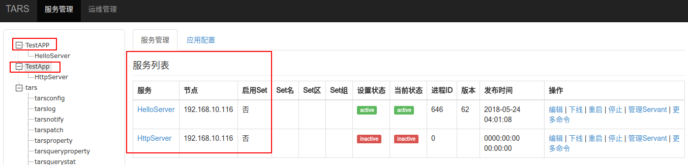
通过web界面创建两个应用: TestAPP和TestApp （手误，不是故意的 😇）
然后发现客户端连接时是区分大小写的，大小写不对会报错ex:server servant mismatch exception: ret:-4， 这应该是预期行为。
但web管理界面上显示就乱套了，看下图：


比较悲剧的是把其中的一个应用下线后，另外一个也没了 😭


看界面是老版本的管理平台，老版本的管理平台已经不升级了，不过新版本管理平台也有这个问题，已经在排期优化中，请关注版本的更新。


## [A small fix on cpp/util/src/tc_cgi.cpp](/TarsCloud/Tars/issues/206)


I think maybe the code in cpp/util/src/tc_cgi.cpp line 776
string TC_Cgi::htmlHeader(const string &sHeader)
{
    return "Content-type: " + sHeader + "\n\n";
}

should be
string TC_Cgi::htmlHeader(const string &sHeader)
{
    return "Content-type: " + sHeader + "\r\n";
}


是的。


## [php的sever端还没有吗](/TarsCloud/Tars/issues/205)


不是说前几天发布了php的sever端吗， 代码呢，在哪？


https://github.com/Tencent/Tars/tree/phptars
phptars 分支


## [util的库可以在C++ 98环境使用吗](/TarsCloud/Tars/issues/202)


rt


您好，目前不可以了，准备向C++11迁移，要求GCC版本>4.8.2.
你可以下载v1.4.0包，还是支持C++98的。


#121


## [部署申请的端口框问题](/TarsCloud/Tars/issues/201)


使用的是centos系统，浏览器是firefox。已安装好tars，但是每次申请发布的时候，填写端口，端口框非常之小，而且不可调整，填写段口号时都不知道填写的是多少。


ubuntu chrome 也有这个问题


已解决。由于web平台没有对笔记本分辨率做很好的适配，导致在1366分辨率下看端口输入框非常窄。可重新下载相应的页面替换掉原来的页面


## [tars-client版本问题](/TarsCloud/Tars/issues/200)


注意tars-client版本已经更新到1.0.4， 而web中pom.xml中仍然是1.0.3。这个需要手动修改过来。还有group-id也发生了变化。要把编译好的jar文件拷贝过去。


现在使用的是nodejs的web页面，这个不维护了


## [php ext api decode error TARS_DECODE_ERROR](/TarsCloud/Tars/issues/198)


用tup-php里的纯PHP解码没问题
用tars2php里的ext扩展解码就报错了
用的是php7.2.4, php扩展开发不太熟, 源码还在看, 求大神有空帮忙看看, 谢谢
tars define:
struct ClientInfoList
{
0 require map<int, ClientInfo> ClientInfo;
};
struct ClientInfo
{
0 require string client_name;
1 require unsigned int client_id;
2 require string client_loginip;
3 require unsigned int client_loginport;
4 require ClientRole client_role;
5 require long client_logintime;
6 require GateWayType gateway_type;
7 require unsigned int region_id;
8 optional string dev_model;
9 optional bool is_online;
10 optional string client_sdk_ver;
11 optional string client_hardware_ver;
12 optional string client_firm_ver;
};
enum ClientRole
{
CLIENT_ROLE_USER = 0,
CLIENT_ROLE_DEVICE = 1,
};
enum GateWayType
{
TYPE_DEVICE_GATEWAY = 1,
TYPE_USER_GATEWAY = 2,
};
`<?php
$decodeData=hex2bin("08000206001d0000010c0606726573756c741d0000710a0800010c1a060d313030303030303030303030311300000000cc400002260e3137322e31382e3139332e323032320000b79e400153000001630626f30760017001a60b312e302e332e3044424732b60e544553545f48415244565f312e30c60e544553545f4649524d565f312e300b0b");
$obj = new \app\server\servant\ClientInfoList;
\TUPAPI::getStruct('result', $obj, $decodeData);
// exception code:TARS_DECODE_ERROR(-3)
// 08 00 02 #map size=2
//     06 00 #key1=""
//     1d 00 00 01 0c #val1=simplelist,value=0
//     06 06 72 65 73 75 6c 74 1d 00 00 71 #key2="result"
//     1d 00 00 71 #val2=simplelist,value=struct
//         0a #struct begin
//             08 00 01 #map size=1
//                 0c #key=0
//                 1a #value=struct begin
//                     06 0d 31 30 30 30 30 30 30 30 30 30 30 30 31 #0=1000000000001
//                     13 00 00 00 00 cc 40 00 02 #1=3426746370
//                     26 0e 31 37 32 2e 31 38 2e 31 39 33 2e 32 30 32 #2=172.18.193.202
//                     32 00 00 b7 9e #3=47006
//                     40 01 #4=1
//                     53 00 00 01 63 06 26 f3 07 #5=1524816605959
//                     60 01 #6=1
//                     70 01 #7=1
//                     a6 0b 31 2e 30 2e 33 2e 30 44 42 47 32 #11=1.0.3.0DBG2
//                     b6 0e 54 45 53 54 5f 48 41 52 44 56 5f 31 2e 30 #12=TEST_HARDV_1.0
//                     c6 0e 54 45 53 54 5f 46 49 52 4d 56 5f 31 2e 30 #13=TEST_FIRMV_1.0
//                 0b #struct end
//         0b #struct end
`


tars2php 的工具有点小问题，unsigned int类型被识别成了 int类型
麻烦把生成的 ClientInfo.php文件中 \TARS::INT32 修改为 \TARS::UINT32，解包即可正常。
tars2php工具的bug我们会稍候修改提交。


已经修复这个问题，可以使用 phptars 分支代码


## [Tars web管理端目前没有访问控制(帐号登陆)，后续有支持计划吗？](/TarsCloud/Tars/issues/196)


No description provided.


resin自带的帐号登录，了解一下。


https://github.com/xcwen/doc/blob/master/web-outside-power.md


现在是自己加的登录代码实现的


已经在计划中，后期会支持


官方代码已更新


## [CPP实现中通信模型的几个问题](/TarsCloud/Tars/issues/195)


1。epoll_server中包含的最多neThread设置为15？原因是什么？未什么不把最大值设置成类似处理器的个数，例如[numprocess ~2* numprocessor]
2. 在epoller的创建时候，设置了最大连接参数10240。该参数在创建时被内核忽略，但是在epoll_wait时候控制最大监控的数量。问题是10240的来源？是否一次读取太大？有无测试支持？
3。netThread[0]用于处理bind，即作为Reactor。随后的代码在连接进入时，选择getNetThreadOfFd（）并不区别Reactor和worker，即新的连接也可以进入netThread[0]，这样在处理业务的时候是否影响新进入的连接？为什么不选择让netThread[0]只处理新的连接？


1.一是netthread瓶颈在网卡而不是CPU；15个已经足够大，具体参数交给配置文件让业务根据流量自己调整；
你说的这种应该是windows IOCP的经典做法。
二是，tars区分了网络线程和逻辑线程；一般来说如果不做区分（比如netty的网络模型），设置为[numprocess ~2* numprocessor]更加可取.
2.epoll-wait必须指定本次wait的最大事件数量啊，如果指定太多，可能会导致和消费者线程（逻辑处理）的不平衡
3.一个比较难抉择的问题；如果用单独的bind线程（本人也倾向这一点），work线程中连接数据事件的处理阻塞并不会影响新连接接入；
不过tars的定位并不是像nginx那样做接入，也是默认长连接，因此也不会有太频繁的连接创建；目前tars这种做法也没有问题。当然要拿tars作为接入服务，可能需要独立的bind线程（but why not nginx？）


多谢回复。是不是可以这样理解：
1。你们在应用的过程中，发现线程数目和核数无关，流量其主要作用，所以不用关注。那是不是对于高频的小流量场景来说，可能存在流量不足，挑度不够的情况？ 另外对于你说的，tars区分网络线程和逻辑线程是什么意思？你是指EpollServer中的handle来处理业务吗？如果是这样的话，实际上Netty也推荐这样使用（boss负责连接，workers服务网络请求，业务最好使用自己的线程池，不要占用worker，否则也会出问题）
2。我对代码epoll-wait的感觉是不是一次取太多了10240个。为什么不设置小一些，不如1024。然后循环多次呢？
3。对了，还有一小额外的问题，那就是你们设计这块网络的时候，为什么没有考虑使用一些开源的框架，比如CPP的libevent，Java的Netty。而是全部自己实现呢？能共享一些你们的思路吗？再次感谢！


1.tars区分网络线程和逻辑线程：以接收请求为例，网络线程负责收包，放到请求队列；逻辑线程(handle)从请求队列取包做处理。netty没有内置这种场景，boss负责连接，work负责请求，但是收包和处理都是在worker线程内完成，没有跨线程所以也没有请求队列。C++的muduo也是这样。
2.  epoll_wait(_iEpollfd, _pevs, _max_connections + 1, millsecond);
这块有点误导，但实际运行正常，是这样的： 尽管第三个参数是10240,你注册的event一般是没有这么多的(假设是nEvents)，所以它这里最多返回事件数量是max(10240, nEvents);这块不用太纠结
3.据从java同学了解，有使用netty的打算。cpp呢，实在是没有这样的“标准库”，再加上开发较早（2009年），以及撸一个可用的基础网络代码并没有什么门槛，前辈们就这样自己写了吧。


非常感谢。
大概了解选择这些魔数的缘由和适用的场景，再次感谢！
从一个开源的框架来说，如果把这些魔数和场景配置化，可能更好，能适应更多不同的情况。


## [能否上传性能测试样例代码并解读性能测试报告？](/TarsCloud/Tars/issues/194)


从实现上看，CPP的实现提供更多特性，EPOLL ET，Coroutine特性。Java的实现使用的Java 原生的NIO，但是JDK中Selector的实现是基于EPOLL LT的。看到测试效果两者几乎没什么差异，似乎不太合理。能否上传测试代码供重现？
另外能否解释一下为什么CPP的实现和JAVA性能相近的原因？
最后，还有点好奇，当时为什么没考虑使用libevent，Netty等这样的框架？


https://github.com/Tencent/Tars/tree/master/cpp/examples/StressDemo


多谢，我看对应的CPP和Java版本。
能否解读一下你们提供的性能报告？设计和实现差异挺大的，为何两者性能如此接近？


## [jce生成的cpp代码中的类的display方法的问题](/TarsCloud/Tars/issues/193)


目前没有重载来显示vector<byte>类型的成员，当字符串直接来显示的，直接导致乱码，并且这个成员后面的成员就显示不了了。


vector的数据本身是二进制的数据，不太适合用生成代码的display方法显示，另外代码生成的类目前是不建议去重载其中的方法。
建议：
对于有vector成员的结构体，如果想打印出其中的内容，建议根据业务自身的需求实现打印struct包含vector成员变量的方法，方便内容的查看
如果不想打印其中的内容，对于vector在display方法中使用导致的问题，后面的解决方案是只显示vector简要信息来规避这个问题


## [服务发布失败:tars.tarsregistry.QueryObj|java.nio.ByteBuffer.flip()Ljava/nio/ByteBuffer;](/TarsCloud/Tars/issues/192)


tarsnotify发布时，报这个错，怎么解？


jdk版本问题，已解


部分过新的jdk版本没有向下兼容，需要切换到jdk8及一下


## [Java源码中com.qq.tars.rest.RestServantAdapter是否没有开源？](/TarsCloud/Tars/issues/191)


SpringAppContext引用了com.qq.tars.rest.RestServantAdapter。但是没有看到对应的代码？请问是否没有开源？


是的


能否上传？或者修改Spring这个项目的SpringAppContext文件。否则这属于半拉子工程。


## [TC_Mysql::execute什么时候支持参数化？？](/TarsCloud/Tars/issues/190)


TC_Mysql::execute什么时候能支持参数化？
不支持参数化，很容易产生sql注入风险。


多谢建议，目前还不支持，看看能不能帮提交支持的版本，我们合并一下


## [能否与Kong作为网关搭配使用?接口支持麽？](/TarsCloud/Tars/issues/188)


如题。


可以的 但这样要求后端服务须采用http协议，tars也即将支持http2，敬请期待


## [tars-pb支持c++代码生成么](/TarsCloud/Tars/issues/187)


https://cloud.tencent.com/developer/article/1020528 这里看都是Java的


暂时cpp 不支持 。。。内部支持正在排期中


## [怎么在运行中的tars里增加registry](/TarsCloud/Tars/issues/186)


如题，怎么在运行中的tars里增加registry


直接在一台新的机器上部署tarsregistry，然后把配置中的db指向同一个就行了，不过已经部署的机器，tarsregistry节点不会更改


## [编译Demo链接错误](/TarsCloud/Tars/issues/185)


g++ -g -O2 -Wno-deprecated -Wall -o DemoServer DemoServantImp.o DemoServer.o  -I/usr/local/tars/cpp/include -I./ -L/usr/local/tars/cpp/lib -ltarsservant -ltarsparse -ltarsutil -lpthread DemoServantImp.o：在函数‘TC_AutoPtrNull_Exception’中： /usr/local/tars/cpp/include/util/tc_autoptr.h:37：对‘tars::TC_Exception::TC_Exception(std::string const&)’未定义的引用 DemoServantImp.o：在函数‘TestApp::Hello::onDispatch(tars::TC_AutoPtr<tars::TarsCurrent>, std::vector<char, std::allocator<char> >&)’中： /home/bill/workspace/TestApp/DemoServer/Hello.h:351：对‘tars::TarsCurrent::getFuncName() const’未定义的引用 DemoServer.o：在函数‘operator+<char, std::char_traits<char>, std::allocator<char> >’中： /usr/include/c++/4.9/bits/basic_string.h:2423：对‘tars::ServerConfig::Application’未定义的引用 /usr/include/c++/4.9/bits/basic_string.h:2387：对‘tars::ServerConfig::ServerName’未定义的引用 DemoServer.o：在函数‘TC_AutoPtrNull_Exception’中： /usr/local/tars/cpp/include/util/tc_autoptr.h:37：对‘tars::TC_Exception::TC_Exception(std::string const&)’未定义的引用 DemoServer.o：在函数‘tars::ServantCreation<HelloImp>::create(std::string const&)’中： /usr/local/tars/cpp/include/servant/ServantHelper.h:47：对‘tars::Servant::setName(std::string const&)’未定义的引用 collect2: error: ld returned 1 exit status
但是类似TC_Exception的生成码应该是链接到util那个静态库的，怎么链接不上，求协助。


## [TC_SharedPtr实现中类tc_shared_count_impl_p存在的意义？](/TarsCloud/Tars/issues/184)


TC_SharedPtr的实现原理中，m_pn指向了一个tc_shared_count_impl_p对象，看了源码tc_shared_count_impl_p这个类存在的意义是什么？直接让m_pn指向tc_shared_count_base这个不就OK了吗？


## [监控详细数据窗口的排版没有自适应导致被隐藏部分数据](/TarsCloud/Tars/issues/183)


当主调被调同时展示并名字比较长时，详细数据最右边的“当日超时率”和“对比日超时率”等数据框就无法正常显示了。


通过增加滚动条和调整Title 格式的方式解决


## [服务监控里的超时率数据和异常率数据没有正确展示](/TarsCloud/Tars/issues/182)


服务监控里的超时率数据和异常率数据没有正确展示


初步沟通报表显示正确，不过展示方式确实不够友好，优化成按百分比展示


## [在Debian系环境运行create_tars_server.sh时报错](/TarsCloud/Tars/issues/180)


是perl工具rename报的：Bareword "DemoServer" not allowed while "strict subs" in use at (user-supplied code).
我已经提交了 PR：#179


perl->shell?   shell语法确实略有差异，待验证后merge


create_tars_server.sh 里面使用了rename，这是个perl写的系统工具，在debian上运行时就报了上面的错误


debian用户修改一下：
if [ "$SERVER" == "$SERVANT" ]             -> if [ "$SERVER" = "$SERVANT" ]
rename "DemoServer" "$SERVER" $SRC_FILE    -> rename "s/DemoServer/$SERVER/" *
rename "DemoServant" "$SERVANT" $SRC_FILE  -> rename "s/DemoServant/$SERVANT/" *


刚刚修改了PR #179 ，把不同rename命令的判断方式从OS方式改成来源包的方式，应该可以适应各种不同的Linux发行版


## [请多加些example案例及go语言支持](/TarsCloud/Tars/issues/175)


谢谢


golang支持快了~内部已经有业务在使用了


https://github.com/TarsCloud/TarsGo


## [请问如何基于java开发非tars协议的服务，有没有说明文档和参考示例呢？](/TarsCloud/Tars/issues/174)


No description provided.


文档后续补充，可以参考JAVA支持protobuf的实现


## [php ext 几处问题](/TarsCloud/Tars/issues/171)


工作环境：
rpm --query centos-release
centos-release-7-4.1708.el7.centos.x86_64
在 ext 目录下运行 auto 命令，能够成功完成，但 make test 会报错，具体错误是 ZVAL_ADDREF、ZVAL_COPY 或 convert_to_bool 找不到。
在 ttars.c 里加入：
#define ZVAL_ADDREF Z_ADDREF_P
#define ZVAL_COPY ZVAL_COPY_VALUE
然后全文将 convert_to_bool 修改为 convert_to_boolean ，问题就消失了。


PHP是使用yum安装的，版本：
PHP 5.4.16 (cli) (built: Nov 15 2017 16:33:54)
Copyright (c) 1997-2013 The PHP Group
Zend Engine v2.4.0, Copyright (c) 1998-2013 Zend Technologies


使用php 7.1、7.2编译，遇见了另外的错误：
make test
Build complete.
Don't forget to run 'make test'.
PHP Warning:  PHP Startup: Unable to load dynamic library '/root/Tars/php/tarsclient/ext/modules/phptars.so' - /root/Tars/php/tarsclient/ext/modules/phptars.so: undefined symbol: Z_BVAL in Unknown on line 0
PHP Warning:  PHP Startup: Unable to load dynamic library '/root/Tars/php/tarsclient/ext/modules/phptars.so' - /root/Tars/php/tarsclient/ext/modules/phptars.so: undefined symbol: Z_BVAL in Unknown on line 0
PHP_SAPI    : cli
PHP_VERSION : 7.1.14
ZEND_VERSION: 3.1.0
PHP_OS      : Linux - Linux dcfe87045f63 4.4.111-boot2docker #1 SMP Thu Jan 11 16:25:31 UTC 2018 x86_64
INI actual  : /root/Tars/php/tarsclient/ext/tmp-php.ini
More .INIs  :
CWD         : /root/Tars/php/tarsclient/ext
Extra dirs  :
VALGRIND    : Not used


php 5.4 我们没有测试过，可能有问题，目前测试过的版本是 php 5.5,5.6,7.1
7.1 的问题：
我们没有用到make test， 扩展带的测试用例是空的，测试用testcases目录，你这个是加在so的时候出错了，看起来好像是 安装最开始没有 phpize --clean 可以再确认一下吗？
你是在docker 的 容器里面做的吗？ 如果是，容器是可以公网拉倒吗，我可以拉一个试试能不能重现你的问题


在5.4环境下 phpize --clean 之后，include文件夹被清除了
但在7.1、7.2环境下，即便做了phpize --clean，也还是有这个错误
镜像：
docker pull tangramor/docker-tars
目前里面没有配PHP，尝试成功的就5.4了，不过需要做修改
php 7.1的安装脚本如下：
yum -y install https://dl.fedoraproject.org/pub/epel/epel-release-latest-7.noarch.rpm \
	&& yum -y install http://rpms.remirepo.net/enterprise/remi-release-7.rpm \
	&& yum -y install yum-utils && yum-config-manager --enable remi-php71 \
	&& yum -y install php php-devel php-mcrypt php-cli php-gd php-curl php-mysql php-zip php-fileinfo \
	&& yum clean all && rm -rf /var/cache/yum


7.1的带 phpize --clean 的过程如下（这里将auto7.sh里面的phpize和php-config改成了系统自带的）：
[root@f8110fddb773 ext]# ./auto7.sh 
Cleaning..
Configuring for:
PHP Api Version:         20160303
Zend Module Api No:      20160303
Zend Extension Api No:   320160303
checking for grep that handles long lines and -e... /usr/bin/grep
checking for egrep... /usr/bin/grep -E
checking for a sed that does not truncate output... /usr/bin/sed
checking for cc... cc
checking whether the C compiler works... yes
checking for C compiler default output file name... a.out
checking for suffix of executables... 
checking whether we are cross compiling... no
checking for suffix of object files... o
checking whether we are using the GNU C compiler... yes
checking whether cc accepts -g... yes
checking for cc option to accept ISO C89... none needed
checking how to run the C preprocessor... cc -E
checking for icc... no
checking for suncc... no
checking whether cc understands -c and -o together... yes
checking for system library directory... lib
checking if compiler supports -R... no
checking if compiler supports -Wl,-rpath,... yes
checking build system type... x86_64-unknown-linux-gnu
checking host system type... x86_64-unknown-linux-gnu
checking target system type... x86_64-unknown-linux-gnu
checking for PHP prefix... /usr
checking for PHP includes... -I/usr/include/php -I/usr/include/php/main -I/usr/include/php/TSRM -I/usr/include/php/Zend -I/usr/include/php/ext -I/usr/include/php/ext/date/lib
checking for PHP extension directory... /usr/lib64/php/modules
checking for PHP installed headers prefix... /usr/include/php
checking if debug is enabled... no
checking if zts is enabled... no
checking for re2c... no
configure: WARNING: You will need re2c 0.13.4 or later if you want to regenerate PHP parsers.
checking for gawk... gawk
checking whether to enable phptars support... yes, shared
checking how to print strings... printf
checking for a sed that does not truncate output... (cached) /usr/bin/sed
checking for fgrep... /usr/bin/grep -F
checking for ld used by cc... /usr/bin/ld
checking if the linker (/usr/bin/ld) is GNU ld... yes
checking for BSD- or MS-compatible name lister (nm)... /usr/bin/nm -B
checking the name lister (/usr/bin/nm -B) interface... BSD nm
checking whether ln -s works... yes
checking the maximum length of command line arguments... 1572864
checking whether the shell understands some XSI constructs... yes
checking whether the shell understands "+="... yes
checking how to convert x86_64-unknown-linux-gnu file names to x86_64-unknown-linux-gnu format... func_convert_file_noop
checking how to convert x86_64-unknown-linux-gnu file names to toolchain format... func_convert_file_noop
checking for /usr/bin/ld option to reload object files... -r
checking for objdump... objdump
checking how to recognize dependent libraries... pass_all
checking for dlltool... no
checking how to associate runtime and link libraries... printf %s\n
checking for ar... ar
checking for archiver @FILE support... @
checking for strip... strip
checking for ranlib... ranlib
checking for gawk... (cached) gawk
checking command to parse /usr/bin/nm -B output from cc object... ok
checking for sysroot... no
./configure: line 6464: /usr/bin/file: No such file or directory
checking for mt... no
checking if : is a manifest tool... no
checking for ANSI C header files... yes
checking for sys/types.h... yes
checking for sys/stat.h... yes
checking for stdlib.h... yes
checking for string.h... yes
checking for memory.h... yes
checking for strings.h... yes
checking for inttypes.h... yes
checking for stdint.h... yes
checking for unistd.h... yes
checking for dlfcn.h... yes
checking for objdir... .libs
checking if cc supports -fno-rtti -fno-exceptions... no
checking for cc option to produce PIC... -fPIC -DPIC
checking if cc PIC flag -fPIC -DPIC works... yes
checking if cc static flag -static works... no
checking if cc supports -c -o file.o... yes
checking if cc supports -c -o file.o... (cached) yes
checking whether the cc linker (/usr/bin/ld) supports shared libraries... yes
checking whether -lc should be explicitly linked in... no
checking dynamic linker characteristics... GNU/Linux ld.so
checking how to hardcode library paths into programs... immediate
checking whether stripping libraries is possible... yes
checking if libtool supports shared libraries... yes
checking whether to build shared libraries... yes
checking whether to build static libraries... no
configure: creating ./config.status
config.status: creating config.h
config.status: executing libtool commands
/bin/sh /root/Tars/php/tarsclient/ext/libtool --mode=compile cc  -I. -I/root/Tars/php/tarsclient/ext -DPHP_ATOM_INC -I/root/Tars/php/tarsclient/ext/include -I/root/Tars/php/tarsclient/ext/main -I/root/Tars/php/tarsclient/ext -I/usr/include/php -I/usr/include/php/main -I/usr/include/php/TSRM -I/usr/include/php/Zend -I/usr/include/php/ext -I/usr/include/php/ext/date/lib  -DHAVE_CONFIG_H  -g -O2   -c /root/Tars/php/tarsclient/ext/tupapi.c -o tupapi.lo 
libtool: compile:  cc -I. -I/root/Tars/php/tarsclient/ext -DPHP_ATOM_INC -I/root/Tars/php/tarsclient/ext/include -I/root/Tars/php/tarsclient/ext/main -I/root/Tars/php/tarsclient/ext -I/usr/include/php -I/usr/include/php/main -I/usr/include/php/TSRM -I/usr/include/php/Zend -I/usr/include/php/ext -I/usr/include/php/ext/date/lib -DHAVE_CONFIG_H -g -O2 -c /root/Tars/php/tarsclient/ext/tupapi.c  -fPIC -DPIC -o .libs/tupapi.o
/bin/sh /root/Tars/php/tarsclient/ext/libtool --mode=compile cc  -I. -I/root/Tars/php/tarsclient/ext -DPHP_ATOM_INC -I/root/Tars/php/tarsclient/ext/include -I/root/Tars/php/tarsclient/ext/main -I/root/Tars/php/tarsclient/ext -I/usr/include/php -I/usr/include/php/main -I/usr/include/php/TSRM -I/usr/include/php/Zend -I/usr/include/php/ext -I/usr/include/php/ext/date/lib  -DHAVE_CONFIG_H  -g -O2   -c /root/Tars/php/tarsclient/ext/ttars.c -o ttars.lo 
libtool: compile:  cc -I. -I/root/Tars/php/tarsclient/ext -DPHP_ATOM_INC -I/root/Tars/php/tarsclient/ext/include -I/root/Tars/php/tarsclient/ext/main -I/root/Tars/php/tarsclient/ext -I/usr/include/php -I/usr/include/php/main -I/usr/include/php/TSRM -I/usr/include/php/Zend -I/usr/include/php/ext -I/usr/include/php/ext/date/lib -DHAVE_CONFIG_H -g -O2 -c /root/Tars/php/tarsclient/ext/ttars.c  -fPIC -DPIC -o .libs/ttars.o
/root/Tars/php/tarsclient/ext/ttars.c: In function ‘map_converter’:
/root/Tars/php/tarsclient/ext/ttars.c:1516:22: warning: assignment makes pointer from integer without a cast [enabled by default]
                 (key = (zval *) zend_hash_str_find(Z_ARRVAL_P(item), ZEND_STRS(MAP_FIRST_KEY)) == NULL) ||
                      ^
/root/Tars/php/tarsclient/ext/ttars.c:1517:24: warning: assignment makes pointer from integer without a cast [enabled by default]
                 (value = (zval *) zend_hash_str_find(Z_ARRVAL_P(item), ZEND_STRS(MAP_SECOND_KEY)) == NULL)) {
                        ^
/bin/sh /root/Tars/php/tarsclient/ext/libtool --mode=compile cc  -I. -I/root/Tars/php/tarsclient/ext -DPHP_ATOM_INC -I/root/Tars/php/tarsclient/ext/include -I/root/Tars/php/tarsclient/ext/main -I/root/Tars/php/tarsclient/ext -I/usr/include/php -I/usr/include/php/main -I/usr/include/php/TSRM -I/usr/include/php/Zend -I/usr/include/php/ext -I/usr/include/php/ext/date/lib  -DHAVE_CONFIG_H  -g -O2   -c /root/Tars/php/tarsclient/ext/tup_c.c -o tup_c.lo 
libtool: compile:  cc -I. -I/root/Tars/php/tarsclient/ext -DPHP_ATOM_INC -I/root/Tars/php/tarsclient/ext/include -I/root/Tars/php/tarsclient/ext/main -I/root/Tars/php/tarsclient/ext -I/usr/include/php -I/usr/include/php/main -I/usr/include/php/TSRM -I/usr/include/php/Zend -I/usr/include/php/ext -I/usr/include/php/ext/date/lib -DHAVE_CONFIG_H -g -O2 -c /root/Tars/php/tarsclient/ext/tup_c.c  -fPIC -DPIC -o .libs/tup_c.o
/bin/sh /root/Tars/php/tarsclient/ext/libtool --mode=compile cc  -I. -I/root/Tars/php/tarsclient/ext -DPHP_ATOM_INC -I/root/Tars/php/tarsclient/ext/include -I/root/Tars/php/tarsclient/ext/main -I/root/Tars/php/tarsclient/ext -I/usr/include/php -I/usr/include/php/main -I/usr/include/php/TSRM -I/usr/include/php/Zend -I/usr/include/php/ext -I/usr/include/php/ext/date/lib  -DHAVE_CONFIG_H  -g -O2   -c /root/Tars/php/tarsclient/ext/tars_c.c -o tars_c.lo 
libtool: compile:  cc -I. -I/root/Tars/php/tarsclient/ext -DPHP_ATOM_INC -I/root/Tars/php/tarsclient/ext/include -I/root/Tars/php/tarsclient/ext/main -I/root/Tars/php/tarsclient/ext -I/usr/include/php -I/usr/include/php/main -I/usr/include/php/TSRM -I/usr/include/php/Zend -I/usr/include/php/ext -I/usr/include/php/ext/date/lib -DHAVE_CONFIG_H -g -O2 -c /root/Tars/php/tarsclient/ext/tars_c.c  -fPIC -DPIC -o .libs/tars_c.o
/bin/sh /root/Tars/php/tarsclient/ext/libtool --mode=link cc -DPHP_ATOM_INC -I/root/Tars/php/tarsclient/ext/include -I/root/Tars/php/tarsclient/ext/main -I/root/Tars/php/tarsclient/ext -I/usr/include/php -I/usr/include/php/main -I/usr/include/php/TSRM -I/usr/include/php/Zend -I/usr/include/php/ext -I/usr/include/php/ext/date/lib  -DHAVE_CONFIG_H  -g -O2   -o phptars.la -export-dynamic -avoid-version -prefer-pic -module -rpath /root/Tars/php/tarsclient/ext/modules  tupapi.lo ttars.lo tup_c.lo tars_c.lo 
libtool: link: cc -shared  -fPIC -DPIC  .libs/tupapi.o .libs/ttars.o .libs/tup_c.o .libs/tars_c.o    -O2   -Wl,-soname -Wl,phptars.so -o .libs/phptars.so
libtool: link: ( cd ".libs" && rm -f "phptars.la" && ln -s "../phptars.la" "phptars.la" )
/bin/sh /root/Tars/php/tarsclient/ext/libtool --mode=install cp ./phptars.la /root/Tars/php/tarsclient/ext/modules
libtool: install: cp ./.libs/phptars.so /root/Tars/php/tarsclient/ext/modules/phptars.so
libtool: install: cp ./.libs/phptars.lai /root/Tars/php/tarsclient/ext/modules/phptars.la
libtool: finish: PATH="/usr/local/sbin:/usr/local/bin:/usr/sbin:/usr/bin:/sbin:/bin:/sbin" ldconfig -n /root/Tars/php/tarsclient/ext/modules
----------------------------------------------------------------------
Libraries have been installed in:
   /root/Tars/php/tarsclient/ext/modules

If you ever happen to want to link against installed libraries
in a given directory, LIBDIR, you must either use libtool, and
specify the full pathname of the library, or use the `-LLIBDIR'
flag during linking and do at least one of the following:
   - add LIBDIR to the `LD_LIBRARY_PATH' environment variable
     during execution
   - add LIBDIR to the `LD_RUN_PATH' environment variable
     during linking
   - use the `-Wl,-rpath -Wl,LIBDIR' linker flag
   - have your system administrator add LIBDIR to `/etc/ld.so.conf'

See any operating system documentation about shared libraries for
more information, such as the ld(1) and ld.so(8) manual pages.
----------------------------------------------------------------------

Build complete.
Don't forget to run 'make test'.

Installing shared extensions:     /usr/lib64/php/modules/
Cleaning..
[root@f8110fddb773 ext]# make test
make: *** No rule to make target `test'.  Stop.
[root@f8110fddb773 ext]# ls
auto      config.m4  tars_c.c   ttars.c   tup_c.c
auto7.sh  include    testcases  tupapi.c
[root@f8110fddb773 ext]# cd testcases/
[root@f8110fddb773 testcases]# ls
NestedStruct.php  SimpleStruct.php  test.php
[root@f8110fddb773 testcases]# php test.php 
PHP Warning:  PHP Startup: Unable to load dynamic library '/usr/lib64/php/modules/phptars.so' - /usr/lib64/php/modules/phptars.so: undefined symbol: Z_BVAL in Unknown on line 0
PHP Fatal error:  Class 'TARS_Struct' not found in /root/Tars/php/tarsclient/ext/testcases/SimpleStruct.php on line 4


#172 提交了，在我的环境里工作正常，7.1、7.2都可以


php 7 的bug 已经修复了，还一起提交了其他几个bug 修复。你再测试一下，谢谢反馈


还是报Z_BVAL的错：
$ php test.php 
PHP Warning:  PHP Startup: Unable to load dynamic library 'phptars.so' (tried: /usr/lib64/php/modules/phptars.so (/usr/lib64/php/modules/phptars.so: undefined symbol: Z_BVAL), /usr/lib64/php/modules/phptars.so.so (/usr/lib64/php/modules/phptars.so.so: cannot open shared object file: No such file or directory)) in Unknown on line 0

我在PR上解决了一下冲突： #172


有pull最新代码吗？是php7环境吗，在代码里面已经只有两处用到Z_BVAL 都在在 php5 的if 里面， 在php 7里面已经取消了 Z_BVAL，改用 Z_TYPE_P 判断是 true 还是 false 那boolean 的value，我在已经里面已经做了修改。麻烦再确认一下。


是php7.2。我今天一直在弄镜像，每次都会下载最新的代码。
php --version
PHP 7.2.2 (cli) (built: Jan 30 2018 13:44:49) ( NTS )
Copyright (c) 1997-2018 The PHP Group
Zend Engine v3.2.0, Copyright (c) 1998-2018 Zend Technologies
我也看了代码，也奇怪为什么还报这个错误。
不过用我在PR里提交的代码是可以运行正常的。


Hi，我又推了一个提交上去，不过理论上和你的问题没有关系，我刚刚用你的docker镜像，用上面你给的php安装命令，安装的7.1.4，测试了一下用例没问题。麻烦再测试一下。


@bobzhangyong 刚刚改了我的脚本，用了最新的代码，测试了7.2，应该没有问题了


## [tars2php.php 174行bug](/TarsCloud/Tars/issues/170)


改成：
if(strval($word) && intval($word) == 0) {
就好了


此问题，只针对php5.5以下版本，稍后换为更通用写法。


最新的commit中，已经改为更通用的写法：
if(!is_numeric($word)) {
            return false;
        }
        else return true;


## [发布HelloServer例子失败](/TarsCloud/Tars/issues/169)


按C++的HelloServer例子来的，发布的时候出错

日志报：
2018-02-02 16:03:11.340|INFO|AdminService.java|133|lambda$addTask$1|item=050c9a275d1a48138a80b8d75d713f36, applicaiton=TestApp, server_name=HelloServer, node_name=172.17.0.4, command=patch_tars, parameters={patch_id=52, bak_flag=0, update_text=}
2018-02-02 16:03:11.354|INFO|WrappedController.java|83|handleException|exception intercepted, uri=/pages/server/api/add_task, isajax=true
com.qq.tars.rpc.exc.ClientException: tars.tarsregistry.QueryObj|connect failed to 172.17.0.4:17890
at com.qq.tars.client.ObjectProxy.invoke(ObjectProxy.java:101)
at com.sun.proxy.$Proxy151.findObjectByIdInSameGroup(Unknown Source)
at com.qq.tars.support.query.QueryHelper.getServerNodes(QueryHelper.java:57)
at com.qq.tars.client.ObjectProxyFactory.updateServantEndpoints(ObjectProxyFactory.java:124)
at com.qq.tars.client.ObjectProxyFactory.getObjectProxy(ObjectProxyFactory.java:53)
at com.qq.tars.client.ServantProxyFactory.getServantProxy(ServantProxyFactory.java:46)
at com.qq.tars.client.Communicator.stringToProxy(Communicator.java:78)
at com.qq.tars.client.Communicator.stringToProxy(Communicator.java:61)
at com.qq.tars.service.admin.AdminService.getAdminRegPrx(AdminService.java:63)
at com.qq.tars.service.admin.AdminService.addTask(AdminService.java:139)
at com.qq.tars.service.task.TaskService.addTask(TaskService.java:76)
at com.qq.tars.web.controller.TaskController.addTask(TaskController.java:50)
at sun.reflect.NativeMethodAccessorImpl.invoke0(Native Method)
at sun.reflect.NativeMethodAccessorImpl.invoke(NativeMethodAccessorImpl.java:62)
at sun.reflect.DelegatingMethodAccessorImpl.invoke(DelegatingMethodAccessorImpl.java:43)
at java.lang.reflect.Method.invoke(Method.java:498)
at org.springframework.web.method.support.InvocableHandlerMethod.doInvoke(InvocableHandlerMethod.java:221)
at org.springframework.web.method.support.InvocableHandlerMethod.invokeForRequest(InvocableHandlerMethod.java:137)
at org.springframework.web.servlet.mvc.method.annotation.ServletInvocableHandlerMethod.invokeAndHandle(ServletInvocableHandlerMethod.java:110)
at org.springframework.web.servlet.mvc.method.annotation.RequestMappingHandlerAdapter.invokeHandleMethod(RequestMappingHandlerAdapter.java:777)
at org.springframework.web.servlet.mvc.method.annotation.RequestMappingHandlerAdapter.handleInternal(RequestMappingHandlerAdapter.java:706)
at org.springframework.web.servlet.mvc.method.AbstractHandlerMethodAdapter.handle(AbstractHandlerMethodAdapter.java:85)
at org.springframework.web.servlet.DispatcherServlet.doDispatch(DispatcherServlet.java:943)
at org.springframework.web.servlet.DispatcherServlet.doService(DispatcherServlet.java:877)
at org.springframework.web.servlet.FrameworkServlet.processRequest(FrameworkServlet.java:966)
at org.springframework.web.servlet.FrameworkServlet.doPost(FrameworkServlet.java:868)
at javax.servlet.http.HttpServlet.service(HttpServlet.java:159)
at org.springframework.web.servlet.FrameworkServlet.service(FrameworkServlet.java:842)
at javax.servlet.http.HttpServlet.service(HttpServlet.java:97)
at com.caucho.server.dispatch.ServletFilterChain.doFilter(ServletFilterChain.java:109)
at org.springframework.web.filter.RequestContextFilter.doFilterInternal(RequestContextFilter.java:98)
at org.springframework.web.filter.OncePerRequestFilter.doFilter(OncePerRequestFilter.java:107)
at com.caucho.server.dispatch.FilterFilterChain.doFilter(FilterFilterChain.java:89)
at com.qq.tars.web.filter.WrapRequestFilter.doFilter(WrapRequestFilter.java:32)
at com.caucho.server.dispatch.FilterFilterChain.doFilter(FilterFilterChain.java:89)
at com.caucho.server.webapp.WebAppFilterChain.doFilter(WebAppFilterChain.java:156)
at com.caucho.server.webapp.AccessLogFilterChain.doFilter(AccessLogFilterChain.java:95)
at com.caucho.server.dispatch.ServletInvocation.service(ServletInvocation.java:290)
at com.caucho.server.http.HttpRequest.handleRequest(HttpRequest.java:838)
at com.caucho.network.listen.TcpSocketLink.dispatchRequest(TcpSocketLink.java:1353)
at com.caucho.network.listen.TcpSocketLink.handleRequest(TcpSocketLink.java:1309)
at com.caucho.network.listen.TcpSocketLink.handleRequestsImpl(TcpSocketLink.java:1293)
at com.caucho.network.listen.TcpSocketLink.handleRequests(TcpSocketLink.java:1201)
at com.caucho.network.listen.TcpSocketLink.handleAcceptTaskImpl(TcpSocketLink.java:997)
at com.caucho.network.listen.ConnectionTask.runThread(ConnectionTask.java:117)
at com.caucho.network.listen.ConnectionTask.run(ConnectionTask.java:93)
at com.caucho.network.listen.SocketLinkThreadLauncher.handleTasks(SocketLinkThreadLauncher.java:169)
at com.caucho.network.listen.TcpSocketAcceptThread.run(TcpSocketAcceptThread.java:61)
at com.caucho.env.thread2.ResinThread2.runTasks(ResinThread2.java:173)
at com.caucho.env.thread2.ResinThread2.run(ResinThread2.java:118)
Caused by: com.qq.tars.rpc.exc.NotConnectedException: connect failed to 172.17.0.4:17890
at com.qq.tars.client.rpc.ServantClient.reConnect(ServantClient.java:115)
at com.qq.tars.client.rpc.ServantClient.ensureConnected(ServantClient.java:124)
at com.qq.tars.client.rpc.ServantClient.invokeWithSync(ServantClient.java:132)
at com.qq.tars.client.rpc.tars.TarsInvoker.invokeWithSync(TarsInvoker.java:114)
at com.qq.tars.client.rpc.tars.TarsInvoker.doInvokeServant(TarsInvoker.java:63)
at com.qq.tars.client.rpc.ServantInvoker.doInvoke(ServantInvoker.java:44)
at com.qq.tars.rpc.common.support.AbstractInvoker.invoke(AbstractInvoker.java:75)
at com.qq.tars.client.ObjectProxy.invoke(ObjectProxy.java:92)
... 49 more
2018-02-02 16:03:15.755|INFO|ConfigService.java|190|deleteUnusedNodeConfigFiles|delete 0 unused node config file(s)
多点两遍发布按钮，错误又不一样了：

2018-02-02 16:04:22.640|INFO|AdminService.java|133|lambda$addTask$1|item=161d0170880247f8b957e0f732f69336, applicaiton=TestApp, server_name=HelloServer, node_name=172.17.0.4, command=patch_tars, parameters={patch_id=52, bak_flag=0, update_text=}
2018-02-02 16:04:22.655|INFO|WrappedController.java|83|handleException|exception intercepted, uri=/pages/server/api/add_task, isajax=true
com.qq.tars.rpc.exc.NoConnectionException: tars.tarsregistry.QueryObj|tars.tarsregistry.QueryObj try to select active invoker, size=2, no such active connection invoker
at com.qq.tars.client.ObjectProxy.invoke(ObjectProxy.java:99)
at com.sun.proxy.$Proxy151.findObjectByIdInSameGroup(Unknown Source)
at com.qq.tars.support.query.QueryHelper.getServerNodes(QueryHelper.java:57)
at com.qq.tars.client.ObjectProxyFactory.updateServantEndpoints(ObjectProxyFactory.java:124)
at com.qq.tars.client.ObjectProxyFactory.getObjectProxy(ObjectProxyFactory.java:53)
at com.qq.tars.client.ServantProxyFactory.getServantProxy(ServantProxyFactory.java:46)
at com.qq.tars.client.Communicator.stringToProxy(Communicator.java:78)
at com.qq.tars.client.Communicator.stringToProxy(Communicator.java:61)
at com.qq.tars.service.admin.AdminService.getAdminRegPrx(AdminService.java:63)
at com.qq.tars.service.admin.AdminService.addTask(AdminService.java:139)
at com.qq.tars.service.task.TaskService.addTask(TaskService.java:76)
at com.qq.tars.web.controller.TaskController.addTask(TaskController.java:50)
at sun.reflect.NativeMethodAccessorImpl.invoke0(Native Method)
at sun.reflect.NativeMethodAccessorImpl.invoke(NativeMethodAccessorImpl.java:62)
at sun.reflect.DelegatingMethodAccessorImpl.invoke(DelegatingMethodAccessorImpl.java:43)
at java.lang.reflect.Method.invoke(Method.java:498)
at org.springframework.web.method.support.InvocableHandlerMethod.doInvoke(InvocableHandlerMethod.java:221)
at org.springframework.web.method.support.InvocableHandlerMethod.invokeForRequest(InvocableHandlerMethod.java:137)
at org.springframework.web.servlet.mvc.method.annotation.ServletInvocableHandlerMethod.invokeAndHandle(ServletInvocableHandlerMethod.java:110)
at org.springframework.web.servlet.mvc.method.annotation.RequestMappingHandlerAdapter.invokeHandleMethod(RequestMappingHandlerAdapter.java:777)
at org.springframework.web.servlet.mvc.method.annotation.RequestMappingHandlerAdapter.handleInternal(RequestMappingHandlerAdapter.java:706)
at org.springframework.web.servlet.mvc.method.AbstractHandlerMethodAdapter.handle(AbstractHandlerMethodAdapter.java:85)
at org.springframework.web.servlet.DispatcherServlet.doDispatch(DispatcherServlet.java:943)
at org.springframework.web.servlet.DispatcherServlet.doService(DispatcherServlet.java:877)
at org.springframework.web.servlet.FrameworkServlet.processRequest(FrameworkServlet.java:966)
at org.springframework.web.servlet.FrameworkServlet.doPost(FrameworkServlet.java:868)
at javax.servlet.http.HttpServlet.service(HttpServlet.java:159)
at org.springframework.web.servlet.FrameworkServlet.service(FrameworkServlet.java:842)
at javax.servlet.http.HttpServlet.service(HttpServlet.java:97)
at com.caucho.server.dispatch.ServletFilterChain.doFilter(ServletFilterChain.java:109)
at org.springframework.web.filter.RequestContextFilter.doFilterInternal(RequestContextFilter.java:98)
at org.springframework.web.filter.OncePerRequestFilter.doFilter(OncePerRequestFilter.java:107)
at com.caucho.server.dispatch.FilterFilterChain.doFilter(FilterFilterChain.java:89)
at com.qq.tars.web.filter.WrapRequestFilter.doFilter(WrapRequestFilter.java:32)
at com.caucho.server.dispatch.FilterFilterChain.doFilter(FilterFilterChain.java:89)
at com.caucho.server.webapp.WebAppFilterChain.doFilter(WebAppFilterChain.java:156)
at com.caucho.server.webapp.AccessLogFilterChain.doFilter(AccessLogFilterChain.java:95)
at com.caucho.server.dispatch.ServletInvocation.service(ServletInvocation.java:290)
at com.caucho.server.http.HttpRequest.handleRequest(HttpRequest.java:838)
at com.caucho.network.listen.TcpSocketLink.dispatchRequest(TcpSocketLink.java:1353)
at com.caucho.network.listen.TcpSocketLink.handleRequest(TcpSocketLink.java:1309)
at com.caucho.network.listen.TcpSocketLink.handleRequestsImpl(TcpSocketLink.java:1293)
at com.caucho.network.listen.TcpSocketLink.handleRequests(TcpSocketLink.java:1201)
at com.caucho.network.listen.TcpSocketLink.handleAcceptTaskImpl(TcpSocketLink.java:997)
at com.caucho.network.listen.ConnectionTask.runThread(ConnectionTask.java:117)
at com.caucho.network.listen.ConnectionTask.run(ConnectionTask.java:93)
at com.caucho.network.listen.SocketLinkThreadLauncher.handleTasks(SocketLinkThreadLauncher.java:169)
at com.caucho.network.listen.TcpSocketAcceptThread.run(TcpSocketAcceptThread.java:61)
at com.caucho.env.thread2.ResinThread2.runTasks(ResinThread2.java:173)
at com.caucho.env.thread2.ResinThread2.run(ResinThread2.java:118)
Caused by: com.qq.tars.rpc.common.exc.NoInvokerException: tars.tarsregistry.QueryObj try to select active invoker, size=2, no such active connection invoker
at com.qq.tars.client.rpc.loadbalance.RoundRobinLoadBalance.select(RoundRobinLoadBalance.java:93)
at com.qq.tars.client.rpc.loadbalance.DefaultLoadBalance.select(DefaultLoadBalance.java:78)
at com.qq.tars.client.ObjectProxy.invoke(ObjectProxy.java:91)
... 49 more


抱歉第一个截图错了，应该是 com.qq.tars.rpc.exc.ClientException: tars.tarsregistry.QueryObj|connect failed to 172.17.0.4:17890 这个错的


是registry 服务没起来的原因，运行 ps -ef | grep tarsreg 可以查看是否有此进程


## [同一节点的 servant 之间能够通讯吗？](/TarsCloud/Tars/issues/168)


Hi~
如题。


和在client中一样使用就好了,都可以调的


## [有提供go语言支持的计划么？](/TarsCloud/Tars/issues/167)


C++的学习曲线对不少人来说陡峭了点，我们不少同事有学习go语言的想法


golang已经在内部支持了，正在更多的业务上进行测试验证，上半年应该就会放出来，感谢支持:D


上半年还剩5天...


偷笑……已经下半年了，纪念7.7事变


计划听说调整到下半年了，毕竟新东西，大规模验证比较久。


@tangramor  差不多这两月


这个issues可以关掉了，哈哈


https://github.com/TarsCloud/TarsGo


## [[Java]使用maven-assembly-plugin打包后无法启动](/TarsCloud/Tars/issues/166)


AppContainer中对资源文件的访问有问题:

context = new XmlAppContext(new File(servantXML.toURI()));

ConfigurationManager中对资源文件的访问有问题:

ServerConfig cfg = new ServerConfig().load(Config.parseFile(System.getProperty("config")));

不要使用File来操作资源文件，使用Resource获取InputStream的方式来访问.


访问文件内容时都会构造成FileInputStream的


使用maven-assembly-plugin打包后，servantXML是被打包到jar中的。
new File(servantXML.toURI()) 是找不到的，然后就报错了。


//正确的使用方式：
InputStream inputStream = Test.class.getClassLoader.getResourceAsStream("xxx.xml");


明白你的意思了，tars在通常情况下打成war包发布，一般不存在这个问题，不过这里可以修改一下


@LawlietLi 请在maven中央仓库发布一下你们的最新版本


发版了？

@LawlietLi 请在maven中央仓库发布一下你们的最新版本


## [C++代码中，关于的Message.h中ReqMessage结构体的疑问](/TarsCloud/Tars/issues/165)


发送、回应的消息定义为：
RequestPacket               request;        //请求消息体
ResponsePacket              response;       //响应消息体

而非指针，因此在消息的线程间传递时会发生很多次的拷贝构造，这种情况在作为client访问服务时尤为严重，当高并发或者消息较大时会产生很多的性能影响。
例如：
发请求时，函数 ServantProxy::tars_invoke中
msg->request.sBuffer      = buf;
作为同步回应时当前上下文会被挂起或者协程切换，使用原来的buf是安全的
处理回应时：
    CommunicatorEpoll::handleInputImp函数中pTransceiver->doResponse(done)中解包,tarsResponseLen函数push_back会发生拷贝构造
    AdapterProxy::finishInvoke(ResponsePacket & rsp)中 msg->response = rsp;同样会发送拷贝

因此，我觉得将上述数据的传递方式定义为指针，实际数据放在堆区会有更好的性能。


针对你举得例子简单说下：
1.msg->request.sBuffer = buf;
这里其实可以使用string的swap方法，或者C++11的std::move解决拷贝；（遗憾的是历史原因使用了vector类型做缓存和string不匹配；未来考虑升到C++11）
2.tarsResponseLen函数push_back会发生拷贝构造
同样的，C++11的   done.emplace_back(std::move(rsp));完美解决拷贝
3.msg->response = rsp;
由于参数是引用，使用swap方法可以解决。
当然，需要对tars代码生成工具做修改，以支持swap和C++11的右值构造。


github上的代码你们是否考虑修改？
据我所知C++11引入类似fork的写时复制机制，所以这点应该影响不大。
我们服务的客户中大量都是使用gcc4.3的用户，所以很纠结
ps：请原理我的强迫症。


## [Tars中jce协议require字段的必要性？](/TarsCloud/Tars/issues/163)


require字段的意义在哪里？统一按照optional这种方式处理不是更好吗？


历史原因吧。其实protobuf2不也是有required，也是在protobuf3之后，才开始推荐全部optional


我认为 IDL 定义并不一定是为了计算机编解码方便，其中更重要的是面对人类是有好的，可以直接从 IDL 定义中获知字段属性。要不直接用 JSON 不是更方便？


require字段的意义在哪里？统一按照optional这种方式处理不是更好吗？

有时候给你个接口，和相应的协议，请求体的字段又很多，又没有文档（可能是很老的接口）require和optional能让你很快知道哪些是字段是必须要填的，哪些是选填的，接口的使用一目了然。
虽然现在为了避免麻烦大家都使用optional，但是对于后来的人阅读并不友好。


## [[Java]如何平滑关闭客户端？](/TarsCloud/Tars/issues/162)


文档和Demo都没有平滑关闭客户端的例子
Communicator应该添加上关闭的方法


TicketManager 和 Communicator 中都使用了线程池，但是没有正确关闭掉他们


该问题已修复，调用Communicator和LogFactory提供了关闭方法，调用后平滑关闭


可以了，最好能发个mvn版本


## [Map key type error](/TarsCloud/Tars/issues/161)


My .tars like this
...
enum Sate 
{
FAIL = 1;
SUCCESS = 2;
}
...
struct  MyStruct 
{
0 optional map<Sate, string> urls;
}
...

After I command tars2java
...
@TarsStructProperty(order = 0, isRequire = false)
public java.util.Map<int, String> urls = null;
...

Question is.... Why not Integer in the map key?


already fix it


## [PHP版的tarsserver 什么时候支持？](/TarsCloud/Tars/issues/160)


PHP版的tarsserver 什么时候支持？毕竟PHP是世界上最好的语言。


同问，我也想知道啊


同问


计划五月份PHP大会上发布


已经支持了 请使用phptars 分支代码


## [not allow to restart in limited state](/TarsCloud/Tars/issues/159)


下线 当前状态为 inactive 的服务 tarsnode 的 log 还在不停的刷
debug 日志为
2018-01-18 16:53:56.583|3640|DEBUG|ServerObject::isAutoStart test.test|1|1|1|Inactive
2018-01-18 16:53:56.583|3640|DEBUG|ServerObject::isAutoStart test.test not allow to restart in limited state

如果 如果部署一个服务 当前状态为 inactive 我有那些途径找到问题的点


短时间内tarsnode无法拉起业务进程，会进入一个10分钟的惩罚期，这段期间不会再尝试拉起进程，但有这条日志输出。


惩罚期应当在重新发布补丁后重置。否则进程将在一段时间内无法拉起。


这个时间限制是自动拉起进程，重新发布，或者是重启进程会立即生效的


## [节点服务器上只需要tarsnode就可以吗](/TarsCloud/Tars/issues/158)


请问，节点服务器上安装tarsnode就可以了吗？
java、php、nodejs运行环境，是根据发布的服务自动配置运行环境吗？
谢谢


tarsnode 是负责和tar通讯的， 如果你的节点服务器上需要部署 php的应用，你需要自己在节点服务器上安装 php， 如果跑nodejs 需要自己安装nodejs， 运行环境tarsnode 不会帮忙自动初始化，tarsnode 可以帮你下发一些配置文件


节点服务器上只需要一个tarsnode服务就够了吗？

手工部署的核心基础服务：tarsAdminRegistry, tarsregistry, tarsnode, tarsconfig, tarspatch
通过管理平台部署的普通基础服务：tarsstat, tarsproperty,tarsnotify, tarslog，tarsquerystat，tarsqueryproperty

这两部分，那几个服务是要部署到节点上？


在业务节点上部署的只有tarsnode节点是必须的，tarsnode负责业务发布、进程状态监控、管理命令透传等功能。


## [部署web系统失败](/TarsCloud/Tars/issues/157)


错误码:500
子错误码：
错误信息：Could not open JDBC Connection for transaction; nested exception is org.apache.commons.dbcp.SQLNestedException: Cannot create PoolableConnectionFactory (Communications link failure The last packet sent successfully to the server was 0 milliseconds ago. The driver has not received any packets from the server.)
URI:/
URL:http://192.168.1.100:8080/
Method:GET
Referer:
以下是数据库配置

tarsweb.datasource.tars.addr=192.168.1.100:3306
tarsweb.datasource.tars.user=tars
tarsweb.datasource.tars.pswd=tars2015

upload.tgz.path=/usr/local/app/patchs/tars.upload/


是我错误了，修改了数据库配置，没有重新mvn打包，发布。


## [开启协程情况下，染色信息是否会丢失？](/TarsCloud/Tars/issues/156)


https://github.com/Tencent/Tars/blob/7cd7a863f4f8aed48858add64d87f36a738336d2/cpp/servant/libservant/ServantProxy.cpp#L215
https://github.com/Tencent/Tars/blob/7cd7a863f4f8aed48858add64d87f36a738336d2/cpp/servant/libservant/ServantProxy.cpp#L644
这里开启协程情况下，染色信息是否会丢失？


这里，协程切出去后，当前线程会处理下一个任务。
假如任务1是被染色的，其线程私有数据中，染色信息是被染色；
当协程切出去后，处理任务2，而任务2是不染色的；这是其线程私有数据会被值为不染色；
等到任务1处理完后，协程切回来，这个时候，线程私有数据中的染色信息依然是不染色
这个时候，任务1后续的处理就都是不染色了，染色信息丢失


你说的是对的，协程方式调用时，染色信息可能会丢失。


@chenzj  这个就是线程私有数据在携程来回切换后没有现场保护引起的，受此影响有：染色日志，采样数据，灰度路由功能在协程来回切换后thread data都会被覆盖；目前正在解决这个bug


## [[Java]怎么做单元测试？](/TarsCloud/Tars/issues/155)


支持客户端直连服务端吗？
类似于https://dubbo.gitbooks.io/dubbo-user-book/content/demos/explicit-target.html
没找到相应的Tars文档.


支持直连。endpoint格式采用类似  app.server.objname@tcp -h 10.18.1.123 -p 6379，将会直连服务器。


是可以的，多谢


## [开启协程和多线程，高并发场景下程序会coredump](/TarsCloud/Tars/issues/153)


https://github.com/Tencent/Tars/blob/6622d67fb013110fc9b6621447a63b3ac24dc995/cpp/servant/libservant/CoroutineScheduler.cpp#L109
开启协程，并开启10个业务线程，高并发场景下，程序会在这个地方core。mprotect会失败。


找到原因了，是我分配的coroutinememsize太大导致


## [发布时出错，log提示db_tars.t_server_notifys表不存在](/TarsCloud/Tars/issues/152)


发布tarsnotify.tgz和tarsstat.tgz时出错，log提示db_tars.t_server_notifys表不存在，在db_tars.sql数据库环境初始化时的确没有创建t_server_notifys，但是在 /usr/local/resin-4.0.51/webapps/tars/WEB-INF/classes/conf-mybatis/mybatis-mapper-notify.xml中有：
SELECT *
        FROM db_tars.t_server_notifys
        WHERE
        <choose>
            <when test="serverids.size() == 0">
                FALSE
            </when>
            <otherwise>
                server_id in
                <foreach collection="serverids" item="serverid" open="(" close=")" separator=",">
                    #{serverid}
                </foreach>
            </otherwise>
        </choose>
        ORDER BY notifytime DESC
查询了db_tars.t_server_notifys。
具体的出错log如下：
2017-12-26 17:29:02.672|DEBUG|SQLErrorCodeSQLExceptionTranslator.java|397|logTranslation|Translating SQLException with SQL state '42S02', error code '1146', message [Table 'db_tars.t_server_notifys' doesn't exist]; SQL was [] for task [
### Error querying database.  Cause: com.mysql.jdbc.exceptions.jdbc4.MySQLSyntaxErrorException: Table 'db_tars.t_server_notifys' doesn't exist
### The error may exist in file [/usr/local/resin-4.0.51/webapps/tars/WEB-INF/classes/conf-mybatis/mybatis-mapper-notify.xml]
### The error may involve defaultParameterMap
### The error occurred while setting parameters
### SQL: SELECT count(0) FROM db_tars.t_server_notifys WHERE server_id IN (?)
### Cause: com.mysql.jdbc.exceptions.jdbc4.MySQLSyntaxErrorException: Table 'db_tars.t_server_notifys' doesn't exist
]

有可能 t_server_notifys在其他地方创建了而我安装的时候漏了这个步骤？如果是，请告诉我t_server_notifys在哪里创建，谢谢。我用的是centos7，tar-master。


你应该是选错了模板，选用tars.tarsnotify模板就ok了


错误提示!!!
服务发布失败:tars.tarsregistry.QueryObj|connect failed to 172.28.249.8:17890
我在发布HelloServer的时候就出现了上面的问题，请问是由于什么原因呢？


原来大家都碰到了……
怎么启动 tarsregistry ？


## [部署多个registry是不是只需要更改配置,然后在服务器上启动就好了?](/TarsCloud/Tars/issues/151)


改动的配置是否只是替换192.168.2.131、db.tars.com、registry.tars.com、web.tars.com


实验了，是这样的。。


## [可以通过tars自带读取配置的方式读取自己配置内容吗。](/TarsCloud/Tars/issues/150)


如题，
或者下面的这种代码可以读出来吗。
TC_Config conf("Config.conf");
如上编译报错：no matching function for call to 'tars::TC_Config::TC_Config(const char [18])'
TC_Config conf("AccessServer.conf");
或者说push后的配置文件如何读取。有没有类似的demo代码


你可以看一下头文件或者tars中已有代码的config解析方法。
正确用法：
TC_Config conf；
conf.parseFile("Config.conf");


谢谢，已经按照这种方式解决。
代码可以优化为conf.parseFile(ServerConfig::BasePath+"Config.conf")，这样可以调用push的配置文件。


## [异常上报，自定义的异常不能正常上报，不管上报什么异常，都只显示  tars.viewstatus](/TarsCloud/Tars/issues/148)


异常上报时，NotifyHelper.getInstance().notifyError("ssssssss");   ， 该语句不能正常上报 自定义的异常信息"ssssssss"，Web管理平台输出的信息永远是“tars.viewstatus” ；
同时，NotifyHelper.getInstance().asyncReport("startSS");  ，该语句能够正常上报情况，并且能在管理平台正常显示。


找不到这个NotifyHelper哦


## [SCTP support in TARS?](/TarsCloud/Tars/issues/147)


Hi,
Do you plan to support SCTP as another transport protocol in TARS?
Its features (e.g. multihoming) and performance are promising.
Regards
ps: https://forums.zeroc.com/discussion/4016/sctp-support-in-ice


暂时不会考虑sctp。未来可能会考虑加入HTTP2或QUIC支持


## [手动启动稳定的服务发布到tars平台上经常意外崩溃重启](/TarsCloud/Tars/issues/146)


服务在通过手动直接指定配置文件的方式可以正常启动，但是发布到tars平台后，调用几次后就会重启。表现为调用不成功，在平台上发现服务重启，进程id有变化。不通过tars平台，直接启动服务，系统稳定。发布了多个服务，目前只有这一个功能出问题。


已解决。


## [tars-client version in pom.xml should be 1.0.2 or 1.0.3](/TarsCloud/Tars/issues/145)


when runing  mvn clean package to get tars.war but got this:
Could not resolve dependencies for project com.qq:tars:war:1.0.0-SNAPSHOT

a rough google search gave an answer:
tars-client version in pom.xml should be 1.0.2 or 1.0.3
https://github.com/Tencent/Tars/blob/6bc0c4b24fa968dc2b1ce31f5a5fc9ee9f65da97/web/pom.xml#L83


已经更新版本


## [Tars 负载均衡](/TarsCloud/Tars/issues/144)


关于tars的hash方式的负载均衡可以有一些测试结论之类的文档说明么？


调用方法参考这篇文档
https://github.com/Tencent/Tars/blob/master/docs/tars_cpp_user_guide.md
hash方式的具体测试结论是指什么。。可以在qq群中提出


## [发布服务如何调用自己的.conf文件](/TarsCloud/Tars/issues/143)


make tar 的时候会将目录下的conf文件打到tar中，服务上传后在bin目录下能发现执行程序和conf文件。
但是该目录下生成的sh文件指定的conf文件并不是该目录下的conf文件。是要把调用指定conf文件直接写到代码里吗


是的；因为是业务自定义配置，内容要自己读取的。
启动命令指定的配置是tars框架使用的。


在代码里将启动配置文件改为自定义配置文件，没有用系统生成的配置文件


## [源码包java的example文件下的quickstart-server项目,启动报错,求支持](/TarsCloud/Tars/issues/140)


服务发布的时候查看日志报：找不到或无法加载主类 com.qq.tars.server.startup.Main，用的demo是项目是源码包java的example文件下的quickstart-server项目.
1.替换resin服务器/webapps/tars/WEB-INF/classes下面的frame.zip为最新版，重启服务,不行.
2.jdk都为1.8且为oracle.
请问下还有什么原因会导致?
---我查了下/usr/local/app/tars/tarsnode/data/TestApp.HelloServer/bin/tars_start.sh 启动脚本中最后一句为,com.qq.tars.server.startup.Main,可是我发布的是war包,怎么会有这个启动项呢?


如果使用1.0.3新版，请更新一下java模版文件


更新模版后,能正常启动,感谢@LawlietLi


java模版文件是哪个？


## [java的依赖关系版本号不正确](/TarsCloud/Tars/issues/138)


https://github.com/Tencent/Tars/blob/787dae1d14e9ab541fec533a99b4f5bb64297eab/web/pom.xml#L83
这里版本号不正确，需要修改为1.0.3


谢谢反馈，已经修复


## [测试一下Issues响应速度，2017年12月4日11:38:22](/TarsCloud/Tars/issues/137)


测试一下Issues响应速度，2017年12月4日11:38:22


so？


14mins，test  your response time


如果需要快速回复的话。。加入qq群一起交流不好吗。。。579079160


## [php/tarsclient/tars2php文件的几个问题](/TarsCloud/Tars/issues/136)


1，tars协议文件中自定义字段中有包含“module”单词时，解析不正确，建议加一个“;”作为判断条件。
2，有几个_tarsAssistant写成了_tafAssistant
3，trim($line)[0] === '/' 中trim($line)[0]可能会有数组越界的问题 建议先判断trim($line)是否为空


针对包含module、enum、struct等关键字的情况，已经进行了忽略处理，不会报错，也不影响文件的生成；
已经修复
已经修复

在最近的三次php相关的commit中可以体现。


## [tarsNode只能通过手动部署吗？](/TarsCloud/Tars/issues/135)


tarsNode只能通过手动部署吗？


是的，在需要扩容的机器上，预先安装启动tafnode


## [Tars框架高可用疑问](/TarsCloud/Tars/issues/133)


tarsAdminRegistry, tarsregistry, tarsnode, tarsconfig, tarspatch,tarsstat, tarsproperty,tarsnotify, tarslog，tarsquerystat，tarsqueryproperty
哪些服务原本是设计就是单点的？
哪些服务支持水平扩展？
希望在docs中能提供更加完善的描述


这些服务都是支持水平扩展的。。关于扩展我们在后续文档中完善


文档呢:>


## [Tars dns有资料麽？](/TarsCloud/Tars/issues/132)


Tars dns有资料麽？


能具体说一下dns 的需求吗。。。


@helloopenworld 看到源码中有tars dns，所以想了解这个一模块在整个tars框架中的角色。我们公司整在使用tars框架做后台开发，希望能提供比较详细的资料。


## [能提供MySQL表字段的注释吗？](/TarsCloud/Tars/issues/131)


能提供MySQL表字段的注释吗？


这个英文含义已经比较明显了，学习TARS初阶段不需要太在意MySQL的字段含义。后续了解整套RPC框架后，这些字段慢慢你就知道含义了。因此这些字段注释意义不大


## [MySQL主备，是指一主一从，主从同步。在master不可服务的时候才启用slave吗？](/TarsCloud/Tars/issues/130)


MySQL主备，是指一主一从，主从同步。在master不可服务的时候才启用slave吗？


这里的主从同步主要是为了数据的可靠性，并不是为了failover。


请问从库在什么时候被启用？


这个主备mysql，主要还是mysql的应用，百度上很多资料会有相关的mysql主备原理的


## [Tars协议中Tag长度限制问题](/TarsCloud/Tars/issues/127)


每一个数据由两个部分组成，如下图：
| 头信息 | 实际数据 |
而其中头信息包括以下几个部分：
| Type(4 bits) | Tag 1(4 bits) | Tag 2(1 byte) |
Tag 2是可选的，当Tag的值不超过14时，只需要用Tag 1就可以表示；当Tag的值超过14而小于256时，Tag 1固定为15，而用Tag 2表示Tag的值。Tag不允许大于255。
如果我要传输的map.size() > 255，是否就无法完成Tars协议的的序列化？


tag是一个字节表示的，有大小限制。可以考虑通过struct嵌套避免大tag，这样的数据结构组织也更有意义。


## [registry是通过轮询mysql表来发现服务的吗？](/TarsCloud/Tars/issues/126)


registry是通过轮询mysql表来发现服务的吗？


是的，由ReapThread线程处理。代码在ReapThread.cpp


## [有没有docker版本呢？](/TarsCloud/Tars/issues/125)


by poll@QQ


有人做了个  https://hub.docker.com/r/panzhen/docker-tars/


我在docker hub上也做了几个镜像，目前工作正常：https://hub.docker.com/r/tangramor/docker-tars/ 欢迎使用


## [php7.0用TarsAssistant调用服务端接口一直提示-4（服务器端无该Servant对象）](/TarsCloud/Tars/issues/124)


const SERVERNOSERVANTERR = -4;//服务器端无该Servant对象
不清楚是什么状况。


## [为什么服务发布的时候一直报：找不到或无法加载主类 com.qq.tars.server.startup.Main](/TarsCloud/Tars/issues/123)


服务发布的时候一直报：找不到或无法加载主类 com.qq.tars.server.startup.Main，这个项目是源码包java的example文件下的quickstart-server项目


问题是否解决？


该问题已解决，替换resin服务器/webapps/tars/WEB-INF/classes下面的frame.zip为最新版，重启服务即可。在此感谢 tars支持-kahn 的耐心帮助！


## [期待能支持跨平台.net core  的版本          +_+](/TarsCloud/Tars/issues/122)


No description provided.


#121 相同问题，这个可以关了


## [能否使用.NET 或者 NETCore来使用这个库？](/TarsCloud/Tars/issues/121)


这个库看起来很棒，但是我们很多基于.NET Core的业务，能否提供一个Core版本的？


支持支持！


强烈要求支持dotnet core


强烈要求支持dotnet core


强烈要求支持dotnet core


强烈支持 dotnet core


强烈支持 dotnet core


强烈支持 dotnet core


强烈支持 dotnet core


强烈支持 dotnet core


能否使用dotnet core来支持这个，我们很多项目都是使用的dotnet做的，难道以后dotnet真的要在中国消失了么


强烈支持 dotnet core


强烈支持 dotnet core


顶


建议支持dotnetcore


支持 dotnet Core


最期待的莫过.Net Core的一抹红晕为Tars化成的那一抹红印


I am looking forward it.


强烈支持 dotnet core


强烈支持 dotnet core


强烈要求支持dotnet core


建议支持dotnetcore


强烈要求支持dotnet core


.net core天生跨平台并且高性能，采用中间件模式。使用C#进行开发具有非常高的效率，希望支持.net core


顶上去


来支持.net core。


强烈支持.net core


强烈支持 dotnet core


能快速支持.net core吗,还不支持这么高效率的平台真是遗憾


顶顶顶


强烈支持 dotnet core


强烈支持 dotnet core


强烈要求支持 dotnet core


希望能提供.net core版本


希望能提供.net core版本


强烈要求支持dotnet core


有 .NET 或者 NETCore 需求的扫码进微信群沟通


写了个简单的dotnet core 版 tars  实现  (tars协议等均未完善，仅能简单的 hello world)
https://github.com/fs7744/Tars.Csharp
希望能做个抛砖引玉，与大家一起讨论 tars c# 版 如何做？各部分如何设计


hi, all
Tars.Csharp 已经针对 rpc调用，tars协议解析 做了简单支持
希望各位大佬能对这部分做些建议，比如处理缺失啊，写法考虑不全啊，等等，
鄙人感激不尽，毕竟我对 tars 不够熟悉，都是边了解边尝试写
后续会逐渐尝试写tars 配置，负载均衡等功能部分


@fs7744 加油兄弟


update netcore wechat barcode


希望能提供.net core版本


希望支持c#，顶


希望官方支持呀


https://github.com/tarsnet 已经开始支持C#的开发工作


官方可以报一下进度不？？？


强烈要求支持dotnet core


.net core天生跨平台并且高性能，采用中间件模式。使用C#进行开发具有非常高的效率，希望支持.net core，少了它就等于少了一半的开发者拥护。


欢迎大家加入.NET core的开发中， 代码仓库 大本营 https://github.com/tarsnet ，目前已经完成最核心的RPC和编码部分开发，正在开发代码生成器。
下个月就开始正式对接Tars平台了，有意愿，有能力参与的同学欢迎联系我，加我微信 geffzhang


## [期待能支持C#，一样可以跑Linux](/TarsCloud/Tars/issues/120)


微软已经开源.NET 版本叫.NET Core ,支持跨平台，支持Linux， 这个微服务框架非常强悍，已经支持了Java，C++，NodeJs， 期待能有支持C# 。新一代的.NETCore专门为微服务而设计，微软也在Github上开源的，地址https://github.com/dotnet 。 而且Mono 也很成熟了，最新的解释器就很好 http://www.mono-project.com/news/2017/11/13/mono-interpreter/


同问


why not support .NET Core


I'm looking forward to it.


期待能有支持C#


.net core 性能非常好而且跨平台。希望给予支持谢谢！


关注，目前正需要
不知道是否有计划支持.net core


.net core 天生跨平台，高性能，采用中间件模式。希望支持


期待能有支持C#


Looking forward to support. Net core cross-platform


#121 相同问题，已经拉微信群沟通


## [负载均衡里面有个错别字](/TarsCloud/Tars/issues/119)


轮训->轮询


谢谢建议。我们后续会注意文法上的错误


## [NodeServer发布接口bug](/TarsCloud/Tars/issues/118)


我搭建环境测试发布功能，发现总是失败。后来追踪日志，定位到问题。具体位置为：
nodeserver/CommandPatch.h  line: 463
改动如下：
原文：    TC_File::copyFile(sLocalExtractPach + "/" + sServerName, _serverObjectPtr->getExePath(), true);
修改为：TC_File::copyFile(sLocalExtractPach + "/" + sServerName, _serverObjectPtr->getExeFile(), true);
我做出该修改后重编，发布功能正常。
另外提个意见。
你们的安装教程虽然步骤很详细，不过在nodeserver节点的部署上面有些模糊。在不清楚你们的架构和目录结构之前，nodeserver部署困难。希望能自动生成nodeserver的模板配置和脚本。
最后提个问题。
nodeserver不可以被web系统管理起来吗，如果可以是直接加到Tars应用下面吗？


谢谢反馈，CommandPatch.h的问题我们核实一下。
nodeserver的部署再优化一下。


## [请问t_server_notifys建表语句?](/TarsCloud/Tars/issues/117)


/data/log/tars/_log4j.log错误, 请问t_server_notifys建表语句在哪里?
Cause: com.mysql.jdbc.exceptions.jdbc4.MySQLSyntaxErrorException: Table 'db_tars.t_server_notifys' doesn't exist
; bad SQL grammar []; nested exception is com.mysql.jdbc.exceptions.jdbc4.MySQLSyntaxErrorException: Table 'db_tars.t_server_notifys' doesn't exist
at org.springframework.jdbc.support.SQLErrorCodeSQLExceptionTranslator.doTranslate(SQLErrorCodeSQLExceptionTranslator.java:231)
at org.springframework.jdbc.support.AbstractFallbackSQLExceptionTranslator.translate(AbstractFallbackSQLExceptionTranslator.java:73)
at org.mybatis.spring.MyBatisExceptionTranslator.translateExceptionIfPossible(MyBatisExceptionTranslator.java:73)
at org.mybatis.spring.SqlSessionTemplate$SqlSessionInterceptor.invoke(SqlSessionTemplate.java:371)
at com.sun.proxy.$Proxy50.selectList(Unknown Source)
at org.mybatis.spring.SqlSessionTemplate.selectList(SqlSessionTemplate.java:205)
at org.apache.ibatis.binding.MapperMethod.executeForMany(MapperMethod.java:117)
at org.apache.ibatis.binding.MapperMethod.execute(MapperMethod.java:63)
at org.apache.ibatis.binding.MapperProxy.invoke(MapperProxy.java:52)
at com.sun.proxy.$Proxy64.getServerNotify(Unknown Source)
at com.qq.tars.service.NotifyService.getServerNotifyList(NotifyService.java:49)
at com.qq.tars.web.controller.notify.NotifyController.serverNotifyList(NotifyController.java:54)
at sun.reflect.GeneratedMethodAccessor257.invoke(Unknown Source)
at sun.reflect.DelegatingMethodAccessorImpl.invoke(DelegatingMethodAccessorImpl.java:43)
at java.lang.reflect.Method.invoke(Method.java:498)
at org.springframework.web.method.support.InvocableHandlerMethod.doInvoke(InvocableHandlerMethod.java:221)
at org.springframework.web.method.support.InvocableHandlerMethod.invokeForRequest(InvocableHandlerMethod.java:137)
at org.springframework.web.servlet.mvc.method.annotation.ServletInvocableHandlerMethod.invokeAndHandle(ServletInvocableHandlerMethod.java:110)
at org.springframework.web.servlet.mvc.method.annotation.RequestMappingHandlerAdapter.invokeHandleMethod(RequestMappingHandlerAdapter.java:777)
at org.springframework.web.servlet.mvc.method.annotation.RequestMappingHandlerAdapter.handleInternal(RequestMappingHandlerAdapter.java:706)
at org.springframework.web.servlet.mvc.method.AbstractHandlerMethodAdapter.handle(AbstractHandlerMethodAdapter.java:85)
at org.springframework.web.servlet.DispatcherServlet.doDispatch(DispatcherServlet.java:943)
at org.springframework.web.servlet.DispatcherServlet.doService(DispatcherServlet.java:877)
at org.springframework.web.servlet.FrameworkServlet.processRequest(FrameworkServlet.java:966)
at org.springframework.web.servlet.FrameworkServlet.doGet(FrameworkServlet.java:857)
at javax.servlet.http.HttpServlet.service(HttpServlet.java:120)
at org.springframework.web.servlet.FrameworkServlet.service(FrameworkServlet.java:842)
at javax.servlet.http.HttpServlet.service(HttpServlet.java:97)
at com.caucho.server.dispatch.ServletFilterChain.doFilter(ServletFilterChain.java:109)
at org.springframework.web.filter.RequestContextFilter.doFilterInternal(RequestContextFilter.java:98)
at org.springframework.web.filter.OncePerRequestFilter.doFilter(OncePerRequestFilter.java:107)
at com.caucho.server.dispatch.FilterFilterChain.doFilter(FilterFilterChain.java:89)
at com.qq.tars.web.filter.WrapRequestFilter.doFilter(WrapRequestFilter.java:32)


这个在创建服务的时候，选择tars.tarsnotfiy的模板就可以了


具体的是这样
    sql=CREATE TABLE `${TABLE}` (   `id` int(11) NOT NULL AUTO_INCREMENT,  `application` varchar(128) DEFAULT '',  `server_name` varchar(128) DEFAULT NULL, `container_name` varchar(128) DEFAULT '' , `node_name` varchar(128) NOT NULL DEFAULT '',  `set_name` varchar(16) DEFAULT NULL,  `set_area` varchar(16) DEFAULT NULL,  `set_group` varchar(16) DEFAULT NULL,  `server_id` varchar(100) DEFAULT NULL,  `thread_id` varchar(20) DEFAULT NULL,  `command` varchar(50) DEFAULT NULL,  `result` text,  `notifytime` datetime DEFAULT NULL,  PRIMARY KEY (`id`),  KEY `index_name` (`server_name`),  KEY `servernoticetime_i_1` (`notifytime`),  KEY `indx_1_server_id` (`server_id`),  KEY `query_index` (`application`,`server_name`,`node_name`,`set_name`,`set_area`,`set_group`) ) ENGINE\=InnoDB DEFAULT CHARSET\=utf8


谢谢


按上面方法问题解决！


## [建议C++版本的tars编解码增加optional功能](/TarsCloud/Tars/issues/116)


目前tars协议是支持require和optional选项的。但是在C++实现时，optional选项实际上是不生效的（无法判断指定的字段是否是默认值还是没有设置），建议在实现中实现，有很多的场景需要optional选项。
具体实现方式建议：增加一个字段，表示协议中所有字段是否被设置了，该字段的每一位对应一个字段。
然后所有的字段修改为private， 采用set/get接口修改和获取，采用has接口判断是否存在该字段。


这是tars协议和protocol相比的一个区别或缺失，有时需要区别默认值和未设置。出于历史原因这块不大可能再改了。不过tars现在也支持了protocol buffers，你可以使用pb协议达到这个目的。


但是使用pb协议的话，就不能支持直接用tars生成出相应的接口定义了吧


@chenzj 支持pb的同时，也增加了protoc的编译插件，支持pb到tars的接口定义生成，你可以试试。protoc ‐‐plugin=protoc-gen-tars-java=${plugin_path}
--tars-java_out=${out_path}
--java_out=${out_path} ${proto_path}
具体见 http://mp.weixin.qq.com/s/Hbv2Vh-Pyss0KffAmbTL_Q


## [关于阅读ServantProxy中的一个疑问?](/TarsCloud/Tars/issues/114)


请问, 为什么ServantProxy的invoke函数中调用CommunicatorEpoll的notify只是通过创建了一个socket然后将该socket的可读事件让CommunicatorEpoll线程监控,为什么调用完这一步, CommunicatorEpoll线程就会在epoll_wait中得到刚才创建的那个socket的可读事件?还是说我遗漏了哪一步?


交互过程是这样的，实际上调用线程与网络线程交互利用了fd在epoll里事件的改变来通知网络线程，现在比较好的做法利用eventfd来做事件通知。


我已经理解了源码，并不是新建的socket是可读的，而是创建了socket后,如果直接将其加入到epoll监听中，epoll_wait会返回这个socket的EPOLLHUP事件，我已经写代码做个验证了，作者应该是通过这个机制来notify，epoll线程的


是的


## [Tars的微服务怎么部署到Docker上？](/TarsCloud/Tars/issues/113)


我想找到Tars和Docker搭配的解决方案


目前还没提供Tars和Docker想结合的解决方案，后面会考虑提供。


欢迎尝试 https://hub.docker.com/r/tangramor/docker-tars/


## [nothing ](/TarsCloud/Tars/issues/111)


RT


## [源码tc_epoll_server.h 注释错误](/TarsCloud/Tars/issues/110)


第528行注释应该是增加连接数。


很细心的用户，这里我们修改下


## [PUSH配置文件失败](/TarsCloud/Tars/issues/109)


notifyServer [TestApp.TestServer] 'tars.loadconfig Holder [value=test]' succ:[notify prefix object num:1] [1]:[fail] get remote config 'Holder [value=test]' error:remote config file is empty:Holder [value=test]


新版本已经解决


## [TC_File load2str方法耗时很高，希望优化](/TarsCloud/Tars/issues/108)


这边发现load2str方法的耗时是其他同样功能实现方法耗时的7.5倍之多，希望能优化


这个待验证下，cpp fstream可能是有些性能问题。


## [tars2c++优化建议](/TarsCloud/Tars/issues/107)


inline bool operator==(const FileInfo&l, const FileInfo&r)
{
return l.path == r.path && l.size == r.size && l.canExec == r.canExec && l.md5 == r.md5;
}
inline bool operator!=(const FileInfo&l, const FileInfo&r)
{
return !(l == r);
}
缩短!=的比较路径，生成的代码建议改为：
inline bool operator==(const FileInfo&l, const FileInfo&r)
{
return !(l != r);
}
inline bool operator!=(const FileInfo&l, const FileInfo&r)
{
return l.path != r.path || l.size != r.size || l.canExec != r.canExec || l.md5 != r.md5;
}


这个建议挺好的，我们优化一下。


## [服务重启的时候经常会出现coredump](/TarsCloud/Tars/issues/105)


Core was generated by `/usr/local/app/tars/tarsnode/data/tars.tarsnotify/bin/tarsnotify --config=/usr/'.
Program terminated with signal 6, Aborted.
#0  0x00007f3e226eb1d7 in raise () from /lib64/libc.so.6
Missing separate debuginfos, use: debuginfo-install glibc-2.17-157.el7_3.4.x86_64 libgcc-4.8.5-11.el7.x86_64 libstdc++-4.8.5-11.el7.x86_64 zlib-1.2.7-17.el7.x86_64
(gdb) bt
#0  0x00007f3e226eb1d7 in raise () from /lib64/libc.so.6
#1  0x00007f3e226ec8c8 in abort () from /lib64/libc.so.6
#2  0x00007f3e22fef9d5 in __gnu_cxx::__verbose_terminate_handler() () from /lib64/libstdc++.so.6
#3  0x00007f3e22fed946 in ?? () from /lib64/libstdc++.so.6
#4  0x00007f3e22fed973 in std::terminate() () from /lib64/libstdc++.so.6
#5  0x00007f3e22fedb93 in __cxa_throw () from /lib64/libstdc++.so.6
#6  0x000000000054f07d in tars::TC_ThreadMutex::lock (this=this@entry=0xb97b40 tars::ServantProxyThreadData::_mutex)
at /root/Tars/cpp/util/src/tc_thread_mutex.cpp:69
#7  0x00000000004cbe13 in TC_LockT (mutex=..., this=) at /root/Tars/cpp/util/include/util/tc_lock.h:63
#8  tars::ServantProxyThreadData::~ServantProxyThreadData (this=0x7f3e14000c10, __in_chrg=)
at /root/Tars/cpp/servant/libservant/ServantProxy.cpp:120
#9  0x00000000004cbfa9 in tars::ServantProxyThreadData::~ServantProxyThreadData (this=0x7f3e14000c10, __in_chrg=)
at /root/Tars/cpp/servant/libservant/ServantProxy.cpp:140
#10 0x00007f3e238c1bc2 in __nptl_deallocate_tsd () from /lib64/libpthread.so.0
#11 0x00007f3e238c1dd3 in start_thread () from /lib64/libpthread.so.0
#12 0x00007f3e227ad76d in clone () from /lib64/libc.so.6


目前已经解决，请更新代码。


请问是如何解决的？


## [Tars框架目前只有c++版本吗？以后有没有计划用别的语言编写？](/TarsCloud/Tars/issues/104)


请问Tars框架只有c++版么  文档中指的支持nodejs 是可以搭建nodejs的tars 还是支持运行nodejs？  目前想部署一下服务 发现只有c++版 然后web是java的  请问是这样吗？
因为现在了解到开源版不支持和git或者svn结合 想要自己来改一下代码实现这个功能 想把这个web界面或者框架改一下,还是说这些基础的框架必须是二进制的文件？


c++ 和 java指的是平台的服务用c++和java，真正的业务可以支持nodejs ，平台不需要支持多种语言的，拿来编译完直接用就是了


nodejs有客户端和服务端的完整实现。


就rpc开发框架而言，tars有c++、java、nodejs客户端和服务端的完整实现，php、python客户端的实现


## [tarsregistry 这个服务运行一段时间之后会挂掉](/TarsCloud/Tars/issues/103)


平台基本搭建好了，可以正常发布服务，但发现运行一段时间之后 tarsregistry 基本就会挂掉，导致要重新启动 不知其他同学有没遇到相同问题


能否给出挂掉的具体截图和日志？


## [执行npm install -g @tars/tars2node命令一直报错](/TarsCloud/Tars/issues/101)


npm ERR! Linux 3.10.0-514.2.2.el7.x86_64
npm ERR! argv "/usr/bin/node" "/usr/bin/npm" "install" "-g" "@tars/
npm ERR! node v6.9.4
npm ERR! npm  v3.10.10
npm ERR! code E404
npm ERR! 404 Not found : @tars/tars2node
npm ERR! 404
npm ERR! 404  '@tars/tars2node' is not in the npm registry.
npm ERR! 404 You should bug the author to publish it (or use the na
npm ERR! 404
npm ERR! 404 Note that you can also install from a
npm ERR! 404 tarball, folder, http url, or git url.
npm ERR! Please include the following file with any support request
npm ERR!     /home/yake/npm-debug.log


文档已经更新；这里tars2node是cpp代码编译生成的可执行文件，鉴于跨平台问题暂时没有放到npm中


## [支持websocket](/TarsCloud/Tars/issues/100)


将websocket和tcp、udp一样支持起来。 用websocket的人太多了，web应用必需品。


赞成支持websocket。tcp udp本来就支持的吧，


顶支持websocket


现在能完整支持webstocket协议了吗


tarsphp 支持 websocket


## [编译tars出错了](/TarsCloud/Tars/issues/99)


错误提示：
[ 53%] Building CXX object framework/NodeServer/CMakeFiles/tarsnode.dir/SingleFileDownloader.cpp.o
[ 53%] Building CXX object framework/NodeServer/CMakeFiles/tarsnode.dir/NodeRollLogger.cpp.o
[ 53%] Building CXX object framework/NodeServer/CMakeFiles/tarsnode.dir/BatchPatchThread.cpp.o
In file included from /root/software/tools/Tars-master/cpp/framework/NodeServer/BatchPatchThread.cpp:20:0:
/root/software/tools/Tars-master/cpp/framework/NodeServer/CommandPatch.h: In member function ‘virtual int CommandPatch::execute(std::__cxx11::string&)’:
/root/software/tools/Tars-master/cpp/framework/NodeServer/CommandPatch.h:407:32: warning: ignoring return value of ‘int system(const char*)’, declared with attribute warn_unused_result [-Wunused-result]
system(cmd.c_str());
^
[ 54%] Building CXX object framework/NodeServer/CMakeFiles/tarsnode.dir/ServerImp.cpp.o
[ 54%] Building CXX object framework/NodeServer/CMakeFiles/tarsnode.dir/NodeImp.cpp.o
In file included from /root/software/tools/Tars-master/cpp/framework/NodeServer/NodeImp.cpp:27:0:
/root/software/tools/Tars-master/cpp/framework/NodeServer/CommandPatch.h: In member function ‘virtual int CommandPatch::execute(std::__cxx11::string&)’:
/root/software/tools/Tars-master/cpp/framework/NodeServer/CommandPatch.h:407:32: warning: ignoring return value of ‘int system(const char*)’, declared with attribute warn_unused_result [-Wunused-result]
system(cmd.c_str());
^
In file included from /root/software/tools/Tars-master/cpp/framework/NodeServer/NodeImp.cpp:22:0:
/root/software/tools/Tars-master/cpp/framework/NodeServer/CommandStart.h: In member function ‘bool CommandStart::startByScript(std::__cxx11::string&)’:
/root/software/tools/Tars-master/cpp/framework/NodeServer/CommandStart.h:175:44: warning: ignoring return value of ‘int system(const char*)’, declared with attribute warn_unused_result [-Wunused-result]
system(sGetServerPidScript.c_str());
^
c++: internal compiler error: Killed (program cc1plus)
Please submit a full bug report,
with preprocessed source if appropriate.
See file:///usr/share/doc/gcc-5/README.Bugs for instructions.
framework/NodeServer/CMakeFiles/tarsnode.dir/build.make:158: recipe for target 'framework/NodeServer/CMakeFiles/tarsnode.dir/NodeImp.cpp.o' failed
make[2]: *** [framework/NodeServer/CMakeFiles/tarsnode.dir/NodeImp.cpp.o] Error 4
CMakeFiles/Makefile2:1377: recipe for target 'framework/NodeServer/CMakeFiles/tarsnode.dir/all' failed
make[1]: *** [framework/NodeServer/CMakeFiles/tarsnode.dir/all] Error 2
Makefile:127: recipe for target 'all' failed
make: *** [all] Error 2
gcc版本是不是太高了
gcc version 5.4.0 20160609 (Ubuntu 5.4.0-6ubuntu1~16.04.4)


改成g++-4.8也不行


原因找到了，买的云主机。
c++: internal compiler error: Killed (program cc1plus)
按网上说的，是内存不足引起的。
解决方法：http://blog.csdn.net/bxd1314/article/details/47338391


至少2G内存，否则编译出错。我试过的。


## [可否完善Python调用客户端的模块](/TarsCloud/Tars/issues/98)


No description provided.


python客户端跑不起来，demo跑起来就卡主了


目前已经修复，麻烦更新代码


## [一个sever上部署两个servant两个端口号需要不一致么](/TarsCloud/Tars/issues/97)


我client端一直连不上我部署的第二个servant


必须不一致


## [tars协议如何增加Python 和JAVA访问的 client](/TarsCloud/Tars/issues/96)


No description provided.


https://github.com/Tencent/Tars/tree/master/tup


tup_python天然就是tars的Python客户端,暂无服务端实现;而tars最初的两种实现就是java和c++，功能最齐全。


## [可以在dubbo里面调用tars服务吗？有其他框架兼容吗](/TarsCloud/Tars/issues/95)


No description provided.


tars是支持调用第三方协议的


## [怎麼發佈應用](/TarsCloud/Tars/issues/93)


在管理平台上怎麼發佈應用？上傳程序包一直失敗，不知有沒有相關文檔。這裡描述的過於簡單。


先检测一下patchserver、对应节点的nodeserver是否存活


## [|ERROR|ServerObject.cpp:reportMemProperty:706|stream is empty:](/TarsCloud/Tars/issues/92)


为什么扩容时出现这样的错误


查看tarsAdminRegistry的日志  发现错误|ERROR|[TARS][CommunicatorEpoll::handleInputImp] connect error tcp -h 192.168.0.115 -p 19385,tars.tarsnode.NodeObj,_connExcCnt=2,No route to host


找到了，是防火墙的问题，扩容服务的端口没打开


## [数据库地址默认成db.tars.com ](/TarsCloud/Tars/issues/91)


每次在web管理页面重启tarsnotify后， 这个 tars.tarsnotify.config.conf文件里的数据库地址就会默认成db.tars.com


这个是服务没一次重启都是从主控重新拉一下模板配置。


## [c++访问java服务，java服务是tcp6，怎么办？](/TarsCloud/Tars/issues/90)


No description provided.


tars暂不支持ipv6


## [tars框架里面可以部署异构服务吗？ ](/TarsCloud/Tars/issues/89)


即非tars协议，而且也没有实现里面的doRequest之类的，只需指定一个ip+port，因为我的服务已经在tomcat上跑起来了，不想对那个服务做改动


可以，需要在taf平台上设置异构服务的启动脚本和停止脚本。


@helloopenworld  你好，在tars后台上设置了启动和停止脚本，能正常启动服务，但是因为是异构服务，没有上报keepalive信息，导致每隔一分钟就好报“[alarm] zombie process,no keep alive msg for 60 seconds”然后服务被adminreg自动重启，这个问题该如何解决呢？


@helloopenworld 你好，在tars后台上设置了启动和停止脚本，能正常启动服务，但是因为是异构服务，没有上报keepalive信息，导致每隔一分钟就好报“[alarm] zombie process,no keep alive msg for 60 seconds”然后服务被adminreg自动重启，这个问题该如何解决呢？

如果是JAVA应用，example里有一个 AppStartListener， 加到工程里让listener运行起来就好了


## [问下tars目前如何支持后台C#开发的服务呢?](/TarsCloud/Tars/issues/88)


No description provided.


使用tars客户端访问已有的C#后台服务吗？
使用addServantProtocol函数在tars客户端设置你的协议编解码函数即可；
使用rpc_call函数发起调用。（tars协议是使用tars_invoke）


https://github.com/tarsnet 支持C#的开发工作已经开始


## [有计划支持win32平台下c++客户端吗？](/TarsCloud/Tars/issues/87)


No description provided.


暂无计划。 但是，windows下的程序可以使用tars协议通信，具体查看tup目录下的windows子目录，有关于tup tars的编解码实现，仅仅有头文件，使用起来比较方便。


## [tars有心跳机制吗](/TarsCloud/Tars/issues/86)


tars有心跳机制吗


tars TCP连接有心跳机制吗


tars服务和tarsnode之间维持有心跳，tarsnode借此判断服务的存活。


心跳的时长在哪里配置？


## [有没有tars和spring结合的demo](/TarsCloud/Tars/issues/85)


如题，说是可以再tars服务里用spring，不过一直没找到这方面的demo，有人有成功集成的可以分享下嘛？


目前暂时没有。内部开发ing


## [负载均衡，默认是轮询？要怎么启用hash和权重？](/TarsCloud/Tars/issues/84)


负载均衡，默认是轮询？要怎么启用hash和权重？


权重的目前还没有在开源版本里支持。   负载均衡默认是轮询，如果要进行hash，需要显示调用hash的接口 :proxy->tars_consistent_hash(key)->invoke  类似这样的。


## [ TARS的属性上报功能怎么在web服务管理上查看？](/TarsCloud/Tars/issues/83)


No description provided.


在特性监控里面


## [扩容是不是只要运行tarsnode_install.sh这个就可以了？](/TarsCloud/Tars/issues/82)


扩容是不是只要运行tarsnode_install.sh这个就可以了？


是的。。


## [tars可以直接用腾讯云上的mysql实例吗？](/TarsCloud/Tars/issues/81)


No description provided.


当然可以。这是业务层的问题了


## [服务列表状态inactive问题](/TarsCloud/Tars/issues/80)


我跑得是PromiseDemo的代码，编译打包AServer、BServer、CServer之后，在web系统上发布，三个包都无法active

exit: [TARS]ServantHelperManager::addServant PromiseDemo.AServer.AServantObj not find adapter.(maybe not conf in the web)


PromiseDemo.AServer.AServantObj
检查一下是不是名字写错了，特别注意是否有Adapter后缀。


## [能不能在现有框架上自定义一些定时任务？](/TarsCloud/Tars/issues/79)


能不能在现有框架上自定义一些定时任务？
单纯靠接口调用来驱动，有时候不能满足业务需求


目前暂无对时间驱动的定时任务支持。


## [一些文本错误和不明确的地方](/TarsCloud/Tars/issues/78)


Java 用户指南文档里的set方式调用这一节的

因此框架则按set部署的基础上增加了客户端可以指定set名称去调用业务服务的功能

应该是“因此框架在按set部署的基础上……”吧


Java 用户指南文档里的业务配置这一节的

服务在启动通过在注册监听器里面加载到服务conf目录

这句话怎么理解？


API 文档中的服务配置新增配置文件的参数注释

"set_area": "",     // Set取

应该是Set区


非常细心的指出了文档中的文笔问题或错别字，我们修改下文档。


## [tars有没有对PostgreSQL进行支持？](/TarsCloud/Tars/issues/77)


No description provided.


暂无计划。只支持使用最广泛的mysql。如果有兴趣，可以自己封装所使用的DB的API


## [框架有自带的缓存系统吗？类似redis这种的？](/TarsCloud/Tars/issues/76)


目前在应用上怎么接cache？   issue from 友缘@qq


内部有dcache分布式缓存系统，未来计划开源，敬请期待。


## [C++ 非tars 问题](/TarsCloud/Tars/issues/75)


我在做TCP 连接服务，并把doRequest(TarsCurrentPtr,vector&buffer) 中的current用vector<>存储起来，并在服务端重写了doClose(TarsCurrentPtr current)函数；在客户端主动断开TCP的时候，从中发现在doRequest中存储的current.get()和doClose的current.get()的值并不一致，请问这是为何呢？（单个连接测试的）


## [Tars服务部署的时候出现问题](/TarsCloud/Tars/issues/74)


Tars服务部署的时候，在扩容的时候，点击发布启动的二进制文件是/usr/local/app/tars/tarsnode/bin/tarsnode，而不是我的Service，这个时候从linux后台查看到，扩容服务器里面同时跑着两个tarsnode,所有参数都是一样，查看后台日志，服务也在不断重启，如图:
ServerObject::isTimeOut server time  out 61|>|60
2017-08-14 00:05:36.905|53766|DEBUG|ServerObject.cpp:setState:112|MKtech.MKUserRegionServer State changed! old State:Activating new State:Deactivating
2017-08-14 00:05:36.932|53762|ERROR|[TARS][CommunicatorEpoll::handleInputImp] connect error tcp -h 127.0.0.1 -p 12121,AdminObj,_connExcCnt=6,Connection refused
2017-08-14 00:05:39.855|53766|DEBUG|ServerObject.cpp:setState:112|MKtech.MKUserRegionServer State changed! old State:Deactivating new State:Inactive
2017-08-14 00:05:39.877|53766|DEBUG|ServerObject::isAutoStart MKtech.MKUserRegionServer|1|1|1|Inactive
2017-08-14 00:05:39.878|53766|DEBUG|ServerObject.cpp:setState:112|MKtech.MKUserRegionServer State changed! old State:Inactive new State:Activating
2017-08-14 00:05:39.880|53766|DEBUG|Activator::activate activating server [exepath: /usr/local/app/tars/tarsnode/data/MKtech.MKUserRegionServer/bin/MKUserRegionServer, args: /usr/local/app/tars/tarsnode/data/MKtech.MKUserRegionServer/bin/MKUserRegionServer --config=/usr/local/app/tars/tarsnode/data/MKtech.MKUserRegionServer/conf/MKtech.MKUserRegionServer.config.conf ]
2017-08-14 00:06:01.960|53799|DEBUG|[TARS]accept [127.0.0.1:50762] [16] incomming
2017-08-14 00:06:01.961|53799|DEBUG|[TARS]recv [127.0.0.1:50762] close connection


已解决，原因是扩容机器的tarsnode脚本tarsnode_install.sh需要以root权限去启动


## [我们是商旅行业信息技术部的，这边都是java技术栈，比较担心cpp层有问题没能力改](/TarsCloud/Tars/issues/73)


tars java这块代码还容易看懂，下到底层就懵逼了，但是基础设施这层基本都是cpp写的，心头没底
issue from 枫@qq


有腾讯强大的团队支撑，有问题及时社区反馈，同时培养人才学习。
另外，可以提供商业支持，可以联系 @marklightning


## [服务怎么支持非tars协议？](/TarsCloud/Tars/issues/72)


No description provided.


tars第三方协议支持的样例，我们以http为例
https://github.com/Tencent/Tars/blob/master/docs/tars_cpp_http_demo.md


请问java有对应的demo吗?


## [tarsnode的日志在哪里？](/TarsCloud/Tars/issues/71)


No description provided.


/usr/local/app/tars/app_log/tars/tarsnode


## [tarsnotify发布有错，应该去哪里看日志？](/TarsCloud/Tars/issues/70)


No description provided.


/usr/local/app/tars/app_log/tars/tarsnotify


## [扩容部署发布后启动一直失败如何解决？](/TarsCloud/Tars/issues/69)


No description provided.


可以到服务日志目录查看具体什么错误？贴出错误日志我们才方便定位。或者可以到faq文档区看看是否已经有类似的问题解决了。


## [分布式服务追踪这块 tars怎么处理？](/TarsCloud/Tars/issues/68)


No description provided.


在下一个开源版本会更新这个功能


@helloopenworld 有发版时间表么？


## [如果我协议想用protocolbuf 是不是得把tars 生成的cpp文件 里面的函数改成 非tars协议的函数 ？](/TarsCloud/Tars/issues/67)


No description provided.


是的，参考我们第三方协议的https://github.com/Tencent/Tars/blob/master/docs/tars_cpp_http_demo.md
的实现


## [怎么搭建TARS网络环境?](/TarsCloud/Tars/issues/66)


No description provided.


不太明白你这是什么意思，能描述清楚一些？


## [服务部署的时候，把OBJ名称* 填错了，在哪张表中改过来？](/TarsCloud/Tars/issues/65)


web管理平台 servant管理可以直接改


db_tars.t_adapter_conf ，管理平台也可以直接编辑


## [用底层通用代码测试一个https请求，报错！底层是否支持ssl?](/TarsCloud/Tars/issues/64)


TC_HttpRequest stHttpReq;
stHttpReq.setGetRequest("https://api.bitfinex.com/v1/pubticker/btcusd");
TC_HttpResponse stHttpRep;
int iRet = stHttpReq.doRequest(stHttpRep, 3000);
if(iRet != 0)
{
cout << iRet << endl;
}
string r = stHttpRep.encode();
cout << r << endl;
cout << "***********************************" << endl;
TC_File::save2file("tmp.html", stHttpRep.getContent());
cout << "***********************************" << endl;
cout << stHttpRep.getContent().length() << endl;
错误信息：
HTTP/1.1 400 Bad Request
CF-RAY: -
Connection: close
Content-Length: 275
Content-Type: text/html
Date: Sat, 12 Aug 2017 11:09:34 GMT
Server: cloudflare-nginx

<title>400 The plain HTTP request was sent to HTTPS port</title>

400 Bad Request
The plain HTTP request was sent to HTTPS port
cloudflare-nginx


      


目前外部tars仅仅支持tcp和udp两种类型；现在内部已经开发了对第三种类型ssl的支持，测试稳定后将发布，敬请期待。


## [同一台机器的Servant名是不是必须唯一](/TarsCloud/Tars/issues/63)


我想在一台机器上部署两个HelloServer, 只是端口不一样。是不是添加Servant时,Servant名必须不一样？


同一台的servant名字要不一样才能发布，同一个servant需要发布到不同的节点上


暂时不支持在同一台物理机上部署同样名称的服务(app.server的组合）,比如Test.HelloServer 不部署在同一个机器上的，必须分开在不同机器部署。


## [tarsAdminRegistry具体功能是监控registry服务吗？](/TarsCloud/Tars/issues/62)


tarsAdminRegistry具体功能是监控registry服务吗？


tarsAdminRegistry相当于接入，web上的一下发布、重启等操作都是通过它


tarsAdminRegistry主要是跟web交互的一个模块


## [在搭建环境的时候碰到mysql错误](/TarsCloud/Tars/issues/61)


在搭建环境的时候碰到mysql错误，这个是什么原因呢？
/usr/local/mysql/bin/mysqld: Table 'mysql.plugin' doesn't exist
2017-07-24 04:24:32 12342 [ERROR] Can't open the mysql.plugin table. Please run mysql_upgrade to create it.


https://stackoverflow.com/questions/41531225/cant-open-the-mysql-plugin-table-please-run-mysql-upgrade-to-create-it


## [创建的应用怎么删除？](/TarsCloud/Tars/issues/60)


issues from QQ群579079160   生生
创建的应用怎么删除？


表示不會刪


先停掉服务，然后下线即可


## [setProperty参数怎么设置？](/TarsCloud/Tars/issues/59)


issues from QQ群579079160   友缘
自己写的一段demo程序，需要在通信器里主动设置下tarsstat的地址
这个接口是setProperty，参数是怎样设置的？


comm->setProperty("stat", "taf.tafstat.StatObj");
这个函数有重载，你可以从头文件查看：
servant/Communicator.h


这个问题引出的相关问题，#54
希望帮忙回答一下


这个问题已经在https://github.com/TarsCloud/Tars/issues/54解答，close


## [调度器调度的实现](/TarsCloud/Tars/issues/58)


issues from QQ群579079160   生生
  comm.stringToProxy("TestApp.HelloServer.HelloObj@tcp -h 10.120.129.226 

   -p 20001" , prx);

这行代码通过调度器调度的方式怎么写


这行代码通过调度器调度的方式怎么写

纠正一下提问方式，，应该是如何通过主控（路由服务）来访问节点
comm.setproperty("locator","taf,tafregistry.registryObj@tcp -h xxxx  -p xxxxx -t xxxxx");
comm.stringToProxy("TestApp.HelloServer.HelloObj")


## [如何快速迭代更新tars](/TarsCloud/Tars/issues/57)

## [centos环境安装mariadb替代mysql可以么？](/TarsCloud/Tars/issues/56)

## [浏览器无法连接问题](/TarsCloud/Tars/issues/55)

## [stat上报监控问题](/TarsCloud/Tars/issues/54)

## [如何不通过指定端口和IP，实现TestHelloClient](/TarsCloud/Tars/issues/53)

## [CommunicatorConfig.load 加载的conf配置文件要放在哪里的](/TarsCloud/Tars/issues/52)

## [Tars服务下，C++服务模块可以直接通信C#服务模块吗？](/TarsCloud/Tars/issues/51)

## [添加tarsstat服务上不去](/TarsCloud/Tars/issues/50)


感觉应该是很简单的一个点，按照文档操作，上传的tarsstat包实在build文件夹下找到的，点击发布
出现：服务发布失败:tars.tarsregistry.QueryObj|connect failed to 10.99.1.132:17890
怎么回事呢，上传的文件不对吗，应该上传哪个文件，或者还是别的地方出了问题


要确保tars.tarsregistry 这个进程是起来的啊


@louishlz 运行了tars_install.sh，现在反应是发布失败，是因为发布的文件有问题嘛


运行tars_install.sh开启服务，发布tgz文件，就成功了。


## [tars各个自带的服务都是做什么的，又是怎么保障他们的可靠性的？](/TarsCloud/Tars/issues/48)


tars自带的服务有哪些？除了页面看到的tarsconfig/tarslog/tarsnotify/tarspatch/tarsproperty/tarsqueryproperty/tarsquerystat/tarsstat,还有不在管理页面显示的tarsregistry/tarsnode/tarsAdminRegistry，还有其他的服务吗？他们各个服务的具体功能有文档说明吗？除了页面上显示的可以看到他们的状态信息，没显示的怎么方便看到他们的状态信息？又是怎么保障各个服务的高可靠性的？用户又是怎么知道当前的服务是稳定？比如用户重启了服务器后，只需要看下管理页面上的状态信息就能确保服务是正常的吗？如果类似tarsAdminRegistry或者其他服务down了，是否会其他tars服务，如果不影响，那么我看到的管理页面信息都显示正常，我又怎么知道有服务down了？


这些服务式怎么添加上去的，发布包在哪呢，可以指导下吗


1、tars自带的服务有哪些？除了页面看到的tarsconfig/tarslog/tarsnotify/tarspatch/tarsproperty/tarsqueryproperty/tarsquerystat/tarsstat,还有不在管理页面显示的tarsregistry/tarsnode/tarsAdminRegistry，还有其他的服务吗？他们各个服务的具体功能有文档说明吗？
答：https://github.com/Tencent/Tars/blob/master/Introduction.md  这里的说明文档就有说明
2、tarsregistry/tarsnode/tarsAdminRegistry 属于核心服务，tars整个系统起来之前必须先起来，因此这些答：服务暂时没有管理平台可以管理，必须通过添加相应的监控（比如crontable）来定时检测。后续这些服务的状态我们也会展示到管理平台上来，其实在腾讯公司内部的自动化系统里是有监控体系的。
3、如果类似tarsAdminRegistry或者其他服务down了，是否会其他tars服务，如果不影响，那么我看到的管理页面信息都显示正常，我又怎么知道有服务down了？
答：tarsAdminRegistry是给管理平台操作其它tars服务用的，比如启停服务，发布服务等。一般tarsAdminRegistry都是多节点部署。除了tarsnode和tarsregistry，其它tars的基础服务挂了，不会影响到业务，只会影响到业务的一些统计信息，比如，如果是tarsstat挂了，那么流量，耗时等统计功能可能会受影响而已。具体情况要具体分析。
首先，要明确一点，tars的所有服务都是强烈建议多点部署的，保障好容错容灾！！！！


## [有计划提供单结点多实例的部署吗？](/TarsCloud/Tars/issues/47)


平时开发中在单个Node上启动多个相同应用的实例的情况还是比较多的， 有计划提供吗？


可以通过新命名方式来部署到同一台机器上。但同一个实例是不建议部署到同一台设备中，避免管理混乱。


## [部署申请失败，请问要改哪里的Java代码](/TarsCloud/Tars/issues/44)


数据库库MYSQL5.7.13patch_time插入非法值导致的”0000:00:00 00:00:00”，请问要改JAVA哪里的代码？
{"attached":{"uri":"/pages/server/api/deploy_server","url":"http://192.168.1.185:8080/pages/server/api/deploy_server","method":"POST","referer":"http://192.168.1.185:8080/server_deploy.html"},"ret_code":500,"sub_code":"","err_msg":"\n### Error updating database.  Cause: com.mysql.jdbc.MysqlDataTruncation: Data truncation: Incorrect datetime value: '0000:00:00 00:00:00' for column 'patch_time' at row 1\n### The error may involve defaultParameterMap\n### The error occurred while setting parameters\n### SQL: INSERT INTO db_tars.t_server_conf         (             application, server_name, node_group, node_name, base_path, exe_path, template_name, bak_flag,             setting_state, present_state, process_id, patch_version, patch_time, patch_user, tars_version, posttime,             lastuser, server_type, start_script_path, stop_script_path, monitor_script_path, enable_group,             enable_set, set_name, set_area, set_group, ip_group_name, profile, config_center_port, async_thread_num,             server_important_type, remote_log_reserve_time, remote_log_compress_time, remote_log_type         )         VALUES             (                 ?,                 ?,                 ?,                 ?,                 ?,                 ?,                 ?,                 ?,                 ?,                 ?,                 ?,                 ?,                 ?,                 ?,                 ?,                 ?,                 ?,                 ?,                 ?,                 ?,                 ?,                 ?,                 ?,                 ?,                 ?,                 ?,                 ?,                 ?,                 ?,                 ?,                 ?,                 ?,                 ?,                 ?             )\n### Cause: com.mysql.jdbc.MysqlDataTruncation: Data truncation: Incorrect datetime value: '0000:00:00 00:00:00' for column 'patch_time' at row 1\n; SQL []; Data truncation: Incorrect datetime value: '0000:00:00 00:00:00' for column 'patch_time' at row 1; nested exception is com.mysql.jdbc.MysqlDataTruncation: Data truncation: Incorrect datetime value: '0000:00:00 00:00:00' for column 'patch_time' at row 1"}


我的问题，my.cnf加载到错误的配置文件了。
导致my.cnf没有处理一下的模式
sql_mode=NO_ENGINE_SUBSTITUTION,STRICT_TRANS_TABLES


## [Tars/java/core/src/main/java/com/qq/tars/server/config/ConfigurationManager.java](/TarsCloud/Tars/issues/42)


这个类看起来是当做单例类来用的，但是没有私有构造方法。建议加上
    private ConfigurationManager() { }


@sunmingshi  感谢您的建议，将安排加上这段代码


## [建议管理平台把接口测试的功能也纳入进来](/TarsCloud/Tars/issues/39)


如题


后面这块功能会加上


## [Tars文件为什么c++版本中不支持unsigned long类型？](/TarsCloud/Tars/issues/38)


如题，为什么不支持unsigned long类型？
是因为使用的场景比较少还是加上后有什么影响
个人感觉服务器开发中unsigned long的类型使用的还是挺多的


c++支持本身是没问题，主要是因为java都是有符号的，因为当时tars做的时候，考虑c++和java都能用，就没有支持无符号64位类型


## [脚本及Java 有关datatime 字段默认值兼容性问题](/TarsCloud/Tars/issues/37)


已有脚本默认值为：
t_server_conf表 patch_time、posttime字段的默认值为：'0000-00-00 00:00:00'，
同时com.qq.tars.entity.ServerConf Java类里面的patchTime和posttime字段默认值也为'0000-00-00 00:00:00'
建议将这两个datatime类型脚本及Java 类的默认值修改成：'1000-01-01 00:00:00'，这样针对5.7版本MySQL默认值就不需要做任何自定义调整，同时兼容5.6、5.7，更具备通用性


同时存在问题的还有 t_adapter_conf 和t_profile_template里的posttime


我也碰到了，部署失败：
2018-02-02 12:41:59.223|INFO|WrappedController.java|83|handleException|exception intercepted, uri=/pages/server/api/deploy_server, isajax=true
org.springframework.dao.DataIntegrityViolationException:
Error updating database.  Cause: com.mysql.jdbc.MysqlDataTruncation: Data truncation: Incorrect datetime value: '0000:00:00 00:00:00' for column 'patch_time' at row 1
The error may involve defaultParameterMap
The error occurred while setting parameters
SQL: INSERT INTO db_tars.t_server_conf         (             application, server_name, node_group, node_name, base_path, exe_path, template_name, bak_flag,             setting_state, present_state, process_id, patch_version, patch_time, patch_user, tars_version, posttime,             lastuser, server_type, start_script_path, stop_script_path, monitor_script_path, enable_group,             enable_set, set_name, set_area, set_group, ip_group_name, profile, config_center_port, async_thread_num,             server_important_type, remote_log_reserve_time, remote_log_compress_time, remote_log_type         )         VALUES             (                 ?,                 ?,                 ?,                 ?,                 ?,                 ?,                 ?,                 ?,                 ?,                 ?,                 ?,                 ?,                 ?,                 ?,                 ?,                 ?,                 ?,                 ?,                 ?,                 ?,                 ?,                 ?,                 ?,                 ?,                 ?,                 ?,                 ?,                 ?,                 ?,                 ?,                 ?,                 ?,                 ?,                 ?             )
Cause: com.mysql.jdbc.MysqlDataTruncation: Data truncation: Incorrect datetime value: '0000:00:00 00:00:00' for column 'patch_time' at row 1
; SQL []; Data truncation: Incorrect datetime value: '0000:00:00 00:00:00' for column 'patch_time' at row 1; nested exception is com.mysql.jdbc.MysqlDataTruncation: Data truncation: Incorrect datetime value: '0000:00:00 00:00:00' for column 'patch_time' at row 1
at org.springframework.jdbc.support.SQLStateSQLExceptionTranslator.doTranslate(SQLStateSQLExceptionTranslator.java:102)
at org.springframework.jdbc.support.AbstractFallbackSQLExceptionTranslator.translate(AbstractFallbackSQLExceptionTranslator.java:73)
at org.springframework.jdbc.support.AbstractFallbackSQLExceptionTranslator.translate(AbstractFallbackSQLExceptionTranslator.java:81)
at org.springframework.jdbc.support.AbstractFallbackSQLExceptionTranslator.translate(AbstractFallbackSQLExceptionTranslator.java:81)
at org.mybatis.spring.MyBatisExceptionTranslator.translateExceptionIfPossible(MyBatisExceptionTranslator.java:73)
at org.mybatis.spring.SqlSessionTemplate$SqlSessionInterceptor.invoke(SqlSessionTemplate.java:371)
at com.sun.proxy.$Proxy104.insert(Unknown Source)
at org.mybatis.spring.SqlSessionTemplate.insert(SqlSessionTemplate.java:240)
at org.apache.ibatis.binding.MapperMethod.execute(MapperMethod.java:51)
at org.apache.ibatis.binding.MapperProxy.invoke(MapperProxy.java:52)
at com.sun.proxy.$Proxy108.insertServerConf(Unknown Source)
at com.qq.tars.service.server.ServerService.addServerConf(ServerService.java:55)
at com.qq.tars.service.server.ServerService$$FastClassBySpringCGLIB$$7c89c87f.invoke()
at org.springframework.cglib.proxy.MethodProxy.invoke(MethodProxy.java:204)
at org.springframework.aop.framework.CglibAopProxy$CglibMethodInvocation.invokeJoinpoint(CglibAopProxy.java:717)
at org.springframework.aop.framework.ReflectiveMethodInvocation.proceed(ReflectiveMethodInvocation.java:157)
at org.springframework.transaction.interceptor.TransactionInterceptor$1.proceedWithInvocation(TransactionInterceptor.java:99)
at org.springframework.transaction.interceptor.TransactionAspectSupport.invokeWithinTransaction(TransactionAspectSupport.java:281)
at org.springframework.transaction.interceptor.TransactionInterceptor.invoke(TransactionInterceptor.java:96)
at org.springframework.aop.framework.ReflectiveMethodInvocation.proceed(ReflectiveMethodInvocation.java:179)
at org.springframework.aop.framework.CglibAopProxy$DynamicAdvisedInterceptor.intercept(CglibAopProxy.java:653)
at com.qq.tars.service.server.ServerService$$EnhancerBySpringCGLIB$$57f28306.addServerConf()
at com.qq.tars.web.controller.DeployController.deployServer(DeployController.java:94)
at com.qq.tars.web.controller.DeployController$$FastClassBySpringCGLIB$$34f7b79c.invoke()
at org.springframework.cglib.proxy.MethodProxy.invoke(MethodProxy.java:204)
at org.springframework.aop.framework.CglibAopProxy$CglibMethodInvocation.invokeJoinpoint(CglibAopProxy.java:717)
at org.springframework.aop.framework.ReflectiveMethodInvocation.proceed(ReflectiveMethodInvocation.java:157)
at org.springframework.transaction.interceptor.TransactionInterceptor$1.proceedWithInvocation(TransactionInterceptor.java:99)
at org.springframework.transaction.interceptor.TransactionAspectSupport.invokeWithinTransaction(TransactionAspectSupport.java:281)
at org.springframework.transaction.interceptor.TransactionInterceptor.invoke(TransactionInterceptor.java:96)
at org.springframework.aop.framework.ReflectiveMethodInvocation.proceed(ReflectiveMethodInvocation.java:179)
at org.springframework.aop.framework.CglibAopProxy$DynamicAdvisedInterceptor.intercept(CglibAopProxy.java:653)
at com.qq.tars.web.controller.DeployController$$EnhancerBySpringCGLIB$$c0f3f383.deployServer()
at sun.reflect.NativeMethodAccessorImpl.invoke0(Native Method)
at sun.reflect.NativeMethodAccessorImpl.invoke(NativeMethodAccessorImpl.java:62)
at sun.reflect.DelegatingMethodAccessorImpl.invoke(DelegatingMethodAccessorImpl.java:43)
at java.lang.reflect.Method.invoke(Method.java:498)
at org.springframework.web.method.support.InvocableHandlerMethod.doInvoke(InvocableHandlerMethod.java:221)
at org.springframework.web.method.support.InvocableHandlerMethod.invokeForRequest(InvocableHandlerMethod.java:137)
at org.springframework.web.servlet.mvc.method.annotation.ServletInvocableHandlerMethod.invokeAndHandle(ServletInvocableHandlerMethod.java:110)
at org.springframework.web.servlet.mvc.method.annotation.RequestMappingHandlerAdapter.invokeHandleMethod(RequestMappingHandlerAdapter.java:777)
at org.springframework.web.servlet.mvc.method.annotation.RequestMappingHandlerAdapter.handleInternal(RequestMappingHandlerAdapter.java:706)
at org.springframework.web.servlet.mvc.method.AbstractHandlerMethodAdapter.handle(AbstractHandlerMethodAdapter.java:85)
at org.springframework.web.servlet.DispatcherServlet.doDispatch(DispatcherServlet.java:943)
at org.springframework.web.servlet.DispatcherServlet.doService(DispatcherServlet.java:877)
at org.springframework.web.servlet.FrameworkServlet.processRequest(FrameworkServlet.java:966)
at org.springframework.web.servlet.FrameworkServlet.doPost(FrameworkServlet.java:868)
at javax.servlet.http.HttpServlet.service(HttpServlet.java:159)
at org.springframework.web.servlet.FrameworkServlet.service(FrameworkServlet.java:842)
at javax.servlet.http.HttpServlet.service(HttpServlet.java:97)
at com.caucho.server.dispatch.ServletFilterChain.doFilter(ServletFilterChain.java:109)
at org.springframework.web.filter.RequestContextFilter.doFilterInternal(RequestContextFilter.java:98)
at org.springframework.web.filter.OncePerRequestFilter.doFilter(OncePerRequestFilter.java:107)
at com.caucho.server.dispatch.FilterFilterChain.doFilter(FilterFilterChain.java:89)
at com.qq.tars.web.filter.WrapRequestFilter.doFilter(WrapRequestFilter.java:32)
at com.caucho.server.dispatch.FilterFilterChain.doFilter(FilterFilterChain.java:89)
at com.caucho.server.webapp.WebAppFilterChain.doFilter(WebAppFilterChain.java:156)
at com.caucho.server.webapp.AccessLogFilterChain.doFilter(AccessLogFilterChain.java:95)
at com.caucho.server.dispatch.ServletInvocation.service(ServletInvocation.java:290)
at com.caucho.server.http.HttpRequest.handleRequest(HttpRequest.java:838)
at com.caucho.network.listen.TcpSocketLink.dispatchRequest(TcpSocketLink.java:1353)
at com.caucho.network.listen.TcpSocketLink.handleRequest(TcpSocketLink.java:1309)
at com.caucho.network.listen.TcpSocketLink.handleRequestsImpl(TcpSocketLink.java:1293)
at com.caucho.network.listen.TcpSocketLink.handleRequests(TcpSocketLink.java:1201)
at com.caucho.network.listen.TcpSocketLink.handleAcceptTaskImpl(TcpSocketLink.java:997)
at com.caucho.network.listen.ConnectionTask.runThread(ConnectionTask.java:117)
at com.caucho.network.listen.ConnectionTask.run(ConnectionTask.java:93)
at com.caucho.network.listen.SocketLinkThreadLauncher.handleTasks(SocketLinkThreadLauncher.java:169)
at com.caucho.network.listen.TcpSocketAcceptThread.run(TcpSocketAcceptThread.java:61)
at com.caucho.env.thread2.ResinThread2.runTasks(ResinThread2.java:173)
at com.caucho.env.thread2.ResinThread2.run(ResinThread2.java:118)
Caused by: com.mysql.jdbc.MysqlDataTruncation: Data truncation: Incorrect datetime value: '0000:00:00 00:00:00' for column 'patch_time' at row 1
at com.mysql.jdbc.MysqlIO.checkErrorPacket(MysqlIO.java:3591)
at com.mysql.jdbc.MysqlIO.checkErrorPacket(MysqlIO.java:3525)
at com.mysql.jdbc.MysqlIO.sendCommand(MysqlIO.java:1986)
at com.mysql.jdbc.MysqlIO.sqlQueryDirect(MysqlIO.java:2140)
at com.mysql.jdbc.ConnectionImpl.execSQL(ConnectionImpl.java:2626)
at com.mysql.jdbc.PreparedStatement.executeInternal(PreparedStatement.java:2111)
at com.mysql.jdbc.PreparedStatement.execute(PreparedStatement.java:1362)
at org.apache.commons.dbcp.DelegatingPreparedStatement.execute(DelegatingPreparedStatement.java:172)
at org.apache.commons.dbcp.DelegatingPreparedStatement.execute(DelegatingPreparedStatement.java:172)
at org.apache.ibatis.executor.statement.PreparedStatementHandler.update(PreparedStatementHandler.java:44)
at org.apache.ibatis.executor.statement.RoutingStatementHandler.update(RoutingStatementHandler.java:69)
at org.apache.ibatis.executor.SimpleExecutor.doUpdate(SimpleExecutor.java:48)
at org.apache.ibatis.executor.BaseExecutor.update(BaseExecutor.java:105)
at org.apache.ibatis.executor.CachingExecutor.update(CachingExecutor.java:71)
at sun.reflect.GeneratedMethodAccessor112.invoke(Unknown Source)
at sun.reflect.DelegatingMethodAccessorImpl.invoke(DelegatingMethodAccessorImpl.java:43)
at java.lang.reflect.Method.invoke(Method.java:498)
at org.apache.ibatis.plugin.Plugin.invoke(Plugin.java:62)
at com.sun.proxy.$Proxy120.update(Unknown Source)
at org.apache.ibatis.session.defaults.DefaultSqlSession.update(DefaultSqlSession.java:152)
at org.apache.ibatis.session.defaults.DefaultSqlSession.insert(DefaultSqlSession.java:141)
at sun.reflect.NativeMethodAccessorImpl.invoke0(Native Method)
at sun.reflect.NativeMethodAccessorImpl.invoke(NativeMethodAccessorImpl.java:62)
at sun.reflect.DelegatingMethodAccessorImpl.invoke(DelegatingMethodAccessorImpl.java:43)
at java.lang.reflect.Method.invoke(Method.java:498)
at org.mybatis.spring.SqlSessionTemplate$SqlSessionInterceptor.invoke(SqlSessionTemplate.java:358)
... 65 more


我们已经修复了这个问题，请更新一下代码到最新版本。


## [关于RegistryServer的高可用设计实现的疑问？](/TarsCloud/Tars/issues/36)


通过个人阅读tars的设计文档理解，RegistryServer作为服务注册发现的服务，client会通过其查询到业务server的可用ip列表，节点server也会通过心跳将业务server状态同步到RegistryServer。有以下疑问，还请熟悉tars的同学解答下：

RegistryServer本身是无状态的吗，还是多个RegistryServer形成集群会通过paxos协议自动确定主从？
浏览代码看到其一些数据是存在DB中的，那么RegistryServer是否依赖DB集群实现读写的高可用（client会读RegistryServer、节点server会写RegistryServer）？
是否每一次client调用都会先去读RegistryServer获取可用ip列表，如果是的话RegistryServer服务的压力应该很大，直接读DB的压力如何缓解？


1.RegistryServer本身是无状态、多点部署的，状态数据是存储在DB（采用主备模式）中的，RegistryServer通过定时全量加载和增量加载的方式缓存DB中的状态信息
2.Tars的高可用是通过DB主备、RegistryServer（多点）、NodeServer（每台机器一个）、节点server的路由缓存来实现的
3.client调用时不是每次都去访问RegistryServer获取可用列表，定时去获取的（60s），因为获取可用列表是直接读缓存信息的，所以很快。


多谢答疑


## [web管理系统安全性问题](/TarsCloud/Tars/issues/35)


目前的web管理系统好像没用户体系吧，那安全方面通过什么方式来保障？


目前是没有用户体系的，便于私有云统一权限管理，这个也便于使用者与自己的系统二次开发相结合。
另外，后续已经有考虑建立用户体系。


@meiping 安排下版本更新的时间


@marklightning 有一个用户体系对于大部分用户来说基本就可以开箱即用，对于需要接入自己用户体系的也可以作为接入参考。


## [项目目前适合用于生产环境不？](/TarsCloud/Tars/issues/34)


看目前的活跃貌似很低，贡献者也少，网上能搜到的资料也很有限。
基于目前的状况，项目后期还能持续迭代下去的不？


适合生产环境，同时也会迭代下去，目前tars的反馈都在qq群里，欢迎加入：579079160。


@helloopenworld 好的。


## [如何添加node 节点](/TarsCloud/Tars/issues/30)


tarsnode 节点怎么添加部署啊？


tarsnode的添加实际上就是tarsnode的扩容，Install.md中有章节说明，目前需要手动去部署，一台机器部署一个tarnode。


## [gradle的支持](/TarsCloud/Tars/issues/29)


请问下Android客户端中在gradle中怎么使用"tars-maven-plugin"插件？


参考 https://github.com/Tencent/Tars/blob/master/Install_faq.md 第八条


## [web乱码](/TarsCloud/Tars/issues/28)


web管理界面部署后汉字乱码,使用utf-8编码,默认支持什么编码?


web乱码的问题，可以看看Install_faq.md中相关的解决方法。


找到解决办法了吗？配置文件中文全是乱码


## [tarsquerystat and tarsqueryproperty can not start](/TarsCloud/Tars/issues/27)


when start the tarsquery* service , it report to me the error:

exit: [TARS]ServantHelperManager::addServant tars.tarsquerystat.NoTarsObj not find adapter.(maybe not conf in the web)

i try to find some problem, and check every config. but got nothing.  i follow the doc to install doc.


NoTarsObj   is not NoTanObj .  zoom out the config image.


## [web-运维管理-部署服务-部署申请 有bug](/TarsCloud/Tars/issues/26)


部署申请点击提交时，弹窗提示“布署申请提交失败！请联系管理员”，后台插入数据库异常
`
org.springframework.dao.DataIntegrityViolationException:
Error updating database.  Cause: com.mysql.jdbc.MysqlDataTruncation: Data truncation: Incorrect datetime value: '0000:00:00 00:00:00' for column 'patch_time' at row 1
The error may involve defaultParameterMap
The error occurred while setting parameters
SQL: INSERT INTO db_tars.t_server_conf         (             application, server_name, node_group, node_name, base_path, exe_path, template_name, bak_flag,             setting_state, present_state, process_id, patch_version, patch_time, patch_user, tars_version, posttime,             lastuser, server_type, start_script_path, stop_script_path, monitor_script_path, enable_group,             enable_set, set_name, set_area, set_group, ip_group_name, profile, config_center_port, async_thread_num,             server_important_type, remote_log_reserve_time, remote_log_compress_time, remote_log_type         )         VALUES             (                 ?,                 ?,                 ?,                 ?,                 ?,                 ?,                 ?,                 ?,                 ?,                 ?,                 ?,                 ?,                 ?,                 ?,                 ?,                 ?,                 ?,                 ?,                 ?,                 ?,                 ?,                 ?,                 ?,                 ?,                 ?,                 ?,                 ?,                 ?,                 ?,                 ?,                 ?,                 ?,                 ?,                 ?             )
Cause: com.mysql.jdbc.MysqlDataTruncation: Data truncation: Incorrect datetime value: '0000:00:00 00:00:00' for column 'patch_time' at row 1
`


看看mysql使用的my.cnf的sql_mode是否进行了设置，可以参考Install.md中mysql的安装方法。


## [c++的clientsocket里面的异步connect的漏洞](/TarsCloud/Tars/issues/25)


https://github.com/Tencent/Tars/blob/master/cpp/util/src/tc_clientsocket.cpp#L278
这里还是需要处理EPOLLERR和EPOLLHUP的，不是说epoll_wait返回了大于0个就是成功了。
我们项目里面通过tc_http调用到这里的，推测是因为这里没处理一场，导致到了后面的send就会有可能返回ECONNREFUSED。
公司代码库没看到哪里可以提bug，就这里提了，欢迎反馈rtx richieyu。


多谢反馈，我们修复一下。


## [TARS能支持pb协议吗](/TarsCloud/Tars/issues/23)


No description provided.


可以通过tars的第三方协议来支持


@helloopenworld ，有说明文档么。想研究下tars以移植一个后端服务。但客户端用的pb，所以协议不能改。


在BindAdapter中设置你的协议解析函数即可，函数签名符合 int (string &, string&)即可，其中int是enum值，表示解析结果：
enum     {
PACKET_LESS = 0, // 包还没有收完整
PACKET_FULL = 1,  // 收到一个完整包
PACKET_ERR  = -1, // 错误的协议包
};


## [serverconf 默认值问题](/TarsCloud/Tars/issues/22)


private String patchTime = "0000-00-00 00:00:00"; 原来的分隔符有问题请更改


## [ Failed to retrieve plugin descriptor for qq-cloud-central:tars-maven-plugin:1.0.1](/TarsCloud/Tars/issues/21)


跟着教程走的到 mvn tars:tars2java 的时候出现这个错，无法继续，google 了一下，也没找到 qq-cloud-central:tars-maven-plugin 这个依赖，我感觉这个是不是腾讯云内部的 repository 里才有的，可否发布到 mvnrepository.com 方便外部使用?
Failed to retrieve plugin descriptor for qq-cloud-central:tars-maven-plugin:1.0.1: Plugin qq-cloud-central:tars-maven-plugin:1.0.1 or one of its dependencies could not be resolved: Failure to find qq-cloud-central:tars-maven-plugin:jar:1.0.1


知道原因了，原来是项目自带的子项目，还以为是外部依赖


## [性能和dubbo相比如何？](/TarsCloud/Tars/issues/19)


性能和dubbo相比如何？


我觉得吧，这种大型框架，敢在腾讯内部大规模用，说明性能是非常高的，根本没必要去担心这个性能问题。
至于和 dubbo 比，打个比方，就像两个顶级运动员相比，就算他们之间差别达到 20%，那也是顶级选手之间的 20%，再次也不是我等普通人能匹及的。所以需要用就去用就是了，没必要计较什么性能和某某某差多少。


性能测试文档：
https://github.com/Tencent/Tars/blob/master/docs/tars_performce.md
把CPU占满、网卡占满的情况都测到了。
不过没有同台竞技的测试，谁有兴趣可以尝试一下。


为什么java的性能比c++性能还高？


## [什么时候支持go](/TarsCloud/Tars/issues/18)


什么时候支持go


是啊，什么时候支持go呢


同问


开源自己去开发go分支


要支持Go的需求很多么？


有人愿意一起撸个go分支么？


@riclava 小白求带


@Jiangew 我接触go时间也不久，只是以前对这个框架有所了解，还希望golang大神主导~


@riclava 小白求带


是啊，什么时候支持go呢


https://github.com/TarsCloud/TarsGo


## [tars接口一直获取不了spring容器里的bean](/TarsCloud/Tars/issues/17)


我这边一直获取不到，我看了日志，spring初始化的时候都是正常完成了，初始化完成后也能取到我设置内容，但通过tars接口就取不到了。请问通过tars接口能取到spring容器的bean吗。
@servant
public interface TestServant {
public String request(String requestXml);
}
public class TestServantImpl implements TestServant {
private ServiceUtils serviceUtils;

private String test;
public String request(String requestXml) {
	if (serviceUtils == null) {
		return "serviceUtils is null";
	} else {
		try {
			return serviceUtils.doInvoke(requestXml);
		} catch (Exception e) {
			return "exception";
		}
	}
}

public ServiceUtils getServiceUtils() {
	return serviceUtils;
}

public void setServiceUtils(ServiceUtils serviceUtils) {
	this.serviceUtils = serviceUtils;
}

public void init() {
	System.out.println("---------init servant----------");
	System.out.println("---------"+test+"----------");
	if(serviceUtils==null){
		System.out.println("---------serviceUtils is null----------");
	}else{
		System.out.println("---------serviceUtils is not null----------");
	}
}

public String getTest() {
	return test;
}

public void setTest(String test) {
	this.test = test;
}

}
<bean name="serviceUtils" class="com.rzt.business.atom.util.ServiceUtils">
	<property name="genericService" ref="genericService"></property>
</bean>
<bean name="testServantImpl" class="com.server.test.impl.TestServantImpl"  init-method="init">
	<property name="serviceUtils" ref="serviceUtils"></property>
	<property name="test" value="dddd"></property>
</bean>

下面是spring初始化时的部分日志，这里说明spring已经实例化了serviceUtils，但接口调用的时候serviceUtils 就为空了：
[LOG] [SYSTEM] [目录[commonConf]无可用的commonParam配置文件]
---------init servant----------
---------dddd----------
---------serviceUtils is not null----------
四月 17, 2017 4:37:30 下午 org.apache.catalina.util.SessionIdGeneratorBase createSecureRandom
调用tars接口后返回的结果：
INFO tars-log | set tars-log default level=INFO
INFO tars-log | try to set tars-log.root from java system property (server.root)
INFO tars-log | set tars-log defaultRoot=\log
serviceUtils is null


目前tars java框架内部没有使用spring，框架加载的TestServantImpl并不是你在spring中配置的那个对象


## [What's the differences between Tars and MSEC?](/TarsCloud/Tars/issues/16)


Tencent MSEC:

It is a backend DEV &OPS engine, including RPC,name finding,load balance,monitoring,release and capacity management.

Tencent Tars:

Tars is a highly performance rpc framework based on naming service using tars protocol and provides a semi-automatic operation platform.

As I understand, the functionalities of Tars seem to be a subset of MSEC. Have I understood correctly?


They are to two separate projects. Both of them are open-sourced by Tencent, but from different business group. MSEC is from Social Network Group (SNG, 社交网络事业群), Tars is from Mobile Internet Group(MIG, 移动互联网事业群)。


Both of them are Dev&Ops solution, with the abilities of RPC service, name finding, load balance,monitoring and stat,release control,etc.. BUT, in terms of overall architecture, source code organization, code implement and deploy management, Tars looks "more succint".


Tars is NOT a subset of MSEC.


## [框架基础服务打包出错求助](/TarsCloud/Tars/issues/13)


我按照安装文档Install.md进行安装配置到4.1节时，在/cpp/build/目录下执行make framework-tar报错，报错信息是make: *** No rule to make target `framework-tar'.  Stop.求指教是什么问题？小白求教


切换到cpp/目录下执行make framework-tar，不是在cpp/build下执行。
这个mk管理确实有些误导新手，第一直觉是应该在build/目录下执行的。


进入/cpp/build/执行./build.sh all后，再执行make framework-tar


谢谢，已经解决


## [Reactor构造函数中,每次都会实例化一个Acceptor,多个Reactor可以共用一个Acceptor实例吧?](/TarsCloud/Tars/issues/12)


👍
仔细的阅读了net包下面的源代码,相比netty,显然这个更适合先学习,事实上也的确帮我理清了很多思路。
再次 👍
Reactor.java构造函数中,每次都会实例化一个Acceptor,多个Reactor可以共用一个Acceptor实例吧?


理论上是可以共用一个


## [Java和C++都支持客户端和服务端？](/TarsCloud/Tars/issues/9)


整个tars项目里面有C++ server , C++ client 和Java Server, Java Client?
如果是的话，是否应该分拆成两个项目维护？


Java和C++都支持客户端和服务端，目前在一起，整体性看更好些。


@helloopenworld
我意思是c++和java单独维护，毕竟版本特性，bug将来都很可能是不同步的，单元测试，打包等等都不一样。分拆两个仓库也方便使用者使用和学习


楼主指的是应用开发框架(servant)，所谓“支持”实际是分别用C++和Java实现了同一个思路的框架。
另补充，

C++仅支持Linux平台下的客户端和服务器（mac xcode编译已有g友提交PR，未合入）。
为什么不分成两个目录维护？很大可能是应用框架与基础服务（framework）之间的协议是统一的，估计基于此考虑吧。从软件工程管理角度看，_个人也倾向_分拆成两个独立项目管理。


如果基础服务（framework）有java版本的就好了，团队里没有c++同学的话还是心里不太有底：）


同意楼主的想法，我也倾向两种语言分成两个项目单独来管理，毕竟不是所有团队都有C++和java，虽然只用其中一种，感觉还是那么没有底


## [请问一下是否有考虑对.NET CORE的支持](/TarsCloud/Tars/issues/8)


非常好的东西，是否有考虑对 .NET Core的支持? 谢谢


等.net core不怎么变动了吧。。


这块目前还不考虑


@helloopenworld .NET Framework版本呢？


https://github.com/TarsNET


## [Support docker image](/TarsCloud/Tars/issues/7)


No description provided.


we have use docker with taf in our company ,we would like to support the feature at the right time


lol.


把docker支持开出来啊，这些核心的功能点不开，如何吸引dubbo，spring cloud的用户倒戈。


## [啥时候能支持node.js](/TarsCloud/Tars/issues/6)


谢谢啦


不久就会开源，敬请等待。


希望也能支持C#


有没有支持C# 的安排？


## [能不能支持下PHP?谢谢](/TarsCloud/Tars/issues/5)


能不能支持下PHP?


同问


同问


会支持的，先会开源php的tars通信协议和idl代码生成工具，再开源rpc部分。


先为PHP版本点赞


已经支持了，只是还没开源吗？


## [reserved identifier violation](/TarsCloud/Tars/issues/4)


I would like to point out that identifiers like “__CONFIG_SERVER_H_” and “__PROPERTY_HASHMAP_H_” do eventually not fit to the expected naming convention of the C++ language standard.
Would you like to adjust your selection for unique names?


thank you for point out this problem .we will fixed it as soon as possbile


How do you think about to avoid that this software depends on undefined behaviour?


Are there any more update candidates left over?


## [能不能支持下nodejs?](/TarsCloud/Tars/issues/2)


能不能支持下nodejs?


马上就会支持，内部开发工作正在进行中，请持续关注。


@helloopenworld  多谢


同关注，我记得taf是支持nodejs的啊。。。以前还用过，想继续使用


## [possible password leak](/TarsCloud/Tars/issues/1)


see sql/dump-sql.sh


This is just a test password for users .Users can modified it whatever password they prefer.
but we will should mention it in the docs ,i will fixed in the upward version.


