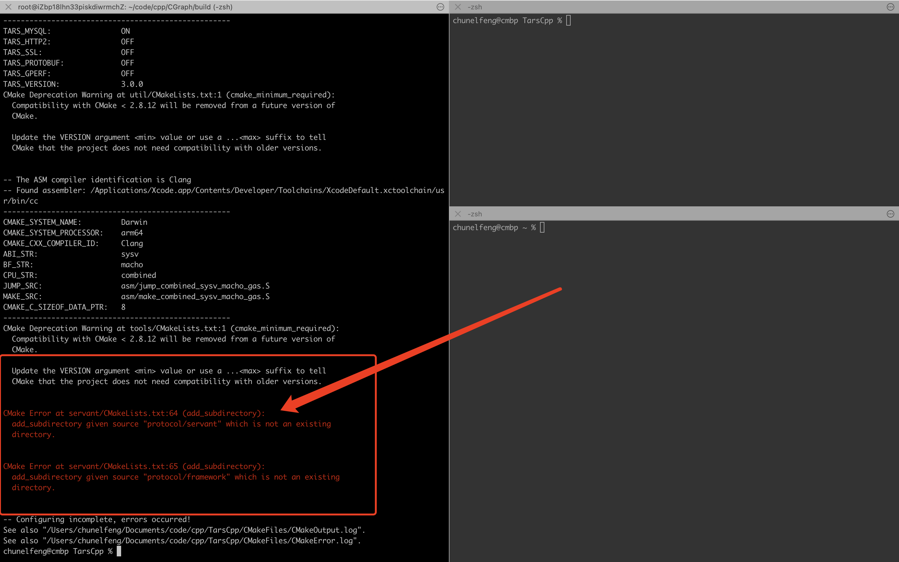
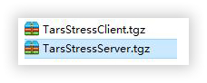

## [TarsCpp 在Windows上的客户端问题](https://github.com//TarsCloud/TarsCpp/issues/232)

在windows上编写客户端程序，tarscpp用Release x64,访问一直阻塞(肯定不是网络问题)，用Debug x64程序报错
相同代码在linux上是可以正常运行的

## [Hi, 请问大家有C++98 的需求么？ 我在最新的master 分支版本上，去掉了协程相关代码且支持C++98。](https://github.com//TarsCloud/TarsCpp/issues/228)

No description provided.

2.0以前的版本就支持98啊

但是3.0 的网络架构更加清晰，性能也更好。

另外把BaBaSSL 也集成进去了.

## [请问下：关于stringToProxy() 函数的 向下转型问题?](https://github.com//TarsCloud/TarsCpp/issues/227)

Hi , 请问下 在stringToProxy() 函数中，其实是new 了一个 父类对象:ServantProxy,  然后将这个父类对象指针向下转型成子类对象指针,然后调用子类里面的方法?   正常来讲，这种做法不对。 但这样做的前提是： 工具生成的子类(比如HelloProxy)里没有非静态数据成员， 请问我理解对么?   谢谢!

yes

## [SR_Port::sighandler  这个函数 有点小问题?  Lamda 引用捕获的问题?](https://github.com//TarsCloud/TarsCpp/issues/226)

貌似可能是有问题, 回头仔细看看

## [请问 ： “CommunicatorEpoll::run()”  为啥要在一个 协程上下文中调用?  ](https://github.com//TarsCloud/TarsCpp/issues/222)

在 TC_Thread::coroutineEntry  中   会调用  pThread->_scheduler->go(std::bind(TC_Thread::threadEntry, pThread));  ：即CommunicatorEpoll::run 函数会再一个协程的环境中运行， 为什么?

代码看这么细?这样做可以使得通信器网络部分和服务器网络部分能在一个线程中混合运行!!

谢谢大神! 协程这块我还没看清楚，现在还不能理解.

提示几点吧:
1 协程的调度是阻塞在epoller上,即通过epoller的唤醒来调度和切换协程
2 网络事件的调度也是通过epoller
这样可以把协程调度和网络调度混合到一起, 从而在3.0版本中, 通信器的线程和服务器端的业务线程/网络线程, 都可以公用了(因为都通过epoller来触发的), 这是核心, 看懂这个, 其他就相对容易理解了.

谢谢！

明白了。 在3.0 中， 通信器的线程和服务端的网络IO 线程，业务处理线程 可以合并为一个线程，这个线程里面用epoller 实现了协程的调度?

是

## [请问下 ： Tarscpp 不支持协程的最稳定的版本是哪个？  我们暂时不想用协程功能  ，谢谢！](https://github.com//TarsCloud/TarsCpp/issues/215)

No description provided.

默认就没启用啊??

默认就没启用啊??

谢谢大神!   另外我想问下V1.0.0 tag 版本是否可用，我们只是用这个版本写一个支持ssl 的客户端就行,   因为特殊原因，我们要兼容以前C++98 的代码

不确定v1.0.0的代码是否支持ssl

谢谢！

## [TarsCPP   Communicator 中 可以disable 掉协程的功能么?](https://github.com//TarsCloud/TarsCpp/issues/214)

No description provided.

## [关于adpter启用队列模式问题](https://github.com//TarsCloud/TarsCpp/issues/212)

如果rpc服务端的adpter调用enableQueueMode()启用队列模式，如果服务端业务线程数量大于客户端的网络线程数量，是不是有部分业务线程一直处于空闲状态？如果我的理解没错的话有没有解决方案？

对,会有这个现象.
其实就是要加大客户端到服务器的连接数, 比如客户端多部署几台服务器之类? 最新版本支持obj名称加#, 来建立多个servant连接, obj#1, obj#2, 但是这个特性只有cpp支持, 且还没有经过大规模验证.

1.多部署几台客户端能缓解，但是对于同一个客户端的请求还是有这种想象吧？
2.假设服务端有3个业务线程，客户端通过obj#1,obj#2,obj#3与一台服务器建立3个连接，是这样的吧？
3.另外，新版这种方式是子servant吗？

1 是的
2 对, 建立三个
3 目前直接communictor->stringToProxy("obj#1") 来创建,  每个数字都代表不同的连接, 但是子servant还没有支持这个(只在http proxy上支持), 理想的是 prx=communictor->stringToProxy("obj"), prx->tars_set_muticonnection(10), 来支持多连接, 内部用子servant来支持, 但是这个还没有实现

新版是3.0后的版本吧

master or release/3.0

ok我看下

## [你好，使用ServantPrx做客户端，怎样可以接收服务端主动发来的消息](https://github.com//TarsCloud/TarsCpp/issues/209)

在使用ServantPrx连接服务端时，都是由ServantPrx发出请求并拿到对方回应，请问有什么好办法，即使不发送请求，也能接收对端消息呢？

这个好像没办法支持, 不发请求, 连接都不会建立, 就不可能收到响应

完全不发请求不行，如果只是不想发业务请求， 可以发个 tars_ping() 请求？

也就是说，目前并不支持由服务器主动向客户端发请求，需要双方都连接对方的servant对吗

客户端都没有发起连接, 服务器怎么向客户端发请求呢?

您好！已建连，现在由服务器发给客户端消息，怎么发送呀

可以参考: https://doc.tarsyun.com/#/dev/tarscpp/tars_push.md
不过目前是必须要先客户端发一个请求上来才行

好的，谢谢您提供的信息

## [make install error](https://github.com//TarsCloud/TarsCpp/issues/198)

执行make install 时出错，之前步骤正常

有 /usr/local/这个目录的权限么?

确实是权限问题，thx

## [M1版本mbp上，按照提示方法，无法直接编译通过](https://github.com//TarsCloud/TarsCpp/issues/186)

如图

你更新一下master分支, 再试一试呢, 按说可以了, 主要手头没有这个电脑, 不太好验证

更新最新master版本，cmake . 的时候，报错如上图。
如果需要m1笔记本 测试的话，请加我我微信： ChunelFeng
我可以提供远程的环境。
这样的话，今后也方便向大佬请教

btw，文档中申明的依赖工具，我也都已经在笔记本上安装了

这个是代码没下载全 git clone要加--recursive

话说你用的这个终端工具是啥?

话说你用的这个终端工具是啥?

是 iterm2，一款用于替代自带 terminal 的工具，有分屏功能
附 下载链接：https://iterm2.com/downloads.html

这个是代码没下载全 git clone要加--recursive

疏忽了。
已经本地编译通过了，感谢大佬。
方便的话，请加个微信，以便今后请教

微信号就是我的名字

thx

## [cpp例程服务发布后无法启动](https://github.com//TarsCloud/TarsCpp/issues/185)

/usr/local/app/tars/tarsnode/data/TestApp.HelloServer/bin/HelloServer: /usr/local/app/tars/tarsnode/data/TestApp.HelloServer/bin/HelloServer: cannot execute binary file
报这个错误：
运行环境和编译环境是同一个主机，编译之后可以执行，打包成tgz之后，上传发布之后，就变成这样无法执行。

## [Application.h中的addServantWithParams未实现？addServant无带4个参数的重载函数](https://github.com//TarsCloud/TarsCpp/issues/177)

如果自定义的Servant需要用到外部的参数，addServantWithParams函数未实现除了用单例是不是就没办法了

bug fix

## [windows 下设置socket非阻塞异常 TarsCpp/util/src/tc_socket.cpp](https://github.com//TarsCloud/TarsCpp/issues/168)

TarsCpp/util/src/tc_socket.cpp

看源码的时候好像这个没有处理传入参数

还真是bug, 还好都是用的非阻塞, 所以一直没有发现这个问题, 你可以提交一个pr, 多谢!

## [refresh-endpoint-interval 配置参数为使用？](https://github.com//TarsCloud/TarsCpp/issues/166)

在代码中未找到  refresh-endpoint-interval 参数读取的逻辑

好像移植的时候搞出bug了, 代码里面写死了, 一般没调整过这个参数, 一直都没有发现, 下个版本改一下

#167 这样修复是否可行

## [TC_HttpRequest，是否支持https协议？我试了一下，好像是不行的](https://github.com//TarsCloud/TarsCpp/issues/162)

TC_HttpRequest stReq;
stReq.setPostRequest(strUrl, strBody);
stReq.setCookie(strCookies);
TC_HttpAsync::RequestCallbackPtr p = new AsyncHttpCallback(strUrl, nUuid);
m_httpAsync.doAsyncRequest(stReq, p, false);

如果这里的strUrl是https协议的，会有问题，请问有没有计划支持https呢

用http_call, 那个支持https

谢谢

## [在特定情况下，TC_Config parse转移字符时有bug](https://github.com//TarsCloud/TarsCpp/issues/157)

配置项只有key，没有value，并且key中含有转义字符（如\t），重复parse，tostr会有问题。如：
std::string in = "<main>\nkey:\tdev.test.1\n</main>";
for (int i = 0; i < 3; ++i) {
    tars::TC_Config config;
    config.parseString(in);
    std::string out = config.tostr();
    cout << "index:" << i << ", out:\n" << out;
    in = out;
}
// output：
index:0, out:
<main>
  key:\tdev.test.1
</main>
index:1, out:
<main>
  key:\\tdev.test.1
</main>
index:2, out:
<main>
  key:\\\\tdev.test.1
</main>

bug fix, 关闭问题了

## [异常里的函数名有误](https://github.com//TarsCloud/TarsCpp/issues/151)

TarsCpp/util/src/tc_bitmap.cpp

         Line 248
      in
      29b0107

 throw TC_BitMap_Exception("[TC_BitMap::get] bit beyond range:"+TC_Common::tostr(iBit)+">"+TC_Common::tostr(_bitmaps.size()));  

TarsCpp/util/src/tc_bitmap.cpp

         Line 260
      in
      29b0107

 throw TC_BitMap_Exception("[TC_BitMap::get] bit beyond range:"+TC_Common::tostr(iBit)+">"+TC_Common::tostr(_bitmaps.size()));  

TarsCpp/util/src/tc_bitmap.cpp

         Line 272
      in
      29b0107

 throw TC_BitMap_Exception("[TC_BitMap::get] bit beyond range:"+TC_Common::tostr(iBit)+">"+TC_Common::tostr(_bitmaps.size()));  

函数名有误

确实, 提交一个pr?

确实, 提交一个pr?

ok，已提交

## [TC_HandleBase::decRef似乎不是线程安全的](https://github.com//TarsCloud/TarsCpp/issues/149)

该函数的代码如下：
class UTIL_DLL_API TC_HandleBase
{
    void decRef()
    {
        if((--_atomic) == 0 && !_bNoDelete)
        {
            _bNoDelete = true;
            delete this;
        }
    }
};

这里(--_atomic) == 0的判断似乎是非线程安全的：假如_atomic == 1，线程1在执行--_atomic后还未执行== 0的判断时，线程2又执行了--_atomic导致_atomic变成了-1，从而两个线程的== 0的判断都是false，导致无法执行delete语句，造成内存泄露。这里似乎得换成CAS操作才行。

(--_atomic) == 0, --就是原子的吧, 相当于原子的sub, 不应该有-1的情况出现,要不你写一个程序试一试, 看看是否有可能减出-1来?

嗯嗯，确实没问题，注意到_atomic是std::atomic<int>而不是普通的int，所以--_atomic不是普通的sub指令而是一个operator--()的函数调用，== 0的比较实际上在比较这个函数返回值，所以这里确实是CAS操作。

## [异常上报宏接口无效](https://github.com//TarsCloud/TarsCpp/issues/141)

下面这三个异常上报接口无效，TarsWeb 没有显示，而 RemoteNotify::report 接口有效。看了实现，区别在 eType 字段值为 REPORT 还是 NOTIFY，看了实现，switch 语句中的 NOTIFY 部分没有上报逻辑，同时还发现 REPORT 部分每次上报都会打一次 ERROR 日志。
//上报普通信息
TARS_NOTIFY_NORMAL(info) 
//上报警告信息
TARS_NOTIFY_WARN(info) 
//上报错误信息
TARS_NOTIFY_ERROR(info)
TarsGo 中修复了这个问题，其实就是把 eType 改为 REPORT，不使用 NOTIFY 类型。想知道 NOTIFY 的设计是有什么考虑？

最早设计上report是给框架内部自身用, notify是给业务使用TARS_NOTIFY_***宏来使用, 框架的report会写到db中, web上展示, notify只是记录了tarsnotify的日志, 监控脚本扫描db触发告警, 这个数据并没有写到db中, 因为业务使用的方式不可控, 如果批量发, 会把db写爆

等后面k8s版本搞完, 计划notify, stat的数据都会写入到es中, 就不存在这个问题了

## [请问可不可以默认不要构建examples目录的内容](https://github.com//TarsCloud/TarsCpp/issues/136)

估计大部分构建TarsFramework的同学都不会用到examples。默认不要构建examples，增加一个make examples命令，这个可以为地球节省很多能源

可以直接注释 CMakeLists.txt 中的 add_subdirectory(examples)

这个问题, 下个版本改一下

## [TC_Shm::init windows缺少_bOwner赋值](https://github.com//TarsCloud/TarsCpp/issues/132)

TarsCpp/util/src/tc_shm.cpp

         Line 43
      in
      67e27bd

 // 首先试图打开一个命名的内存映射文件对象   

确实, 你可以改一下, 提交一个pr

#133

## [tars2c目录下源码中的中文注释乱码且无法恢复](https://github.com//TarsCloud/TarsCpp/issues/131)

在tools/tars2c/目录下, main.c 和 tars2c.h文件中的注释是乱码，用gbk编码也无法查看，是否可以抽空恢复一下？

TarsCpp/tools/tars2c/tars2c.h

         Line 27
      in
      609f925

  * ����tars����c�ļ� 

见：711a5ed#diff-1d22bff44efc186690dc952fa6f8c439876493e07fd3692201995a53bebeee47
这边修改一下

## [服务端节点下线后，客户端并不能及时感知到](https://github.com//TarsCloud/TarsCpp/issues/130)

k8s上每次发布都会变更服务节点的ip，发现发布后，客户端前面一两次请求会报错（找不到服务端节点）。
看了下，目前路由更新是请求时触发的异步请求，在收到响应前的请求都会出错。
并且如果本地有路由cache的话，新建EndpointManager的时候也会直接用缓存中的错误信息

这种情况下如果IP被释放，没有其他服务占用，可能会有路由黑洞的问题，建连需要比较久的时间才能超时。如果有服务占用了，应该会直接拒绝连接。这两种情况可以安全的重试请求，用其他刷新后的可用节点。

确实重试之后没问题，但是会导致前几个请求必然失败，影响体验。

该issue长期未更新。如果问题依旧没解决，欢迎重新打开issue。TARS社区有您更精彩。
Thanks for your supporting. The issue has not been updated for a long time. If the problem is still not resolved, welcome to reopen the issue.

## [服务使用 TC_Mysql 组件时，构建过程会出现链接错误](https://github.com//TarsCloud/TarsCpp/issues/128)

错误日志如下，没有链接到 libmysqlclient，原因是 tars-tools.cmake 的 gen_server 中缺少链接语句
/usr/local/tars/cpp/lib/libtarsutil.a(tc_mysql.cpp.o)：在函数‘tars::TC_Mysql::TC_Mysql()’中：
tc_mysql.cpp:(.text+0x41)：对‘mysql_init’未定义的引用
/usr/local/tars/cpp/lib/libtarsutil.a(tc_mysql.cpp.o)：在函数‘tars::TC_Mysql::TC_Mysql(tars::TC_DBConf const&)’中：
tc_mysql.cpp:(.text+0x112)：对‘mysql_init’未定义的引用
/usr/local/tars/cpp/lib/libtarsutil.a(tc_mysql.cpp.o)：在函数‘tars::TC_Mysql::~TC_Mysql()’中：
tc_mysql.cpp:(.text+0x162)：对‘mysql_close’未定义的引用
/usr/local/tars/cpp/lib/libtarsutil.a(tc_mysql.cpp.o)：在函数‘tars::TC_Mysql::TC_Mysql(std::string const&, std::string const&, std::string const&, std::string const&, std::string const&, int, int)’中：
tc_mysql.cpp:(.text+0x405)：对‘mysql_init’未定义的引用
/usr/local/tars/cpp/lib/libtarsutil.a(tc_mysql.cpp.o)：在函数‘tars::TC_Mysql::disconnect()’中：
tc_mysql.cpp:(.text+0x57d)：对‘mysql_close’未定义的引用
tc_mysql.cpp:(.text+0x584)：对‘mysql_init’未定义的引用
/usr/local/tars/cpp/lib/libtarsutil.a(tc_mysql.cpp.o)：在函数‘tars::TC_Mysql::escapeString(std::string const&)’中：
tc_mysql.cpp:(.text+0x5ee)：对‘mysql_escape_string’未定义的引用
/usr/local/tars/cpp/lib/libtarsutil.a(tc_mysql.cpp.o)：在函数‘tars::TC_Mysql::connect()’中：
tc_mysql.cpp:(.text+0x72b)：对‘mysql_options’未定义的引用
tc_mysql.cpp:(.text+0x75c)：对‘mysql_real_connect’未定义的引用
tc_mysql.cpp:(.text+0x781)：对‘mysql_init’未定义的引用
tc_mysql.cpp:(.text+0x79e)：对‘mysql_error’未定义的引用
tc_mysql.cpp:(.text+0x8c5)：对‘mysql_error’未定义的引用
/usr/local/tars/cpp/lib/libtarsutil.a(tc_mysql.cpp.o)：在函数‘tars::TC_Mysql::realEscapeString(std::string const&)’中：
tc_mysql.cpp:(.text+0xab3)：对‘mysql_real_escape_string’未定义的引用
/usr/local/tars/cpp/lib/libtarsutil.a(tc_mysql.cpp.o)：在函数‘tars::TC_Mysql::execute(std::string const&)’中：
tc_mysql.cpp:(.text+0xb7e)：对‘mysql_real_query’未定义的引用
tc_mysql.cpp:(.text+0xba4)：对‘mysql_errno’未定义的引用
tc_mysql.cpp:(.text+0xbcf)：对‘mysql_error’未定义的引用
tc_mysql.cpp:(.text+0xccc)：对‘mysql_real_query’未定义的引用
/usr/local/tars/cpp/lib/libtarsutil.a(tc_mysql.cpp.o)：在函数‘tars::TC_Mysql::queryRecord(std::string const&)’中：
tc_mysql.cpp:(.text+0xf95)：对‘mysql_real_query’未定义的引用
tc_mysql.cpp:(.text+0xfa5)：对‘mysql_store_result’未定义的引用
tc_mysql.cpp:(.text+0x103b)：对‘mysql_fetch_field’未定义的引用
tc_mysql.cpp:(.text+0x10c3)：对‘mysql_fetch_row’未定义的引用
tc_mysql.cpp:(.text+0x111f)：对‘mysql_fetch_lengths’未定义的引用
tc_mysql.cpp:(.text+0x160f)：对‘mysql_free_result’未定义的引用
tc_mysql.cpp:(.text+0x16f9)：对‘mysql_error’未定义的引用
tc_mysql.cpp:(.text+0x180c)：对‘mysql_errno’未定义的引用
tc_mysql.cpp:(.text+0x1837)：对‘mysql_error’未定义的引用
tc_mysql.cpp:(.text+0x1a65)：对‘mysql_real_query’未定义的引用
/usr/local/tars/cpp/lib/libtarsutil.a(tc_mysql.cpp.o)：在函数‘tars::TC_Mysql::travelRecord(std::string const&, std::function<void (std::map<std::string, std::string, std::less<std::string>, std::allocator<std::pair<std::string const, std::string> > > const&)> const&)’中：
tc_mysql.cpp:(.text+0x1f1f)：对‘mysql_real_query’未定义的引用
tc_mysql.cpp:(.text+0x1f2f)：对‘mysql_store_result’未定义的引用
tc_mysql.cpp:(.text+0x1fcb)：对‘mysql_fetch_field’未定义的引用
tc_mysql.cpp:(.text+0x2014)：对‘mysql_fetch_row’未定义的引用
tc_mysql.cpp:(.text+0x2064)：对‘mysql_fetch_lengths’未定义的引用
tc_mysql.cpp:(.text+0x223f)：对‘mysql_errno’未定义的引用
tc_mysql.cpp:(.text+0x226a)：对‘mysql_error’未定义的引用
tc_mysql.cpp:(.text+0x2459)：对‘mysql_real_query’未定义的引用
tc_mysql.cpp:(.text+0x261f)：对‘mysql_error’未定义的引用
tc_mysql.cpp:(.text+0x2705)：对‘mysql_free_result’未定义的引用

## [新版本服务发现功能不正常](https://github.com//TarsCloud/TarsCpp/issues/127)

旧版本（v2.4.3）只需要: comm.stringToProxy("TestApp.HelloServer.HelloObj")即可, 框架会自动寻址后端的HelloServer服务
前几天更新了最新版2.4.11，发现必须要指定ip:port，即comm.stringToProxy("TestApp.HelloServer.HelloObj@tcp -h 10.120.129.226 -p 20001" , prx)，才能调用服务
即使部署在框架上，也存在这个问题

tarscpp更新到v2.4.12看看, 2.4.11确实发了一个bug

更新了2.4.12，问题还是存在啊，服务发现不了

你框架是怎么部署的, 用什么版本?

如何, 是否还有问题?

部署在docker上，框架、程序都用的2.4.12，还是有问题
你们开发测试是正常的吗

找到bug了, 尽快修复一下, web有bug导致的

修改这个bug了, 更新了web, 可以更新web试一试, 或者直接用v2.4.11这个docker

## [tarscpp 2.4.6版本上的hash调用如果采用异步方式调用服务端，将无法根据不同hash值影射到不同服务。](https://github.com//TarsCloud/TarsCpp/issues/126)

for (int i=1; i<=20; ++i)
prx->tars_hash(i)->async_test();
}
如上示例，如果hash调用采用异步方式调用服务端，服务端开启3个服务副本（k8s部署），最终结果是全部调用到一个服务副本上。
而采用同步方式（prx->tars_hash(i)->test();）则能实现根据不同hash值进行服务影射，3个服务副本都有影射调用。请问最新版本还有此问题吗？

不部署在k8s上的服务有试过没有?

没有试过。

该issue长期未更新。如果问题依旧没解决，欢迎重新打开issue。TARS社区有您更精彩。
Thanks for your supporting. The issue has not been updated for a long time. If the problem is still not resolved, welcome to reopen the issue.

## [请求连接超时如何获取ip](https://github.com//TarsCloud/TarsCpp/issues/118)

https://github.com/TarsCloud/TarsCpp/blob/master/servant/libservant/ServantProxy.cpp#L793
这里是成功了才设置szhost，为什么不无论成功失败都设置呢?
如果确实不能设置，请问如何获取到连接超时的对端ip呢？

超时有可能是拿不到可用节点导致的，由于首次调用可能是节点列表返回后再触发的，这个时候请求在等待队列内超时了，也就没有对端IP了，注意此时AdapterPrx == nullptr。

可是也有拿到了节点列表但是就是链接超时，此时需要知道这个ip，以便于旁路发出告警，记录日志等。现在一刀切，导致有个节点挂掉了，但是日志里没法获取，只能从报错的字符串中尝试正则匹配ip，也太丑陋了

## [Log level error about debug and info](https://github.com//TarsCloud/TarsCpp/issues/115)

## [tarscpp支持arm交叉编译吗？](https://github.com//TarsCloud/TarsCpp/issues/114)

## [通过yum安装cmake3命令，构建应用后执行make upload失败，提示cmake命令不存在](https://github.com//TarsCloud/TarsCpp/issues/112)

## [用 valgrind 检查发现内存泄漏](https://github.com//TarsCloud/TarsCpp/issues/107)

## [如何判断服务是否上线](https://github.com//TarsCloud/TarsCpp/issues/106)

## [关于使用Docker部署如何创建服务](https://github.com//TarsCloud/TarsCpp/issues/105)

## [TC_GZip::compress在输入长度为0时的内存泄漏问题](https://github.com//TarsCloud/TarsCpp/issues/103)

## [配置文件里面不配置threads时，服务无法处理请求](https://github.com//TarsCloud/TarsCpp/issues/100)

如题，不配置这个参数，服务可以正常启动，没有任何报错信息，但会导致无法处理外界请求。看起来是handlethread配置出问题了。

代码已经合并, 多谢!

## [被动染色设置后生产的代码编译报错](https://github.com//TarsCloud/TarsCpp/issues/92)

tars2cpp生产的代码有错，生产的代码含STATUS_GRID_KEY，应该是STATUS_DYED_KEY。

你可以改一下, 提交一个pr?

已经修改了, 多谢!

## [zombie process,no keep alive msg for 60 seconds--程序僵死](https://github.com//TarsCloud/TarsCpp/issues/83)

TARS服务器报这个错误：[alarm]zombie process,no keep alive msg for 60 seconds，然后程序被强制重启，间隔时间不定，有时候较长，有时候很短。
请教大家是否出现类似的情况，程序没有core信息，dmesg也没有错误信息，不知道如何定位

这表示你的服务线程都阻塞住了, 没有给tarsnode上报心跳, 被tarsnode杀掉了, 可以检查一下什么原因

这表示你的服务线程都阻塞住了, 没有给tarsnode上报心跳, 被tarsnode杀掉了, 可以检查一下什么原因

这个服务线程被阻塞了是因为配置的线程数太少了导致的吗？

该issue长期未更新。如果问题依旧没解决，欢迎重新打开issue。TARS社区有您更精彩。
Thanks for your supporting. The issue has not been updated for a long time. If the problem is still not resolved, welcome to reopen the issue.

## [怎么编译具体版本的代码](https://github.com//TarsCloud/TarsCpp/issues/68)

如题，例如想编译 2.4.1 版本的代码
$ mkdir build
$ cd build
$ cmake ..
提示如下错误

CMake Error at servant/CMakeLists.txt:64 (add_subdirectory):
  add_subdirectory given source "protocol/servant" which is not an existing
  directory.

CMake Error at servant/CMakeLists.txt:65 (add_subdirectory):
  add_subdirectory given source "protocol/framework" which is not an existing
  directory.
如果按照编译指引下载代码，
git clone https://github.com/TarsCloud/TarsCpp.git --recursive
这样不是只能编译最新 master 代码？

问别人找到了，去 https://github.com/TarsCloud/TarsProtocol 下来放到对应目录即可

## [发布tgz文件失败](https://github.com//TarsCloud/TarsCpp/issues/66)

提示为系统内部错误，用pm2 log 0来看好像有一条报错，13001

这个错误太少了, 看看这下面日志有啥提示: /usr/local/app/web/log/

{"level":"error","message":"127.0.0.1|admin|TaskController.js:155|[TaskController.addTask]: Error: call remote server timeout(no adapter selected)\n    at tars.AdminRegProxy.addTaskReq (/usr/local/app/web/app/service/util/rpcClient/index.js:56:39)  ","timestamp":"2020-04-28 09:59:23.986"}
{"level":"error","message":"127.0.0.1|admin|MonitorController.js:59|Error: call remote server timeout(no adapter selected)\n    at tars.MonitorQueryProxy.query (/usr/local/app/web/app/service/util/rpcClient/index.js:56:39)  ","timestamp":"2020-04-28 10:02:46.644"}
{"level":"error","message":"127.0.0.1|admin|MonitorController.js:90|Error: call remote server timeout(no adapter selected)\n    at tars.MonitorQueryProxy.query (/usr/local/app/web/app/service/util/rpcClient/index.js:56:39)  ","timestamp":"2020-04-28 10:02:56.369"}
{"level":"error","message":"127.0.0.1|admin|MonitorController.js:59|Error: call remote server timeout(no adapter selected)\n    at tars.MonitorQueryProxy.query (/usr/local/app/web/app/service/util/rpcClient/index.js:56:39)  ","timestamp":"2020-04-28 10:02:57.756"}
{"level":"error","message":"127.0.0.1|admin|TaskController.js:155|[TaskController.addTask]: Error: call remote server timeout(no adapter selected)\n    at tars.AdminRegProxy.addTaskReq (/usr/local/app/web/app/service/util/rpcClient/index.js:56:39)  ","timestamp":"2020-04-28 10:42:26.140"}
我打开了日志，看起来像是timeout

restartServer_inner 'tars.tarsstat_192.168.216.129' exception:node '192.168.216.129' not registered or heartbeart timeout,please check for it
所有的服务状态都是off，点击重启之后报错都是一样的
HelloServer也是一样

这是我的本机服务器，ifconfig看到的IP，我用虚拟机跑的
我运行/usr/local/app/tars/tars-start.sh 的时候没有看到错误啊

root       2937   1314  0 20:05 pts/0    00:00:04 /usr/local/app/tars/tarsAdminRegistry/bin/tarsAdminRegistry --config=/usr/local/app/tars/tarsnode/data/tars.tarsAdminRegistry/conf/tars.tarsAdminRegistry.config.conf
root       2967   1314  0 20:05 pts/0    00:00:06 /usr/local/app/tars/tarsregistry/bin/tarsregistry --config=/usr/local/app/tars/tarsnode/data/tars.tarsregistry/conf/tars.tarsregistry.config.conf
root       3012   1314  1 20:05 pts/0    00:00:08 /usr/local/app/tars/tarsnotify/bin/tarsnotify --config=/usr/local/app/tars/tarsnode/data/tars.tarsnotify/conf/tars.tarsnotify.config.conf
root       3032   1314  0 20:05 pts/0    00:00:05 /usr/local/app/tars/tarsconfig/bin/tarsconfig --config=/usr/local/app/tars/tarsnode/data/tars.tarsconfig/conf/tars.tarsconfig.config.conf
root       3087   1314  0 20:06 pts/0    00:00:05 /usr/local/app/tars/tarslog/bin/tarslog --config=/usr/local/app/tars/tarsnode/data/tars.tarslog/conf/tars.tarslog.config.conf
root       3118   1314  0 20:06 pts/0    00:00:05 /usr/local/app/tars/tarspatch/bin/tarspatch --config=/usr/local/app/tars/tarsnode/data/tars.tarspatch/conf/tars.tarspatch.config.conf
root       3151   1314  0 20:06 pts/0    00:00:05 /usr/local/app/tars/tarsproperty/bin/tarsproperty --config=/usr/local/app/tars/tarsnode/data/tars.tarsproperty/conf/tars.tarsproperty.config.conf
root       3188   1314  0 20:06 pts/0    00:00:05 /usr/local/app/tars/tarsqueryproperty/bin/tarsqueryproperty --config=/usr/local/app/tars/tarsnode/data/tars.tarsqueryproperty/conf/tars.tarsqueryproperty.config.conf
root       3252   1314  0 20:06 pts/0    00:00:03 /usr/local/app/tars/tarsquerystat/bin/tarsquerystat --config=/usr/local/app/tars/tarsnode/data/tars.tarsquerystat/conf/tars.tarsquerystat.config.conf
root       3294   1314  0 20:06 pts/0    00:00:04 /usr/local/app/tars/tarsstat/bin/tarsstat --config=/usr/local/app/tars/tarsnode/data/tars.tarsstat/conf/tars.tarsstat.config.conf
看起来这些服务都在运行？

该issue长期未更新。如果问题依旧没解决，欢迎重新打开issue。TARS社区有您更精彩。
Thanks for your supporting. The issue has not been updated for a long time. If the problem is still not resolved, welcome to reopen the issue.

## [疑似网络包过大导致内存泄漏](https://github.com//TarsCloud/TarsCpp/issues/63)

客户端请求的数据超过10M时，服务端报错且内存不断上涨，最终进程导致OOM，服务端报错内容
ERROR|[TARS]recv [10.0.0.1:45678],packet error.
使用pporf工具，已打印出相关svg图，详见附件：
pprof001.svg.zip

是哪个版本?

按说默认的数据包最大只能是10M, 超过10M rpc会失败

./tarslog --version
TARS:1.1.1
超过10M之后，会一直失败，问题是服务端失败后内存不断增加。

似乎没有复现这个问题?

目前仅在tarslog上发现这个问题，客户端不再发送超过10M的包之后再没有出现。如果不好复现，可以考虑先关闭issue吧。

该issue长期未更新。如果问题依旧没解决，欢迎重新打开issue。TARS社区有您更精彩。
Thanks for your supporting. The issue has not been updated for a long time. If the problem is still not resolved, welcome to reopen the issue.

## [StressServer: No such file or directory](https://github.com//TarsCloud/TarsCpp/issues/59)

Q
I ran into this error
[TC_File :: copyFile] error: /usr/local/app/tars/tarsnode/tmp/download/BatchPatching/tars.StressServer/StressServer: No such file or directory

My deployment method: docker (stable)
A
See if there is a file for this service in the node's directory?
/ data / app / tars / tarsnode

Q

A
What Programming language do you use for service?
How do you pack the service?
Q
C ++
Directly compile tarscpp following example TarsStressServer
A
What is the name of your service packaged  .tgz file?
It should be the same to the management platform
Q

A
There must be Tars in front of the service name, corresponding to the .tgz package, and the application name does not matter .
[TC_File :: copyFile] error: /usr/local/app/tars/tarsnode/tmp/download/BatchPatching/tars.StressServer/StressServer: No such file or directory

Q

By the way, does this pressure test bash script also need to be modified?
A
The application name and service name when deploying the service should correspond to Example,

Application Name : Test
Service Name: TarsStessServer
OBJ Name : StressObj

## [README.zh.md 底部案例链接404](https://github.com//TarsCloud/TarsCpp/issues/58)

rt

readme fix, thx!

## [源码安装报错：fatal error: servant/BaseF.h: 没有那个文件或目录  #include "servant/BaseF.h"](https://github.com//TarsCloud/TarsCpp/issues/55)

No description provided.

代码没有下载全吧, 用submodule管理的
git clone https://github.com/TarsCloud/TarsFramework.git --recursive

发现可能是make -j4 并行编译的问题, 已经修复

## [a bug for TC_Common::strto when input unsigned char](https://github.com//TarsCloud/TarsCpp/issues/49)

TC_Common::strto1  lack specialization for unsigned char,  when run the code below, the value of t
will become 0; because the operator >> of istringstream ignores space and other blank character;
string s;
s.push_back(32);  // 32 is ascii for space
unsigned char t = 255;
t = TC_Common::strto(s);  // now the value of t  become 0

merged thx!

## [Demo生成问题，使用HelloWorld CPP里面的命令生成的时候，出现了以下问题](https://github.com//TarsCloud/TarsCpp/issues/48)

[ 50%] Linking CXX executable ../bin/HelloServer
/usr/local/tars/cpp/lib/libtarsutil.a(tc_thread.cpp.o): In function tars::TC_Thread::start()': tc_thread.cpp:(.text+0xb79): undefined reference to pthread_create'
/usr/local/tars/cpp/lib/libtarsservant.a(Application.cpp.o): In function tars::Application::main(tars::TC_Option const&)': Application.cpp:(.text.startup+0x8a3): undefined reference to pthread_create'
Application.cpp:(.text.startup+0x1002): undefined reference to pthread_create' /usr/local/tars/cpp/lib/libtarsutil.a(tc_logger.cpp.o): In function tars::TC_LoggerThreadGroup::start(unsigned long)':
tc_logger.cpp:(.text+0x1e3): undefined reference to pthread_create' /usr/local/tars/cpp/lib/libtarsutil.a(tc_timeprovider.cpp.o): In function tars::TC_TimeProvider::getInstance()':
tc_timeprovider.cpp:(.text+0x132): undefined reference to `pthread_create'
collect2: error: ld returned 1 exit status
src/CMakeFiles/HelloServer.dir/build.make:122: recipe for target 'bin/HelloServer' failed
make[2]: *** [bin/HelloServer] Error 1
CMakeFiles/Makefile2:223: recipe for target 'src/CMakeFiles/HelloServer.dir/all' failed
make[1]: *** [src/CMakeFiles/HelloServer.dir/all] Error 2
Makefile:83: recipe for target 'all' failed
make: *** [all] Error 2
这似乎是由于生成tars静态库libtarsutil.a的时候没有正确链接lpthread导致？但是我之前的利用源码编译tars框架和tarsweb的时候是完全按照指南做的，没有发现有需要特别链接lphtread的地方

HelloServer, 怎么来的?
你用的版本似乎很老啊?现在都是c++11做得, 用的std::thread, 按说不应该有pthread_create这种提示?

我用了官方文档中创建服务这一项的命令：/usr/local/tars/cpp/script/cmake_tars_server.sh TestApp HelloServer Hello
令，现在会报出“/usr/bin/ld: cannot find -lnghttp2_static”的错误

这是因为你编译tars没有开启http2, 这种情况下:
cmake .. -DTARS_HTTPS=OFF -DTARS_SSL=OFF
make
可以参考:
https://tarscloud.github.io/TarsDocs/dev/tarscpp/tars-http2.html

除此以外，我重启服务器后，切换到root用户，再次运行pm2 start tars-web-system，返回了script not found 的错误，似乎pm2查找脚本的目录是当前目录

运行了，重启之后依然无效
步骤是 root用户下运行/linux-install.sh 然后source ~/.bashrc
提示192.168.216.XXX:3000 可以访问，然后网页访问进去发现500，127.0.0.1：3001 无法连接
重启
切换到root用户，运行pm2 start tars-node-web ，无法找到script

另外之前两个问题我已经解决了，第一个我选择更新GCC到5.3+，第二个我安装了libnghttp2,并复制libnghttp2.a重命名libnghttp2_static.a

不是我需不需要的问题，我完全按照https://tarscloud.github.io/TarsDocs/installation/source.html这个里面的说明进行安装的，
然后我试图运行https://tarscloud.github.io/TarsDocs/hello-world/tarscpp.html
分别遇见了打不开tars-node-web、找不到-lnghttp2_static的问题
后者已经解决

## [2.0什么时候可以有个可编译运行的版本？](https://github.com//TarsCloud/TarsCpp/issues/47)

No description provided.

## [AuthF.h不存在](https://github.com//TarsCloud/TarsCpp/issues/46)

Scanning dependencies of target tarsservant
[ 47%] Building CXX object tarscpp/servant/libservant/CMakeFiles/tarsservant.dir/AdapterProxy.cpp.o
In file included from /home/wincsb/Tars/framework/tarscpp/servant/servant/AdapterProxy.h:23:0,
from /home/wincsb/Tars/framework/tarscpp/servant/libservant/AdapterProxy.cpp:17:
/home/wincsb/Tars/framework/tarscpp/servant/servant/EndpointInfo.h:22:19: fatal error: AuthF.h: No such file or directory
#include "AuthF.h"
^

## [QueryEpBase::refreshReg中switch case遗漏break](https://github.com//TarsCloud/TarsCpp/issues/41)

    if(bSync)
        {
            vector<tars::EndpointF> activeEp;
            vector<tars::EndpointF> inactiveEp;
            int iRet = 0;
            switch(type)
            {
                case E_ALL:
                    {
                        iRet = _queryFPrx->findObjectById4Any(_objName,activeEp,inactiveEp);
                        break;
                    }
                case E_STATION:
                    {
                        iRet = _queryFPrx->findObjectByIdInSameStation(_objName,sName,activeEp,inactiveEp);
                    }
                case E_SET:
                    {
                        iRet = _queryFPrx->findObjectByIdInSameSet(_objName,sName,activeEp,inactiveEp);
                        break;
                    }
                case E_DEFAULT:
                default:
                    {
                        if(ClientConfig::SetOpen || !_invokeSetId.empty())
                        {
                               //指定set调用时，指定set的优先级最高
                            string setId = _invokeSetId.empty()?ClientConfig::SetDivision:_invokeSetId;
                            iRet = _queryFPrx->findObjectByIdInSameSet(_objName,setId,activeEp,inactiveEp);
                        }
                        else
                        {
                            iRet = _queryFPrx->findObjectByIdInSameGroup(_objName,activeEp,inactiveEp);
                        }
                        break;
                    }
            }
            doEndpoints(activeEp, inactiveEp, iRet, true);
        }

case E_STATION:情况下是否遗忘添加break？

应该是掉了, 不过一般不会进入到这个分支, 有空可以提交一个pull request

该issue长期未更新。如果问题依旧没解决，欢迎重新打开issue。TARS社区有您更精彩。
Thanks for your supporting. The issue has not been updated for a long time. If the problem is still not resolved, welcome to reopen the issue.

## [TC_File::load2str(const string &sFullFileName)有bug](https://github.com//TarsCloud/TarsCpp/issues/38)

while循环体内通过字符数组暂存文件内容时，覆盖了\0结尾，导致读出来的文件中间会有多出的乱码

已经更新一个, 你再看看

## [新手编译测试Client可能遇到的问题的排查办法](https://github.com//TarsCloud/TarsCpp/issues/37)

https://github.com/TarsCloud/TarsCpp/blob/master/docs/tars_cpp_quickstart.md#54-%E5%AE%A2%E6%88%B7%E7%AB%AF%E5%90%8C%E6%AD%A5%E5%BC%82%E6%AD%A5%E8%B0%83%E7%94%A8%E6%9C%8D%E5%8A%A1
编译客户端的时候，直接在putty上把源码复制上去会出现少复制的问题 导致编译报错。
In file included from /usr/local/tars/cpp/include/servant/Global.h:28:0, from /usr/local/tars/cpp/include/servant/Communicator.h:23, from main.cpp:2: /usr/local/tars/cpp/include/tup/Tars.h: In instantiation of 'void tars::TarsInputStream<ReaderT>::skipField(uint8_t) [with ReaderT = tars::BufferReader; uint8_t = unsigned char]': /usr/local/tars/cpp/include/tup/Tars.h:1125:13:   required from 'void tars::TarsInputStream<ReaderT>::read(tars::Int32&, uint8_t, bool) [with ReaderT = tars::BufferReader; tars::Int32 = int; uint8_t = unsigned char]' /usr/local/tars/cpp/include/servant/StatF.h:472:43:   required from here /usr/local/tars/cpp/include/tup/Tars.h:942:27: error: '__bswap_32' was not declared in this scope len = ntohl(len); ^ /usr/local/tars/cpp/include/tup/Tars.h: In instantiation of 'void tars::TarsInputStream<ReaderT>::read(tars::Int64&, uint8_t, bool) [with ReaderT = tars::BufferReader; tars::Int64 = long int; uint8_t = unsigned char]': /usr/local/tars/cpp/include/tup/Tars.h:1163:33:   required from 'void tars::TarsInputStream<ReaderT>::read(tars::UInt32&, uint8_t, bool) [with ReaderT = tars::BufferReader; tars::UInt32 = unsigned int; uint8_t = unsigned char]' /usr/local/tars/cpp/include/tup/Tars.h:1453:37:   required from 'void tars::TarsInputStream<ReaderT>::read(std::map<_K1, _T1, _C1, _A1>&, uint8_t, bool) [with K = tars::StatMicMsgHead; V = tars::StatMicMsgBody; Cmp = std::less<tars::StatMicMsgHead>; Alloc = std::allocator<std::pair<const tars::StatMicMsgHead, tars::StatMicMsgBody> >; ReaderT = tars::BufferReader; uint8_t = unsigned char]' /usr/local/tars/cpp/include/servant/StatF.h:987:46:   required from here /usr/local/tars/cpp/include/tup/Tars.h:1188:33: error: '__bswap_32' was not declared in this scope n = (Int32) ntohl(n); ^ In file included from /usr/local/tars/cpp/include/servant/Global.h:40:0, from /usr/local/tars/cpp/include/servant/Communicator.h:23, from main.cpp:2: /usr/local/tars/cpp/include/util/tc_logger.h: In member function 'virtual std::string tars::TarsLogType::get_init_time()': /usr/local/tars/cpp/include/util/tc_logger.h:1257:9: warning: control reaches end of non-void function [-Wreturn-type] } ^ /usr/local/tars/cpp/include/util/tc_logger.h: In member function 'virtual std::string tars::TarsLogType::get_new_time(int ': /usr/local/tars/cpp/include/util/tc_logger.h:1274:9: warning: control reaches end of non-void function [-Wreturn-type] } ^ make: *** [main.o] Error 1 
请编译的小伙伴留意这个问题检测下代码是否缺少代码。
`
nclude 
#include "servant/Communicator.h"
#include "Hello.h"
`

## [TarsStressServer/TarsStressServer.mk找不到此文件](https://github.com//TarsCloud/TarsCpp/issues/35)

No description provided.

有需要自己把server copy出来写一个编译, 目前框架的编译都是用cmake 管理的了, 不用makefile, 就没这个文件了

## [编译安装TARS失败，请问是什么原因？](https://github.com//TarsCloud/TarsCpp/issues/32)

您好，我是参照官方文档：https://tarsphp.gitbook.io/doc/huan-jing-da-jian/platform 安装 TARS。在执行 ./build.sh all 这一步时报错了。
环境：
centos 7.7
php 7.3.9
mysql 8.0.13
swoole 4.4.7
我的步骤与官方文档不同的有两处：
1.因为我已安装过 Mysql，所以官方文档里那一步【安装mysql5.7】我就跳过了。
2.【安装pm2】这一步，nvm 我安装的版本是 0.34.0，【nvm install v8.11.3】我安装的版本是 v10.16.3。
报错信息如下：

Linking CXX executable tars2android
[ 34%] Built target tars2android
Scanning dependencies of target tars2node
[ 35%] Building CXX object tarscpp/tools/tars2node/CMakeFiles/tars2node.dir/code_generator.cpp.o
[ 35%] Building CXX object tarscpp/tools/tars2node/CMakeFiles/tars2node.dir/file_util.cpp.o
[ 35%] Building CXX object tarscpp/tools/tars2node/CMakeFiles/tars2node.dir/gen_js.cpp.o
[ 36%] Building CXX object tarscpp/tools/tars2node/CMakeFiles/tars2node.dir/gen_js_dts.cpp.o
[ 36%] Building CXX object tarscpp/tools/tars2node/CMakeFiles/tars2node.dir/gen_proxy.cpp.o
[ 37%] Building CXX object tarscpp/tools/tars2node/CMakeFiles/tars2node.dir/gen_proxy_dts.cpp.o
[ 37%] Building CXX object tarscpp/tools/tars2node/CMakeFiles/tars2node.dir/gen_server.cpp.o
[ 38%] Building CXX object tarscpp/tools/tars2node/CMakeFiles/tars2node.dir/gen_server_dts.cpp.o
[ 38%] Building CXX object tarscpp/tools/tars2node/CMakeFiles/tars2node.dir/gen_server_imp.cpp.o
[ 39%] Building CXX object tarscpp/tools/tars2node/CMakeFiles/tars2node.dir/idl_scan.cpp.o
[ 39%] Building CXX object tarscpp/tools/tars2node/CMakeFiles/tars2node.dir/idl_util.cpp.o
[ 39%] Building CXX object tarscpp/tools/tars2node/CMakeFiles/tars2node.dir/main.cpp.o
Linking CXX executable tars2node
../../util/lib/libtarsutil.a(tc_encoder.cpp.o)：在函数‘tars::TC_Encoder::gbk2utf8(char*, int&, char const*, int)’中：
/home/wwwroot/TarsFramework/tarscpp/util/src/tc_encoder.cpp:39：对‘libiconv_open’未定义的引用
/home/wwwroot/TarsFramework/tarscpp/util/src/tc_encoder.cpp:75：对‘libiconv_close’未定义的引用
/home/wwwroot/TarsFramework/tarscpp/util/src/tc_encoder.cpp:66：对‘libiconv’未定义的引用
../../util/lib/libtarsutil.a(tc_encoder.cpp.o)：在函数‘tars::TC_Encoder::gbk2utf8(std::string const&)’中：
/home/wwwroot/TarsFramework/tarscpp/util/src/tc_encoder.cpp:84：对‘libiconv_open’未定义的引用
/home/wwwroot/TarsFramework/tarscpp/util/src/tc_encoder.cpp:118：对‘libiconv’未定义的引用
/home/wwwroot/TarsFramework/tarscpp/util/src/tc_encoder.cpp:134：对‘libiconv_close’未定义的引用
../../util/lib/libtarsutil.a(tc_encoder.cpp.o)：在函数‘tars::TC_Encoder::utf82gbk(char*, int&, char const*, int)’中：
/home/wwwroot/TarsFramework/tarscpp/util/src/tc_encoder.cpp:203：对‘libiconv_open’未定义的引用
/home/wwwroot/TarsFramework/tarscpp/util/src/tc_encoder.cpp:214：对‘libiconv’未定义的引用
/home/wwwroot/TarsFramework/tarscpp/util/src/tc_encoder.cpp:223：对‘libiconv_close’未定义的引用
/home/wwwroot/TarsFramework/tarscpp/util/src/tc_encoder.cpp:218：对‘libiconv_close’未定义的引用
../../util/lib/libtarsutil.a(tc_encoder.cpp.o)：在函数‘tars::TC_Encoder::gbk2utf8(std::string const&, std::vector<std::string, std::allocatorstd::string >&)’中：
/home/wwwroot/TarsFramework/tarscpp/util/src/tc_encoder.cpp:142：对‘libiconv_open’未定义的引用
/home/wwwroot/TarsFramework/tarscpp/util/src/tc_encoder.cpp:178：对‘libiconv’未定义的引用
/home/wwwroot/TarsFramework/tarscpp/util/src/tc_encoder.cpp:196：对‘libiconv_close’未定义的引用
collect2: 错误：ld 返回 1
make[2]: *** [tarscpp/tools/tars2node/tars2node] 错误 1
make[1]: *** [tarscpp/tools/tars2node/CMakeFiles/tars2node.dir/all] 错误 2
make: *** [all] 错误 2

谢谢您！

没有安装libiconv库, 根据你的os可以搜索一下怎么安装

谢谢

## [管理平台无法发布程序](https://github.com//TarsCloud/TarsCpp/issues/31)

按照Install.zh.md的安装步骤，安装完成后，登录管理平台，发布一个测试服务EchoServer，但是“设置状态”为Active，当前状态为Off，发布服务其实也是失败的

求助怎么办？

是否方便贴一下日志？

可以升级到新的框架和web管理平台, 发布错误的原因目前可以在服务管理页面看到了

## [protocol/servant is not an existing](https://github.com//TarsCloud/TarsCpp/issues/29)

这个目录需要手动创建吗？ run log 如下：
[user@centos TarsCpp]$ cmake .
-- Could NOT find Protobuf (missing: Protobuf_INCLUDE_DIR)
CMake Error at servant/CMakeLists.txt:64 (add_subdirectory):
  add_subdirectory given source "protocol/servant" which is not an existing
  directory.

-- Configuring incomplete, errors occurred!
See also "/home/me/TarsCpp/CMakeFiles/CMakeOutput.log".
See also "/home/me/TarsCpp/CMakeFiles/CMakeError.log".

不需要手动创建的，protocol是另一个git项目，git clone的使用需要添加参数--recursive将所有子模块clone下来，重新clone一下就可以了

OK.  git clone --recursive 可用，无错误提示。

## [我看sample里的push使用的是非tars协议，如果是使用tars协议。应该怎么处理呢？](https://github.com//TarsCloud/TarsCpp/issues/28)

如题。

具体场景? 自己处理tars的编解码即可, 另外生成的服务端代码里面, 可以push tars的接口的, 客户端ServantProxy有一个设置callback的接口

该issue长期未更新。如果问题依旧没解决，欢迎重新打开issue。TARS社区有您更精彩。
Thanks for your supporting. The issue has not been updated for a long time. If the problem is still not resolved, welcome to reopen the issue.

## [单元测试代码编译不通过](https://github.com//TarsCloud/TarsCpp/issues/27)

TarsCpp/unittest/script 路径下，执行./run_test.sh， 编译不通过，显示如下错误：
/usr/local/TarsCpp/unittest/testcode/source/testcase/tup_encode_decode_test.cpp: In member function ‘virtual void TupUniPacketTest_encode_and_decode_using_UniPacket_Test::TestBody()’:
/usr/local/qiuxin/TarsCpp/unittest/testcode/source/testcase/tup_encode_decode_test.cpp:177:52: error: variable-sized object ‘szBirthday’ may not be initialized
char szBirthday[info.birthday.size() + 1] = {0};
^
/usr/local/TarsCpp/unittest/testcode/source/testcase/tup_encode_decode_test.cpp:179:52: warning: comparison between signed and unsigned integer expressions [-Wsign-compare]
for (int i = 0; i < info.birthday.size(); ++i)
^
/usr/local/TarsCpp/unittest/testcode/source/testcase/tup_encode_decode_test.cpp:213:65: error: variable-sized object ‘szBirthday’ may not be initialized
char szBirthday[it->second.birthday.size() + 1] = {0};
^
/usr/local/TarsCpp/unittest/testcode/source/testcase/tup_encode_decode_test.cpp: At global scope:
/usr/local/TarsCpp/unittest/testcode/source/testcase/tup_encode_decode_test.cpp:14:15: warning: ‘std::string str2hex(const string&)’ defined but not used [-Wunused-function]
static string str2hex(const string& sBuffer)
^
make[2]: *** [CMakeFiles/testcase.dir/usr/local/TarsCpp/unittest/testcode/source/testcase/tup_encode_decode_test.cpp.o] Error 1
make[1]: *** [CMakeFiles/testcase.dir/all] Error 2
make: *** [all] Error 2
Make testcase failed! Please check you code first.

该issue长期未更新。如果问题依旧没解决，欢迎重新打开issue。TARS社区有您更精彩。
Thanks for your supporting. The issue has not been updated for a long time. If the problem is still not resolved, welcome to reopen the issue.

## [tars2xx工具的命名空间和TUP协议的命名空间不一致](https://github.com//TarsCloud/TarsCpp/issues/25)

tars2cs生成出来的文件，使用的是Wup.tars
而TUP协议里面使用的是Tup.tars。
这个估计是遗漏了，可以修改一下。

该issue长期未更新。如果问题依旧没解决，欢迎重新打开issue。TARS社区有您更精彩。
Thanks for your supporting. The issue has not been updated for a long time. If the problem is still not resolved, welcome to reopen the issue.

## [开发文档不完善问题](https://github.com//TarsCloud/TarsCpp/issues/24)

开发文档不完善

1. 缺少工具类使用文档
2. 接口定义文件.tars的使用描述不完整
3. 文档缺少对.tars文件生成的.h文件中回调函数的说明

1. 缺少工具类使用文档 
常用的tostr, strto, mysql操作 等没有相关文档，也没有提示可以使用，开发者可能会重新实现重复造轮子，降低开发效率。
目前可行的方式是通过阅读TarsCpp/util/include/util/ 下的相关类的头文件的注释了解如何使用
2. 接口定义文件.tars的使用描述不完整 

文档分布比较散，TarsCpp部分没有关于tars协议数据类型的使用和自定义类型的定义规范，只有Tars项目下的介绍文档(Introduction.md)提到了

接口定义返回值，返回数据如何定义没有明确说明，踩了一定的坑才知道怎么操作，缺少相关的开发规范

module TestApp
{

struct testInfo {
	1 require string name;
	2 require int    number;
}

interface Hello
{
    int test();
    int testfunction(string in, out string rsp);
};

};

对于需要返回结果的服务，对应的参数的响应参数前需要添加关键字out，文档中没有明确说明。TarsCpp/docs/tars_cpp_quickstart.md文档中提到接口文件的语法和使用参见tars_tup.md，没有给出连接，TarsCpp下没有相关文档，TarsCloud/TarsTup下有tars_tup.md，只对tars协议进行了说明，没有具体说明.tars接口问价语法和规范。

同时接口返回值int Tars::Int32 对应服务调用的状态，如ret=0表示服务调用成功，文档没有明确说明，只在一处地方提到(TarsCpp/docs/tars_cpp_user_guide.md)。

同时对自定义数据类型，.tars文件中可以通过定义struct 来定义，相关的语法和支持类型在开发文档中没有提到，只在TarsCloud/Tars/Introduction.md中的4.1部分提到，没有在开发文档中说明

经过两天的开发摸索，大致了解了tars服务接口的开发规范，仅限于个人理解，希望尽快有相关的开发规范：

接口返回值应使用int类型，即tars::Int32，用于表示服务调用状态。直接返回请求的数据消息也是可以的，但是tars接口协议提供了另一种机制来返回响应消息
.tars文件中对返回参数使用了关键字out，这在文档中没有提到，通过对比了多个Demo例子后发现。只有添加了out关键字，相关的参数才会出现在通过.tars文件生成的.h文件的回调函数的参数中。返回参数通过引用传递，在接口实现函数中或者回调函数中进行赋值即可。
tars协议支持自定义类型的，需要在.tars 文件中定义，使用struct定义由基本类型组成的复杂类型，可以定义必选和可选参数。支持的基础类型暂时只能参照TarsCloud/Tars/Introduction.md: 4.1

3. 文档缺少对.tars文件生成的.h文件中回调函数的说明 
大部分使用都是通过列举Demo代码的方式，但是一般都是简单Demo，缺少很多必要的阐述，比如一些异步调用，调用相关接口方法加前缀async，没有返回数据的参数，需要在重写的回调函数中操作，文档中也没有提及。

## [Demo problem](https://github.com//TarsCloud/TarsCpp/issues/21)

在示例：TarsCpp/examples/QuickStartDemo/HelloServer/
make 成功 后尝试启动，提示缺少config.conf：start server with config, for example: ./HelloServer --config=config.conf
并没有找到config.conf的规范，还是我启动的方式有问题？

运行：
/usr/local/tars/cpp/script/create_tars_server.sh TestApp HelloServer Hello
应该生成以下：HelloServer.h HelloServer.cpp Hello.tars HelloImp.h HelloImp.cpp makefile
但实际上，生成的不是Hello系列文件，
生成了：
DemoServantImp.cpp  DemoServant.tars  DemoServer.h
DemoServantImp.h    DemoServer.cpp    makefile
而代码中include又是HelloServer.h...等hello文件...
这应该是个bug。

make tar,然后在管理端上上传发布之后，就会自动生成配置文件的。
$ps -ef|grep Hello
jammyxu   8208  1116  0 14:46 pts/4    00:00:00 grep --color=auto Hello
root     15608 12178  0 8月22 ?       00:01:17 /usr/local/app/tars/tarsnode/data/TestApp.HelloServer/bin/HelloServer --config=/usr/local/app/tars/tarsnode/data/TestApp.HelloServer/conf/TestApp.HelloServer.config.conf

该issue长期未更新。如果问题依旧没解决，欢迎重新打开issue。TARS社区有您更精彩。
Thanks for your supporting. The issue has not been updated for a long time. If the problem is still not resolved, welcome to reopen the issue.

## [纯客户端如何使用协程？](https://github.com//TarsCloud/TarsCpp/issues/20)

我参考ServantHandle::run()里main协程方式的实现写的纯客户端使用协程的代码，不知道对不对，有没有官方的代码示例？
`CoroutineScheduler * g_coroSched = NULL;
const static uint32_t g_coroPoolSz = 1024 * 1024;
const static size_t g_coroStackSz = 128 * 1024;
void doSomething() {
while(true) {
// do something
}
}
static void initCoro() {
g_coroSched = new CoroutineScheduler();
g_coroSched->init(g_coroPoolSz, g_coroStackSz);
g_coroSched->createCoroutine(doSomething);
ServantProxyThreadData * pSptd = ServantProxyThreadData::getData();
pSptd->_sched = g_coroSched;
g_coroSched->run();
}
int main() {
initCoro();
return 0;
}`

我看example里有：
串行：
examples\CoroutineDemo\testCoro
并行：
examples\CoroutineDemo\testParallelCoro

## [README.zh.md last link is wrong](https://github.com//TarsCloud/TarsCpp/issues/17)

中文版readme最后一个链接点击会跳到
“https://github.com/TarsCloud/Tars.git下的Install.md” 这个错误链接
而不是“https://github.com/TarsCloud/Tars.git”

已修改

## [xxx.tars文件中2个enum类型含有相同的成员，生成的xxx.h文件编译会报错："error: redeclaration of xxx"](https://github.com//TarsCloud/TarsCpp/issues/15)

xxx.tars文件中2个enum类型含有相同的成员，生成的xxx.h文件编译会报错："error: redeclaration of xxx"
生成文件后需要手工改enum的命名空间。

目前还不支持enum的成员用命令空间来区别，也就是不支持不同的enum有定义相同的成员。

## [这里错了，应该是增加当前连接数](https://github.com//TarsCloud/TarsCpp/issues/14)

TarsCpp/util/include/util/tc_epoll_server.h

         Line 544
      in
      8a8145e

 void increaseNowConnection(); 

已经作出修改， 等待官方 merge。

thanks

## [有错别字](https://github.com//TarsCloud/TarsCpp/issues/12)

TarsCpp/servant/servant/AppProtocol.h

         Line 185
      in
      711a5ed

      * 普通二禁止包普tars请求包 

thx

## [docs/tars_protobuf_cpp.md 是GB2312编码，docs下其他的都是utf8。可以统一下编码吗](https://github.com//TarsCloud/TarsCpp/issues/7)

如题

#9 Someone had pulled the request. Please wait for the official merge.

thanks

## [can support windows， android， ios ？](https://github.com//TarsCloud/TarsCpp/issues/6)

can support windows， android， ios ，arm？

No, currently only Linux is supported.

## [TarsCpp\servant\protocol当前是空的](https://github.com//TarsCloud/TarsCpp/issues/5)

麻烦尽快合入protocol @ 4c74f49这个提交，当前编译不通过

## [complice_tars arguments error](https://github.com//TarsCloud/TarsCpp/issues/1)

TarsCpp/servant/tup/CMakeLists.txt
complice_tars(OUT_DEPENDS_LIST "") 应该改为
complice_tars(OUT_DEPENDS_LIST "" "")

@tangramor  已经修改好了。请关闭本 issue.

