## [zipkin filter 不支持采样率、不支持 kafka 方式上报、不支持多个 servant](https://github.com//TarsCloud/TarsGo/issues/372)


zipkin filter 不支持采样率，默认使用了 AlwaysSample
上报只支持 http 方式
当多个 servant 共存时，trace 上报无法区分是哪个 servant，也未上报端口


## [go.mod的go版本是1.13实际上用了go1.16才有的函数](https://github.com//TarsCloud/TarsGo/issues/361)

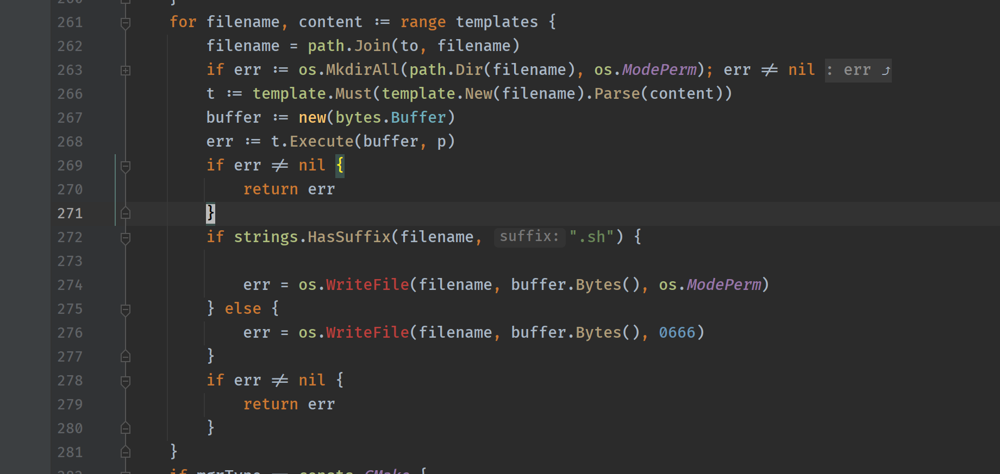
代码行tars/tools/tarsgo/internal/base/templates.go:274

os.WriteFile 这个函数到go 1.16才支持


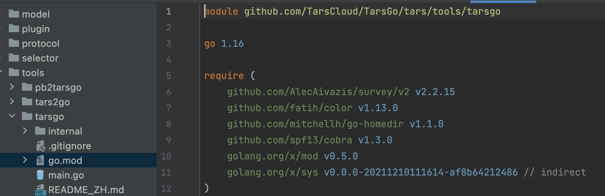


看到了,


## [新版的tars2go不支持相对路径](https://github.com//TarsCloud/TarsGo/issues/360)

## [Move docs to TarsCloud/TarsDocs](https://github.com//TarsCloud/TarsGo/issues/352)

## [日志记录支持json格式](https://github.com//TarsCloud/TarsGo/issues/351)

## [Go mod tidy failed](https://github.com//TarsCloud/TarsGo/issues/350)

## [new version creater has issue](https://github.com//TarsCloud/TarsGo/issues/346)

## [新版本接口返回void生成代码存在语法错误](https://github.com//TarsCloud/TarsGo/issues/340)

## [Upgrade all examples to go mod](https://github.com//TarsCloud/TarsGo/issues/336)

## [有个服务跑着跑着就挂了，日志也没记录原因](https://github.com//TarsCloud/TarsGo/issues/318)

## [编译报错](https://github.com//TarsCloud/TarsGo/issues/315)

## [日志输出大小限制失效](https://github.com//TarsCloud/TarsGo/issues/312)

## [怎么自定义负载均衡](https://github.com//TarsCloud/TarsGo/issues/310)

## [文件句柄泄漏](https://github.com//TarsCloud/TarsGo/issues/309)

## [tars-go与client交互协议](https://github.com//TarsCloud/TarsGo/issues/306)

## [tars2go不支持include参数 和 单文件定义多个模块](https://github.com//TarsCloud/TarsGo/issues/305)

## [tars transport readtimeout not work](https://github.com//TarsCloud/TarsGo/issues/304)

## [如何使用TarsGo获取平台服务配置下配置列表里的配置](https://github.com//TarsCloud/TarsGo/issues/300)

## [gtime data race](https://github.com//TarsCloud/TarsGo/issues/299)

## [可否支持HTTP/2](https://github.com//TarsCloud/TarsGo/issues/298)

## [嵌套 MsgOutGameShowF3 byte [3]  这样生成go 文件有错](https://github.com//TarsCloud/TarsGo/issues/297)


struct MsgOutGameShowF3{
1 require byte count[3];
};
struct MsgOutGameShowF64{
1 require byte count[64];
};
struct MsgOutGameShowF20{
1 require byte count[20];
};
struct DMsgOutGameShow{
10 require MsgOutGameShowF3	fff[5];
12 require MsgOutGameShowF64   ffgf[5];
};


是需要定义数组吗？可以用vector


另外一个端使用的c++, 用vector 有点问题


是定义的二维数组


二维数组可以这样用，如果C++侧使用有问题，可能在tarscpp项目提下issue
1 require vector<vector<byte>> count;


## [handletimeout ineffective!!!](https://github.com//TarsCloud/TarsGo/issues/294)

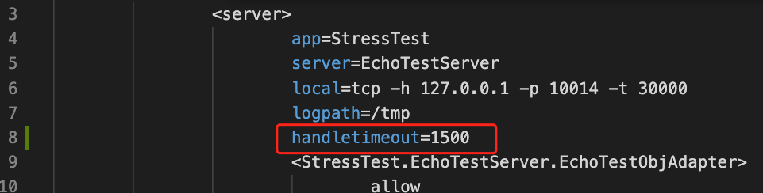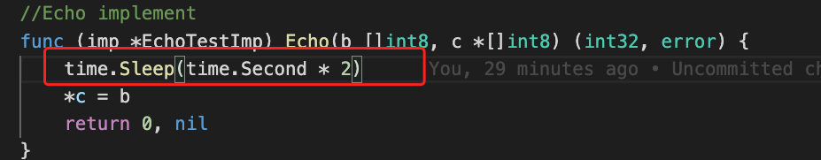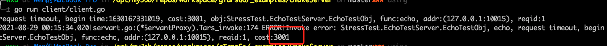
Describe the bug
handletimeout ineffectived, when the actual execution time exceeds the handletime but does not exceed the remote call timeout
To Reproduce
1、set handletimeout 1500

2、sleep 2 seconds


simulate execution time with sleep func

** Version info **


go version go1.16.6 darwin/amd64


TarsGo v1.1.6


Expected behavior
get server invoke timeout error and cost close to handletimeout
Actual behavior
get unexcepet err and cost close to  async-invoke-timeout


## [Wrong index in endpoint manager](https://github.com//TarsCloud/TarsGo/issues/292)


endpointmanager.go

sort.Slice(sortedEps, func(i int, j int) bool {
--	return crc32.ChecksumIEEE([]byte(sortedEps[i].Key)) < crc32.ChecksumIEEE([]byte(sortedEps[i].Key))
++   return crc32.ChecksumIEEE([]byte(sortedEps[i].Key)) < crc32.ChecksumIEEE([]byte(sortedEps[j].Key))
})


Would you like to submit a fix?


#293


## [go 1.16版本 $GOPATH下并没有src目录，故而无视使用 tools 下的生成服务模版的脚本](https://github.com//TarsCloud/TarsGo/issues/291)


请问无有优雅的方法继续按文档方式使用tools下的脚本新建服务模版和使用cmake打包


默认的服务模板应该要升级到go mod了，然后不用关心GOPATH的问题。 @aiyogg 是否有意愿提个PR?


默认的服务模板应该要升级到go mod了，然后不用关心GOPATH的问题。 @aiyogg 是否有意愿提个PR?

我理解的是需要用go翻译下那几个shell脚本，将初始化服务模板能单独作为 module 来install? 工作节奏缓和下来了我可以试试


默认的服务模板应该要升级到go mod了，然后不用关心GOPATH的问题。 @aiyogg 是否有意愿提个PR?

我理解的是需要用go翻译下那几个shell脚本，将初始化服务模板能单独作为 module 来install? 工作节奏缓和下来了我可以试试

是的，欢迎提PR.


@aiyogg 这里有进展吗？


@aiyogg 这里有进展吗？

目前没有进展-_-!


先关闭，有必要再重新打开


## ["github.com/openzipkin-contrib/zipkin-go-opentracing"  v0.3.5 版本报错](https://github.com//TarsCloud/TarsGo/issues/290)


tars/plugin/zipkintracing/zipkintracing.go  43行
建议升级到v0.4.5


This could be closed once #275  get merged.


TKS


zipkin-go-opentracing 需升级到v0.4.5，go.mod里面需要改了


Fixed in #320


## [tars2go声明map后没有make导致的问题](https://github.com//TarsCloud/TarsGo/issues/285)


genSwitchCase中的map只有声明没有make，导致后面使用map时报assignment to entry in nil map错误
已经提了pr： #286


## [tarsgo rpc server 配置参数maxroutine 无法按照servant级别配置](https://github.com//TarsCloud/TarsGo/issues/283)

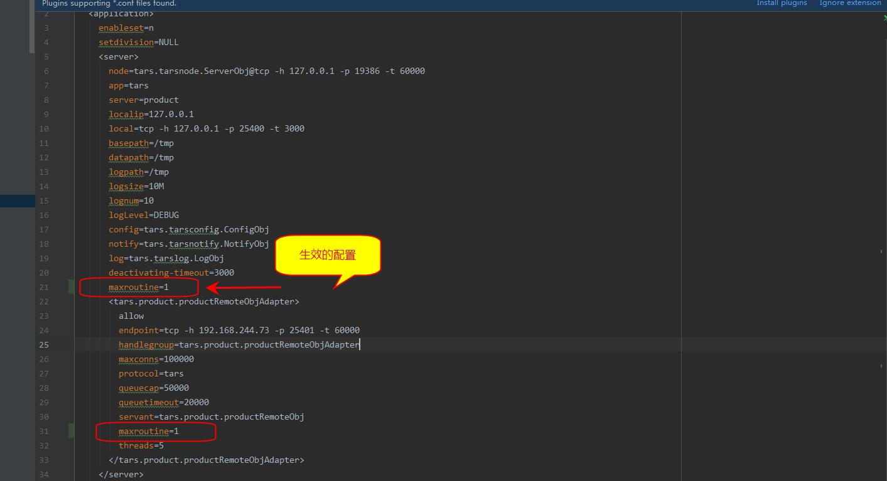
tarsgo rpc server 有个maxroutine 这个配置目前是针对server级别进行的，无法针对每个servant进行单独配置


绝大部分场景下一个服务一个servant就够了，这里的单独配置是否有必要性？


## [Support access log](https://github.com//TarsCloud/TarsGo/issues/280)


希望能配置可打印请求的入参与出参


## [服务优雅退出时没有先关闭注册中心心跳](https://github.com//TarsCloud/TarsGo/issues/279)


TarsGo/tars/application.go


         Line 439
      in
      4ba2325


 teerDown(nil) 


graceShutdown函数在进程退出时，将listen端口关闭，然后处理退出信号前的请求，最后才去停止心跳。导致服务升级时，如果请求量过大时，在优雅退出的一段时间内，注册中心仍然认为该退出进程存活。会使得其他服务进程继续请求正在退出的进程然后返回超时错误。
是否将teerDown停止keepalive心跳函数放在listen端口关闭之后会比较合理，这样在注册中心就不会认为这个进程还存活。


新的请求应该会到新的进程


新的请求应该会到新的进程

注册中心认为它是存活的，新请求应该还是会到这个要退出的进程吧。
因为现在我们在进行服务升级的时候发现会出现超时请求服务。排查问题应该是这里导致的，退出进程实际没有提供服务，但是客户端和注册中心认为他是存活的，所以继续发送请求然后请求超时。


是什么协议的服务？优雅退出时间是多少？


是什么协议的服务？优雅退出时间是多少？

使用的是pb协议，优雅退出时间是默认的60000ms


graceShutdown主要是解决服务优雅重启的问题，优雅退出应该要另外方案，@MeiJunh 这里是否相关想法或方案？


如无相关回复就先关闭，有需要可以重新打开


## [支持基于请求参数的版本路由](https://github.com//TarsCloud/TarsGo/issues/276)


每个节点都打上版本标识和路由规则，利用Context中的字段进行路由
比如
版本v1的规则是{"k1": {"prefix": "abc"}}，则只有Context中有k1字段，且前缀是abc时才会路由到v1版本。


Relative issue：TarsCloud/Tars#846.


## [fd leak on server side when close connection](https://github.com//TarsCloud/TarsGo/issues/273)


We experienced a problem due to fd leak on server side. Here is the detail:

When client send requests with packet size greater than MaxPackageLength which result in a PACKAGE_ERROR on server side
Server close the connection by calling (*net.TCPConn).Close()
But the connection is NOT closed since we make a copy of the underlying fd in (*transport.tcpHandler).Handle
All subsequent requests from the client on the same connection failed with timeout error

This could result in:

run out of fd on server side
DoS if the client is also a Tars server which is the situation we faced


fixed by #274


## [接口处理groutine panic进程直接退出](https://github.com//TarsCloud/TarsGo/issues/271)


发现接口函数没有开启新groutine，panic后也会导致整个进程的panic。
查看框架内部实际上在invoke的时候是有调用CheckPanic的，


TarsGo/tars/tarsprotocol.go


         Line 36
      in
      26a06ec


 defer CheckPanic() 


但是这个CheckPanic函数会直接exit，没有达到recover的效果，和请求分发在同一个groutine的panic是否也需要业务方自己recover，例如在filter中进行recover


TarsGo/tars/panic.go


         Line 21
      in
      26a06ec


 rogger.FlushLogger() 


这2行可以去掉，考虑可能出现大量panic，可以在生成panic文件加个频控。
@MeiJunh 方便提个MR？


TarsGo/tars/panic.go


         Line 21
      in
      26a06ec


 rogger.FlushLogger() 


这2行可以去掉，考虑可能出现大量panic，可以在生成panic文件加个频控。
@MeiJunh 方便提个MR？

这个频控监测是加到内存里么？感觉仅仅是监测日志记录其实不太能及时的获取到panic信息，进程直接down掉对业务影响又比较大，目前我们这边在使用的时候是遇到panic后进行告警信息通知发送。
看是直接去掉
rogger.FlushLogger()
os.Exit(-1)
这两行提一个mr，还是需要加上以函数文件为指标的panic频率监控再提一个mr？


TarsGo/tars/panic.go


         Line 21
      in
      26a06ec


 rogger.FlushLogger() 


这2行可以去掉，考虑可能出现大量panic，可以在生成panic文件加个频控。
@MeiJunh 方便提个MR？

这个频控监测是加到内存里么？感觉仅仅是监测日志记录其实不太能及时的获取到panic信息，进程直接down掉对业务影响又比较大，目前我们这边在使用的时候是遇到panic后进行告警信息通知发送。
看是直接去掉
rogger.FlushLogger()
os.Exit(-1)
这两行提一个mr，还是需要加上以函数文件为指标的panic频率监控再提一个mr？

加一个OnPanic的回调感觉比较合理，默认回调是把panic信息打到本地文件，频控可以用golang.org/x/time/rate，没有频控可以评估下，可能问题也不大。


TarsGo/tars/panic.go


         Line 21
      in
      26a06ec


 rogger.FlushLogger() 


这2行可以去掉，考虑可能出现大量panic，可以在生成panic文件加个频控。
@MeiJunh 方便提个MR？

这个频控监测是加到内存里么？感觉仅仅是监测日志记录其实不太能及时的获取到panic信息，进程直接down掉对业务影响又比较大，目前我们这边在使用的时候是遇到panic后进行告警信息通知发送。
看是直接去掉
rogger.FlushLogger()
os.Exit(-1)
这两行提一个mr，还是需要加上以函数文件为指标的panic频率监控再提一个mr？

加一个OnPanic的回调感觉比较合理，默认回调是把panic信息打到本地文件，频控可以用golang.org/x/time/rate，没有频控可以评估下，可能问题也不大。

回调函数可以直接加上去，针对panic所在文件的频控添当达到频控次数后是进行日志刷盘以及os.exit么？
另外我尝试了一下好像没有推送代码的权限。


TarsGo/tars/panic.go


         Line 21
      in
      26a06ec


 rogger.FlushLogger() 


这2行可以去掉，考虑可能出现大量panic，可以在生成panic文件加个频控。
@MeiJunh 方便提个MR？

这个频控监测是加到内存里么？感觉仅仅是监测日志记录其实不太能及时的获取到panic信息，进程直接down掉对业务影响又比较大，目前我们这边在使用的时候是遇到panic后进行告警信息通知发送。
看是直接去掉
rogger.FlushLogger()
os.Exit(-1)
这两行提一个mr，还是需要加上以函数文件为指标的panic频率监控再提一个mr？

加一个OnPanic的回调感觉比较合理，默认回调是把panic信息打到本地文件，频控可以用golang.org/x/time/rate，没有频控可以评估下，可能问题也不大。

回调函数可以直接加上去，针对panic所在文件的频控添当达到频控次数后是进行日志刷盘以及os.exit么？
另外我尝试了一下好像没有推送代码的权限。

应该是说 PR
Fork 后修改，然后创建一个 PR 即可


TarsGo/tars/panic.go


         Line 21
      in
      26a06ec


 rogger.FlushLogger() 


这2行可以去掉，考虑可能出现大量panic，可以在生成panic文件加个频控。
@MeiJunh 方便提个MR？

这个频控监测是加到内存里么？感觉仅仅是监测日志记录其实不太能及时的获取到panic信息，进程直接down掉对业务影响又比较大，目前我们这边在使用的时候是遇到panic后进行告警信息通知发送。
看是直接去掉
rogger.FlushLogger()
os.Exit(-1)
这两行提一个mr，还是需要加上以函数文件为指标的panic频率监控再提一个mr？

加一个OnPanic的回调感觉比较合理，默认回调是把panic信息打到本地文件，频控可以用golang.org/x/time/rate，没有频控可以评估下，可能问题也不大。

回调函数可以直接加上去，针对panic所在文件的频控添当达到频控次数后是进行日志刷盘以及os.exit么？
另外我尝试了一下好像没有推送代码的权限。

应该是说 PR
Fork 后修改，然后创建一个 PR 即可

谢谢，已经提了pr，https://github.com/TarsCloud/TarsGo/pull/278，看是否满足要求，只加了一个onPanic回调函数，没有对panic进行频控。


## [在json反序列化时，int64会出现精度丢失的问题](https://github.com//TarsCloud/TarsGo/issues/267)


TarsGo/tars/tools/tars2go/gen_go.go


        Lines 1467 to 1468
      in
      7301d63


 		var _jsonDat_ map[string]interface{} 


 		err = json.Unmarshal(_is.ToBytes(), &_jsonDat_) 


具体问题和解决办法参考：https://zhuanlan.zhihu.com/p/114286134
建议修复一下


## [提个建议，install_tarsnode.sh 这个脚本加个可以配置安装路径参数](https://github.com//TarsCloud/TarsGo/issues/266)


线上环境一般没有/usr/local 权限，
建议tarsnode安装可以配置安装路径


可以转到https://github.com/TarsCloud/TarsFramework提个issue。


## [Support for registering multiple client and server filter ](https://github.com//TarsCloud/TarsGo/issues/263)


As far as I know, TarsGo supports registering client filter with tars.RegisterClientFilter() method.
And if you have multiple client filter, you may have to use tars.RegisterPreClientFilter and tars.RegisterPostClientFilter.
However, I don't want to split any of them to one pre filter and one post filter  when I register multiple client filters.
For example, I register client breaker filter and client zipkin filter, they may both have pre handle logic and post handle logic.
In the current way, I can only register one client filter. And another client filter has to be split to one pre filter and one client filter.
I think it's a good idea that TarsGo supports muliple filter with using middlewares.


## [Support error code for RPC error](https://github.com//TarsCloud/TarsGo/issues/261)


建议在rpc返回的error中提供错误码的支持：
在服务端的实现类返回的error可以是tars.Error{Code: 222, Message: "error msg"}
在客户端自动将有错误码的报错err转成*tars.Error类型
客户端的调用方可以通过codedErr, ok := err.(*tars.Error)来获取类型及错误码


## [unknown plugin "tarsrpc"](https://github.com//TarsCloud/TarsGo/issues/260)


我按照pb2tarsgo的教程使用时，报下面的错误，请问怎么处理？
[root@localhost proto]# protoc --go_out=plugins=tarsrpc:. helloworld.proto
WARNING: Package "github.com/golang/protobuf/protoc-gen-go/generator" is deprecated.
A future release of golang/protobuf will delete this package,
which has long been excluded from the compatibility promise.
2020/11/24 21:38:40 WARNING: Missing 'go_package' option in "helloworld.proto",
please specify it with the full Go package path as
a future release of protoc-gen-go will require this be specified.
See https://developers.google.com/protocol-buffers/docs/reference/go-generated#package for more information.
--go_out: protoc-gen-go: unknown plugin "tarsrpc"


use github.com/golang/protobuf v1.3.5


## [use yaml or toml for conf file](https://github.com//TarsCloud/TarsGo/issues/257)


this is the current conf file, which I think very hard to read
<tars>
  <application>
    <server>
       #each adapter configuration 
       <TestApp.HelloServer.HelloObjAdapter>
            #allow Ip for white list.
            allow
            # ip and port to listen on  
            endpoint=tcp -h 10.120.129.226 -p 20001 -t 60000
            #handlegroup
            handlegroup=TestApp.HelloServer.HelloObjAdapter
            #max connection 
            maxconns=200000
            #portocol, only tars for now.
            protocol=tars
            #max capbility in handle queue.
            queuecap=10000
            #timeout in ms for the request in the queue.
            queuetimeout=60000
            #servant 
            servant=TestApp.HelloServer.HelloObj
            #threads in handle server side implement code. goroutine for golang.
            threads=5
       </TestApp.HelloServer.HelloObjAdapter>
    </server>
  </application>
</tars>
Proposed config file
server:
  TestApp.HelloServer.HelloObjAdapter: 
     allow: true
      ....


This configuration format is consistent with other language service frameworks, so it is not easy to change to yaml


unfortunately, these xml attributes are so hard to read


## [希望可以把 pb2tarsgo 独立出来](https://github.com//TarsCloud/TarsGo/issues/256)


直接 go get 生成到 bin 目录
当然，更好的 tars2go 可以命令行直接生成项目，不要用 shell 文件初生成，现在都是 go mod 模式，去到 mod 找文件夹很麻烦


go get github.com/go-tars/protoc-gen-tars@master

protoc --go_out=. --tars_out=. example.proto


## [go vet complain about code generated by tars2go](https://github.com//TarsCloud/TarsGo/issues/254)


Code generated by tars2go tool contains the following line:
err = fmt.Errorf("Decode reqpacket fail, error version:", tarsReq.IVersion)
When run against go vet, it complains:
Errorf call has arguments but no formatting directives


## [support request timeout for single api](https://github.com//TarsCloud/TarsGo/issues/253)


As far as I know, tars only support timeout for a client , meanwhile all the request sent with this client use the same timeout. As we know, different api timeout requirement is remarkable, please support this feature, or could any good gay tell me how to alternative solution?


Solution:
current.SetClientTimeout(ctx, timeout)


## [High concurrency response occasional timeout](https://github.com//TarsCloud/TarsGo/issues/251)


压测时，偶现 服务端 回包超时的情况。
晚点提个pr


## [Tars2go support outdir in parent directory when using go mod](https://github.com//TarsCloud/TarsGo/issues/248)


tarsgo --outdir=../autogen  --module=github.com/defool/proj/s1 Server.tars
The generated code can not be complied because the import path is github.com/defool/proj/s1/../autogen/xxx.
The expected import path should be github.com/defool/proj/autogen/xxx.


## [Command line tool using tarsgo prints error the server config path empty](https://github.com//TarsCloud/TarsGo/issues/247)


I don't think it's necessary to print the error message the server config path empty.


## [Support prometheus exporter](https://github.com//TarsCloud/TarsGo/issues/246)


Tars支持使用Prometheus监控
描述
当前Tars有merics监控上报，但是缺少Tp95/Tp99耗时、波动告警等能力，希望能引入云原生Prometheus监控组件提升Tars服务的监控能力。
目标

Tars服务端/客户端都引入Prometheus SDK
提供数据上报到prometheus的解决方案
在grafana配置监控面板，可显示调用总量、失败量、tp95耗时、tp99耗时。筛选条件包含主调服务、被调服务。

方案（仅供参考）

基于Tars的filter机制，实现client filter，将rpc调用数据使用Prometheus sdk记录
Prometheus对接k8s名字服务，通过label方式筛选，自动收集部署在k8s中的tars服务监控数据

需要技能及相关引用

Prometheus对接k8s
Tars filter
Grafana


## [什么玩意儿啊，文档能不能搞好点啊](https://github.com//TarsCloud/TarsGo/issues/241)


No description provided.


## [【timeout】timeout for very low latency tars request. ](https://github.com//TarsCloud/TarsGo/issues/239)

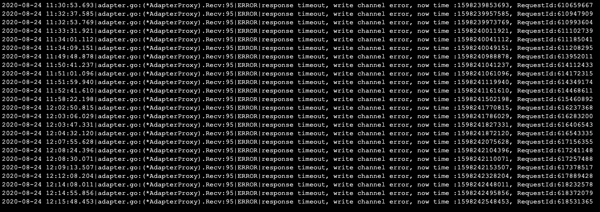

Seems it's a concurrent issue with sending/receiving channel.
try this code below:
func Test_TarsSelect(t *testing.T) {
	trueCount := 0
	falseCount := 0
	for i := 0; i < 10000; i++ {
		if TarsThread() {
			trueCount++
		} else {
			falseCount++
		}
	}

	fmt.Println("trueCount:", trueCount)
	fmt.Println("falseCount:", falseCount)
}

func TarsThread() bool {
	someChan := make(chan bool)
	var gotChan bool

	go Send(someChan)
	select {
	case <-time.After(1 * time.Millisecond):
	case gotChan = <-someChan:
	}


	return gotChan
}


func Send(someChan chan bool){
	select {
	case someChan <- true:
	default:
	}
}
the outputs will be something like:
trueCount: 9902
falseCount: 98


try to fix this issue:
#240


## [函数返回值和错误信息只能二选一？](https://github.com//TarsCloud/TarsGo/issues/238)


`
func (imp *HelloImp) Test() (int32, error) {
//这样客户端可以获得 返回值 -1 和 nil
return -1, nil
}
func (imp *HelloImp) Test() (int32, error) {
//这样客户端只能获得 返回值 0 和 “test error”
return -1, errors.New("test error")
}
`
当服务端函数返回值 error存在时，第一个返回值信息就不会返回！
这个问题怎么解？


刚刚测试了，没有任何问题。和框架没关系，可能是你的go代码写的有问题。。断点调试下


刚刚测试了，没有任何问题。和框架没关系，可能是你的go代码写的有问题。。断点调试下

我的环境是：TarsFramework >= v2.4.4, TarsGo >= v1.1.4
协议：
int Test(int x);
实现代码：
func (imp *EthereumWalletImp) Test(ctx context.Context, t int32) (int32, error) { //Doing something in your function //... if t > 10 { return t, errors.New("What?") } return t, nil }
通过后台提供的在线接口调试：
参数为：
-13
结果：
{"consttime":0.7267720103263855,"arguments":{},"return":-13}
参数为：
20
结果：
{"costtime":2.1954140663146973,"error":{"code":1,"message":"What?"}}
确实是 存在 error时，另外一个参数不返回
不管是我客户端代码 还是 官方的后台 接口调试 返回都是这样


该issue长期未更新。如果问题依旧没解决，欢迎重新打开issue。TARS社区有您更精彩。
Thanks for your supporting. The issue has not been updated for a long time. If the problem is still not resolved, welcome to reopen the issue.


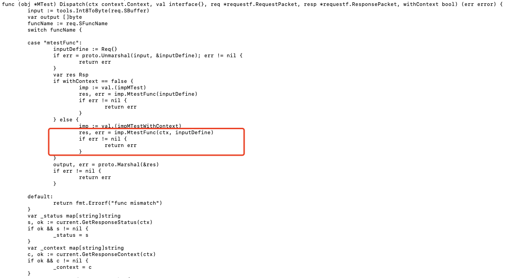

刚刚测试了，没有任何问题。和框架没关系，可能是你的go代码写的有问题。。断点调试下

这个应该是自动生成代码中的逻辑。
我新建了一个pb，然后构建，其中自动生成的Dispatch函数中会在function返回err时直接返回err而没有将rsp塞回至output。可能是使用方式不一样导致会有一些误解。
如下图，当函数返回err则dispatch直接返回了


## [pb2tarsgo 问题正确无法生成](https://github.com//TarsCloud/TarsGo/issues/236)


环境 ubuntu 12.04, protocol  3.6.1 , 根据教程配置出来的protoc-gen-go
--go_out: protoc-gen-go: Plugin output is unparseable:
我在mac环境配过一下，可以生成 ，但生成 pb.go 并没有rpc相关的service代码。
发现插件没有走tarsrpc里的Generate方法。能否查证一下


## [Poor performance of ReportStat](https://github.com//TarsCloud/TarsGo/issues/235)


var sendQps = rate.NewLimiter(5000, 100)
func report() {
	msg := &tars.Message{
		Req: &requestf.RequestPacket{
			SFuncName:    "Sum",
			SServantName: "App.DefooT2",
		},
	}
	for i := 0; i < 100000; i++ {
		sendQps.Wait(context.Background())
		startTime := time.Now().UnixNano()
		tars.ReportStat(msg, 1, 0, 0)
		ttt := time.Now().UnixNano() - startTime
		useTime <- ttt
	}
}

var useTime = make(chan int64, 1000)
func showUseTime() {
	tk := time.NewTicker(time.Second)
	count := 0
	totalTime := 0
	maxTime := 0
	for {
		select {
		case <-tk.C:
			if count > 0 {
				fmt.Printf("%v count: %d, mean time: %d ms, max %d ms\n",
					time.Now().Format(time.RFC3339), count, totalTime/count, maxTime)
				count = 0
				totalTime = 0
				maxTime = 0
			}
		case ts := <-useTime:
			ms := int(ts / int64(time.Millisecond))
			if ms > maxTime {
				maxTime = ms
			}
			count++
			totalTime += ms
		}
	}
}


This demo shows that tars.ReportStat costs tens ms every 10 seconds.


## [Support Https for servant](https://github.com//TarsCloud/TarsGo/issues/232)


Now,  TasGo only support Http servant,  TarsGo should support  Https  servant.


Supported this in #319


## [TarsGo客户端不会自动上报stat和property](https://github.com//TarsCloud/TarsGo/issues/231)


TarsGo客户端，如果不是部署在Tars框架内的话，不会自动上报state和property。而TarsJava即使不部署在Tars框架内，也会正常自动上报，这个特性还是很好用的，用到的场景也比较多，因为很多情况下，服务是不会部署在Tars框架内的。
使用的是当前最新的TarsGo release版本1.1.4，不知道有没有计划解决这一问题。


确实有必要实现，是否有愿意提供方案或直接提PR？


确实有必要实现，是否有愿意提供方案或直接提PR？

我准备提pr，怎么成功 contributors


看了提交的方案，感觉对原application.go做了比较多侵入性的改造，会原有功能稳定性有潜在的影响，建议调整一下：
最终只需要调整statf.go和property.go即可，以statf为例，可以增加一个类似StatConfig的结构体，将依赖的clientconfig/serverconfig字段放到里面，另外加一个类似InitForClientMode函数入口，传入上报功能依赖的Communitor和StatConfig。


看了提交的方案，感觉对原application.go做了比较多侵入性的改造，会原有功能稳定性有潜在的影响，建议调整一下： 最终只需要调整statf.go和property.go即可，以statf为例，可以增加一个类似StatConfig的结构体，将依赖的clientconfig/serverconfig字段放到里面，另外加一个类似InitForClientMode函数入口，传入上报功能依赖的Communitor和StatConfig。

对标了java的实现，让使用起来更透明化


v1.1.8 开始支持自动上报


## [请问有没有方便的上传tgz包的工具啊](https://github.com//TarsCloud/TarsGo/issues/229)


开发阶段，随便改点东西，打包，点上传，点发布，这个步骤很多，浪费时间啊。
没有工具能在客户端直接把tgz包post到web管理端吗？


可以在本地启动开发调试啊


可以使用TarsWeb的API upload_and_publish 来上传发布，接口具体信息可以看到 TarsWeb 的接口文档，TarsGo的cmake管理的项目中可以直接通过make命令上传发布，实际上也是通过Web的API，具体用法可以参考TarsGo的关于cmake管理项目的文档


https://doc.tarsyun.com/adminer/start/index.html#/tarsdoc/dev/tarsgo/spec.md
其实可以用cmake来管理代码, 可以直接make upload来上传


## [日期类型日志的清理只会处理近30个周期的日志文件](https://github.com//TarsCloud/TarsGo/issues/228)


我的程序指定的小时周期，因为是测试阶段，过了一个周末，结果上周的日志都未被清理，因为没有写不会触发清理
建议遍历目录下所有文件，用DateWriter.name和后缀做匹配，抠出文件名中表示日期的部分，time.Parse后和Now()做差值
相关方法：tars/util/rogger/logwriter.go DateWriter.cleanOldLogs()


welcome pr~


这个场景确实比较少见，如果有需求可以提个PR @ealyn


## [Contributing.md / CONTRIBUTING.md](https://github.com//TarsCloud/TarsGo/issues/226)


这两个文件在大小写敏感的文件系统(NTFS)上无法共存，并且因此go命令要求不允许同级目录存在此种情况。
建议删除Contributing.md
更多细节: golang/go#33778


That's a good idea. We'll add this to the next release.


## [tars2go 1.1.4 对于返回值非int或者void的生成代码默认Write_int32](https://github.com//TarsCloud/TarsGo/issues/222)


比如   vector< EndpointF > findObjectById(string id);
编译报错   cannot use funRet (type []EndpointF) as type int32 in argument to _os.Write_int32
需要将
err = _os.Write_int32(funRet, 0)
改成
err = _os.WriteHead(codec.LIST, 0)
       if tarsReq.IVersion == basef.TARSVERSION {
		_os.Reset()

		//bug !!!
		//err = _os.Write_int32(_funRet_, 0)
		err = _os.WriteHead(codec.LIST, 0)
		if err != nil {
			return err
		}

	} else if tarsReq.IVersion == basef.TUPVERSION {
		_tupRsp_ := tup.NewUniAttribute()

		_os.Reset()

		//bug !!!
		//err = _os.Write_int32(_funRet_, 0)
		err = _os.WriteHead(codec.LIST, 0)
		if err != nil {
			return err
		}
		_tupRsp_.PutBuffer("", _os.ToBytes())
		_tupRsp_.PutBuffer("tars_ret", _os.ToBytes())

		_os.Reset()
		err = _tupRsp_.Encode(_os)
		if err != nil {
			return err
		}
	}


## [build error when return bool in tars interface file](https://github.com//TarsCloud/TarsGo/issues/217)


in .tars file, if I define a function that return bool, like this:
interface TestService{
    bool process(string cmd);
};

The go source code generates by tars2go can't build successfully. The error is:
cannot use _funRet_ (type bool) as type int32 in argument to _os.Write_int32


I can't reproduce the problem, can you check again and provide the version of tars2go?


## [关于主控服务 Registry 的健康检查问题](https://github.com//TarsCloud/TarsGo/issues/214)

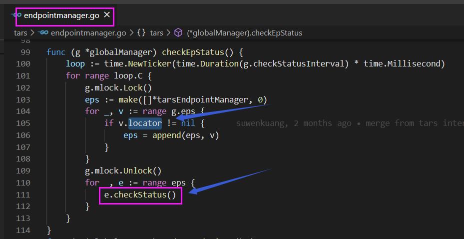
直接寻址模式的都没有健康检查，但是主控服务 Registry 也是直接寻址的，可能是个 bug.


直接寻址模式下，是在调用失败后才会触发熔断。
除了调用主控服务，其他服务一般都不是直接寻址的，而主控服务本身有降级，所以这里不太有必要去优化


## [A Issue for Dependent Libraries Collection](https://github.com//TarsCloud/TarsGo/issues/213)


If you find any dependent libraries in code but never display its open source license in the License file, please comment on this issue, We will update the License file ASAP.
You also can pull request to the License file and remember to describe in detail ; )
Welcome to contribute!


## [atomic 组合之后不再是一个原子操作 ](https://github.com//TarsCloud/TarsGo/issues/211)

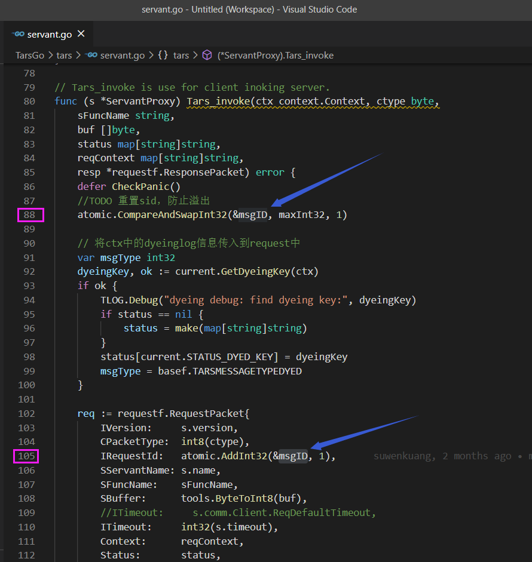
期望 op1,op2,op1,op2,op1,op2.... 但有可能是 op1,op1,op1,op2,op2,op2 .
88 行检查 msgID 是否刚好等于 maxInt32，若相等则置为 1。假设 msgID 值为 maxInt32-1 时,有多个执行流分别经过时都不会置为 1，后面的 105 行再多次进行 add 就可能产生负数的 msgID (有符号整数溢出回转为负数)，自此之后长时间内都是负数的 id


这个在很久以前就评审过了，主要看的是这个值是用来干什么的，requestid只是用来标记请求的，只要能保证队列中的请求唯一性就好，并不需要强一致，想达到绝对的防止溢出会损失掉不必要的性能，当然你有更好的方案可以提一下pr:D


明白。允许负数的话，就只需避免为 0 就行了，看了代码，RequestID 值为 0 专用于 server 推送消息给 client ，让 client 主动 close()。
#212


如果真不想有负数出现，就只能改成 uint32 了，但这样估计改动大，也有点吹毛求疵了。估计 RequestID 设计为有符号的是因为 java 没有无符号整数吧


## [Gracefully patch+publish from TarsWeb](https://github.com//TarsCloud/TarsGo/issues/210)


Hi, 我看TarsGo目前已经从Admin发送命令的优雅重启。但是TarsWeb上，传包发布的时候，还不是优雅重启，请问是否可以支持？
相关链接：TarsCloud/TarsWeb#62


Support by patch
TarsCloud/TarsFramework#63
TarsCloud/TarsWeb#67


## [Make NewServantProxy public to enable user to develop custom gateway server for tars services](https://github.com//TarsCloud/TarsGo/issues/206)


tars/servant.go:
func NewServantProxy(comm *Communicator, objName string) *ServantProxy {
	return newServantProxy(comm, objName)
}


Tars provides the gateway server: https://github.com/TarsCloud/TarsGateway, why do you want to develop custom gateway?


Tars provides the gateway server: https://github.com/TarsCloud/TarsGateway, why do you want to develop custom gateway?

自己实现网关可以实现除了http以外的其他传输接入方式，比如TCP socket, websocket
而且，发这个issue的时候TarsGateway还不存在


## [Stat and propery report lose effectiveness when Tars-Go client is not within Tars framework](https://github.com//TarsCloud/TarsGo/issues/205)


I have a golang web project written in gin，not within Tars framework。When I call Tars server using Tars-Go client, I found that RPC call is normal , but stat and property report lose effectiveness and no data in tars_stat_* and tars_property_* table.
Hope this problem can be solved in next version.


该issue长期未更新。如果问题依旧没解决，欢迎重新打开issue。TARS社区有您更精彩。
Thanks for your supporting. The issue has not been updated for a long time. If the problem is still not resolved, welcome to reopen the issue.


## [xorm的字段映射在服务打包部署后无效](https://github.com//TarsCloud/TarsGo/issues/204)


我在测试服务时定义了一个struct如下
type User struct {
	Id       int32    `xorm:"id not null pk autoincr INTEGER"`
	UserName string `xorm:"username VARCHAR(255)"`
	Account  int32 `xorm:"account INTEGER"`
}

在本地服务器测试的时候可以将UserName映射到数据库中的username字段
但是当我打包服务上传到服务器执行client时则映射无效，但xorm的其他功能正常
可能有什么解决方法呢？


该issue长期未更新。如果问题依旧没解决，欢迎重新打开issue。TARS社区有您更精彩。
Thanks for your supporting. The issue has not been updated for a long time. If the problem is still not resolved, welcome to reopen the issue.


## [Unpredictable output in FlushLogger](https://github.com//TarsCloud/TarsGo/issues/200)


import "github.com/TarsCloud/TarsGo/tars/util/rogger"

func main() {
	defer rogger.FlushLogger()
	lg := rogger.GetLogger("")
	for i := 0; i < 20; i++ {
		lg.Debug("OK", i)
	}
}```
The log output of this program has unpredictable order and sometimes losing logs.


## [If jce or tars define files contain a struct filed , auto genarate files Struct Impletment have a undefined field codec.JceStructBase!](https://github.com//TarsCloud/TarsGo/issues/199)


undefined: codec.JceStructBase
jce2go version 1.1


## [create_tars_server.sh rename error in Ubuntu](https://github.com//TarsCloud/TarsGo/issues/198)


when i create new server，shell error
haha@ubuntu:~$ bash $GOPATH/src/github.com/TarsCloud/TarsGo/tars/tools/create_tars_server.sh MKG TeamServer Team
[create server: MKG.TeamServer ...]
[mkdir: /home/haha/go/src/MKG/TeamServer/]
>>>Now doing:./main.go >>>>
>>>Now doing:./makefile >>>>
>>>Now doing:./start.sh >>>>
>>>Now doing:./config.conf >>>>
>>>Now doing:./Servant_imp.go >>>>
>>>Now doing:./Servant.tars >>>>
>>>Now doing:client/client.go >>>>
>>>Now doing:vendor/vendor.json >>>>
>>>Now doing:debugtool/dumpstack.go >>>>
Bareword "Server" not allowed while "strict subs" in use at (eval 1) line 1.
Bareword "Servant" not allowed while "strict subs" in use at (eval 1) line 1.
Bareword "tars" not allowed while "strict subs" in use at (eval 1) line 1.
Bareword "Servant_imp" not allowed while "strict subs" in use at (eval 1) line 1.
Bareword "go" not allowed while "strict subs" in use at (eval 1) line 1.
Bareword "Server" not allowed while "strict subs" in use at (eval 1) line 1.
Bareword "Servant" not allowed while "strict subs" in use at (eval 1) line 1.
Bareword "tars" not allowed while "strict subs" in use at (eval 1) line 1.
Bareword "Servant_imp" not allowed while "strict subs" in use at (eval 1) line 1.
Bareword "go" not allowed while "strict subs" in use at (eval 1) line 1.

OS：Ubuntu 12:04/16:04
rename  in Ubuntu is Perl Program, not C Program
        rename "Server" "$SERVER" $RENAMEFILE
        rename "Servant.tars" "${SERVANT}.tars" $RENAMEFILE
        rename "Servant_imp.go" "${SERVANT_LC}_imp.go" $RENAMEFILE


该issue长期未更新。如果问题依旧没解决，欢迎重新打开issue。TARS社区有您更精彩。
Thanks for your supporting. The issue has not been updated for a long time. If the problem is still not resolved, welcome to reopen the issue.


## [create_tars_server.sh shell error](https://github.com//TarsCloud/TarsGo/issues/197)


when i create new server，shell error
sh $GOPATH/src/github.com/TarsCloud/TarsGo/tars/tools/create_tars_server.sh MKG UserInfoServer UserInfo
～/go/src/github.com/TarsCloud/TarsGo/tars/tools/create_tars_server.sh: 12: [: ～/go: unexpected operator
～/go/src/github.com/TarsCloud/TarsGo/tars/tools/create_tars_server.sh: 28: [: UserInfoServer: unexpected operator

OS：Ubuntu 12:04
when i change to Ubuntu 16:04，it's OK.
i find reason in stackoverflow
https://stackoverflow.com/questions/3411048/unexpected-operator-in-shell-programming
so suggest change 'sh' to 'bash' in tarsgo document


该issue长期未更新。如果问题依旧没解决，欢迎重新打开issue。TARS社区有您更精彩。
Thanks for your supporting. The issue has not been updated for a long time. If the problem is still not resolved, welcome to reopen the issue.


## [Support weight for endpoints](https://github.com//TarsCloud/TarsGo/issues/196)


TarsGo should support  this just like TarsCpp's implementation:
https://github.com/TarsCloud/TarsCpp/blob/master/servant/libservant/EndpointManager.cpp#L853


## [Shutdown server if servant obj not found in config file](https://github.com//TarsCloud/TarsGo/issues/193)


https://github.com/TarsCloud/TarsGo/blob/master/tars/application.go#L283
This line ignore the error, which could cause unpredictable problem.
So I suggest to use teerDown function to shutdown server and send a notify message.


## [TarsGo Can not implement RESTful API](https://github.com//TarsCloud/TarsGo/issues/190)


I found TarsGo Use the http package to dispatch request, but the http package can not implement RESTfull API. I want to make a integration with "github.com/gin-gonic/gin" or "github.com/julienschmidt/httprouter", did you have some other suggestion.


Of course it is easy to be integrated with some web frameworks.
Here is an example:
package main

import (
	"fmt"
	"net/http"

	"github.com/TarsCloud/TarsGo/tars"
	"github.com/gorilla/mux"
)

func main() {
	r := mux.NewRouter()
	r.HandleFunc("/", func(w http.ResponseWriter, r *http.Request) {
		w.WriteHeader(http.StatusOK)
		fmt.Fprintf(w, "Home")
	})
	r.HandleFunc("/products/{key}", func(w http.ResponseWriter, r *http.Request) {
		vars := mux.Vars(r)
		w.WriteHeader(http.StatusOK)
		fmt.Fprintf(w, "product: %v\n", vars["key"])
	})

	cfg := tars.GetServerConfig()
	tarsMux := tars.TarsHttpMux{}
	tarsMux.Handle("/", r)
	tars.AddHttpServant(&tarsMux, cfg.App+"."+cfg.Server+".MainObj") // use  `not TARS` protocol

	tars.Run()
}


## [请问哪个函数可以实现往服务管理>服务实时状态(图中箭头指的地方)发消息，然后在tars的前端显示出来呢？](https://github.com//TarsCloud/TarsGo/issues/182)

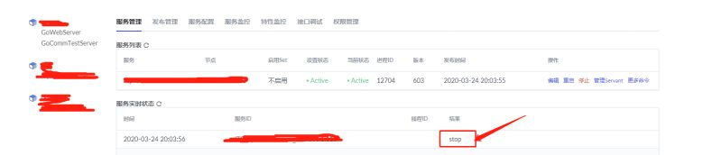


首先要从模版配置里面获得 tars/application/server - notify - tars.tarsnotify.NotifyObj的值，假设叫做 notify
ha := &tars.NotifyHelper{}
comm := tars.NewCommunicator()
conf := tars.GetServerConfig()
ha.SetNotifyInfo(comm, notify, conf.App, conf.Server, conf.Container)
ha.ReportNotifyInfo("Hello, world")
或者默认的 notify 没改的话，直接 notify := "tars.tarsnotify.NotifyObj" 也可以


## [can pprof be supported？](https://github.com//TarsCloud/TarsGo/issues/175)


I want to use pprof to locate performance issues, it will be supported?


supported


## [When the implementation method of servant returns int, error, or error which is not nil, it causes the caller to block](https://github.com//TarsCloud/TarsGo/issues/170)


The tars file is defined as follows.
int updateById(int id, dataInfo DataInfo);
My service provider's code example is roughly as follows
func (ci *ServiceImpl) UpdateById(ctx context.Context, Id int32, DataInfo *res.DataInfo) (ret int32, err error) {
return PARAM_ERR, errors.New("param[ModifyUser] invalid")
}
I meant to return param_err = - 1 to the caller,
The actual situation is that the caller will hold the code until the timeout
If you change the code error. New ("param [modifyuser] invalid") to nil, it is as follows
func (ci *ServiceImpl) UpdateById(ctx context.Context, Id int32, DataInfo *res.DataInfo) (ret int32, err error) {
return PARAM_ERR, nil
}
The caller will not hold until the timeout, but will get the result of param_err = - 1
I don't think this phenomenon is reasonable


该issue长期未更新。如果问题依旧没解决，欢迎重新打开issue。TARS社区有您更精彩。
Thanks for your supporting. The issue has not been updated for a long time. If the problem is still not resolved, welcome to reopen the issue.


## [Is there a performance checking tool like pprof available?](https://github.com//TarsCloud/TarsGo/issues/169)


No description provided.


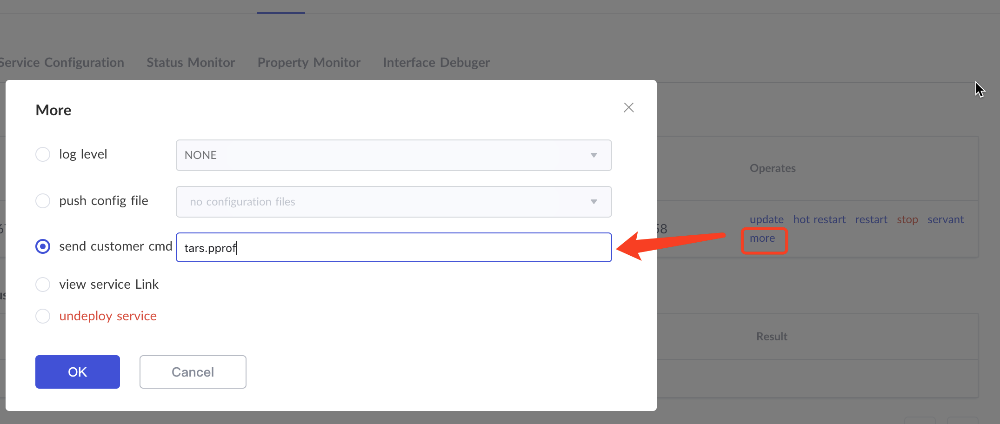

Maybe you can use pprof in tars manager panel.
Step:
Services - Operates more - send customer cmd  -  input "tars.pprof"
Reference Code:
https://github.com/TarsCloud/TarsGo/blob/master/tars/admin.go#L76
Then you can open "http://your node ip:8080/debug/pprof" to deal with it.
Generate svg file:
go tool pprof -svg http://your node ip:8080/debug/pprof/profile?seconds=10
Hope it helps you


## [style: some lines too long and find a typo](https://github.com//TarsCloud/TarsGo/issues/164)


tars/communicator.go:20: line is 153 characters (lll)
// NewCommunicator returns a new communicator. A Communicator is used for communicating with the server side which should only init once and be global!!!
tars/communicator.go:93: line is 123 characters (lll)
// GetProperty returns communicator property value as string and true for key, or empty string and false for not exists key
tars/endpointmanager.go:218: line is 154 characters (lll)
e.pointsSet.Clear() // clean it first,then add back .this action must lead to add lock,but if don't clean may lead to leakage.it's better to use remove.
tars/filter.go:29: line is 160 characters (lll)
type ServerFilter func(ctx context.Context, d Dispatch, f interface{}, req *requestf.RequestPacket, resp *requestf.ResponsePacket, withContext bool) (err error)
tars/plugin/zipkintracing/zipkintracing.go:87: line is 157 characters (lll)
return func(ctx context.Context, d tars.Dispatch, f interface{}, req *requestf.RequestPacket, resp *requestf.ResponsePacket, withContext bool) (err error) {
tars/tools/pb2tarsgo/protoc-gen-go/tarsrpc/tarsrpc.go:198: line is 153 characters (lll)
func (obj *%s) Dispatch(ctx context.Context, val interface{}, req * requestf.RequestPacket, resp *requestf.ResponsePacket, withContext bool)(err error){
tars/tools/tars2go/gen_go.go:819: line is 139 characters (lll)
c.WriteString(func (_obj * + itf.TName + ) setMap(l int, res *requestf.ResponsePacket,  ctx map[string]string, sts map[string]string) { tars/tools/tars2go/gen_go.go:861: line is 130 characters (lll) c.WriteString("//" + fun.Name + "WithContext is the proxy function for the method defined in the tars file, with the context\n") tars/tools/tars2go/gen_go.go:1027: line is 148 characters (lll) c.WriteString(func + fun.NameStr +(ctx context.Context, _val interface{},_os *codec.Buffer, _is *codec.Reader, withContext bool)(err error){) tars/tools/tars2go/gen_go.go:1158: line is 155 characters (lll) c.WriteString("//Dispatch is used to call the server side implemnet for the method defined in the tars file. withContext shows using context or not.  \n") tars/tools/tars2go/gen_go.go:1159: line is 184 characters (lll) c.WriteString("func(_obj *" + itf.TName + ) Dispatch(ctx context.Context, _val interface{}, req *requestf.RequestPacket, resp *requestf.ResponsePacket,withContext bool) (err error) {
tars/tools/tars2go/lex.go:194: line is 128 characters (lll)
for isNumber(ls.current) || ls.current == '.' || ls.current == 'x' || ls.current == 'X' || (isHex && isHexNumber(ls.current)) {
tars/util/debug/debugtool.go:58: line is 136 characters (lll)
//For example, SigNotifyStack(SIGUSR1, true, "stackinfo"), can dump all goroutine stack when received SIGUSR1 signal by "kill -USR1 pid"
tars/rconfig.go:18:20: geting is a misspelling of getting (misspell)
//RConf struct for geting remote config.
^


Finish in #165


## [pb2tarsgo tool:  missing main function](https://github.com//TarsCloud/TarsGo/issues/162)


$ go build ./...

# github.com/TarsCloud/TarsGo/tars/tools/pb2tarsgo/protoc-gen-go
runtime.main_main·f: function main is undeclared in the main package


https://github.com/TarsCloud/TarsGo/blob/master/tars/tools/pb2tarsgo/README.md
Please build the tool according this guide.


## [Go version 1.13 unit test failed](https://github.com//TarsCloud/TarsGo/issues/160)


The test tool of go 1.13 has modified the usage of flag (golang/go@fbc6a97), which conflicts with the application.go's flag.
Cause unit test failure
Usage of ./add.test:
-config string
init config path
In addition, if you create a service by yourself and use a flag package, you can't use a tar package. There are the same problems.
It is recommended to modify the application's flag usage.


该issue长期未更新。如果问题依旧没解决，欢迎重新打开issue。TARS社区有您更精彩。
Thanks for your supporting. The issue has not been updated for a long time. If the problem is still not resolved, welcome to reopen the issue.


## [httpserver可以正常访问,然后想在httpserver api请求里面访问其tarsserver服务。发现出错。求助。。](https://github.com//TarsCloud/TarsGo/issues/159)


goroutine 1 [running, locked to thread]:
runtime/debug.Stack(0xc000012c00, 0x15, 0xc00000e0f8)
/usr/lib/golang/src/runtime/debug/stack.go:24 +0xa7
github.com/TarsCloud/TarsGo/tars.checkPanic()
/www/go/src/github.com/TarsCloud/TarsGo/tars/panic.go:16 +0x16b
panic(0x6ad800, 0xc000047760)
/usr/lib/golang/src/runtime/panic.go:513 +0x1b9
time.NewTicker(0x0, 0x0)
/usr/lib/golang/src/time/tick.go:23 +0x18f
github.com/TarsCloud/TarsGo/tars/util/rtimer.NewTimeWheel(0x0, 0x15, 0x0)
/www/go/src/github.com/TarsCloud/TarsGo/tars/util/rtimer/timewheel.go:56 +0x124
github.com/TarsCloud/TarsGo/tars/util/rtimer.After(0x0, 0x0)
/www/go/src/github.com/TarsCloud/TarsGo/tars/util/rtimer/timewheel.go:25 +0xe1
github.com/TarsCloud/TarsGo/tars.(*ObjectProxy).Invoke(0xc00000cd80, 0x75cb80, 0xc0000140a0, 0xc0000aa460, 0x0, 0x0, 0x0)
/www/go/src/github.com/TarsCloud/TarsGo/tars/object.go:53 +0x1b8
github.com/TarsCloud/TarsGo/tars.(*ServantProxy).Tars_invoke(0xc000069b60, 0x75cb80, 0xc0000140a0, 0xc00012e000, 0x713b17, 0x19, 0xc00011a330, 0x1d, 0x40, 0x0, ...)
/www/go/src/github.com/TarsCloud/TarsGo/tars/servant.go:71 +0x5b6
github.com/TarsCloud/TarsGo/tars/protocol/res/queryf.(*QueryF).FindObjectByIdInSameGroup(0xc000047420, 0x714518, 0x1b, 0xc000137298, 0xc000137280, 0x0, 0x0, 0x0, 0xc000000000, 0x1, ...)
/www/go/src/github.com/TarsCloud/TarsGo/tars/protocol/res/queryf/QueryF_IF.go:565 +0x1ad
github.com/TarsCloud/TarsGo/tars.(*EndpointManager).findAndSetObj(0xc00005c6c0, 0xc000047420)
/www/go/src/github.com/TarsCloud/TarsGo/tars/endpointmanager.go:198 +0xbf3
github.com/TarsCloud/TarsGo/tars.(*EndpointManager).setObjName(0xc00005c6c0, 0x714518, 0x1b)
/www/go/src/github.com/TarsCloud/TarsGo/tars/endpointmanager.go:52 +0x3e3
github.com/TarsCloud/TarsGo/tars.(*EndpointManager).Init(0xc00005c6c0, 0x714518, 0x1b, 0xc0000512c0, 0x1, 0xc00000cd60)
/www/go/src/github.com/TarsCloud/TarsGo/tars/endpointmanager.go:74 +0xee
github.com/TarsCloud/TarsGo/tars.(*ObjectProxy).Init(0xc00000cd60, 0xc0000512c0, 0x714518, 0x1b)
/www/go/src/github.com/TarsCloud/TarsGo/tars/object.go:27 +0x86
github.com/TarsCloud/TarsGo/tars.(*ObjectProxyFactory).GetObjectProxy(0xc000137d98, 0x714518, 0x1b, 0x0)
/www/go/src/github.com/TarsCloud/TarsGo/tars/object.go:88 +0xf6
github.com/TarsCloud/TarsGo/tars.(*ServantProxy).Init(0xc000069aa0, 0xc0000512c0, 0x714518, 0x1b)
/www/go/src/github.com/TarsCloud/TarsGo/tars/servant.go:36 +0x11b
github.com/TarsCloud/TarsGo/tars.(*ServantProxyFactory).GetServantProxy(0xc00000cd40, 0x714518, 0x1b, 0x7)
/www/go/src/github.com/TarsCloud/TarsGo/tars/servant.go:114 +0xd1
github.com/TarsCloud/TarsGo/tars.(*Communicator).StringToProxy(0xc0000512c0, 0x714518, 0x1b, 0x7597c0, 0xc000047210)
/www/go/src/github.com/TarsCloud/TarsGo/tars/communicator.go:82 +0x42
main.call()
/www/go/src/TestApp/WupProxy/WupProxy.go:25 +0xd3
main.init.0()
/www/go/src/TestApp/WupProxy/WupProxy.go:11 +0x26


是调用姿势不对
本地运行程序需要自己在配置文件里面加上client配置参数


## [Error nil  pointer will be reported when the service is stopped](https://github.com//TarsCloud/TarsGo/issues/158)


Maxinvoke = 0 in setting.go, and there is no other place to modify the value in the project. This parameter is used when adminobj starts.
When tcphandle. Handle() is closed, gpool. Release() method is called directly, and there is no operation to judge nil value
The code traces that only one gpool has been initialized, and only when maxinvoke > 0.
Is there a hidden danger of null pointer in this way?


该issue长期未更新。如果问题依旧没解决，欢迎重新打开issue。TARS社区有您更精彩。
Thanks for your supporting. The issue has not been updated for a long time. If the problem is still not resolved, welcome to reopen the issue.


## [调研TarGo](https://github.com//TarsCloud/TarsGo/issues/157)


TarGo后续计划是如何？会不会继续维护/更新？文档会持续更新吗？


会持续跟进更新


## [Why is the pattern parameter reported by httpserver.go always "/"](https://github.com//TarsCloud/TarsGo/issues/156)


should url.path be reported?


Pattern is taken from handler first. If can't be got, it will be reported as "/"


The incoming handler is url.path, but it is empty when it comes out of the handler.


Raise a pr to fix it then:D


Using url.path, if someone attack or scan the server, there will be lots of different path reported. Not sure if it is ok for the monitor.


该issue长期未更新。如果问题依旧没解决，欢迎重新打开issue。TARS社区有您更精彩。
Thanks for your supporting. The issue has not been updated for a long time. If the problem is still not resolved, welcome to reopen the issue.


## [make 脚本建议支持交叉编译参数](https://github.com//TarsCloud/TarsGo/issues/151)


目前的make 脚本没有支持交叉编译，我再mac上面编译的二进制文件无法在linux上执行。
执行如下代码 可以设置交叉编译
CGO_ENABLED=0 GOOS=linux GOARCH=amd64 go build
建议将这个配置参数化 放到项目的makefile中


需要交叉编译时可以在make命令加上参数, 比如make GOOS=linux, 不建议过多配置.


## [can we export config field of ServerConfig or add a method to get it ?](https://github.com//TarsCloud/TarsGo/issues/149)


I am developing my app based on TarsGo.
Now I need to get the config address and notify address in ServerConfig, but current version of TarsGo does not export such two field.
Can TarsGo exports this two field of ServerConfig or add a method to get the value of them ? The latter may be better.


## [invalid memory address or nil pointer dereference error in statf](https://github.com//TarsCloud/TarsGo/issues/147)


//StatReport is global.
var StatReport *StatFHelper

这个StatReport没有对里面的mutex和list实例化就直接引用，导致pushBackMsg函数里面相关地方panic,报错信息：invalid memory address or nil pointer dereference


mutex和list是有实例化的，在StatFHelper中的Init中定义了


TarsGo/tars/statf.go


        Lines 33 to 43
      in
      2c6dd1e


 func (s *StatFHelper) Init(comm *Communicator, node string) { 


 s.node = node 


 s.lStatInfo = list.New() 


 s.lStatInfoFromServer = list.New() 


 s.mlock = new(sync.Mutex) 


 s.mStatInfo = make(map[statf.StatMicMsgHead]statf.StatMicMsgBody) 


 s.mStatCount = make(map[statf.StatMicMsgHead]int) 


 s.comm = comm 


 s.sf = new(statf.StatF) 


 s.comm.StringToProxy(s.node, s.sf) 


 } 


并在initReport中进行了实例化StatReport对象，只有GetClientConfig返回nil时，不会进行实例化


TarsGo/tars/statf.go


        Lines 124 to 135
      in
      2c6dd1e


 func initReport() { 


 if GetClientConfig() == nil { 


 statInited <- struct{}{} 


 return 


 	} 


 comm := NewCommunicator() 


 comm.SetProperty("netthread", 1) 


 StatReport = new(StatFHelper) 


 StatReport.Init(comm, GetClientConfig().stat) 


 statInited <- struct{}{} 


 go StatReport.Run() 


 } 


同时在服务启动时调用initReport来初始化StatReport对象


TarsGo/tars/application.go


         Line 155
      in
      2c6dd1e


 go initReport() 


所以你的pr中添加的修改和源码中的重复了。没有实例化成功是GetClientConfig返回nil，可以排查一下这方面的原因。
希望以上信息对你有帮助。如果问题已经解决，请关闭相关issue和pr；若有新的问题，可以开启新的issue


非常感谢你的解答！


## ["This file war generated by tars2go" seems error](https://github.com//TarsCloud/TarsGo/issues/144)


This file **war** generated by tars2go 1.1

The commend in generated files by tars2go seems error, should be
This file **was** generated by tars2go 1.1


fixed
95ae9f1


## [tarsgo  set模式开启问题](https://github.com//TarsCloud/TarsGo/issues/143)

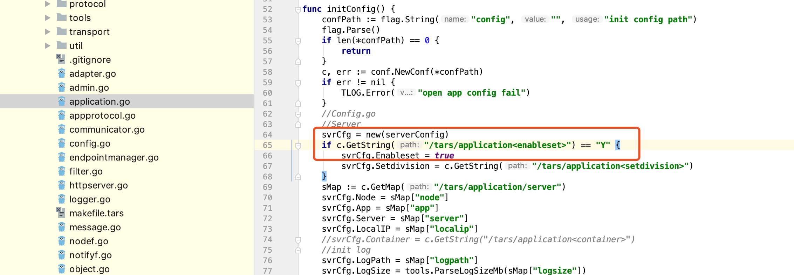
基于 targo web 配置好 服务实例Set后,基于模板生成的配置是小写,但是 application 代码当中判断的字符是大写


自动生成的配置文件中 enableset=y
<tars>
        <application>
                enableset=y
                setdivision=a.a.1
                <server>
                        node=tars.tarsnode.ServerObj@tcp -h 172.17.0.4 -p 19386 -t 60000
                        app=amc
                        server=GoWebServer
                        localip=172.17.0.4
                        local=tcp -h 127.0.0.1 -p 20020 -t 3000
                        basepath=/usr/local/app/tars/tarsnode/data/amc.GoWebServer/bin/
                        datapath=/usr/local/app/tars/tarsnode/data/amc.GoWebServer/data/
                        logpath=/usr/local/app/tars/app_log/
                        logsize=10M
                        config=tars.tarsconfig.ConfigObj
                        notify=tars.tarsnotify.NotifyObj
                        log=tars.tarslog.LogObj
                        deactivating-timeout=3000
                        logLevel=DEBUG
                        <amc.GoWebServer.GoWebObjAdapter>
                                allow
                                endpoint=tcp -h 172.17.0.4 -p 20020 -t 60000
                                handlegroup=amc.GoWebServer.GoWebObjAdapter
                                maxconns=200000
                                protocol=not_tars
                                queuecap=10000
                                queuetimeout=60000
                                servant=amc.GoWebServer.GoWebObj
                                threads=5
                        </amc.GoWebServer.GoWebObjAdapter>
                </server>
                <client>
                        locator=tars.tarsregistry.QueryObj@tcp -h 172.17.0.3 -p 17890
                        sync-invoke-timeout=3000
                        async-invoke-timeout=5000
                        refresh-endpoint-interval=60000
                        stat=tars.tarsstat.StatObj
                        property=tars.tarsproperty.PropertyObj
                        report-interval=60000
                        sample-rate=100000
                        max-sample-count=50
                        asyncthread=3
                        modulename=amc.GoWebServer
                </client>
        </application>
</tars>

而 application.go 当中65 行判断该配置 为大写字符 Y
if c.GetString("/tars/application<enableset>") == "Y" {
		svrCfg.Enableset = true
		svrCfg.Setdivision = c.GetString("/tars/application<setdivision>")
}


see #134


## [如何发送jce请求，可以提供示例](https://github.com//TarsCloud/TarsGo/issues/142)


如题，已经生成go版本的jce序列化文件，如何发送jce请求呢？km,github都找不到例子，麻烦尽快完善下


相关例子km是有的，有关jce的问题最好到内网问。
关于如何调用使用tars协议服务的接口，可以在TarsGo文档客户端开发部分查看相关用法。
相关例子可以参考TarsGo/examples/EchoClientServer/EchoClientServer.go，包含了在一个服务中如何调用其它tars协议服务的完整过程
先创建一个全局的*tars.Communicator通信器对象


TarsGo/examples/EchoClientServer/EchoClientServer.go


         Line 17
      in
      2c6dd1e


 var comm *tars.Communicator 


在需要调用其它服务的时候，新建该服务的proxy对象，该例子中命名为app，同时使用通信器对象函数stringToProxy初始化proxy对象，参数还需要传入调用的服务名。初始化完成后即可通过proxy对象调用对应服务的接口


TarsGo/examples/EchoClientServer/EchoClientServer.go


        Lines 35 to 38
      in
      2c6dd1e


 app := new(StressTest.EchoTest) 


 obj := "StressTest.EchoTestServer.EchoTestObj" 


 comm.StringToProxy(obj, app) 


 _, err := app.Echo(strIn, &strOut) 


希望以上信息对你有帮助


## [windows 安装 tars](https://github.com//TarsCloud/TarsGo/issues/141)


目前tars没有支持windows安装和运行吗?如果支持的话,麻烦给下安装教程


https://github.com/TarsCloud/Tars README这边说：TARS只支持在Linux操作系统上部署


## [Start http server fail](https://github.com//TarsCloud/TarsGo/issues/140)


When I  build a http Server with TarsGo， there are erros:
2019-08-19 16:22:59|application.go:186|DEBUG|RunAdminObj&{tcp 127.0.0.1:10014 0 500ms 0s 0s 0s 10m0s 10000000 134217728 134217728 false}
2019-08-19 16:22:59|servant.go:74|ERROR|Invoke Obj:,fun:reportVersion,error:no adapter Proxy selected:
2019-08-19 16:22:59|statf.go:166|DEBUG|report err:servant name () format error
2019-08-19 16:22:59|servant.go:74|ERROR|Invoke Obj:,fun:keepAlive,error:no adapter Proxy selected:
2019-08-19 16:22:59|nodef.go:44|ERROR|report Version fail:
2019-08-19 16:22:59|statf.go:166|DEBUG|report err:servant name () format error
2019-08-19 16:22:59|nodef.go:36|ERROR|keepalive fail:

How could I solve those errors?


Can you provide your config file and how you start your server ?


<tars>
        <application>
                <server>
                        app=CCTVVideoMedia
                        server=StandardServer
                        local=tcp -h 127.0.0.1 -p 10014 -t 30000
			logpath=/tmp
                        <CCTVVideoMedia.StandardServer.StandardClientObjAdapter>
                                allow
                                endpoint=tcp -h 127.0.0.1 -p 10015 -t 60000
                                handlegroup=CCTVVideoMedia.StandardServer.StandardClientObjAdapter
                                maxconns=200000
                                protocol=no-tars
                                queuecap=10000
                                queuetimeout=60000
                                servant=CCTVVideoMedia.StandardServer.HttpServer
                                shmcap=0
                                shmkey=0
                                threads=1
                        </CCTVVideoMedia.StandardServer.StandardClientObjAdapter>
                </server>
        </application>
</tars>

just start by sh start.sh


我这边也碰到类似的问题了。
【错误日志】：
2019-08-27 11:57:38|statf.go:48|DEBUG|report statList.size:0
2019-08-27 11:57:38|servant.go:74|ERROR|Invoke Obj:,fun:reportMicMsg,error:no adapter Proxy selected:
2019-08-27 11:57:38|statf.go:166|DEBUG|report err:servant name () format error
2019-08-27 11:57:38|statf.go:85|DEBUG|report err:no adapter Proxy selected:
2019-08-27 11:57:38|statf.go:87|DEBUG|report ret:0
2019-08-27 11:57:38|statf.go:101|DEBUG|stat report
2019-08-27 11:57:38|servant.go:74|ERROR|Invoke Obj:,fun:keepAlive,error:no adapter Proxy selected:
2019-08-27 11:57:38|statf.go:166|DEBUG|report err:servant name () format error
2019-08-27 11:57:38|nodef.go:36|ERROR|keepalive fail:AdminAdapter
【配置】：
cat GoTarsServer.conf


app=amc
server=GoTarsServer
local=tcp -h 127.0.0.1 -p 15692 -t 30000
logpath=/data/tars/app_log
<amc.GoTarsServer.DateTimeObjAdapter>
allow
endpoint=tcp -h 9.134.12.147 -p 15692 -t 60000
handlegroup=amc.GoTarsServer.DateTimeObjAdapter
maxconns=200000
protocol=tars
queuecap=10000
queuetimeout=60000
servant=amc.GoTarsServer.DateTimeObj
shmcap=0
shmkey=0
threads=1
</amc.GoTarsServer.DateTimeObjAdapter>


【进程】：
root     27436     1  0 11:37 pts/2    00:00:00 ./GoTarsServer --config=GoTarsServer.conf
root     27674 11857  0 11:39 pts/2    00:00:00 sudo ./GoTarsServer --config=GoTarsServer.conf
【怀疑】：
是因为手工起的进程，没有通过管理端注册引起的。(管理端部署出问题了。)


<tars>
        <application>
                <server>
                        app=CCTVVideoMedia
                        server=StandardServer
                        local=tcp -h 127.0.0.1 -p 10014 -t 30000
			logpath=/tmp
                        <CCTVVideoMedia.StandardServer.StandardClientObjAdapter>
                                allow
                                endpoint=tcp -h 127.0.0.1 -p 10015 -t 60000
                                handlegroup=CCTVVideoMedia.StandardServer.StandardClientObjAdapter
                                maxconns=200000
                                protocol=no-tars
                                queuecap=10000
                                queuetimeout=60000
                                servant=CCTVVideoMedia.StandardServer.HttpServer
                                shmcap=0
                                shmkey=0
                                threads=1
                        </CCTVVideoMedia.StandardServer.StandardClientObjAdapter>
                </server>
        </application>
</tars>

just start by sh start.sh

The protocol field should be not_tars.


我这边也碰到类似的问题了。
【错误日志】：
2019-08-27 11:57:38|statf.go:48|DEBUG|report statList.size:0
2019-08-27 11:57:38|servant.go:74|ERROR|Invoke Obj:,fun:reportMicMsg,error:no adapter Proxy selected:
2019-08-27 11:57:38|statf.go:166|DEBUG|report err:servant name () format error
2019-08-27 11:57:38|statf.go:85|DEBUG|report err:no adapter Proxy selected:
2019-08-27 11:57:38|statf.go:87|DEBUG|report ret:0
2019-08-27 11:57:38|statf.go:101|DEBUG|stat report
2019-08-27 11:57:38|servant.go:74|ERROR|Invoke Obj:,fun:keepAlive,error:no adapter Proxy selected:
2019-08-27 11:57:38|statf.go:166|DEBUG|report err:servant name () format error
2019-08-27 11:57:38|nodef.go:36|ERROR|keepalive fail:AdminAdapter
【配置】：
cat GoTarsServer.conf
app=amc
server=GoTarsServer
local=tcp -h 127.0.0.1 -p 15692 -t 30000
logpath=/data/tars/app_log
<amc.GoTarsServer.DateTimeObjAdapter>
allow
endpoint=tcp -h 9.134.12.147 -p 15692 -t 60000
handlegroup=amc.GoTarsServer.DateTimeObjAdapter
maxconns=200000
protocol=tars
queuecap=10000
queuetimeout=60000
servant=amc.GoTarsServer.DateTimeObj
shmcap=0
shmkey=0
threads=1
</amc.GoTarsServer.DateTimeObjAdapter>
【进程】：
root 27436 1 0 11:37 pts/2 00:00:00 ./GoTarsServer --config=GoTarsServer.conf
root 27674 11857 0 11:39 pts/2 00:00:00 sudo ./GoTarsServer --config=GoTarsServer.conf
【怀疑】：
是因为手工起的进程，没有通过管理端注册引起的。(管理端部署出问题了。)

看起来配置文件并不完整，可以查看 logpath 下的服务日志，看看是否有错误信息


该issue长期未更新。如果问题依旧没解决，欢迎重新打开issue。TARS社区有您更精彩。
Thanks for your supporting. The issue has not been updated for a long time. If the problem is still not resolved, welcome to reopen the issue.


## [tars decode returns EOF when missing required field](https://github.com//TarsCloud/TarsGo/issues/138)


I figured out that when missing required field, clients would got an EOF error.
The error message is confusing, we expect it to be something like missing required field, tag xxx rather than EOF.
After some debugs, we found out that the code generated by the tars2go tool didn't handle error properly. The following line should check error and return directly when error occured.
https://github.com/TarsCloud/TarsGo/blob/master/tars/tools/tars2go/gen_go.go#L666
  st.ReadFrom(_is)


fixed by #139


## [panic.go 里 checkPanic 遇到 panic 直接退出进程是否合理](https://github.com//TarsCloud/TarsGo/issues/137)


// panic.go
package tars

import (
	"fmt"
	"os"
	"path/filepath"
	"runtime/debug"
	"time"
)

func checkPanic() {
	if r := recover(); r != nil {
		path, _ := filepath.Abs(filepath.Dir(os.Args[0]))
		os.Chdir(path)
		file, _ := os.Create(fmt.Sprintf("panic.%s", time.Now().Format("20060102-150405")))
		file.WriteString(string(debug.Stack()))
		file.Close()
		os.Exit(-1)   // 这里直接退出进程合理么？
	}
}
请教一个问题。有一个疑问，如果作为 server 的代码不慎出现了 panic，这里会检查之后直接退出进程，会导致后续的请求无法处理，这样是否是合理的呢？内置的 http server 遇到panic会recover不会退出进程，这里为何直接退出了呢？


## [Tarsgo service deployment failed, and tarscpp can succeed, how to solve it?](https://github.com//TarsCloud/TarsGo/issues/136)


Phenomenon: "error: system internal error" in service deployment
Log:
{"level":"error","message":"10.32.219.160|admin|DeployServerController.js:64|[getServerNotifyList] SequelizeDatabaseError: Data truncated for column 'server_type' at row 1\n    at Query.formatError (/data/home/jammyxu/src/github.com/TarsCloud/TarsWeb/node_modules/sequelize/lib/dialects/mysql/query.js:247:16)\n    at Query.handler [as onResult] (/data/home/jammyxu/src/github.com/TarsCloud/TarsWeb/node_modules/sequelize/lib/dialects/mysql/query.js:68:23)\n    at Query.execute (/data/home/jammyxu/src/github.com/TarsCloud/TarsWeb/node_modules/mysql2/lib/commands/command.js:30:14)\n    at Connection.handlePacket (/data/home/jammyxu/src/github.com/TarsCloud/TarsWeb/node_modules/mysql2/lib/connection.js:449:32)\n    at PacketParser.Connection.packetParser.p [as onPacket] (/data/home/jammyxu/src/github.com/TarsCloud/TarsWeb/node_modules/mysql2/lib/connection.js:72:12)\n    at PacketParser.executeStart (/data/home/jammyxu/src/github.com/TarsCloud/TarsWeb/node_modules/mysql2/lib/packet_parser.js:75:16)\n    at Socket.Connection.stream.on.data (/data/home/jammyxu/src/github.com/TarsCloud/TarsWeb/node_modules/mysql2/lib/connection.js:79:25)\n    at emitOne (events.js:116:13)\n    at Socket.emit (events.js:211:7)\n    at addChunk (_stream_readable.js:263:12)\n    at readableAddChunk (_stream_readable.js:250:11)\n    at Socket.Readable.push (_stream_readable.js:208:10)\n    at TCP.onread (net.js:594:20)  ","timestamp":"2019-08-14 16:55:45.588"}


Does your problem still exist? If yes, can you provide more detailed information, such as configuration, template and type selection when deploying services.


该issue长期未更新。如果问题依旧没解决，欢迎重新打开issue。TARS社区有您更精彩。
Thanks for your supporting. The issue has not been updated for a long time. If the problem is still not resolved, welcome to reopen the issue.


## [When can  go module be supported?](https://github.com//TarsCloud/TarsGo/issues/135)


No description provided.


+1


## [enableset NOT working](https://github.com//TarsCloud/TarsGo/issues/133)


We've encounter a problem when deploy services with set division.
The code below expect enableset=Y to take effect
https://github.com/TarsCloud/TarsGo/blob/dev/tars/application.go#L82
but the config file generated by NodeServer contains the following line:
enableset=y

This mismatch disables set division deployment.


## [Why are the jobs distributed ?](https://github.com//TarsCloud/TarsGo/issues/132)


Why don't workers go directly to grab jobs from the pool? Based on what considerations? You can use fewer channels, which should reduce the performance loss.
For example:
func (w *Worker) Start() {
	go func() {
		for {
			select {
			case job = <-pool.JobQueue:
				job()
			case <-w.Stop:
				w.Stop <- struct{}{}
				return
			}
		}
	}()
}


What do u mean by distributing jobs？


It means that multiple workers consume the same channel, and the worker takes the initiative to obtain tasks to execute, rather than the scheduler to dispatch. There are relevant codes posted on it


The design here should refer to the working threads in CPP. At the beginning, CPP was designed for multi-core utilization, and multiple working threads were processed in parallel.


该issue长期未更新。如果问题依旧没解决，欢迎重新打开issue。TARS社区有您更精彩。
Thanks for your supporting. The issue has not been updated for a long time. If the problem is still not resolved, welcome to reopen the issue.


## [Is there any way to run make tars under windows](https://github.com//TarsCloud/TarsGo/issues/131)


Is there any way to run make tars under windows


Currently, it only supports development under Linux, and there is no way to run it under windows at present


## [tars2go将多个jce转go](https://github.com//TarsCloud/TarsGo/issues/130)


当一个jce引用其他jce文件时，在jce的所在目录执行tars2go才能转换，否则会报错。请问一下这是怎么解决的


补充一下，这里提到的jce就是.tars协议文件


jce问题到内网里提issue吧


## [Where is tests?](https://github.com//TarsCloud/TarsGo/issues/129)


No description provided.


Do u mean unit tests?


## [[alarm] zombie process,no keep alive msg for 60 seconds](https://github.com//TarsCloud/TarsGo/issues/128)

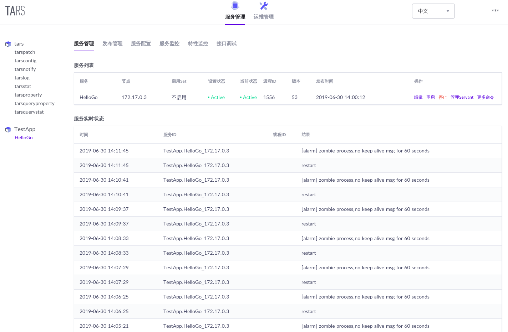
使用该docker镜像搭建了tars的管理平台，并根据tar_go_quickstart.md搭建了服务端，并打包上传到服务平台，服务日志一直报服务为僵尸进程

后查看服务的配置运行的配置文件发现servant均少了Obj字样
<tars>
        <application>
                enableset=n
                setdivision=NULL
                <server>
                        node=tars.tarsnode.ServerObj@tcp -h 172.17.0.3 -p 19386 -t 60000
                        app=TestApp
                        server=HelloGo
                        localip=172.17.0.3
                        local=tcp -h 127.0.0.1 -p 10006 -t 3000
                        basepath=/usr/local/app/tars/tarsnode/data/TestApp.HelloGo/bin/
                        datapath=/usr/local/app/tars/tarsnode/data/TestApp.HelloGo/data/
                        logpath=/usr/local/app/tars/app_log/
                        logsize=10M
                        config=tars.tarsconfig.ConfigObj
                        notify=tars.tarsnotify.NotifyObj
                        log=tars.tarslog.LogObj
                        deactivating-timeout=3000
                        logLevel=DEBUG
                        # 实际因该为 <TestApp.HelloGo.SayHelloObjAdapter>
                        <TestApp.HelloGo.SayHelloAdapter>
                                allow
                                endpoint=tcp -h 172.17.0.3 -p 10006 -t 60000
                                # 实际应该为 handlegroup=TestApp.HelloGo.SayHelloObjAdapter
                                handlegroup=TestApp.HelloGo.SayHelloAdapter
                                maxconns=200000
                                protocol=tars
                                queuecap=10000
                                queuetimeout=60000
                                # 实际应该为 servant=TestApp.HelloGo.SayHelloObj
                                servant=TestApp.HelloGo.SayHello
                                threads=5
                        # 实际因该为 </TestApp.HelloGo.SayHelloObjAdapter>
                        </TestApp.HelloGo.SayHelloAdapter>
                </server>
                <client>
                        locator=tars.tarsregistry.QueryObj@tcp -h 172.17.0.3 -p 17890
                        sync-invoke-timeout=3000
                        async-invoke-timeout=5000
                        refresh-endpoint-interval=60000
                        stat=tars.tarsstat.StatObj
                        property=tars.tarsproperty.PropertyObj
                        report-interval=60000
                        sample-rate=100000
                        max-sample-count=50
                        asyncthread=3
                        modulename=TestApp.HelloGo
                </client>
        </application>
</tars>

然后将tar_go_quickstart.md中服务端源码app.AddServant(imp, cfg.App+"."+cfg.Server+".SayHelloObj") //Register Servant修改为app.AddServant(imp, cfg.App+"."+cfg.Server+".SayHello") //Register Servant（客户端同理）重新编译打包后发布，运行日志正常，客户端也能正常请求响应。
请问这个是文档编写错误，还是发布平台的模板问题？我查看了模板管理中的tars.default的模板，发现是无法对Adapter和Servant的名字进行配置的。


如果是http server，servant需要选择not_tars类型


该issue长期未更新。如果问题依旧没解决，欢迎重新打开issue。TARS社区有您更精彩。
Thanks for your supporting. The issue has not been updated for a long time. If the problem is still not resolved, welcome to reopen the issue.


## [udp rpc调用 context的servant无法获取客户端ip和端口](https://github.com//TarsCloud/TarsGo/issues/122)


udp rpc调用 context的servant无法获取客户端ip和端口，tcp的rpc调用是可以的，建议udp也加上。


已经合入 dev 分支，参见 #123


## [flag.Parse() not called, it may break all existing applications](https://github.com//TarsCloud/TarsGo/issues/120)


The problem is introduced by the pr #113 , it removes the flag.Parse() call from initConfig() and expects users to call it from main().
It may break all existing applications that don't call flag.Parse(), and the application exits silently.(Consider replace the two os.Exit(1) calls in initConfig() with panic to make troubleshooting easily)


## [A service I want to deploy on two servers has an error.](https://github.com//TarsCloud/TarsGo/issues/119)

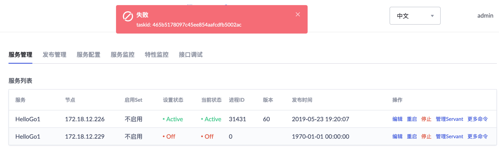
Ask two questions:
1grpc has a timeout setting: CTX, cancel: = context. Withtimeout (context. Background(), time. Minute)
How can tarsgo set the timeout.
2 now I have deployed a service on 172.18.12.226, but I also want to deploy this service on 172.18.12.229, but it fails after uploading. There is no reason for failure. I don't know how to debug..


use Servant.TarsSetTimeout method


Roger, can I deploy one service on multiple servers?


Yes, if there is an error, you can check the 'tarspatch' log


The tarspatch log is empty，  how to debug？


该issue长期未更新。如果问题依旧没解决，欢迎重新打开issue。TARS社区有您更精彩。
Thanks for your supporting. The issue has not been updated for a long time. If the problem is still not resolved, welcome to reopen the issue.


## [README.md中client示例错误](https://github.com//TarsCloud/TarsGo/issues/118)


省点心吧，让小白还得一个个对


具体错误是啥？


## [please change to dev branch](https://github.com//TarsCloud/TarsGo/issues/117)


please change to dev branch
Originally posted by @sandyskies in #114 (comment)
with new pr：#116


## [flag.Parse() must not be called during init. Instead, register flags during init, and call flag.Parse() in main().](https://github.com//TarsCloud/TarsGo/issues/112)


What language are you using?
Go
What operating system (Linux, Ubuntu, …) and version?
Linux
What runtime / compiler are you using (e.g. jdk version or version of gcc)
gcc version 4.4.6 20110731 (Red Hat 4.4.6-4) (GCC)
Make sure you include information that can help us debug (full error message, exception listing, stack trace, logs).
flag.Parse() must not be called during init. Instead, register flags during init, and call flag.Parse() in main().
Otherwise, if your own program or a 3rd-party lib(say, glog) you use  registers flags during init and expects flags to be parsed during execution, you program will panic with "flag provided but not defined".


TarsGo/tars/application.go


         Line 54
      in
      846b163


 flag.Parse() 


Proposed a resolution #113


## [求教性能测试怎么做的](https://github.com//TarsCloud/TarsGo/issues/111)


client使用examples/EchoClientServer/client/这里的代码稍作修改 开多个协程发的请求，sever也是这个目录的svr，qps只有3-4w，4核8g内存

package main

import (
    "fmt"

    "github.com/TarsCloud/TarsGo/tars"

    "StressTest"
    "sync"
    "sync/atomic"
    "time"
)

func main() {
    comm := tars.NewCommunicator()
    obj := fmt.Sprintf("StressTest.EchoClientServer.EchoClientObj@tcp -h 127.0.0.1 -p 10015  -t 60000")
    app := new(StressTest.EchoClient)
    comm.StringToProxy(obj, app)
    var num int64
    start := time.Now().UnixNano() / 1e6
    var wg sync.WaitGroup
    f := func() {
        var out, i int32
        for i = 0; i < 2000; i++ {
            atomic.AddInt64(&num, 1)
            ret, err := app.Add(i, i*2, &out)
            if err != nil {
                fmt.Println(ret, out)
                return
            }
        }
        wg.Done()
    }

    for i := 0; i < 200; i++ {
        go f()
        wg.Add(1)
    }
    wg.Wait()
    end := time.Now().UnixNano() / 1e6
    cost := end - start
    fmt.Printf("num:%d time:%d qps:%d\n", num, cost/1000, num*int64(1000)/(end-start))
}


4核有开启超线程吗


没有开超线程


和你们的50w qps差距太大了


和你们的50w qps差距太大了

grpc测了多少？


5w左右


5w左右

我测了下，4核4G下：
tarsGo在6.7万 qps


文档上的benchmark 50w左右 怎么测得了？


文档上的benchmark 50w左右 怎么测得了？

Bench Machine type: 4 core /8 thread CPU 3.3Ghz，16G memory
兄弟，你配置最好跟这个保持一致，而且服务器开启超线程。再试试～


## [example的示例没有同步更新](https://github.com//TarsCloud/TarsGo/issues/110)


代码已经修改，示例能不能更新一下呢？


哪个示例？


## [go版本应该是没有获取服务地址列表，还有路由策略的接口](https://github.com//TarsCloud/TarsGo/issues/109)


go版本应该是没有获取服务地址列表，还有路由策略的接口，望完善一下，谢谢


https://github.com/TarsCloud/TarsGo/blob/master/tars/endpointmanager.go#L124


谢谢，已解决


## [can we support grpc ？](https://github.com//TarsCloud/TarsGo/issues/108)


I have some grpc service， can we use it ？


u can use tarsRPC +protoc buffers ，see example at https://github.com/TarsCloud/TarsGo/blob/master/tars/tools/pb2tarsgo/README.md


grpc is a totally different rpc protocol


## [如何用filter做统一日志输出？](https://github.com//TarsCloud/TarsGo/issues/107)


背景：
目前在做tarsgo的HTTP server框架。希望能够在框架层记录所有接收到的HTTP请求、以及发送到其他tars服务的tars请求。
目标：
对业务无侵入
设置log等级，即可以打开全局日志
作为Tars client，filter内部如何把RequestPacket、ResponsePacket解析成utf-8的string？可否给出代码示例呢？
或者说有什么全局日志的推荐方式吗？
package filter

import (
	"context"
	"a.com/x/y/global"
	"github.com/TarsCloud/TarsGo/tars"
	"github.com/TarsCloud/TarsGo/tars/protocol/res/requestf"
	"time"
)

func sBufferToBytes(int8Slice []int8)([]byte){
	bytes := make([]byte, 0, len(int8Slice))
	for _, reqByte := range int8Slice {
		bytes = append(bytes, byte(reqByte))
	}
	return bytes

	//todo 此函数需要判断log等级，保证线上性能
	//todo 此处为tars格式的二进制，需要反射+解包，
	//bytes := codec.FromInt8(int8Slice)
	//reader := codec.NewReader(bytes)
	//return bytes
}

func TafClientLogFilter() tars.ClientFilter {
	return func(ctx context.Context, msg *tars.Message, invoke tars.Invoke, timeout time.Duration) (err error) {
		global.Log.Debugf("ctx=%+v, msg=%+v, invoke=%+v, timeout=%+v", ctx, msg, invoke, timeout)

		if msg.Req != nil{
			global.Log.Debug("TafClientLogFilter msg.Req.SBuffer=", string(sBufferToBytes(msg.Req.SBuffer)))
		}

		err = invoke(ctx, msg, timeout)
		if err != nil {
			global.Log.Errorf("error=%+v", err);
		}

		if msg.Resp != nil{
			global.Log.Debug("TafClientLogFilter msg.Resp.SBuffer=", string(sBufferToBytes(msg.Resp.SBuffer)))
		}

		return err
	}
}


tars的util里提供了全局日志库util/rogger哦


@maplebeats
麻烦看下我的背景描述哈，是想用filter做服务级别的日志。
我示例代码里的global.Log就是util/rogger在服务级别的全局变量。


@Clark-zhang 你是想通过filter获取request 或者response 包体里面的SBuffer包含的内容吧？这里是序列化后的的


@Clark-zhang 你是想通过filter获取request 或者response 包体里面的SBuffer包含的内容吧？这里是序列化后的的

@sandyskies
是的，我想把他反序列化出来。打在log日志里，作为调试之用。这样做就不需要业务频繁打日志了。
我看目前tarsgo的debug日志里，好像也没有反序列化，都是原始的tars编码之后的buffer。
所以想问如何做这块。


## [多个服务是否可以共享同一套协议文件？](https://github.com//TarsCloud/TarsGo/issues/106)


多个服务是否可以共享同一套协议文件？


可以的，本身在相互调用的时候就需要共享协议


## [when can you support Python?](https://github.com//TarsCloud/TarsGo/issues/101)


currently, more and more people are using Python, so when can you support Python?


python is available  in tencent ，and will be released soon


## [tarsgo 好像不能使用 http middleware？](https://github.com//TarsCloud/TarsGo/issues/100)


tars.AddHttpServant() 的第一个参数是 TarsHttpMux struct
所以好像不能使用像 Alice - https://github.com/justinas/alice
或者 gorilla - https://github.com/gorilla/mux
这种middleware？
能改成interface吗？这样用户可以定制自己的TarsHttpMux来使用 自己想要的middleware？


可以用，下面是个例子：
package main

import (
	"fmt"
	"net/http"

	"github.com/TarsCloud/TarsGo/tars"
	"github.com/gorilla/mux"
)

func main() {
	r := mux.NewRouter()
	r.HandleFunc("/", func(w http.ResponseWriter, r *http.Request) {
		w.WriteHeader(http.StatusOK)
		fmt.Fprintf(w, "Home")
	})
	r.HandleFunc("/products/{key}", func(w http.ResponseWriter, r *http.Request) {
		vars := mux.Vars(r)
		w.WriteHeader(http.StatusOK)
		fmt.Fprintf(w, "product: %v\n", vars["key"])
	})

	cfg := tars.GetServerConfig()
	tarsMux := tars.TarsHttpMux{}
	tarsMux.Handle("/", r)
	tars.AddHttpServant(&tarsMux, cfg.App+"."+cfg.Server+".MainObjObj")

	tars.Run()
}


可以用，下面是个例子：
package main

import (
	"fmt"
	"net/http"

	"github.com/TarsCloud/TarsGo/tars"
	"github.com/gorilla/mux"
)

func main() {
	r := mux.NewRouter()
	r.HandleFunc("/", func(w http.ResponseWriter, r *http.Request) {
		w.WriteHeader(http.StatusOK)
		fmt.Fprintf(w, "Home")
	})
	r.HandleFunc("/products/{key}", func(w http.ResponseWriter, r *http.Request) {
		vars := mux.Vars(r)
		w.WriteHeader(http.StatusOK)
		fmt.Fprintf(w, "product: %v\n", vars["key"])
	})

	cfg := tars.GetServerConfig()
	tarsMux := tars.TarsHttpMux{}
	tarsMux.Handle("/", r)
	tars.AddHttpServant(&tarsMux, cfg.App+"."+cfg.Server+".MainObjObj")

	tars.Run()
}


好的，感谢 🙏


Hi, @defool @sandyskies
这种方式虽然可以使用中间件，但是目前tars监控上，所有的 “接口名”，都变成了 /。
可能是因为tarsHttp里只注册了一个 / 导致的？
能帮忙看下吗？


Hi, @defool @sandyskies
这种方式虽然可以使用中间件，但是目前tars监控上，所有的 “接口名”，都变成了 /。
可能是因为tarsHttp里只注册了一个 / 导致的？
能帮忙看下吗？

可以把注册在gorilla上的 route，再多注册一次到 TarsHtppMux上就可以部分解决该问题。


## [When will tarsgo support  the protocol of TUP?](https://github.com//TarsCloud/TarsGo/issues/99)


I found that tarsgo does not support TUP yet when we plan to use go to implement gateway for TUP.
So when will tarsgo support  the protocol of TUP?
It will be great if TUP for go comes soon.Thx a lot.


Will be support in next month.


Will be support in next month.

Already supported?


@sandyskies


Support tup？


该issue长期未更新。如果问题依旧没解决，欢迎重新打开issue。TARS社区有您更精彩。
Thanks for your supporting. The issue has not been updated for a long time. If the problem is still not resolved, welcome to reopen the issue.


## [Can k8s be supported?](https://github.com//TarsCloud/TarsGo/issues/96)


Considering that a large number of Companies in container cluster management have started to use k8s
Is there any plan for k8s integration? Or is it supported right now? I read the document, and I need to select the machine for deployment


Please written by English, not all developer are Chinese.


How this project work with Kubernetes ?


I think TarsGo is a RPC framework and able to deploy on Kubernetes like web apps.


try K8STARS


## [要是能把接口和grpc一样就好了](https://github.com//TarsCloud/TarsGo/issues/93)


RT


接口是指什么，rpc调用的接口么。
tars的rpc调用更接近本地调用习惯，比grpc要好多了哇


## [Print function logger does not print function name](https://github.com//TarsCloud/TarsGo/issues/91)


Look at the print function. In debug mode, you can print out the file name and line, but not the function name. Because some file names may be the same in the project, it is not a good for trouble -shooting problem. Please add  function name to be printed.
The following code is where you can see the name and line number of the printed file
#/tars/util/logger/logger.go
if logLevel == DEBUG {
_, file, line, ok := runtime.Caller(2)
If! OK {
File =???
Line = 0
} else {
file = filepath.Base(file)
}
fmt.Fprintf(buf, "%s:%d|", file, line)
}
It is suggested to amend it to
227         if logLevel == DEBUG {
228             pc, file, line, ok := runtime.Caller(2)
229             if !ok {
230                 file = "???"
231                 line = 0
232             } else {
233                 file = filepath.Base(file)
234             }
235             fmt.Fprintf(buf, "%s|%s:%d|", runtime.FuncForPC(pc).Name(), file, line)
236         }


你好，你可以提个pr来解决下


has support


## [If only tars2go could generate the comments written by itself into the code file](https://github.com//TarsCloud/TarsGo/issues/90)


//Mobile number repeated query return
struct SC_PhoneQuery {
0 require int ret; / / result 1 does not exist 2 exists
1 require string phone; / / Account
}
interface DB{
Int phonequery (CS? Phonequery MSG, out SC? Phonequery RET); / / query the phone number
}
//Login results
enum LOGIN_RESULT {
Login? Result? Success, / / login succeeded
...
}
Like the above definition file, the single line comments written by yourself can be generated into the target code, if there are single line comments written!


ok，working on it.


该issue长期未更新。如果问题依旧没解决，欢迎重新打开issue。TARS社区有您更精彩。
Thanks for your supporting. The issue has not been updated for a long time. If the problem is still not resolved, welcome to reopen the issue.


## [tars2go 生成的enum 有问题](https://github.com//TarsCloud/TarsGo/issues/89)


// 登录结果
enum LOGIN_RESULT {
LOGIN_RESULT_SUCCESS,							// 登录成功
LOGIN_RESULT_REPEAT_LOGIN,						// 重复登录
LOGIN_RESULT_DB_ERR,							// 数据库操作返回错误
LOGIN_RESULT_ACCOUNT_PASSWORD_ERR,					// 该账号密码错误
LOGIN_RESULT_NO_DEFAULT_LOBBY ,						// 没有找到默认大厅
LOGIN_RESULT_SMS_CLOSED ,							// 没有开启短信验证
LOGIN_RESULT_SMS_REPEATED,							// 短信验证重复发送消息
LOGIN_RESULT_RESET_ACCOUNT_FAILED ,					// 完善账号数据库操作失败
LOGIN_RESULT_SMS_FAILED ,							// 短信验证失败
LOGIN_RESULT_ALIYUN_FAILED ,							// 阿里云失败
LOGIN_RESULT_SET_PASSWORD_FAILED ,					// 修改密码失败
LOGIN_RESULT_SET_NICKNAME_FAILED,					// 设置昵称数据库操作失败
LOGIN_RESULT_SET_PASSWORD_GUEST,					// 游客不能修改密码
LOGIN_RESULT_SAME_PASSWORD ,						// 相同密码
LOGIN_RESULT_LOGIN_VALIDATEBOX_FAIL,				// 登陆验证框失败
LOGIN_RESULT_ACCOUNT_DISABLED,					// 账号被封
LOGIN_RESULT_RESET_ACCOUNT_DUP_ACC,				// 完善账号失败：已经绑定了该手机
LOGIN_RESULT_RESET_ACCOUNT_DUP_NICKNAME,		// 完善账号失败：已经设置了改昵称
LOGIN_RESULT_SET_NICKNAME_DUP_NICKNAME,			// 设置昵称失败：已经设置了改昵称
LOGIN_RESULT_SET_ACCOUNT_OR_PASSWORD_EMPTY,		// 账号或者密码为空
LOGIN_RESULT_PASSWORD_SIZE_LIMIT,					// 密码长度限制为9-18位
LOGIN_RESULT_PASSWORD_CHAR_LIMIT,					// 密码只能为数字，字母，下划线
LOGIN_RESULT_ACCOUNT_SIZE_LIMIT,					// 账号只能为7-18位
LOGIN_RESULT_ACCOUNT_CHAR_LIMIT,					// 账号只能为数字
LOGIN_RESULT_SMS_ERR,							// 验证码只能输入数字，限制6位
LOGIN_RESULT_NICKNAME_EMPTY,						// 昵称不能为空
LOGIN_RESULT_NICKNAME_LIMIT,						// 昵称输入框只能输入字母数字汉字，限制2-7个汉字的长度。
LOGIN_RESULT_ACCOUNT_EMPTY,						// 账号为空
LOGIN_RESULT_TEL_LEN_ERR,							// 手机号长度不正确
LOGIN_RESULT_TEL_ERR ,								// 手机号不正确
LOGIN_RESULT_TEL_USED,								// 手机号已被使用
LOGIN_RESULT_REDIS_ERROR,							//redis异常
LOGIN_RESULT_MAINTAIN,								//系统进入维护中
LOGIN_RESULT_FREQUENTLY_LOGIN,					// 频繁登录，dbserver收到多个
LOGIN_RESULT_UNCOMPLETED_LOGIN,					// 未完成登录，login又收到一个
LOGIN_RESULT_LOGIN_QUQUE							// 已经在登录排队中，gate又收到一个
};
生成的结果如下 没法用
//Package QPAPP comment
// This file war generated by tars2go 1.1
// Generated from DB.tars
package QPAPP
type LOGIN_RESULT int32
const (
//LOGIN_RESULT_LOGIN_RESULT_SUCCESS enumLOGIN_RESULT_LOGIN_RESULT_SUCCESS = 0
//LOGIN_RESULT_LOGIN_RESULT_REPEAT_LOGIN enumLOGIN_RESULT_LOGIN_RESULT_REPEAT_LOGIN = 1
//LOGIN_RESULT_LOGIN_RESULT_DB_ERR enumLOGIN_RESULT_LOGIN_RESULT_DB_ERR = 2
//LOGIN_RESULT_LOGIN_RESULT_ACCOUNT_PASSWORD_ERR enumLOGIN_RESULT_LOGIN_RESULT_ACCOUNT_PASSWORD_ERR = 3
//LOGIN_RESULT_LOGIN_RESULT_NO_DEFAULT_LOBBY enumLOGIN_RESULT_LOGIN_RESULT_NO_DEFAULT_LOBBY = 4
//LOGIN_RESULT_LOGIN_RESULT_SMS_CLOSED enumLOGIN_RESULT_LOGIN_RESULT_SMS_CLOSED = 5
//LOGIN_RESULT_LOGIN_RESULT_SMS_REPEATED enumLOGIN_RESULT_LOGIN_RESULT_SMS_REPEATED = 6
//LOGIN_RESULT_LOGIN_RESULT_RESET_ACCOUNT_FAILED enumLOGIN_RESULT_LOGIN_RESULT_RESET_ACCOUNT_FAILED = 7
//LOGIN_RESULT_LOGIN_RESULT_SMS_FAILED enumLOGIN_RESULT_LOGIN_RESULT_SMS_FAILED = 8
//LOGIN_RESULT_LOGIN_RESULT_ALIYUN_FAILED enumLOGIN_RESULT_LOGIN_RESULT_ALIYUN_FAILED = 9
//LOGIN_RESULT_LOGIN_RESULT_SET_PASSWORD_FAILED enumLOGIN_RESULT_LOGIN_RESULT_SET_PASSWORD_FAILED = 10
//LOGIN_RESULT_LOGIN_RESULT_SET_NICKNAME_FAILED enumLOGIN_RESULT_LOGIN_RESULT_SET_NICKNAME_FAILED = 11
//LOGIN_RESULT_LOGIN_RESULT_SET_PASSWORD_GUEST enumLOGIN_RESULT_LOGIN_RESULT_SET_PASSWORD_GUEST = 12
//LOGIN_RESULT_LOGIN_RESULT_SAME_PASSWORD enumLOGIN_RESULT_LOGIN_RESULT_SAME_PASSWORD = 13
//LOGIN_RESULT_LOGIN_RESULT_LOGIN_VALIDATEBOX_FAIL enumLOGIN_RESULT_LOGIN_RESULT_LOGIN_VALIDATEBOX_FAIL = 14
//LOGIN_RESULT_LOGIN_RESULT_ACCOUNT_DISABLED enumLOGIN_RESULT_LOGIN_RESULT_ACCOUNT_DISABLED = 15
//LOGIN_RESULT_LOGIN_RESULT_RESET_ACCOUNT_DUP_ACC enumLOGIN_RESULT_LOGIN_RESULT_RESET_ACCOUNT_DUP_ACC = 16
//LOGIN_RESULT_LOGIN_RESULT_RESET_ACCOUNT_DUP_NICKNAME enumLOGIN_RESULT_LOGIN_RESULT_RESET_ACCOUNT_DUP_NICKNAME = 17
//LOGIN_RESULT_LOGIN_RESULT_SET_NICKNAME_DUP_NICKNAME enumLOGIN_RESULT_LOGIN_RESULT_SET_NICKNAME_DUP_NICKNAME = 18
//LOGIN_RESULT_LOGIN_RESULT_SET_ACCOUNT_OR_PASSWORD_EMPTY enumLOGIN_RESULT_LOGIN_RESULT_SET_ACCOUNT_OR_PASSWORD_EMPTY = 19
//LOGIN_RESULT_LOGIN_RESULT_PASSWORD_SIZE_LIMIT enumLOGIN_RESULT_LOGIN_RESULT_PASSWORD_SIZE_LIMIT = 20
//LOGIN_RESULT_LOGIN_RESULT_PASSWORD_CHAR_LIMIT enumLOGIN_RESULT_LOGIN_RESULT_PASSWORD_CHAR_LIMIT = 21
//LOGIN_RESULT_LOGIN_RESULT_ACCOUNT_SIZE_LIMIT enumLOGIN_RESULT_LOGIN_RESULT_ACCOUNT_SIZE_LIMIT = 22
//LOGIN_RESULT_LOGIN_RESULT_ACCOUNT_CHAR_LIMIT enumLOGIN_RESULT_LOGIN_RESULT_ACCOUNT_CHAR_LIMIT = 23
//LOGIN_RESULT_LOGIN_RESULT_SMS_ERR enumLOGIN_RESULT_LOGIN_RESULT_SMS_ERR = 24
//LOGIN_RESULT_LOGIN_RESULT_NICKNAME_EMPTY enumLOGIN_RESULT_LOGIN_RESULT_NICKNAME_EMPTY = 25
//LOGIN_RESULT_LOGIN_RESULT_NICKNAME_LIMIT enumLOGIN_RESULT_LOGIN_RESULT_NICKNAME_LIMIT = 26
//LOGIN_RESULT_LOGIN_RESULT_ACCOUNT_EMPTY enumLOGIN_RESULT_LOGIN_RESULT_ACCOUNT_EMPTY = 27
//LOGIN_RESULT_LOGIN_RESULT_TEL_LEN_ERR enumLOGIN_RESULT_LOGIN_RESULT_TEL_LEN_ERR = 28
//LOGIN_RESULT_LOGIN_RESULT_TEL_ERR enumLOGIN_RESULT_LOGIN_RESULT_TEL_ERR = 29
//LOGIN_RESULT_LOGIN_RESULT_TEL_USED enumLOGIN_RESULT_LOGIN_RESULT_TEL_USED = 30
//LOGIN_RESULT_LOGIN_RESULT_REDIS_ERROR enumLOGIN_RESULT_LOGIN_RESULT_REDIS_ERROR = 31
//LOGIN_RESULT_LOGIN_RESULT_MAINTAIN enumLOGIN_RESULT_LOGIN_RESULT_MAINTAIN = 32
//LOGIN_RESULT_LOGIN_RESULT_FREQUENTLY_LOGIN enumLOGIN_RESULT_LOGIN_RESULT_FREQUENTLY_LOGIN = 33
//LOGIN_RESULT_LOGIN_RESULT_UNCOMPLETED_LOGIN enumLOGIN_RESULT_LOGIN_RESULT_UNCOMPLETED_LOGIN = 34
//LOGIN_RESULT_LOGIN_RESULT_LOGIN_QUQUE enumLOGIN_RESULT_LOGIN_RESULT_LOGIN_QUQUE = 35
)


446770d


already fixed


## [ 多个Servant可以共享同一套IP端口吗？](https://github.com//TarsCloud/TarsGo/issues/87)


Tars中每个Servant似乎都是独立的IP和端口。如果想把服务接口分割成多个Servant，每个Servant负责少量的服务接口。这样的话似乎并不是太友好。
多个Servant可以共享同一套IP端口吗？


看代码是可以的，最终Server都缓存在一个map中的，所以不同名字应该是可以的。
var goSvrs map[string]*transport.TarsServer
var httpSvrs map[string]*http.Server


应该不可以，底层是根据port对servant进行路由的，另外也没有使用socket的reuseaddr，所以不能对同一个端口进行多次listen


看了TarsGo源码，不同Servant不能同享同一IP，假如协议是tcp：那么底层是每个Servant专门开启一个.netListenTCP


不行的，servant是用来寻址IP 和port的


## [tars.reportNotifyInfo 不能使用](https://github.com//TarsCloud/TarsGo/issues/85)


The function reportnotifyinfo in notifyf.go cannot be used outside. The example tar.reportnotifyinfo in the help document is also wrong and needs to be adjusted


@jyuan68 麻烦把文档也修复下。


## [Endpoint权重似乎没有用到？](https://github.com//TarsCloud/TarsGo/issues/83)


看了源码之后，发现EndpointF返回的权重似乎没有用到，完全使用了round-robin的方法进行负载均衡


预留的接口，后面会实现


## [example中配置错误](https://github.com//TarsCloud/TarsGo/issues/74)


https://github.com/TarsCloud/TarsGo/blob/master/examples/EchoTestServer/EchoTestServer.conf
root是taf，导致加载不了配置


ok,可以提个pr修复下，改成tars


@glymehrvrd  也建议在管理平台部署


Thanks for your tips, this bug has been fixed in commit d966cc7.


## [cannot use buf (type []byte) as type []int8 in field value](https://github.com//TarsCloud/TarsGo/issues/72)


Tars/go/tars/servant.go:52:3: cannot use buf (type []byte) as type []int8 in field value
This is a problem with the go compiler or a tars file error？
env:
tarsgo 1.0
go 1.11.2
tars2go 1.0


Hi, This is becuase ,Tars2go tool version is not  compatible with tars2go framework ， please update both.
go get -u github.com/TarsCloud/TarsGo/tars
go install $GOPATH/src/github.com/TarsCloud/TarsGo/tars/tools/tars2go


@XingFang


## [code optimization](https://github.com//TarsCloud/TarsGo/issues/70)


Not a bug, For code optimization
go func() {
	tm := time.NewTimer(time.Second)
        //remove these 2 unuseful lines below
	if err := recover(); err != nil { // avoid timer panic  
	}
	......
}() 
//there's a way to avoid chan panic and recover for AdapterProxy
defer func() {
        // TODO readCh has a certain probability to be closed after the load, and we need to recover
	// Maybe there is a better way
	if err := recover(); err != nil {
		TLOG.Error("recv pkg painc:", err)
	}
}()


## [When will SSL communication be supported?](https://github.com//TarsCloud/TarsGo/issues/69)


When will SSL communication be supported?


We will support ssl , this is in schedule.


working on


该issue长期未更新。如果问题依旧没解决，欢迎重新打开issue。TARS社区有您更精彩。
Thanks for your supporting. The issue has not been updated for a long time. If the problem is still not resolved, welcome to reopen the issue.


## [你们的tars2go工具问题](https://github.com//TarsCloud/TarsGo/issues/66)


tars2go -outdir TestApp\HelloGo\tars -I TestApp/HelloGo/tars TestApp\HelloGo\tars\SayHello.tars
期望生成的是所有的 *_IF.go 放在TestApp/HelloGo/tars下，结果变成了TestApp/HelloGo/tars/TestApp
默认直接放到了TestApp/HelloGo下，那我要是有100个tars文件那你岂不是要在我的项目的根目录的父目录创建100个go文件，简直无法忍受。


还有HelloWorld这种路径命名简直就是不能忍受，我是在写go，不是写Java，谢谢。


我项目根目录上层为何要默认再加一层，如果说当作子项目还能接受。tars需要用Xxx.Xxx作为标识，但没必要逼着golang按照java的规范写。


1 ， hi，建议使用https://github.com/TarsCloud/TarsGo/blob/master/docs/tars_go_quickstart.md 文档，里面有说明create_tars_server.sh ,  -outdir 指定的是要放文件的根目录，    我们通常指定的是项目目录下的vendor，参照我们的makefile。


2和3 我没太明白你说的意思，麻烦可以的话，微信详细和您了解下，微信号sandyskies


package main
import (
"github.com/TarsCloud/TarsGo/tars"
"TestApp"

)
func main() { //Init servant
imp := new(SayHelloImp)                                    //New Imp
app := new(TestApp.SayHello)                                 //New init the A JCE
cfg := tars.GetServerConfig()                               //Get Config File Object
app.AddServant(imp, cfg.App+"."+cfg.Server+".SayHelloObj") //Register Servant
tars.Run()
}
这是服务端helloworld的例子，没明白你说的路径命名，我们都是通过vendor来解决的


@sandyskies 我个人并不觉得生成的*_IF.go应当放在vendor中，vendor一般是指第三方依赖，而*_IF.go则确实属于该项目的重要组成部分。另外，纵观golang项目import路径，很少发现有项目以大驼峰的形式来命名，TestApp/HelloGo这种路径还是很不大众的。


@duguying  你说的驼峰问题，可以讨论下。 vendor的话，可以不放，但import 就必须相对路径


@sandyskies 可是它生成的IF文件的路径自动的带上了 TestApp\HelloGo 这就挺烦的了, 我不希望生成的IF文件放在项目的根目录，我希望放置在我指定的目录，方便我随时删除重新生成。建议参考一下 protobuf 的生成工具


## [tars management system](https://github.com//TarsCloud/TarsGo/issues/62)


tars management system mentioned in quick-start-en, When you login successfully, where should i go login ?
is there any easy docker domo i can try?

thanks a lot


u can install tars management youself.
for docker demo ,see https://github.com/TarsDocker/docker-tars


## [dial tcp 192.168.1.93:10015: getsockopt: connection refused](https://github.com//TarsCloud/TarsGo/issues/61)


请问，按照ars_go_quickstart_en.md文档t操作，启动client时，报错：dial tcp 192.168.1.93:10015: getsockopt: connection refused，可以ping通192.168.1.93，如何解决？谢谢~！


Please provide the client and server side code & configuration too.


## [If the client is C#, can you communicate with TarsGo through tars protocol or go TCP?](https://github.com//TarsCloud/TarsGo/issues/58)


Can you put up a demo?


## [enhancement: Abstract AddServant method to unify tcp/udp and http servant adding](https://github.com//TarsCloud/TarsGo/issues/54)


Is your feature request related to a problem? Please describe.
Adding tcp or udp servant is different from http, it should be by same interface.
Describe the solution you'd like
Abstract AddServant method to unify tcp/udp and http servant adding.
Describe alternatives you've considered
NONE.
Additional context
NONE.


## [enhancement: abstract AddServant method to unify the interface](https://github.com//TarsCloud/TarsGo/issues/53)


Is your feature request related to a problem? Please describe.
Adding tcp or udp servant is different from http, it should be by same interface
Describe the solution you'd like
Abstract AddServant method.
Describe alternatives you've considered
NONE
Additional context
NONE


## [enhancement: Optimize the doc about tars2go tools compilation and installation](https://github.com//TarsCloud/TarsGo/issues/50)


Is your feature request related to a problem? Please describe.
Optimize the description of tars2go tools compilation and installation.
Describe the solution you'd like
NONE
Describe alternatives you've considered
NONE
Additional context
NONE


## [php作为客户端发请求给go tars服务端，无法正常解析消息](https://github.com//TarsCloud/TarsGo/issues/46)


tars文件：
module TestApp{
interface SayHello{
int echoHello(string name, out string greeting);
};
};
php代码：
// 指定主控ip
$config = new \Tars\client\CommunicatorConfig();
$config->setLocator('tars.tarsregistry.QueryObj@tcp -h 10.0.2.15 -p 17890');
$config->setModuleName('App.Server');
$config->setCharsetName('UTF-8');
$servant = new \TestApp\HelloGo\SayHelloObj\SayHelloServant($config);
echo "Locator specified with default socketmode 1\n";
$name = 'ted';
$intVal = $servant->echoHello($name, $greetings);
var_dump($greetings);


@sandyskies


The problem is caused by php ,which use iversion 2  in request package


use $config->setIVersion(1);  to set the iverson to 1


## [web控制台不显示数据](https://github.com//TarsCloud/TarsGo/issues/33)


特性监控和服务监控数据不显示


handle request protocol decode error:read 'Char' type mismatch, tag: 0, get type: 1


tarsstat report error


0039277


## [goland的服务web上设置日志等级异常](https://github.com//TarsCloud/TarsGo/issues/32)


notifyServer [Goapp.Goweb] 'Goapp.setloglevel ERROR' succ:Goapp.setloglevel ERROR not support now!


已解决，请更新管理平台


## [TarsGo 与TarsNode的文件RequestF.tars不统一，导致异常](https://github.com//TarsCloud/TarsGo/issues/31)


TarsGo中RequestF.tars 中struct RequestPacket的成员为：7  require vector<unsigned byte> sBuffer; 而TarsNode中RequestF.tars 中struct RequestPacket的成员为：7  require vector<byte> sBuffer;  导致互相请求时，出现“code=-1, message=type mismatch, tag:7,type:9” 的错误。


https://github.com/TarsCloud/TarsGo/blob/master/tars/protocol/res/RequestF.tars#L11  ，tarsgo里面是          7  require vector<unsigned byte> sBuffer， 你是不是手工改成了 require vector<byte> sBuffer ？？


我倒是打算改成vector<byte>。。。 我提的Issue是TarsGo中的这个值和TarsNode, TarsCpp中定义的不一样 https://github.com/tars-node/rpc/blob/e1ea70acc87d6b93238675476141b7580fc66078/core/rpc-tars/RequestF.tars#L11,
https://github.com/TarsCloud/TarsCpp/blob/717971e1cb77de16c06d01c824efd3a2d3c855db/servant/tup/RequestF.tars#L28   你们内部是不是应该保持一致啊。不然TarsGo就只能自己跟自己玩，没法和Nodejs，C++等语言写的Tars服务交互了。。。


这个是Golang 内部实现的问题，tars协议  unsigned byte，对应的才是Golang 的byte。  另外，我们测试过和cpp等语言通信是没问题的， 你这个tarsnode指的是tars.nodejs ?


是的，指的是tars nodejs版的。不好意思，我发现是我看错了。TarsGO里面vector 和vector 都是SIMPLE_LIST。我再看看TarsNode吧。先关闭问题了。谢谢你的回复！


@yanchunan  我们也看下吧，可能是tars.nodejs 没做 simple_list 的兼容，方便的话加我微信，我们聊下，sandyksies


0039277 @yanchunan  已解决，请测试


## [请问关于性能测试可以提供详细的测试脚本吗?](https://github.com//TarsCloud/TarsGo/issues/30)


请问关于性能测试可以提供详细的测试脚本吗?我测试的结果和你们提供的数据有很大出入,关于grpc请问你们性能测试的时候使用了什么生成插件,gogofast or 原生的插件？


1，  建议setting.go ： var MaxInvoke int = runtime.NumCpu()
另外，communicator 只new一次，不要多次new communicator ，测试脚本长驻，多个协程并发发起请求，
2， 使用了原生的插件


## [接口调试无法删除](https://github.com//TarsCloud/TarsGo/issues/29)


如题


## [接口没有IP白名单](https://github.com//TarsCloud/TarsGo/issues/24)


如题，希望接口调用提供IP白名单，以及访问频率限制（防止DDOS攻击）


please use English and reopen issue again.


## [There are some Chinese characters in the command "tars2go -h"](https://github.com//TarsCloud/TarsGo/issues/22)


Below is the output of the command "tars2go -h" :
Usage: tars2go [flags] *.tars tars2go -I tars/protocol/res/endpoint [-I ...] QueryF.tars -E    生成未fmt前的代码便于排错 -I value 指定具体的import路径 -add-servant 生成AddServant函数 (default true) -outdir string 生成的代码放到哪个目录 -tarsPath string specify the tars source path. (default "github.com/TarsCloud/TarsGo/tars")


Thanks for reporting,  I will fixed this later!


07c5666


## [feature: Implement generic goroutine pool](https://github.com//TarsCloud/TarsGo/issues/20)


I think it's necessary to implement a generic goroutine pool, which helps reuse codes.


## [bugfix: server should respect logLevel configuration](https://github.com//TarsCloud/TarsGo/issues/1)


Server should respect logLevel configuration.


