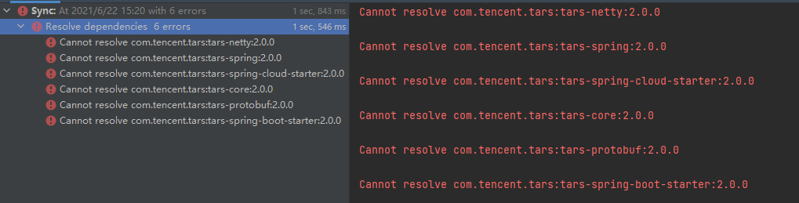

## [在服务端机器数较多，或权重比例差较大时，静态权重会失效](/TarsCloud/TarsJava/issues/176)

在服务端机器数较多，或权重比例差较大时，静态权重会失效。同时客户端流量会集中打到某一台服务端机器

已经合并了。少了在权利相同的时候 。比较hashcode的jfhw。返回的值不对的问题。

## [tars client缺少对tup和json协议的封装支持](/TarsCloud/TarsJava/issues/173)

目前client默认为tars协议，需要扩展一下，支持tup和json协议.

## [2.0.0相关的jar依赖找不到 ](/TarsCloud/TarsJava/issues/169)

应该去哪里下载2.0.0的相关依赖，maven仓库地址是多少？

## [TarsCodec 中编解码中未处理TarsServantResponse 的  Throwable cause ？](/TarsCloud/TarsJava/issues/161)

无法获取服务提供者的异常,因为编码解码没有处理异常
TarsCodec.java
public IoBuffer encodeResponse(Response resp, Session session) throws ProtocolException {
        TarsServantResponse response = (TarsServantResponse) resp;
        if (response.getPacketType() == TarsHelper.ONEWAY) {
            return null;
        }

        TarsOutputStream jos = new TarsOutputStream();
        jos.setServerEncoding(charsetName);
        try {
            jos.getByteBuffer().putInt(0);
            jos.write(response.getVersion(), 1);
            jos.write(response.getPacketType(), 2);

            if (response.getVersion() == TarsHelper.VERSION) {
                jos.write(response.getRequestId(), 3);
                jos.write(response.getMessageType(), 4);
                jos.write(response.getRet(), 5);
                jos.write(encodeResult(response, charsetName), 6);
                if (response.getStatus() != null) {
                    jos.write(response.getStatus(), 7);
                }
                if (response.getRet() != TarsHelper.SERVERSUCCESS) {
                    jos.write(StringUtils.isEmpty(response.getRemark()) ? "" : response.getRemark(), 8);
                }
            } else if (TarsHelper.VERSION2 == response.getVersion() || TarsHelper.VERSION3 == response.getVersion()) {
                jos.write(response.getMessageType(), 3);
                jos.write(response.getTicketNumber(), 4);
                String servantName = response.getRequest().getServantName();
                jos.write(servantName, 5);
                jos.write(response.getRequest().getFunctionName(), 6);
                jos.write(encodeWupResult(response, charsetName), 7);
                jos.write(response.getTimeout(), 8);
                if (response.getContext() != null) {
                    jos.write(response.getContext(), 9);
                }
                if (response.getStatus() != null) {
                    jos.write(response.getStatus(), 10);
                }
            } else {
                response.setRet(TarsHelper.SERVERENCODEERR);
                System.err.println("un supported protocol, ver=" + response.getVersion());
            }
        } catch (Exception ex) {
            if (response.getRet() == TarsHelper.SERVERSUCCESS) {
                response.setRet(TarsHelper.SERVERENCODEERR);
            }
        }
        ByteBuffer buffer = jos.getByteBuffer();
        int datalen = buffer.position();
        buffer.position(0);
        buffer.putInt(datalen);
        buffer.position(datalen);
        return IoBuffer.wrap(jos.toByteArray());
    }

上面是协议解析阶段会出现问题，这里是和主控通信 。并不是和你目标服务通信 。。

## [“TarsAbstractCallback” Has been removed, example: tars-spring-boot-http-server cannot be compiled ！](/TarsCloud/TarsJava/issues/160)

[ERROR] /E:/Gitee/Tars/TarsJava/examples/tars-spring-boot-http-server/src/main/java/com/tencent/tars/client/testapp/HelloPrxCallback.java:[10,48] 找不到符号
符号: 类 TarsAbstractCallback

Callback在Master的版本中不再被使用。被CompleableFuture代替。所以测试的时候 。使用1.7的版本即可。新的功能也不会合并进正常的版本中。

## [相关版本是否可上传MAVEN公共仓库？](/TarsCloud/TarsJava/issues/156)

目前在本地开发过程中发现从MAVEN中央仓库无法下载到TARS对应版本的依赖包？
是我本地网络问题？ 还是未上传中央仓库？
谢谢~

## [为什么用spring boot方式启动的时候不加载filter？/ Why is the filter not loaded when  using spring boot  to startup？](/TarsCloud/TarsJava/issues/151)

SpringBootAppContext.class
    @Override
    protected void loadServants() {

        loadAppContextListeners();

        loadAppServants();
    }

SpringAppContext.class
    @Override
    protected void loadServants() {
        this.applicationContext = new ClassPathXmlApplicationContext("servants-spring.xml");

        loadAppContextListeners(this.applicationContext);

        loadAppServants(this.applicationContext);

        loadDefaultFilter();

        loadAppFilters(this.applicationContext);
    }

XmlAppContext.class
    @Override
    protected void loadServants() throws Exception {
        XMLConfigFile cfg = new XMLConfigFile();
        cfg.parse(getClass().getClassLoader().getResource("servants.xml").openStream());
        XMLConfigElement root = cfg.getRootElement();
        ArrayList<XMLConfigElement> elements = root.getChildList();
        loadInitParams(root.getChildListByName("context-param"));

        loadAppContextListeners(elements);

        loadAppServants(elements);
        
        loadDefaultFilter();
        
        loadAppFilters(elements);
        
    }

## [springboot集成tars开发http接口本地idea启动服务报错](/TarsCloud/TarsJava/issues/150)

[TARS] start server construction
com.qq.tars.server.config.ConfigurationException: error occurred on load server config
at com.qq.tars.server.config.ConfigurationManager.loadServerConfig(ConfigurationManager.java:113)
at com.qq.tars.server.config.ConfigurationManager.init(ConfigurationManager.java:57)
at com.qq.tars.server.core.Server.loadServerConfig(Server.java:97)
at com.qq.tars.server.core.Server.(Server.java:43)
at com.qq.tars.server.core.Server.(Server.java:39)
at com.qq.tars.spring.bean.PropertiesListener.onApplicationEvent(PropertiesListener.java:37)
at com.qq.tars.spring.bean.PropertiesListener.onApplicationEvent(PropertiesListener.java:31)
at org.springframework.context.event.SimpleApplicationEventMulticaster.doInvokeListener(SimpleApplicationEventMulticaster.java:172)
at org.springframework.context.event.SimpleApplicationEventMulticaster.invokeListener(SimpleApplicationEventMulticaster.java:165)
at org.springframework.context.event.SimpleApplicationEventMulticaster.multicastEvent(SimpleApplicationEventMulticaster.java:139)
at org.springframework.context.event.SimpleApplicationEventMulticaster.multicastEvent(SimpleApplicationEventMulticaster.java:127)
at org.springframework.boot.context.event.EventPublishingRunListener.environmentPrepared(EventPublishingRunListener.java:75)
at org.springframework.boot.SpringApplicationRunListeners.environmentPrepared(SpringApplicationRunListeners.java:53)
at org.springframework.boot.SpringApplication.prepareEnvironment(SpringApplication.java:340)
at org.springframework.boot.SpringApplication.run(SpringApplication.java:304)
at org.springframework.boot.builder.SpringApplicationBuilder.run(SpringApplicationBuilder.java:139)
at org.springframework.cloud.bootstrap.BootstrapApplicationListener.bootstrapServiceContext(BootstrapApplicationListener.java:203)
at org.springframework.cloud.bootstrap.BootstrapApplicationListener.onApplicationEvent(BootstrapApplicationListener.java:114)
at org.springframework.cloud.bootstrap.BootstrapApplicationListener.onApplicationEvent(BootstrapApplicationListener.java:71)
at org.springframework.context.event.SimpleApplicationEventMulticaster.doInvokeListener(SimpleApplicationEventMulticaster.java:172)
at org.springframework.context.event.SimpleApplicationEventMulticaster.invokeListener(SimpleApplicationEventMulticaster.java:165)
at org.springframework.context.event.SimpleApplicationEventMulticaster.multicastEvent(SimpleApplicationEventMulticaster.java:139)
at org.springframework.context.event.SimpleApplicationEventMulticaster.multicastEvent(SimpleApplicationEventMulticaster.java:127)
at org.springframework.boot.context.event.EventPublishingRunListener.environmentPrepared(EventPublishingRunListener.java:75)
at org.springframework.boot.SpringApplicationRunListeners.environmentPrepared(SpringApplicationRunListeners.java:53)
at org.springframework.boot.SpringApplication.prepareEnvironment(SpringApplication.java:340)
at org.springframework.boot.SpringApplication.run(SpringApplication.java:304)
at org.springframework.boot.SpringApplication.run(SpringApplication.java:1213)
at org.springframework.boot.SpringApplication.run(SpringApplication.java:1202)
at com.castlzl.tars.TarsApplication.main(TarsApplication.java:17)
Caused by: java.lang.NullPointerException
at java.io.FileInputStream.(FileInputStream.java:130)
at java.io.FileInputStream.(FileInputStream.java:93)
at com.qq.tars.common.util.Config.parseFile(Config.java:211)
at com.qq.tars.server.config.ConfigurationManager.loadServerConfig(ConfigurationManager.java:63)
... 29 more
The exception occurred at load server config

## [请问下如何可以做到二进制包透传的功能？](/TarsCloud/TarsJava/issues/143)

想实现一个代理层服务，代理层收到二进制包后，可以做一些通用的过滤，比如合并查询，鉴权等，然后将收到的包原封不动的转发给后端的服务，但不希望后端的服务每增加一个接口，代理层服务都要更新发版。

这个可以关注一下apigateway后续是否会开放这个功能

## [tars-core 中的server 模块 是否有必要继续存在？](/TarsCloud/TarsJava/issues/133)

tars 服务端开发依赖的模块都为tars-core  ，那么tars-server 这个模块是否有必要继续维护？

## [tarsjava的非tars服务，遇到请求被错误解析的问题](/TarsCloud/TarsJava/issues/130)

各位大佬，tars-spring-boot-server运行时报错。看起来像是请求被错误解析。求帮忙看下，谢谢！
tars框架版本是1.0.1
tars-spring-boot-starter的版本是1.7.1
代码如下
import com.fasterxml.jackson.databind.ObjectMapper;
import com.qq.tars.common.support.Holder;
import com.qq.tars.spring.annotation.TarsClient;
import com.qq.tars.spring.annotation.TarsHttpService;
import com.tencent.safe.airec.common.object.ResponseStatus;
import com.tencent.safe.airec.common.object.SortComparator;
import com.tencent.safe.airec.common.service.LogService;
import com.tencent.safe.airec.common.service.RcmdConfigService;
import com.tencent.safe.airec.common.tars.airec.*;
import org.apache.commons.collections.CollectionUtils;
import org.apache.commons.collections.MapUtils;
import org.slf4j.Logger;
import org.springframework.http.MediaType;
import org.springframework.web.bind.annotation.*;

import java.util.ArrayList;
import java.util.HashMap;
import java.util.List;
import java.util.Map;

@TarsHttpService("HelloObj")
@RestController
public class TestController {
    public static Logger LOG = LogService.getLogger(TestController.class);

    @RequestMapping("/test")
    public String test() {
        return "hello word";
    }
}
在用curl请求时，报错如下
看起来似乎是web请求被错误解析了？
onSessionDestroyed: 0
com.qq.tars.net.protocol.ProtocolException: the length header of the package must be between 0~10M bytes. data length:4745541c
        at com.qq.tars.rpc.protocol.tars.TarsCodec.decodeRequest(TarsCodec.java:256)
        at com.qq.tars.net.core.nio.TCPSession.readRequest(TCPSession.java:119)
        at com.qq.tars.net.core.nio.TCPSession.read(TCPSession.java:97)
        at com.qq.tars.net.core.nio.TCPAcceptor.handleReadEvent(TCPAcceptor.java:77)
        at com.qq.tars.net.core.nio.Reactor.dispatchEvent(Reactor.java:183)
        at com.qq.tars.net.core.nio.Reactor.run(Reactor.java:104)

这个是请求的端口是提供的TARS流服务的。需要看一下你的HelloObj的端口是否正确

## [你好，请问下tarsjava1.6.1版本遇到了余下问题，不知道新版本有没有解决](/TarsCloud/TarsJava/issues/129)

tarsjava1.6.1版本以前遇到的问题:
1、高并发查询时，session不断的创建和destroy;
2、回包大小限制，最大10M；
3、tarsjava进程挂掉后无法自动拉起，手动拉起偶尔都会失败;
4、tarsjava底层gc频繁；
5、tarsjava或者tarsjava springboot/spring提供http服务时，负载不太均衡；

tarsjava1.6.1版本以前遇到的问题:
1、高并发查询时，session不断的创建和destroy; -> 这个并不会哈。需要看一下客户端是不是超过了超时的时间或者一部分的请求使用的是短链接请求服务
2、回包大小限制，最大10M； -> 这个会在后续的版本中包的大小可配置
3、tarsjava进程挂掉后无法自动拉起，手动拉起偶尔都会失败; ->可以看一下具体的服务的错误的日志，若是在启动的时候 ，是在启动项内过多，那么是超过了tarsnode启动的1秒时间 ，可以更新tarsnode解决
4、tarsjava底层gc频繁； ->建议可以看一一日志gc是由于什么对象引起的。调整 cms参数或者查看创新大量对象的结构体是什么
5、tarsjava或者tarsjava springboot/spring提供http服务时，负载不太均衡； -》这一部分负载是依赖于nginx的负载，可以查看nginx的配置

## [spring-boot-starter不支持zipkin](/TarsCloud/TarsJava/issues/128)

No description provided.

## [parser不能解析多module的问题](/TarsCloud/TarsJava/issues/127)

一个jce里面存在多个module时，无法解析。
我在jce-antlr4这里更新了一个比较完善的语法文件
可以考虑替换parser

解析的语法已经合并了。

## [Problem on how to generate from 2 tars file](/TarsCloud/TarsJava/issues/125)

with plugin tars-maven-plugin, I want to generate 2 java from 2 tars
How to generate 2 files for different config, for example: one true, and others are true.

It is not supported and  needs to be generated twice

## [[bug]客户端decodeResponse出现异常时调用结果返回null](/TarsCloud/TarsJava/issues/120)

现象
可能因为客户端和服务端接口协议文件（.tars, .proto）有变更导致双方字段不一致，导致在调用时返回的结果为null。
原因
TarsServantResponse#init时出现异常，但是在TarsInvoker中检查返回结果时只检查了ret==0，并没有检查resonse.getCause()，在上述场景是有异常的，于是客户端得到的结果是null，不利于快速暴露问题。

## [[feature]服务端注册接口时增加ASM获取Servant对应方法参数以兼容旧版本直接支持TarsJSON](/TarsCloud/TarsJava/issues/118)

背景
旧版本的TarsJava服务如果需要支持JSON则需要重新编译.tars文件或者手动加上@TarsMethodParameter注解，颇为不方便。
增强方案
对于服务端注册场景，尝试从Servant接口的实现类实例通过ASM来获取方法参数名，使用TarsJava老项目可以直接升级版本而不需要修改代码。

Tarsjava 1.7的版本和Master上面的版本不支持jdk1.8以下的版本所以不需要兼容 。需要parameter的时候 。开发者在编译参数或者 maven上指定 javac -parameters 即可

Tarsjava 1.7的版本和Master上面的版本不支持jdk1.8以下的版本所以不需要兼容 。需要parameter的时候 。开发者在编译参数或者 maven上指定 javac -parameters 即可

考虑的是现有servant接口方法中参数没有@TarsMethodParameter注解的兼容情况。
即使编译时javac -parameters，在没有重新编译.tars的文件生成带注解的方法时，现在TarsHelper中也没有获取paramName的逻辑。
毕竟对于现有服务重新编译一次的工作量和风险还是比直接更改依赖版本号要简单。

## [服务列表发生改变时destroy会destroy所有invokers](/TarsCloud/TarsJava/issues/117)

线上真实现象
一旦服务节点发生改变（上下线时），经常伴随着调用其他服务节点也出现超时（对延时比较敏感，超时时间比较短）。
可能的原因
拉取服务节点发生变更时，触发refresh操作，此操作会destroy 所有invokers，导致在调用时需要重连，在流量比较大的时候出现超时。
期望优化
在服务节点发生变更时，只destroy已经无效的invokers（下线的节点），同时增加新的invokers（新增的节点）。

## [[bug]客户端拉取到到服务列表顺序不同时会误触发refresh](/TarsCloud/TarsJava/issues/115)

现象
服务端没有节点扩缩容的情况下，客户端ObjectProxy拉取服务端列表后执行了refresh刷新列表。
线上服务真实出现。
原因
服务端一共A B C三个节点。
第一次拉取得到：A B C，QueryHelper#getServerNodes返回的nodes字符串顺序为ABC顺序；
第二次拉取得到：A C B，QueryHelper#getServerNodes返回的nodes字符串顺序为ACB顺序。
然后直接对比字符串判定发生改变，触发refresh
if (nodes != null && !nodes.equals(servantProxyConfig.getObjectName())) {
    servantCacheManager.save(communicator.getId(), servantProxyConfig.getSimpleObjectName(), nodes, communicator.getCommunicatorConfig().getDataPath());
    servantProxyConfig.setObjectName(nodes);
    refresh();
}

这一部分是由于在拉取的时候 ，没有处理排序导致的。新版本中（1.6.2或者 1.7.1版本之后解决了这个问题 ）， 字符串的对比会比节点的iterator会更高效一些
2df3f2f

## [日志框架强绑定到logback 问题](/TarsCloud/TarsJava/issues/114)

建议项目中使用slf4j 框架，不应该强制用户使用logback @TimmyYu

logback现在已经覆盖了所有的日志的覆盖的需求，整体的实现是高效的，设计是灵活的。部分用户一直logback是没有问题的，且可以很好的工作。但是使用其他日志控制器的同学，且不想统一至logback的，会有麻烦 ，这一部分的实现，后续会logback作为框架的默认实现，但是选择权还是需要的， 一部分用户确实想沿用其他的日志控制器。

会在新的2.0的版本和1.7.4的版本中。处理这一个问题

会在新的2.0的版本和1.7.4的版本中。处理这一个问题

请问1.7.4版本计划什么时候release？

## [decode error when server overload](/TarsCloud/TarsJava/issues/112)

consumer:  tarsGo-1.1.4
provider:    tarsJava-1.7.2
TarsGo client throws an error when TarsJava server overload and return a Response of SERVEROVERLOAD. The error message is "Can not find Tag 7. But require. tagCur: 8, tyCur: 6".
In TarsGo, status  field is required in ResponsePacket . TCPSession.readRequest only invoke decodeRequest in which does not decode status  field. The status fild is initialized in decodeResponseBody which is called in  req.init() when WorkThread run. If server overload occured, the status filed was not initialized and the response created in processor.overload was also not initialize the status field. EncodeResponse will ignore status filed if it is null, which would cause above error when TarsGo client decode status of ResponsePacket.
The fields(tag 7,8,9,10) can be decode in decodeRequest instead of decodeRequestBody.

## [[feature] support tars-json for protobuf-server](/TarsCloud/TarsJava/issues/110)

背景
使用TarsGateway时如果

请求是JSON格式
TarsJava服务端的协议是protocol buffer，此时是不支持

解决方案
在TarsJava的ProtoCodec中新增对JSON请求解码以及对protocol buffer响应结果进行JSON编码

## [it will throw exception when starting a server without stat and property](/TarsCloud/TarsJava/issues/108)

when I don't config stat and property, it will throw some exception when I  start server.
I think stat and property is optional server, but even if I don't config the stat and property in config file, it will also throw the exception. I can avoid this by change the  source code, is there any other way to avoid it?

Would it be better not start the scheduled task of property if the propertyObj is null ? Or using a propertyEnable flag to determine wether or not start the property task ?

The service should not have started when the framework property server is  down

## [tars 测试出现object object 返回，请问在哪里可以查看错误](/TarsCloud/TarsJava/issues/107)

No description provided.

tarsweb 的版本要更新了，可以更新到新的版本

## [tars 本地调试问题](/TarsCloud/TarsJava/issues/106)

本地调试如何调试
我参考 https://doc.tarsyun.com/adminer/start/index.html#/tarsdoc/question/tarsjava-question.md 执行mvn命令后报错，不应该查找jar package吗，为啥会查找一个没有扩展名的文件

[INFO] Start run build...
[ERROR]
java.io.FileNotFoundException: Source '/Users/shaohuasu/Coding/abc/dolphin/seed/tars-spring-server/target/tars-spring-server-0.0.1-SNAPSHOT' does not exist
at org.apache.commons.io.FileUtils.copyDirectory (FileUtils.java:1298)
at org.apache.commons.io.FileUtils.copyDirectory (FileUtils.java:1191)
at org.apache.commons.io.FileUtils.copyDirectory (FileUtils.java:1160)
at com.qq.tars.maven.gensrc.TarsBuildMojo.execute (TarsBuildMojo.java:201)

环境变量处理错误 。具体可以看一下https://github.com/TarsCloud/TarsJava/blob/86b02fb09173f2dee4190a5b3a69e0fd5cc9db9b/docs/tars_java_faq.md

## [Error encountered following tars-quick-start.md, Current status OFF for TestClient and TestHttp.](/TarsCloud/TarsJava/issues/105)

Encountered Error following this tutorial: https://github.com/TarsCloud/TarsJava/blob/master/docs/tars-quick-start.md
My Status
Mac OS 10.15.5.
Docker version 19.03.8, build afacb8b
jdk 1.8
Error 1
first got an error when using the script provided
docker run -d -it --name tars_java \
    --net=tars \
    --env DBIP=172.25.0.2 \
    --env DBPort=3306 \
    --env DBUser=root \
    --env DBPassword=123456 \
    -e INET=eth0 \
    --ip="172.25.0.3" \
    -p 3000:3000 \
    -p 18600-18700:18600-18700 \
    -v /data/tars_data:/data \
    tarscloud/tars:java

Error response from daemon: Mounts denied: The path /data/framework-mysql is not shared from OS X and is not known to Docker.
What I did
Changed the  this line  -v /private/data/tars_data:/data \
docker run -d -it --name tars_java \
    --net=tars \
    --env DBIP=172.25.0.2 \
    --env DBPort=3306 \
    --env DBUser=root \
    --env DBPassword=123456 \
    -e INET=eth0 \
    --ip="172.25.0.3" \
    -p 3000:3000 \
    -p 18600-18700:18600-18700 \
    -v /private/data/tars_data:/data \
    tarscloud/tars:java

Result

Docker is up and running

Management page is up and running

Error 2
Following this
# 克隆示例代码
git clone https://github.com/TarsCloud/TarsJava.git
# 进入服务端目录
cd TarsJava/examples/tars-spring-boot-server
# 打包服务端服务为jar包
mvn package
# 进入客户端目录
cd TarsJava/examples/tars-spring-boot-client
# 打包客户端服务为jar包
mvn package

Error occurred when use mvn package.
Could not resolve dependencies for project com.tencent.tars:tars-spring-boot-client:jar:1.0-SNAPSHOT: Failure to find com.tencent.tars:tars-spring-boot-starter:jar:1.7.2 in https://repo.maven.apache.org/maven2 was cached in the local repository, resolution will not be reattempted until the update interval of central has elapsed or updates are forced -> [Help 1]
What I did
I changed the tars-spring-boot-starter version to 1.7.1
        <dependency>
            <groupId>com.tencent.tars</groupId>
            <artifactId>tars-spring-boot-starter</artifactId>
            <version>1.7.1</version>
        </dependency>

mvn package success and uploaded the jar file success.
Result

TestServer is up and running at port 18601 as instructed

Error 3
Current status OFF for HelloClient and TestHttp. I tried to restart and didn't work.

I have no idea what went wrong. Can someone help me figure this out?

After I submitted this issue and had dinner, it worked. I didn't change a thing. Maybe time helped. Thanks.

## [Cannot resolve com.tencent.tars:tars-spring-boot-starter:1.7.0-SNAPSHOT](/TarsCloud/TarsJava/issues/103)

按照 https://tarscloud.github.io/TarsDocs/dev/tarsjava/tars-http-server.html 的 tars-spring-boot-http-server开发教程添加pom依赖时IDEA报错

现在已经不是SNAPSHOT版本，可以使用1.7.1版本，所有的版本可以参考https://mvnrepository.com/artifact/com.tencent.tars/tars-spring-boot-starter

谢谢，使用1.7.1 解决了。

## [tars协议中最后一个元素为list/map/struct等的一个反序列化问题](/TarsCloud/TarsJava/issues/101)

协议如下：
module TestTars {
    struct TestList
    {
        0 optional string testStr;
        1 optional vector<string> strList;
    };

    struct TestMap
    {
        0 optional string testStr;
        1 optional map<string,string> strMap;
    };

    struct TestStruct
    {
        0 optional string testStr;
        1 optional TestMap testMap;
    }
}

当list/map/struct不做赋值的时候，会触发一个反序列化异常，从而导致反序列化失败：
java.lang.IllegalArgumentException
	at java.nio.Buffer.position(Buffer.java:244)
	at com.qq.tars.protocol.tars.TarsInputStream.skip(TarsInputStream.java:89)
	at com.qq.tars.protocol.tars.TarsInputStream.skipField(TarsInputStream.java:126)
	at com.qq.tars.protocol.tars.TarsInputStream.skipToTag(TarsInputStream.java:102)
	at com.qq.tars.protocol.tars.TarsInputStream.readArrayImpl(TarsInputStream.java:780)
	at com.qq.tars.protocol.tars.TarsInputStream.readArray(TarsInputStream.java:772)
	at com.qq.tars.protocol.tars.TarsInputStream.read(TarsInputStream.java:869)
	at com.tencent.tars.testtars.TestList.readFrom(TestList.java:90)
	at com.tencent.tars.TarsSkipToTagTest.testList(TarsSkipToTagTest.java:37)

## [maven 循环依赖问题](/TarsCloud/TarsJava/issues/100)

tars-core依赖 tars-net;
如果tars-net需要依赖tars-core中HexUtil工具类，会引起循环依赖报错.

建议再抽出一个单纯的依赖包，解决这个循环依赖的问题.
或者其它思路.

若是有循环依赖。可以使用exclude 排掉同样版本的依赖

## [tars嵌套定义的栈溢出问题](/TarsCloud/TarsJava/issues/82)

tars文件
module TestApp
{
    struct TestRecursive
    {
        0 optional int value;
        1 optional TestRecursive testRecursive;
    };
};

做序列化的时候会有栈溢出的问题
	at com.qq.tars.protocol.util.TarsHelper.getStructInfo(TarsHelper.java:294)
	at com.qq.tars.protocol.util.TarsHelper.isStruct(TarsHelper.java:491)
	at com.qq.tars.protocol.util.TarsHelper.getParameterStamp(TarsHelper.java:207)
	at com.qq.tars.protocol.util.TarsHelper.getStructInfo(TarsHelper.java:294)
	at com.qq.tars.protocol.util.TarsHelper.isStruct(TarsHelper.java:491)
	at com.qq.tars.protocol.util.TarsHelper.getParameterStamp(TarsHelper.java:207)
	at com.qq.tars.protocol.util.TarsHelper.getStructInfo(TarsHelper.java:294)

## [CommunicatorConfig中的参数refreshEndpointInterval不起作用](/TarsCloud/TarsJava/issues/77)

查看1.5.0 TarsJava源码，发现CommunicatorConfig中refreshEndpointInterval不起作用，没有任何代码引用此参数，按官方文档的意思是，refreshEndpointInterval是“定时去registry刷新配置的时间间隔”。是不是此处有问题，按代码里的逻辑，应该最终将refreshEndpointInterval参数设置到ServantProxyConfig的refreshInterval参数里，但是没看到设置。
说实话刷新默认时间设置成1分钟，也太长了，难道服务还得等1分钟才能调用，不让就超时或失败，希望今后加入准实时感应服务节点变更情况，比如像zookeeper主动通知服务变更机制。

bug已经在新版本中修复 。感谢提交

## [hello-world无法发布](/TarsCloud/TarsJava/issues/75)

跟随tarsJava快速入门，执行mvn package后，准备将war包发布到web管理平台上。
跟随tarsJava发布执行后，服务无法开启，始终处于inactive状态:

请问是什么原因？谢谢！

无法驱动有很多的问题，具体需要上传一下你的日志看一下

一直这样? 框架重启一下呢?
/usr/local/app/tars/tars-start.sh

问题已解决，是因为我自己的问题，上线的服务容器名与编码的服务端不同，导致服务无法启动。但当时不知道如何查看报错，耗费了一些时间。
请问怎么查看日志呢？

问题已解决，是因为我自己的问题，上线的服务容器名与编码的服务端不同，导致服务无法启动。但当时不知道如何查看报错，耗费了一些时间。
请问怎么查看日志呢？

在平台上面点击服务后。就可以查看得到日志

## [现有springcloud整合tars启动出错](/TarsCloud/TarsJava/issues/74)

org.springframework.context.ApplicationContextException: Failed to start bean 'eurekaAutoServiceRegistration';  nested exception is java.lang.ClassCastException: com.netflix.discovery.DiscoveryClient cannot be cast to org.springframework.cloud.netflix.eureka.CloudEurekaClient 
不知道是不是使用的springcloud版本不兼容，我是用的cloud版本为Greenwich.RELEASE，boot版本2.1.3，tars的版本1.6.1，1.6.2，1.7.0都试过，一样的错误

版本不兼容，查看是不是启动哪有其他的不兼容的版本引入

该issue长期未更新。如果问题依旧没解决，欢迎重新打开issue。TARS社区有您更精彩。
Thanks for your supporting. The issue has not been updated for a long time. If the problem is still not resolved, welcome to reopen the issue.

## [tars & vertx 如何一起使用有demo吗](/TarsCloud/TarsJava/issues/72)

tars & vertx 如何一起使用有demo吗

vertx使用它作为前端的http请求处理的，后端使用tars作为逻辑调用，并不冲突

## [[bug] oneway call cause false timeout report](/TarsCloud/TarsJava/issues/71)

When the Java Client use "oneway" mode to call another server, it uses async call with a null callback. When the call happens, a ticket with the callback wrapper will be created and will be checked periodically to see if the call timeout.
Though the callback is null, the callback wrapper will never be null. So since oneway call never gets response, the client will always consider this as timeout and report to StatServer. And this produces false timeout report.

Fixed the problem
66f0e1ae079deeab06803fa0161b

## [tars java可以支持json协议吗?](/TarsCloud/TarsJava/issues/69)

改造一个老项目，很多依赖应用用的http协议，好像tars c++是支持的

使用springboot的功能就可以支持所有的http的功能了，具体的返回json的功能按自己协议定就好了。
http的协议上面的功能 ，java里面已经有很完善的体系springBoot了。http的处理不管是异步还是同步都有很高的实践的结果 ，所以java部分的http的方向也是走现在有的组件来提供http的服务。

## [一次请求的串联，有类似traceid的东西吗，协议里](/TarsCloud/TarsJava/issues/68)

我想在日志里，将请求串联起来，应该怎么弄
还是说要结合 ：https://github.com/TarsCloud/TarsJava/blob/master/docs/tars_tracing.md 这个才可以使用。我要怎么get到 traceid，打印在日志里？

这个是链路追踪 ，你要一整条请链追踪的时候 。可以使用。若是仅要追一个人的数据的话。1.7可以使用logback自带的功能做数据追踪，1.6的话。在日志控制器里面配上你要追踪的字段和数据 。是可以单独打印出你需要的日志。

这个链路追踪的 traceid的服务之间的传递，是放在tars协议里的哪一块

Context

## [当出现](/TarsCloud/TarsJava/issues/65)

No description provided.

## [Inactive Invoker would possiable to be selected immediate after first time marked as inactive](/TarsCloud/TarsJava/issues/63)

The default value of ServantInvokerAliveStat.lastRetryTime is 0. When the Invoker marked as inactive first time, the value of lastRetryTime is still 0.
The loadbalance would still add it into candidate Invoker due to LastRetryTime is 0 so that the candition would always be true when first time an Invoke marked as inactive.
(stat.getLastRetryTime() + (config.getTryTimeInterval() * 1000)) < System.currentTimeMillis()
It works not what we expected, especially when we set frequenceFailInvoke to 1.

## [tup version=2协议编解码问题](/TarsCloud/TarsJava/issues/61)

线上问题描述

实际完整调用链路：  client(ios&android) --> tupProxy(C++实现)  ---> taf java server
C++侧的tup proxy通过tup version=2的协议，将请求转发到tars java服务；
但是服务的接口侧收到的请求参数为null.

请求的场景：
在Client(Ios Or Android ) -> TupProxyServer -> javaServer这样的请求链中。TUpProxyServer使用tup协议进行通信 。默认使用的TarsVersion是2，这种解析情况下解析判断依赖于_newData ==null的值 。会有异常com.qq.tars.protocol.tars.exc.TarsDecodeException: type mismatch
解决：
当tupVersion ==2，encode和decoder解析之前，将_newData字段符值==null，可以解决tupVersion==2 时解析的问题

## [是否有gradle的tars2java插件？](/TarsCloud/TarsJava/issues/59)

tars官方给的指引，是用maven来管理项目的，如果使用gradle，是否有对应的tars2java插件？或者有什么方式能够在gradle项目中使用tars2java？

用maven把tars2Java的插件生成，生成后就可以一直用，跟项目用gradle和maven没有关系的，tars2java插件主要还是将tars协议转成java文件用

用maven把tars2Java的插件生成，生成后就可以一直用，跟项目用gradle和maven没有关系的，tars2java插件主要还是将tars协议转成java文件用

@qianjin 没错，我现在也是这样做。但每次开发新的或者修改接口，都需要在maven里生成这个java文件，然后再更新到gradle管理的项目里去，比较麻烦。

现在仅支持maven， 还不支持gradle，若是有gradle的插件 可以提交

## [[alarm] activating,pid not exist](/TarsCloud/TarsJava/issues/58)

springboot example项目，启动服务报错   [alarm] activating,pid not exist

## [stringToProxy传ServantProxyConfig无法设置setDivision为null](/TarsCloud/TarsJava/issues/56)

由同一个Communicator获取不同servant的proxy，调用servant的超时时间都是相同的。现在，想实现每个servant能够有各自的超时时间，为了减少创建的Communicator数量，使用同一个Communicator获取proxy，通过stringToProxy(Class<T> clazz, ServantProxyConfig servantProxyConfig)中的ServantProxyConfig来为每个servant设置不同的超时参数。
ServantProxyConfig默认的SetDivision值为“”（空字符串），并且setSetDivision方法无法将值设置为null。在ObjectProxyFactory.getObjectProxy中，通过判断SetDivision是否为null来确定如何设置赋值，这就导致了通过上述stringToProxy接口来获取proxy时，SetDivision一定得设置。
有几个问题：
1、是否可以提个PR将ServantProxyConfig的SetDivision默认值改为null，或者将ObjectProxyFactory.getObjectProxy中对SetDivision的判断改为isEmpty判断，或者修改setSetDivision使其允许将值设置null；
2、除了创建多个Communicator，是否有其他推荐的做法来到达不同servant设置不同超时的效果；

谢谢返回这个问题已经在新版本的提交中解决了。  感谢提交

## [examples中的tars-spring-boot-server运行时报错](/TarsCloud/TarsJava/issues/54)

各位大佬，tars-spring-boot-server运行时报错。看起来像是按tars协议处理了，应该是走非tars协议才对。求帮忙看下，谢谢！
代码：
`package com.qq.tars.quickstart.server;
import com.qq.tars.server.core.ContextManager;
import com.qq.tars.spring.annotation.EnableTarsServer;
import org.springframework.boot.SpringApplication;
import org.springframework.boot.autoconfigure.SpringBootApplication;
import com.qq.tars.spring.annotation.TarsHttpService;
import org.springframework.web.bind.annotation.RequestMapping;
import org.springframework.web.bind.annotation.RequestParam;
import org.springframework.web.bind.annotation.RestController;
@SpringBootApplication
@EnableTarsServer
@TarsHttpService("HttpObj")
@RestController
public class QuickStartApplication {
public static void main(String[] args) {
SpringApplication.run(QuickStartApplication.class, args);
}
@RequestMapping(path = "/test")
public String test() {
return "hello world";
}
}`
启动时有报这个错，但能正常启动，端口监听也正常。
Exception in thread "ServantThreadPool-exec-null-1" java.lang.NoClassDefFoundError: com/qq/tars/server/core/ContextManager at com.qq.tars.server.core.TarsServantProcessor.process(TarsServantProcessor.java:180) at com.qq.tars.net.core.nio.WorkThread.run(WorkThread.java:80) at java.util.concurrent.ThreadPoolExecutor.runWorker(ThreadPoolExecutor.java:1149) at java.util.concurrent.ThreadPoolExecutor$Worker.run(ThreadPoolExecutor.java:624) at java.lang.Thread.run(Thread.java:748) Caused by: java.lang.ClassNotFoundException: com.qq.tars.server.core.ContextManager at java.net.URLClassLoader.findClass(URLClassLoader.java:382) at java.lang.ClassLoader.loadClass(ClassLoader.java:418) at org.springframework.boot.loader.LaunchedURLClassLoader.loadClass(LaunchedURLClassLoader.java:92) at java.lang.ClassLoader.loadClass(ClassLoader.java:351) ... 5 more 
收到http请求后，服务报的错如下。看起来像是按tars协议处理了，应该是走非tars协议才对。
com.qq.tars.net.protocol.ProtocolException: the length header of the package must be between 0~10M bytes. data length:504f5350 at com.qq.tars.rpc.protocol.tars.TarsCodec.decodeRequest(TarsCodec.java:254) at com.qq.tars.net.core.nio.TCPSession.readRequest(TCPSession.java:119) at com.qq.tars.net.core.nio.TCPSession.read(TCPSession.java:97) at com.qq.tars.net.core.nio.TCPAcceptor.handleReadEvent(TCPAcceptor.java:77) at com.qq.tars.net.core.nio.Reactor.dispatchEvent(Reactor.java:183) at com.qq.tars.net.core.nio.Reactor.run(Reactor.java:104) 

这个需要理提供一下平台上面servant的配置。平台上HttpObj的配置类型是否你正常。再提供一下tras的版本

版本应该是：1.7.0-SNAPSHOT，我把commit记下来了：

https://github.com/TarsCloud/Tars.git: commit dc25e1e84d9fab4c2329882302c2d9ba05af0386
https://github.com/TarsCloud/TarsFramework.git: commit 66016df55aae0513b2aa92f77b7f8060449926c6
https://github.com/TarsCloud/TarsWeb.git: commit c73db149314a1a8fd9f2e7250f54a94c7888dbfd

另外，项目的pom.xml里有个parent的tars-examples版本必须是1.6.1才能编译通过，其它依赖的tars库都是1.7.0-SNAPSHOT，不知道是否有影响。
详细配置如下：

依赖需要都使用1.7.0。里面的日志库两个版本中并不通用。所以依赖需要使用新版本的依赖库才可以

遇到同样问题
tars框架版本是1.0.1
tars-spring-boot-starter的版本是1.7.1

## [【问个初级问题】quickstart-client怎么运行？](/TarsCloud/TarsJava/issues/53)

quickstart-server发布正常运行了，配置：
TestApp.HelloServer.HelloObj
tcp -h 127.0.0.1 -t 60000 -p 18601
quickstart-client proxy的设置：
TestApp.HelloServer.HelloObj@tcp -h 127.0.0.1 -p 18601 -t 60000
1.执行：java -jar HelloClient.war，报：
no main manifest attribute, in HelloClient.war
2.执行： java com.qq.tars.quickstart.domain.Main，报：
Error: A JNI error has occurred, please check your installation and try again Exception in thread "main" java.lang.NoClassDefFoundError: com/qq/tars/rpc/protocol/tars/support/TarsAbstractCallback at java.lang.ClassLoader.defineClass1(Native Method) at java.lang.ClassLoader.defineClass(ClassLoader.java:756) at java.security.SecureClassLoader.defineClass(SecureClassLoader.java:142) at java.net.URLClassLoader.defineClass(URLClassLoader.java:468) at java.net.URLClassLoader.access$100(URLClassLoader.java:74) at java.net.URLClassLoader$1.run(URLClassLoader.java:369) at java.net.URLClassLoader$1.run(URLClassLoader.java:363) at java.security.AccessController.doPrivileged(Native Method) at java.net.URLClassLoader.findClass(URLClassLoader.java:362) at java.lang.ClassLoader.loadClass(ClassLoader.java:418) at sun.misc.Launcher$AppClassLoader.loadClass(Launcher.java:352) at java.lang.ClassLoader.loadClass(ClassLoader.java:351) at java.lang.Class.getDeclaredMethods0(Native Method) at java.lang.Class.privateGetDeclaredMethods(Class.java:2701) at java.lang.Class.privateGetMethodRecursive(Class.java:3048) at java.lang.Class.getMethod0(Class.java:3018) at java.lang.Class.getMethod(Class.java:1784) at sun.launcher.LauncherHelper.validateMainClass(LauncherHelper.java:544) at sun.launcher.LauncherHelper.checkAndLoadMain(LauncherHelper.java:526) Caused by: java.lang.ClassNotFoundException: com.qq.tars.rpc.protocol.tars.support.TarsAbstractCallback at java.net.URLClassLoader.findClass(URLClassLoader.java:382) at java.lang.ClassLoader.loadClass(ClassLoader.java:418) at sun.misc.Launcher$AppClassLoader.loadClass(Launcher.java:352) at java.lang.ClassLoader.loadClass(ClassLoader.java:351) ... 19 more 
求大佬帮忙看下，谢谢！

pom.xml配置上依赖就可以了。

## [【问个初级问题】quickstart-client怎么运行？](/TarsCloud/TarsJava/issues/52)

1.执行：java -jar HelloClient.war，报：
no main manifest attribute, in HelloClient.war
2.执行： java com.qq.tars.quickstart.domain.Main，报：
Error: A JNI error has occurred, please check your installation and try again Exception in thread "main" java.lang.NoClassDefFoundError: com/qq/tars/rpc/protocol/tars/support/TarsAbstractCallback at java.lang.ClassLoader.defineClass1(Native Method) at java.lang.ClassLoader.defineClass(ClassLoader.java:756) at java.security.SecureClassLoader.defineClass(SecureClassLoader.java:142) at java.net.URLClassLoader.defineClass(URLClassLoader.java:468) at java.net.URLClassLoader.access$100(URLClassLoader.java:74) at java.net.URLClassLoader$1.run(URLClassLoader.java:369) at java.net.URLClassLoader$1.run(URLClassLoader.java:363) at java.security.AccessController.doPrivileged(Native Method) at java.net.URLClassLoader.findClass(URLClassLoader.java:362) at java.lang.ClassLoader.loadClass(ClassLoader.java:418) at sun.misc.Launcher$AppClassLoader.loadClass(Launcher.java:352) at java.lang.ClassLoader.loadClass(ClassLoader.java:351) at java.lang.Class.getDeclaredMethods0(Native Method) at java.lang.Class.privateGetDeclaredMethods(Class.java:2701) at java.lang.Class.privateGetMethodRecursive(Class.java:3048) at java.lang.Class.getMethod0(Class.java:3018) at java.lang.Class.getMethod(Class.java:1784) at sun.launcher.LauncherHelper.validateMainClass(LauncherHelper.java:544) at sun.launcher.LauncherHelper.checkAndLoadMain(LauncherHelper.java:526) Caused by: java.lang.ClassNotFoundException: com.qq.tars.rpc.protocol.tars.support.TarsAbstractCallback at java.net.URLClassLoader.findClass(URLClassLoader.java:382) at java.lang.ClassLoader.loadClass(ClassLoader.java:418) at sun.misc.Launcher$AppClassLoader.loadClass(Launcher.java:352) at java.lang.ClassLoader.loadClass(ClassLoader.java:351) ... 19 more 

## [[BUG]v1.7.0-snapshot版本获取不到invoker列表](/TarsCloud/TarsJava/issues/47)

v1.7.0-snapshot版本中，新ServantProtocolInvoker中initInvoker方法把invoker存在临时变量中作为返回值，而在初始化时没有把返回值赋给allInvoker变量，导致调用时invoker列表为空，调用失败，fix pr
@TimmyYu

已经修复

## [[Bug] ConfigHelper not work properly when using tars-spring-boot-starter](/TarsCloud/TarsJava/issues/43)

Our team uses tars as our rpc framework and we are trying to adopt the sprint-boot version of tars.
In general, we use tars console and ConfigHelper to manage our config files. In tars spring boot, the server template use java -jar rather than -cp to run the spring boot application, such that the class path configuration is ignored.
ConfigHelper will load files into {basepath}/conf, so this path should be added to resources location in tars-spring-boot-starter.

use  maven-jar-plugin class -path replace java -cp

          <plugin> <groupId>org.apache.maven.plugins</groupId> <artifactId>maven-jar-plugin</artifactId> <version>2.6</version> <configuration> <archive> <manifestEntries> <Class-Path>conf/</Class-Path> </manifestEntries> </archive> </configuration> </plugin>

@TimmyYu using maven plugin works and I found another solution which leverage service template.

add loader.path in jvmparams
change layout to ZIP in spring-boot-maven-plugin

          <plugin>
                <groupId>org.springframework.boot</groupId>
                <artifactId>spring-boot-maven-plugin</artifactId>
                <configuration>
                    <layout>ZIP</layout>
                    <mainClass>...</mainClass>
                </configuration>
                <executions>
                    <execution>
                        <goals>
                            <goal>repackage</goal>
                        </goals>
                    </execution>
                </executions>
            </plugin>

Should be better for multiple services ops.

## [所以这个项目只merge自己的pr吗？](/TarsCloud/TarsJava/issues/42)

issue和pr都多久没review了，今天收到一个接受的pr竟然是作者自己提的。

好像之前是contributor升级为owner

刚刚看到您这里提交的request了，因为处理点较多，所以统一在新特性的promise版本中统一处理了，感谢这位同学的提交 ，希望多给tars项目提提供新的功能和意见 ，我们也乐意合好的request.

@TimmyYu 其实我觉得你们可以多任命几个有能力的管理员来做代码的review，这才是开源的目的，这样社区才会活跃，也不至于很久没人看到pr，明明现在的pr量很少。

## [[Bug] tars-spring-boot-starter cannot work with spring cloud components](/TarsCloud/TarsJava/issues/38)

In tar-spring-boot-starter, ManageServiceListener is added to spring.factories to init server configuration.
public class ManageServiceListener implements ApplicationListener<ApplicationEnvironmentPreparedEvent> {
    @Override
    public void onApplicationEvent(ApplicationEnvironmentPreparedEvent event) {
        System.out.println("[TARS] init manage service");

        Server.loadServerConfig();
        Server.initCommunicator();
        Server.configLogger();
        Server.startManagerService();
    }
}

Generally, this code works fine. But when we involve some spring cloud components, BootstrapApplicationListener will build another BootstrapApplicationContext during application startup, which causes the ManageServiceListener constructed and run twice.
But the listener is intended to run only once and it will throw exception if run twice.
com.qq.tars.rpc.exc.TarsException: PropertyReporter|setPropertyInfo method should be called once at most at com.qq.tars.support.property.PropertyReportHelper.setPropertyInfo(PropertyReportHelper.java:127) ~[tars-core-1.6.1.jar:na] at com.qq.tars.support.om.OmServiceMngr.initAndStartOmService(OmServiceMngr.java:53) ~[tars-core-1.6.1.jar:na] at com.qq.tars.server.core.Server.startManagerService(Server.java:80) ~[tars-core-1.6.1.jar:na] at com.qq.tars.spring.bean.ManageServiceListener.onApplicationEvent(ManageServiceListener.java:31) ~[tars-spring-boot-starter-1.6.1.jar:na] at com.qq.tars.spring.bean.ManageServiceListener.onApplicationEvent(ManageServiceListener.java:23) ~[tars-spring-boot-starter-1.6.1.jar:na]

该issue长期未更新。如果问题依旧没解决，欢迎重新打开issue。TARS社区有您更精彩。
Thanks for your supporting. The issue has not been updated for a long time. If the problem is still not resolved, welcome to reopen the issue.

## [能否用TarsJava中的net库来做普通的IM长连接服务器，像Netty一样](/TarsCloud/TarsJava/issues/37)

能否用TarsJava中的net库来做普通的IM长连接服务器，像Netty一样

自己来解答一下，
协议定义为not_tars，表示，用tars的服务注册，配置管理，日志管理这些，服务是自己的，想怎么定义怎么定义，可以用netty来做长连接等等都可以；
协议定义为tars，会走tars的codec和processor，是tars整体一套。
我们目前怎么实现的，用的not_tars，自己重写了codec和processor，codec和processor的自定义配置参考TarsJava中的QuickStart文档中的暴露服务的那几个配置，文档中只写了home-api和home-class，自己找到相关的codec和processor的XML配置，配置上。
另外，在调试过程中，processor必须要带一个 传参为 ServantAdapter的构造函数，要不会报错。
启动服务用Tars自己的Stup.Main。
如果需要自己再多添加一个tars协议的，也可以，extends TarsProcessor，提供一个个 传参为 ServantAdapter的构造函数。配置成Processor.
具体配置可以看我这两个：
自定义的not_tars
    <servant name="HelloObj">
        <home-api>com.bm.gateway.HelloServant</home-api>
        <home-class>com.bm.gateway.impl.HelloServantImpl</home-class>
        <home-codec-class>com.bm.gateway.codec.MyCodec</home-codec-class>
        <home-processor-class>com.bm.gateway.processor.MyProcessor</home-processor-class>
    </servant>

使用tars
    <servant name="TransferObj">
        <home-api>com.bm.gateway.TransferServant</home-api>
        <home-class>com.bm.gateway.impl.TransferServantImpl</home-class>
        <home-codec-class>com.qq.tars.rpc.protocol.tars.TarsCodec</home-codec-class>
        <home-processor-class>com.bm.gateway.processor.MyTarsProcessor</home-processor-class>
    </servant>

## [com.qq.tars.server.core.AppContextListener 在springboot中怎么使用呢](/TarsCloud/TarsJava/issues/33)

No description provided.

public class AppStartListener implements ApplicationListener
直接使用spirngboot内置的listener就好了。不需要这样操作了。

比如这样

## [tars-spring-cloud-starter 服务注册到Eureka报错](/TarsCloud/TarsJava/issues/32)

ERROR tars-log | config error: locator and objName can't be empty.

tars-spring-cloud-starter 1.6.0版本

这个到底是什么问题？

该issue长期未更新。如果问题依旧没解决，欢迎重新打开issue。TARS社区有您更精彩。
Thanks for your supporting. The issue has not been updated for a long time. If the problem is still not resolved, welcome to reopen the issue.

## [Communicator性能问题](/TarsCloud/TarsJava/issues/29)

Communicator#initCommunicator中不需要lock，直接inited.cas就行了

在初始化的时候 。防止多个实例并发错误 。这里仅在初始化的时候 。会操作一次。并不影响实际的使使用时的性能。不会一直去init Communicator的，因为它是一次性的操作。

## [ServantProxyFactory性能问题](/TarsCloud/TarsJava/issues/28)

ServantProxyFactory用了concurrentHashMap，为什么还要加个lock？

这里是需要加上锁的。不然存在ObjectProxy会生成两次。虽然不会进入map中替换掉。这种情况 下。还要把这个重复生成的代理类再销毁 。
这里加锁并不影响实际的生产的性能 ，仅在系统开启的时候 。处理。在SPRING中也常见

## [[Bug]自带logger存在内存泄漏](/TarsCloud/TarsJava/issues/26)

如图Writer的Close，并没有把这个FileOutputStream的资源释放掉
附：
jmap  dump 下来的dump文件显示，大量的finalizer都在等待这个fos释放：

ps: 这个服务器只是跑了一天，使用频率一小时可能才有一两次的访问

retained heap是2M吗？ 这样的话，占比也不多吧
并且FileOutputStream 占比是 0.01%吧？
看上去代码 finally中，是有close的吧？

retained heap是2M吗？ 这样的话，占比也不多吧
并且FileOutputStream 占比是 0.01%吧？
看上去代码 finally中，是有close的吧？

可以看到这边应该是已经close掉了
但是目前看，这种写一次logger，就进行一次fos的创建，会导致后期的GC难度变大。
看了笨神的文章：http://lovestblog.cn/blog/2015/07/09/final-reference/
这边介绍是fos会在内存中不断堆积，从而产生后续的gc问题。
从dump中看，一次占用0.01%的量还是很恐怖的
用github比较少，可以在搜索微信：deniulor，方便沟通，dump文件可以直接发送给你

下面的这一个版本日志控制器会换成LOGBACK。。不会使用这个老的日志控制器处理了。所以

新版本已经替换掉原本的日志控制器

## [[讨论]  为什么TarsJava里面要自己实现Logger，不用已有的框架呢](/TarsCloud/TarsJava/issues/25)

如果使用自己实现的Logger，在程序里面很难控制这块的处理，而且目前看下来，可能是因为要做remote logging所以自己做了实现？
这块应该可以有更好的处理方案吧，比如使用常用的日志框架和实现，并增加自定义appender？

使用LOGBACK替换原本的日志控制器已经在进行了。

Logger已经在优化中

## [编译生成的对象类 没有实现toString方法](/TarsCloud/TarsJava/issues/24)

如题.
Taf2JavaMojo插件，去生成struct对应的java类时，没有实现 toString方法.
带来问题：接口打印请求参数的时候，没办法打印整个对象的参数

新版本已经整合

## [如何在一台机器上部署多个tars springboot 实例](/TarsCloud/TarsJava/issues/21)

如何在一台机器上部署多个tars springboot 实例？springboot在启动的时候必须指定http端口，如果要在一台机器部署同样的服务的多个springboot实例，应该怎么配置呢？目的是为了高效的利用机器资源。

在配置平台里面，SERVNAAT的端口配置使用不同的端口即可

可以使用docker部署，可实现一台物理机上多个tars实例

## [异步调用超时时间不生效](/TarsCloud/TarsJava/issues/19)

实现中，是用一个线程定时去轮询 ticks，500ms轮询一次，导致异步超时，当超时时间小于500ms的时候，检测不到，没有触发exipire的逻辑.

@LawlietLi 嗨，大佬，麻烦确认一下是否存在这个问题
这边打算提个pr修复一下，后续麻烦帮忙review一下，谢谢~

已经合并，这里应该是异步超时生效周期不精确 ，现在已经合并，感谢提交，期待有更多的讨论和代码的提交 。

## [[bug]发布tarsJava服务会加载lib下旧版本依赖](/TarsCloud/TarsJava/issues/18)

在tars的NodeServer模块源码CommandPatch.h里execute这个函数404行可以看到在发布时对war包执行的操作
if (_serverObjectPtr->getServerType() == "tars_java") //如果是tars_java，使用war 方法
{
    sLocalTgzFile_bak=TC_Common::replace(sLocalTgzFile,".tgz",".war");
    cmd +=" mv "+sLocalTgzFile+" "+sLocalTgzFile_bak+";";
    cmd += "unzip -oq " + sLocalTgzFile_bak+ " -d "+ sLocalExtractPach+"/"+sServerName;
}
是覆盖原来的WEB-INF下，不是清除后再覆盖，所以会保留原来的旧版本包，在启动时可能加载
的是旧的jar包。生产不应该让用户去手动删除WEB-INF这个包吧？希望框架能改一下实现。全量发布先清除原目录再解压、发布。

误报，自定义了tars服务的目录。但tars的目录规定写的也太死了，直接写死了路径。
string srcPath  = "/usr/local/app/tars/tarsnode/data/" + _patchRequest.appname + "." + _patchRequest.servername + "/";
            string destPath = "/usr/local/app/tars/tarsnode/tmp/" + _patchRequest.appname + "." + _patchRequest.servername + "/";

## [[bug]发布一个servant时，如果出现异常，不会快速失败，仍然显示成功](/TarsCloud/TarsJava/issues/17)

在各个AppContext进行载入servant时，捕获了可能发生的异常，然后打印了日志。
如果一台服务器上一个端口被其他servant占用，再load这个servant时候，绑定配置的端口时就会发生异常，然后被捕获。但是控制台检测时应该只是检测了端口是否监听，然后显示服务active，实际上该服务并没有起来（而是另一个已经起来的相同端口的servant），如果这时候客户端调用，就会返回-4，没有这个servant（显然，因为根本没起来）。
请考虑直接在启动时把异常抛出来，能够快速发现问题而不是在调用时才发现，毕竟我们发布一个服务时希望所有的servant都可用而不是部分可用，而发布时候已然错误地显示成功。
private void loadAppServants(ApplicationContext applicationContext) {
        Map<String, ServantConfig> servantMap = applicationContext.getBeansOfType(ServantConfig.class);
        for (Map.Entry<String, ServantConfig> entry : servantMap.entrySet()) {
            try {
                ServantHomeSkeleton skeleton = loadServant(entry.getValue());
                skeletonMap.put(skeleton.name(), skeleton);
                appServantStarted(skeleton);
            } catch (Exception e) {
                System.err.println("init a service failed");
                e.printStackTrace();
            }
        }
    }

这一部分在加载的时候 ，确实应该这么做，若是在读取配置的时候有异常的话。应该快速的提示异常

这一部分在加载的时候 ，确实应该这么做，若是在读取配置的时候有异常的话。应该快速的提示异常

最近在生产中遇到一个这样的问题，服务重启时，其中一个servant报了端口冲突（可能是重启太快导致之前的端口还没释放？），然后流程也一直走了下去，进程启动，页面上也是绿色的active，直到调用这个servant失败，查到stderr.log才发现这个address already in use错误。如果能够直接在启动时让这个异常抛出来，会方便很多。

## [[bug]自带的日志Logger的死循环bug](/TarsCloud/TarsJava/issues/16)

在Logger的这个方法，如果在写入日志文件发生异常，代码就会走到后面一段，即从queue里poll出日志然后System.out.print输出，然后Tars的日志系统把System的out/err都冲定向到这个LoggingOutputstream，而这个流的flush方法，就是调用Logger的info方法，最终就是offer一个日志到这个queue里，然后发生死循环，一边offer一边poll。
private void writeAllToLocal(String file) {
        boolean succ = false;
        if (file != null) {
            BufferedWriter bw = null;
            try {
                if (!logQueue.isEmpty()) {
                    bw = new BufferedWriter(new OutputStreamWriter(new FileOutputStream(file + "." + Utils.getDateSimpleInfo(System.currentTimeMillis()), true), "UTF-8"));
                    LogItem item = null;
                    while ((item = logQueue.poll()) != null) {
                        bw.write(item.toString());
                    }
                }
                succ = true;
            } catch (IOException ex) {

            } finally {
                if (bw != null) {
                    try {
                        bw.close();
                    } catch (IOException e) {
                    }
                }
            }
        }
        if (!succ) {
            LogItem item = null;
            while ((item = logQueue.poll()) != null && !STDOUT_LOG.equals(name)) {
                System.out.print("\t" + item.toString());
            }
        }
    }

使用Idea 查看项目依赖图，删除循环依赖问题

使用Idea 查看项目依赖图，删除循环依赖问题

？没懂。

这里最终输出的是 System.out.print，在STDOUT_LOG.equals(name) 判断了，所以stderr输出后。到这里就不会再输出了。只会输出一次

## [[bug]Selector空轮询CPU冲高问题](/TarsCloud/TarsJava/issues/15)

在使用中出现过Selector空转的bug，希望能有netty、grizzly这样的重建Selector的规避方案。

这个只在jdk1.6.02和固定的LINUX 版本中会有。在JDK1.8配合 cenots 6及以上的版本是不会有这个问题的。具体的定位点。可以在你CPU冲高的时候 。使用JSTACK查看即可。

## [com.qq.tars.server.startup.Main not found](/TarsCloud/TarsJava/issues/13)

快速上手，服务端部署war包报 com.qq.tars.server.startup.Main not found
Caused by: java.lang.ClassNotFoundException: com.qq.tars.server.startup.Main not found in gnu.gcj.runtime.SystemClassLoader{urls=[file:/usr/local/app/tars/tarsnode/data/demo.HelloServer/bin//WEB-INF/classes/], parent=gnu.gcj.runtime.ExtensionClassLoader{urls=[], parent=null}}
at java.net.URLClassLoader.findClass(libgcj.so.10)
at java.lang.ClassLoader.loadClass(libgcj.so.10)
at java.lang.ClassLoader.loadClass(libgcj.so.10)
at gnu.java.lang.MainThread.run(libgcj.so.10)
程式是通过com.qq.tars.server.startup.Main来启动的吗？ SystemClassLoader的路径在哪里配置？

找到原因了，服务端部署的java版本并是不jdk1.8以上，升级1.8后就可以了

## [TarsInputStreamExt.read实现方法](/TarsCloud/TarsJava/issues/12)

不明白为什么要获取TarsStructInfo。如果是自动生成的代码，那么已经有生成好的readFrom(TarsInputStream)方法，直接通过反射获取到readFrom方法，然后invoke不就好了？
获取TarsStructInfo反而会造成有tars里面如果定义的结构有嵌套，在这边直接死循环。
//省略验证以及HeadData那部分
T result = CommonUtils.newInstance(e::class.java);
Method readFrom = e.getClass().getDeclaredMethod("readFrom",TarsInputStream.class);
readFrom.invoke(result, jis);
return result;

具体的问题已经解决

## [部署出错](/TarsCloud/TarsJava/issues/11)

mv /usr/local/app/tars/tarsnode/tmp/download/BatchPatchingLoad/tarsjava.HelloService/tarsjava.HelloService.tgz /usr/local/app/tars/tarsnode/tmp/download/BatchPatchingLoad/tarsjava.HelloService/tarsjava.HelloService.war;unzip -oq /usr/local/app/tars/tarsnode/tmp/download/BatchPatchingLoad/tarsjava.HelloService/tarsjava.HelloService.war -d /usr/local/app/tars/tarsnode/tmp/download/BatchPatching/tarsjava.HelloService/HelloService,error!

请提供一下详细的信息

该issue长期未更新。如果问题依旧没解决，欢迎重新打开issue。TARS社区有您更精彩。
Thanks for your supporting. The issue has not been updated for a long time. If the problem is still not resolved, welcome to reopen the issue.

## [mavn tars:build plugin和XmlContext查找servants.xml路径不一样](/TarsCloud/TarsJava/issues/10)

在插件代码TarsBuildMojo.java line381
File servicesXMLFile = new File(war, "WEB-INF" + File.separator + "servants.xml");
会去WEB-INF下找servants.xml，否则执行tars:build时会报错。
但是在应用启动时，是在classpath下查找servants.xml的，见XmlContext.java
XMLConfigFile cfg = new XMLConfigFile();
cfg.parse(getClass().getClassLoader().getResource("servants.xml").openStream());
应该只需要统一在classpath查找servant的配置就行了吧，没必要维护两份一模一样的文件。

使用tars1.7的版@TarsServant注解即可

## [TarsJava tars-spring-cloud-client 启动报错](/TarsCloud/TarsJava/issues/9)

application.yml配置如下：
eureka:
client:
serviceUrl:
#服务注册中心的地址
defaultZone: http://localhost:8761/eureka/
#客户端不需要向spring cloud主控注册
register-with-eureka: false
报错:
Description:
Disconnected from the target VM, address: '127.0.0.1:56002', transport: 'socket'
Field clientProperties in com.qq.tars.register.eureka.EurekaRegisterHandler required a bean of type 'com.qq.tars.spring.config.TarsClientProperties' that could not be found.
Action:
Consider defining a bean of type 'com.qq.tars.spring.config.TarsClientProperties' in your configuration.

包没有找到。看看具体的引入的tars项目包是否正确。版本是否统一

## [生成的模板文件生成路径描述有误](/TarsCloud/TarsJava/issues/8)

文档描述有误:
在服务器 tasnode/data/服务名/conf 目录下
应该是:
在服务器 tarsnode/data/服务名/conf 目录下

## [demo link 404](/TarsCloud/TarsJava/issues/7)

https://github.com/TarsCloud/TarsJava/blob/master/docs/tars_java_spring_boot.md

fixed!

## [tars协议生成的客户端代理类是不是还不支持Future版本](/TarsCloud/TarsJava/issues/6)

tars协议生成的客户端代理类是不是还不支持Future版本,我记得c++都有支持 Future 版本的。
Future版本要比回调类的模式好用。

PROMISE的版本已经提交了。REQEUST已经提了。。后面审核后是可以使用的

新的版本已经审核过了。可以编译新的生成plugin后。就可以生成promise 的版本了

新的masgter版本已经支持COmpletabletFUTURE的promise版本了。可以使用

## [怎么从一个InputStream读取一个Struct。关于Struct.readFrom（）方法的改进？](/TarsCloud/TarsJava/issues/5)

我看TarsInputStream里面有read方法。但是必须要指定一个Tag和flag。
而读取一个对象的时候的时候（Struct.readFrom()？）只需要read其中readStrcut的那部分，如下
        TarsStructInfo info = TarsHelper.getStructInfo(WebSocketCommand.class);
        Object result = CommonUtils.newInstance(Object.class);

        List<TarsStrutPropertyInfo> list = info.getPropertyList();
        if (!CommonUtils.isEmptyCollection(list)) {
            for (TarsStrutPropertyInfo propertyInfo : list) {
                Object value = tarsInputStream.read(propertyInfo.getStamp(), propertyInfo.getOrder(), propertyInfo.isRequire());
                BeanAccessor.setBeanValue(result, propertyInfo.getName(), value);
            }
        }

而TarsStructBase有一个readFrom的Abstract方法，要自己手动实现。。。那注解的意义何在
为什么不弄一个default方法（JDK 8 interface）或者直接实现它呢。。
还是说我没找到正确的操作方式？java的文档太少啦，

public class TarsUtils {
    public static <T> T readFrom(Class<T> tClass, TarsInputStream tarsInputStream) {
        TarsStructInfo info = TarsHelper.getStructInfo(tClass);
        T result = CommonUtils.newInstance(tClass);

        List<TarsStrutPropertyInfo> list = info.getPropertyList();
        if (!CommonUtils.isEmptyCollection(list)) {
            for (TarsStrutPropertyInfo propertyInfo : list) {
                Object value = tarsInputStream.read(propertyInfo.getStamp(), propertyInfo.getOrder(), propertyInfo.isRequire());
                BeanAccessor.setBeanValue(result, propertyInfo.getName(), value);
            }
        }
        return result;
    }
}

或者这样也行

这个方法的实现感觉是糊弄了事，直接反射调用readFrom方法应该就可以了，完全可以不需要获取TarsStructInfo吧

该issue长期未更新。如果问题依旧没解决，欢迎重新打开issue。TARS社区有您更精彩。
Thanks for your supporting. The issue has not been updated for a long time. If the problem is still not resolved, welcome to reopen the issue.

## [When will SSL communication be supported?](/TarsCloud/TarsJava/issues/4)

When will SSL communication be supported?

该issue长期未更新。如果问题依旧没解决，欢迎重新打开issue。TARS社区有您更精彩。
Thanks for your supporting. The issue has not been updated for a long time. If the problem is still not resolved, welcome to reopen the issue.

## [tars.springboot模板数据有问题](/TarsCloud/TarsJava/issues/3)

tars.springboot的模板多了一个 '<' ，这样会导致发布spring服务的时候，没有办法正确的解析模板，导致服务发布失败
解决方案：
修改TarsFramwork->sql->db_tars.sql文件中插入t_profile_template表中的默认数据

新版本的平台上面已经没有这样的问题，可以更新到新的版本的平台使用Docker编译部署即可

