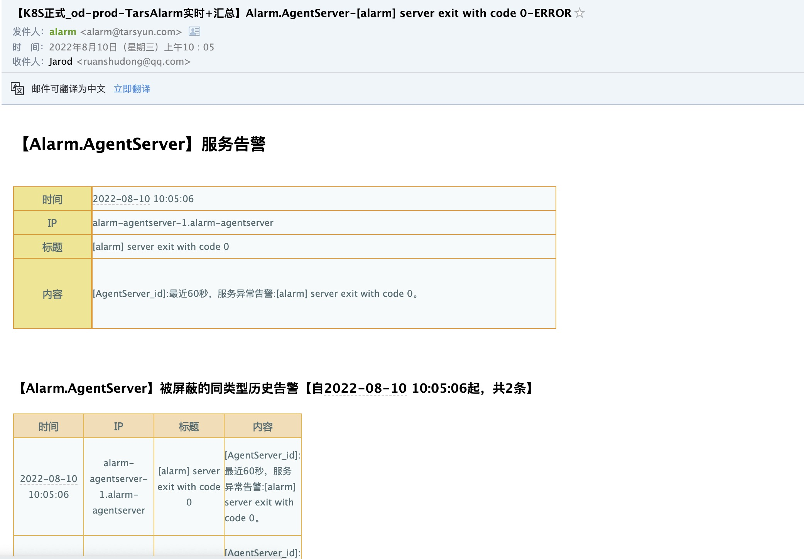
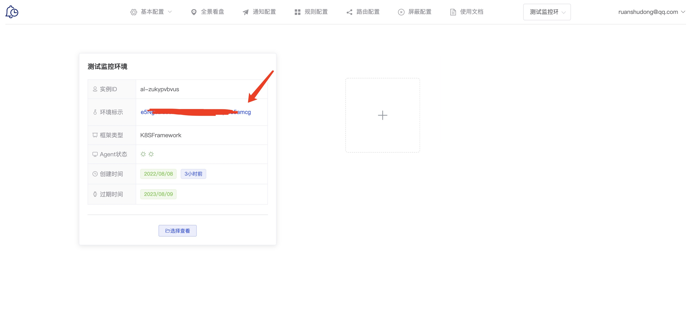
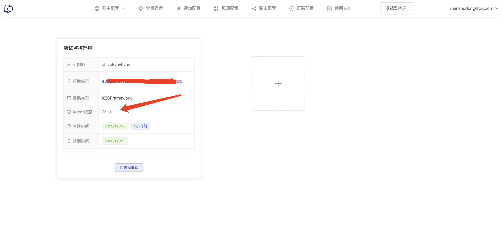

# TARS监控告警平台

## 背景和目标

通过云监控平台的形式来实现, 快速完成对TARS框架上服务的告警, 同时你可以扩展自己的告警项.

目前正在对外测试中, 欢迎试用...

比如当服务出现异常时, 会收到如下告警邮件:

## 主要功能

在默认设置中, 当TARS框架上的服务有以下情况时能实时发送邮件给相关人, 完成告警:

- 服务流量波动
- 请求处理延迟
- 异步队列阻塞
- 请求队列阻塞
- 服务notify异常(服务重启等)
- 瞬时异常流量预警
- 接口平均耗时告警
- 隔日平均耗时波动告警
- 隔日流量波动告警
- ...

**注意以上告警, 你无须做任何配置就可以完成!**

同时你也可以扩展告警项, 具体如果扩展告警项, 请安装完成后, 参考告警平台上的文档.

## 先决条件

- 请检查您的Tars框架的版本, 需要支持服务市场, 请参考文档: https://doc.tarsyun.com/#/base/market.md
- 告警系统采用saas模式实现, 且需要和您的TARS框架打通
- 通过服务市场在TARS框架上安装一个`Alarm.AgentServer`来完成和您的TARS框架的打通
- 安装`Alarm.AgentServer`的机器需要能访问外网

## 安装过程

- 请访问: http://alarm.k.tarsyun.com, 购买告警系统
- 每套TARS环境只需要购买一套告警系统即可
- 购买时请务必注意TARS框架的类型, 一旦选择无法变更, 请务必注意!
>- TARSFramework是非K8S方式部署的TARS框架(普通方式部署, 源码, docker部署都可以)
>- K8SFramework是基于K8SFramework(http://github.com/TarsCloud/K8SFramework)方案部署的TARS框架 
- 购买完成后, 页面上会展示Key, 复制该Key, 在安装agentserver时需要

- 在你的TarsWeb上, 打开服务市场, 安装`alarm/agentserver`
- 注意安装agentserver时, 配置文件中的 env_key请填写前面步骤中的key
- 安装完毕后, agentserver运行正常后, 在告警平台上可以看到agent的状态

## 初始化

- 为了能快速接收到告警, 请访问: http://alarm.k.tarsyun.com
- 选择刚刚创建的TARS环境
- 选择 基本配置 -> 联系人配置, 添加一个联系人, 注意设置这个联系人的邮箱
- 选择 通知配置, 创建一个通知, 应用可以使用 "*", 选择使用刚才的联系人

至此, 框架上服务出现异常, 即会发送告警消息到联系人.
## 其他功能

完成安装后, TARS框架的服务出现异常都可以实时通过邮件完成告警了, 当然告警的平台的功能非常强大, 还包括以下功能:
- 节假日处理
- 联系人/联系组管理
- 自定义告警项
- 告警阈值设定
- ...
更多细节请参考; http://alarm.k.tarsyun.com/alarms/index.html#/document

如果您有任何问题, 可以在TARS QQ群(515945105)中联系联系我们.

## 写在最后

对于某些公司而言, 无法通过saas平台来满足告警需求, 如果您有私有化部署的需求, 也可以联系我们!

最后: 为了更好的支持TARS的发展, 如果您有告警需要, 请付费购买相关服务, 多谢支持!

