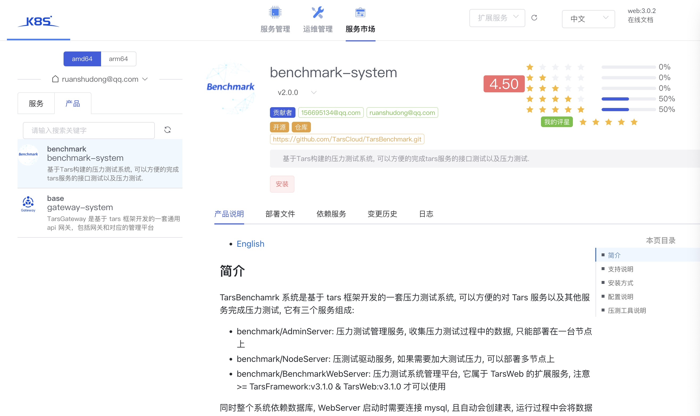

## 介绍

[tars benchmark](https://github.com/TarsCloud/TarsBenchmark)是专门为tars服务量身订做的无码压测工具，具备以下特性：

 - 网络高性能：8核机器TPS支持超过20W/S;
 - 通讯扩展性：网络层支持TCP/UDP两种协议方式;
 - 协议扩展性：应用层支持Http,Tars服务压测, 也保持对第三方协议开放;
 - 完善的实时统计与监控支持。提供周期内的请求数/TPS/耗时/成功率分布;

## 系统组成

它由三个服务组成:

- benchmark/AdminServer: 压力测试管理服务, 收集压力测试过程中的数据, 只能部署在一台节点上
- benchmark/NodeServer: 压测试驱动服务, 如果需要加大测试压力, 可以部署多节点上
- benchmark/BenchmarkWebServer: 压力测试系统管理平台, 它属于 TarsWeb 的扩展服务(>= tarscloud/framework:v3.0.10)

同时整个系统依赖数据库, BenchmarkWebServer 启动时需要连接 mysql, 且自动会创建表, 运行过程中会将压力测试数据结果写入到 db 中并展示在Web上.

## 支持说明

在 < TarsWeb:v3.0.3 之前, 压测管理平台(WebServer)被内置在 TarsWeb 中, 之后版本为了提供 TarsWeb 的扩展性, TarsWeb 支持了服务扩展化, 即你可以实现独立的 web 服务和 TarsWeb 整合到一起, 从而当子模块升级时无须升级 TarsWeb, 具体方式[请参考 TarsWeb 相关的文档](../base/plugins.md).

## 安装方式

推荐使用新版本(>= tarscloud/framework:v3.0.10) 时, 直接从云市场安装压力测试服务, 建议以容器方式启动, 这样不依赖操作系统 stdc++.so 的版本.

容器方式启动业务方式[请参考](../installation/service-docker.md)

## 配置说明

在安装压力测试系统时, 需要依赖 mysql, 因此在安装注意配置依赖的 mysql 地址

- BenchmarkWebServer 请修改`config.json`, 配置mysql地址

## 其他说明

具体说明, 请升级框架以后, 进入TarsWeb的服务市场, 在产品中选择压力测试系统查看, 如图:

