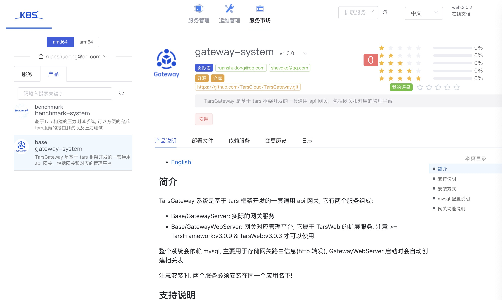

- [English](Gateway.en.md)

## 简介

[TarsGateway](https://github.com/TarsCloud/TarsGateway) 系统是基于 tars 框架开发的一套通用 api 网关, 它有两个服务组成:

- Base/GatewayServer: 实际的网关服务
- Base/GatewayWebServer: 网关对应管理平台, 它属于 TarsWeb 的扩展服务(>= tarscloud/framework:v3.0.10)

整个系统会依赖 mysql, 主要用于存储网关路由信息(http 转发), GatewayWebServer 启动时会自动创建相关表.

注意安装时, 两个服务必须安装在同一个应用名下!

## 支持说明

在< TarsWeb:v3.0.3 之前, 网关管理平台(GatewayWebServer)被内置在 TarsWeb 中, 之后版本为了提高 TarsWeb 的扩展性, TarsWeb 支持了服务扩展化, 即你可以实现独立的 web 服务和 TarsWeb 整合到一起, 从而当子模块服务升级时无须升级 TarsWeb, 具体方式[请参考 TarsWeb 相关的文档](../base/plugins.md).

## 安装方式

推荐使用新版本 >= tarscloud/framework:v3.0.10 时, 直接从云市场安装网关服务, 建议以容器方式启动网关, 这样不依赖操作系统 stdc++.so 的版本.

[容器方式启动业务方式请参考](https://doc.tarsyun.com/#/installation/service-docker.md)

## mysql 配置说明

在安装网关系统时, 需要依赖 mysql, 因此在安装注意配置依赖的 mysql 地址

- GatewayServer 请修改`GatewayServer.conf`
- GatewayWebServer 请修改`config.json`

数据库请使用同一个, 注意: 数据库`db_base`以及相关的表会被 GatewayWebServer 自动创建出来

## 其他说明

具体说明请升级框架以后, 进入TarsWeb的服务市场, 在产品中选择网关系统查看, 如图:

