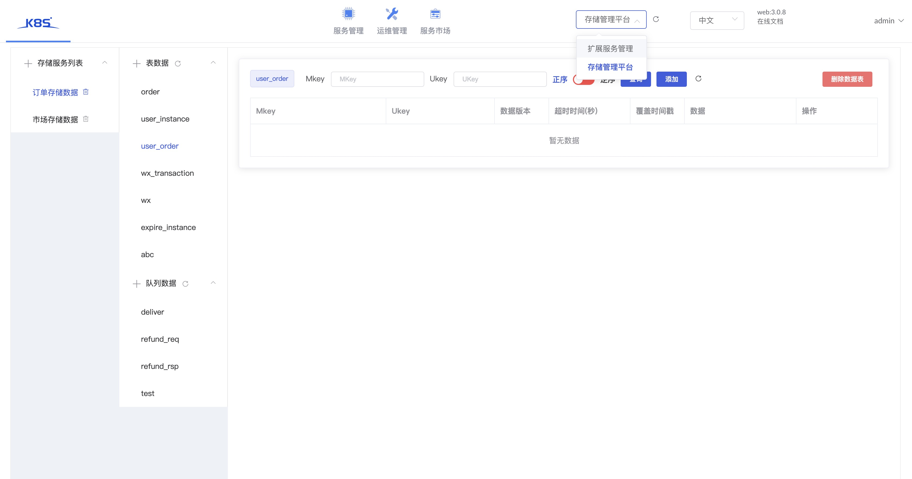
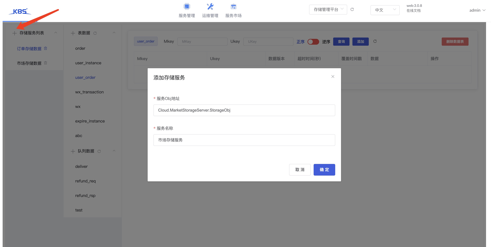

## 服务说明

[存储服务](./storage.md)对应的管理平台(要求storageserver版本>=v1.1.1)

- StorageServer的管理服务, 能够管理数据表以及增删数据.
- 安装后, 作为插件形式存在, 通过TarsWeb上的插件打开, 如下图:

## 管理存储数据

- 如图点击左上角, 录入实际存储服务的Obj, 关联存储服务.
- 关联后, 会展示存储服务的表和队列
- 你可以增删改查相关的数据
- 注意有权限管理

## 权限说明

- 数据权限和tarsweb上的权限打通
- 当用户在tarsweb平台拥有存储服务的开发权限, 数据可写
- 当用户在tarsweb平台拥有存储服务的运维权限, 数据可读/可写